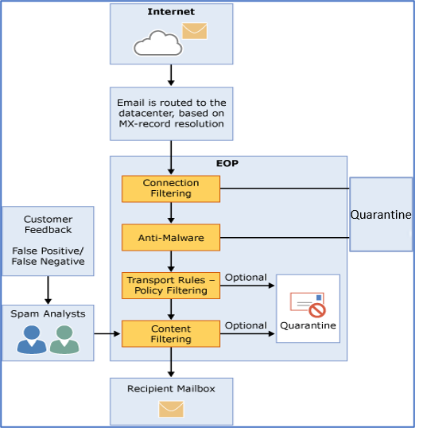

# Vue d'ensemble d'Exchange Online Protection

Microsoft Exchange Online Protection (EOP) est un service de filtrage du courrier électronique dans le nuage, qui contribue à protéger votre organisation contre le courrier indésirable et les logiciels malveillants, ainsi que contre les violations de politique de messagerie. EOP peut simplifier la gestion de votre environnement de messagerie et alléger bon nombre des tâches liées à la maintenance du matériel et des logiciels locaux.
  
Les principales manières d'utiliser EOP pour protéger la messagerie sont les suivantes :
  
- **Dans un scénario autonome** EOP fournit une protection de messagerie en nuage pour votre environnement Microsoft Exchange Server 2013 local, les versions d’Exchange Server héritées ou pour toute autre solution de messagerie SMTP locale. 
    
- **Dans le cadre d'une installation Microsoft Exchange Online** Par défaut, EOP protège les boîtes aux lettres Microsoft Exchange Online hébergées dans le nuage. Consultez la rubrique se [protéger contre les menaces](../protect-against-threats.md) pour vous aider à configurer ces fonctionnalités Exchange Online. 
    
- **Dans un déploiement hybride** EOP peut être configuré pour protéger votre environnement de messagerie et contrôler le routage de messagerie quand vous disposez d'une combinaison de boîtes aux lettres locales et en nuage. 

Ces articles relatifs à Exchange Online protection s’appliquent aux environnements hybrides et locaux. 
    
## Fonctionnement d'EOP

Pour comprendre le fonctionnement d'EOP, il est utile devoir comment le courrier entrant est traité :

  
Un message entrant passe initialement par le filtrage des connexions, qui vérifie la réputation de l’expéditeur et inspecte le message pour les programmes malveillants. La majorité du courrier indésirable est arrêtée à ce stade et supprimée par EOP. Les messages se poursuivent via le filtrage des stratégies, dans lequel les messages sont évalués par rapport aux règles de flux de messagerie personnalisées (également appelées règles de transport) que vous créez ou appliquez à partir d’un modèle. Par exemple, vous pouvez avoir une règle qui envoie une notification à un responsable lorsque le courrier électronique est envoyé par un expéditeur spécifique. (Les vérifications de la protection contre la perte de données se produisent également à ce stade, si vous disposez de cette fonctionnalité; pour plus d’informations sur la disponibilité des fonctionnalités, consultez la rubrique [Description du service de protection Exchange Online](https://go.microsoft.com/fwlink/p/?LinkId=320619).) Ensuite, les messages passent par le filtrage du contenu, où le contenu est vérifié pour la terminologie ou les propriétés communes au courrier indésirable. Un message déterminé comme étant du courrier indésirable par le filtre de contenu peut être envoyé dans le dossier de courrier indésirable d’un utilisateur ou en quarantaine, entre autres options, en fonction de vos paramètres. Une fois qu’un message a réussi à transmettre tous ces calques de protection, il est remis au destinataire.
  
### Centres de données EOP

EOP s'exécute sur un réseau mondial de centres de données conçus pour offrir une disponibilité optimale. Par exemple, si un centre de données devient indisponible, les courriers électroniques sont automatiquement routés vers un autre centre de données sans interruption du service. Les serveurs de chaque centre de données acceptent les messages à votre place, en créant une couche de séparation entre votre organisation et Internet, réduisant ainsi la charge pesant sur vos serveurs. Grâce à ce réseau à haut niveau de disponibilité, Microsoft peut garantir que le courrier atteint votre organisation en temps opportun. 
  
EOP effectue l'équilibrage de charge entre les centres de données, mais uniquement au sein d'une région. Si votre système est mis en service dans une région, tous vos messages seront traités sur la base du routage de courrier propre à cette région. La liste suivante présente le fonctionnement du routage de courrier régional pour les centres de données EOP :
  
    
- En Europe, au Moyen-Orient et en Afrique (région EMEA), toutes les boîtes aux lettres Exchange Online sont situées dans des centres de données EMEA et tous les messages sont routés via des centres de données EMEA pour le filtrage EOP.
    
- Dans la région Asie Pacifique (APAC), toutes les boîtes aux lettres Exchange Online sont situées dans des centres de contenu APAC, et les messages sont actuellement routés via des centres de contenu APAC pour le filtrage EOP.

- Dans l’Amérique, toutes les boîtes aux lettres Exchange Online sont situées dans les centres de l’Europe, à l’exception de l’Amérique du Sud où sont utilisées les centres de contenu au Brésil et au Chili et au Canada, où sont utilisées les centres de contenu au Canada. Tous les messages électroniques, y compris les messages destinés aux clients en Amérique du Sud et au Canada, sont acheminés via des centres de centres locaux pour le filtrage EOP; quaratined le courrier électronique est stocké dans le centre de contenu où se trouve le client.
    
- En ce qui concerne le nuage communautaire propre aux gouvernements (CCG), toutes les boîtes aux lettres Exchange Online sont situées dans des centres de données américains et tous les messages sont routés via ces centres de données pour le filtrage EOP.
    
## Plans et fonctionnalités d’EOP

Les plans d'abonnement EOP disponibles sont les suivants :
  
- **EOP autonome** EOP protège vos boîtes de données locales. 
    
- **Fonctionnalités EOP dans Exchange Online** EOP protège vos boîtes aux lettres Exchange Online en nuage. 
    
- **Licence d'accès client Exchange Enterprise avec Services** EOP protège vos boîtes aux lettres sur site, comme EOP autonome, et inclut des fonctionnalités de protection contre la perte de données et de reporting à l'aide de services web. 
    
Pour plus d'informations sur la configuration requise, les limites importantes et la disponibilité des fonctionnalités dans tous les plans d'abonnement EOP, voir [Description du service de protection Exchange Online](https://go.microsoft.com/fwlink/p/?LinkId=320619).
  
## Configuration d'EOP

La configuration d'EOP peut être simple, en particulier dans le cas d'une organisation de taille modeste appliquant un nombre restreint de règles de conformité. En revanche, si votre organisation est de grande taille, avec plusieurs domaines, des règles de conformité personnalisées ou un flux de messagerie hybride, la configuration peut nécessiter plus de temps et de travail de planification.
  
Si vous avez déjà acheté EOP, consultez la rubrique [Configurer votre service EOP](set-up-your-eop-service.md) pour être certain d'accomplir toutes les étapes nécessaires à la configuration d'EOP pour la protection de votre environnement de messagerie. 
  
## Pour plus d’informations

[Fonctionnalités EOP](eop-features.md)
  
[FAQ d’ordre général concernant EOP](eop-general-faq.md)
  
Questions fréquemment posées sur les messages mis en file d’attente, différés et retournés dans EOP
  
[FAQ sur l’administration déléguée](delegated-administration-faq.md)
  
[Déplacement de domaines et de paramètres d'une organisation EOP vers une autre organisation EOP](move-domains-and-settings-from-one-eop-organization-to-another-eop-organization.md)
  

