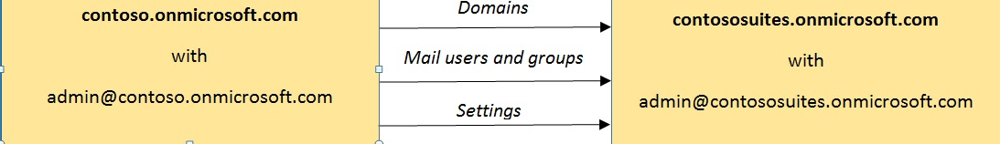

# <a name="move-domains-and-settings-from-one-eop-organization-to-another-eop-organization"></a>Déplacement de domaines et de paramètres d'une organisation EOP vers une autre organisation EOP

L'évolution des besoins professionnels peut parfois imposer de séparer une organisation Microsoft Exchange Online Protection (EOP) (locataire) en deux organisations distinctes, de fusionner deux organisations en une seule ou de déplacer vos domaines et vos paramètres EOP d'une organisation vers une autre. Le déplacement d'une organisation EOP vers une deuxième organisation EOP peut être difficile, mais avec quelques scripts Windows PowerShell à distance basiques et un peu de préparation, cette opération peut être réalisée dans une fenêtre de maintenance relativement courte. 
  
> [!NOTE]
>  Paramètres peuvent être fiable déplacés uniquement à partir d’une organisation (Standard) à une autre EOP Standard ou une licence d’accès client Exchange Enterprise avec l’organisation de Services (Premium EOP) de EOP autonome ou d’une organisation EOP Premium vers une autre organisation EOP Premium. Étant donné que certaines fonctionnalités premium ne sont pas pris en charge dans les organisations EOP Standard, déplacement d’une organisation EOP Premium vers une organisation EOP Standard peuvent ne pas être réussie. > Ces instructions sont pour les organisations uniquement le filtrage EOP. Il existe des considérations supplémentaires de déplacement d’une organisation Exchange Online vers une autre organisation Exchange Online. Les organisations Exchange Online sont hors de portée pour ces instructions. 
  
Dans l'exemple suivant, Contoso, Ltd. a fusionné avec Contoso Suites. L'image suivante illustre le processus de déplacement des domaines, des utilisateurs et groupes de messagerie, et des paramètres depuis l'organisation EOP source (contoso.onmicrosoft.com) vers l'organisation EOP cible (contososuites.onmicrosoft.com) :
  

  
Le déplacement des domaines d'une organisation à une autre présente un défi de taille : un domaine vérifié ne peut pas exister dans deux organisations en même temps. Les étapes suivantes vous aident à résoudre ces difficultés.
      
## <a name="step-1-collect-data-from-the-source-organization"></a>Étape 1 : Collecter les données de l’organisation source

Afin de recréer l’organisation source dans l’organisation cible, veillez à collecter et stocker les informations suivantes concernant l’organisation source :
  
- Domaines
    
- Utilisateurs de messagerie
    
- Groupes
    
- Filtres de contenu anti-courrier indésirable
    
- Filtres de contenu anti-logiciel malveillant
    
- Connecteurs
    
- Règles de transport
    
    > [!NOTE]
    > La prise en charge de la cmdlet pour l'exportation et l'importation de la Collection de règles de transport est possible uniquement pour les plans de souscription EOP Premium. 
  
Le moyen le plus simple pour collecter tous vos paramètres consiste à utiliser la session Windows PowerShell à distance. Pour vous connecter à EOP à l'aide de la session Windows PowerShell à distance, consultez la rubrique [Connexion à Exchange Online Protection à l'aide d'une session PowerShell distante](http://technet.microsoft.com/library/054e0fd7-d465-4572-93f8-a00a9136e4d1.aspx).
  
Ensuite, vous pouvez collecter tous vos paramètres et les exporter vers un fichier .xml à importer dans le locataire cible. En général, vous pouvez orienter la sortie de la cmdlet **Get** pour chaque paramètre vers la cmdlet **Export-Clixml** afin d'enregistrer les paramètres dans des fichiers .xml, tel qu'illustré dans l'exemple de code ci-après. 
  
Une fois que vous êtes connecté à une session Windows PowerShell à distance, créez un répertoire intitulé Export à un emplacement facile à trouver et accédez à ce répertoire. Par exemple :
  
```
mkdir C:\EOP\Export
```

```
cd C:\EOP\Export
```

Le script suivant peut être utilisé pour recueillir tous les utilisateurs de messagerie, les groupes, les paramètres anti-courrier indésirable, les paramètres anti-logiciel malveillant, les connecteurs et les règles de transport dans l’organisation source. Copiez-collez le texte suivant dans un éditeur de texte comme le Bloc-notes, enregistrez le fichier sous le nom Source_EOP_Settings.ps1 dans le répertoire Export que vous venez de créer et exécutez la commande suivante :
  
```
&amp; "C:\EOP\Export\Source_EOP_Settings.ps1"

```

```
#****************************************************************************
# Export Domains
#*****************************************************************************
Get-AcceptedDomain | Export-Clixml Domains.xml
#****************************************************************************
# Export mail users
#
#****************************************************************************
Get-Recipient -ResultSize unlimited -RecipientTypeDetails MailUser | Export-Clixml MailUsers.xml
#****************************************************************************
# Groups
#
# If you're using directory synchronization, you can skip this step and 
# simply sync to the target 
# tenant.
# First, you need to capture information about the distribution groups.
#****************************************************************************
Get-Recipient -ResultSize unlimited -RecipientTypeDetails MailUniversalDistributionGroup | Export-Clixml DistributionGroups.xml
Get-Recipient -ResultSize unlimited -RecipientTypeDetails MailUniversalSecurityGroup | Export-Clixml SecurityGroups.xml 
#****************************************************************************
# And then we'll use that output to loop through each group and get the 
# members.
#****************************************************************************
$DGs = Import-Clixml .\DistributionGroups.xml
ForEach ($dg in $DGs) {Get-DistributionGroupMember -Identity $dg.name | Export-Clixml $dg.ExternalDirectoryObjectId}
$SGs = Import-Clixml .\SecurityGroups.xml
ForEach ($sg in $SGs) {Get-DistributionGroupMember -Identity $sg.name | Export-Clixml $sg.ExternalDirectoryObjectId} 
#*****************************************************************************
# Export dynamic distribution groups - EOP Premium Only
#
# If you're using directory synchronization, then you can skip this step and simply 
# sync to the target tenant.
#*****************************************************************************
Get-DynamicDistributionGroup -ResultSize unlimited | Export-Clixml DynamicDistributionGroups.xml
#*****************************************************************************
# Export mail contacts - EOP Premium Only
#
# If you're using directory synchronization, then you can skip this step and simply 
# sync to the target tenant.
#*****************************************************************************
Get-MailContact -ResultSize unlimited -RecipientTypeDetails MailContact | Export-Clixml MailContacts.xml
#****************************************************************************
# Anti-spam
#****************************************************************************
Get-HostedConnectionFilterPolicy | Export-Clixml HostedConnectionFilterPolicy.xml
Get-HostedContentFilterPolicy | Export-Clixml HostedContentFilterPolicy.xml
Get-HostedContentFilterRule | Export-Clixml HostedContentFilterRule.xml
Get-HostedOutboundSpamFilterPolicy | Export-Clixml HostedOutboundSpamFilterPolicy.xml
#****************************************************************************
# Anti-malware content filters
#****************************************************************************
Get-MalwareFilterPolicy | Export-Clixml MalwareFilterPolicy.xml
Get-MalwareFilterRule | Export-Clixml MalwareFilterRule.xml
#****************************************************************************
# Connectors
#****************************************************************************
Get-InboundConnector | Export-Clixml InboundConnector.xml
Get-OutboundConnector | Export-Clixml OutboundConnector.xml
#****************************************************************************
# Exchange transport rules
#****************************************************************************
$file = Export-TransportRuleCollection
Set-Content -Path ".TransportRules.xml" -Value $file.FileData -Encoding Byte

```

Exécutez les commandes suivantes dans le répertoire Export pour mettre à jour les fichiers .xml dans l’organisation cible. Remplacez contoso.onmicrosoft.com et contososuites.onmicrosoft.com par les noms de vos organisations source et cible.
  
```
$files = ls
ForEach ($file in $files) { (Get-Content $file.Name) | Foreach-Object {$_ -replace 'contoso.onmicrosoft.com', 'contososuites.onmicrosoft.com'} | Set-Content $file.Name}
```

## <a name="step-2-add-domains-to-the-target-organization"></a>Étape 2 : Ajouter des domaines dans l’organisation cible

Ajoutez des domaines dans l’organisation cible à l’aide du script suivant. Copiez-collez le texte suivant dans un éditeur de texte comme le Bloc-notes, enregistrez le script sous C:\EOP\Export\Add_Domains.ps1 et exécutez la commande suivante :
  
```
&amp; "C:\EOP\Export\Add_Domains.ps1"
```

Ces domaines ne seront pas vérifiés et ne peuvent pas être utilisés pour acheminer le courrier, mais une fois que les domaines sont ajoutés, vous pouvez collecter les informations nécessaires pour vérifier les domaines et même mettre à jour vos enregistrements MX (serveur de messagerie) pour le nouveau locataire.
  
```
#***********************************************************************
# Login to Azure Active Directory
#*****************************************************************************
$msolcred = Get-Credential
connect-msolservice -credential $msolcred
#****************************************************************************
# Add domains
#****************************************************************************
$Domains = Import-Clixml ".\Domains.xml"
Foreach ($domain in $Domains) {
    New-MsolDomain -Name $domain.Name
} 

```

Désormais, vous pouvez collecter et analyser les informations du Centre d'administration Office 365 de votre organisation cible, de telle sorte que vous pouvez rapidement vérifier vos domaines, le moment venu :
  
1. Connectez-vous au Centre d'administration Office 365 à l'adresse [https://portal.office.com](https://portal.office.com).
    
2. Cliquez sur **Domaines**.
    
3. Cliquez sur chaque lien **Démarrer l'installation** et suivez les étapes de l'assistant d'installation. 
    
4. Dans la page **Confirmer que vous êtes le propriétaire**, pour **Reportez-vous aux instructions étape par étape pour exécuter cette étape avec**, sélectionnez **Instructions générales**.
    
5. Sauvegardez l'enregistrement MX ou l'enregistrement TXT dossier que vous allez utiliser pour vérifier votre domaine, puis fermez l'assistant d'installation.
    
6. Ajoutez les enregistrements TXT de vérification à vos enregistrements DNS. Vous pourrez ainsi vérifier plus rapidement les domaines de l'organisation source après leur retrait de l'organisation cible. Pour plus d'informations sur la configuration du DNS, consultez la rubrique [Créer des enregistrements DNS pour Office 365 lorsque vous gérez vos enregistrements DNS](https://go.microsoft.com/fwlink/p/?LinkId=304219).
    
## <a name="step-3-force-senders-to-queue-mail"></a>Étape 3 : Forcer les expéditeurs à mettre les messages en attente

Tout en déplaçant vos domaines d'un locataire vers un autre, vous devrez supprimer les domaines de l'organisation source, puis les vérifier dans votre organisation cible. Pendant ce temps, vous ne pourrez pas acheminer les messages via EOP.
  
Une des manières de forcer les expéditeurs à mettre les messages en attente consiste à mettre à jour vos enregistrements MX pour qu'ils pointent directement vers votre serveur de messagerie local.
  
Une autre option consiste à placer un enregistrement MX non valide dans chaque domaine où sont conservés les enregistrements DNS de votre domaine (également connu comme service d'hébergement DNS). L'expéditeur doit alors mettre vos messages en attente et retenter l'opération (les nouvelles tentatives ont généralement lieu sous 48 heures, mais cela peut varier d'un fournisseur à l'autre). Vous pouvez utiliser invalid.outlook.com comme cible MX non valide. L'abaissement de la durée de vie (TTL) à cinq minutes pour l'enregistrement MX permet de propager plus rapidement la modification aux fournisseurs DNS.
  
Pour plus d'informations sur la configuration du DNS, consultez la rubrique [Créer des enregistrements DNS pour Office 365 lorsque vous gérez vos enregistrements DNS](https://go.microsoft.com/fwlink/p/?LinkId=304219).
  
> [!IMPORTANT]
> Chaque fournisseur met les messages en attente pour des durées différentes. Vous devrez configurer rapidement votre nouveau locataire et rétablir vos paramètres DNS afin d'éviter l'envoi de rapports de non-remise (NDR) à l'expéditeur lors de l'expiration du délai d'attente. 
  
## <a name="step-4-remove-users-groups-and-domains-from-the-source-organization"></a>Étape 4 : Supprimer les utilisateurs, les groupes et les domaines de l’organisation source

Le script suivant supprime les utilisateurs, les groupes et les domaines du locataire source en utilisant Azure Active Directory pour la session Windows PowerShell à distance. Copiez-collez le texte suivant dans un éditeur de texte comme le Bloc-notes, enregistrez le fichier sous C:\EOP\Export\Remove_Users_and_Groups.ps1 et exécutez la commande suivante :
  
```
&amp; "C:\EOP\Export\Remove_Users_and_Groups.ps1"
```

```
#*****************************************************************************
# Login to Azure Active Directory
#*****************************************************************************
$msolcred= Get-Credential
connect-msolservice -credential $msolcred
#*****************************************************************************
# Remove users
#*****************************************************************************
$Users = Get-MSOLUser -All | sort UserPrincipalName
$user_count = $Users.count
write-host "Removing $user_count users."
Foreach ($User in $Users) {
write-host $User.UserPrincipalName
$User | Remove-MSOLUser -Force
}
#*****************************************************************************
# Remove groups
#*****************************************************************************
Get-MSOLGroup | Remove-MSOLGroup -Force
#*****************************************************************************
# Remove domains
# Note: Your onmicrosoft.com domain should be the default domain
#*****************************************************************************
$Domains = Get-MsolDomain
$Domain_count = $Domains.count
write-host "Removing $Domain_count domains."
Foreach ($Domain in $Domains) {
write-host $Domain.Name
Remove-MsolDomain -DomainName $Domain.Name -Force
} 

```

## <a name="step-5-verify-domains-for-the-target-organization"></a>Étape 5 : Vérifier les domaines de l’organisation cible

1. Connectez-vous au Centre d'administration Office 365 à l'adresse [https://portal.office.com](https://portal.office.com).
    
2. Cliquez sur **Domaines**.
    
3. Cliquez sur chaque lien **Démarrer l'installation** pour le domaine cible et suivez les étapes de l'assistant d'installation. 
    
## <a name="step-6-add-mail-users-and-groups-to-the-target-organization"></a>Étape 6 : Ajouter des utilisateurs de messagerie et des groupes à l'organisation cible

Une meilleure pratique pour EOP consiste à utiliser Azure Active Directory pour synchroniser votre système Active Directory sur site sur votre client cible. Pour connaître la procédure détaillée, consultez la rubrique « Utilisation de la synchronisation d'annuaires pour gérer les utilisateurs de messagerie » dans [Gestion des utilisateurs de messagerie dans EOP](manage-mail-users-in-eop.md). Vous pouvez également utiliser le script suivant pour recréer vos utilisateurs et vos groupes à partir de votre client source. Remarque : les mots de passe utilisateur ne peuvent pas être déplacés. D'autres mots de passe utilisateur sont créés et enregistrés dans le fichier intitulé UsersAndGroups.ps1. (Pour plus d'informations sur la réinitialisation de votre mot de passe, consultez la rubrique [Réinitialiser le mot de passe d'un utilisateur](https://office.microsoft.com/en-us/office365-suite-help/reset-a-user-s-password-HA102816058.aspx).)
  
Pour utiliser le script, copiez-collez le texte suivant dans un éditeur de texte comme le Bloc-notes, enregistrez le fichier sous C:\EOP\Export\Add_Users_and_Groups.ps1 et exécutez la commande suivante :
  
```
&amp; "C:\EOP\Export\Add_Users_and_Groups.ps1"
```

```
#***********************************************************************
# makeparam helper function
#****************************************************************************
function makeparam ([string]$ParamName, [string[]] $ParamValue) {
    $FormattedParam = ""
    If($ParamValue.Count -gt 0) {
        $FormattedParam = " -$ParamName "
        Foreach ($value in $ParamValue) {
        If($value -eq "True") {$FormattedParam = " -$ParamName" + ":`$True,"}
        else{
            If($value -eq "False") {$FormattedParam = " -$ParamName" + ":`$False,"}
                else{$FormattedParam += "`"$value`","}
            }
        }
        $FormattedParam = $FormattedParam.TrimEnd(",")
    }
    Return $FormattedParam       
 } 
#****************************************************************************
# Variables
#****************************************************************************
$outfile = ".\UsersAndGroups.ps1"
rm -erroraction 'silentlycontinue' $outfile
#****************************************************************************
# Add mail users
#****************************************************************************
$rand = New-Object System.Random -ArgumentList (get-date).millisecond
$MailUsers = Import-Clixml ".\MailUsers.xml"
$MailUsersCount = $MailUsers.Name.Count
if($MailUsersCount -gt 0){
    Write-Host "Importing $MailUsersCount Mail Users"
    ForEach ($MailUser in $MailUsers) {
        $MailUsersCmdlet = "New-MailUser"
        If((Get-PSSession).ComputerName.Contains("ps.protection")) {
            $DistributionGroupsCmdlet = "New-EOPMailUser"
        }
        $MailUsersCmdlet += makeparam "LastName" $MailUser.LastName
        $MailUsersCmdlet += makeparam "FirstName" $MailUser.FirstName
        $MailUsersCmdlet += makeparam "DisplayName" $MailUser.DisplayName
        $MailUsersCmdlet += makeparam "Name" $MailUser.Name
        $MailUsersCmdlet += makeparam "Alias" $MailUser.Alias
        $MailUsersCmdlet += makeparam "MicrosoftOnlineServicesID" $MailUser.MicrosoftOnlineServicesID
        $MailUsersCmdlet += makeparam "ExternalEmailAddress" $MailUser.ExternalEmailAddress
        
        # Generate a new 10 character password
        $NewPassword = ""
        1..10 | ForEach { $NewPassword = $NewPassword + [char]$rand.next(40,127) }
        
        $MailUsersCmdlet += " -Password (ConvertTo-SecureString -String '$NewPassword' -AsPlainText -Force)"
        Add-Content $outfile "`n$MailUsersCmdlet"
    }
}
#****************************************************************************
# Add distribution groups
#****************************************************************************
$DistributionGroups = Import-Clixml ".\DistributionGroups.xml"
$DistributionGroupsCount = $DistributionGroups.Name.Count
if($DistributionGroupsCount -gt 0){
    Write-Host "Importing $DistributionGroupsCount Distribution Groups"
    ForEach ($DistributionGroup in $DistributionGroups) {
        $DistributionGroupsCmdlet = "New-DistributionGroup"
        If((Get-PSSession).ComputerName.Contains("ps.protection")) {
            $DistributionGroupsCmdlet = "New-EOPDistributionGroup"
        }
        $DistributionGroupsCmdlet += makeparam "Name" $DistributionGroup.Name
        $DistributionGroupsCmdlet += makeparam "Alias" $DistributionGroup.Alias
        $DistributionGroupsCmdlet += makeparam "DisplayName" $DistributionGroup.DisplayName
        $DistributionGroupsCmdlet += makeparam "ManagedBy" $DistributionGroup.ManagedBy
        
        $DistributionGroupsCmdlet += makeparam "Notes" $DistributionGroup.Notes
        $DistributionGroupsCmdlet += makeparam "PrimarySmtpAddress" $DistributionGroup.PrimarySmtpAddress
        $DistributionGroupsCmdlet += makeparam "Type" $DistributionGroup.Type
        $MembersCmdlet = "@("
        $memberslist = Import-Clixml $DistributionGroup.ExternalDirectoryObjectId
        ForEach ($user in $memberslist) {
            $MembersCmdlet += "`"$user.Name`","
        }
        $MembersCmdlet = $MembersCmdlet.TrimEnd(",")
        $MembersCmdlet += ")"
    }
    Add-Content $outfile "`n$DistributionGroupsCmdlet"
}
#****************************************************************************
# Add security groups
#****************************************************************************
$SecurityGroups = Import-Clixml ".\SecurityGroups.xml"
$SecurityGroupsCount = $SecurityGroups.Name.Count
if($SecurityGroupsCount -gt 0){
    Write-Host "Importing $SecurityGroupsCount Security Groups"
    ForEach ($SecurityGroup in $SecurityGroups) {
        $SecurityGroupsCmdlet = "New-SecurityGroup"
        If((Get-PSSession).ComputerName.Contains("ps.protection")) {
            $DistributionGroupsCmdlet = "New-EOPSecurityGroup"
        }
        $SecurityGroupsCmdlet += makeparam "Name" $SecurityGroup.Name
        $SecurityGroupsCmdlet += makeparam "Alias" $SecurityGroup.Alias
        $SecurityGroupsCmdlet += makeparam "DisplayName" $SecurityGroup.DisplayName
        $SecurityGroupsCmdlet += makeparam "ManagedBy" $SecurityGroup.ManagedBy
        
        $SecurityGroupsCmdlet += makeparam "Notes" $SecurityGroup.Notes
        $SecurityGroupsCmdlet += makeparam "PrimarySmtpAddress" $SecurityGroup.PrimarySmtpAddress
        $SecurityGroupsCmdlet += makeparam "Type" $SecurityGroup.Type
        $MembersCmdlet = "@("
        $memberslist = Import-Clixml $SecurityGroup.ExternalDirectoryObjectId
        ForEach ($user in $memberslist) {
            $MembersCmdlet += "`"$user.Name`","
        }
        $MembersCmdlet = $MembersCmdlet.TrimEnd(",")
        $MembersCmdlet += ")"
    }
    Add-Content $outfile "`n$SecurityGroupsCmdlet"
}
#****************************************************************************
# Add Dynamic Distribution Groups
#****************************************************************************
If((Get-PSSession).ComputerName.Contains("ps.protection")) {
    write-Host "No Synamic Distribution Groups for EOP Standard organizations."
}else{
    $DynamicDistributionGroups = Import-Clixml ".\DynamicDistributionGroups.xml"
    $DynamicDistributionGroupsCount = $DynamicDistributionGroups.Name.Count
    if($DynamicDistributionGroupsCount -gt 0){
        Write-Host "Importing $DynamicDistributionGroupsCount Dynamic Distribution Groups"
        foreach ($DynamicDistributionGroup in $DynamicDistributionGroups) {
            $DynamicDistributionGroupsCmdlet = "New-DynamicDistributionGroup" 
            $DynamicDistributionGroupsCmdlet += " -Confirm:`$False"
            $DynamicDistributionGroupsCmdlet += makeparam "DisplayName" $DynamicDistributionGroup.DisplayName 
            $DynamicDistributionGroupsCmdlet += makeparam "ModeratedBy" $DynamicDistributionGroup.ModeratedBy 
            $DynamicDistributionGroupsCmdlet += makeparam "ModerationEnabled" $DynamicDistributionGroup.ModerationEnabled 
            $DynamicDistributionGroupsCmdlet += makeparam "Name" $DynamicDistributionGroup.Name 
            $DynamicDistributionGroupsCmdlet += makeparam "PrimarySmtpAddress" $DynamicDistributionGroup.PrimarySmtpAddress 
            $DynamicDistributionGroupsCmdlet += makeparam "RecipientContainer" $DynamicDistributionGroup.RecipientContainer
            $RecipientFilterParam =  makeparam "RecipientFilter" $DynamicDistributionGroup.RecipientFilter
            $RecipientFilterParam = " -RecipientFilter {" + $RecipientFilterParam.Substring(19)
            $RecipientFilterParam = $RecipientFilterParam.Substring(0,$RecipientFilterParam.Length-1)
            $RecipientFilterParam += "}"
            $DynamicDistributionGroupsCmdlet +=  $RecipientFilterParam
            $DynamicDistributionGroupsCmdlet += makeparam "SendModerationNotifications" $DynamicDistributionGroup.SendModerationNotifications 
            Add-Content $outfile "`n$DynamicDistributionGroupsCmdlet"
        }
    
    }else{ 
        Write-Host "No Dynamic Distribution Groups to add."
    }
} 
#****************************************************************************
# Add Mail Contacts
#****************************************************************************
If((Get-PSSession).ComputerName.Contains("ps.protection")) {
    write-Host "No Mail Contact for EOP Standard organizations."
}else{
    $MailContacts = Import-Clixml ".\MailContacts.xml"
    $MailContactsCount = $MailContacts.Name.Count
    if($MailContactsCount -gt 0){
        Write-Host "Importing $MailContactsCount Dynamic Distribution Groups"
        foreach ($MailContact in $MailContacts) {
            $MailContactsCmdlet = "New-MailContact" 
            $MailContactsCmdlet += makeparam "UsePreferMessageFormat" $MailContact.UsePreferMessageFormat
            $MailContactsCmdlet += makeparam "DisplayName" $MailContact.DisplayName
            $MailContactsCmdlet += makeparam "ModeratedBy" $MailContact.ModeratedBy
            $MailContactsCmdlet += makeparam "Name" $MailContact.Name
            $MailContactsCmdlet += makeparam "MessageBodyFormat" $MailContact.MessageBodyFormat
            $MailContactsCmdlet += makeparam "OrganizationalUnit" $MailContact.OrganizationalUnit
            $MailContactsCmdlet += makeparam "Initials" $MailContact.Initials
            $MailContactsCmdlet += makeparam "MessageFormat" $MailContact.MessageFormat
            $MailContactsCmdlet += makeparam "ModerationEnabled" $MailContact.ModerationEnabled
            $MailContactsCmdlet += makeparam "MacAttachmentFormat" $MailContact.MacAttachmentFormat
            $MailContactsCmdlet += makeparam "SendModerationNotifications" $MailContact.SendModerationNotifications
            $MailContactsCmdlet += " -Confirm:`$False"
            $MailContactsCmdlet += makeparam "ExternalEmailAddress" $MailContact.ExternalEmailAddress
            $MailContactsCmdlet += makeparam "FirstName" $MailContact.FirstName
            $MailContactsCmdlet += makeparam "Alias" $MailContact.Alias
            Add-Content $outfile "`n$MailContactsCmdlet"
        }
    
    }else{ 
        Write-Host "No Mail Contacts to add."
    }
}
#***********************************************************************
# makeparam helper function
#************************************************************************
 function makeparam ([string]$ParamName, [string[]] $ParamValue) {
    $FormattedParam = ""
    If($ParamValue.Count -gt 0) {
        $FormattedParam = " -$ParamName "
        Foreach ($value in $ParamValue) {
        If($value -eq "True") {$FormattedParam = " -$ParamName" + ":`$True,"}
        else{
            If($value -eq "False") {$FormattedParam = " -$ParamName" + ":`$False,"}
                else{$FormattedParam += "`"$value`","}
            }
        }
        $FormattedParam = $FormattedParam.TrimEnd(",")
    }
    Return $FormattedParam       
 } 
#****************************************************************************
# Variables
#****************************************************************************
$outfile = ".\UsersAndGroups.ps1"
rm -erroraction 'silentlycontinue' $outfile
#****************************************************************************
# Add mail users
#****************************************************************************
$rand = New-Object System.Random -ArgumentList (get-date).millisecond
$MailUsers = Import-Clixml ".\MailUsers.xml"
$MailUsersCount = $MailUsers.Name.Count
if($MailUsersCount -gt 0){
    Write-Host "Importing $MailUsersCount Mail Users"
    ForEach ($MailUser in $MailUsers) {
        $MailUsersCmdlet = "New-EOPMailUser"
        $MailUsersCmdlet += makeparam "LastName" $MailUser.LastName
        $MailUsersCmdlet += makeparam "FirstName" $MailUser.FirstName
        $MailUsersCmdlet += makeparam "DisplayName" $MailUser.DisplayName
        $MailUsersCmdlet += makeparam "Name" $MailUser.Name
        $MailUsersCmdlet += makeparam "Alias" $MailUser.Alias
        $MailUsersCmdlet += makeparam "MicrosoftOnlineServicesID" $MailUser.MicrosoftOnlineServicesID
        $MailUsersCmdlet += makeparam "ExternalEmailAddress" $MailUser.ExternalEmailAddress
        
        # Generate a new 10 character password
        $NewPassword = ""
        1..10 | ForEach { $NewPassword = $NewPassword + [char]$rand.next(40,127) }
        
        $MailUsersCmdlet += " -Password (ConvertTo-SecureString -String '$NewPassword' -AsPlainText -Force)"
        Add-Content $outfile "`n$MailUsersCmdlet"
    }
}
#****************************************************************************
# Add distribution groups
#****************************************************************************
$DistributionGroups = Import-Clixml ".\DistributionGroups.xml"
$DistributionGroupsCount = $DistributionGroups.Name.Count
if($DistributionGroupsCount -gt 0){
    Write-Host "Importing $DistributionGroupsCount Distribution Groups"
    ForEach ($DistributionGroup in $DistributionGroups) {
        $DistributionGroupsCmdlet = "New-EOPDistributionGroup"
        $DistributionGroupsCmdlet += makeparam "Name" $DistributionGroup.Name
        $DistributionGroupsCmdlet += makeparam "Alias" $DistributionGroup.Alias
        $DistributionGroupsCmdlet += makeparam "DisplayName" $DistributionGroup.DisplayName
        $DistributionGroupsCmdlet += makeparam "ManagedBy" $DistributionGroup.ManagedBy
        
        $DistributionGroupsCmdlet += makeparam "Notes" $DistributionGroup.Notes
        $DistributionGroupsCmdlet += makeparam "PrimarySmtpAddress" $DistributionGroup.PrimarySmtpAddress
        $DistributionGroupsCmdlet += makeparam "Type" $DistributionGroup.Type
        $MembersCmdlet = "@("
        $memberslist = Import-Clixml $DistributionGroup.ExternalDirectoryObjectId
        ForEach ($user in $memberslist) {
            $MembersCmdlet += "`"$user.Name`","
        }
        $MembersCmdlet = $MembersCmdlet.TrimEnd(",")
        $MembersCmdlet += ")"
    }
    Add-Content $outfile "`n$DistributionGroupsCmdlet"
}
#****************************************************************************
# Add security groups
#****************************************************************************
$SecurityGroups = Import-Clixml ".\SecurityGroups.xml"
$SecurityGroupsCount = $SecurityGroups.Name.Count
if($SecurityGroupsCount -gt 0){
    Write-Host "Importing $SecurityGroupsCount Security Groups"
    ForEach ($SecurityGroup in $SecurityGroups) {
        $SecurityGroupsCmdlet = "New-EOPSecurityGroup"
        $SecurityGroupsCmdlet += makeparam "Name" $SecurityGroup.Name
        $SecurityGroupsCmdlet += makeparam "Alias" $SecurityGroup.Alias
        $SecurityGroupsCmdlet += makeparam "DisplayName" $SecurityGroup.DisplayName
        $SecurityGroupsCmdlet += makeparam "ManagedBy" $SecurityGroup.ManagedBy
        
        $SecurityGroupsCmdlet += makeparam "Notes" $SecurityGroup.Notes
        $SecurityGroupsCmdlet += makeparam "PrimarySmtpAddress" $SecurityGroup.PrimarySmtpAddress
        $SecurityGroupsCmdlet += makeparam "Type" $SecurityGroup.Type
        $MembersCmdlet = "@("
        $memberslist = Import-Clixml $SecurityGroup.ExternalDirectoryObjectId
        ForEach ($user in $memberslist) {
            $MembersCmdlet += "`"$user.Name`","
        }
        $MembersCmdlet = $MembersCmdlet.TrimEnd(",")
        $MembersCmdlet += ")"
    }
    Add-Content $outfile "`n$SecurityGroupsCmdlet"
}
#****************************************************************************
# Add Dynamic Distribution Groups
#****************************************************************************
$DynamicDistributionGroups = Import-Clixml ".\DynamicDistributionGroups.xml"
$DynamicDistributionGroupsCount = $DynamicDistributionGroups.Name.Count
if($DynamicDistributionGroupsCount -gt 0){
    Write-Host "Importing $DynamicDistributionGroupsCount Dynamic Distribution Groups"
    foreach ($DynamicDistributionGroup in $DynamicDistributionGroups) {
        $DynamicDistributionGroupsCmdlet = "New-DynamicDistributionGroup" 
        $DynamicDistributionGroupsCmdlet += " -Confirm:`$False"
        $DynamicDistributionGroupsCmdlet += makeparam "DisplayName" $DynamicDistributionGroup.DisplayName 
        $DynamicDistributionGroupsCmdlet += makeparam "ModeratedBy" $DynamicDistributionGroup.ModeratedBy 
        $DynamicDistributionGroupsCmdlet += makeparam "ModerationEnabled" $DynamicDistributionGroup.ModerationEnabled 
        $DynamicDistributionGroupsCmdlet += makeparam "Name" $DynamicDistributionGroup.Name 
        $DynamicDistributionGroupsCmdlet += makeparam "PrimarySmtpAddress" $DynamicDistributionGroup.PrimarySmtpAddress 
        $DynamicDistributionGroupsCmdlet += makeparam "RecipientContainer" $DynamicDistributionGroup.RecipientContainer
        $RecipientFilterParam =  makeparam "RecipientFilter" $DynamicDistributionGroup.RecipientFilter
        $RecipientFilterParam = " -RecipientFilter {" + $RecipientFilterParam.Substring(19)
        $RecipientFilterParam = $RecipientFilterParam.Substring(0,$RecipientFilterParam.Length-1)
        $RecipientFilterParam += "}"
        $DynamicDistributionGroupsCmdlet +=  $RecipientFilterParam
        $DynamicDistributionGroupsCmdlet += makeparam "SendModerationNotifications" $DynamicDistributionGroup.SendModerationNotifications 
        Add-Content $outfile "`n$DynamicDistributionGroupsCmdlet"
    }
    
}else{ 
    Write-Host "No Dynamic Distribution Groups to add."
} 
#****************************************************************************
# Add Mail Contacts
#****************************************************************************
$MailContacts = Import-Clixml ".\MailContacts.xml"
$MailContactsCount = $MailContacts.Name.Count
if($MailContactsCount -gt 0){
    Write-Host "Importing $MailContactsCount Dynamic Distribution Groups"
    foreach ($MailContact in $MailContacts) {
        $MailContactsCmdlet = "New-MailContact" 
        $MailContactsCmdlet += makeparam "UsePreferMessageFormat" $MailContact.UsePreferMessageFormat
        $MailContactsCmdlet += makeparam "DisplayName" $MailContact.DisplayName
        $MailContactsCmdlet += makeparam "ModeratedBy" $MailContact.ModeratedBy
        $MailContactsCmdlet += makeparam "Name" $MailContact.Name
        $MailContactsCmdlet += makeparam "MessageBodyFormat" $MailContact.MessageBodyFormat
        $MailContactsCmdlet += makeparam "OrganizationalUnit" $MailContact.OrganizationalUnit
        $MailContactsCmdlet += makeparam "Initials" $MailContact.Initials
        $MailContactsCmdlet += makeparam "MessageFormat" $MailContact.MessageFormat
        $MailContactsCmdlet += makeparam "ModerationEnabled" $MailContact.ModerationEnabled
        $MailContactsCmdlet += makeparam "MacAttachmentFormat" $MailContact.MacAttachmentFormat
        $MailContactsCmdlet += makeparam "SendModerationNotifications" $MailContact.SendModerationNotifications
        $MailContactsCmdlet += " -Confirm:`$False"
        $MailContactsCmdlet += makeparam "ExternalEmailAddress" $MailContact.ExternalEmailAddress
        $MailContactsCmdlet += makeparam "FirstName" $MailContact.FirstName
        $MailContactsCmdlet += makeparam "Alias" $MailContact.Alias
        Add-Content $outfile "`n$MailContactsCmdlet"
    }
    
}else{ 
    Write-Host "No Mail Contacts to add."
} 

```

## <a name="step-7-add-protection-settings-to-the-target-organization"></a>Étape 7 : Ajouter des paramètres de protection à l’organisation cible

Vous pouvez exécuter le script suivant à partir du répertoire Export lorsque vous êtes connecté à votre organisation cible pour recréer les paramètres exportés plus tôt vers des fichiers .xml depuis l’organisation source.
  
Copiez-collez le script suivant dans un éditeur de texte comme le Bloc-notes, enregistrez le fichier sous C:\EOP\Export\Import_Settings.ps1 et exécutez la commande suivante :
  
```
&amp; "C:\EOP\Export\Import_Settings.ps1"
```

Ce script importe les fichiers .xml et crée un fichier de script Windows PowerShell appelé Settings.ps1, que vous pouvez consulter, modifier et exécuter pour recréer vos paramètres de protection et de flux de messagerie.
  
```
#***********************************************************************
# makeparam helper function
#****************************************************************************
 function makeparam ([string]$ParamName, [string[]] $ParamValue) {
    $FormattedParam = ""
    If($ParamValue.Count -gt 0) {
        $FormattedParam = " -$ParamName "
        Foreach ($value in $ParamValue) {
        If($value -eq "True") {$FormattedParam = " -$ParamName" + ":`$True,"}
        else{
            If($value -eq "False") {$FormattedParam = " -$ParamName" + ":`$False,"}
                else{$FormattedParam += "`"$value`","}
            }
        }
        $FormattedParam = $FormattedParam.TrimEnd(",")
    }
    Return $FormattedParam       
 }
#****************************************************************************
# Variables
#****************************************************************************
$outfile = ".\Settings.ps1"
rm -erroraction 'silentlycontinue' $outfile
#****************************************************************************
# HostedContentFilterPolicy
#****************************************************************************
$HostedContentFilterPolicys = Import-Clixml ".\HostedContentFilterPolicy.xml"
$HostedContentFilterPolicyCount = $HostedContentFilterPolicys.Name.Count
if($HostedContentFilterPolicyCount -gt 0){
    Write-Host "Importing $HostedContentFilterPolicyCount Inbound Connectors"
    ForEach ($HostedContentFilterPolicy in $HostedContentFilterPolicys) {
        $HostedContentFilterPolicyCmdlet = "New-HostedContentFilterPolicy"
        if($HostedContentFilterPolicy.Name -eq "Default") {$HostedContentFilterPolicyCmdlet = "Set-HostedContentFilterPolicy -Identity Default"}
        else {
        $HostedContentFilterPolicyCmdlet += makeparam "Name" $HostedContentFilterPolicy.Name
        }
        $HostedContentFilterPolicyCmdlet += makeparam "AddXHeaderValue" $HostedContentFilterPolicy.AddXHeaderValue 
        $HostedContentFilterPolicyCmdlet += makeparam "AdminDisplayName" $HostedContentFilterPolicy.AdminDisplayName
        $HostedContentFilterPolicyCmdlet += " -Confirm:`$False"
        $HostedContentFilterPolicyCmdlet += makeparam "DownloadLink" $HostedContentFilterPolicy.DownloadLink 
        $HostedContentFilterPolicyCmdlet += makeparam "EnableEndUserSpamNotifications" $HostedContentFilterPolicy.EnableEndUserSpamNotifications 
        $HostedContentFilterPolicyCmdlet += makeparam "EnableLanguageBlockList" $HostedContentFilterPolicy.EnableLanguageBlockList 
        $HostedContentFilterPolicyCmdlet += makeparam "EnableRegionBlockList" $HostedContentFilterPolicy.EnableRegionBlockList
        if($HostedContentFilterPolicy.EndUserSpamNotificationCustomFromAddress.Length -gt 0)
        {
            $HostedContentFilterPolicyCmdlet += makeparam "EndUserSpamNotificationCustomFromAddress" $HostedContentFilterPolicy.EndUserSpamNotificationCustomFromAddress
        }
        $HostedContentFilterPolicyCmdlet += makeparam "EndUserSpamNotificationCustomFromName" $HostedContentFilterPolicy.EndUserSpamNotificationCustomFromName 
        $HostedContentFilterPolicyCmdlet += makeparam "EndUserSpamNotificationCustomSubject" $HostedContentFilterPolicy.EndUserSpamNotificationCustomSubject 
        $HostedContentFilterPolicyCmdlet += makeparam "EndUserSpamNotificationFrequency" $HostedContentFilterPolicy.EndUserSpamNotificationFrequency 
        $HostedContentFilterPolicyCmdlet += makeparam "EndUserSpamNotificationLanguage" $HostedContentFilterPolicy.EndUserSpamNotificationLanguage
        $HostedContentFilterPolicyCmdlet += makeparam "LanguageBlockList" $HostedContentFilterPolicy.LanguageBlockList
        $HostedContentFilterPolicyCmdlet += makeparam "MarkAsSpamBulkMail" $HostedContentFilterPolicy.MarkAsSpamBulkMail
        $HostedContentFilterPolicyCmdlet += makeparam "MarkAsSpamEmbedTagsInHtml" $HostedContentFilterPolicy.MarkAsSpamEmbedTagsInHtml
        $HostedContentFilterPolicyCmdlet += makeparam "MarkAsSpamEmptyMessages" $HostedContentFilterPolicy.MarkAsSpamEmptyMessages
        $HostedContentFilterPolicyCmdlet += makeparam "MarkAsSpamFormTagsInHtml" $HostedContentFilterPolicy.MarkAsSpamFormTagsInHtml
        $HostedContentFilterPolicyCmdlet += makeparam "MarkAsSpamFramesInHtml" $HostedContentFilterPolicy.MarkAsSpamFramesInHtml
        $HostedContentFilterPolicyCmdlet += makeparam "MarkAsSpamFromAddressAuthFail" $HostedContentFilterPolicy.MarkAsSpamFromAddressAuthFail
        $HostedContentFilterPolicyCmdlet += makeparam "MarkAsSpamJavaScriptInHtml" $HostedContentFilterPolicy.MarkAsSpamJavaScriptInHtml
        $HostedContentFilterPolicyCmdlet += makeparam "MarkAsSpamNdrBackscatter" $HostedContentFilterPolicy.MarkAsSpamNdrBackscatter
        $HostedContentFilterPolicyCmdlet += makeparam "MarkAsSpamObjectTagsInHtml" $HostedContentFilterPolicy.MarkAsSpamObjectTagsInHtml
        $HostedContentFilterPolicyCmdlet += makeparam "MarkAsSpamSensitiveWordList" $HostedContentFilterPolicy.MarkAsSpamSensitiveWordList
        $HostedContentFilterPolicyCmdlet += makeparam "MarkAsSpamSpfRecordHardFail" $HostedContentFilterPolicy.MarkAsSpamSpfRecordHardFail
        $HostedContentFilterPolicyCmdlet += makeparam "MarkAsSpamWebBugsInHtml" $HostedContentFilterPolicy.MarkAsSpamWebBugsInHtml
        $HostedContentFilterPolicyCmdlet += makeparam "ModifySubjectValue" $HostedContentFilterPolicy.ModifySubjectValue
        $HostedContentFilterPolicyCmdlet += makeparam "Organization" $HostedContentFilterPolicy.Organization
        $HostedContentFilterPolicyCmdlet += makeparam "QuarantineRetentionPeriod" $HostedContentFilterPolicy.QuarantineRetentionPeriod
        $HostedContentFilterPolicyCmdlet += makeparam "RedirectToRecipients" $HostedContentFilterPolicy.RedirectToRecipients
        $HostedContentFilterPolicyCmdlet += makeparam "RegionBlockList" $HostedContentFilterPolicy.RegionBlockList
        $HostedContentFilterPolicyCmdlet += makeparam "SpamAction" $HostedContentFilterPolicy.SpamAction
        $HostedContentFilterPolicyCmdlet += makeparam "TestModeBccToRecipients" $HostedContentFilterPolicy.TestModeBccToRecipients
        Add-Content $outfile "`n$HostedContentFilterPolicyCmdlet"
    }
 }else{
    Write-Host "No Hosted Content Policy Filters to add."
 }
#****************************************************************************
# HostedContentFilterRule
#****************************************************************************
$HostedContentFilterRules = Import-Clixml ".\HostedContentFilterRule.xml"
$HostedContentFilterRuleCount = $HostedContentFilterRules.Name.Count
if($HostedContentFilterPolicyCount -gt 0){
    Write-Host "Importing $HostedContentFilterRuleCount Hosted Content Filter Rules"
    ForEach ($HostedContentFilterRule in $HostedContentFilterRules) {
        $HostedContentFilterRuleCmdlet = "New-HostedContentFilterRule"
        if($HostedContentFilterRule.Name -eq "Default") {$HostedContentFilterRuleCmdlet = "Set-HostedContentFilterRule Default"}
        $HostedContentFilterRuleCmdlet += makeparam "Name" $HostedContentFilterRule.Name
        $HostedContentFilterRuleCmdlet  += makeparam "HostedContentFilterPolicy" $HostedContentFilterRule.HostedContentFilterPolicy
        $HostedContentFilterRuleCmdlet += makeparam "Comments" $HostedContentFilterRule.Comments
        $HostedContentFilterRuleCmdlet += " -Confirm:`$False"
        $HostedContentFilterRuleCmdlet += makeparam "Enabled" $HostedContentFilterRule.Enabled
        $HostedContentFilterRuleCmdlet += makeparam "ExceptIfRecipientDomainIs" $HostedContentFilterRule.ExceptIfRecipientDomainIs
        $HostedContentFilterRuleCmdlet += makeparam "ExceptIfSentTo" $HostedContentFilterRule.ExceptIfSentTo
        $HostedContentFilterRuleCmdlet += makeparam "ExceptIfSentToMemberOf" $HostedContentFilterRule.ExceptIfSentToMemberOf
        $HostedContentFilterRuleCmdlet += makeparam "Priority" $HostedContentFilterRule.Priority
        $HostedContentFilterRuleCmdlet += makeparam "RecipientDomainIs" $HostedContentFilterRule.RecipientDomainIs
        $HostedContentFilterRuleCmdlet += makeparam "SentTo" $HostedContentFilterRule.SentTo
        $HostedContentFilterRuleCmdlet += makeparam "SentToMemberOf" $HostedContentFilterRule.SentToMemberOf        
        Add-Content $outfile "`n$HostedContentFilterRuleCmdlet"
    }
 }else{
    Write-Host "No Hosted Content Filter Rules to add."
 }
#****************************************************************************
# HostedOutboundSpamFilterPolicy
#****************************************************************************
$HostedOutboundSpamFilterPolicys = Import-Clixml ".\HostedOutboundSpamFilterPolicy.xml"
$HostedOutboundSpamFilterPolicyCount = $HostedOutboundSpamFilterPolicys.Name.Count
if($HostedContentFilterPolicyCount -gt 0){
    Write-Host "Importing $HostedOutboundSpamFilterPolicyCount Hosted Outbound Spam Filter Policies"
    ForEach ($HostedOutboundSpamFilterPolicy in $HostedOutboundSpamFilterPolicys) {
        $HostedOutboundSpamFilterPolicyCmdlet = "Set-HostedOutboundSpamFilterPolicy Default"
        $HostedOutboundSpamFilterPolicyCmdlet += makeparam "AdminDisplayName" $HostedOutboundSpamFilterPolicy.AdminDisplayName
        $HostedOutboundSpamFilterPolicyCmdlet += makeparam "BccSuspiciousOutboundAdditionalRecipients" $HostedOutboundSpamFilterPolicy.BccSuspiciousOutboundAdditionalRecipients 
        $HostedOutboundSpamFilterPolicyCmdlet += makeparam "BccSuspiciousOutboundMail" $HostedOutboundSpamFilterPolicy.BccSuspiciousOutboundMail
        $HostedOutboundSpamFilterPolicyCmdlet += " -Confirm:`$False"
        $HostedOutboundSpamFilterPolicyCmdlet += makeparam "NotifyOutboundSpam" $HostedOutboundSpamFilterPolicy.NotifyOutboundSpam
        $NotifyOutboundSpamRecipients  += makeparam "NotifyOutboundSpamRecipients" $HostedOutboundSpamFilterPolicy.NotifyOutboundSpamRecipients
        Add-Content $outfile "`n$HostedOutboundSpamFilterPolicyCmdlet"
    }
 }else{
    Write-Host "No Hosted Outbound Spam Filter Policies to add."
 }
#****************************************************************************
# HostedConnectionFilterPolicy
#****************************************************************************
$HostedConnectionFilterPolicys = Import-Clixml ".\HostedConnectionFilterPolicy.xml"
$HostedConnectionFilterPolicyCount = $HostedConnectionFilterPolicys.Name.Count
if($HostedContentFilterPolicyCount -gt 0){
    Write-Host "Importing $HostedConnectionFilterPolicyCount Hosted Connection Filter Policies"
    ForEach ($HostedConnectionFilterPolicy in $HostedConnectionFilterPolicys) {
        $HostedConnectionFilterPolicyCmdlet = "Set-HostedConnectionFilterPolicy"
        $HostedConnectionFilterPolicyCmdlet += makeparam "Identity" $HostedConnectionFilterPolicy.Name
        $HostedConnectionFilterPolicyCmdlet += makeparam "AdminDisplayName" $HostedConnectionFilterPolicy.AdminDisplayName
        $HostedConnectionFilterPolicyCmdlet += " -Confirm:`$False"
        $HostedConnectionFilterPolicyCmdlet += makeparam "EnableSafeList" $HostedConnectionFilterPolicy.EnableSafeList
        $HostedConnectionFilterPolicyCmdlet += makeparam "IPAllowList" $HostedConnectionFilterPolicy.IPAllowList
        $HostedConnectionFilterPolicyCmdlet += makeparam "IPBlockList" $HostedConnectionFilterPolicy.IPBlockList
        
        Add-Content $outfile "`n$HostedConnectionFilterPolicyCmdlet"
    }
 }else{
    Write-Host "No Hosted Connection Filter Policies to add."
 }
#****************************************************************************
# MalwareFilterPolicy
#****************************************************************************
$MalwareFilterPolicys = Import-Clixml ".\MalwareFilterPolicy.xml"
$MalwareFilterPolicyCount = $MalwareFilterPolicys.Name.Count
if($HostedContentFilterPolicyCount -gt 0){
    Write-Host "Importing $MalwareFilterPolicyCount Malware Filter Policies"
    ForEach ($MalwareFilterPolicy in $MalwareFilterPolicys) {
        $MalwareFilterPolicyCmdlet = "New-MalwareFilterPolicy"
        if($MalwareFilterPolicy.Name -eq "Default") {$MalwareFilterPolicyCmdlet = "Set-MalwareFilterPolicy Default"}
        else {
        $MalwareFilterPolicyCmdlet += makeparam "Name" $MalwareFilterPolicy.Name
        }
        $MalwareFilterPolicyCmdlet += makeparam "Action" $MalwareFilterPolicy.Action
        $MalwareFilterPolicyCmdlet += makeparam "DeleteAttachmentAndUseDefaultAlertText" $MalwareFilterPolicy.DeleteAttachmentAndUseDefaultAlertText
        $MalwareFilterPolicyCmdlet += makeparam "DeleteAttachmentAndUseCustomAlertText" $MalwareFilterPolicy.DeleteAttachmentAndUseCustomAlertText
        $MalwareFilterPolicyCmdlet += makeparam "AdminDisplayName" $MalwareFilterPolicy.AdminDisplayName
        $MalwareFilterPolicyCmdlet += " -Confirm:`$False"
        $MalwareFilterPolicyCmdlet += makeparam "CustomAlertText" $MalwareFilterPolicy.CustomAlertText
        $MalwareFilterPolicyCmdlet += makeparam "CustomExternalBody" $MalwareFilterPolicy.CustomExternalBody
        $MalwareFilterPolicyCmdlet += makeparam "CustomExternalSubject" $MalwareFilterPolicy.CustomExternalSubject
        if($MalwareFilterPolicy.CustomFromAddress.Length -gt 0) {
            $MalwareFilterPolicyCmdlet += makeparam "CustomFromAddress" $MalwareFilterPolicy.CustomFromAddress
        }
        $MalwareFilterPolicyCmdlet += makeparam "CustomFromName" $MalwareFilterPolicy.CustomFromName
        $MalwareFilterPolicyCmdlet += makeparam "CustomInternalBody" $MalwareFilterPolicy.CustomInternalBody
        $MalwareFilterPolicyCmdlet += makeparam "CustomInternalSubject" $MalwareFilterPolicy.CustomInternalSubject
        $MalwareFilterPolicyCmdlet += makeparam "CustomNotifications" $MalwareFilterPolicy.CustomNotifications
        $MalwareFilterPolicyCmdlet += makeparam "EnableExternalSenderAdminNotifications" $MalwareFilterPolicy.EnableExternalSenderAdminNotifications
        $MalwareFilterPolicyCmdlet += makeparam "EnableExternalSenderNotifications" $MalwareFilterPolicy.EnableExternalSenderNotifications
        $MalwareFilterPolicyCmdlet += makeparam "EnableInternalSenderAdminNotifications" $MalwareFilterPolicy.EnableInternalSenderAdminNotifications
        $MalwareFilterPolicyCmdlet += makeparam "EnableInternalSenderNotifications" $MalwareFilterPolicy.EnableInternalSenderNotifications
        if($MalwareFilterPolicy.ExternalSenderAdminAddress.Length -gt 0) {
        $MalwareFilterPolicyCmdlet += makeparam "ExternalSenderAdminAddress" $MalwareFilterPolicy.ExternalSenderAdminAddress
        }
        if($MalwareFilterPolicy.InternalSenderAdminAddress.Length -gt 0) {
        $MalwareFilterPolicyCmdlet += makeparam "InternalSenderAdminAddress" $MalwareFilterPolicy.InternalSenderAdminAddress
        }
        Add-Content $outfile "`n$MalwareFilterPolicyCmdlet"
    }
 }else{
    Write-Host "No Malware Filter Policies to add."
 }
#****************************************************************************
# MalwareFilterRule
#****************************************************************************
$MalwareFilterRules = Import-Clixml ".\MalwareFilterRule.xml"
$MalwareFilterRuleCount = $MalwareFilterRules.Name.Count
if($HostedContentFilterPolicyCount -gt 0){
    Write-Host "Importing $MalwareFilterRuleCount Malware Filter Rules"
    ForEach ($MalwareFilterRule in $MalwareFilterRules) {
        $MalwareFilterRuleCmdlet = "New-MalwareFilterRule"
        if($MalwareFilterRule.Name -eq "Default") {$MalwareFilterRuleCmdlet = "Set-MalwareFilterPolicy Default"}
        $MalwareFilterRuleCmdlet += makeparam "Name" $MalwareFilterRule.Name
        $MalwareFilterRuleCmdlet += makeparam "MalwareFilterPolicy" $MalwareFilterRule.MalwareFilterPolicy
        $MalwareFilterRuleCmdlet += makeparam "Comments" $MalwareFilterRule.Comments
        $MalwareFilterRuleCmdlet += " -Confirm:`$False"
        $MalwareFilterRuleCmdlet += makeparam "Enabled" $MalwareFilterRule.Enabled
        $MalwareFilterRuleCmdlet += makeparam "ExceptIfRecipientDomainIs" $MalwareFilterRule.ExceptIfRecipientDomainIs
        $MalwareFilterRuleCmdlet += makeparam "ExceptIfSentTo" $MalwareFilterRule.ExceptIfSentTo
        $MalwareFilterRuleCmdlet += makeparam "ExceptIfSentToMemberOf" $MalwareFilterRule.ExceptIfSentToMemberOf
        $MalwareFilterRuleCmdlet += makeparam "RecipientDomainIs" $MalwareFilterRule.RecipientDomainIs
        $MalwareFilterRuleCmdlet += makeparam "SentTo" $MalwareFilterRule.SentTo
        $MalwareFilterRuleCmdlet += makeparam "SentToMemberOf" $MalwareFilterRule.SentToMemberOf       
        Add-Content $outfile "`n$MalwareFilterRuleCmdlet"
    }
 }else{
    Write-Host "No Malware Filter Rules to add."
 }
#****************************************************************************
# InboundConnectors
#****************************************************************************
$InboundConnectors = Import-Clixml ".\InboundConnector.xml"
$InboundConnectorCount = $InboundConnectors.Name.Count
if($InboundConnectorCount -gt 0){
    Write-Host "Importing $InboundConnectorCount Inbound Connectors"
    ForEach ($InboundConnector in $InboundConnectors) {
        $InboundConnectorCmdlet = "New-InboundConnector"
        $InboundConnectorCmdlet += makeparam "Name" $InboundConnector.Name
        $InboundConnectorCmdlet += makeparam "SenderDomains" $InboundConnector.SenderDomains
        
        If($InboundConnector.AssociatedAcceptedDomains.Count -gt 0) {
            If($InboundConnector.AssociatedAcceptedDomains[0].Contains("/")) {
                # This connector was created in an EOP Standard tenant
                # Strip out just the domain name
                $InboundConnectorCmdlet += " -AssociatedAcceptedDomains "
                ForEach  ($accepteddomain in $InboundConnectors.AssociatedAcceptedDomains) {
                    $accepteddomain = $accepteddomain.SubString($accepteddomain.LastIndexOf("/")+1)
                    $InboundConnectorCmdlet += "`"$accepteddomain`","
                }
                $InboundConnectorCmdlet = $InboundConnectorCmdlet.TrimEnd(",")
            }else{
                $InboundConnectorCmdlet += makeparam "AssociatedAcceptedDomains" $InboundConnector.AssociatedAcceptedDomains
            }
        }
        
        $InboundConnectorCmdlet += makeparam "CloudServicesMailEnabled" $InboundConnector.CloudServicesMailEnabled 
        $InboundConnectorCmdlet += makeparam "Comment" $InboundConnector.Comment 
        $InboundConnectorCmdlet += " -Confirm:`$False"
        $InboundConnectorCmdlet += makeparam "ConnectorSource" $InboundConnector.ConnectorSource
        $InboundConnectorCmdlet += makeparam "ConnectorType" $InboundConnector.ConnectorType
        $InboundConnectorCmdlet += makeparam "Enabled" $InboundConnector.Enabled
        $InboundConnectorCmdlet += makeparam "RequireTls" $InboundConnector.RequireTls 
        $InboundConnectorCmdlet += makeparam "RestrictDomainsToCertificate" $InboundConnector.RestrictDomainsToCertificate
        $InboundConnectorCmdlet += makeparam "RestrictDomainsToIPAddresses" $InboundConnector.RestrictDomainsToIPAddresses
        $InboundConnectorCmdlet += makeparam "SenderIPAddresses" $InboundConnector.SenderIPAddresses
        $InboundConnectorCmdlet += makeparam "TlsSenderCertificateName" $InboundConnector.TlsSenderCertificateName
        Add-Content $outfile "`n$InboundConnectorCmdlet"
     }
}else{
    Write-Host "No Inbound Connectors to add."
 }
#****************************************************************************
# OutboundConnector
#****************************************************************************
$OutboundConnectors = Import-Clixml ".\OutboundConnector.xml"
$OutboundConnectorCount = $OutboundConnectors.Name.Count
if($OutboundConnectorCount -gt 0){
    Write-Host "Importing $OutboundConnectorCount Outbound Connectors"
    ForEach ($OutboundConnector in $OutboundConnectors) {
        $OutboundConnectorCmdlet = "New-OutboundConnector"
        $OutboundConnectorCmdlet += makeparam "Name" $OutboundConnector.Name
        $OutboundConnectorCmdlet += makeparam "AllAcceptedDomains" $OutboundConnector.AllAcceptedDomains
        $OutboundConnectorCmdlet += makeparam "BypassValidation" $OutboundConnector.BypassValidation
        $OutboundConnectorCmdlet += makeparam "CloudServicesMailEnabled" $OutboundConnector.CloudServicesMailEnabled
        $OutboundConnectorCmdlet += makeparam "Comment" $OutboundConnector.Comment
        $OutboundConnectorCmdlet += " -Confirm:`$False"
        $OutboundConnectorCmdlet += makeparam "ConnectorSource" $OutboundConnector.ConnectorSource
        $OutboundConnectorCmdlet += makeparam "ConnectorType" $OutboundConnector.ConnectorType
        $OutboundConnectorCmdlet += makeparam "IsTransportRuleScoped" $OutboundConnector.IsTransportRuleScoped
        $OutboundConnectorCmdlet += makeparam "RecipientDomains" $OutboundConnector.RecipientDomains
        $OutboundConnectorCmdlet += makeparam "RouteAllMessagesViaOnPremises" $OutboundConnector.RouteAllMessagesViaOnPremises
        $OutboundConnectorCmdlet += makeparam "SmartHosts" $OutboundConnector.SmartHosts
        $OutboundConnectorCmdlet += makeparam "TlsDomain" $OutboundConnector.TlsDomain
        $OutboundConnectorCmdlet += makeparam "TlsSettings" $OutboundConnector.TlsSettings
        $OutboundConnectorCmdlet += makeparam "UseMXRecord" $OutboundConnector.UseMXRecord
        Add-Content $outfile "`n$OutboundConnectorCmdlet"
    }
 }else{
    Write-Host "No Outbound Connectors to add."
 }
#*****************************************************************************
# TransportRule
#*****************************************************************************
Add-Content $outfile "`n[Byte[]]$Data = Get-Content -Path `".TransportRules.xml`" -Encoding Byte -ReadCount 0"
Add-Content $outfile "`nImport-TransportRuleCollection -FileData $Data"
#****************************************************************************
# Domain Type
#****************************************************************************
$Domains = Import-Clixml ".\Domains.xml"
$DomainCount = $Domains.Name.Count
if($HostedContentFilterPolicyCount -gt 0){
    Write-Host "Importing $DomainCount Domains"
    ForEach ($Domain in $Domains) {
        $DomainCmdlet = "Set-AcceptedDomain"
        $DomainCmdlet += makeparam "Identity" $Domain.Name
        $DomainCmdlet += makeparam "DomainType" $Domain.DomainType
        Add-Content $outfile "`n$DomainCmdlet"
    }
 }else{
    Write-Host "No Domains to add."
 } 
 
```

## <a name="step-8-revert-your-dns-settings-to-stop-mail-queuing"></a>Étape 8 : Rétablir vos paramètres DNS pour interrompre la mise en attente des messages

Si vous avez choisi de définir vos enregistrements MX sur une adresse non valide pour forcer les expéditeurs à mettre les messages en attente pendant votre transition, vous devez les redéfinir sur la valeur correcte, comme indiqué dans le [Centre d'administration Office 365](https://portal.office.com). Pour plus d'informations sur la configuration du DNS, consultez la rubrique [Créer des enregistrements DNS pour Office 365 lorsque vous gérez vos enregistrements DNS](https://go.microsoft.com/fwlink/p/?LinkId=304219).
  

