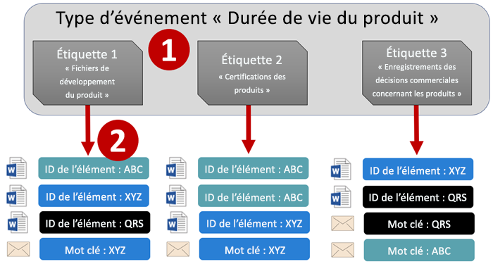
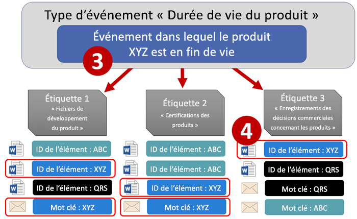
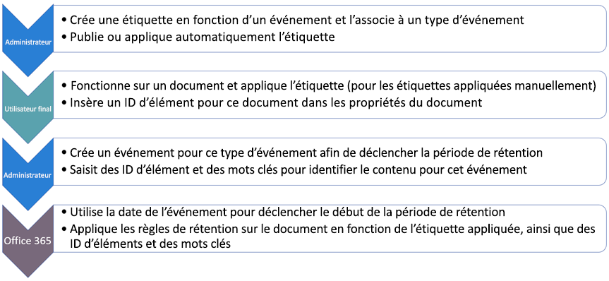
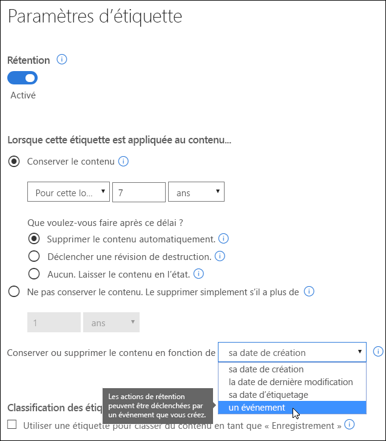
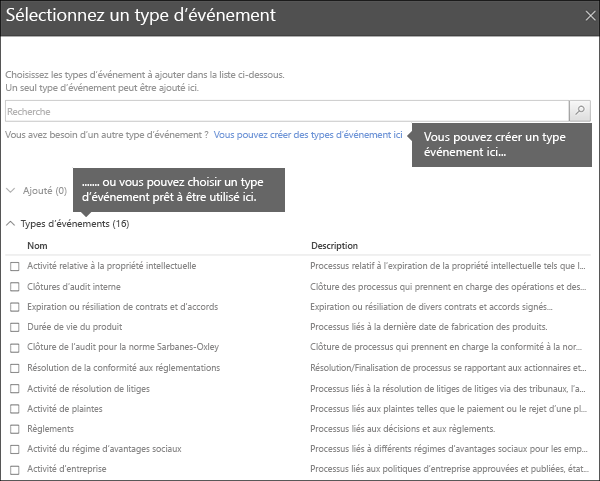
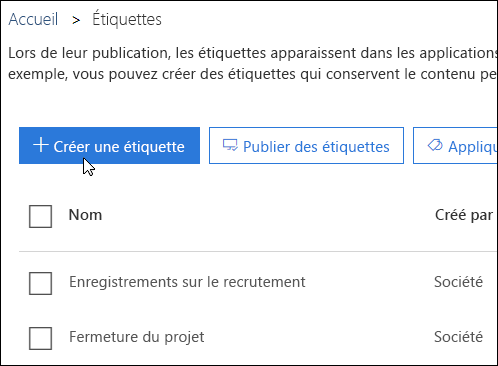
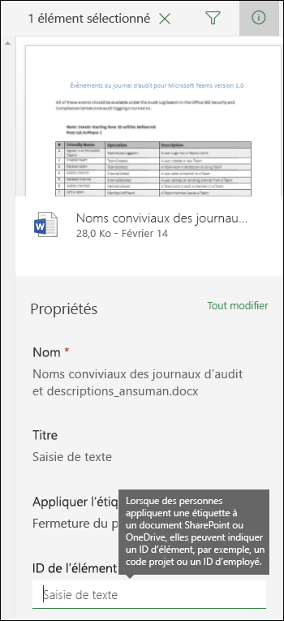
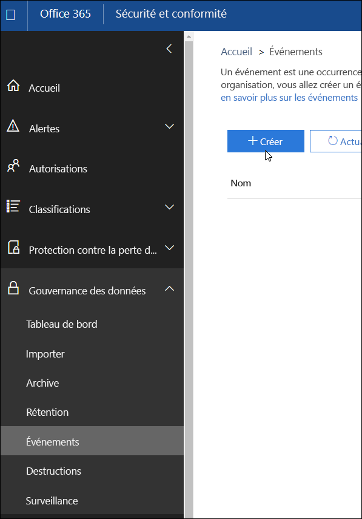
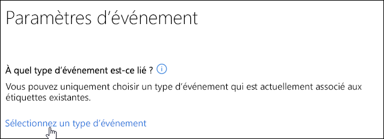
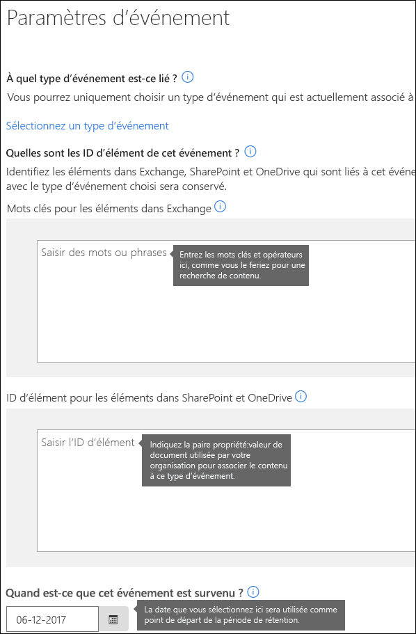

# Vue d’ensemble des rétentions basées sur des événementsOverview of event-driven retention

Lorsque vous conservez du contenu, la période de rétention est souvent basée sur l’ancienneté du contenu. Par exemple, vous pouvez conserver des documents pendant sept ans à compter de leur création, puis les supprimer. Cependant, dans Office 365, vous pouvez baser une période de rétention sur l’occurrence d’un type spécifique d’événement grâce aux étiquettes. L’événement déclenche le début de la période de rétention, et les actions de rétention d’une étiquette sont appliquées sur tout le contenu portant l’étiquette en question pour ce type d’événement.When you retain content, the retention period is often based on the age of the content - for example, you might retain documents for seven years after they're created and then delete them. But with labels in Office 365, you can also base a retention period on when a specific type of event occurs. The event triggers the start of the retention period, and all content with a label applied for that type of event get the label's retention actions enforced on them.
  
Par exemple, vous pouvez utiliser des étiquettes avec des rétentions basées sur des événements pour les éléments suivants :For example, you can use labels with event-driven retention for:
  
- **Employés quittant l’organisation** Supposons que les enregistrements d’un employé doivent être conservés pendant 10 ans après le départ de l’employé en question de l’organisation. Après un délai de 10 ans, tous les documents liés à l’embauche, aux performances et à la cessation d’emploi de cet employé doivent être supprimés. L’événement qui déclenche la période de rétention de 10 ans est le départ de l’employé de l’organisation.**Employees leaving the organization** Suppose that employee records must be retained for 10 years from the time an employee leaves the organization. After 10 years elapse, all documents related to the hiring, performance, and termination of that employee need to be disposed. The event that triggers the 10-year retention period is the employee leaving the organization. 
    
- **Expiration des contrats** Supposons que tous les enregistrements liés aux contrats doivent être conservés pendant cinq ans à compter de l’expiration du contrat. L’événement qui déclenche la période de rétention de cinq ans est l’expiration du contrat.**Contract expiration** Suppose that all records related to contracts need to be retained for five years from the time the contract expires. The event that triggers the five-year retention period is the expiration of the contract. 
    
- **Durée de vie des produits** Votre organisation a peut-être des exigences de rétention liées à la dernière date de fabrication de produits pour le contenu tel que des spécifications techniques. Dans ce cas, la dernière date de fabrication est l’événement qui déclenche la période de rétention.**Product lifetime** Your organization might have retention requirements related to the last manufacturing date of products for content such as technical specifications. In this case, the last manufacturing date is the event that triggers the retention period. 
    
Les rétentions basées sur des événements sont généralement utilisées dans le cadre d’un processus de gestion des enregistrements. Il faut alors prendre en compte les points suivants :Event-driven retention is typically used as part of a records-management process. This means that:
  
- Les étiquettes basées sur des événements classent aussi généralement du contenu en tant qu’enregistrement. Pour obtenir plus d’informations, consultez la rubrique [Utilisation de la recherche de contenu pour trouver tout le contenu portant une étiquette spécifique](labels.md#using-content-search-to-find-all-content-with-a-specific-retention-label-applied-to-it).Labels based on events also usually classify content as a record. For more information, see [Using Content Search to find all content with a specific retention label applied to it](labels.md#using-content-search-to-find-all-content-with-a-specific-retention-label-applied-to-it).
    
- Un document qui a été déclaré comme enregistrement, mais dont l’événement déclencheur ne s’est pas encore produit, est conservé indéfiniment (les enregistrements ne peuvent pas être supprimés définitivement) jusqu’à ce qu’un événement déclenche la période de rétention du document en question.A document that's been declared as a record but whose event trigger has not yet happened is retained indefinitely (records can't be permanently deleted), until an event triggers that document's retention period.
    
- Les étiquettes basées sur des événements déclenchent généralement une révision de destruction à la fin de la période de rétention afin qu’un gestionnaire d’enregistrements puisse manuellement examiner et supprimer le contenu. Pour obtenir plus d’informations, consultez l’article [Vue d’ensemble des révisions de destruction](disposition-reviews.md).Labels based on events usually trigger a disposition review at the end of the retention period, so that a records manager can manually review and dispose the content. For more information, see [Overview of disposition reviews](disposition-reviews.md).
    
Une étiquette basée sur un événement a les mêmes fonctionnalités que les étiquettes dans Office 365. Pour obtenir plus d’informations, consultez l’article [Vue d’ensemble des étiquettes](labels.md).A label based on an event has the same capabilities as any label in Office 365. To learn more, see [Overview of labels](labels.md).
    
## Compréhension de la relation entre les types d’événements, les étiquettes, les événements et les ID d’élémentUnderstanding the relationship between event types, labels, events, and asset IDs

Pour utiliser correctement les rétentions basées sur des événements, il est important de comprendre la relation entre les types d’événements, les étiquettes, les événements et les ID d’élément comme illustré ci-dessous. Vous trouverez une explication après le diagramme.To successfully use event-driven retention, it's important to understand the relationship between event types, labels, events, and asset IDs as illustrated here. An explanation follows the diagram.
  

  

  
1. Créez des étiquettes pour différents types de contenu et associez-les à un type d’événement. Par exemple, les étiquettes pour différents types de fichiers et d’enregistrements de produit sont associées à un type d’événement nommé Durée de vie des produits, car ces enregistrements doivent être conservés pendant 10 ans à compter de la fin de vie du produit.You create labels for different types of content and then associate them with a type of event. For example, labels for different types of product files and records are associated with an event type named Product Lifetime because those records must be retained for 10 years from the time the product reaches its end of life.
    
2. Les utilisateurs (généralement des gestionnaires d’enregistrements) appliquent ces étiquettes au contenu et saisissent un ID d’élément pour chaque élément (pour les documents SharePoint et OneDrive). Dans cet exemple, l’ID d’élément est un nom de produit ou un code utilisé par l’organisation. Par conséquent, une étiquette est appliquée aux enregistrements de chaque produit, et chaque enregistrement a une propriété qui contient un ID d’élément. Le diagramme représente **tout le contenu** pour tous les enregistrements de produit dans une organisation, et chaque élément porte l’ID d’élément du produit de l’enregistrement dont il s’agit.Users (typically records managers) apply those labels to content and (for SharePoint and OneDrive documents) enter an asset ID for each item. In this example, the asset ID is a product name or code used by the organization. Thus, each product's records are assigned a label, and each record has a property that contains an asset ID. The diagram represents **all of the content** for all product records in an organization, and each item bears the asset ID of the product whose record it is. 
    
3. Durée de vie des produits est le type d’événement ; un produit spécifique qui arrive en fin de vie est un événement. Lorsqu’un événement de ce type d’événement se produit (dans ce cas, quand un produit arrive en fin de vie), créez un événement qui spécifie les éléments suivants :Product Lifetime is the event type; a specific product reaching end of life is an event. When an event of that event type occurs - in this case, when a product reaches its end of life - you create an event that specifies:
    
  - Un ID d’élément (pour les documents SharePoint et OneDrive).An asset ID (for SharePoint and OneDrive documents)
    
  - Des mots clés (pour les éléments Exchange) Dans cet exemple, l’organisation utilise un code de produit dans les messages contenant des enregistrements de produit. Le mot clé pour les éléments Exchange est donc identique à l’ID d’élément pour les documents SharePoint et OneDrive.Keywords (for Exchange items). In this example, the organization uses a product code in messages containing product records, so the keyword for Exchange items is the same as the asset ID for SharePoint and OneDrive documents.
    
  - La date à laquelle l’événement est survenu. Cette date est utilisée comme point de départ de la période de rétention. Cette date ne peut être que la date actuelle ou une date future, pas une date passée.The date when the event occurred. This date is used as the start of the retention period. This date can only be the current or a future date, not a past date.
    
4. Une fois que vous avez créé un événement, la date de cet événement est synchronisée avec tout le contenu portant une étiquette de ce type d’événement et qui contient le mot clé ou l’ID d’élément spécifié. Comme pour toute étiquette, cette synchronisation peut prendre jusqu’à 7 jours. Dans le diagramme ci-dessus, la période de rétention de tous les éléments entourés en rouge est déclenchée par cet événement. En d’autres termes, quand ce produit arrive en fin de vie, cet événement déclenche la période de rétention pour les enregistrements de ce produit.After you create an event, that event date is synced to all of the content that has a label of that event type and that contains the specified asset ID or keyword. Like any label, this syncing can take up to 7 days. In the diagram above, all of the items circled in red have their retention period triggered by this event - in other words, when this product reaches its end of life, that event triggers the retention period for that product's records.
    
Il est important de comprendre que si vous ne spécifiez aucun mot clé ou ID d’élément pour un événement, la période de rétention de **tout le contenu** portant une étiquette de ce type d’événement est déclenchée par l’événement. Cela signifie que dans le diagramme ci-dessus, la conservation serait déclenchée pour tout le contenu. Ce n’est peut-être pas ce que vous souhaitez faire.It's important to understand that if you don't specify an asset ID or keywords for an event, **all of the content** with a label of that event type will have its retention period triggered by the event. This means that in the diagram above, all of the content would start being retained. This may not be what you intend. 
  
Enfin, n’oubliez pas que chaque étiquette a ses propres paramètres de rétention. Dans cet exemple, ils indiquent tous 10 ans, mais il est possible qu’un événement déclenche des étiquettes dont la période de rétention est différente.Finally, remember that each label has its own retention settings. In this example, they all specify 10 years, but it's possible for an event to trigger labels where each label has a different retention period.
  
## Configuration des rétentions basées sur des événementsHow to set up event-driven retention

Voici le niveau le plus haut du flux de travail pour la rétention basée sur des événements. Vous trouverez les étapes détaillées ci-après.Here's the high-level workflow for event-driven retention. More detailed steps follow below.
  

  
### Étape 1 : créer une étiquette dont la période de rétention est basée sur des événementsStep 1: Create a label whose retention period is based on an event

Pour créer et gérer des étiquettes de rétention, dans le portail Centre de conformité Microsoft 365, Centre de sécurité Microsoft 365&amp; ou Centre de sécurité et conformité Office 365, dans la partie gauche, choisissez **Classifications** > **Étiquettes** > \*\*, puis sélectionnez \*\*l’onglet **Créer une étiquette**.In the Microsoft 365 compliance center, Microsoft 365 security center, or Office 365 Security &amp; Compliance Center, in the left navigation, choose **Classifications** > **Labels** > **Retention labels** tab > **Create a label**.
  
Lorsque vous créez l’étiquette, activez la rétention, puis sélectionnez l’option indiquée ci-dessous pour conserver ou supprimer le contenu basé sur un événement. Cela signifie que les paramètres de rétention ne rentrent pas en vigueur avant l’étape 5, lorsque vous créez un événement sur la page **Événements**.When you create the label, turn on retention, and then choose the option shown below to retain or delete the content based on an event. This means that the retention settings won't go into effect until Step 5, when you create an event on the **Events** page. 
  
Notez que les rétentions basées sur des événements sont généralement utilisées pour le contenu classé comme enregistrement. Pour cette raison, lorsque vous créez des étiquettes basées sur un événement, vous choisissez généralement l’option pour **utiliser une étiquette pour classer le contenu en tant que « Enregistrement »**.Note that event-driven retention is typically used for content that's classified as a record. For this reason, when you create labels based on an event, you typically choose the option to **Use label to classify content as a "Record"**.
  
Notez également que les rétentions basées sur des événements requièrent des paramètres de rétention qui :Also note that event-driven retention requires retention settings that:
  
- Conservent le contenu.Retain the content.
    
- suppriment automatiquement le contenu ou déclenchent une révision de destruction à la fin de la période de rétention.Delete the content automatically or trigger a disposition review at the end of the retention period.
    

  
### Étape 2 : choisir un type d’événement pour cette étiquetteStep 2: Choose an event type for that label

Dans les paramètres d’étiquette, après avoir choisi l’option pour baser l’étiquette sur **un événement**, vous pourrez sélectionner l’option **Choisir un type d’événement**. Un type d’événement est simplement une description générale d’un événement auquel vous voulez associer une étiquette.In the label settings, after you choose the option to base the label on **an event**, you'll see the option to **Choose an event type**. An event type is simply a general description of an event that you want to associate a label with.
  
Par exemple, si vous créez un type d’événement nommé Durée de vie des produits, vous allez créer des étiquettes basées sur un événement avec des noms qui décrivent les types de contenu auxquels vous souhaitez appliquer des étiquettes. Par exemple, « Fichiers de développement des produits » ou « Enregistrements de la décision commerciale des produits ».For example, if you create an event type named Product Lifetime, you'll create event-based labels with names that describe what types of content you want the labels to be applied to, such as "Product development files" or "Product business decision records".
  
Notez qu’une fois que vous sélectionnez un type d’événement et créez l’étiquette, le type d’événement ne peut pas être modifié.Note that once you choose an event type and create the label, the event type cannot be changed.
  

  
### Étape 3 : publier ou appliquer automatiquement l’étiquetteStep 3: Publish or auto-apply the label

Comme pour toute étiquette, vous devez publier ou appliquer automatiquement une étiquette basée sur un événement afin qu’elle soit appliquée manuellement ou automatiquement au contenu. Faites-le sur la page **Étiquettes** ou **Polices d’étiquettes**. Notez que les étiquettes qui classent le contenu en tant qu’enregistrement peuvent être uniquement publiées et appliquées manuellement au contenu.Just like any label, you need to publish or auto-apply an event-based label, so that it's manually or automatically applied to content. Do this on the **Labels** page. Note that labels that classify content as a record can only be published and manually applied to content; they can't be auto-applied to content. 
  

  
### Étape 4 : saisissez un ID d’élémentStep 4: Enter an asset ID

Une fois qu’une étiquette basée sur un événement a été appliquée au contenu, vous pouvez entrer un ID d’élément pour chaque élément. Par exemple, votre organisation peut utiliser :After an event-driven label is applied to content, you can enter an asset ID for each item. For example, your organization might use:
  
- Des codes de produit que vous pouvez utiliser pour conserver le contenu relatif à un produit spécifique.Product codes that you can use to retain content for only a specific product.
    
- Des codes de projet que vous pouvez utiliser pour conserver le contenu relatif à un projet spécifique.Project codes that you can use to retain content for only a specific project.
    
- ID d’employé à utiliser pour conserver uniquement le contenu d’une personne spécifique.Employee IDs that you can use to retain content for only a specific person.
    
Il faut comprendre que la propriété ID d’élément est tout simplement une autre propriété de document dans SharePoint et OneDrive Entreprise. Votre organisation utilise peut-être déjà d’autres propriétés de document et d’ID pour classer le contenu. Si tel est le cas, vous pouvez également utiliser ces propriétés et valeurs lorsque vous créez un événement : consultez l’étape 6 ci-dessous. L’essentiel est que votre organisation doit utiliser une association propriété:valeur dans les propriétés du document pour associer cet élément à un type d’événement.Understand that Asset ID is simply another document property in SharePoint and OneDrive for Business. Your organization may already use other document properties and IDs to classify content. If so, you can also use those properties and values when you create an event - see Step 6 below. The important point is that your organization must use some property:value combination in the document properties to associate that item with an event type.
  

  
### Étape 5 : créer un événementStep 5: Create an event

Lorsqu’une instance précise de ce type d’événement se produit (par exemple, un produit arrive en fin de vie), accédez à la page Événements dans le Centre de sécurité &amp; conformité, et créez un événement. Vous devez déclencher manuellement un événement en le créant.When a particular instance of that event type occurs - for example, a product reaches its end of life - go to the Events page in the Security &amp; Compliance Center and create an event. You need to manually trigger an event by creating it.
  

  
### Étape 6 : choisir le même type d’événement utilisé par l’étiquette à l’étape 2Step 6: Choose the same event type used by the label in step 2

Lorsque vous créez l’événement, sélectionnez le type d’événement utilisé par l’étiquette à l’étape 2 : par exemple, Durée de vie des produits. Seule la période de rétention du contenu portant les étiquettes de ce type d’événement sera déclenchée.When you create the event, choose the same event type used by the label in step 2 - for example, Product Lifetime. Only content with labels applied to it of that event type will have its retention period triggered.
  

  
### Étape 7 : saisir des mots clés ou un ID d’élémentStep 7: Enter keywords or an asset ID

Réduisez désormais l’étendue du contenu en spécifiant les ID d’élément pour le contenu SharePoint et OneDrive ou des mots clés pour le contenu Exchange. Pour les ID d’élément, la rétention est appliquée uniquement pour le contenu portant la paire propriété:valeur spécifiée. Si un ID d’élément n’est pas saisi, **tout le contenu** portant des étiquettes de ce type d’événement obtient la même date de rétention qui leur est appliquée.Now you narrow the scope of the content by specifying asset IDs for SharePoint and OneDrive content or keywords for Exchange content. For asset IDs, retention will be enforced only on content with the specified property:value pair. If an asset ID is not entered, **all of the content** with labels of that event type get the same retention date applied to them. 
  
Il faut comprendre que l’ID d’élément est simplement une autre propriété du document dans SharePoint et OneDrive Entreprise. Si vous utilisez la propriété AssetID, vous devez saisir ComplianceAssetID:\<valeur\> dans la zone des ID d’élément illustrée ci-dessous.Understand that Asset ID is simply another document property in SharePoint and OneDrive for Business. If you're using the Asset ID property, you would enter ComplianceAssetID:\<value\> in the box for asset IDs shown below.
  
Votre organisation a peut-être appliqué d’autres propriétés et ID aux documents liés à ce type d’événement. Par exemple, si vous avez besoin de détecter les enregistrements d’un produit spécifique, l’ID peut être une combinaison de votre propriété personnalisée ProductID et de la valeur « XYZ ». Dans ce cas, vous devez saisir ProductID:XYZ dans la zone pour des ID d’élément illustrée ci-dessous.Your organization might have applied other properties and IDs to the documents related to this event type. For example, if you need to detect a specific product's records, the ID might be a combination of your custom property ProductID and the value "XYZ". In this case, you'd enter ProductID:XYZ in the box for asset IDs shown below.
  
Pour les éléments Exchange, vous pouvez inclure des mots clés. Vous pouvez affiner votre requête à l’aide d’opérateurs de recherche comme AND, OR et NOT. Pour obtenir plus d’informations sur les opérateurs, consultez l’article [Requêtes par mots clés et conditions de recherche pour la recherche de contenu](keyword-queries-and-search-conditions.md).For Exchange items, you can include keywords. You can refine your query by using search operators like AND, OR, and NOT. For more information on operators, see [Keyword queries and search conditions for Content Search](keyword-queries-and-search-conditions.md).
  
Enfin, sélectionnez la date à laquelle l’événement est survenu. Cette date est utilisée comme point de départ de la période de rétention. Après avoir créé un événement, la date de cet événement est synchronisée avec tout le contenu portant une étiquette de ce type d’événement, de cet ID d’élément et de ces mots clés. Comme pour toute étiquette, cette synchronisation peut prendre jusqu’à 7 jours.Finally, choose the date when the event occurred; this date is used as the start of the retention period. After you create an event, that event date is synced to all of the content with a label of that event type, asset ID, and keywords. Like any label, this syncing can take up to 7 days.
  

  
## Utilisation de la recherche de contenu pour rechercher tout le contenu portant une étiquette ou un ID d’élément spécifiqueUse Content Search to find all content with a specific label or asset ID

Une fois que les étiquettes sont attribuées au contenu, vous pouvez utiliser la recherche de contenu pour rechercher tout le contenu classé avec une étiquette spécifique ou qui contient un ID d’élément spécifique.After labels are assigned to content, you can use content search in the Security  Compliance Center to find all content that's classified with a specific label or that contains a specific asset ID.
  
Lorsque vous créez une recherche de contenu, procédez comme suit :When you create a content search:
  
- Pour trouver tout le contenu portant une étiquette spécifique, sélectionnez la condition **Balise de conformité**, puis saisissez le nom d’étiquette en partie ou en intégralité et utilisez un caractère générique.To find all content with a specific label, choose the **Compliance Tag** condition, and then enter the complete label name or part of the label name and use a wildcard. 
    
- Pour trouver tout le contenu portant un ID d’élément spécifique, saisissez la propriété **ComplianceAssetID** et une valeur, telle que ComplianceAssetID:\<valeur\>.To find all content with a specific asset ID, enter the **ComplianceAssetID** property and a value, like ComplianceAssetID:\<value\>. 
    
Pour obtenir plus d’informations, reportez-vous à la rubrique [Requêtes par mots-clés et conditions de recherche pour la recherche de contenu](keyword-queries-and-search-conditions.md).For more information, see [Keyword queries and search conditions for Content Search](keyword-queries-and-search-conditions.md).
  
## AutorisationsPermissions

Pour accéder à la page **Événements**, les réviseurs doivent être membres du groupe de rôles possédant le rôle **Gestion de la destruction** et le rôle **Journaux d’audit en lecture seule**. Nous vous recommandons de créer un nouveau groupe de rôles appelé Réviseurs de destruction, d’ajouter ces deux rôles à ce groupe de rôles, puis d’ajouter des membres au groupe de rôles.To get access to the **Events** page, reviewers must be members of a role group with the **Disposition Management** role and the **View-Only Audit Logs** role. We recommend creating a new role group called Disposition Reviewers, adding these two roles to that role group, and then adding members to the role group. 
  
Pour obtenir plus d’informations, consultez l’article [Octroi de l’accès au Centre de sécurité &amp; conformité Office 365 aux utilisateurs](grant-access-to-the-security-and-compliance-center.md).For more information, see [Give users access to the Office 365 Security &amp; Compliance Center](grant-access-to-the-security-and-compliance-center.md).
  
## Automatisation des événements à l’aide de PowerShellAutomate events by using PowerShell

Dans le centre administrateur, vous pouvez uniquement créer des événements manuellement ; il n’est pas possible de déclencher automatiquement un événement lorsqu’il se produit. Toutefois, vous pouvez utiliser un Rest API pour automatiser les événements ; pour plus d’informations, voir [Automatiser la rétention basée sur des événements](automate-event-driven-retention.md).In the Office 365 Security  Compliance Center, you can only create events manually; it's not possible to automatically trigger an event when it occurs. However, you can use a PowerShell script to automate event-based retention from your business applications.

Vous pouvez aussi utiliser un script PowerShell pour automatiser une rétention basée sur l’événement à partir de vos applications entreprise.You can also use a PowerShell script to automate event-based retention from your business applications. Voici les cmdlets PowerShell disponibles pour les rétentions basées sur des événements :Until then, here are the PowerShell cmdlets available for event-driven retention:
  
- [Get-ComplianceRetentionEventTypeGet-ComplianceRetentionEventType](https://go.microsoft.com/fwlink/?linkid=873002)
    
- [New-ComplianceRetentionEventTypeNew-ComplianceRetentionEventType](https://go.microsoft.com/fwlink/?linkid=873004)
    
- [Remove-ComplianceRetentionEventTypeRemove-ComplianceRetentionEventType](https://go.microsoft.com/fwlink/?linkid=873005)
    
- [Set-ComplianceRetentionEventTypeSet-ComplianceRetentionEventType](https://go.microsoft.com/fwlink/?linkid=873006)
    
- [Get-ComplianceRetentionEventGet-ComplianceRetentionEvent](https://go.microsoft.com/fwlink/?linkid=873001)
    
- [New-ComplianceRetentionEventNew-ComplianceRetentionEvent](https://go.microsoft.com/fwlink/?linkid=873003)
    

