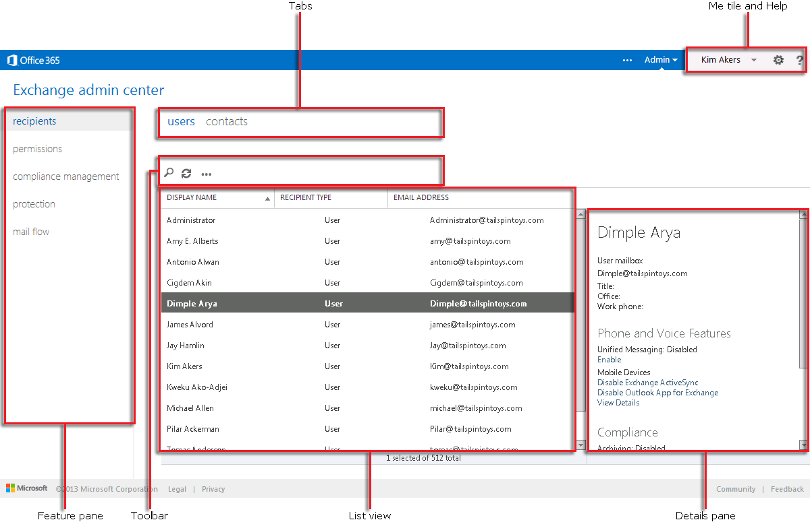

# Centre d’administration Exchange dans Exchange Online ProtectionExchange admin center in Exchange Online Protection 

Le Centre d'administration Exchange (CAE) est la console de gestion basée sur le web pour Microsoft Exchange Online Protection (EOP).The Exchange admin center (EAC) is the web-based management console for Microsoft Exchange Online Protection (EOP). 
  
Vous recherchez la version Exchange 2013 de cette rubrique ? Consultez la rubrique [Exchange admin center in Exchange 2013](http://technet.microsoft.com/library/a9aea11a-6ba3-4f4a-a76e-79072e7cfc7d.aspx).Looking for the Exchange 2013 version of this topic? See [Exchange admin center in Exchange 2013](http://technet.microsoft.com/library/a9aea11a-6ba3-4f4a-a76e-79072e7cfc7d.aspx).
  
Vous recherchez la version Exchange Online de cette rubrique ? Consultez la rubrique [Exchange admin center in Exchange Online](https://docs.microsoft.com/exchange/exchange-admin-center).Looking for the Exchange Online version of this topic? See [Exchange admin center in Exchange Online](https://docs.microsoft.com/exchange/exchange-admin-center).
  
## Accès au CAEAccessing the EAC

Dans la plupart des cas, les clients EOP accèdent au centre d'administration Exchange par le biais du centre d'administration Microsoft 365.In most cases, EOP customers will access the EAC through the Microsoft 365 admin center. Un lien vers EOP est disponible dans le menu déroulant de la vignette **Administrateur**, située près de la vignette **Moi**.You can find a link to EOP in the drop-down menu in the **Admin** tile, which is next to the **Me** tile. Cliquez sur la vignette **Administrateur** et sélectionnez **Exchange Online Protection** dans le menu déroulant pour accéder au CAE.Click the **Admin** tile and select **Exchange Online Protection** from the drop down menu to be taken to the EAC. 
  
Vous pouvez également accéder à la page de connexion du CAE directement via l'URL suivante : https://admin.protection.outlook.com/ecp/\<companydomain\>. Par exemple, https://admin.protection.outlook.com/ecp/contoso.onmicrosoft.com. Après avoir indiqué vos informations de connexion d'utilisateur, vous être envoyé directement dans le CAE.You can also access the EAC sign in page directly via the following URL: https://admin.protection.outlook.com/ecp/\<companydomain\>. For example, https://admin.protection.outlook.com/ecp/contoso.onmicrosoft.com. After specifying your user credentials you will be taken directly into the EAC.
  
## Éléments d'interface utilisateur courants dans le CAECommon user interface elements in the EAC

Cette section décrit les éléments d'interface utilisateur disponibles dans le CAE.This section describes the user interface elements that are found in the EAC.
  

  
### Volet des fonctionnalitésFeature Pane

Il s'agit du premier niveau de navigation pour la plupart des tâches que vous effectuez au sein du CAE. Le volet des fonctionnalités est organisé par domaines de fonctionnalités.This is the first level of navigation for most of the tasks you'll perform in the EAC. The feature pane is organized by feature areas.
  
1. **Destinataires** C'est ici que les utilisateurs internes et les contacts externes s'affichent.**Recipients** This is where you'll view internal users and external contacts. 
    
2. **Autorisations** C'est ici que vous gérez les rôles d'administrateur.**Permissions** This where you'll manage administrator roles. 
    
3. **Gestion de la conformité** C'est ici que se trouvent les journaux et les rapports d'audit, tels que le rapport de groupe de rôles d'administrateur.**Compliance Management** This is where you'll find audit logs and reports, such as the administrator role group report. 
    
4. **Protection** C'est ici que vous gérez la protection anti-courrier indésirable et anti-programme malveillant pour votre organisation, ainsi que les messages en quarantaine.**Protection** This is where you'll manage anti-malware and anti-spam protection for your organization, as well as manage messages in quarantine. 
    
5. **Flux de messagerie** C'est ici que vous gérez les règles, les domaines acceptés et les connecteurs, et que vous pouvez effectuer un suivi des messages.**Mail Flow** This is where you'll manage rules, accepted domains, and connectors, as well as where you'll go to perform message trace. 
    
### OngletsTabs

Les onglets constituent votre deuxième niveau de navigation. Chaque domaine de fonctionnalités contient différents onglets, chacun représentant une fonctionnalité.The tabs are your second level of navigation. Each of the feature areas contains various tabs, each representing a feature.
  
### Barre d'outilsToolbar

Lorsque vous cliquez sur la plupart des onglets, vous devez voir une barre d'outils. La barre d'outils contient des icônes qui correspondent à une action spécifique. Le tableau suivant décrit les icônes et leurs actions.When you click most tabs, you'll see a toolbar. The toolbar has icons that perform a specific action. The following table describes the icons and their actions.
  
|**Icône****Icon**|**Nom****Name**|**Action****Action**|
|:-----|:-----|:-----|
|             |Ajouter, NouveauAdd, New    |Permet de créer un objet. Certaines de ces icônes comportent une flèche vers le bas associée, sur laquelle vous pouvez cliquer pour afficher des objets supplémentaires que vous pouvez créer.Use this icon to create a new object. Some of these icons have an associated down arrow you can click to show additional objects you can create.    |
|             |ModifierEdit    |Permet de modifier un objet.Use this icon to edit an object.    |
|             |SupprimerDelete    |Permet de supprimer un objet. Certaines des icônes de suppression comportent une flèche vers le bas, sur laquelle vous pouvez cliquer pour afficher des options supplémentaires.Use this icon to delete an object. Some delete icons have a down arrow you can click to show additional options.    |
|             |RechercherSearch    |Permet d'ouvrir une zone de recherche dans laquelle vous pouvez entrer une expression pour rechercher un objet.Use this icon to open a search box in which you can type the search phrase for an object you want to find.    |
|             |ActualiserRefresh    |Permet d'actualiser l'affichage Liste.Use this icon to refresh the list view.    |
|             |Plus d'optionsMore options    |Utilisez cette icône pour afficher d'autres actions que vous pouvez effectuer pour les objets figurant sous cet onglet. Par exemple, dans **Destinataires \> Utilisateurs**, le fait de cliquer sur cette icône affiche l'option de **Recherche avancée**.  Use this icon to view more actions you can perform for that tab's objects. For example, in **Recipients \> Users** clicking this icon shows the option to perform an **Advanced Search**.    |
|             |Flèche Haut et flèche BasUp arrow and down arrow    |Utilisez ces icônes pour relever ou abaisser la priorité d'un objet.Use these icons to move an object's priority up or down.    |
|             |SupprimerRemove    |Permet de supprimer des objets d'une liste.Use this icon to remove objects from a list.    |
   
### Affichage ListeList View

Dans la plupart des cas, vous devez voir un affichage Liste lorsque vous sélectionnez un onglet. La limite d'affichage de l'affichage Liste du CAE est d'environ 10 000 objets. En outre, la pagination est incluse pour vous permettre de paginer les résultats.When you select a tab, in most cases you'll see a list view. The viewable limit with the EAC list view is approximately 10,000 objects. In addition, paging is included so that you can page to results.
  
### Volet d'informationsDetails Pane

Quand vous sélectionnez un objet de l'affichage Liste, les informations relatives à cet objet apparaissent dans le volet d'informations. Dans certains cas, le volet d'informations inclut les tâches de gestion.When you select an object from the list view, information about that object is displayed in the details pane. In some cases the details pane includes management tasks.
  
### Vignette de l'utilisateur en cours et AideMe tile and Help

La vignette **Moi** vous permet de fermer votre session du Centre d'administration Exchange (CAE) pour ouvrir ensuite une session en tant qu'utilisateur différent. Dans le menu déroulant **Aide**, vous pouvez effectuer les actions suivantes :The **Me** tile allows you to sign out the EAC and sign in as a different user. From the **Help** drop-down menu, you can perform the following actions: 
  
1. **Aide** Cliquez sur  pour afficher le contenu de l'aide en ligne.**Help** Click  to view the online help content. 
    
2. **Désactiver la bulle d'aide** La bulle d'aide affiche une aide contextuelle pour des champs spécifiques quand vous créez ou modifiez un objet. Vous pouvez activer ou désactiver la bulle d'aide.**Disable Help bubble** The Help bubble displays contextual help for fields when you create or edit an object. You can turn off the Help bubble or turn it on if it has been disabled. 
    
3. **Copyright** Cliquez sur ce lien pour lire le copyright pour Exchange Online Protection.**Copyright** Click this link to read the copyright notice for Exchange Online Protection. 
    
4. **Confidentialité** Cliquez pour lire la politique de confidentialité pour Exchange Online Protection.**Privacy** Click to read the privacy policy for Exchange Online Protection. 
    
## Navigateurs pris en chargeSupported Browsers

Pour bénéficier d'une meilleure expérience d'utilisation du CAE, nous vous recommandons de toujours utiliser les navigateurs, clients Office et applications les plus récents. Nous vous recommandons également d'installer les mises à jour logicielles lorsqu'elles sont disponibles. Pour plus d'informations sur les navigateurs pris en charge et la configuration requise pour le service, voir [Configuration requise pour Office 365](https://go.microsoft.com/fwlink/p/?LinkID=402699).For the best experience using the EAC, we recommend that you always use the latest browsers, Office clients, and apps. We also recommend that you install software updates when they become available. For more information about the supported browsers and system requirements for the service, see [Office 365 System Requirements](https://go.microsoft.com/fwlink/p/?LinkID=402699). 
  
## Langues prises en charge dans EOPSupported languages in EOP

Les langues suivantes sont prises en charge et disponibles dans Exchange Online Protection.The following languages are supported and available for Exchange Online Protection.
  
- AmhariqueAmharic
    
- ArabeArabic
    
- basque (Basque)Basque (Basque)
    
- Bengla (Inde)Bengali (India)
    
- BulgareBulgarian
    
- CatalanCatalan
    
- Chinois (simplifié)Chinese (Simplified)
    
- Chinois (traditionnel)Chinese (Traditional)
    
- CroateCroatian
    
- TchèqueCzech
    
- DanoisDanish
    
- NéerlandaisDutch
    
- NéerlandaisDutch
    
- AnglaisEnglish
    
- EstonienEstonian
    
- Filipino (Philippines)Filipino (Philippines)
    
- FinnoisFinnish
    
- FrançaisFrench
    
- GalicienGalician
    
- AllemandGerman
    
- GrecGreek
    
- GoudjratiGujarati
    
- HébreuHebrew
    
- HindiHindi
    
- HongroisHungarian
    
- IslandaisIcelandic
    
- IndonésienIndonesian
    
- ItalienItalian
    
- JaponaisJapanese
    
- KannadaKannada
    
- KazakhKazakh
    
- KiswahiliKiswahili
    
- CoréenKorean
    
- LettonLatvian
    
- LituanienLithuanian
    
- Malais (Brunei Darussalam)Malay (Brunei Darussalam)
    
- Malais (Malaisie)Malay (Malaysia)
    
- MalayalamMalayalam
    
- MaratheMarathi
    
- Norvégien (Bokmål)Norwegian (Bokmål)
    
- Norvégien (nynorsk)Norwegian (Nynorsk)
    
- OdiaOriya
    
- PersePersian
    
- PolonaisPolish
    
- Portugais (Brésil)Portuguese (Brazil)
    
- Portugais (Portugal)Portuguese (Portugal)
    
- RoumainRomanian
    
- RusseRussian
    
- Serbe (cyrillique, Serbie)Serbian (Cyrillic, Serbia)
    
- Serbe (latin)Serbian (Latin)
    
- SlovaqueSlovak
    
- SlovèneSlovenian
    
- EspagnolSpanish
    
- SuédoisSwedish
    
- TamoulTamil
    
- TélougouTelugu
    
- ThaïlandaisThai
    
- TurcTurkish
    
- UkrainienUkrainian
    
- OurdouUrdu
    
- VietnamienVietnamese
    
- GalloisWelsh
    

