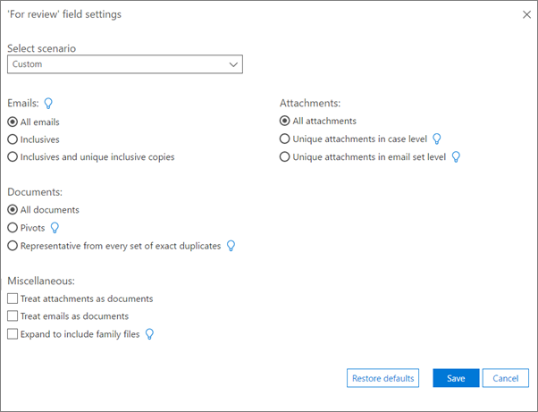

# Exporter les résultats dans Office 365 Advanced eDiscoveryExport results in Office 365 Advanced eDiscovery

> [!NOTE]
> Pour utiliser Advanced eDiscovery, votre organisation doit souscrire un abonnement Office 365 E3 avec le module complémentaire Conformité avancée ou un abonnement E5. Si vous ne disposez pas d’un abonnement et que vous souhaitez essayer Advanced eDiscovery, vous pouvez vous [inscrire pour utiliser une version d’évaluation d’Office 365 Entreprise E5](https://go.microsoft.com/fwlink/p/?LinkID=698279).Advanced eDiscovery requires an Office 365 E3 with the Advanced Compliance add-on or an E5 subscription for your organization. If you don't have that plan and want to try Advanced eDiscovery, you can [sign up for a trial of Office 365 Enterprise E5](https://go.microsoft.com/fwlink/p/?LinkID=698279). 
  
Cette rubrique décrit les options avancées de configuration de l'exportation eDiscovery.This topic describes the Advanced eDiscovery Export Setup options.
  
 **Dans cette rubrique:****In this topic:**
  
- [Définition des lots d'exportation et des sessionsDefining export batches and sessions](export-results-in-advanced-ediscovery.md#BK_Define)
    
- [Exportations incrémentielles et supplémentairesIncremental and additional exports](export-results-in-advanced-ediscovery.md#BK_IncrementalReports)
    
- [Configurer les paramètres d'exportation par lotSet up batch export parameters](export-results-in-advanced-ediscovery.md#BK_SetUpExport)
    
- [Exporter les fichiers de sortie de rapportExport report output files](export-results-in-advanced-ediscovery.md#BK_ExportOutputFIles)
    
## Définition des lots d'exportation et des sessionsDefining export batches and sessions

Un lot d'exportation permet le traitement de l'exportation à l'aide d'un ensemble de paramètres définis.An export batch allows export processing using a set of defined parameters. Advanced eDiscovery vous permet de définir des lots pour personnaliser chaque exportation.Advanced eDiscovery enables you to define batches to customize each export.
  
Les paramètres sont définis par lot d'exportation.Parameters are defined per export batch. Un lot nommé «export batch 01» est créé par défaut pour le premier lot d'un cas.A batch named "Export batch 01" is created by default for the first batch of a case. Vous pouvez également modifier le nom et la description du lot.You can also edit the batch name and description.
  
Une session d'exportation est une exécution d'une exportation eDiscovery avancée dans un lot d'exportation.An export session is an execution of Advanced eDiscovery Export within an export batch.
  
## Exportations incrémentielles et supplémentairesIncremental and additional exports

Vous pouvez exécuter plusieurs sessions d'exportation dans un lot d'exportation afin de garantir des résultats cohérents en fonction des mêmes paramètres et modèle d'exportation.You can run multiple export sessions within an export batch, to ensure consistent results based on the same export template and parameters. Pour chaque session au sein d'un lot, vous pouvez exporter Analytics pour les données de cas nouvellement traitées et traiter chaque «de manière incrémentielle».For each session within a batch, you can export analytics for newly processed case data and process each "incrementally."
  
Pour exporter à l'aide d'un autre ensemble de paramètres, vous devez d'abord créer un nouveau lot.In order to export using a different set of parameters, you first need to create a new batch. La première session du nouveau lot génère des résultats pour les fichiers traités dans le cas où, si ces fichiers ont été importés et traités sur une ou plusieurs importations.The first session in the new batch will produce results for files processed in the case so far, whether or not these files were imported and processed over one or multiple Imports. Chaque lot recalcule les tableaux croisés dynamiques, similarités, inclusifs, etc. Les sessions utilisent les paramètres définis pour le lot et ne recalculent pas les tableaux croisés dynamiques, la similarité, les inclusives, etc. pour chaque exécution de session.Each batch recalculates pivots, similarity, inclusives, etc. Sessions use the parameters defined for the batch and do not recalculate pivots, similarity, inclusives, etc. for each session execution.
  
Par exemple, supposons qu'un cas a été importé et que ses données ont été analysées.For example, assume a case was imported and its data analyzed. Pour récupérer les résultats des threads de proximité et des doublons de données pour les données incrémentielles, cliquez sur **créer une session d'exportation** dans le même lot utilisé pour exporter les données.In order to retrieve Near-duplicates and Email Threading results for the incremental data, click **Create export session** in the same batch that was previously used to export data. 
  
## Configurer les paramètres d'exportation par lotSet up batch export parameters

L'outil d'exportation de découverte électronique est utilisé pour exporter les résultats de recherche d'Advanced eDiscovery vers votre ordinateur local.The eDiscovery Export Tool is used to export search results from Advanced eDiscovery to your local computer. Pour augmenter le débit de transfert de données et accélérer le processus d'exportation, vous pouvez configurer un paramètre de Registre Windows sur l'ordinateur que vous utilisez pour exporter les résultats de la recherche.To increase the data transfer throughput and speed-up the export process, you can configure a Windows Registry setting on the computer that you use to export the search results. Si vous souhaitez augmenter la vitesse de téléchargement, configurez le paramètre de Registre avant de configurer les paramètres d'exportation.If you'd like to increase the download speed, configure the registry setting before you set up the export parameters. Pour plus d'informations, consultez [la rubrique augmentation de la vitesse de téléchargement lors de l'exportation des résultats de recherche eDiscovery à partir d'Office 365](increase-download-speeds-when-exporting-ediscovery-results.md).For more information, see [Increase the download speed when exporting eDiscovery search results from Office 365](increase-download-speeds-when-exporting-ediscovery-results.md).
  
1. Dans Advanced eDiscovery, sélectionnez un cas et cliquez sur **Exporter** \> la **configuration**.In Advanced eDiscovery, select a Case and click **Export** \> **Setup**.
    
    - Dans la liste **Exporter le lot** , sélectionnez le nom du lot ou exportez les résultats vers l'export lot 01 (par défaut).From the **Export batch** list, select the batch name or export results to Export batch 01, (the default batch). 
    
    - Pour exporter les résultats pour les nouveaux fichiers que vous avez ajoutés à un cas existant, continuez avec votre lot actuel.To export results for new files that you added to an existing case, continue with your current batch. Pour créer une session dans le lot, sélectionnez le même numéro de lot, puis cliquez sur **créer une session d'exportation** vous pouvez utiliser cette option pour exporter les mêmes paramètres que le lot précédent, de manière incrémentielle.To create a session in the batch, select the same batch number and click **Create export session** You can use this option to export the same parameters as the previous batch, in an incremental manner. 
    
    - Pour exporter vers un nouveau lot, cliquez sur **Ajouter** icône Ajouter et entrez un nouveau nom dans le **champ nom du lot** (ou acceptez la valeur par défaut) et une description dans **Description du lot**.To export to a new batch, click **Add** and enter a new name in **Batch name** (or accept the default) and a description in **Batch description**. Cliquez sur **OK**.Click **OK**.
    
    - Pour modifier un nom de lot ou une description, sélectionnez le nom dans **Exporter le lot**, cliquez](media/3d613660-7602-4df2-bdb9-14e9ca2f9cf2.png)sur **modifier** , and then modify the fields.
    
      > [!NOTE]
      > Une fois que vous avez exécuté des sessions pour un lot d'exportation, il est impossible de les supprimer.After you've run sessions for an export batch, they cannot be deleted. De plus, seuls certains paramètres peuvent être modifiés une fois la première session exécutée.In addition, only some parameters can be edited once the first session is run. 
  
    - Pour créer un lot d'exportation en double, sélectionnez dupliquer un **lot**  double créez un lot d'exportation en double et entrez un nom et une description pour le lot dupliqué dans le panneau.To create a duplicate export batch, choose **Duplicate export batch**  and enter a name and a description for the duplicate batch in the panel. 
    
    - Pour supprimer un lot d'exportation, sélectionnez **supprimer** exporter un lot.To delete an export batch, choose **Delete** .
    
    - Pour afficher l'historique d'un lot, sélectionnez \*\*\*\* historique du lot-afficher l'historique.To view the history of a batch, choose **Batch history** .
    
2. Sous **remplissage**, sélectionnez **inclure uniquement les fichiers au-dessus du score** de découpage de pertinence et/ou affiner l' **exportation de lot** si vous souhaitez affiner les paramètres de votre lot d'exportation.Under **Population**, select **Include only files above Relevance cut-off score** and/or **Refine export batch** if you want to fine-tune the settings for your export batch. 
    
3. Si vous sélectionnez **inclure uniquement les fichiers au-dessus du score**de découpAge de pertinence, le **problème** est alors activé.If you select **Include only files above Relevance cut-off score**, then the **Issue** is enabled. Si le score de pertinence du fichier est supérieur au score de découpage du problème sélectionné, le fichier est exporté sauf s'il est exclu par le filtre «pour révision».If the file's relevance score is higher than the cut-off score for the selected issue, the file will be exported unless it's excluded by the 'For review' filter. 
  
    Si vous sélectionnez **affiner l'exportation**, les cases d'option **de déDuplication** et de filtrage par «pour révision» sont activées.If you select **Refine export batch**, the **De-dupe** and Filter by 'For review' field radio buttons are enabled. Si vous choisissez \*\*\*\* la déduplication, les fichiers dupliqués sont filtrés en fonction de la stratégie définie [niveau de cas (par défaut): à partir de chaque ensemble de fichiers en double dans le cas entier, tous les fichiers sauf un seront de duped.If you choose **De-dupe**, then duplicate files will be filtered out according to the policy defined [Case level (default): from every set of duplicate files in the entire case, all but one file will be de-duped. Niveau des dépositaires: à partir de chaque ensemble de fichiers en double du même dépositaire, tous les fichiers sauf un seront de duped.] La sortie d'exportation contient un enregistrement de tous les fichiers en double.Custodian level: from every set of duplicate files of the same custodian, all but one file will be de-duped.] The export output contains a record of all duplicate files. Si vous choisissez **Filtrer par champ de révision** , sélectionnez **modifier sous métadonnées** pour entrer les paramètres de champ **«pour révision»** .If you choose **Filter by 'For review'** field, select **Modify under Metadata** to enter your **'For review'** field settings. Sélectionnez **inclure les fichiers d'entrée** pour inclure les fichiers sources dans le contenu du package.Select **Include input files** to include source files in the package content. Vous pouvez désactiver ce paramètre pour accélérer le processus d'exportation.You can clear this setting to speed up the export process. Notez que les fichiers natifs seront exportés dans tous les cas.Note that the Native files will be exported in any case. 
    
4. Sous **métadonnées**, sélectionnez l'une des options suivantes dans la liste **Exporter le modèle** (une fois par session).Under **Metadata**, select from the following options in the **Export template** list (once per session). 
    
    - **Standard**: ensemble de base des éléments de données, des métadonnées et des propriétés.**Standard**: Basic set of data items, metadata, and properties. Utilisez cette option lorsque les données d'importation ont déjà été traitées dans Advanced eDiscovery et que les données d'exportation sont téléchargées vers un système qui contient déjà les fichiers.Use this option when import data was already processed in Advanced eDiscovery and export data is uploaded to a system that already contains the files. Par défaut, les colonnes de modèle d'exportation sont créées et remplies.By default, export template columns are created and filled.
    
    - **All**: ensemble complet de métadonnées standard incluant toutes les données de traitement, ainsi que les scores d'analyse et de pertinence.**All**: Full set of standard metadata including all processing data, as well as Analyze and Relevance scores. Ce modèle est requis lorsque Advanced eDiscovery effectue le traitement et que les données de fichier sont téléchargées sur un système externe pour la première fois.This template is required when Advanced eDiscovery performs the processing and file data is uploaded to an external system for the first time.
    
    - **Problèmes**: sélectionnez **tous les problèmes** ou sélectionnez un problème particulier que vous avez créé.**Issues**: Select **All Issues** or select a particular issue you have created. 
    
5. Sous **destination**:Under **Destination**:
    
    - **Téléchargement sur l'ordinateur local****Download to local machine**
    
    - **Exportation vers l'objet BLOB Azure défini par l'utilisateur**: si cette option est activée, vous pouvez spécifier une URL de conteneur et un jeton SAS.**Export to user-defined Azure blob**: If this is checked, you can specify a container URL and SAS token.
    
      > [!NOTE]
      > Une fois qu'un package d'exportation est stocké dans l'objet BLOB Azure défini par l'utilisateur, les données ne sont plus gérées par Advanced eDiscovery; elle est gérée par l'objet BLOB Azure.Once an export package is stored to the user defined Azure blob, the data is no longer managed by Advanced eDiscovery; it's managed by the Azure blob. Cela signifie que si vous supprimez le cas, les fichiers exportés resteront toujours sur le BLOB Azure.This means if you delete the case, the exported files will still remain on the Azure blob. 
  
    - **Enregistrer le jeton SAS pour une session d'exportation future**: si cette option est activée, le jeton SAS est chiffré dans la base de données interne avancée eDiscovery pour une utilisation ultérieure.**Save SAS token for future export session**: If checked, the SAS token will be encrypted in the Advanced eDiscovery's internal database for future use.
    
      > [!NOTE]
      > Actuellement, le jeton SAS expire au bout d'un mois.Currently the SAS token expires after a month. Si vous essayez d'effectuer un téléchargement après plus d'un mois, vous devez annuler la dernière session, puis effectuer une nouvelle exportation.If you try to download after more than a month you have to undo last session, then export again. 
  
6. Cliquez sur **modifier** pour définir les paramètres de champ «pour la révision».Click **Modify** to set the 'for review' field settings. 
    
    
  
   - Sous **pour la révision des paramètres de champ**, dans la liste déRoulante **Sélectionner un scénario** , sélectionnez le scénario et l'étendue de la révision.Under **For review field settings**, in **Select scenario** pull-down list, select the scenario and scope of the review. Les paramètres sont affichés en fonction de votre sélection.The settings are displayed based on your selection.
    
      - **Vérifier tout** (valeur par défaut): tous les messages électroniques, pièces jointes et documents sont sélectionnés par défaut.**Review all** (default): All emails, attachments, and documents are selected by default. 
    
      - **Examinez tout le contenu unique d'un jeu**: inclusifs et copies inclusives uniques, pièces jointes uniques dans le niveau du jeu de courrier, représentatives de chaque ensemble de doublons exacts.**Review all unique content in a set**: Inclusives and unique inclusive copies, unique attachments in email set level, representative from every set of exact duplicates.
    
      - **Examiner tout le contenu unique d'un ensemble-aucune copie inclusive**: inclus, pièces jointes uniques dans le niveau du jeu de messages, représentative de chaque ensemble de doublons exacts.**Review all unique content in a set - no inclusive copies**: Inclusives, unique attachments in email set level, representative from every set of exact duplicates.
    
      - **Examinez tous les fichiers de famille et de contenu uniques**: inclus, pièces jointes uniques dans le niveau du jeu de messages, représentatif de chaque ensemble de doublons exacts, puis développez pour inclure les fichiers de famille.**Review all unique content and related family files**: Inclusives, unique attachments in email set level, representative from every set of exact duplicates, expand to include family files.
    
      - **Personnalisé** (vous permet de définir les options dans la boîte de dialogue): par défaut, les sélections actuelles sont conservées et toutes les options de boîte de dialogue sont activées, afin d'autoriser leur sélection.**Custom** (allows you to define the options in the dialog): The default is to keep current selections and enable all dialog options, to allow their selection. Si vous sélectionnez cette option, vous pouvez personnaliser les paramètres des e-mails, des documents, des pièces jointes et des fichiers divers.If you select this option, you can then customize the settings for emails, documents, attachments and miscellaneous.
    
    - Sous **e-mails**, sélectionnez les courriers électroniques que vous souhaitez exporter.Under **Emails**, select the emails you want to export.
    
      - **Tous les messages électroniques**: (par défaut) tous les messages électroniques sont sélectionnés.**All emails**: (default) All emails are selected.
    
      - **Inclusif**: un message électronique inclusif est le dernier courrier électronique d'un thread, qui contient tous les autres messages électroniques provenant du thread.**Inclusives**: An inclusive email is a last email of a thread, and it contains all the other emails from the thread.
    
      - **Inclusifs et copies inclusives uniques**: copies inclusives et inclusifs avec le même objet, le même corps et les mêmes pièces jointes; les copies inclusives uniques sont des copies uniques de ces messages électroniques.**Inclusives and unique inclusive copies**: Inclusive copies and inclusives with the same subject, body and attachments; unique inclusive copies are unique copies of these emails .
    
    - Sous **documents**, sélectionnez les documents que vous souhaitez exporter.Under **Documents**, select the documents you want to export. 
    
      - **Tous les documents**: (par défaut) tous les documents sont sélectionnés.**All documents**: (default) All documents are selected.
    
      - **Pivots**: fichier choisi comme représentative de l'ensemble des doublons, généralement utilisé comme ligne de base lors de l'examen de l'ensemble.**Pivots**: A file chosen as representative of near-duplicates set, which is typically used as the baseline when reviewing the set.
    
      - **Représentatif de chaque ensemble de doublons exacts**: fichiers uniques de proximité (y compris le tableau croisé dynamique).**Representative from every set of exact duplicates**: Unique near-duplicate files (including the pivot).
    
    - Sous **pièces jointes**, sélectionnez les pièces jointes que vous souhaitez exporter.Under **Attachments**, select the attachments you want to export. 
    
      - **Toutes les pièces jointes**: (par défaut) toutes les pièces jointes sont sélectionnées.**All attachments**: (default) All attachments are selected.
    
      - **Pièce jointe unique au niveau du cas**: fichiers de pièces jointes uniques dans le cas spécifié.**Unique attachment in case level**: Unique attachment files within the specified case.
    
      - **Pièce jointe unique dans le niveau du jeu de courrier électronique**: fichiers de pièces jointes uniques dans le cas d'un message électronique spécifié.**Unique attachment in email set level**: Unique attachment files within the specified email case.
    
   - Sous**Micellaneous**, vous pouvez choisir de **traiter les pièces jointes en tant que documents**, de **traiter les courriers électroniques comme des documents**ou **de développer pour inclure des fichiers de famille**.Under**Micellaneous**, you can choose to **Treat attachments as documents**, **Treat emails as documents**, or **Expand to include family files**. Lorsque vous choisissez **développer pour inclure des fichiers de famille**, pour chaque fichier marqué pour révision, tous les fichiers de la même famille seront également marqués.When you choose **Expand to include family files**, for each file that is flagged for review, all files of the same family will also be flagged.
    
7. Sélectionnez **Enregistrer** pour enregistrer les paramètres.Choose **Save** to save the settings. 
    
8. Une fois que vous avez spécifié les paramètres d'exportation, cliquez sur **créer une session**d'exportation pour démarrer l'exportation de lot.After you specify export parameters, to start export batch, click **Create export session**.
    
    Lors de l'exportation, l'État est affiché dans l'état de la **tâche**.During export, the status is displayed in **Task status**. Les résultats sont affichés dans le résumé de l' **exportation**.The results are displayed in **Export summary**.
    
9. Dans la fenêtre **Télécharger les fichiers** , cliquez sur **copier dans le presse-papiers** pour copier la clé d'exportation.In the **Download files** window, click **Copy to clipboard** to copy the Export key. 
    
    
  
10. Cliquez sur **Fermer**.Click **Close**. 
    
    L'outil d'exportation de découverte électronique est démarré.The eDiscovery Export Tool is started.
    
    
  
11. Dans l' **outil d'exportation de découverte électronique**:In the **eDiscovery Export Tool**:
    
    -  Dans **coller la signature d'accès partagé qui sera utilisée pour se connecter à la source**, collez la clé d'exportation youcopied dans le presse-papiers à l'étape 7.In **Paste the Shared Access Signature that will be used to connect to the source**, paste the Export key that youcopied to the clipboard in step 7.
    
    - Cliquez sur **Parcourir** pour sélectionner l'emplacement cible pour le stockage des fichiers d'exportation téléchargés sur l'ordinateur local.Click **Browse** to select the target location for storing the downloaded export files on the local machine. 
    
    - Cliquez sur **Démarrer**. Les fichiers d'exportation sont téléchargés sur l'ordinateur local.Click **Start**.The export files are downloaded to the local machine. Si vous avez choisi **Exporter vers un objet BLOB Azure défini** par l'utilisateur à l'étape 4, la session est exportée vers une URL de stockage BLOB de votre choix.If you chose **Export to user-defined Azure blob** in step 4, the session is exported to a Blob storage URL destination of your choosing.
    
Pour une description complète des champs figurant dans le rapport d'exportation, voir [Export report fields](export-report-fields-in-advanced-ediscovery.md).For a full description of the fields in the export report, see [Export report fields](export-report-fields-in-advanced-ediscovery.md).
  
## Exporter les fichiers de sortie de rapportExport report output files

Le tableau suivant répertorie les fichiers de sortie générés lors de l'exécution d'un lot d'exportation.The following table lists the output files that are generated when you run an Export batch.
  
|**Nom de fichier****File name**|**Type de fichier****File type**|**Description****Description**|
|:-----|:-----|:-----|
|Exporter le résuméExport summary    |valuecsv    |Un fichier journal généré par l'outil d'exportation de découverte électronique.A log file generated by the eDiscovery Export Tool.    |
|SuiviTrace    |txttxt    |Un fichier journal généré par l'outil d'exportation de découverte électronique.A log file generated by the eDiscovery Export Tool.    |
|Fichiers texte extraitsExtracted text files    |Dossier de fichiersFile folder    |Dossier qui contient les fichiers texte extraits des fichiers exportés.Folder that contains the extracted text files of the exported files.    |
|Fichiers d'entrée ou natifsInput or native files    |Dossier de fichiersFile folder    |Dossier qui contient les fichiers d'entrée et d'entrée natifs des fichiers exportés.Folder that contains the native and input files of the exported files.    |
|Exporter la listeExport list    |xlsxxlsx    |Métadonnées de fichiers exPortées au format xlsx.Exported files metadata in xlsx format. Les champs de fichiers sont en fonction du modèle que l'utilisateur choisit d'exporter.Fields in files are according to template user selects to export. Si nécessaire, plusieurs fichiers sont créés, chacun contenant 100 150K lignes.If needed, several files are created, each contains 100-150K rows. Si une certaine valeur contient plus de caractères qu'une cellule Excel ne peut contenir (actuellement la limite est de 32 767 caractères), la valeur sera réduite à la longueur maximale autorisée.If a certain value contains more characters than an Excel cell can contain (currently the limit is 32,767 characters), then the value will be trimmed to the maximum length allowed. Si une valeur est ajustée, la couleur d'arrière-plan de la cellule est rouge pour l'indiquer à l'utilisateur. " «Participants à la messagerie» est un exemple de champ qui peut dépasser la limite de longueur, si le courrier électronique a été envoyé à une grande distribution.If a value is trimmed, the cell's background color is red to indicate this to the user."Email participants" is an example of a field that can exceed the length limit, if the email was sent to a large distribution. Pour plus d'informations sur les champs de sortie, voir [Export report fields](export-report-fields-in-advanced-ediscovery.md) .See [Export report fields](export-report-fields-in-advanced-ediscovery.md) for details about the output fields.    |
|Charger un fichierLoad file    |valuecsv    |Métadonnées de fichiers exPortées au format CSV pour chargement dans une autre application.Exported files metadata in csv format for loading into a different application. Les champs de fichiers sont en fonction du modèle que l'utilisateur choisit d'exporter.Fields in files are according to template user selects to export.    |
|Indicateur de réussiteSuccess indicator    |txttxt    |Créé uniquement lors de l'exportation vers un objet BLOB Azure tiers.Only created when exporting to a 3rd party Azure blob. Si l'exportation réussit complètement, le fichier est créé.If export succeed completely, the file will be created. En cas de défaillance ou de la réussite partielle, le fichier ne sera pas créé.In case of failure, or partial success the file will not be created. Le fichier est créé dans le dossier racine, ce qui permet le suivi automatique des différents statuts de lots/sessions d'exportation.File will be created in the root folder, allowing automated tracking on different Export batches/sessions statuses. Il s'agit d'un fichier vide.This is an empty file. Son nom est: TenantId_CaseId_ExternalCaseId_CaseName_ExportBatchId_SessionId_DateTime. txt.Its name is: TenantId_CaseId_ExternalCaseId_CaseName_ExportBatchId_SessionId_DateTime.txt.    |
   
## Voir aussiSee also

[Office 365 Advanced eDiscoveryOffice 365 Advanced eDiscovery](office-365-advanced-ediscovery.md)
  
[Affichage de l'historique du lot et exportation des résultats passésViewing batch history and exporting past results](view-batch-history-and-export-past-results.md)
  
[Configuration rapide d’Office 365 Advanced eDiscoveryQuick setup for Office 365 Advanced eDiscovery](quick-setup-for-advanced-ediscovery.md)

[Exportation des champs d’un rapportExport report fields](export-report-fields-in-advanced-ediscovery.md)
  
[Augmentation de la vitesse de téléchargement lors de l'exportation des résultats de recherche eDiscovery à partir d'Office 365Increase the download speed when exporting eDiscovery search results from Office 365](increase-download-speeds-when-exporting-ediscovery-results.md)

