# Vue d’ensemble du gestionnaire de plan de gestion de fichiers

Le gestionnaire de plan de gestion de fichiers offre des fonctionnalités de gestion avancées pour les étiquettes et les stratégies de conservation, et fournit un moyen intégré de parcourir l’activité d’étiquette et d’étiquette vers le contenu pour l’intégralité du cycle de vie de votre contenu, de la création à la destruction finale, en passant par la collaboration, la déclaration d’enregistrement et la conservation.

## Accès au gestionnaire de plan de fichiers

Les deux conditions requises pour accéder au gestionnaire de plan de gestion de fichiers sont les suivantes :
- Un abonnement Office 365 Entreprise E5.
- L’affectation de l’un des rôles suivants du centre de sécurité et de conformité à l’utilisateur :
    - Gestionnaire de conservation
    - Gestionnaire de conservation en lecture seule

## Étiquettes de rétention par défaut et stratégie d’étiquette

S’il n’existe aucune des étiquettes de rétention dans le centre de sécurité et conformité, la première fois que vous sélectionnez **Offre Fichier** dans le volet de navigation gauche, cela crée une stratégie d’étiquette appelée **Stratégie de Publication de Gouvernance des Données par défaut**. 

Cette stratégie d’étiquette contient trois étiquettes de rétention :

- **Processus opérationnels**
- **Entreprise générale**
- **Accord Contrat**

Ces étiquettes de rétention sont uniquement configurées pour conserver le contenu, et non supprimer le contenu. Cette stratégie d’étiquette peut être publiée dans l’ensemble de votre organisation et peut être désactivée ou supprimée. 

Vous pouvez déterminer qui a ouvert le Gestionnaire d’Offre de fichiers et désactivé l’expérience de première exécution en passant en revue le journal d’audit pour les activités **Créé la stratégie de rétention** et **Créé la configuration de rétention pour une stratégie de rétention**.

> [!NOTE]
> En raison des commentaires des clients, nous avons supprimé cette fonctionnalité qui crée les étiquettes de rétention par défaut et la stratégie d’étiquette mentionnées ci-dessus. Vous seulement verrez cette stratégie et les étiquettes si vous avez utilisé le Gestionnaire d’Offre de fichiers avant le 11 avril 2019.

## Navigation dans votre plan de gestion de fichiers

Le gestionnaire de plan de gestion de fichiers permet d’afficher tous les paramètres de vos étiquettes et stratégies de conservation sur un même écran, en toute simplicité.

Notez que les étiquettes de conservation créées en dehors du plan de gestion de fichiers seront disponibles dans le plan de gestion de fichiers, et inversement.

Sur l’onglet des **étiquettes du plan de gestion de fichiers**, les informations et fonctionnalités supplémentaires suivantes sont disponibles :

### Colonnes de paramètres des étiquettes

- **Basé sur** identifie le type de déclencheur qui marque le début de la période de conservation. Les valeurs valides sont :
    - Événement
    - Date de création
    - Dernière modification
    - Date d’étiquetage
- **Enregistrement** identifie si l’élément devient un enregistrement déclaré lorsque l’étiquette est appliquée. Les valeurs valides sont les suivantes :
    - Non
    - Oui
    - Oui (réglementaire)
- **Conservation** identifie le type de conservation. Les valeurs valides sont les suivantes :
    - Conserver
    - Conserver et supprimer
    - Supprimer
- **Destination** détermine ce qu’il advient du contenu à la fin de la période de conservation. Les valeurs valides sont les suivantes :
    - null
    - Aucune action
    - Suppression automatique
    - Examen requis (également appelé Examen de destination)

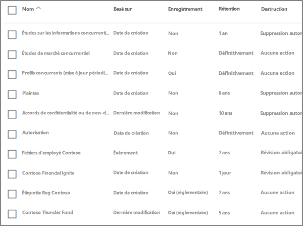

### Colonnes des descripteurs de plan de gestion de fichiers pour les étiquettes

Vous pouvez désormais inclure plus d’informations dans la configuration de vos étiquettes de conservation. L’insertion de descripteurs de plan de gestion de fichiers dans les étiquettes permet de gérer et d’organiser plus facilement votre plan.

Pour vous aider à démarrer, le gestionnaire de plan de gestion de fichiers fournit des valeurs prédéfinies prêtes à être utilisées pour : Fonction/service, Catégorie, Type d’autorité et Mise en service/citation. Vous pouvez ajouter de nouvelles valeurs de descripteur de plan de gestion de fichiers lorsque vous créez ou modifiez une étiquette de conservation.

Voici une vue de l’étape des descripteurs de plan de gestion des fichiers lors de la création ou de la modification d’une étiquette de conservation.

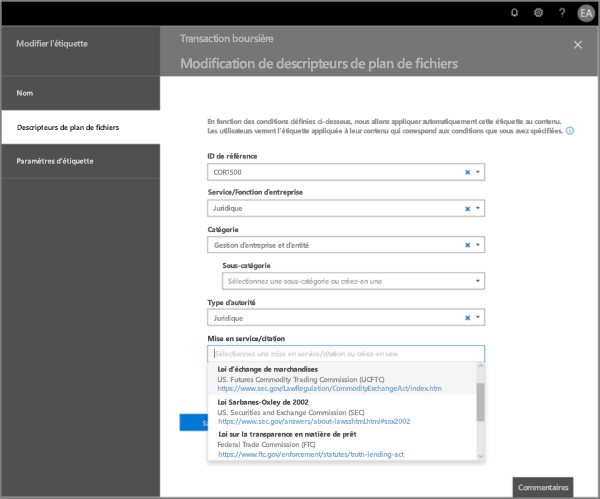

Voici une vue des colonnes de descripteurs du plan de gestion de fichiers dans l’onglet des étiquettes du gestionnaire de plan gestion de fichiers.

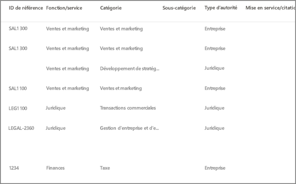

## Export d’étiquettes depuis votre plan de gestion de fichiers

Depuis le gestionnaire de plan de gestion de fichiers, vous pouvez exporter les détails de toutes les étiquettes de conservation dans un fichier .csv pour vous aider à fournir des évaluations périodiques de conformité aux responsables de la gouvernance des données de votre organisation.

Pour exporter toutes les étiquettes de conservation, accédez au **gestionnaire de plan de gestion de fichiers** \> **Actions de plan de gestion de fichiers** \> **Exporter les étiquettes**.

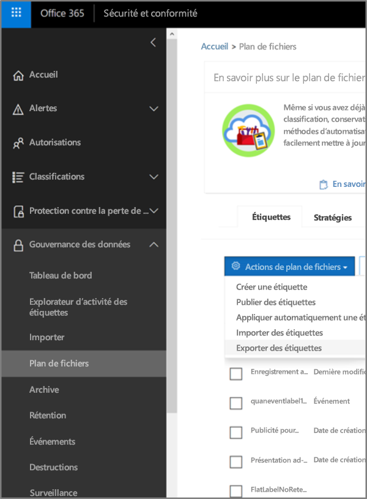

Un fichier *.csv contenant toutes les étiquettes de conservation existantes s’ouvre.

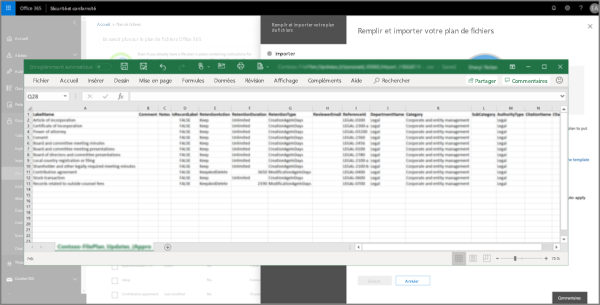

## Import d’étiquettes dans votre plan de gestion de fichiers

Dans le gestionnaire de plan de gestion de fichiers, vous pouvez importer de nouvelles étiquettes en bloc mais aussi modifier des étiquettes de conservation existantes.

Pour importer de nouvelles étiquettes de conservation et mettre à jour des étiquettes de conservation existantes, accédez au **gestionnaire de plan de gestion de fichiers** \> **Actions de plan de gestion de fichiers** \> **Importer les étiquettes**.

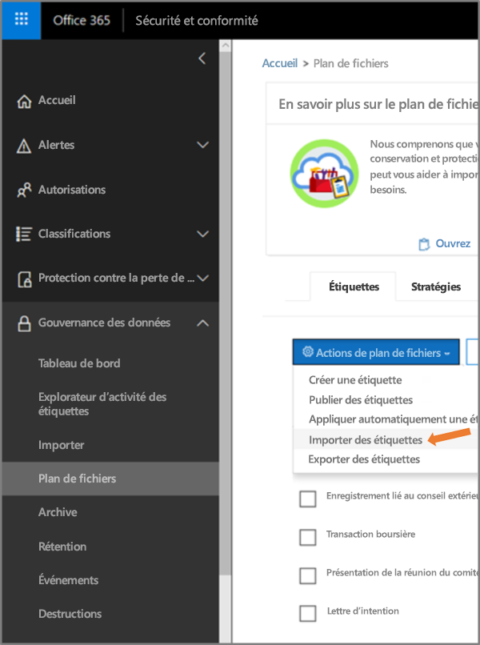

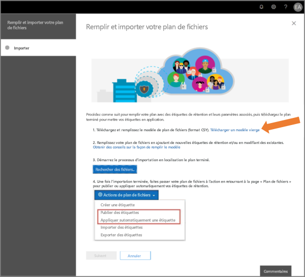

Téléchargez un modèle vide (ou démarrez à partir d’un export de votre plan de gestion de fichiers actuel).

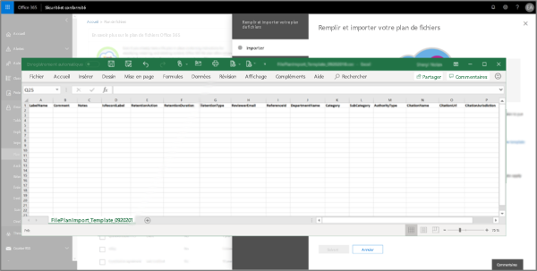

Complétez le modèle (des informations de référence sur les valeurs valides pouvant être saisies seront bientôt disponibles).

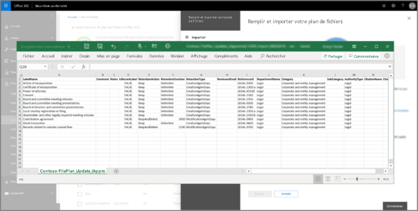

Chargez le modèle complété et le gestionnaire de plan de gestion de fichiers validera les entrées et affichera les statistiques d’importation.

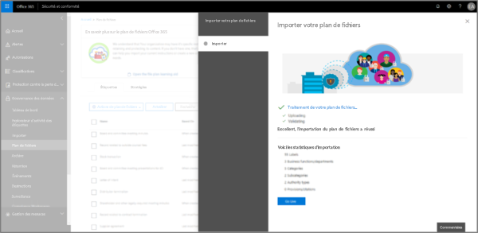

Une fois l’importation terminée, accédez à nouveau au gestionnaire de plan de gestion de fichiers pour attribuer de nouvelles étiquettes aux stratégies nouvelles ou existantes.

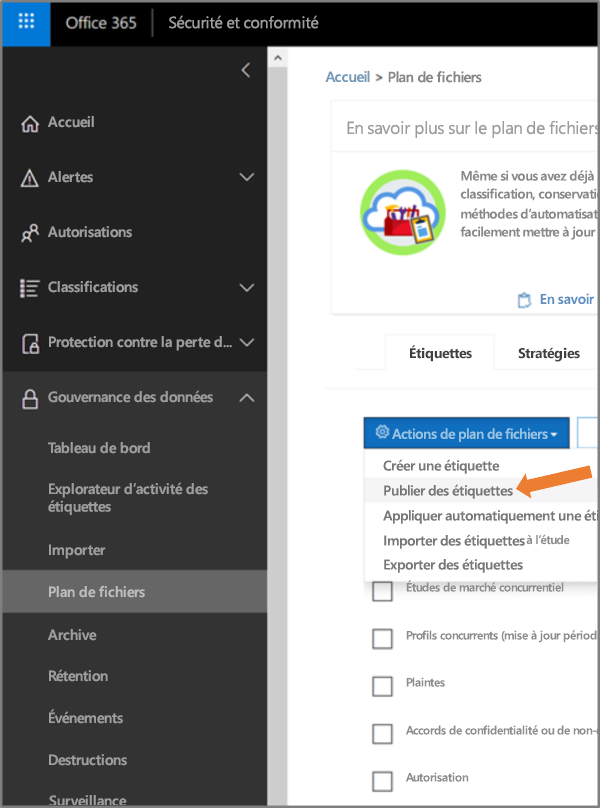

