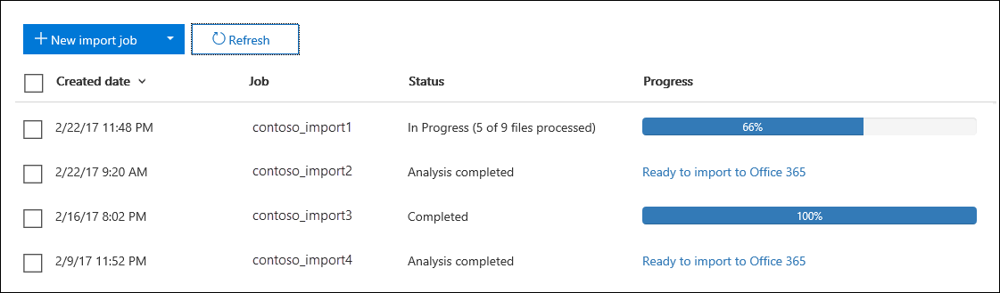

# Filtrer les données lors de l'importation de fichiers PST dans Office 365

Utilisez la nouvelle fonctionnalité d'importation intelligente dans le service d'importation Office 365 pour filtrer les éléments des fichiers PST qui sont réellement importés dans les boîtes aux lettres cible. Voici le principe de fonctionnement :
  
- Une fois que vous avez créé et soumis un travail d'importation PST, les fichiers PST sont téléchargés vers une zone de stockage Azure dans le Cloud Microsoft.
    
- Office 365 analyse les données des fichiers PST de manière sécurisée et sécurisée en identifiant l'âge des éléments de boîte aux lettres et les différents types de messages inclus dans les fichiers PST.
    
- Lorsque l'analyse est terminée et que les données sont prêtes à être importées, vous avez la possibilité d'importer toutes les données des fichiers PST telles quelles ou de découper les données importées en définissant des filtres qui contrôlent les données à importer. Par exemple, vous pouvez choisir de:
    
  - Importer uniquement les éléments d'un âge donné.
    
  - Importer les types de messages sélectionnés.
    
  - Exclure les messages envoyés ou reçus par des personnes spécifiques.
    
- Une fois que vous avez configuré les paramètres de filtre, Office 365 importe uniquement les données qui répondent aux critères de filtrage dans les boîtes aux lettres cibles spécifiées dans la tâche d'importation.
    
Le graphique suivant illustre le processus d'importation intelligent et met en surbrillance les tâches que vous effectuez et les tâches effectuées par Office 365.
  

  
## Avant de commencer

- Les étapes de cette rubrique supposent que vous avez créé une tâche d'importation PST dans le service d'importation Office 365 à l'aide du chargement réseau ou de l'expédition de disque. Pour obtenir des instructions pas à pas, reportez-vous à l'une des rubriques suivantes:
    
  - [Utiliser le chargement réseau pour importer des fichiers PST vers Office 365](use-network-upload-to-import-pst-files.md)
    
  - [Utiliser l’expédition de disque pour importer des fichiers PST dans Office 365](use-drive-shipping-to-import-pst-files-to-office-365.md)
    
- Une fois que vous avez créé une tâche d'importation à l'aide du chargement réseau, l'état de la tâche d'importation sur la page d'importation dans le centre de sécurité & conformité est défini sur **analyse en cours**, ce qui signifie qu'Office 365 analyse les données dans les fichiers PST que vous avez téléchargés. Cliquez **** pour mettre à jour l'état de la tâche d'importation. 
    
- Pour les tâches Import Import, les données seront analysées par Office 365 après que le personnel du centre de données Microsoft a reçu votre disque dur et a téléchargé les fichiers PST dans la zone de stockage Azure de votre organisation.
  
## Filtrer les données importées vers des boîtes aux lettres

Une fois que vous avez créé une tâche d'importation PST, suivez les étapes ci-dessous pour filtrer les données avant de les importer dans Office 365.
  
1. Accédez à [https://compliance.microsoft.com/](https://compliance.microsoft.com/) et connectez-vous à l'aide des informations d'identification d'un compte administrateur de votre organisation Office 365. 
    
2. Cliquez sur **importation**de la **gouvernance** \> de données.
    
    Les travaux d'importation de votre organisation sont répertoriés sur la page d' **importation** . Notez que la valeur **analyse terminée** dans la colonne **État** indique les travaux d'importation qui ont été analysés par Office 365 et qui sont prêts à être importés. 
    
    
  
3. Cliquez sur **prêt pour importer vers Office 365** pour le travail d'importation que vous souhaitez effectuer. 
    
    Une page de survol s'affiche avec des informations sur les fichiers PST et d'autres informations sur la tâche d'importation.
    
4. Cliquez sur **importer vers Office 365**.
    
    La page **filtrer vos données** s'affiche. Il contient des données sur les données des fichiers PST pour la tâche d'importation, y compris des informations sur l'ancienneté des données. 
    
    
  
5. Selon que vous souhaitez ou non découper les données importées vers Office 365, sous **voulez-vous filtrer vos données?**, effectuez l'une des opérations suivantes:
    
    a. Cliquez sur **Oui, je veux le filtrer avant de procéder** à l'importation pour découper les données que vous importez, puis cliquez sur **suivant**.
    
    La page de **page importer des données dans office 365** s'affiche avec des données détaillées sur l'analyse effectuée par Office 365. 
    
    
  
    Le graphique de cette page indique la quantité de données qui seront importées. Les informations relatives à chaque type de message trouvé dans les fichiers PST sont affichées dans le graphique. Vous pouvez pointer le curseur sur chaque barre pour afficher des informations spécifiques sur ce type de message. Il existe également une liste déroulante avec des valeurs d'âge différentes en fonction de l'analyse des fichiers PST. Lorsque vous sélectionnez un âge dans la liste déroulante, le graphique est mis à jour pour indiquer la proportion de données qui seront importées pour l'âge sélectionné. 
    
    b. Pour configurer des filtres d'addition afin de réduire la quantité de données importées, cliquez sur **autres options de filtrage**.
    
    
  
    Vous pouvez configurer ces filtres:
    
      - **Âge** : sélectionnez un âge de sorte que seuls les éléments qui sont plus récents que l'âge spécifié seront importés. Consultez la section [plus d'informations](#more-information) pour obtenir une description de la manière dont Office 365 détermine les tranches d'âge pour le filtre d' **âge** . 
    
      - **Type** -cette section affiche tous les types de messages trouvés dans les fichiers PST pour le travail d'importation. Vous pouvez désactiver une case à cocher en regard d'un type de message à exclure. Notez que vous ne pouvez pas exclure l'autre type de message. Consultez la section [plus d'informations](#more-information) pour obtenir la liste des éléments de boîte aux lettres inclus dans l'autre catégorie. 
    
      - **Utilisateurs** : vous pouvez exclure les messages envoyés ou reçus par des personnes spécifiques. Pour exclure les personnes qui apparaissent dans le champ de:, champ à: ou CC: des messages, cliquez sur **exclure les utilisateurs** en regard de ce type de destinataire. Tapez l'adresse de messagerie (adresse SMTP) de la personne, **** une nouvelle icône pour les ajouter à la liste des utilisateurs exclus pour ce type de destinataire, puis cliquez sur **Enregistrer** pour enregistrer la liste des utilisateurs exclus. 
    
        > [!NOTE]
        > Office 365 n'affiche pas les données visibles résultant de la définition du filtre **personnes** . Toutefois, si vous définissez ce filtre pour exclure les messages envoyés ou reçus par des personnes spécifiques, ces messages seront exclus pendant le processus d'importation réel. 
  
    c. Pour enregistrer les paramètres de votre filtre, cliquez sur **appliquer** dans la page **autres options de filtrage** . 
    
    La page importer des données dans **Office 365** est mise à jour en fonction des paramètres de votre filtre, y compris la quantité totale de données qui seront importées en fonction des paramètres de filtrage. Notez qu'un résumé des paramètres de filtre est également affiché. Vous pouvez cliquer sur **modifier** en regard d'un filtre pour modifier le paramètre si nécessaire. 
    
    
  
    d. Cliquez sur **Suivant**.
    
    Une page d'état affiche les paramètres de votre filtre. Une fois encore, vous pouvez modifier les paramètres de filtre.
    
    e. Cliquez sur **importer des données** pour démarrer l'importation. Notez que le volume total des données qui seront importées est affiché. 
    
    Ou
    
    a. Cliquez sur **non, je veux tout importer** pour importer toutes les données des fichiers PST vers Office 365, puis cliquez sur **suivant**.
    
    b. Sur la page **importer des données dans Office 365** , cliquez sur **importer des données** pour démarrer l'importation. Notez que le volume total des données qui seront importées est affiché. 
    
6. Sur la page **Importer** , cliquez **** . L'état de la tâche d'importation est affiché dans la colonne **État** . 
    
7. Cliquez sur le travail importer le travail pour afficher des informations plus détaillées, telles que l'état de chaque fichier PST et les paramètres de filtrage que vous avez configurés.

  
## Plus d’informations

- Comment Office 365 détermine-t-il les incréments du filtre d'âge? Lorsque Office 365 analyse un fichier PST, il examine l'heure d'envoi ou de réception de chaque élément (si un élément a un horodatage envoyé et reçu, la date la plus ancienne est sélectionnée). Office 365 examine alors la valeur de l'année de cet horodatage et la compare à la date actuelle pour déterminer l'âge de l'élément. Ces âges sont ensuite utilisés comme valeurs dans la liste déroulante pour le filtre d' **âge** . Par exemple, si un fichier PST contient des messages provenant de 2016, 2015 et 2014, les valeurs du filtre **âge** seraient **1 an**, **2 ans**et **3 ans**.
    
- Le tableau suivant répertorie les types de messages qui sont inclus dans l' **autre** catégorie dans le filtre **type** sur la page survol d' **options supplémentaires** (Voir l'étape 5B de la procédure précédente). Actuellement, vous ne pouvez pas exclure les éléments de la catégorie «autre» lorsque vous importez des fichiers PST dans Office 365. 
    
    |**ID de la classe de message**|**Éléments de boîte aux lettres qui utilisent cette classe de message**|
    |:-----|:-----|
    |Mn. Activité    |Entrées de journal    |
    |Mn. Sous    |Documents et fichiers (non joints à un message électronique)    |
    |Mn. Txt    |(identique à IPM. Sous    |
    |Mn. Note. IMC. notification    |Rapports envoyés par Internet Mail Connect, qui est la passerelle Exchange Server vers Internet    |
    |Mn. Note. Microsoft. Fax    |Messages de télécopie    |
    |Mn. Note. Rules. OOF. template. Microsoft    |Messages de réponse automatique d'absence du Bureau    |
    |Mn. Note. Rules. ReplyTemplate. Microsoft    |Réponses envoyées par une règle de boîte de réception    |
    |Mn. OleDb. Cours    |Exceptions pour une série périodique    |
    |Mn. Rappeler. Report    |Rapports de rappel de message    |
    |Mn. À    |Messages électroniques disTants    |
    |Mn. État    |Rapports d'état des éléments    |
