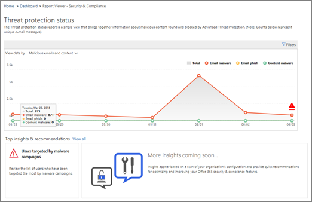

# Procédure pas à pas. D’un rapport détaillé à un aperçuWalkthrough - From a detailed report to an insight

Si vous débutez avec des [rapports et des informations dans le centre de sécurité &amp; conformité Office 365](reports-and-insights-in-security-and-compliance.md), il peut vous aider à naviguer dans un rapport détaillé vers une vue d’analyse et des actions recommandées.If you're new to [reports and insights in the Office 365 Security &amp; Compliance Center](reports-and-insights-in-security-and-compliance.md), it might help to see how you can easily navigate from a detailed report to an insight and recommended actions. 
  
Il s’agit de l’une des nombreuses procédures pas &amp; à pas pour le centre de sécurité conformité.This is one of several walkthroughs for the Security &amp; Compliance Center. Pour voir des procédures pas à pas supplémentaires, consultez la section [Rubriques connexes](#related-topics) .To see additional walkthroughs, see the [Related topics](#related-topics) section. 
  
## Procédure pas à pas: d’un rapport détaillé vers un aperçuWalkthrough: From a detailed report to an insight

Passons en revue le flux d’un rapport détaillé vers une vue et des actions.Let's walk through the flow from a detailed report to an insight and actions. (Il s’agit d’un bref exemple de [blocage du courrier indésirable et de programmes malveillants](anti-spam-and-anti-malware-protection.md) .)(This is a brief [anti-spam and anti-malware](anti-spam-and-anti-malware-protection.md) example.) 
  
1. Nous commençons par les rapports du [Centre de sécurité &amp; conformité](https://protection.office.com) .We begin with [Security &amp; Compliance Center](https://protection.office.com) reports. (Accédez au \*\*\*\* \> **tableau de bord**rapports.)(Go to **Reports** \> **Dashboard**.)  
  
2. Nous allons choisir un rapport pour obtenir une vue plus détaillée.We choose a report to get a more detailed view. (Choisissez un rapport, tel que le rapport d' **État de protection contre les menaces** .)(Choose a report, such as the **Threat Protection Status** report.) 
  
3. Nous constatons un indicateur Insights dans le graphique, ainsi que sous le rapport.We notice an insights indicator in the chart as well as below the report. Le positionnement du pointeur de la souris sur le marqueur Insights donne des détails supplémentaires.Positioning the mouse pointer on the insights marker gives some additional details. (Pointez sur le marqueur Insights pour afficher des détails supplémentaires.)(Hover over the insights marker to see additional details.)
    
4. Si vous cliquez sur le marqueur Insights dans le graphique ou sur le widget Insights sur les programmes malveillants sous le graphique, un volet de détails s’ouvre.Clicking either the insights marker in the chart or the insights widget about malware below the chart opens a details pane. (Sous le graphique, sélectionnez le widget Insights.)(Below the chart, select the insights widget.)  Le volet d’informations fournit des informations et des recommandations à prendre en compte, notamment la révision des stratégies, l’exploration et l’état de modification.The details pane provides information and recommendations to consider, including reviewing policies, conducting further exploration, and editing status. ([En savoir plus sur la protection contre le courrier indésirable et les programmes malveillants dans Office 365](anti-spam-and-anti-malware-protection.md).)([Learn more about anti-spam and anti-malware protection in Office 365](anti-spam-and-anti-malware-protection.md).)
    
De cette façon, nous pouvons passer d’un rapport détaillé à une vue et aux actions recommandées.In this way, we can move from a detailed report to an insight and recommended actions. 
  
## Sujets associésRelated topics

[Procédure pas à pas: d’un aperçu d’un rapport détailléWalkthrough: From an insight to a detailed report](from-an-insight-to-a-detailed-report.md)
  
[Procédure pas à pas: d’un tableau de bord vers un aperçuWalkthrough: From a dashboard to an insight](from-a-dashboard-to-an-insight.md)
  

