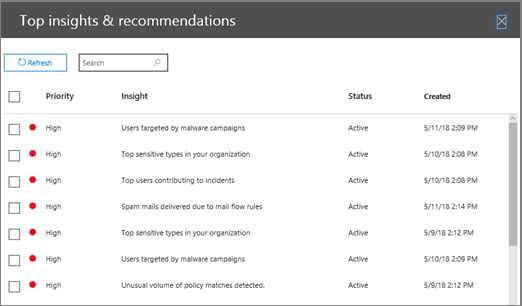

# Procédure pas à pas. D’un aperçu à un rapport détaillé

Si vous débutez avec des [rapports et des informations dans le centre de sécurité &amp; conformité Office 365](reports-and-insights-in-security-and-compliance.md), il peut vous aider à vous rendre compte d’un aperçu des rapports détaillés. 
  
Il s’agit de l’une des nombreuses procédures pas à pas pour le [Centre de sécurité &amp; conformité](https://protection.office.com). Pour voir des procédures pas à pas supplémentaires, consultez la section [Rubriques connexes](#related-topics) . 
  
## D’un aperçu d’un rapport détaillé

Passons en revue le flux du tableau de bord à un aperçu des rapports détaillés sur l’exploration des données. (Il s’agit d’un bref exemple de [protection contre la perte de données](data-loss-prevention-policies.md) .) 
  
1. Nous commençons par un tableau de bord dans le [Centre de sécurité &amp; conformité](https://protection.office.com). (Accédez au **** \> **tableau de bord**rapports.) 
  
2. Dans le coin supérieur gauche du tableau de bord, en regard des ** &amp; recommandations de première vue**, nous disposons d’un lien. (Cliquez sur **Afficher tout**.)  Cela nous amène à une liste d’informations pour notre organisation. 
  
3. La sélection d’un élément dans la liste ouvre un volet dans lequel nous pouvons afficher plus de détails sur cet élément. (Cliquez sur un élément.)  Nous voyons les actions recommandées, telles que la révision des stratégies. ([En savoir plus sur les stratégies de protection contre la perte de données](data-loss-prevention-policies.md).)
    
4. Nous disposons également d’un lien pour afficher plus de détails. (Cliquez sur **consulter les activités associées dans l’Explorateur**.) Cela nous amène à un type de rapport appelé [Explorateur de menaces (et détections en temps réel)](threat-explorer.md), où nous pouvons appliquer des filtres et approfondir des détails spécifiques. 
  
De cette façon, nous pouvons facilement passer d’un aperçu de ses détails sous-jacents et prendre des décisions plus éclairées quant à la protection contre la perte de données pour une organisation.
  
## Sujets associés

[Procédure pas à pas: d’un rapport détaillé vers un aperçu](from-a-detailed-report-to-an-insight.md)
  
[Procédure pas à pas: d’un tableau de bord vers un aperçu](from-a-dashboard-to-an-insight.md)
  

