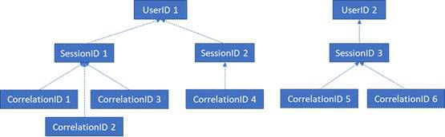

# RGPD pour Office Web Apps Server et Office Online Server

Les données de télémétrie Office Online Server et Office Web Apps Server sont stockées sous forme de journaux ULS. Vous pouvez utiliser la [visionneuse ULS](https://www.microsoft.com/en-us/download/details.aspx?id=44020) pour afficher les journaux ULS depuis votre client local.

Chaque ligne de journal contient un élément CorrelationID. Les lignes de journal connexes partagent le même CorrelationID. Chacun de ces éléments CorrelationID est lié à un seul élément SessionID, qui, lui, peut être associé à plusieurs éléments CorrelationID. Chaque SessionID peut être lié à un seul UserID, bien que certaines sessions puissent être anonymes et donc ne pas avoir d’élément UserID associé. Afin de déterminer les données qui sont associées à un utilisateur particulier, il est donc possible d’établir un mappage à partir d’un seul élément UserID vers les éléments SessionID associés à cet utilisateur, à partir de ces éléments SessionID vers les éléments CorrelationID associés et à partir de ces éléments CorrelationID vers tous les journaux de ces corrélations. Reportez-vous au diagramme ci-dessous pour voir la relation entre les différents ID.

## Collecte de journaux

Afin de collecter tous les journaux associés à l’élément UserID 1, par exemple, la première étape consisterait à collecter toutes les sessions associées à cet élément UserID 1 (c'est-à-dire, les éléments SessionID 1 et SessionID 2). L’étape suivante consisterait à collecter toutes les corrélations associées aux éléments SessionID 1 (c'est-à-dire, les éléments CorrelationID 1, 2 et 3) et SessionID 2 (c'est-à-dire, l’élément CorrelationID 4). Enfin, il faudrait collecter tous les journaux associés à chacune des corrélations de la liste.

1.  Lancez ULSViewer.

2.  Ouvrez le journal ULS correspondant à la période souhaitée ; les journaux ULS sont stockés dans %PROGRAMDATA%\\Microsoft\\OfficeWebApps\\Data\\Logs\\ULS.

3.  Éditez | Modifiez le filtre.

4.  Appliquez le filtre suivant :

    -   EventID est égal à apr3y ou

    -   EventID est égal à bp2d6

5.  Les éléments UserID hachés sont stockés dans le message de l’un de ces deux événements.

6.  Pour apr3y, le message contient une valeur UserID et une valeur PUID.

7.  Pour bp2d6, le message contient d’autres informations. Le champ de la valeur LoggableUserId est l’élément UserID haché.

8.  Une fois que vous avez récupéré l’élément UserID haché à partir de l’un de ces deux événements, la valeur WacSessionId de cette ligne dans ULSViewer contient l’élément WacSessionId associé à cet utilisateur.

9.  Collectez toutes les valeurs WacSessionId associées à l’utilisateur en question.

10. Filtrez tous les éléments EventID dont la valeur est « xmnv », le message obtenu sera « UserSessionId=\<WacSessionId\> » pour le premier élément WacSessionId de la liste (en remplaçant l’élément \<WacSessionId\> du filtre par votre élément WacSessionId).

11. Collectez toutes les valeurs de corrélation qui correspondent à cet élément WacSessionId.

12. Répétez les étapes 10 et 11 pour toutes les valeurs de WacSessionId dans votre liste pour l’utilisateur en question.

13. Filtrez toutes les corrélations qui correspondent à la première corrélation de votre liste.

14. Collectez tous les journaux correspondant à cette corrélation.

15. Répétez les étapes 13 et 14 pour toutes les valeurs de la corrélation de votre liste pour l’utilisateur en question.

## Types de données

Les journaux Office contiennent de nombreux types de données différents. Voici quelques exemples de données que contiennent les journaux ULS :

-   Des codes d’erreur pour les problèmes rencontrés lors de l’utilisation du produit

-   Des clics et autres données sur l’utilisation de l’application

-   Des données sur les performances de l’application et/ou des fonctionnalités particulières au sein de l’application

-   Des informations générales sur l’emplacement de l’ordinateur de l’utilisateur (par exemple, le pays/la région, le département et la ville, issus de l’adresse IP), mais pas une géolocalisation précise

-   Des métadonnées de base sur le navigateur, par exemple, le nom et la version du navigateur, et sur l’ordinateur, par exemple, son type de système d’exploitation et sa version

-   Des messages d’erreur de l’hôte du document (par exemple, OneDrive, SharePoint, Exchange)

-   Des informations sur les processus internes de l’application, non liés aux actions entreprises par l’utilisateur
