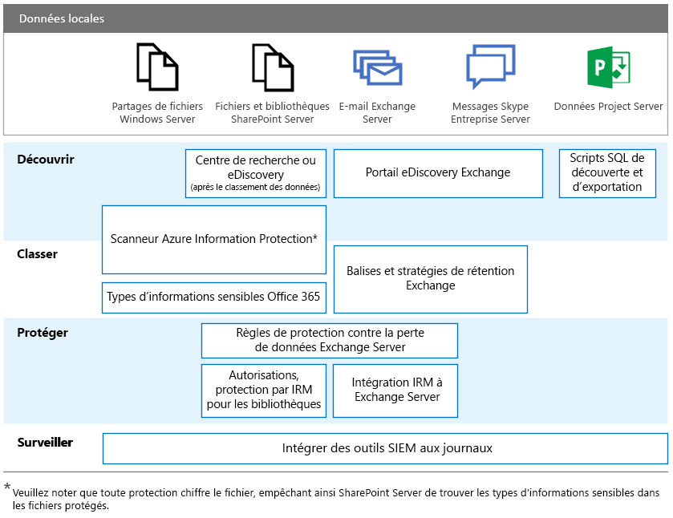

# RGPD pour les serveurs Office locaux

Le Règlement général sur la protection des données (RGPD) présente les exigences que doivent respecter les organisations pour protéger les données personnelles et répondre aux demandes de personnes concernées de façon appropriée. Cette série d’articles présente les approches recommandées pour les charges de travail locales :

-   [SharePoint Server](gdpr-for-sharepoint-server.md)

-   [Exchange Server](gdpr-for-exchange-server.md)

-   [Skype Entreprise Server](gdpr-for-skype-for-business-server.md)

-   [Project Server](gdpr-for-project-server.md)

-   [Office Web Apps Server et Office Online Server](gdpr-for-office-online-server.md)

-   [Partages de fichiers en local](gdpr-for-on-premises-file-shares.md)

Pour plus d’informations sur le RGPD et sur l’aide que peut vous apporter Microsoft, reportez-vous au [centre de gestion de la confidentialité](https://www.microsoft.com/fr-FR/TrustCenter/Privacy/gdpr/default.aspx).

Avant d’entreprendre toute action concernant des données locales, consultez vos équipes juridiques et de conformité pour leur demander conseil et pour en savoir plus sur les schémas de classification existants et les approches en matière d’utilisation de données personnelles. Microsoft fournit des recommandations pour développer et améliorer les schémas de classification dans son Kit de détection de données du RGPD à l’adresse [http://aka.ms/gdprpartners](<http://aka.ms/gdprpartners>). Ce kit décrit également les approches possibles pour déplacer des données locales vers le cloud, dans lequel vous pouvez utiliser des fonctionnalités de gouvernance des données plus avancées si vous le souhaitez. Les articles de cette section fournissent des recommandations pour les données qui sont destinées à rester au niveau local.

L’illustration suivante regroupe les fonctionnalités que nous vous recommandons d’utiliser pour chacune des charges de travail suivantes afin de repérer, classer, protéger et surveiller les données personnelles. Consultez les articles de cette section pour obtenir plus d’informations.

## Description de l’illustration

Concernant l’accessibilité, le tableau suivant fournit les mêmes exemples dans l’illustration.

|             |Partages de fichiers Windows Server|SharePoint Server|Exchange Server|Skype Entreprise|Project Server|
|:------------|:-------------------------|:----------------|:--------------|:-----------------|:-------------|
|Découvrir|Scanneur Azure Information Protection*|Centre de recherche ou eDiscovery (une fois les données classées) ; scanneur Azure Information Protection*|Portail eDiscovery Exchange|Portail eDiscovery Exchange|Scripts SQL de découverte et d’exportation|
|Classer|Scanneur Azure Information Protection* ; types d’informations sensibles Office 365|Scanneur Azure Information Protection* ; types d’informations sensibles Office 365|Balises et stratégies de rétention Exchange|Balises et stratégies de rétention Exchange||
|Protéger||Règles de protection contre la perte de données Exchange Server ; autorisations, protection IRM pour bibliothèques|Règles de protection contre la perte de données Exchange Server ; intégration IRM avec Exchange Server|||
|Surveiller|Intégrer des outils SIEM aux journaux|Intégrer des outils SIEM aux journaux|Intégrer des outils SIEM aux journaux|Intégrer des outils SIEM aux journaux|Intégrer des outils SIEM aux journaux|

*Veuillez noter que toute protection chiffre le fichier, empêchant ainsi SharePoint Server de trouver les types d’informations sensibles dans les fichiers protégés.
