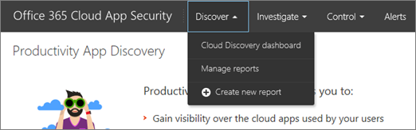

# Se préparer pour la sécurité des applications cloud Office 365
  
|Évaluation * *\>**|Planification * *\>**|Déploiement * *\>**|Utilisation * * * *|
|:-----|:-----|:-----|:-----|
|[Commencer l'évaluation](office-365-cas-overview.md)   |Vous êtes là!    [Étape suivante](turn-on-office-365-cas.md)   |[Démarrer le déploiement](turn-on-office-365-cas.md)   |[Commencer à utiliser](utilization-activities-for-ocas.md)   |
   
Lors de la préparation de l'activation et de l'implémentation de la sécurité des applications Cloud Office 365 pour votre organisation, il existe quelques éléments à prendre en compte. Utilisez cet article pour planifier la sécurité des applications Cloud Office 365.
    
## Étape 1: identifier et protéger vos comptes d'administrateur général et de sécurité

Les administrateurs généraux, les administrateurs de la sécurité et les lecteurs de sécurité peuvent accéder au portail de sécurité des applications Cloud Office 365 pour afficher des stratégies, examiner les alertes et utiliser des rapports. Les administrateurs globaux et les administrateurs de sécurité peuvent définir des stratégies et prendre d'autres mesures pour protéger votre organisation. (Pour plus d'informations, consultez [la rubrique autorisations dans le &amp; Centre de sécurité conformité Office 365](permissions-in-the-security-and-compliance-center.md).) Examinez les comptes d'utilisateur de votre organisation qui ont des autorisations élevées par mesure de précaution. 
  
 **[Protégez vos comptes d'administrateur général Office 365](https://docs.microsoft.com/office365/enterprise/protect-your-global-administrator-accounts)**. 
  
## Étape 2: activation de la journalisation d'audit pour votre organisation

Pour que la sécurité des applications Cloud Office 365 fonctionne correctement, la journalisation d'audit doit être activée. Cette opération est généralement réalisée par un administrateur Exchange Online ou un administrateur général.
  
 **[Activer ou désactiver la recherche dans le journal d'audit Office 365](turn-audit-log-search-on-or-off.md)**. 
  
## Étape 3: accéder au portail de sécurité des applications Cloud Office 365

Vous pouvez accéder au portail de sécurité des applications Cloud Office 365 en accédant à [https://portal.cloudappsecurity.com](https://portal.cloudappsecurity.com) et en vous connectant. 

Vous pouvez également y accéder à partir du centre de &amp; sécurité conformité Office 365. Voici une excellente façon de procéder:

1. Accédez à [https://protection.office.com](https://protection.office.com) et connectez-vous. (vous accédez au centre de &amp; sécurité conformité.)
    
2. Accédez à **alertes** \> : **gérer les alertes avancées**.
    
3. Sélectionnez **accéder à la sécurité des applications Cloud office 365** pour accéder au portail de sécurité Office 365 Cloud App.   Lorsque vous accédez au portail de sécurité des applications Cloud Office 365, la première page que vous voyez est la page stratégies, qui ressemble à l'image suivante:  
  
## Étape 4: définir des stratégies et configurer des &amp; actions d'alerte

Les administrateurs généraux et les administrateurs de sécurité définissent des stratégies dans Office 365 Cloud App Security. Lors du processus de définition des stratégies, les alertes et les actions sont également définies. Une alerte est une notification basée sur des critères qui apparaît dans un affichage ou qui est envoyée par courrier électronique. 
  
Il existe deux types d'alertes dans Office 365 Cloud App Security: alertes de détection d'anomalies détectant les activités suspectes, ainsi que les alertes d'activité, qui sont définies pour les activités susceptibles d'être atypiques pour votre organisation. Les alertes informent les administrateurs généraux et les administrateurs de la sécurité lorsqu'une activité de votre environnement Office 365 est inhabituelle pour votre organisation.
  
Pour en savoir plus, consultez les ressources suivantes:
  
- [Stratégies d’activité et alertes pour Office 365 Cloud App Security](activity-policies-and-alerts.md)
    
- [Stratégies de détection des anomalies dans la sécurité des applications cloud Office 365](anomaly-detection-policies-in-ocas.md)
    
- [Examiner et effectuer des actions sur les alertes de sécurité d'application Cloud Office 365](review-office-365-cas-alerts.md)
    

## Étape 5: configurer le contrôle d'application d'accès conditionnel

ConFigurez et appliquez des contrôles aux applications de votre organisation, en fonction de certaines conditions, par exemple les utilisateurs qui peuvent utiliser quelles applications, et où. Définir les stratégies d'accès et de session de l'utilisateur pour déterminer si des documents sensibles peuvent être téléchargés et chiffrés, bloquer l'accès à certaines applications, configurer le mode lecture seule pour certaines applications et restreindre les sessions des utilisateurs de réseaux non professionnels.

Pour en savoir plus, consultez les ressources suivantes:

- [Protéger les applications avec le contrôle d’accès conditionnel aux applications d’Office 365 Cloud App Security](ocas-conditional-access-app-control.md)

- [Déployer le contrôle d’accès conditionnel aux applications pour les applications Office 365](ocas-deploy-conditional-access-app-control.md)

## Étape 6: en savoir plus sur l'utilisation du Cloud de votre organisation

En tant qu'administrateur général, administrateur de sécurité ou lecteur de sécurité, vous pouvez en savoir plus sur l'utilisation du Cloud de votre organisation via des rapports et un tableau de bord de découverte dans le Cloud (également appelé découverte d'application de productivité). Ce tableau de bord affiche des informations sur les utilisateurs, les applications, le trafic Web et les niveaux de risque.
  

  
pour accéder au tableau de bord de découverte de l'application de productivité, dans le portail de sécurité des applications cloud Office 365, sélectionnez **découvrir** \> le **tableau de bord de découverte cloud**.
  

  
Pour remplir des rapports avec les informations dont vous avez besoin, téléchargez vos fichiers journaux à partir des proxys et pare-feu de votre organisation. Pour en savoir plus, consultez les ressources suivantes:
  
- [Créer des rapports de découverte d'application dans Office 365 Cloud App Security](create-app-discovery-reports-in-ocas.md)
    
- [Passer en revue les détections d'applications dans la sécurité des applications cloud Office 365](review-app-discovery-findings-in-ocas.md)
    
## Étape 7: gérer les applications que votre organisation utilise pour accéder à Office 365

En tant qu'administrateur général ou administrateur de sécurité, vous pouvez gérer des applications, telles que des applications personnalisées ou des applications tierces, que les personnes de votre organisation utilisent sur leurs appareils avec Office 365. Par exemple, supposons qu'une personne a téléchargé une application personnalisée qu'elle souhaite utiliser avec Office 365. Vous pouvez passer en revue les applications que les utilisateurs utilisent, interdire les applications non approuvées ou marquer les applications comme étant approuvées à des fins de suivi. [Gérer les applications OAuth à l'aide de la sécurité des applications Cloud Office 365](manage-app-permissions-in-ocas.md).
  
## Étape 8: créer un plan de maintenance

Une fois que vous avez configuré et configuré Office 365 Cloud App Security, vous pouvez effectuer certaines tâches d'utilisation en tant qu'administrateur général ou administrateur de sécurité Office 365 pour votre organisation. En effectuant ces tâches, vous vous assurerez que la sécurité des applications Cloud d'Office 365 est correctement configurée, que vos stratégies sont à jour, et que votre organisation réalise la valeur à partir d'Office 365. Utilisez cet article pour vous aider à planifier ces tâches. Consultez la rubrique [utilisation des activités après le déploiement de la sécurité des applications Cloud Office 365](utilization-activities-for-ocas.md).

## Module Étape 9: utiliser votre serveur SIEM avec la sécurité des applications Cloud Office 365

Votre organisation utilise-t-elle un serveur de gestion des événements et des informations de sécurité (SIEM)? Office 365 Cloud App Security peut désormais s'intégrer à votre serveur SIEM pour permettre une surveillance centralisée des alertes. L'intégration à un service SIEM vous permet de mieux protéger vos applications Cloud tout en conservant votre flux de travail de sécurité habituel, en automatisant les procédures de sécurité et en corréler les événements sur site et en nuage. L'agent SIEM s'exécute sur votre serveur, extrait les alertes de la sécurité des applications Cloud Office 365 et diffuse ces alertes sur votre serveur SIEM. Voir [intégration Siem avec Office 365 Cloud App Security](integrate-your-siem-server-with-office-365-cas.md).
  
## Étapes suivantes

- [Activer la sécurité des applications cloud Office 365](turn-on-office-365-cas.md)
    
- Essayez notre [Guide de laboratoire de test](https://docs.microsoft.com/office365/enterprise/cloud-app-security-for-your-office-365-dev-test-environment) pour une expérience pratique où vous pouvez présenter les fonctionnalités puissantes d'Office 365 Cloud App Security et créer une preuve de concept. 
    

