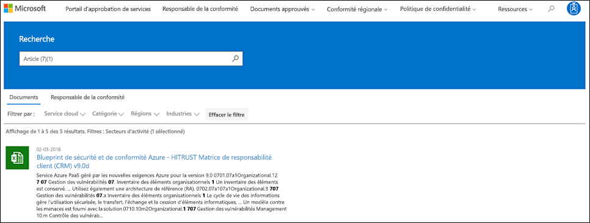
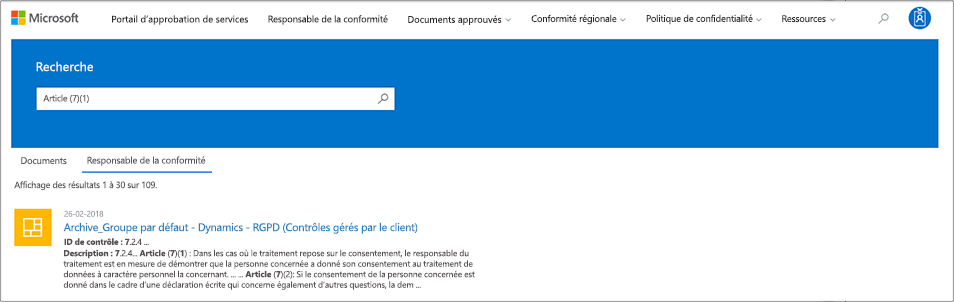
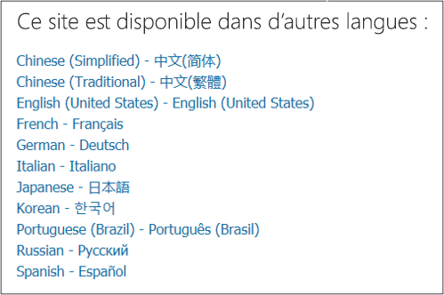

# Prise en main du portail d’approbation de services Microsoft

Le portail d'approbation de services Microsoft propose un large éventail de contenus, d'outils et d'autres ressources sur les pratiques en matière de sécurité, de confidentialité et de conformité de Microsoft.
  
## Accès au portail d'approbation de services

Le portail d'approbation de services contient des détails sur l'implémentation de Microsoft des contrôles et des processus qui protègent nos services Cloud et les données client qu'ils contiennent. Pour accéder à certaines des ressources sur le portail d'approbation de services, vous devez vous connecter en tant qu'utilisateur authentifié avec votre compte de services de Cloud Computing Microsoft (soit un compte d'organisation Azure Active Directory ou un compte Microsoft), puis consulter et accepter Microsoft Accord de non-divulgation pour les matières de conformité.
  
Les **clients existants peuvent accéder au portail d'approbation de service** à [https://aka.ms/STP](https://aka.ms/STP) l'aide de l'un des abonnements en ligne suivants (version d'évaluation ou payante): 
  
- Office 365

- Dynamics 365

- Azure
    
 > [!NOTE]
 > Les comptes Azure Active Directory associés aux organisations ont accès à l'ensemble des documents et des fonctionnalités, comme le gestionnaire de conformité. Les comptes Microsoft créés pour une utilisation personnelle ont un accès limité au contenu du portail d'approbation de services. 
  
**Nouveaux clients et clients évaluant Microsoft Online Services**
  
Pour créer un compte ou pour créer un compte d'évaluation, utilisez l'un des formulaires d'inscription suivants (également utilisé pour les comptes d'évaluation) pour accéder au protocole STP.
  
- S'inscrire à un nouveau [compte d'évaluation office 365 Business](https://go.microsoft.com/fwlink/p/?LinkID=507653) ou à un nouveau [compte d'évaluation d'Office 365 Enterprise](https://go.microsoft.com/fwlink/p/?LinkID=698279)

- S'inscrire à un nouveau [compte d'évaluation Dynamics 365](https://go.microsoft.com/fwlink/?LinkId=252780)

- Inscrivez-vous à un nouveau [compte Azure Trial](https://go.microsoft.com/fwlink/?LinkId=722737). 
    
Lorsque vous vous inscrivez à une version d'évaluation gratuite ou à un abonnement, vous devez activer Azure Active Directory pour qu'il prenne en charge votre accès au STP.
  
## Utilisation du portail d'approbation de service

Les fonctionnalités et le contenu du portail d'approbation de service sont accessibles à partir du menu principal.
  

Les sections suivantes décrivent chaque élément du menu principal.
  
### Portail d’approbation de service

Le lien **portail d'approbation de services** affiche la page d'accueil. Il offre un moyen rapide de revenir à la page d'accueil.

### Conformité

Fournit les ressources et les outils de conformité suivants:

- **Rapports d'audit** : une liste de rapports d'analyse et d'évaluation indépendants sur les services Cloud de Microsoft s'affiche. Ces rapports fournissent des informations sur la conformité des services de Cloud Computing Microsoft avec les normes de protection des données et les exigences réglementaires, telles que:
  
    - Organisation internationale de normalisation (ISO)
    - Contrôles d'organisation de service (SOC)
    - Institut NIST (National Institute of Standards and Technology)
    - Programme fédéral de gestion des risques et d'autorisations (FedRAMP)
    - Règlement général sur la protection des données (RGPD)

  Les informations relatives aux rapports d'audit et un lien vers la page **rapports d'audit** s'affichent également sur la page d'accueil du portail de confiance de service. 
  
- **Gestionnaire de conformité** -le gestionnaire de conformité est un outil d'évaluation de risque basé sur un flux de travail qui vous permet de suivre, d'affecter et de vérifier les activités de conformité réglementaire de votre organisation liées aux services Cloud de Microsoft, comme Office 365, Dynamics 365 et Bleu. Utilisez le gestionnaire de conformité pour gérer la conformité réglementaire dans le modèle de responsabilité partagé du Cloud. Pour plus d'informations, consultez [la rubrique utiliser le gestionnaire de conformité pour répondre aux exigences réglementaires et de protection des données lors de l'utilisation des services Cloud Microsoft](meet-data-protection-and-regulatory-reqs-using-microsoft-cloud.md).

### Régions & industries

Fournit des informations de conformité spécifiques de l'industrie et de la région sur les services Cloud Microsoft.

- **Industries** -fournit des pages d'accueil spécifiques au secteur pour obtenir des informations et sur la façon dont les services Cloud de Microsoft aident votre organisation à respecter les normes et réglementations de ces industries:

    - Éducation
    - Services financiers
    - Institutions
    - Intégrité
    - Fabrication
    - Détail

- **Régions** : fournit des avis juridiques sur la conformité des services de Cloud Computing Microsoft avec différentes lois de différents pays. Certains pays incluent Australie, République tchèque, Allemagne, Pologne, Roumanie, Espagne et Royaume-Uni.
  
### Documents & ressources

Fournit un grand nombre d'informations sur la mise en œuvre et la conception de la sécurité afin de vous aider à respecter les objectifs de conformité réglementaire en sachant comment les services Cloud de Microsoft maintiennent vos données en toute sécurité. Pour passer en revue le contenu, sélectionnez l'une des options de la page **documents & de ressources** .

- Livres blancs, FAQ et Articles de procédure
- Guides de conformité
- Tests de stylet et évaluations de la sécurité
- Score de sécurité
- Modèles de sécurité et de conformité Azure
- Contrôles audités
  
### Centre de gestion de la confidentialité

Liens vers le [Centre](https://www.microsoft.com/trustcenter)de gestion de la confidentialité de Microsoft, qui fournit plus d'informations sur la sécurité, la conformité et la confidentialité dans le Cloud Microsoft. Cela inclut des informations sur les fonctionnalités des services de Cloud Computing de Microsoft que vous pouvez utiliser pour répondre aux exigences spécifiques du RGPD, de la documentation utile à votre responsabilité RGPD et de votre compréhension des mesures techniques et organisationnelles Microsoft a pris en charge le RGPD.
  
### Ma bibliothèque

Cette nouvelle fonctionnalité vous permet d'enregistrer ( ** ou d'épingler) des documents afin de pouvoir y accéder rapidement sur la page ma bibliothèque. Vous pouvez également configurer des notifications pour que Microsoft vous envoie un message électronique lorsque des documents de votre bibliothèque sont mis à jour. Pour plus d'informations, reportez-vous à la section [My Library](#my-library-1) de cet article.

### Admin

Fonctions administratives uniquement disponibles pour le compte d'administrateur général. Cette option est visible uniquement lorsque vous êtes connecté en tant qu'administrateur général.
  
 La page **paramètres** vous permet d'attribuer un accès basé sur les rôles au gestionnaire de conformité. Pour plus d'informations, reportez-vous à la section «autorisations et contrôle d'accès basé sur un rôle» dans [utiliser le gestionnaire de conformité pour répondre aux exigences réglementaires et de protection des données lors de l'utilisation des services Cloud de Microsoft](meet-data-protection-and-regulatory-reqs-using-microsoft-cloud.md#permissions-and-role-based-access-control).
  
### Rechercher

Cliquez sur la loupe dans le coin supérieur droit de la page du portail d'approbation de service pour développer la zone, entrez vos termes de recherche, puis appuyez sur **entrée**.

  
 La page de **recherche** s'affiche, avec le terme de recherche affiché dans la zone de recherche et les résultats de la recherche répertoriés ci-dessous.
  

Par défaut, la recherche renvoie les résultats du document. Vous pouvez obtenir les résultats en utilisant des listes déroulantes pour affiner la liste des documents affichés. Vous pouvez utiliser plusieurs filtres pour affiner la liste des documents. Les filtres incluent les services Cloud spécifiques, les catégories de conformité, les pratiques de sécurité, les régions et les industries. Cliquez sur le lien nom du document pour télécharger le document.
  
Pour répertorier les contrôles des évaluations dans le gestionnaire de conformité liées à vos termes de recherche, cliquez sur **Gestionnaire de conformité**. Les résultats de la recherche indiquent la date à laquelle l'évaluation a été créée, le nom du regroupement d'évaluation, le service Cloud Microsoft applicable et si le contrôle est géré par Microsoft ou par le client. Cliquez sur le nom du contrôle pour afficher le contrôle dans le gestionnaire de conformité.
  

  
> [!NOTE]
> Les rapports et les documents du portail d'approbation de services peuvent être téléchargés pendant au moins 12 mois après la publication ou jusqu'à ce qu'une nouvelle version du document soit disponible.
  
## Ma bibliothèque

Utilisez la fonctionnalité ma bibliothèque pour ajouter des documents et des ressources sur le portail d'approbation de service à votre page ma bibliothèque. Cela vous permet d'accéder aux documents qui vous concernent dans un seul et même emplacement.  Pour ajouter un document à votre bibliothèque, cliquez sur le menu **...** à droite d'un document, puis sélectionnez **Ajouter à la bibliothèque**. Vous pouvez ajouter plusieurs documents à votre bibliothèque mon bibliothèque en cliquant sur la case à cocher en regard d'un ou de plusieurs documents, puis en cliquant sur **enregistrer dans la bibliothèque** en haut de la page.

En outre, la fonctionnalité de notifications vous permet de configurer votre bibliothèque de manière à ce qu'un message électronique vous soit envoyé chaque fois que Microsoft met à jour un document que vous avez ajouté à votre bibliothèque. Pour configurer les notifications, accédez à votre bibliothèque et cliquez sur **paramètres de notification**. Vous pouvez choisir la fréquence des notifications et spécifier une adresse de messagerie dans votre organisation pour envoyer des notifications. Les notifications par courrier électronique incluent des liens vers les documents qui ont été mis à jour et une brève description de la mise à jour.

Notez également que nous identifions tous les documents de votre bibliothèque qui ont été mis à jour au cours des 30 derniers jours, que vous activiez ou non des notifications. Une brève description de la mise à jour s'affiche également dans une info-bulle. 

## Kits de démarrage

Les kits de démarrage sont un ensemble de documentation organisée par Microsoft sur les services Cloud Microsoft pour des industries spécifiques. Le portail d'approbation de services offre actuellement les trois packs de démarrage pour les organisations de services financiers. Ces Starter packs aident les organisations à évaluer et à évaluer la sécurité, la conformité et la confidentialité dans le Cloud Microsoft et fournissent des conseils pour vous aider à implémenter les services Cloud de Microsoft dans le secteur des services financiers hautement réglementés.

- **Pack de démarrage d'évaluation** : utilisez pour l'évaluation anticipée du Cloud Microsoft pour les organisations de services financiers.

- **Pack de démarrage d'évaluation** -après évaluation, utilisez les listes de vérification et d'autres instructions dans ce pack de démarrage pour aider votre organisation à évaluer les risques liés à la sécurité, à la conformité et à la confidentialité.

- **Pack de démarrage d'audit** -utilisateur ce Starter Pack fournit des instructions sur l'utilisation des contrôles d'audit et d'autres outils pour vous aider à mettre en œuvre les services Cloud de Microsoft d'une manière qui contribue à réduire l'exposition aux risques de votre organisation.

Pour accéder à ces Starter packs, accédez à **Service Trust Portal _GT_ industries _AMP_ regions _GT_ Industry Solutions _GT_ Financial Services**. Vous pouvez ouvrir ou télécharger des documents à partir d'un Starter Pack ou les enregistrer dans votre bibliothèque.

## Prise en charge de localisation

Le portail d'approbation de services vous permet d'afficher le contenu de la page dans différentes langues. Pour modifier la langue de la page, il suffit de cliquer sur l'icône en forme de globe dans le coin inférieur gauche de la page et de sélectionner la langue de votre choix. 
  

  
## Commentaires

Nous pouvons vous aider à répondre à des questions sur le portail d'approbation de service ou des erreurs que vous surveillez lorsque vous utilisez le portail. Vous pouvez également nous contacter avec des questions et des commentaires sur les rapports de conformité du portail d'approbation de service et les ressources d'approbation à l'aide du lien Commentaires en bas des pages STP.
  
Vos commentaires sont très importants pour nous. Cliquez sur le bouton commentaires au bas de la page pour nous envoyer des commentaires sur ce que vous avez fait ou n'aimez pas, ou des suggestions dont vous pouvez avoir besoin pour améliorer nos produits ou nos fonctionnalités de produit.
  

