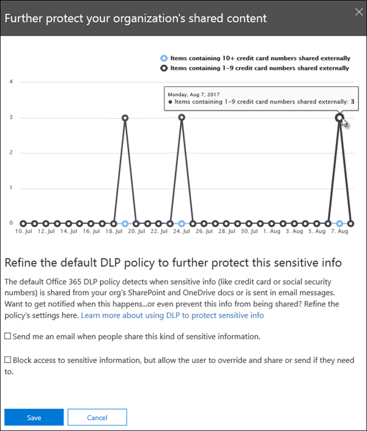

# Prise en main de la stratégie DLP par défaut

Avant de créer votre première stratégie de protection contre la perte de données (DLP), DLP contribue à protéger vos informations sensibles à l'aide d'une stratégie par défaut. Cette stratégie par défaut et ses recommandations (illustrées ci-dessous) vous permettent de sécuriser votre contenu sensible en vous avertissant que des messages ou des documents contenant un numéro de carte de crédit ont été partagés avec une personne extérieure à votre organisation. Cette recommandation s'affiche sur la page d' **Accueil** du centre de &amp; sécurité et de conformité. 
  
Vous pouvez utiliser ce widget pour afficher rapidement quand et comment les informations sensibles ont été partagées, puis affiner la stratégie DLP par défaut dans un ou deux. Vous pouvez également modifier la stratégie DLP par défaut à tout moment, car elle est entièrement personnalisable. Notez que si vous ne voyez pas la recommandation, essayez de cliquer sur **+ autres** en bas de la section **recommandé pour vous** . 
  

  
## Afficher le rapport et affiner la stratégie DLP par défaut

Lorsque le widget vous montre que les utilisateurs ont partagé des informations sensibles avec des personnes extérieures à votre organisation, choisissez affiner la **stratégie DLP** en bas. 
  
Le rapport détaillé indique quand et quelle proportion de contenu contenant des numéros de carte de crédit a été partagé au cours des 30 derniers jours. Notez que les correspondances de règle peuvent prendre jusqu'à 48 heures pour apparaître dans le widget.
  
Pour protéger les informations sensibles, la stratégie DLP par défaut:
  
- Détecte quand le contenu dans Exchange, SharePoint et OneDrive qui contient au moins un numéro de carte de crédit est partagé avec des personnes extérieures à votre organisation.
    
- Affiche un Conseil de stratégie et envoie une notification par courrier électronique aux utilisateurs lorsqu'ils essaient de partager ces informations sensibles avec des personnes extérieures à votre organisation. Pour plus d'informations sur ces options, consultez la rubrique [Envoyer des notifications par courrier électronique et afficher les conseils de stratégie pour les stratégies DLP](use-notifications-and-policy-tips.md).
    
- Génère des rapports d'activité détaillés pour vous permettre d'effectuer le suivi des éléments tels que le partage du contenu avec des personnes extérieures à votre organisation et à quel moment. Vous pouvez utiliser les [données du journal d'audit](search-the-audit-log-in-security-and-compliance.md) et des [rapports DLP](view-the-dlp-reports.md) (where **** = **DLP**) pour afficher ces informations.
    
Pour affiner rapidement la stratégie DLP par défaut, vous pouvez choisir de la faire:
  
- Vous envoyer un rapport d'incident par courrier électronique lorsque les utilisateurs partagent ces informations sensibles avec des personnes extérieures à votre organisation.
    
- Ajouter d'autres utilisateurs au rapport d'incident de courrier électronique.
    
- Bloquer l'accès au contenu contenant les informations sensibles, tout en permettant à l'utilisateur de le remplacer et de le partager ou de l'envoyer si nécessaire.
    
Pour plus d'informations sur les rapports d'incident ou la limitation de l'accès, voir [Overview of Data Loss Prevention Policies](data-loss-prevention-policies.md).
  
Si vous souhaitez modifier ces options ultérieurement, vous pouvez modifier la stratégie DLP par défaut à tout moment-consultez la section suivante.
  

  
## Modifier la stratégie DLP par défaut

Cette stratégie est nommée **stratégie DLP par défaut d'Office 365** et apparaît sous **protection contre la perte de données** dans la &amp; page **stratégie** du centre de sécurité et de conformité. 
  
Cette stratégie est entièrement personnalisable, comme n'importe quelle stratégie DLP que vous créez vous-même de toutes pièces. Vous pouvez également désactiver ou supprimer la stratégie, afin que vos utilisateurs ne reçoivent plus de conseils de stratégie ou de notifications par courrier électronique.
  

  
## Lorsque le widget n'apparaît pas

Le widget nommé **protection supplémentaire protéger le contenu partagé** apparaît dans la section **recommandé pour vous** de la page d' **Accueil** du centre de sécurité &amp; et de conformité. 
  
Ce widget apparaît uniquement dans les cas suivants:
  
- Il n'existe aucune stratégie de protection contre la perte &amp; de données dans le centre d'administration et de sécurité. Ce widget est conçu pour vous aider à commencer à utiliser DLP, il n'apparaît donc pas si vous avez déjà des stratégies DLP.
    
- Le contenu contenant moins une carte de crédit a été partagé avec une personne extérieure à votre organisation au cours des 30 derniers jours.
    
Notez que les correspondances de règle peuvent prendre jusqu'à 48 heures pour être disponibles pour le widget, ainsi une fois que les informations sensibles partagées en externe sont détectées, il peut falloir jusqu'à deux jours pour que la recommandation s'affiche.
  
Enfin, une fois que vous avez utilisé le widget pour affiner la stratégie DLP par défaut, le widget disparaît de la page d' **Accueil** . 
  

