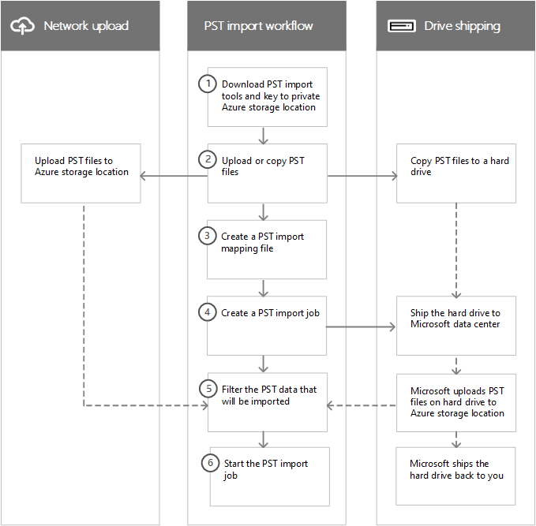

# Overview of importing your organization PST files to Office 365

> [!NOTE]
> Cet article est destiné aux administrateurs. Vous souhaitez importer des fichiers PST dans votre propre boîte aux lettres ? Voir [importer le courrier, les contacts et le calendrier à partir d'un fichier. pst Outlook](https://go.microsoft.com/fwlink/p/?LinkID=785075)

Vous pouvez utiliser le service d'importation dans le centre de sécurité & Compliance Center pour importer rapidement des fichiers PST dans des boîtes aux lettres Exchange Online dans votre organisation Office 365. Vous pouvez importer des fichiers PST dans Office 365 de deux manières:
   
- **Chargement réseau**  sur le Cloud: Téléchargez les fichiers PST sur le réseau vers un emplacement de stockage Azure temporaire dans le Cloud Microsoft. Ensuite, vous utilisez le service d'importation Office 365 pour importer les données PST dans les boîtes aux lettres de votre organisation Office 365. 

- **Livraison de disque**  dur: copiez les fichiers PST sur un disque dur chiffré par BitLocker, puis expédiez physiquement le lecteur à Microsoft. Lorsque Microsoft reçoit le disque dur, le personnel du centre de données télécharge les données vers un emplacement de stockage Azure temporaire dans le Cloud Microsoft. Ensuite, vous utilisez le service d'importation Office 365 pour importer les données dans les boîtes aux lettres de votre organisation Office 365.

## Instructions pas à pas
  
Consultez l'une des rubriques suivantes pour obtenir des instructions détaillées pour importer en bloc les fichiers PST de votre organisation dans Office 365. 
   
- [Utiliser le chargement réseau pour importer des fichiers PST vers Office 365](use-network-upload-to-import-pst-files.md)
- [Utiliser l’expédition de disque pour importer des fichiers PST dans Office 365](use-drive-shipping-to-import-pst-files-to-office-365.md)

## Fonctionnement de l'importation de fichiers PST

Voici une illustration et une description du processus d'importation de fichiers PST complet. L'illustration montre le flux de travail principal et souligne les différences entre les modes de chargement réseau et de livraison de disque.
  

  
1. **Téléchargez les outils d'importation PST et la clé vers l'emplacement de stockage privé Azure** : la première étape consiste à télécharger l'outil et la clé d'accès utilisés pour télécharger les fichiers PST ou les copier sur un disque dur. Vous les obtenez à partir de la page d' **importation** dans le centre de sécurité _AMP_ Compliance Center. La clé vous fournit (ou le personnel du centre de données Microsoft en cas de livraison) avec les autorisations nécessaires pour télécharger des fichiers PST vers un emplacement de stockage Azure privé et sécurisé. Cette clé d'accès est propre à votre organisation et empêche tout accès non autorisé à vos fichiers PST une fois qu'ils sont téléchargés vers le Cloud Microsoft. Notez que l'importation de fichiers PST dans Office 365 ne nécessite pas que votre organisation dispose d'un abonnement Azure distinct. 
    
2. **Charger ou copier les fichiers PST** : l'étape suivante varie selon que vous utilisez le chargement réseau ou la livraison de lecteur pour importer des fichiers PST. Dans les deux cas, vous utiliserez l'outil et la clé de stockage sécurisée que vous avez obtenus à l'étape précédente.
    
    - **Chargement réseau** L'outil AzCopy. exe (téléchargé à l'étape 1) permet de télécharger et de stocker vos fichiers PST dans un emplacement de stockage Azure dans le Cloud Microsoft. Notez que l'emplacement de stockage Azure sur lequel vous chargez vos fichiers PST doit résider dans le même centre de centres Microsoft régional où se trouve votre organisation Office 365. 
    
      Pour les télécharger, les fichiers PST que vous souhaitez importer vers Office 365 doivent être situés dans un partage de fichiers ou un serveur de fichiers de votre organisation.
    
    - **Livraison de disque** L'outil outil waimportexport. exe (téléchargé à l'étape 1) est utilisé pour copier vos fichiers PST sur le disque dur. Cet outil chiffre le disque dur avec BitLocker, puis copie les fichiers PST sur le disque dur. Comme le chargement réseau, les fichiers PST que vous souhaitez copier sur le disque dur doivent être situés dans un partage de fichiers ou un serveur de fichiers de votre organisation.
    
3. **Créer un fichier de mappage d'importation PST** -une fois que les fichiers PST ont été téléchargés vers l'emplacement de stockage Azure ou copiés sur un disque dur, l'étape suivante consiste à créer un fichier de valeurs séparées par des virgules (CSV) qui spécifie les boîtes aux lettres utilisateur dans lesquelles les fichiers PST seront importés (a ND un fichier PST peut être importé dans la boîte aux lettres principale d'un utilisateur ou dans sa boîte aux lettres d'archivage). Le service d'importation Office 365 utilisera les informations pour importer les fichiers PST. 
    
4. **Créer une tâche d'importation PST** : l'étape suivante consiste à créer une tâche d'importation PST sur la page d' **importation** dans le centre de sécurité & Compliance Center et à envoyer le fichier de mappage d'importation PST créé à l'étape précédente. Pour le chargement réseau (étant donné que les fichiers PST ont été téléchargés vers Azure), Office 365 analyse les données dans les fichiers PST, puis vous offre la possibilité de définir des filtres qui contrôlent les données importées dans les boîtes aux lettres spécifiées dans le fichier de mappage d'importation PST. 
    
    Pour le lecteur, quelques éléments supplémentaires se produisent à ce stade du processus.
    
    - Vous expédiez physiquement le disque dur à un centre de données Microsoft (l'adresse d'expédition pour le centre de données Microsoft s'affiche lors de la création de la tâche d'importation).
    
    - Lorsque Microsoft reçoit le disque dur, le personnel du centre de données télécharge les fichiers PST sur le disque dur vers l'emplacement de stockage Azure de votre organisation. Comme expliqué précédemment, vos fichiers PST sont téléchargés vers un emplacement de stockage Azure qui réside dans le même centre de donnée régional Microsoft où se trouve votre organisation Office 365.
    
      > [!NOTE]
      > Les fichiers PST sur le disque dur sont téléchargés vers Azure dans les 7 à 10 jours ouvrables après que Microsoft a reçu le disque dur. 
  
      Comme le processus de chargement réseau, Office 365 analyse les données dans les fichiers PST et vous donne la possibilité de définir des filtres qui contrôlent les données importées dans les boîtes aux lettres spécifiées dans le fichier de mappage d'importation PST.
    
    - Microsoft vous renvoie le disque dur. 
    
5. **Filtrer les données PST qui seront importées vers des boîtes aux lettres** -une fois la tâche d'importation créée (et après que les fichiers PST d'une tâche d'expédition de disque sont téléchargés vers l'emplacement de stockage Azure) Office 365 analyse les données dans les fichiers PST (en toute sécurité et en toute sécurité) en l'identification de l'âge des éléments et des différents types de messages inclus dans les fichiers PST; Lorsque l'analyse est terminée et que les données sont prêtes à être importées, vous avez la possibilité d'importer toutes les données contenues dans les fichiers PST ou vous pouvez réduire les données importées en définissant des filtres qui contrôlent les données à importer. 
    
6. **Démarrer le travail d'importation PST** : une fois la tâche d'importation démarrée, Office 365 utilise les informations du fichier de mappage d'importation PST pour importer les fichiers PST à partir de l'emplacement de stockage Azure vers les boîtes aux lettres utilisateur. Les informations d'État relatives à la tâche d'importation (y compris les informations relatives à chaque fichier PST importé) sont affichées dans la page d' **importation** dans le centre de sécurité _AMP_ Compliance Center. Une fois le travail d'importation terminé, l'état du travail est défini sur **terminé**.
  
## Pourquoi importer des données de courrier électronique dans Office 365?

- L'importation de fichiers PST dans des boîtes aux lettres utilisateur est une façon de migrer le courrier électronique de votre organisation vers Office 365.
    
- Vous pouvez utiliser la fonctionnalité d' [importation intelligente](filter-data-when-importing-pst-files.md) pour filtrer les éléments des fichiers PST qui sont réellement importés dans les boîtes aux lettres cible. Cela vous permet de réduire les données importées en définissant des filtres qui contrôlent les données à importer. 
    
- L'importation de données de courrier électronique dans Office 365 permet de répondre aux besoins de conformité de votre organisation en vous permettant de:
    
  - Activez les [boîtes aux lettres](enable-archive-mailboxes.md) d'archivage et un [archivage illimité](unlimited-archiving.md) pour fournir aux utilisateurs un espace de stockage supplémentaire pour les boîtes aux lettres. 
    
  - Placez les boîtes aux lettres en [conservation pour litige](https://go.microsoft.com/fwlink/?linkid=841243) afin de conserver le contenu. 
    
  - Utilisez l' [outil de recherche de contenu](content-search.md) pour rechercher du contenu de boîte aux lettres. 
    
  - Utiliser des [cas eDiscovery](ediscovery-cases.md) pour gérer les enquêtes légales de votre organisation 
    
  - Utilisez les [stratégies](retention-policies.md) de rétention dans le centre de sécurité & conformité pour contrôler la durée de conservation du contenu de la boîte aux lettres, puis supprimez le contenu après l'expiration de la période de rétention. 

  - Utilisez des [stratégies de surveillance](supervision-policies.md) pour examiner les messages afin de vous assurer qu'ils sont conformes aux standards de message et ajoutez un type de classification.
    
- L'importation de données dans Office 365 contribue à la protection contre la perte de données. Les données de messagerie électronique importées vers Office 365 héritent des fonctionnalités de haute disponibilité d'Exchange Online.
    
- Les données de messagerie électronique dans Office 365 sont accessibles aux utilisateurs de tous les appareils, car elles sont stockées dans le Cloud.
    
## Importation de données SharePoint dans Office 365

Vous pouvez également importer des fichiers et des documents sur des sites SharePoint et des comptes OneDrive dans votre organisation Office 365. Pour plus d'informations, voir les articles suivants :

- [Migrer vers SharePoint Online](https://docs.microsoft.com/sharepointmigration/migrate-to-sharepoint-online)

- [Présentation de l'outil de migration SharePoint](https://docs.microsoft.com/sharepointmigration/introducing-the-sharepoint-migration-tool)

- [Migrer vers SharePoint Online à l’aide de PowerShell](https://docs.microsoft.com/sharepointmigration/overview-spmt-ps-cmdlets)

- [Migrer votre contenu de partage de fichiers vers SharePoint Online à l'aide de la zone de données Azure](https://docs.microsoft.com/sharepointmigration/how-to-migrate-file-share-content-to-spo-using-azuredatabox)

## Forum aux questions sur l'importation de fichiers PST dans Office 365
  
Voici quelques questions fréquemment posées sur l'utilisation du service d'importation Office 365 pour importer en bloc des fichiers PST dans des boîtes aux lettres Office 365. 
  
- [Utilisation du chargement réseau pour importer des fichiers PST](#using-network-upload-to-import-pst-files)
  
- [Utilisation de l'expédition de disque pour importer des fichiers PST](#using-drive-shipping-to-import-pst-files)
  
### Utilisation du chargement réseau pour importer des fichiers PST

 **Quelles sont les autorisations requises pour créer des travaux d'importation dans le service d'importation Office 365?**
  
Vous devez disposer du rôle d'exportation d'importation de boîte aux lettres dans Exchange Online pour importer des fichiers PST dans des boîtes aux lettres Office 365. Par défaut, ce rôle n'est affecté à aucun groupe de rôles dans Exchange Online. You can add the Mailbox Import Export role to the Organization Management role group. Or you can create a new role group, assign the Mailbox Import Export role, and then add yourself or other users as a member. Pour plus d'informations, consultez les sections «ajouter un rôle à un groupe de rôles» ou «créer un groupe de rôles» dans [gérer des groupes de rôles dans Exchange Online](https://go.microsoft.com/fwlink/p/?LinkId=730688).
  
De plus, pour créer des travaux d'importation dans le centre de sécurité & Compliance Center, l'une des conditions suivantes doit être vraie:
  
- Vous devez disposer du rôle destinataires de messagerie dans Exchange Online. By default, this role is assigned to the Organization Management and Recipient Management roles groups.
    
    Ou
    
- Vous devez être un administrateur général dans votre organisation Office 365.
    
> [!TIP]
> EnVisagez de créer un nouveau groupe de rôles dans Exchange Online spécialement destiné à l'importation de fichiers PST dans Office 365. Pour le niveau minimal de privilèges requis pour importer des fichiers PST, attribuez les rôles importation de boîte aux lettres et destinataires des messages au nouveau groupe de rôles, puis ajoutez des membres. 
  
 **Où le téléchargement réseau est-il disponible?**
  
Network upload is currently available in the United States, Canada, Brazil, the United Kingdom, Europe, India, East Asia, Southeast Asia, Japan, Republic of Korea, and Australia. Network upload will be available in more regions soon.
  
 **What is the pricing for importing PST files by using network upload?**
  
Using network upload to import PST files is free.
  
Cela signifie également que, après la suppression des fichiers PST de la zone de stockage Azure, ils ne figurent plus dans la liste des fichiers pour une tâche d'importation terminée dans le centre d'administration 365 de Microsoft. Bien qu'une tâche d'importation puisse toujours être répertoriée sur la page **importer des données dans Office 365** , la liste des fichiers PST peut être vide lorsque vous affichez les détails des anciens travaux d'importation. 
  
 **What version of the PST file format is supported for importing to Office 365?**
  
There are two versions of the PST file format: ANSI and Unicode. We recommend importing files that use the Unicode PST file format. Toutefois, les fichiers qui utilisent le format de fichier PST ANSI, tels que ceux pour les langues qui utilisent un jeu de caractères codés sur deux octets (DBCS), peuvent également être importés dans Office 365. Pour plus d'informations sur l'importation de fichiers PST ANSI, voir l'étape 4 dans [utiliser le chargement réseau pour importer des fichiers PST vers Office 365](https://go.microsoft.com/fwlink/p/?LinkId=823074).
  
Additionally, PST files from Outlook 2007 and later versions can be imported to Office 365.
  
 **Après avoir téléchargé mes fichiers PST dans la zone de stockage Azure, combien de temps sont-ils conservés dans Azure avant d'être supprimés?**
  
Lorsque vous utilisez la méthode de chargement réseau pour importer des fichiers PST, vous les Téléchargez dans un conteneur d'objets BLOB Azure nommé **ingestiondata**. S'il n'y a pas de tâches d'importation en cours sur la page d' **importation** dans le centre de sécurité _AMP_ Compliance Center), tous les fichiers PST du conteneur **ingestiondata** dans Azure sont supprimés 30 jours après la création du travail d'importation le plus récent dans le & de sécurité. Centre de conformité. Cela signifie également que vous devez créer une nouvelle tâche d'importation dans le centre de sécurité & Compliance Center (décrit à l'étape 5 dans les instructions de chargement réseau) dans les 30 jours suivant le téléchargement des fichiers PST vers Azure. 
  
Cela signifie également que, après la suppression des fichiers PST de la zone de stockage Azure, ils ne figurent plus dans la liste des fichiers pour une tâche d'importation terminée dans le centre de sécurité & Compliance Center. Bien qu'une tâche d'importation puisse toujours être répertoriée sur la page d' **importation** dans le centre de sécurité _AMP_ Compliance Center, la liste des fichiers PST peut être vide lorsque vous affichez les détails des anciens travaux d'importation. 
  
 **Combien de temps faut-il pour importer un fichier PST dans une boîte aux lettres?**
  
It depends on the capacity of your network, but it typically takes several hours for each terabyte (TB) of data to be uploaded to the Azure storage area for your organization. Une fois les fichiers PST copiés dans la zone de stockage Azure, un fichier PST est importé dans une boîte aux lettres Office 365 à un taux d'au moins 24 Go par jour. Si ce taux ne répond pas à vos besoins, vous pouvez envisager d'autres méthodes de migration des données de messagerie vers Office 365. Pour obtenir plus d'informations, consultez l'article [Façons de migrer plusieurs comptes de messagerie à Office 365](https://support.office.com/article/ways-to-migrate-multiple-email-accounts-to-office-365-0a4913fe-60fb-498f-9155-a86516418842).
  
If different PST files are imported to different target mailboxes, the import process occurs in parallel; in other words, each PST/mailbox pair is imported simultaneously. De même, si plusieurs fichiers PST sont importés dans la même boîte aux lettres, ils seront importés simultanément.
  
 **Is there a message size limit when importing PST files?**
  
Oui. Si un fichier PST contient un élément de boîte aux lettres dont la taille est supérieure à 150 Mo, l'élément est ignoré pendant le processus d'importation.
  
 **Les propriétés des messages, telles que la date d'envoi ou de réception du message, la liste des destinataires et d'autres propriétés, sont-elles conservées lorsque les fichiers PST sont importés dans une boîte aux lettres Office 365?**
  
Oui. Les métadonnées du message d'origine ne sont pas modifiées pendant le processus d'importation.
  
 **Is there a limit to the number of levels in a folder hierarchy for a PST file that I want to import to a mailbox?**
  
Yes. You can't import a PST file that has 300 or more levels of nested folders.
  
 **Can I use network upload to import PST files to an inactive mailbox in Office 365?**
  
Yes, this capability is now available. 
  
 **Can I use network upload to import PST files to an online archive mailbox in an Exchange hybrid deployment?**
  
Yes, this capability is now available. 
  
 **Puis-je utiliser le chargement réseau pour importer des fichiers PST dans des dossiers publics dans Exchange Online?**
  
Non, vous ne pouvez pas importer de fichiers PST dans des dossiers publics.
  
### Utilisation de l'expédition de disque pour importer des fichiers PST

 **Quelles sont les autorisations requises pour créer des travaux d'importation dans le service d'importation Office 365?**
  
Vous devez disposer du rôle d'exportation d'importation de boîte aux lettres pour importer des fichiers PST vers des boîtes aux lettres Office 365. Par défaut, ce rôle n'est affecté à aucun groupe de rôles dans Exchange Online. You can add the Mailbox Import Export role to the Organization Management role group. Or you can create a new role group, assign the Mailbox Import Export role, and then add yourself or other users as a member. Pour plus d'informations, consultez les sections «ajouter un rôle à un groupe de rôles» ou «créer un groupe de rôles» dans [gérer des groupes de rôles dans Exchange Online](https://go.microsoft.com/fwlink/p/?LinkId=730688).
  
De plus, pour créer des travaux d'importation dans le centre de sécurité & Compliance Center, l'une des conditions suivantes doit être vraie:
  
- Vous devez disposer du rôle destinataires de messagerie dans Exchange Online. By default, this role is assigned to the Organization Management and Recipient Management roles groups.
    
    Ou
    
- Vous devez être un administrateur général dans votre organisation Office 365.
    
> [!TIP]
> EnVisagez de créer un nouveau groupe de rôles dans Exchange Online spécialement destiné à l'importation de fichiers PST dans Office 365. Pour le niveau minimal de privilèges requis pour importer des fichiers PST, attribuez les rôles importation de boîte aux lettres et destinataires des messages au nouveau groupe de rôles, puis ajoutez des membres. 
  
 **Où la livraison de disque est-elle disponible?**
  
La livraison de disque est actuellement disponible aux États-Unis, au Canada, au Brésil, au Royaume-Uni, en Europe, en Inde, à l'Asie de l'est, en Asie du sud-est, au Japon, en République de Corée et en Australie. Drive shipping will be available in more regions soon.
  
 **What commercial licensing agreements support drive shipping?**
  
Drive Shipping to import PST Files to Office 365 est disponible par le biais d'un contrat d'entreprise Microsoft (EA). La livraison de lecteur n'est pas disponible via un contrat de produits et de services Microsoft (MPSA).
  
 **Quelles sont les tarifs pour l'utilisation de l'expédition de disque pour importer des fichiers PST vers Office 365?**
  
The cost to use drive shipping to import PST files to Office 365 mailboxes is $2 USD per GB of data. For example, if you ship a hard drive that contains 1,000 GB (1 TB) of PST files, the cost is $2,000 USD. You can work with a partner to pay the import fee. Pour plus d'informations sur la recherche d'un partenaire, consultez [la rubrique trouver votre partenaire ou revendeur Office 365](https://go.microsoft.com/fwlink/p/?LinkId=785197).
  
 **What kind of hard drives are supported for drive shipping?**
  
Seuls les disques durs internes 2,5 pouce SSD ou 2,5 ou 3,5 pouces SATA II/III sont pris en charge pour être utilisés avec le service d'importation Office 365. You can use hard drives up to 10 TB. Pour les tâches d'importation, seul le premier volume de données du disque dur sera traité. The data volume must be formatted with NTFS. Lorsque vous copiez des données sur un disque dur, vous pouvez les attacher directement à l'aide d'un connecteur SATA II/III de 2,5 pouces ou de l'attacher de façon externe à l'aide d'un adaptateur USB externe de 2,5 pouce ou 2,5 ou 3,5.
  
> [!IMPORTANT]
> Les disques durs externes équipés d'un adaptateur USB intégré ne sont pas pris en charge par le service d'importation Office 365. Additionally, the disk inside the casing of an external hard drive can't be used. Please don't ship external hard drives. 
  
 **How many hard drives can I ship for a single import job?**
  
You can ship a maximum of 10 hard drives for a single import job.
  
 **After I ship my hard drive, how long does it take to get to the Microsoft data center?**
  
That depends on a few things, such as your proximity to the Microsoft data center and what kind of shipping option you used to ship your hard drive (such as, next-day delivery, two-day delivery, or ground-delivery). With most shippers, you can use the tracking number to track the status of your delivery.
  
 **Une fois mon disque dur atteint dans le centre de données Microsoft, combien de temps faut-il pour charger mes fichiers PST sur Azure?**
  
Une fois que votre disque dur est reçu dans le centre de données Microsoft, il faut entre 7 et 10 jours ouvrés pour télécharger les fichiers PST dans la zone de stockage Microsoft Azure de votre organisation. Les fichiers PST seront téléchargés vers un conteneur d'objets BLOB Azure nommé `ingestiondata`. 
  
 **Combien de temps faut-il pour importer un fichier PST dans une boîte aux lettres?**
  
Une fois les fichiers PST téléchargés vers la zone de stockage Azure, Office 365 analyse les données dans les fichiers PST (de manière sûre et sécurisée) pour identifier l'âge des éléments et les différents types de messages inclus dans les fichiers PST. Une fois cette analyse terminée, vous aurez la possibilité d'importer toutes les données des fichiers PST ou de définir des filtres pour contrôler les données importées. Une fois le travail d'importation démarré, un fichier PST est importé dans une boîte aux lettres Office 365 à un taux d'au moins 24 Go par jour. Si ce taux ne répond pas à vos besoins, vous pouvez envisager d'utiliser d'autres méthodes pour importer des données de courrier électronique dans Office 365. Pour obtenir plus d'informations, consultez l'article [Façons de migrer plusieurs comptes de messagerie à Office 365](https://support.office.com/article/ways-to-migrate-multiple-email-accounts-to-office-365-0a4913fe-60fb-498f-9155-a86516418842).
  
If different PST files are imported to different target mailboxes, the import process occurs in parallel; in other words, each PST/mailbox pair is imported simultaneously. De même, si plusieurs fichiers PST sont importés dans la même boîte aux lettres, ils seront importés simultanément.
  
 **Après que Microsoft a téléchargé mes fichiers PST sur Azure, combien de temps sont-ils conservés dans Azure avant d'être supprimés?**
  
Tous les fichiers PST de l'emplacement de stockage Azure de votre organisation (dans un `ingestiondata`conteneur BLOB nommé) sont supprimés 30 jours après la création de la tâche d'importation la plus récente sur la page d' **importation** dans le centre de sécurité & Compliance Center. 
  
Cela signifie également que, après la suppression des fichiers PST de la zone de stockage Azure, ils ne figurent plus dans la liste des fichiers pour une tâche d'importation terminée dans le centre de sécurité & Compliance Center. Bien qu'une tâche d'importation puisse toujours être répertoriée sur la page d' **importation** dans le centre de sécurité _AMP_ Compliance Center, la liste des fichiers PST peut être vide lorsque vous affichez les détails des anciens travaux d'importation. 
  
 **What version of the PST file format is supported for importing to Office 365?**
  
There are two versions of the PST file format: ANSI and Unicode. We recommend importing files that use the Unicode PST file format. Toutefois, les fichiers qui utilisent le format de fichier PST ANSI, tels que ceux pour les langues qui utilisent un jeu de caractères codés sur deux octets (DBCS), peuvent également être importés dans Office 365. Pour plus d'informations sur l'importation de fichiers PST ANSI, reportez-vous à l'étape 3 de la section [utilisation du livre de livraison pour importer les fichiers PST de votre organisation dans Office 365](use-drive-shipping-to-import-pst-files-to-office-365.md#step-3-create-the-pst-import-mapping-file).
  
Additionally, PST files from Outlook 2007 and later versions can be imported to Office 365.
  
 **Is there a message size limit when importing PST files?**
  
Oui. Si un fichier PST contient un élément de boîte aux lettres dont la taille est supérieure à 150 Mo, l'élément est ignoré pendant le processus d'importation.
  
 **Les propriétés des messages, telles que la date d'envoi ou de réception du message, la liste des destinataires et d'autres propriétés, sont-elles conservées lorsque les fichiers PST sont importés dans une boîte aux lettres Office 365?**
  
Oui. Les métadonnées du message d'origine ne sont pas modifiées pendant le processus d'importation
  
 **Is there a limit to the number of levels in a folder hierarchy for a PST file that I want to import to a mailbox?**
  
Yes. You can't import a PST file that has 300 or more levels of nested folders.
  
 **Can I use drive shipping to import PST files to an inactive mailbox in Office 365?**
  
Yes, this capability is now available.
  
 **Can I use drive shipping to import PST files to an online archive mailbox in an Exchange hybrid deployment?**
  
Yes, this capability is now available. 
  
 **Puis-je utiliser l'expédition de disque pour importer des fichiers PST dans des dossiers publics dans Exchange Online?**
  
Non, vous ne pouvez pas importer de fichiers PST dans des dossiers publics.
  
 **Can Microsoft wipe my hard drive before they ship it back to me?**
  
No, Microsoft can't wipe hard drives before shipping them back to customers. Hard drives are returned to you in the same state they were in when they were received by Microsoft.
  
 **Microsoft peut-il broyer mon disque dur au lieu de l'expédier de nouveau à moi?**
  
No, Microsoft can't destroy your hard drive. Hard drives are returned to you in the same state they were in when they were received by Microsoft.
  
 **Quels services de messagerie sont pris en charge pour la livraison de retour?**
  
If you're a customer in the United States or Europe, Microsoft uses FedEx to return your hard drive. For all other regions, Microsoft uses DHL.
  
 **Quels sont les frais d'expédition de retour?**
  
Return shipping costs vary, depending on your proximity to the Microsoft data center that you shipped your hard drive to. Microsoft will bill your FedEx or DHL account to return your hard drive. The cost of return shipping is your responsibility.
  
 **Puis-je utiliser un service de livraison par courrier personnalisé, tel qu'FedEx Custom Shipping, pour livrer mon disque dur à Microsoft?**
  
Oui.
  
 **If I have to ship my hard drive to another country, is there anything I need to do?**
  
The hard drive that you ship to Microsoft might have to cross international borders. If this is the case, you're responsible for ensuring that the hard drive and the data it contains are imported and/or exported in accordance with the applicable laws. Before shipping a hard drive, check with your advisors to verify that your drive and data can legally be shipped to the specified Microsoft data center. This will help to ensure that it reaches Microsoft in a timely manner.
