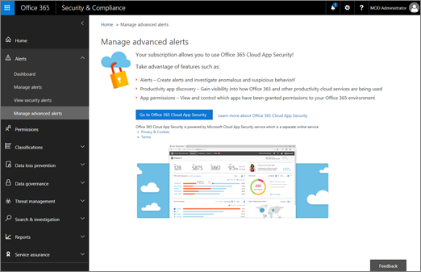

# <a name="integrate-your-siem-server-with-office-365-cloud-app-security"></a>Intégrer votre serveur SIEM à la sécurité des applications cloud Office 365
  
|Évaluation **\>**|Planification **\>**|Déploiement **\>**|Utilisation du ***|
|:-----|:-----|:-----|:-----|
|[Commencer à évaluer](office-365-cas-overview.md) <br/> |[Commencer à planifier](get-ready-for-office-365-cas.md) <br/> |Vous êtes ici !  <br/> [Étape suivante](utilization-activities-for-ocas.md) <br/> |[Commencer à utiliser](utilization-activities-for-ocas.md) <br/> |
   
## <a name="overview-and-prerequisites"></a>Vue d’ensemble et des conditions préalables

Vous pouvez intégrer [Office 365 Cloud application sécurité](get-ready-for-office-365-cas.md) avec le serveur sécurité des informations et des événements SIEM (gestion) pour activer la surveillance centralisée des alertes. Cela est particulièrement utile pour les organisations qui utilisent des services en nuage et des applications serveur local. Intégration avec un serveur SIEM permet à votre équipe de sécurité pour mieux protéger vos applications Office 365 tout en conservant votre flux de travail habituelles de sécurité, en automatisant certaines procédures de sécurité et de corrélation entre en nuage et événements locale.  
  
Lorsque vous intégrez tout d’abord votre serveur SIEM avec Office 365 Cloud application sécurité, alertes à partir des deux derniers jours sont transférés vers le serveur SIEM, ainsi que toutes les alertes à partir de puis sur (basé sur des filtres que vous sélectionnez). En outre, si vous désactivez cette fonctionnalité pour une période prolongée, lorsque vous le réactiviez, elle transmet les deux derniers jours d’alertes et de toutes les alertes puis par la suite.

### <a name="siem-integration-architecture"></a>Architecture de l’intégration SIEM

Un agent SIEM est défini dans le réseau de votre organisation. Déployée et configurée, l’agent SIEM extrait les types de données qui ont été configurées (alertes) à l’aide des API RESTful sécurité d’application dans le nuage Office 365. Le trafic est ensuite envoyé via un canal HTTPS chiffré sur le port 443.
  
Lorsqu’un agent SIEM récupère des données à partir de la sécurité d’application Office 365 dans le nuage, il envoie les messages de journal système à votre serveur SIEM local en utilisant les configurations de réseau sont fournies lors de l’installation (TCP ou UDP avec un port personnalisé).


### <a name="supported-siem-servers"></a>Serveurs SIEM pris en charge

Sécurité d’application Office 365 Cloud prend actuellement en charge les serveurs SIEM suivants :
- ArcSight Micro Focus
- Format CEF générique

### <a name="prerequisites"></a>Conditions préalables

- Vous devez être un administrateur global ou un administrateur de sécurité pour effectuer les tâches décrites dans cet article. Voir [les autorisations de sécurité Office 365 &amp; centre de conformité](permissions-in-the-security-and-compliance-center.md)

- Vous devez avoir [activé de sécurité d’application Office 365 dans le nuage](turn-on-office-365-cas.md) pour votre organisation.

- [L’enregistrement d’audit](turn-audit-log-search-on-or-off.md) doit être activé pour Office 365

- Vous devez disposer d’un serveur standard qui remplit les conditions suivantes afin de configurer l’intégration du serveur SIEM :
    - Système d’exploitation : Windows ou Linux (Cela peut être un ordinateur virtuel)
    - PROCESSEUR : 2
    - Espace disque : 20 Go
    - RAM : 2 GO
    - Installé de [Java Oracle 8](http://www.oracle.com/technetwork/java/javase/downloads/index.html)
    - Pare-feu configuré comme indiqué dans la [configuration réseau requise](https://docs.microsoft.com/cloud-app-security/network-requirements)

- Vous devez avoir plus d’informations sur votre **hôte de journal système distant** et du **numéro de port Syslot**. Un administrateur réseau ou un administrateur de sécurité doit être en mesure de vous aider à trouver ces informations. 

- Vous devez accepter les termes du contrat de [licence logiciel](https://go.microsoft.com/fwlink/?linkid=862491) télécharger le [fichier JAR de](https://go.microsoft.com/fwlink/?linkid=838596) vous devrez intégrer votre serveur SIEM.
 
## <a name="step-1-set-it-up-a-siem-agent-in-office-365-cloud-app-security"></a>Étape 1 : Configurer un agent SIEM dans Office 365 Cloud Application Security

1. Accédez à [https://protection.office.com](https://protection.office.com) et connectez-vous à l’aide de votre compte professionnel ou de l’école pour Office 365. (Cela vous amène à la sécurité &amp; centre de conformité.) 
    
2. Accédez à des **alertes** \> **Gestion avancée des alertes**.
    
3. Cliquez sur **Aller à la sécurité d’application Office 365 dans le nuage**.<br/>
    
  
4. Cliquez sur **paramètres** \> **extensions de sécurité**.<br/>


5. Choisissez **SIEM ajouter des agents**.<br/>
    
6. Cliquez sur **Démarrer l’Assistant**.<br/> 
    
7. Dans l’étape **Général** , spécifiez un nom et **Sélectionnez votre format SIEM** et définir des **Paramètres avancés** qui sont pertinents pour ce format. Puis cliquez sur **suivant**.<br/>
    
8. Dans l’étape de **Journal système distant** , spécifiez l’adresse IP ou le nom d’hôte de l' **hôte de journal système distant** et le **numéro de port de journal système**. Sélectionnez TCP ou UDP comme protocole de journal système distant. (Vous pouvez travailler avec votre administrateur réseau ou à un administrateur de sécurité pour obtenir ces informations si vous ne les avez). Puis cliquez sur **suivant**.<br/>
  
9. Dans l’étape de **Types de données** , effectuez l’une des opérations suivantes, puis cliquez sur **suivant**:
    - Conservez la valeur par défaut de **Toutes les alertes**<br/>OU
    - Cliquez sur **toutes les alertes**, puis cliquez sur **filtres spécifiques**. Définir des filtres pour sélectionner les types d’alertes que vous voulez envoyer à votre serveur SIEM.<br/>
  
10. Dans l’écran Félicitations, copiez le jeton et enregistrer pour plus tard.<br/> 

> [!IMPORTANT]
> À ce stade, vous avez configuré un agent SIEM dans Office 365 Cloud application sécurité, mais votre intégration du serveur SIEM n’est pas encore terminée. Passez à l’étape suivante pour continuer votre intégration du serveur SIEM.

Une fois que vous cliquez sur Fermer et quitter l’Assistant, dans l’écran d’extensions de sécurité, vous pouvez voir l’agent SIEM ajouté au cours de la table. Il affiche un état **créé** tant qu’il est connecté ultérieurement.


    
## <a name="step-2-download-a-jar-file-and-run-it-on-your-siem-server"></a>Étape 2 : Télécharger un fichier JAR et exécutez-le sur votre serveur SIEM

1. Télécharger [Microsoft Cloud application sécurité SIEM Agent](https://go.microsoft.com/fwlink/?linkid=838596) et décompressez le dossier. (Vous devez accepter [le contrat de licence](https://go.microsoft.com/fwlink/?linkid=862491) pour continuer.) 
    
2. Extrayez le fichier JAR à partir du dossier compressé et exécutez-le sur votre serveur SIEM.
    
3. Après avoir exécuté le fichier, exécutez la commande suivante : commande :<br/>
  ```
  java -jar mcas-siemagent-0.87.20-signed.jar [--logsDirectory DIRNAME] [--proxy ADDRESS[:PORT]] --token TOKEN
  ```
### <a name="important-notes"></a>Remarques importantes

- Le nom de fichier peut varier en fonction de la version de l’agent SIEM. 

- Nous vous conseillons d’exécuter le fichier JAR sur votre serveur SIEM lors de l’installation du serveur.

    - **Windows**: exécuter en tant qu’une tâche planifiée, en veillant à la configuration de la tâche à **exécuter si l’utilisateur est connecté ou non** et désactivez l’option **Arrêter la tâche si elle s’exécute plu** .

    - **Linux**: ajouter la commande Exécuter avec un **&** à la `rc.local` fichier. <br/>Exemple :<br/> 
    ```
    java -jar mcas-siemagent-0.87.20-signed.jar [--logsDirectory DIRNAME] [--proxy ADDRESS[:PORT]] --token TOKEN &
    ```

- Paramètres entre crochets [] sont facultatives et doivent être utilisés uniquement si nécessaire. Utilisez les variables suivantes :

    - **DIRNAME** est le chemin d’accès au répertoire à utiliser pour les journaux de débogage de l’agent local.

    - **Adresse [ : PORT]** est l’adresse du serveur proxy et le port que le serveur utilise pour se connecter à Internet.

    - **Jeton** est le jeton de l’agent SIEM que vous avez copié dans la première procédure.

    - Pour obtenir de l’aide, tapez `-h`. 
  
## <a name="step-3-validate-that-the-siem-agent-is-working"></a>Étape 3 : Valider l’utilisation de l’agent SIEM

1. Assurez-vous que l’état de l’agent SIEM dans le portail Office 365 Cloud application sécurité n’est pas affiché en tant que **message erreur de connexion** ou **déconnecté** et qu’il n’existe aucune notification de l’agent.<br/>Par exemple, nous voyons ici qu'est connecté le serveur SIEM :<br/><br/>Et nous pouvons voir ici, que le serveur SIEM est déconnecté :<br/> 
  
2. Dans votre serveur/SIEM journal système, vérifiez que les alertes sont arrivées à partir de la sécurité d’application Office 365 dans le nuage.
  
## <a name="what-the-logfiles-look-like"></a>Les fichiers journaux à quoi ressemble

Voici un exemple de fichier journal d’alertes pouvant être envoyées à un serveur SIEM :

```
2017-07-15T20:42:30.531Z CEF:0|MCAS|SIEM_Agent|0.102.17|ALERT_CABINET_EVENT_MATCH_AUDIT|myPolicy|3|externalId=596a7e360c204203a335a3fb start=1500151350531 end=1500151350531 msg=Activity policy ''myPolicy'' was triggered by ''admin@box-contoso.com'' suser=admin@box-contoso.com destinationServiceName=Box cn1Label=riskScore cn1= cs1Label=portalURL cs1=https://cloud-app-security.com/#/alerts/596a7e360c204203a335a3fb cs2Label=uniqueServiceAppIds cs2=APPID_BOX cs3Label=relatedAudits cs3=1500151288183_acc891bf-33e1-424b-a021-0d4370789660 cs4Label=policyIDs cs4=59f0ab82f797fa0681e9b1c7

2017-07-16T09:36:26.550Z CEF:0|MCAS|SIEM_Agent|0.102.17|ALERT_CABINET_EVENT_MATCH_AUDIT|test-activity-policy|3|externalId=596b339b0c204203a33a51ae start=1500197786550 end=1500197786550 msg=Activity policy ''test-activity-policy'' was triggered by ''user@contoso.com'' suser=user@contoso.com destinationServiceName=Salesforce cn1Label=riskScore cn1= cs1Label=portalURL cs1=https://cloud-app-security.com/#/alerts/596b339b0c204203a33a51ae cs2Label=uniqueServiceAppIds cs2=APPID_SALESFORCE cs3Label=relatedAudits cs3=1500197720691_b7f6317c-b8de-476a-bc8f-dfa570e00349 cs4Label=policyIDs cs4=

2017-07-16T09:17:03.361Z CEF:0|MCAS|SIEM_Agent|0.102.17|ALERT_CABINET_EVENT_MATCH_AUDIT|test-activity-policy3|3|externalId=596b2fd70c204203a33a3eeb start=1500196623361 end=1500196623361 msg=Activity policy ''test-activity-policy3'' was triggered by ''admin@contoso.com'' suser=admin@contoso.com destinationServiceName=Office 365 cn1Label=riskScore cn1= cs1Label=portalURL cs1=https://cloud-app-security.com/#/alerts/596b2fd70c204203a33a3eeb cs2Label=uniqueServiceAppIds cs2=APPID_O365 cs3Label=relatedAudits cs3=1500196549157_a0e01f8a-e29a-43ae-8599-783c1c11597d cs4Label=policyIDs cs4=

2017-07-16T09:17:15.426Z CEF:0|MCAS|SIEM_Agent|0.102.17|ALERT_CABINET_EVENT_MATCH_AUDIT|test-activity-policy|3|externalId=596b2fd70c204203a33a3eec start=1500196635426 end=1500196635426 msg=Activity policy ''test-activity-policy'' was triggered by ''admin@contoso.com'' suser=admin@contoso.com destinationServiceName=Microsoft Office 365 admin center cn1Label=riskScore cn1= cs1Label=portalURL cs1=https://cloud-app-security.com/#/alerts/596b2fd70c204203a33a3eec cs2Label=uniqueServiceAppIds cs2=APPID_O365_PORTAL cs3Label=relatedAudits cs3=1500196557398_3e102b20-d9fa-4f66-b550-8c7a403bb4d8 cs4Label=policyIDs cs4=59f0ab35f797fa9811e9b1c7

2017-07-16T09:17:46.290Z CEF:0|MCAS|SIEM_Agent|0.102.17|ALERT_CABINET_EVENT_MATCH_AUDIT|test-activity-policy4|3|externalId=596b30200c204203a33a4765 start=1500196666290 end=1500196666290 msg=Activity policy ''test-activity-policy4'' was triggered by ''admin@contoso.com'' suser=admin@contoso.com destinationServiceName=Microsoft Exchange Online cn1Label=riskScore cn1= cs1Label=portalURL cs1=https://cloud-app-security.com/#/alerts/596b30200c204203a33a4765 cs2Label=uniqueServiceAppIds cs2=APPID_OUTLOOK cs3Label=relatedAudits cs3=1500196587034_a8673602-7e95-46d6-a1fe-c156c4709c5d cs4Label=policyIDs cs4=

2017-07-16T09:41:04.369Z CEF:0|MCAS|SIEM_Agent|0.102.17|ALERT_CABINET_EVENT_MATCH_AUDIT|test-activity-policy2|3|externalId=596b34b10c204203a33a5240 start=1500198064369 end=1500198064369 msg=Activity policy ''test-activity-policy2'' was triggered by ''user2@test15-adallom.com'' suser=user2@test15-adallom.com destinationServiceName=Google cn1Label=riskScore cn1= cs1Label=portalURL cs1=https://cloud-app-security.com/#/alerts/596b34b10c204203a33a5240 cs2Label=uniqueServiceAppIds cs2=APPID_33626 cs3Label=relatedAudits cs3=1500197996117_fd71f265-1e46-4f04-b372-2e32ec874cd3 cs4Label=policyIDs cs4=
```

Et Voici un autre exemple, cette fois au format de format CEF :


|Nom du champ Format CEF  | Description  |
|---------|---------|
|Démarrer     | horodatage de l’alerte        |
|fin     | horodatage de l’alerte        |
|RT     | horodatage de l’alerte        |
|msg     | description de l’alerte, comme indiqué dans le portail Office 365 Cloud Application Security        |
|sUser     | utilisateur de l’objet de l’alerte        |
|destinationServiceName     | alerte d’application, telles que Office 365, SharePoint ou OneDrive d’origine        |
|csLabel     | Varie (étiquettes ont des significations différentes). En règle générale, les étiquettes sont explicites, comme targetObjects.        |
|cs     | Informations correspondant à une étiquette (par exemple, l’utilisateur cible d’une alerte en fonction de l’exemple d’étiquette)        |

## <a name="additional-tasks-as-needed"></a>Tâches supplémentaires (le cas échéant)

Une fois que vous avez configuré votre serveur SIEM et intègrent avec Office 365 Cloud application sécurité, vous devrez peut-être régénérer un jeton, un agent SIEM de modifier ou supprimer un agent SIEM. Les sections suivantes décrivent comment effectuer ces tâches.

### <a name="regenerate-a-token"></a>Régénérer un jeton

Si vous perdez votre jeton, vous pouvez régénérer un. 

1. Dans le portail Office 365 Cloud application sécurité, choisissez **paramètres** > **extensions de sécurité**.

2. Dans le tableau, recherchez la ligne pour l’agent SIEM. 

3. Cliquez sur le bouton de sélection, puis cliquez sur **Régénérer le jeton**.<br/>
  
### <a name="edit-a-siem-agent"></a>Modifier un agent SIEM

1. Dans le portail Office 365 Cloud application sécurité, choisissez **paramètres** > **extensions de sécurité**.

2. Recherchez la ligne pour l’agent SIEM. 

3. Cliquez sur le bouton de sélection, puis cliquez sur **Modifier**. (Si vous modifiez l’agent SIEM, il est inutile réexécuter le fichier JAR, il met à jour automatiquement.)<br/>
  
### <a name="delete-a-siem-agent"></a>Supprimer un agent SIEM

1. Dans le portail Office 365 Cloud application sécurité, choisissez **paramètres** > **extensions de sécurité**.

2. Recherchez la ligne pour l’agent SIEM. 

3. Cliquez sur le bouton de sélection, puis cliquez sur **Supprimer**.<br/>

  
## <a name="next-steps"></a>Étapes suivantes

- [Activités d’utilisation après avoir déployé la sécurité des applications cloud Office 365](utilization-activities-for-ocas.md)
    
- [Passez en revue et effectuer une action sur les alertes](review-office-365-cas-alerts.md)
    
- [Vos adresses IP pour simplifier la gestion de groupe](group-your-ip-addresses-in-ocas.md)
    

