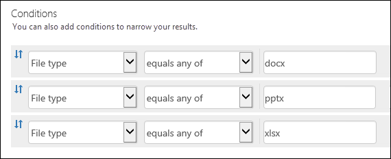

# <a name="keyword-queries-and-search-conditions-for-content-search"></a>Requêtes par mots clés et conditions de recherche pour la recherche de contenu

Cette rubrique décrit les propriétés de messagerie et des documents que vous pouvez rechercher dans les éléments de courrier électronique dans Exchange Online et les documents stockés sur SharePoint et OneDrive entreprise des sites à l’aide de la fonctionnalité de recherche de contenu de sécurité Office 365 &amp; la conformité Centre. Vous pouvez également utiliser le ** \*- ComplianceSearch** applets de commande de la sécurité &amp; PowerShell du centre de conformité pour rechercher ces propriétés. Il décrit également la rubrique :   
  
- À l’aide des opérateurs de recherche booléens, conditions de recherche et d’autres techniques de requête de recherche permettant d’affiner vos résultats de recherche.
    
- Recherche de types de données sensibles et les types de données sensibles personnalisées dans SharePoint et OneDrive for Business.
    
- Recherche de contenu de site qui est partagé avec des utilisateurs extérieurs à votre organisation
    
Pour obtenir des instructions détaillées sur la création d’une recherche de contenu, voir [Recherche de contenu dans Office 365](content-search.md). |

  
> [!NOTE]
> Recherche dans la sécurité de contenu &amp; centre de conformité et les ** \*- ComplianceSearch** applets de commande de la sécurité &amp; PowerShell du centre de conformité utiliser le langage KQL (Keyword Query). Pour plus d’informations, voir [référence de syntaxe de langage de requête de mot clé](https://go.microsoft.com/fwlink/?LinkId=269603). 
  
## <a name="searchable-email-properties"></a>Propriétés de messagerie utilisables dans une requête

Le tableau suivant répertorie les propriétés de message électronique qui peuvent être recherchées à l’aide de la fonctionnalité de recherche de contenu dans la sécurité &amp; centre de conformité ou à l’aide de la **Nouvelle-ComplianceSearch** ou l’applet de commande **Set-ComplianceSearch** . Le tableau inclut un exemple de la syntaxe de la _valeur de la propriété :_ pour chaque propriété et une description des résultats de recherche renvoyés par les exemples. Vous pouvez taper ces `property:value` zone de paires de mots clés pour une recherche de contenu. 
  
|**Propriété**|**Description de la propriété**|**Exemples**|**Résultats de recherche renvoyés par les exemples**|
|:-----|:-----|:-----|:-----|
|AttachmentNames  <br/> |Nom des fichiers joints à un message électronique.  <br/> |`attachmentnames:annualreport.ppt`  <br/> `attachmentnames:annual*`  <br/> |Messages possédant un fichier joint nommé annualreport.ppt. Dans le deuxième exemple, l’utilisation du caractère générique renvoie des messages contenant le mot « annuel » dans le nom d’un fichier joint.  <br/> |
|Bcc  <br/> |Champ Cci d'un message électronique.<sup>1</sup> <br/> |`bcc:pilarp@contoso.com`  <br/> `bcc:pilarp`  <br/> `bcc:"Pilar Pinilla"`  <br/> |Tous les exemples renvoient des messages dont « Pilar Pinilla » est en copie carbone invisible.  <br/> |
|Category  <br/> | Catégories à rechercher. Les utilisateurs peuvent définir les catégories à l’aide d’Outlook ou d’Outlook Web App. Les valeurs possibles sont les suivantes :  <br/><br/>  blue  <br/>  green  <br/>  orange  <br/>  purple  <br/>  red  <br/>  yellow  <br/> |`category:"Red Category"`  <br/> |Messages auxquels a été attribuée la catégorie « red » dans les boîtes aux lettres source.  <br/> |
|Cc  <br/> |Champ Cc d'un message électronique.<sup>1</sup> <br/> |`cc:pilarp@contoso.com`  <br/> `cc:"Pilar Pinilla"`  <br/> |Dans les deux exemples, les résultats renvoient les messages contenant « Pilar Pinilla » dans le champ Cc.  <br/> |
|Folderid  <br/> |Le dossier ID (GUID) d’un dossier de boîte aux lettres spécifique. Si vous utilisez cette propriété, veillez à rechercher la boîte aux lettres où se trouve le dossier spécifié. Notez portera uniquement sur le dossier spécifié. Tous les sous-dossiers dans le dossier ne sont pas être recherchés. Pour rechercher des sous-dossiers, vous devez utiliser la propriété Folderid pour le sous-dossier que vous souhaitez rechercher.<br/> Pour plus d’informations sur la recherche de la propriété Folderid et utilisation d’un script pour obtenir l’ID de dossier pour une boîte aux lettres spécifique, voir [Recherche de contenu utilisés dans Office 365 pour les collections ciblées](use-content-search-for-targeted-collections.md).  <br/> |`folderid:4D6DD7F943C29041A65787E30F02AD1F00000000013A0000`  <br/> `folderid:2370FB455F82FC44BE31397F47B632A70000000001160000 AND participants:garthf@contoso.com`  <br/> |Le premier exemple renvoie tous les éléments dans le dossier de boîte aux lettres spécifiée. Le deuxième exemple retourne tous les éléments dans le dossier de boîte aux lettres spécifiée qui ont été envoyés ou reçus par garthf@contoso.com.  <br/> |
|From  <br/> |Expéditeur d'un message électronique.<sup>1</sup> <br/> |`from:pilarp@contoso.com`  <br/> `from:contoso.com`  <br/> |Messages envoyés par l'utilisateur indiqué ou à partir d'un domaine spécifié.  <br/> |
|HasAttachment  <br/> |Indique si un message comporte une pièce jointe. Utilisez les valeurs **true** ou **false**.<br/> |`from:pilar@contoso.com AND hasattachment:true`  <br/> |Messages envoyés par l’utilisateur spécifié ayant des pièces jointes.  <br/> |
|Importance  <br/> |Importance d'un message électronique, que l'expéditeur peut préciser lors de l'envoi. Par défaut, les messages sont envoyés avec une importance normale, à moins que l'expéditeur préfère une importance **haute** ou **faible**.  <br/> |`importance:high`  <br/> `importance:medium`  <br/> `importance:low`  <br/> |Messages marqués comme ayant une importance haute, normale ou faible.  <br/> |
|Estlu  <br/> |Indique si les messages ont été lus. Utilisez les valeurs **true** ou **false**.<br/> |`isread:true`  <br/> `isread:false`  <br/> |Le premier exemple renvoie les messages dont la propriété estlu définie sur **True**. Le deuxième exemple renvoie des messages dont la propriété estlu définie sur **False**.<br/> |
|ItemClass  <br/> |Utilisez cette propriété pour rechercher les types de données de tiers spécifiques que votre organisation importée vers Office 365. Pour cette propriété, utilisez la syntaxe suivante :`itemclass:ipm.externaldata.<third-party data type>*` <br/> |`itemclass:ipm.externaldata.Facebook* AND subject:contoso`  <br/> `itemclass:ipm.externaldata.Twitter* AND from:"Ann Beebe" AND "Northwind Traders"`  <br/> |Le premier exemple renvoie les éléments de Facebook qui contiennent le mot « contoso » dans la propriété Subject. Le deuxième exemple renvoie les éléments de Twitter qui ont été publiés par Ann Beebe et qui contiennent la phrase de mots clés « Northwind Traders ».<br/> Pour obtenir une liste complète des valeurs à utiliser pour les types de données de tiers pour la propriété ItemClass, voir [Recherche de contenu utiliser pour rechercher des données tierces qui a été importées dans Office 365](use-content-search-to-search-third-party-data-that-was-imported.md).  <br/> |
|Kind  <br/> | Le type de message électronique à rechercher. Valeurs possibles :  <br/>  contacts  <br/>  docs  <br/>  email  <br/>  externaldata  <br/>  faxes  <br/>  im  <br/>  journals  <br/>  meetings  <br/>  microsoftteams (renvoie les éléments de salles de conversation, les réunions et les appels dans Microsoft Teams)  <br/>  notes  <br/>  posts  <br/>  rssfeeds  <br/>  tasks  <br/>  voicemail  <br/> |`kind:email`  <br/> `kind:email OR kind:im OR kind:voicemail`  <br/> `kind:externaldata`  <br/> |Le premier exemple renvoie les messages électroniques qui répondent aux critères de recherche. Les deuxième exemple renvoie e-mails, instantanée (y compris Skype pour des conversations et des salles de conversation dans Microsoft Teams) les conversations de messagerie et vocale des messages qui répondent aux critères de recherche. Le troisième exemple renvoie les éléments qui ont été importés pour les boîtes aux lettres dans Office 365 à partir de sources de données tierces, tels que Twitter, Facebook et Cisco Jabber, qui répondent aux critères de recherche. Pour plus d’informations, voir [l’archivage des données tierces dans Office 365](https://go.microsoft.com/fwlink/p/?linkid=716918).<br/> |
|Participants  <br/> |Tous les champs de contacts compris dans un message électronique ; De, À, Cc et Cci.<sup>1</sup> <br/> |`participants:garthf@contoso.com`  <br/> `participants:contoso.com`  <br/> |Messages envoyés par ou envoyés à garthf@contoso.com. Le deuxième exemple renvoie tous les messages envoyés par ou envoyés à un utilisateur dans le domaine contoso.com.  <br/> |
|Received  <br/> |Date à laquelle un message électronique a été reçu par un destinataire.  <br/> |`received:04/15/2016`  <br/> `received>=01/01/2016 AND received<=03/31/2016`  <br/> |Messages qui ont été reçus sur le 15 avril 2016. Le deuxième exemple renvoie tous les messages reçus entre le 1 janvier 2016 et le 31 mars 2016.  <br/> |
|Recipients  <br/> |Tous les champs de destinataires compris dans un message électronique ; À, Cc et Cci.<sup>1</sup> <br/> |`recipients:garthf@contoso.com`  <br/> `recipients:contoso.com`  <br/> |Messages envoyés à garthf@contoso.com. Le deuxième exemple renvoie les messages envoyés à tous les destinataires dans le domaine contoso.com.  <br/> |
|Sent  <br/> |Date à laquelle un message électronique a été envoyé par l'expéditeur.  <br/> |`sent:07/01/2016`  <br/> `sent>=06/01/2016 AND sent<=07/01/2016`  <br/> |Messages envoyés à la date indiquée ou entre les dates spécifiées.  <br/> |
|Size  <br/> |Taille d'un élément, en octets.  <br/> |`size>26214400`  <br/> `size:1..1048567`  <br/> |Messages est supérieures à 25. MO. Le deuxième exemple renvoie des messages entre 1 et 1,048,567 octets (1 Mo).  <br/> |
|Subject  <br/> |Texte de la ligne d'objet d'un message électronique.  <br/> **Remarque :** Lorsque vous utilisez la propriété Subject dans une requête, recherche ???the renvoie tous les messages dans lesquels la ligne objet contient le texte que vous recherchez. En d’autres termes, la requête ne renvoie que les messages qui ont une correspondance exacte. Par exemple, si vous recherchez `subject:"Quarterly Financials"`, vous obtiendrez les messages dont l’objet est « Rapports financiers trimestriels 2018 ».<br/> |`subject:"Quarterly Financials"`  <br/> `subject:northwind`  <br/> |Messages contenant l’expression « Rapports financiers trimestriels » n’importe où dans le texte de la ligne d’objet. Le deuxième exemple renvoie tous les messages qui contiennent le northwind dans la ligne d’objet word.  <br/> |
|To  <br/> |Champ À d'un message électronique.<sup>1</sup> <br/> |`to:annb@contoso.com`  <br/> `to:annb ` <br/> `to:"Ann Beebe"`  <br/> |Tous les exemples renvoient les messages dans lesquels « Ann Beebe » est indiqué sur la ligne À.  <br/> |
   
> [!NOTE]
> <sup>1</sup> pour la valeur d’une propriété de destinataire, vous pouvez utiliser l’adresse de messagerie (également appelée *nom d’utilisateur principal* ou UPN), nom d’affichage ou l’alias pour spécifier un utilisateur. Par exemple, vous pouvez utiliser annb@contoso.com, annb ou « Ann Beebe » pour spécifier l’utilisateur de Ann Beebe.<br/><br/>Lors de la recherche d’une des propriétés du destinataire (From, To, Cc, Cci, Participants et destinataires), Office 365 essaie d’étendre l’identité de chaque utilisateur en examinant les configurer dans Azure Active Directory.  Si l’utilisateur est trouvée dans Azure Active Directory, la requête est développée pour inclure de l’utilisateur e-mail adresse (ou UPN), alias, nom complet et LegacyExchangeDN.<br/><br/>Par exemple, une requête comme `participants:ronnie@contoso.com` développe `participants:ronnie@contoso.com OR participants:ronnie OR participants:"Ronald Nelson" OR participants:"<LegacyExchangeDN>"`.

## <a name="searchable-site-properties"></a>Propriétés de site utilisables dans une requête

Le tableau suivant répertorie certains des SharePoint et OneDrive pour les propriétés métiers qui peuvent être recherchées à l’aide de la fonctionnalité de recherche de contenu dans la sécurité &amp; centre de conformité ou à l’aide de la **Nouvelle-ComplianceSearch** ou le ** Set-ComplianceSearch** applet de commande. Le tableau inclut un exemple de la syntaxe de la _valeur de la propriété :_ pour chaque propriété et une description des résultats de recherche renvoyés par les exemples. 
  
Pour obtenir une liste complète des propriétés SharePoint pouvant être recherchées, voir [vue d’ensemble des propriétés analysées et gérées dans SharePoint](https://go.microsoft.com/fwlink/p/?LinkId=331599). Propriétés marquées avec un **Oui** dans la colonne **utilisable dans une requête** peuvent être recherchées. 
  
|**Propriété**|**Description de la propriété**|**Exemple**|**Résultats de recherche renvoyés par les exemples**|
|:-----|:-----|:-----|:-----|
|Author  <br/> |Le champ auteur des documents Office, qui fait persister si un document est copié. Par exemple, si un utilisateur crée un document et les messages électroniques à une autre personne qui télécharge puis sur SharePoint, le document conserve toujours l’auteur d’origine. Veillez à utiliser le nom complet de l’utilisateur pour cette propriété.  <br/> |`author:"Garth Fort"`  <br/> |Tous les documents créés par Garth Fort.  <br/> |
|ContentType  <br/> |Le type de contenu SharePoint d’un élément, telles que la vidéo, Document ou élément.  <br/> |`contenttype:document`  <br/> |Tous les documents sont renvoyés.  <br/> |
|Créé  <br/> |Date de création d’un élément.  <br/> |`created\>=06/01/2016`  <br/> |Tous les éléments créés ou 1 juin 2016 après cette date.  <br/> |
|CreatedBy  <br/> |La personne qui a créé ou téléchargé un élément. Veillez à utiliser le nom complet de l’utilisateur pour cette propriété.  <br/> |`createdby:"Garth Fort"`  <br/> |Tous les éléments créés ou chargés par Garth Fort.  <br/> |
|DetectedLanguage  <br/> |Langue d’un élément.  <br/> |`detectedlanguage:english`  <br/> |Tous les éléments en anglais.  <br/> |
|FileExtension  <br/> |L’extension d’un fichier. par exemple, docx, 1, pptx ou xlsx.  <br/> |`fileextension:xlsx`  <br/> |Tous les fichiers Excel (Excel 2007 et versions ultérieur)  <br/> |
|Nom de fichier  <br/> |Nom d’un fichier.  <br/> |`filename:"marketing plan"`  <br/> `filename:estimate`  <br/> |Le premier exemple renvoie les fichiers contenant l’expression « marketing plan » (plan marketing) dans le titre. Le second exemple renvoie les fichiers contenant le mot « estimate » (devis) dans le nom du fichier.  <br/> |
|Heure de dernière modification  <br/> |Date à laquelle un élément a été modifié pour la dernière fois.  <br/> |`lastmodifiedtime>=05/01/2016`  <br/> `lastmodifiedtime>=05/10/2016 AND lastmodifiedtime<=06/1/2016`  <br/> |Le premier exemple renvoie les éléments qui ont été modifiées ou après le 1 mai 2016. Le deuxième exemple renvoie les éléments modifiés entre le 1 mai 2016 et 1 juin 2016.  <br/> |
|ModifiedBy  <br/> |La personne qui a modifié un élément. Veillez à utiliser le nom complet de l’utilisateur pour cette propriété.  <br/> |`modifiedby:"Garth Fort"`  <br/> |Tous les éléments qui ont été modifiés en dernier par Garth Fort.  <br/> |
|Path  <br/> |Le chemin d’accès (URL) d’un dossier spécifique sur un SharePoint ou sur OneDrive pour le site de l’entreprise. Si vous utilisez cette propriété, veillez à rechercher sur le site où se trouve le dossier spécifié.<br/> Pour renvoyer les éléments situés dans les sous-dossiers du dossier que vous spécifiez pour la propriété path, vous devez ajouter /\* à l’URL du dossier spécifié. par exemple,`path: "https://contoso.sharepoint.com/Shared Documents/*"`  <br/> <br/> **Remarque :** À l’aide de la `Path` propriété pour rechercher les emplacements de OneDrive ne renvoie des fichiers multimédias, tels que les fichiers .wav, .png et .tiff, dans les résultats de recherche. Utilisez une propriété de site différent dans votre requête de recherche pour rechercher des fichiers multimédias dans les dossiers OneDrive.<br/> <br/> Pour plus d’informations sur la recherche de la propriété chemin d’accès et utilisation d’un script pour obtenir l’URL de chemin d’accès pour les dossiers sur un site spécifique, voir [Recherche de contenu utilisés dans Office 365 pour les collections ciblées](use-content-search-for-targeted-collections.md).  <br/> |`path:"https://contoso-my.sharepoint.com/personal/garthf_contoso_com/Documents/Private"`  <br/> `path:"https://contoso-my.sharepoint.com/personal/garthf_contoso_com/Documents/Shared with Everyone/*" AND filename:confidential`  <br/> |Le premier exemple renvoie tous les éléments dans OneDrive spécifié pour le dossier Business. Le deuxième exemple renvoie les documents qui contiennent le mot « confidential » dans le nom de fichier dans le dossier du site spécifié (et tous les sous-dossiers).  <br/> |
|SharedWithUsersOWSUser  <br/> |Documents qui ont été partagées avec l’utilisateur spécifié et affichées dans la page **partagé avec moi** dans OneDrive de l’utilisateur pour le site de l’entreprise. Il s’agit de documents qui ont été explicitement partagés avec l’utilisateur spécifié par d’autres personnes dans votre organisation. Lorsque vous exportez des documents qui correspondent à une requête de recherche qui utilise la propriété SharedWithUsersOWSUser, les documents sont exportés à partir de l’emplacement d’origine du contenu de la personne ayant partagé le document avec l’utilisateur spécifié. Pour plus d’informations, consultez [recherche de contenu de site partagées au sein de votre organisation](keyword-queries-and-search-conditions.md#internal).<br/> |`sharedwithusersowsuser:garthf`  <br/> `sharedwithusersowsuser:"garthf@contoso.com"`  <br/> |Les deux exemples de renvoient tous les documents internes qui ont été explicitement partagés avec Garth Fort et qui apparaissent dans la page **partagé avec moi** de Garth Fort OneDrive compte professionnel.  <br/> |
|Site  <br/> |URL d’un site ou d’un groupe de sites de votre organisation.  <br/> |`site:"https://contoso-my.sharepoint.com"`  <br/> `site:"https://contoso.sharepoint.com/sites/teams"`  <br/> |Le premier exemple renvoie les éléments à partir de OneDrive pour les sites d’entreprise pour tous les utilisateurs dans l’organisation. Le deuxième exemple renvoie les éléments de tous les sites d’équipe.  <br/> |
|Size  <br/> |Taille d'un élément, en octets.  <br/> |`size>=1`  <br/> `size:1..10000`  <br/> |Le premier exemple renvoie les éléments dont la taille est supérieure à 1 octet. Le deuxième exemple renvoie les éléments dont la taille est comprise entre 1 et 10 000 octets.  <br/> |
|Title  <br/> |Le titre du document. La propriété Title est métadonnées qui sont spécifiée dans les documents Microsoft Office. Il est différent du nom de fichier du document.  <br/> |`title:"communication plan"`  <br/> |Tout document qui contient l’expression « communication plan » (plan de communication) dans la propriété de métadonnées du titre d’un document Office.  <br/> |
   
## <a name="searchable-contact-properties"></a>Propriétés contacts pour la recherche

Le tableau suivant répertorie les propriétés de contact sont indexées et que vous pouvez rechercher à l’aide de la recherche de contenu. Voici les propriétés qui sont disponibles pour les utilisateurs à configurer pour les contacts (également appelées contacts personnels) qui sont trouvent dans le carnet d’adresses personnel de boîte aux lettres d’un utilisateur. Pour rechercher des contacts, vous pouvez sélectionner les boîtes aux lettres à rechercher, puis utiliser une ou plusieurs propriétés de contact dans la requête de mot clé.
  
> [!TIP]
> Pour rechercher les valeurs qui contiennent des espaces ou des caractères spéciaux, utilisez entre guillemets (« ») pour contenir la phrase ; par exemple, `businessaddress:"123 Main Street"`. 
  
|**Propriété**|**Description de la propriété**|
|:-----|:-----|
|BusinessAddress  <br/> |L’adresse dans la propriété **Adresse professionnelle** . La propriété est également appelée l’adresse **professionnelle** sur la page Propriétés du contact.<br/> |
|BusinessPhone  <br/> |Le numéro de téléphone dans un du **Numéro de téléphone professionnel** du numéro de propriétés.  <br/> |
|CompanyName  <br/> |Le nom de la propriété **Company** .  <br/> |
|Service  <br/> |Le nom de la propriété du **service** .  <br/> |
|DisplayName  <br/> |Le nom complet du contact. C’est le nom de la propriété **Nom complet** du contact.<br/> |
|EmailAddress  <br/> |Adresse d’une propriété d’adresse de messagerie pour le contact. Notez que les utilisateurs peuvent ajouter plusieurs adresses de messagerie d’un contact. À l’aide de cette propriété renvoie les contacts qui correspondent à des adresses de messagerie du contact.  <br/> |
|Classer sous  <br/> |La propriété de **fichier en tant que** . Cette propriété est utilisée pour spécifier la façon dont le contact est répertorié dans la liste des contacts de l’utilisateur. Par exemple, un contact peut être répertorié comme *FirstName, LastName* ou *LastName, FirstName* .<br/> |
|Prénom  <br/> |Le nom de la propriété **prénom** .  <br/> |
|HomeAddress  <br/> |L’adresse dans les propriétés **d’accueil** .  <br/> |
|HomePhone  <br/> |Le numéro de téléphone dans un des **Home** phone number propriétés.  <br/> |
|IMAddress  <br/> |La propriété adresse de messagerie instantanée, qui est généralement une adresse de messagerie utilisée pour la messagerie instantanée.  <br/> |
|MiddleName  <br/> |Le nom de la propriété name **du milieu** .  <br/> |
|MobilePhone  <br/> |Number, propriété le numéro de téléphone dans le téléphone **Mobile** .  <br/> |
|Nickname  <br/> |Le nom de la propriété **surnom** .  <br/> |
|OfficeLocation  <br/> |La valeur de propriété **Office** ou **l’emplacement du bureau** .  <br/> |
|OtherAddress  <br/> |La valeur de **la propriété adresse** .  <br/> |
|Surname  <br/> |Le nom de la **dernière** propriété de nom.  <br/> |
|Titre  <br/> |Le titre de la propriété de **la fonction** .  <br/> |
   

## <a name="searchable-sensitive-data-types"></a>Types de données sensibles utilisables dans une requête

Vous pouvez utiliser la fonctionnalité de recherche de contenu dans la sécurité &amp; centre de conformité pour rechercher des données sensibles, telles que les numéros de carte de crédit ou des numéros de sécurité sociale, qui sont stockés dans des documents dans SharePoint et OneDrive pour les sites de l’entreprise. Procéder à l’aide de la `SensitiveType` propriété et le nom de des informations sensibles tapez dans une requête de mot clé. Par exemple, la requête `SensitiveType:"Credit Card Number"` renvoie les documents qui contiennent un numéro de carte de crédit. La requête `SensitiveType:"U.S. Social Security Number (SSN)"` renvoie les documents contenant un numéro de sécurité sociale américain. Pour afficher la liste des types de données sensibles que vous pouvez rechercher, accédez à **Classifications** \> **types d’informations sensibles** dans la sécurité &amp; centre de conformité. Ou vous pouvez utiliser l’applet de commande **Get-DlpSensitiveInformationType** dans la sécurité &amp; PowerShell du centre de conformité pour afficher la liste des types d’informations sensibles. 
  
Vous pouvez également utiliser le `SensitiveType` propriété pour rechercher le nom d’un type d’informations sensibles personnalisées que vous (ou un autre administrateur) avez créé pour votre organisation. Notez que vous pouvez utiliser la colonne **Publisher** dans la page **types d’informations sensibles** dans la sécurité &amp; centre de conformité (ou la propriété **Publisher** dans PowerShell) pour différencier les critiques intégrés et personnalisés types d’informations. Pour plus d’informations, voir [créer un type d’informations sensibles personnalisé](create-a-custom-sensitive-information-type.md).
  
Pour plus d’informations sur la création de requêtes à l’aide de la `SensitiveType` propriété, voir [Form une requête pour rechercher les données sensibles stockées sur les sites](form-a-query-to-find-sensitive-data-stored-on-sites.md).
  
## <a name="search-operators"></a>Opérateurs de recherche

Opérateurs de recherche booléens, tels que **AND**, **OR**et **pas**, vous aident à définir des recherches plus précises à inclure ou d’exclure des mots spécifiques dans la requête de recherche. Autres techniques, telles que l’utilisation d’opérateurs de propriété (tel que \>= ou...), entre guillemets, les parenthèses et les caractères génériques, vous aider à affiner une requête de recherche. Le tableau suivant répertorie les opérateurs que vous pouvez utiliser pour réduire ou élargir les résultats de la recherche. 
  
|**Opérateur**|**Utilisation**|**Description**|
|:-----|:-----|:-----|
|AND  <br/> |keyword1 AND keyword2  <br/> |Renvoie les éléments qui contiennent tous les mots clés spécifiés ou `property:value` expressions. Par exemple, `from:"Ann Beebe" AND subject:northwind` renvoie tous les messages envoyés à Ann Beebe qui contenait northwind dans la ligne d’objet word. <sup>2</sup> <br/> |
|+  <br/> |MotClé1 MotClé2 + keyword3  <br/> |Renvoie les éléments qui contiennent  *soit*  `keyword2` soit  `keyword3` *, et*  qui contiennent également  `keyword1`. Par conséquent, cet exemple équivaut à la requête  `(keyword2 OR keyword3) AND keyword1`.  <br/> Notez que la requête  `keyword1 + keyword2` (avec un espace après le symbole **+** ) revient au même que d'utiliser l'opérateur ** AND **. Cette requête est équivalente à  `"keyword1 + keyword2"` et renvoie des éléments contenant l'expression exacte  `"keyword1 + keyword2"`.  <br/> |
|OR  <br/> |keyword1 OR keyword2  <br/> |Renvoie les éléments qui comprennent une ou plusieurs des mots clés spécifiés ou `property:value` expressions. <sup>2</sup> <br/> |
|NOT  <br/> |keyword1 NOT keyword2  <br/> NOT from:"Ann Beebe"  <br/> PAS type : messagerie instantanée  <br/> |Exclut les éléments spécifiés par un mot clé ou un `property:value` expression. Dans le deuxième exemple montre comment exclure les messages envoyés à Ann Beebe. Le troisième exemple exclut les conversations par messagerie instantanées, tels que Skype pour des conversations qui sont enregistrés dans le dossier de boîte aux lettres de l’historique des conversations. <sup>2</sup> <br/> |
|-  <br/> |keyword1 -keyword2  <br/> |Identique à l’opérateur **pas** . Pour cette requête renvoie les éléments qui contiennent des `keyword1` et exclut les éléments qui contiennent `keyword2`.<br/> |
|NEAR  <br/> |keyword1 NEAR(n) keyword2  <br/> |Renvoie les éléments contenant des mots qui sont proches les uns des autres, où n est égal au nombre de mots séparés. Par exemple, `best NEAR(5) worst` renvoie tout élément où le mot « pire » est de cinq mots « mieux ». Si aucun numéro n’est spécifié, la distance par défaut est huit mots. <sup>2</sup> <br/> |
|ONEAR  <br/> |keyword1 ONEAR(n) keyword2  <br/> |Semblable à **proximité**, mais renvoie les éléments contenant des mots qui sont proches dans l’ordre spécifié. Par exemple, `best ONEAR(5) worst` renvoie tout élément où le mot « meilleures » se produit avant le mot « pire » et les deux mots sont moins de cinq mots unes des autres. Si aucun numéro n’est spécifié, la distance par défaut est huit mots. <sup>2</sup> <br/> > [!NOTE]> l’opérateur **ONEAR** n’est pas pris en charge lors de la recherche de boîtes aux lettres ; Il ne fonctionne que lors de la recherche SharePoint et OneDrive pour les sites de l’entreprise. Si vous effectuez une recherche les sites et les boîtes aux lettres dans la même recherche et la requête inclut l’opérateur **ONEAR** , la recherche renvoie les éléments de boîte aux lettres comme si vous utilisez l’opérateur **NEAR** . En d’autres termes, la recherche renvoie les éléments dans lesquelles les mots spécifiés sont proches indépendamment de l’ordre dans lequel les mots se produisent.           |
|:  <br/> |property:value  <br/> |Le signe deux-points ( :)) dans le `property:value` syntaxe spécifie que la valeur de la propriété recherchée contient la valeur spécifiée. Par exemple, `recipients:garthf@contoso.com` renvoie des messages envoyés à garthf@contoso.com.<br/> |
|=  <br/> |property=value  <br/> |Identique à l’opérateur **:** .  <br/> |
|\<  <br/> |property\<value  <br/> |Indique que la propriété recherchée est inférieure à la valeur spécifiée.<sup>1</sup> <br/> |
|\>  <br/> |property\>value  <br/> |Indique que la propriété recherchée est supérieure à la valeur spécifiée.<sup>1</sup> <br/> |
|\<=  <br/> |property\<=value  <br/> |Indique que la propriété recherchée est inférieure ou égale à la valeur spécifiée.<sup>1</sup> <br/> |
|\>=  <br/> |property\>=value  <br/> |Indique que la propriété recherchée est supérieure ou égale à la valeur spécifiée.<sup>1</sup> <br/> |
|..  <br/> |propriété : valeur1... valeur2  <br/> |Indique que la propriété recherchée est supérieure ou égale à value1 et inférieure ou égale à value2.<sup>1</sup> <br/> |
|"  "  <br/> |"fair value"  <br/> subject:"Quarterly Financials"  <br/> |Utilisez des guillemets (« ») pour rechercher une phrase exacte ou le terme de mot clé et `property:value` requêtes de recherche.  <br/> |
|\*  <br/> |cat\*  <br/> subject:set\*  <br/> |Préfixe des recherches par caractères génériques (où l’astérisque est placé à la fin d’un mot) correspond à zéro ou plusieurs caractères dans des mots clés ou `property:value` requêtes. Par exemple, `title:set*` renvoie les documents qui contiennent l’ensemble de word, le programme d’installation et paramètre (et autres mots commençant par « ») dans le titre du document.<br/><br/> **Remarque :** Vous pouvez utiliser uniquement les recherches par caractères génériques préfixe ; par exemple, **cat\* ** ou **définir\***. Recherche de suffixe ( ** \*cat** ), infixe recherches ( **c\*t** ) et les recherches de sous-chaînes ( ** \*cat\* ** ) ne sont pas pris en charge.           |
|(  )  <br/> | (fair OR free) AND from:contoso.com  <br/> (IPO OR initial) AND (stock OR shares)  <br/> (quarterly financials)  <br/> |Les parenthèses regroupent des expressions booléennes, des éléments  `property:value` et des mots-clés. Par exemple,  `(quarterly financials)` renvoie les éléments contenant les mots « quarterly » et « financials ».  <br/> |
   
> [!NOTE]
> <sup>1</sup> Utilisez cet opérateur pour les propriétés ayant des valeurs de date ou des valeurs numériques.<br/> <sup>2</sup> les opérateurs de recherche booléenne doivent être en majuscules. par exemple, **et**. Si vous utilisez un opérateur en minuscules, telles **et**, il est considéré comme un mot clé dans la requête de recherche. 
  
## <a name="search-conditions"></a>Conditions de recherche

Vous pouvez ajouter des conditions à une requête de recherche pour affiner la recherche et de renvoyer un jeu de résultats plus précis. Chaque condition ajoute une clause à la requête de recherche KQL qui est créée et exécutée lorsque vous démarrez la recherche.
  
[Conditions de propriétés communes ](#conditions-for-common-properties)

[Conditions pour les propriétés de messagerie](#conditions-for-mail-properties)

[Conditions des propriétés de document](#conditions-for-document-properties)

[Opérateurs utilisés avec des conditions](#operators-used-with-conditions)

[Instructions relatives à l’utilisation des conditions](#guidelines-for-using-conditions)

[Exemples d’utilisation de conditions dans des requêtes de recherche](#examples-of-using-conditions-in-search-queries)
  
### <a name="conditions-for-common-properties"></a>Conditions de propriétés communes 

Créer une condition à l’aide des propriétés communes lors de la recherche des sites et des boîtes aux lettres dans la même recherche. Le tableau suivant répertorie les propriétés disponibles à utiliser lors de l’ajout d’une condition.
  
|**Condition**|**Description**|
|:-----|:-----|
|Date  <br/> |Pour le courrier électronique, la date d’un message a été reçue par un destinataire ou envoyée par l’expéditeur. Pour les documents, la date de que dernière modification un document.  <br/> |
|Sender/Author  <br/> |Pour le courrier électronique, la personne ayant envoyé un message. Pour les documents, la personne indiquée dans le champ auteur des documents Office. Vous pouvez taper plusieurs noms, séparés par des virgules. Deux ou plusieurs valeurs sont logiquement connectés par l’opérateur **OR** .<br/> |
|Taille (en octets)  <br/> |Pour la messagerie électronique et les documents, taille de l’élément (en octets).  <br/> |
|Subject/Title  <br/> |Pour le courrier électronique, le texte dans la ligne objet d’un message. Pour les documents, le titre du document. Comme expliqué précédemment, la propriété Title est métadonnées spécifiées dans les documents Microsoft Office. Vous pouvez taper le nom de sujet plusieurs/title, séparée par des virgules. Deux ou plusieurs valeurs sont logiquement connectés par l’opérateur **OR** .<br/> |
|Balise de conformité  <br/> |Pour la messagerie et les documents, les étiquettes qui sont affectées à des documents et messages automatiquement par les stratégies d’étiquette ou étiquettes qui ont été manuellement affectés par les utilisateurs. Étiquettes servent à classer les e-mails et documents pour la gouvernance des données et appliquer les règles de rétention en fonction de la classification définie par l’étiquette. Vous pouvez taper une partie du nom d’étiquette et utiliser un caractère générique ou tapez le nom d’étiquette complète. Pour plus d’informations, voir [vue d’ensemble des étiquettes dans Office 365](labels.md).<br/> |
  
### <a name="conditions-for-mail-properties"></a>Conditions pour les propriétés de messagerie

Créez une condition à l’aide des propriétés de messagerie lorsque vous recherchez des éléments dans des boîtes aux lettres ou des dossiers publics. Le tableau suivant répertorie les propriétés de messagerie que vous pouvez utiliser pour une condition. Notez que ces propriétés sont un sous-ensemble des propriétés de messagerie qui ont été décrites précédemment. Ces descriptions sont répétées pour faciliter votre travail.
  
|**Condition**|**Description**|
|:-----|:-----|
|Type de message  <br/> | Le type de message à rechercher. Il s’agit de la même propriété en tant que la propriété Kind email. Valeurs possibles :  <br/><br/>  contacts  <br/>  docs  <br/>  email  <br/>  externaldata  <br/>  faxes  <br/>  im  <br/>  journals  <br/>  meetings  <br/>  microsoftteams  <br/>  notes  <br/>  posts  <br/>  rssfeeds  <br/>  tasks  <br/>  voicemail  <br/> |
|Participants  <br/> |Tous les champs de personnes compris dans un message électronique ; De, À, Cc et Cci.  <br/> |
|Type  <br/> |La propriété de classe de message pour un élément de courrier électronique. Il s’agit de la même propriété en tant que la propriété email ItemClass. Il est également une condition à valeurs multiples. Ainsi, pour sélectionner plusieurs classes de message, maintenez la touche **CTRL ENFONCÉE** , puis sur deux ou plusieurs classes de message dans la liste déroulante que vous souhaitez ajouter à la condition. Chaque classe de message que vous sélectionnez dans la liste sera connecté logiquement par l’opérateur **ou** dans la requête de recherche correspondant.<br/> Pour obtenir la liste des classes de message (et leur ID de classe de message correspondant) qui sont utilisés par Exchange et que vous pouvez sélectionner dans la liste de la **classe de Message** , voir [Types d’éléments et Classes de Message](https://go.microsoft.com/fwlink/?linkid=848143).  <br/> |
|Received  <br/> |Date à laquelle un message électronique a été reçu par un destinataire. Il s’agit de la même propriété que la propriété de messagerie Received.  <br/> |
|Destinataires  <br/> |La personne un message électronique a été envoyée à. Il s’agit de la même propriété en tant que la propriété email à.  <br/> |
|Expéditeur  <br/> |Expéditeur d’un message électronique.  <br/> |
|Sent  <br/> |La date à laquelle un message électronique a été envoyé par l’expéditeur. Il s’agit de la même propriété en tant que la propriété du courrier électronique envoyé.  <br/> |
|Subject  <br/> |Texte de la ligne d'objet d'un message électronique.  <br/> |
|À  <br/> |Le destinataire d’un message électronique.  <br/> |
  
### <a name="conditions-for-document-properties"></a>Conditions des propriétés de document

Créer une condition à l’aide des propriétés de document lors de la recherche de documents dans SharePoint et OneDrive pour les sites de l’entreprise. Le tableau suivant répertorie les propriétés de document que vous pouvez utiliser une condition. Notez que ces propriétés sont un sous-ensemble des propriétés de site qui ont été décrites précédemment ; Ces descriptions sont répétées pour faciliter votre travail.
  
|**Condition**|**Description**|
|:-----|:-----|
|Author  <br/> |Le champ auteur des documents Office, qui fait persister si un document est copié. Par exemple, si un utilisateur crée un document et les messages électroniques à une autre personne qui télécharge puis sur SharePoint, le document conserve toujours l’auteur d’origine.  <br/> |
|Titre  <br/> |Le titre du document. La propriété Title est métadonnées qui sont spécifiée dans les documents Office. Il est différent du nom de fichier du document.  <br/> |
|Created  <br/> |Date de création d’un document.  <br/> |
|Dernière modification  <br/> |Date de la dernière modification apportée à un document.  <br/> |
|Type de fichier  <br/> |L’extension d’un fichier. par exemple, docx, 1, pptx ou xlsx. Il s’agit de la même propriété en tant que la propriété site FileExtension.  <br/> |
  
### <a name="operators-used-with-conditions"></a>Opérateurs utilisés avec des conditions

Lorsque vous ajoutez une condition, vous pouvez sélectionner un opérateur pertinent par rapport au type de propriété pour la condition. Le tableau suivant décrit les opérateurs qui sont utilisés avec les conditions et répertorie l’équivalent utilisé dans la requête de recherche.
  
|**Opérateur**|**Équivalent dans la requête**|**Description**|
|:-----|:-----|:-----|
|Après  <br/> |`property>date`  <br/> |Utilisé avec les conditions de date. Renvoie les éléments qui ont été envoyés, reçus ou modifiés après la date spécifiée.   <br/> |
|Avant  <br/> |`property<date`  <br/> |Utilisé avec les conditions de date. Renvoie les éléments qui ont été envoyés, reçus ou modifiés avant la date spécifiée.  <br/> |
|Entre  <br/> |`date..date`  <br/> |Utilisez les conditions de date et la taille. Lorsqu’elle est utilisée avec une condition de date, renvoie les éléments il ont été envoyés, reçus ou modifiés au cours de la plage de dates spécifiée. Lorsqu’elle est utilisée avec une condition de taille, renvoie les éléments dont la taille est au sein de la plage spécifiée.  <br/> |
|Contient l’un des éléments  <br/> |`(property:value) OR (property:value)`  <br/> |Utilisée avec des conditions pour les propriétés qui spécifient une valeur de type string. Renvoie les éléments qui contiennent n’importe quelle partie d’une ou plusieurs valeurs de chaîne spécifiée.  <br/> |
|Ne contient pas  <br/> |`-property:value`  <br/> `NOT property:value`  <br/> |Utilisé avec les conditions des propriétés qui spécifient une valeur de chaîne. Renvoie les éléments qui ne contiennent aucune partie de la valeur de chaîne spécifiée.  <br/> |
|N’est pas égal à
  <br/> |`-property=value`  <br/> `NOT property=value`  <br/> |Utilisé avec les conditions des propriétés qui spécifient une valeur de chaîne. Renvoie les éléments qui ne contiennent pas la chaîne spécifique.  <br/> |
|Est égal à  <br/> |`size=value`  <br/> |Renvoie les éléments qui sont égaux à la taille spécifiée.<sup>1</sup> <br/> |
|Est égal à l’un des éléments  <br/> |`(property=value) OR (property=value)`  <br/> |Utilisé avec les conditions des propriétés qui spécifient une valeur de chaîne. Renvoie les éléments qui correspondent exactement à une ou plusieurs valeurs de chaîne spécifiées.  <br/> |
|Supérieur  <br/> |`size>value`  <br/> |Renvoie les éléments pour lesquels la propriété spécifiée est supérieure à la valeur spécifiée.<sup>1</sup> <br/> |
|Supérieur ou égal  <br/> |`size>=value`  <br/> |Renvoie les éléments pour lesquels la propriété spécifiée est supérieure ou égale à la valeur spécifiée.<sup>1</sup> <br/> |
|Inférieur  <br/> |`size<value`  <br/> |Renvoie les éléments qui sont supérieurs ou égaux à la valeur spécifique.<sup>1</sup> <br/> |
|Inférieur ou égal  <br/> |`size<=value`  <br/> |Renvoie les éléments qui sont supérieurs ou égaux à la valeur spécifique.<sup>1</sup> <br/> |
|Différent de  <br/> |`size<>value`  <br/> | Renvoie les éléments qui ne sont pas égaux à la taille spécifiée.<sup>1</sup> <br/> |
   
> [!NOTE]
> <sup>1</sup> cet opérateur est disponible uniquement pour les conditions qui utilisent la propriété Size. 
  
### <a name="guidelines-for-using-conditions"></a>Instructions relatives à l’utilisation des conditions

Gardez les points suivants à l’esprit lorsque vous utilisez des critères de recherche.
  
- Une condition est logiquement connectée à la requête de mot clé (spécifiée dans la zone mots clés) par l’opérateur **AND** . Cela signifie que les éléments ont afin de répondre à la requête de mot clé et la condition à inclure dans les résultats. Il s’agit de comment conditions vous aider à limiter les résultats. 
    
- Si vous ajoutez deux ou plusieurs conditions uniques à une requête de recherche (les conditions qui spécifient les différentes propriétés), ces conditions sont logiquement connectées par l’opérateur **AND** . Cela signifie que seuls les éléments qui satisfont à toutes les conditions (en plus de toute requête de mot clé) sont retournés. 
    
- Si vous ajoutez plusieurs conditions pour la même propriété, ces conditions sont logiquement connectées par l’opérateur **OR** . Cela signifie que les éléments qui satisfont à la requête de mot clé et l’une des conditions sont retournés. Par conséquent, groupes des mêmes conditions sont connectés entre eux à l’opérateur **OR** et puis des ensembles de conditions uniques sont connectés par l’opérateur **AND** . 
    
- Si vous ajoutez plusieurs valeurs (séparés par des virgules ou des points-virgules) à une seule condition, ces valeurs sont connectés par l’opérateur **OR** . Cela signifie que les éléments sont retournés si elles contiennent toutes les valeurs de la propriété de la condition spécifiées. 
    
- La requête de recherche qui est créée à l’aide de la zone mots clés et les conditions s’affiche sur la page de **recherche** , dans le volet d’informations pour la recherche sélectionnée. Dans une requête, tout à droite de la notation `(c:c)` indique les conditions qui sont ajoutées à la requête. 
    
- Conditions ajouter des propriétés à la requête de recherche ; les opérateurs n’ajoutez pas. C’est pourquoi la requête affichée dans le volet de détail ne s’affiche pas opérateurs à droite de la `(c:c)` notation. KQL ajoute les opérateurs logiques (en fonction des règles expliqués précédemment) lorsque l’exécution de la requête. 
    
- Vous pouvez utiliser l’opération glisser-déplacer contrôle à nouveau l’ordre des conditions de séquence. Cliquez simplement sur le contrôle pour une condition et déplacer vers le haut ou vers le bas.
    
- Comme expliqué précédemment, certaines propriétés de condition permettent de taper plusieurs valeurs. Chaque valeur est connecté logiquement par l’opérateur **OR** . Cela entraîne la même logique que la présence de plusieurs instances de la même condition, dont chacun a une valeur unique. Les illustrations suivantes montrent un exemple d’une condition unique avec plusieurs valeurs et un exemple de plusieurs conditions (pour la même propriété) avec une valeur unique. Les deux exemples de résultat dans la même requête :`(filetype="docx") OR (filetype="pptx") OR (filetype="xlsx")`
    
    
  
    
  
> [!TIP]
> Si une condition accepte plusieurs valeurs, nous vous recommandons d’utiliser une condition unique et de spécifier plusieurs valeurs (séparées par des virgules ou des points-virgules). Cela permet de vous assurer que la logique de requête appliquée est celle que vous souhaitez. 
  
### <a name="examples-of-using-conditions-in-search-queries"></a>Exemples d’utilisation de conditions dans des requêtes de recherche

Les exemples suivants illustrent la version basée sur l’interface utilisateur d’une requête de recherche avec des conditions, la syntaxe de requête de recherche qui s’affiche dans le volet de détails de la recherche sélectionné (qui est également renvoyé par l’applet de commande **Get-ComplianceSearch** ) et la logique de la requête KQL correspondante. 
  
#### <a name="example-1"></a>Exemple 1

Cet exemple renvoie les documents dans SharePoint et OneDrive pour les sites d’entreprise qui contiennent un numéro de carte de crédit et de la dernière modification avant le 1 janvier 2016.
  
 **Interface utilisateur graphique**
  

  
 **Syntaxe de requête de recherche**
  
 `SensitiveType:"Credit Card Number(c:c)(lastmodifiedtime<2016-01-01)`
  
 **Logique de requête de recherche**
  
 `SensitiveType:"Credit Card Number" AND (lastmodifiedtime<2016-01-01)`
  
#### <a name="example-2"></a>Exemple 2

Cet exemple renvoie les éléments de messagerie ou les documents qui contiennent le mot clé « report », ont été envoyés ou créés avant le 1er avril 2105, et contiennent le mot « northwind » dans le champ Objet des messages électroniques ou dans la propriété Title des documents. La requête exclut les pages Web qui répondent à d’autres critères de recherche. 
  
 **Interface utilisateur graphique**
  

  
 **Syntaxe de requête de recherche**
  
 `report(c:c)(date<2016-04-01)(subjecttitle:"northwind")(-filetype="aspx")`
  
 **Logique de requête de recherche**
  
 `report AND (date<2016-04-01) AND (subjecttitle:"northwind") NOT (filetype="aspx")`
  
#### <a name="example-3"></a>Exemple 3
<a name="conditionexamples"> </a>

Cet exemple renvoie des messages électroniques ou des réunions qui ont été envoyés entre 12/1/2016 et 30/11/2016 et qui contiennent les mots qui commencent par « téléphone » ou « smartphone ».
  
 **Interface utilisateur graphique**
  

  
 **Syntaxe de requête de recherche**
  
 `phone* OR smartphone*(c:c)(sent=2016-12-01..2016-11-30)(kind="email")(kind="meetings")`
  
 **Logique de requête de recherche**
  
 `phone* OR smartphone* AND (sent=2016-12-01..2016-11-30) AND ((kind="email") OR (kind="meetings"))`
  
## <a name="searching-for-site-content-shared-with-external-users"></a>Rechercher du contenu de site partagé avec des utilisateurs externes

Vous pouvez également utiliser la fonctionnalité de recherche de contenu dans la sécurité &amp; centre de conformité pour rechercher des documents stockés sur SharePoint et OneDrive pour les sites d’entreprise qui ont été partagés avec des personnes extérieures à votre organisation. Cela peut vous aider à identifier des informations sensibles ou confidentielles qui sont partagées à l’extérieur de votre organisation. Procéder à l’aide de la `ViewableByExternalUsers` propriété dans une requête de mot clé. Cette propriété renvoie des documents ou des sites qui ont été partagées avec des utilisateurs externes à l’aide d’une des méthodes de partage suivantes : 
  
- Une invitation de partage que les utilisateurs doivent se connecter à votre organisation en tant qu’un utilisateur authentifié.
    
- Un lien invité anonyme, qui permet à quiconque avec ce lien pour accéder à la ressource sans avoir à être authentifiés.
    
Voici quelques exemples :
  
- La requête `ViewableByExternalUsers:true AND SensitiveType:"Credit Card Number"` retournera tous les éléments qui ont été partagés avec des personnes extérieures à votre organisation et qui contiennent un numéro de carte de crédit. 
    
- La requête `ViewableByExternalUsers:true AND ContentType:document AND site:"https://contoso.sharepoint.com/Sites/Teams"` renvoie une liste de documents sur tous les sites d’équipes dans l’organisation qui ont été partagées avec des utilisateurs externes. 
    
> [!TIP]
> Une requête de recherche comme `ViewableByExternalUsers:true AND ContentType:document` peut retourner un grand nombre de fichiers .aspx dans les résultats de recherche. Afin d’éliminer ces (ou autres types de fichiers), vous pouvez utiliser la `FileExtension` propriété à exclure des types de fichiers spécifiques ; par exemple `ViewableByExternalUsers:true AND ContentType:document NOT FileExtension:aspx`. 
  
Ce qui est considéré comme le contenu est partagé avec des personnes extérieures à votre organisation ? Documents dans votre organisation SharePoint et OneDrive pour les sites qui sont partagés en envoyant une invitation de partage ou qui sont partagés dans les emplacements publics. Par exemple, voici les activités utilisateur résultat dans le contenu qui est visible par les utilisateurs externes :
  
- Un utilisateur partage un fichier ou un dossier avec une personne extérieure à votre organisation.

    
- Un utilisateur crée et envoie un lien vers un fichier partagé à une personne extérieure à votre organisation. Ce lien permet à l’utilisateur externe afficher (ou modifier) le fichier.
    
- Un utilisateur envoie une invitation de partage ou un lien invité à une personne extérieure à votre organisation pour ouvrir (ou modifier) un fichier partagé.
    
### <a name="issues-using-the-viewablebyexternalusers-property"></a>Problèmes à l’aide de la propriété ViewableByExternalUsers

Alors que la `ViewableByExternalUsers` propriété représente l’état de si un document ou un site est partagé avec des utilisateurs externes, il existe certaines restrictions à cette propriété et ne reflète pas. Dans les scénarios suivants, la valeur de la `ViewableByExternalUsers` propriété ne sont pas mis à jour et les résultats d’une requête de recherche de contenu utilisant cette propriété peuvent être inexactes. 
  
- Modifications apportées au partage de la stratégie, tels que la désactivation du partage externe pour un site ou de l’organisation. La propriété s’affiche toujours des documents partagés précédemment comme étant accessible en externe, même si l’accès externe a été révoqué.
    
- Modifications apportées à l’appartenance au groupe, comme l’ajout ou suppression d’utilisateurs externes aux groupes de sécurité Office 365 groupes ou d’Office 365. La propriété n’est pas actualisée automatiquement pour le groupe a accès à des éléments.
    
- Envoyer des invitations de partage aux utilisateurs externes, où le destinataire n’a pas encore accepté l’invitation et par conséquent n’encore ont accès au contenu.
    
Dans ces scénarios, les `ViewableByExternalUsers` propriété ne reflète l’état actuel de partage jusqu'à ce que le site ou une bibliothèque de documents est nouveau analysée et indexée nouveau. 

## <a name="searching-for-site-content-shared-within-your-organization"></a>Recherche de contenu de site partagé au sein de votre organisation

Comme expliqué précédemment, vous pouvez utiliser la `SharedWithUsersOWSUser` propriété pour rechercher des documents qui ont été partagés entre les personnes dans votre organisation. Lorsqu’une personne partage un fichier (ou dossier) avec un autre utilisateur au sein de votre organisation, un lien vers le fichier partagé s’affiche dans la page **partagé avec moi** dans le compte professionnel de la personne qui le fichier a été partagé avec OneDrive. Par exemple, pour rechercher les documents qui ont été partagés avec Sara Davis, vous pouvez utiliser la requête `SharedWithUsersOWSUser:"sarad@contoso.com"`. Si vous exportez les résultats de la recherche, les documents d’origine (situés dans l’emplacement du contenu de la personne qui les documents partagés avec Sara) seront téléchargés.
  
Notez que les documents doivent être explicitement partagés avec un utilisateur spécifique à renvoyer dans les résultats de recherche lors de l’utilisation du `SharedWithUsersOWSUser` propriété. Par exemple, lorsqu’une personne partage un document dans son compte OneDrive, ils disposent de l’option partager avec tout le monde (à l’intérieur ou à l’extérieur de l’organisation), partager uniquement avec les personnes à l’intérieur de l’organisation, ou partager avec une personne spécifique. Voici une capture d’écran de la fenêtre de **partage** dans OneDrive, qui montre les trois options de partage. 
  

  
Seuls les documents qui sont partagés à l’aide de la troisième option (partagée avec **des personnes spécifiques**) seront renvoyés par une requête de recherche qui utilise le `SharedWithUsersOWSUser` propriété. 

## <a name="searching-for-skype-for-business-conversations"></a>Recherche de Skype pour des conversations

Vous pouvez utiliser la requête de mot clé suivante spécifiquement recherche de contenu dans Skype pour des conversations :

```
kind:im
```

Notez que la requête de recherche précédente retournera également les conversations de Microsoft Teams. Pour éviter ce problème, vous pouvez limiter les résultats de recherche pour inclure uniquement les Skype pour des conversations à l’aide de la requête de mot clé suivante :

```
kind:im AND subject:conversation
```

La requête de mot clé précédente exclut les salles de conversation dans Microsoft Teams car Skype pour des conversations sont enregistrés en tant que messages électroniques avec une ligne d’objet qui commence par le mot « Conversations ».

Pour rechercher Skype pour des conversations qui s’est produite dans une plage de dates spécifique, utilisez la requête de mot clé suivante :

```
kind:im AND subject:conversation AND (received=startdate..enddate)
```

## <a name="search-tips-and-tricks"></a>Conseils et astuces pour la recherche

- Les recherches par mot-clé ne respectent pas la casse. Par exemple, **cat** et **CAT** renvoient les mêmes résultats. 
    
- Les opérateurs booléens **AND**, **OR**, **pas**, **NEAR**et **ONEAR** doivent être en majuscules. 
    
- Un espace entre deux mots clés ou des deux `property:value` expressions est identique à l’aide **et**. Par exemple, `from:"Sara Davis" subject:reorganization` renvoie tous les messages envoyés par Sara Davis contenant réorganisation dans la ligne d’objet word. 
    
- Utilisez la syntaxe qui correspond à la `property:value` format. Les valeurs ne respectent pas la casse, et ils ne peuvent pas avoir un espace après l’opérateur. S’il existe un espace, votre valeur sera simplement une recherche en texte intégral. Par exemple `to: pilarp` recherches pour « pilarp » comme un mot clé, plutôt que pour les messages qui ont été envoyés à pilarp. 
    
- Lorsque vous lancez une recherche sur une propriété de destinataire, telle que To, From, Cc ou Recipients, vous pouvez utiliser une adresse SMTP, un alias ou un nom d'affichage pour désigner un destinataire. Par exemple, vous pouvez saisir pilarp@contoso.com, pilarp ou « Pilar Pinilla ».
    
- Vous pouvez utiliser uniquement les recherches par caractères génériques préfixe ; par exemple, **cat\* ** ou **définir\***. Recherche de suffixe ( ** \*cat** ), infixe recherches ( **c\*t** ) et les recherches de sous-chaînes ( ** \*cat\* ** ) ne sont pas pris en charge. 
    
- Lors de la recherche une propriété, utilisez des guillemets doubles ( » «) si la valeur de recherche se compose de plusieurs mots. Par exemple `subject:budget Q1` renvoie des messages qui contiennent le **budget** dans le dans la ligne d’objet et qui contiennent des **T1** n’importe où dans le message ou d’une des propriétés de message. À l’aide de `subject:"budget Q1"` renvoie tous les messages qui contiennent le **budget T1** n’importe où dans la ligne d’objet. 
    
- Pour exclure le contenu avec une certaine valeur de propriété à partir de vos résultats de recherche, placez un signe moins (-) avant le nom de la propriété. Par exemple, `-from:"Sara Davis"` exclura tous les messages envoyés par Sara Davis.
- Vous pouvez exporter les éléments en fonction du type d’élément. Par exemple, pour exporter Skype IM messages recived par un utilisateur, utilisez la syntaxe « Type : messagerie instantanée ». Recherche de requête returen tous les messages de messagerie instantanée. 
