# <a name="overview-of-labels"></a><span data-ttu-id="d508d-105">Vue d’ensemble des étiquettes</span><span class="sxs-lookup"><span data-stu-id="d508d-105">Overview of labels</span></span>

<span data-ttu-id="d508d-p102">Au sein de votre organisation, il existe probablement divers types de contenu devant faire l’objet d’actions différentes afin de respecter des réglementations du secteur et des stratégies internes. Par exemple, vous pouvez avoir les types de contenu suivants :</span><span class="sxs-lookup"><span data-stu-id="d508d-p102">Across your organization, you probably have different types of content that require different actions taken on them in order to comply with industry regulations and internal policies. For example, you might have:</span></span>
  
- <span data-ttu-id="d508d-108">Formulaires fiscaux qui doivent être **conservés** pendant une période minimale de temps.</span><span class="sxs-lookup"><span data-stu-id="d508d-108">Tax forms that need to be **retained** for a minimum period of time.</span></span> 
    
- <span data-ttu-id="d508d-109">Documents de presse qui doivent être **définitivement supprimés** après une certaine date.</span><span class="sxs-lookup"><span data-stu-id="d508d-109">Press materials that need to be **permanently deleted** when they reach a certain age.</span></span> 
    
- <span data-ttu-id="d508d-110">Recherche concurrentielle qui doit être **conservée**, puis **définitivement supprimée**.</span><span class="sxs-lookup"><span data-stu-id="d508d-110">Competitive research that needs to be both **retained** and then **permanently deleted**.</span></span> 
    
- <span data-ttu-id="d508d-111">Permis de travail qui doivent être **enregistrés** afin de ne pas être modifiés ou supprimés.</span><span class="sxs-lookup"><span data-stu-id="d508d-111">Work visas that must be **marked as a record** so that they can't be edited or deleted.</span></span> 
    
<span data-ttu-id="d508d-p103">Dans tous ces cas, les étiquettes dans Office 365 vous aident à entreprendre les bonnes actions sur le contenu approprié. Grâce aux étiquettes, vous pouvez classer les données au sein de votre organisation à des fins de gouvernance, et appliquer des règles de rétention basées sur cette classification.</span><span class="sxs-lookup"><span data-stu-id="d508d-p103">In all of these cases, labels in Office 365 can help you take the right actions on the right content. With labels, you can classify data across your organization for governance, and enforce retention rules based on that classification.</span></span>
  
<span data-ttu-id="d508d-114">Grâce aux étiquettes, vous pouvez effectuer les actions suivantes :</span><span class="sxs-lookup"><span data-stu-id="d508d-114">With labels, you can:</span></span>
  
- <span data-ttu-id="d508d-p104">**Permettre aux personnes de votre organisation d’appliquer manuellement une étiquette** à du contenu dans Outlook sur le web, Outlook 2010 et versions ultérieures, OneDrive, SharePoint et les groupes Office 365. Les utilisateurs ont souvent une meilleure connaissance du type de contenu qu’ils utilisent. Ils peuvent donc les classer et y faire appliquer la stratégie appropriée.</span><span class="sxs-lookup"><span data-stu-id="d508d-p104">Enable people in your organization to apply a label manually to content in Outlook on the web, Outlook 2010 and later, OneDrive for Business, SharePoint Online, and Office 365 groups. Users often know best what type of content they’re working with, so they can classify it and have the appropriate DLP policy applied.</span></span> 
    
- <span data-ttu-id="d508d-117">**Appliquer des étiquettes au contenu automatiquement** s’il répond à des conditions spécifiques, comme lorsque le contenu contient :</span><span class="sxs-lookup"><span data-stu-id="d508d-117">**Apply labels to content automatically** if it matches specific conditions, such as when the content contains:</span></span> 
    
  - <span data-ttu-id="d508d-118">des types spécifiques d’informations sensibles ;</span><span class="sxs-lookup"><span data-stu-id="d508d-118">Specific types of sensitive information.</span></span>
    
  - <span data-ttu-id="d508d-119">des mots clés spécifiques correspondant à une requête que vous créez.</span><span class="sxs-lookup"><span data-stu-id="d508d-119">Specific keywords that match a query you create.</span></span>
    
    <span data-ttu-id="d508d-120">La possibilité d’appliquer automatiquement des étiquettes à du contenu est importante pour les raisons suivantes :</span><span class="sxs-lookup"><span data-stu-id="d508d-120">The ability to apply labels to content automatically is important because:</span></span>
    
  - <span data-ttu-id="d508d-121">Vous n’avez pas à former les utilisateurs à l’ensemble de vos classifications.</span><span class="sxs-lookup"><span data-stu-id="d508d-121">You don't need to train your users on all of your classifications.</span></span>
    
  - <span data-ttu-id="d508d-122">Vous n’avez pas à dépendre des utilisateurs pour classer tout le contenu correctement.</span><span class="sxs-lookup"><span data-stu-id="d508d-122">You don't need to rely on users to classify all content correctly.</span></span>
    
  - <span data-ttu-id="d508d-123">Les utilisateurs n’ont plus à connaître les stratégies de gouvernance des données : à la place, ils peuvent se concentrer sur leur travail.</span><span class="sxs-lookup"><span data-stu-id="d508d-123">Users no longer need to know about data governance policies - they can instead focus on their work.</span></span>
    
    <span data-ttu-id="d508d-124">Notez que les étiquettes à appliquer automatiquement requièrent un abonnement Office 365 Entreprise E5.</span><span class="sxs-lookup"><span data-stu-id="d508d-124">Note that auto-apply labels require an Office 365 Enterprise E5 subscription.</span></span>
    
- <span data-ttu-id="d508d-125">**Appliquer une étiquette par défaut à une bibliothèque de documents** dans les sites de groupes Office 365 et SharePoint, afin que tous les documents figurant dans cette bibliothèque obtiennent l’étiquette par défaut.</span><span class="sxs-lookup"><span data-stu-id="d508d-125">Apply a default label to a document library in a SharePoint Online team site, so that all documents in that library get the default label.</span></span> 
    
- <span data-ttu-id="d508d-p105">**Mettre en œuvre la gestion des enregistrements dans Office 365**, notamment les e-mails et les documents. Vous pouvez utiliser une étiquette pour classer du contenu en tant qu’enregistrement. Lorsque cela se produit, l’étiquette ne peut pas être modifiée ou supprimée, et le contenu ne peut pas être modifié ou supprimé.</span><span class="sxs-lookup"><span data-stu-id="d508d-p105">**Implement records management across Office 365**, including both email and documents. You can use a label to classify content as a record. When this happens, the label can't be changed or removed, and the content can't be edited or deleted.</span></span> 
    
<span data-ttu-id="d508d-129">Vous créez et gérez des étiquettes sur la page **Étiquettes** dans le Centre de sécurité &amp; conformité Office 365.</span><span class="sxs-lookup"><span data-stu-id="d508d-129">You create and manage labels on the **Labels** page in the Office 365 Security &amp; Compliance Center.</span></span> 
  
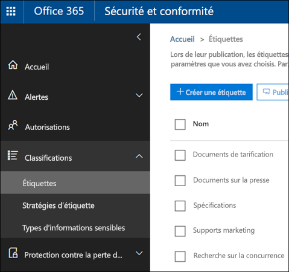
 
## <a name="how-labels-work-with-label-policies"></a><span data-ttu-id="d508d-131">Fonctionnement des étiquettes avec les stratégies d’étiquette</span><span class="sxs-lookup"><span data-stu-id="d508d-131">How labels work with label policies</span></span>

<span data-ttu-id="d508d-p106">Rendre les étiquettes disponibles aux membres de votre organisation afin qu’ils puissent classer du contenu est un processus en deux étapes. Tout d’abord, créez les étiquettes, puis publiez-les dans les emplacements de votre choix. Lorsque vous publiez des étiquettes, une stratégie d’étiquette est créée.</span><span class="sxs-lookup"><span data-stu-id="d508d-p106">Making labels available to people in your organization so that they can classify content is a two-step process: first you create the labels, and then you publish them to the locations you choose. When you publish labels, a label policy gets created.</span></span>
  
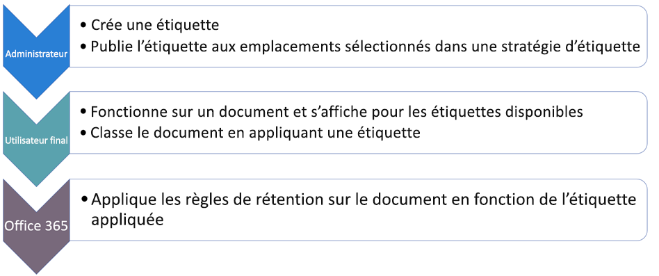
  
<span data-ttu-id="d508d-p107">Les étiquettes sont des blocs de construction indépendants et réutilisables, qui sont inclus dans une stratégie d’étiquette et publiés dans différents emplacements. Les étiquettes peuvent être réutilisées au sein de nombreuses stratégies. L’objectif principal de la stratégie d’étiquette est de regrouper un ensemble d’étiquettes et de spécifier les emplacements où vous souhaitez que ces étiquettes apparaissent.</span><span class="sxs-lookup"><span data-stu-id="d508d-p107">Labels are independent, reusable building blocks that are included in a label policy and published to different locations. Labels can be reused across many policies. The primary purpose of the label policy is to group a set of labels and specify the locations where you want those labels to appear.</span></span>
  
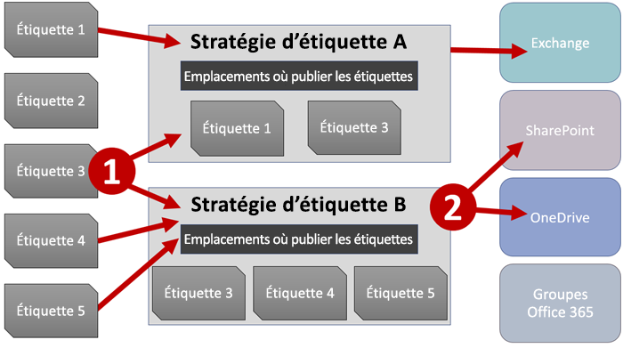
  
1. <span data-ttu-id="d508d-p108">Lorsque vous publiez des étiquettes, celles-ci sont incluses dans une stratégie d’étiquette. Une même étiquette peut être incluse dans plusieurs stratégies.</span><span class="sxs-lookup"><span data-stu-id="d508d-p108">When you publish labels, they're included in a label policy. A single label can be included in many policies.</span></span>
    
2. <span data-ttu-id="d508d-141">Les stratégies d’étiquette définissent les emplacements où publier les étiquettes.</span><span class="sxs-lookup"><span data-stu-id="d508d-141">Label policies specify the locations to publish the labels.</span></span>
    
## <a name="only-one-label-at-a-time"></a><span data-ttu-id="d508d-142">Une seule étiquette à la fois</span><span class="sxs-lookup"><span data-stu-id="d508d-142">Only one label at a time</span></span>

<span data-ttu-id="d508d-143">Il est important de savoir que le contenu comme un e-mail ou un document ne peut porter qu’une seule étiquette à la fois :</span><span class="sxs-lookup"><span data-stu-id="d508d-143">It's important to know that content like an email or document can have only a single label assigned to it at a time:</span></span>
  
- <span data-ttu-id="d508d-144">En ce qui concerne les étiquettes attribuées manuellement par les utilisateurs finaux, les utilisateurs peuvent supprimer ou modifier l’étiquette attribuée.</span><span class="sxs-lookup"><span data-stu-id="d508d-144">For labels assigned manually by end users, people can remove or change the label that's assigned.</span></span>
    
- <span data-ttu-id="d508d-145">Si du contenu porte une étiquette à appliquer automatiquement, celle-ci peut être remplacée par une étiquette attribuée manuellement par un utilisateur final.</span><span class="sxs-lookup"><span data-stu-id="d508d-145">If content has an auto-apply label assigned, an auto-apply label can be replaced by a label assigned manually by an end user.</span></span>
    
- <span data-ttu-id="d508d-146">Si du contenu porte une étiquette attribuée manuellement par un utilisateur final, celle-ci ne peut pas être remplacée par une étiquette à appliquer automatiquement.</span><span class="sxs-lookup"><span data-stu-id="d508d-146">If content has a label assigned manually by an end user, an auto-apply label cannot replace the manually assigned label.</span></span>
    
- <span data-ttu-id="d508d-147">S’il existe plusieurs règles qui attribuent une étiquette à appliquer automatiquement et que le contenu remplit les critères de plusieurs règles, l’étiquette de la règle la plus ancienne est attribuée.</span><span class="sxs-lookup"><span data-stu-id="d508d-147">If there are multiple rules that assign an auto-apply label and content meets the conditions of multiple rules, the label for the oldest rule is assigned. For this reason, it is important to plan the label policies carefully before configuring them. If an organization requires a change to the priority of the label policies, they will need to delete and recreate them.</span></span>
    
<span data-ttu-id="d508d-p109">Les étiquettes attribuées manuellement sont attribuées explicitement ; les étiquettes à appliquer automatiquement sont attribuées implicitement ; une étiquette explicite est prioritaire sur une étiquette implicite. Pour obtenir plus d’informations, consultez la section [Principes de rétention et priorité](labels.md#principles) indiquée ci-après.</span><span class="sxs-lookup"><span data-stu-id="d508d-p109">Manually assigned labels are explicitly assigned; auto-apply labels are implicitly assigned; an explicit label takes precedence over an implicit label. For more information, see the below section on [The principles of retention, or what takes precedence?](labels.md#principles).</span></span>
  
## <a name="how-long-it-takes-for-labels-to-take-effect"></a><span data-ttu-id="d508d-150">Délai d’activation des étiquettes</span><span class="sxs-lookup"><span data-stu-id="d508d-150">How long it takes for labels to take effect</span></span>

<span data-ttu-id="d508d-151">Lorsque vous publiez ou appliquez automatiquement des étiquettes, elles ne prennent pas effet immédiatement :</span><span class="sxs-lookup"><span data-stu-id="d508d-151">When you publish or auto-apply labels, they don't take effect immediately:</span></span>
  
1. <span data-ttu-id="d508d-152">La stratégie d’étiquette doit d’abord être synchronisée à partir du Centre de sécurité &amp; conformité avec les emplacements définis dans la stratégie.</span><span class="sxs-lookup"><span data-stu-id="d508d-152">First the label policy needs to be synced from the Security &amp; Compliance Center to the locations in the policy.</span></span>
    
2. <span data-ttu-id="d508d-p110">Ensuite, l’emplacement a parfois besoin de temps pour rendre les étiquettes manuelles disponibles aux utilisateurs finaux ou appliquer automatiquement des étiquettes au contenu. Le temps nécessaire dépend de l’emplacement et du type d’étiquette.</span><span class="sxs-lookup"><span data-stu-id="d508d-p110">Then the location may require time to make manual labels available to end users or auto-apply labels to content. How long this takes depends on the location and type of label.</span></span>
    
### <a name="manual-labels"></a><span data-ttu-id="d508d-155">Étiquettes manuelles</span><span class="sxs-lookup"><span data-stu-id="d508d-155">Manual labels</span></span>

<span data-ttu-id="d508d-p111">Si vous publiez des étiquettes sur SharePoint ou OneDrive, cela peut prendre un jour pour que ces étiquettes soient visibles aux utilisateurs finaux. De plus, si vous publiez des étiquettes sur Exchange, cela peut prendre 7 jours pour que ces étiquettes soient visibles aux utilisateurs finaux, et la boîte aux lettres doit contenir au moins 10 Mo de données.</span><span class="sxs-lookup"><span data-stu-id="d508d-p111">If you publish labels to SharePoint or OneDrive, it can take one day for those labels to appear for end users. In addition, if you publish labels to Exchange, it can take 7 days for those labels to appear for end users, and the mailbox needs to contain at least 10 MB of data.</span></span>
  
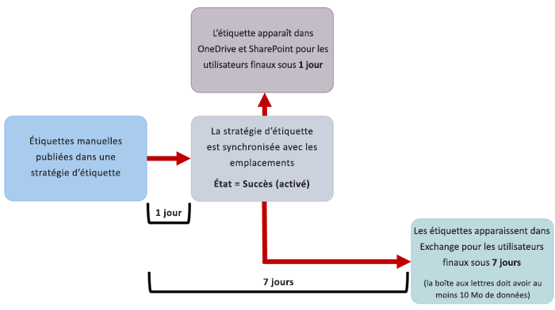
  
### <a name="auto-apply-labels"></a><span data-ttu-id="d508d-159">Étiquettes à appliquer automatiquement</span><span class="sxs-lookup"><span data-stu-id="d508d-159">Auto-apply labels</span></span>

<span data-ttu-id="d508d-160">Si vous appliquez des étiquettes automatiquement au contenu répondant à des conditions spécifiques, il peut prendre sept jours pour que ces étiquettes soient appliquées à tout le contenu remplissant les conditions.</span><span class="sxs-lookup"><span data-stu-id="d508d-160">If you auto-apply labels to content matching specific conditions, it can take seven days for the labels to be applied to all content that matches the conditions.</span></span>
  
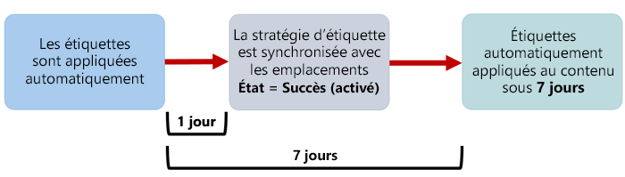
  
### <a name="how-to-check-on-the-status-of-exchange-labels"></a><span data-ttu-id="d508d-162">Vérification du statut des étiquettes Exchange</span><span class="sxs-lookup"><span data-stu-id="d508d-162">How to check on the status of Exchange labels</span></span>

<span data-ttu-id="d508d-p112">Dans Exchange Online, les étiquettes deviennent disponibles aux utilisateurs finaux par l’intermédiaire d’un processus qui s’exécute tous les sept jours. À l’aide de Powershell, vous pouvez découvrir la date de la dernière exécution du processus et déterminer la date de sa prochaine exécution.</span><span class="sxs-lookup"><span data-stu-id="d508d-p112">In Exchange Online, labels are made available to end users by a process that runs every seven days. By using Powershell, you can see when this process last ran and thus determine when it will run again.</span></span>
  
1. <span data-ttu-id="d508d-165">[Connectez-vous à Exchange Online PowerShell](https://go.microsoft.com/fwlink/?linkid=799773).</span><span class="sxs-lookup"><span data-stu-id="d508d-165">[Connect to Exchange Online PowerShell](https://go.microsoft.com/fwlink/?linkid=799773)</span></span>
    
2. <span data-ttu-id="d508d-166">Exécutez les commandes suivantes :</span><span class="sxs-lookup"><span data-stu-id="d508d-166">Run these commands to connect to MO_ExchangeOnline_2nd.</span></span>
    
  ```
  $logProps = Export-MailboxDiagnosticLogs <user> -ExtendedProperties
  ```

  ```
  $xmlprops = [xml]($logProps.MailboxLog)
  ```

  ```
  $xmlprops.Properties.MailboxTable.Property | ? {$_.Name -like "ELC*"}
  ```

    <span data-ttu-id="d508d-p113">Dans les résultats, la propriété (UTC) `ELCLastSuccessTimeStamp` indique la date à laquelle le système a traité votre boîte aux lettres pour la dernière fois. Si ce n’est pas arrivé depuis la création de la stratégie, les étiquettes n’apparaîtront pas. Pour forcer le traitement, exécutez `Start-ManagedFolderAssistant -Identity <user>`.</span><span class="sxs-lookup"><span data-stu-id="d508d-p113">In the results, the  `ELCLastSuccessTimeStamp` (UTC) property shows when the system last processed your mailbox. If it has not happened since the time you created the policy, the labels are not going to appear. To force processing, run  `Start-ManagedFolderAssistant -Identity <user>`.</span></span>
    
    <span data-ttu-id="d508d-170">Si les étiquettes n’apparaissent pas dans Outlook sur le web comme prévu, veillez à vider le cache dans votre navigateur (CTRL + F5).</span><span class="sxs-lookup"><span data-stu-id="d508d-170">If labels aren't appearing in Outlook on the web and you think they should be, make sure to clear the cache in your browser (CTRL+F5).</span></span>
    
## <a name="label-policies-and-locations"></a><span data-ttu-id="d508d-171">Stratégies d’étiquette et emplacements</span><span class="sxs-lookup"><span data-stu-id="d508d-171">Label policies and locations</span></span>

<span data-ttu-id="d508d-172">Différents types d’étiquettes peuvent être publiés dans différents emplacements, en fonction du descriptif de l’étiquette.</span><span class="sxs-lookup"><span data-stu-id="d508d-172">Different types of labels can be published to different locations, depending on what the label does.</span></span>
  
|<span data-ttu-id="d508d-173">**Si l’étiquette est...**</span><span class="sxs-lookup"><span data-stu-id="d508d-173">**If the label is…**</span></span>|<span data-ttu-id="d508d-174">**La stratégie d’étiquette peut être appliquée à...**</span><span class="sxs-lookup"><span data-stu-id="d508d-174">**Then the label policy can be applied to…**</span></span>|
|:-----|:-----|
|<span data-ttu-id="d508d-175">Publiée aux utilisateurs finaux</span><span class="sxs-lookup"><span data-stu-id="d508d-175">Published to end users</span></span>  <br/> |<span data-ttu-id="d508d-176">Exchange, SharePoint, OneDrive et aux groupes Office 365</span><span class="sxs-lookup"><span data-stu-id="d508d-176">Exchange, SharePoint, OneDrive, Office 365 groups</span></span>  <br/> |
|<span data-ttu-id="d508d-177">Appliquée automatiquement en fonction des types d’informations sensibles</span><span class="sxs-lookup"><span data-stu-id="d508d-177">Auto-applied based on sensitive information types</span></span>  <br/> |<span data-ttu-id="d508d-178">Exchange (toutes les boîtes aux lettres uniquement), SharePoint, OneDrive</span><span class="sxs-lookup"><span data-stu-id="d508d-178">Exchange (all mailboxes only), SharePoint, OneDrive</span></span>  <br/> |
|<span data-ttu-id="d508d-179">Appliquée automatiquement en fonction d’une requête</span><span class="sxs-lookup"><span data-stu-id="d508d-179">Auto-applied based on a query</span></span>  <br/> |<span data-ttu-id="d508d-180">Exchange, SharePoint, OneDrive et aux groupes Office 365</span><span class="sxs-lookup"><span data-stu-id="d508d-180">Exchange, SharePoint, OneDrive, Office 365 groups</span></span>  <br/> |
   
<span data-ttu-id="d508d-p114">Notez que dans Exchange, les étiquettes à appliquer automatiquement (pour les requêtes et les types d’informations sensibles) sont appliquées uniquement aux messages récemment envoyés (données en transit), pas à tous les éléments actuellement dans la boîte aux lettres (données au repos). Par ailleurs, les étiquettes à appliquer automatiquement pour les types d’informations sensibles ne peuvent s’appliquer qu’à toutes les boîtes aux lettres. Vous ne pouvez pas sélectionner des boîtes aux lettres spécifiques.</span><span class="sxs-lookup"><span data-stu-id="d508d-p114">Note that in Exchange, auto-apply labels (for both queries and sensitive information types) are applied only to messages newly sent (data in transit), not to all items currently in the mailbox (data at rest). Also, auto-apply labels for sensitive information types can apply only to all mailboxes; you can't select the specific mailboxes.</span></span>
  
<span data-ttu-id="d508d-183">Notez que les dossiers publics Exchange et Skype ne prennent pas en charge les étiquettes.</span><span class="sxs-lookup"><span data-stu-id="d508d-183">Note that Exchange public folders and Skype do not support labels.</span></span>
  
## <a name="how-labels-enforce-retention"></a><span data-ttu-id="d508d-184">Application de la rétention par les étiquettes</span><span class="sxs-lookup"><span data-stu-id="d508d-184">How labels enforce retention</span></span>

<span data-ttu-id="d508d-p115">Des étiquettes peuvent appliquer exactement les mêmes actions de rétention qu’une stratégie de rétention. Vous pouvez utiliser des étiquettes pour implémenter un plan de contenu complexe (ou plan fichier). Pour obtenir plus d’informations sur le fonctionnement de la rétention, consultez l’article [Vue d’ensemble des stratégies de rétention](retention-policies.md).</span><span class="sxs-lookup"><span data-stu-id="d508d-p115">Labels can enforce exactly the same retention actions that a retention policy can. You can use labels to implement a sophisticated content plan (or file plan). For more information on how retention works, see [Overview of retention policies](retention-policies.md).</span></span>
  
<span data-ttu-id="d508d-p116">En outre, une étiquette dispose de deux options de rétention qui sont disponibles uniquement dans une étiquette et pas dans une stratégie de rétention. Avec une étiquette, vous pouvez effectuer les actions suivantes :</span><span class="sxs-lookup"><span data-stu-id="d508d-p116">In addition, a label has two retention options that are available only in a label and not in a retention policy. With a label, you can:</span></span>
  
- <span data-ttu-id="d508d-p117">Déclencher une révision de destruction à la fin de la période de rétention, afin que les documents SharePoint et OneDrive soient vérifiés avant d’être supprimés. Pour obtenir plus d’informations, consultez l’article [Vue d’ensemble des révisions de destruction](disposition-reviews.md).</span><span class="sxs-lookup"><span data-stu-id="d508d-p117">Trigger a disposition review at the end of the retention period, so that SharePoint and OneDrive documents must be reviewed before they can be deleted. For more information, see [Overview of disposition reviews](disposition-reviews.md).</span></span>
    
- <span data-ttu-id="d508d-192">Démarrer la période de rétention à compter de la date d’étiquetage du contenu, au lieu de l’ancienneté du contenu ou de la date de sa dernière modification.</span><span class="sxs-lookup"><span data-stu-id="d508d-192">Start the retention period from when the content was labeled, instead of the age of the content or when it was last modified.</span></span>
    
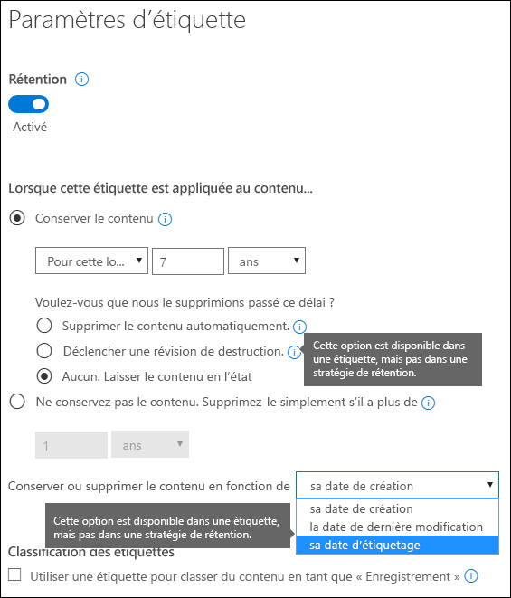
  
## <a name="where-published-labels-can-appear-to-end-users"></a><span data-ttu-id="d508d-194">Emplacements des étiquettes publiées visibles aux utilisateurs finaux</span><span class="sxs-lookup"><span data-stu-id="d508d-194">Where published labels can appear to end users</span></span>

<span data-ttu-id="d508d-195">Si votre étiquette est attribuée au contenu par les utilisateurs finaux, vous pouvez la publier pour :</span><span class="sxs-lookup"><span data-stu-id="d508d-195">If your label will be assigned to content by end users, you can publish it to:</span></span>
  
- <span data-ttu-id="d508d-196">Outlook sur le web</span><span class="sxs-lookup"><span data-stu-id="d508d-196">Outlook on the web</span></span>
    
- <span data-ttu-id="d508d-197">Outlook 2010 et versions ultérieures</span><span class="sxs-lookup"><span data-stu-id="d508d-197">Outlook 2010 and later</span></span>
    
- <span data-ttu-id="d508d-198">OneDrive</span><span class="sxs-lookup"><span data-stu-id="d508d-198">OneDrive</span></span>
    
- <span data-ttu-id="d508d-199">SharePoint</span><span class="sxs-lookup"><span data-stu-id="d508d-199">SharePoint</span></span>
    
- <span data-ttu-id="d508d-200">Les groupes Office 365 (le site de groupe et la boîte aux lettres de groupe dans Outlook sur le web)</span><span class="sxs-lookup"><span data-stu-id="d508d-200">Office 365 groups (both the group site and group mailbox in Outlook on the web)</span></span>
    
<span data-ttu-id="d508d-201">Les sections indiquées ci-dessous montrent comment les étiquettes s’affichent aux membres de votre organisation dans différentes applications.</span><span class="sxs-lookup"><span data-stu-id="d508d-201">The sections below show how labels will appear in different apps to people in your organization.</span></span>
  
### <a name="outlook-on-the-web"></a><span data-ttu-id="d508d-202">Outlook sur le web</span><span class="sxs-lookup"><span data-stu-id="d508d-202">Outlook on the web</span></span>

<span data-ttu-id="d508d-203">Pour étiqueter un élément dans Outlook sur le web, cliquez sur l’élément \> **Attribuer une stratégie** \> choisissez l’étiquette.</span><span class="sxs-lookup"><span data-stu-id="d508d-203">To label an item in Outlook on the web, right-click the item \> **Assign policy** \> choose the label.</span></span> 
  
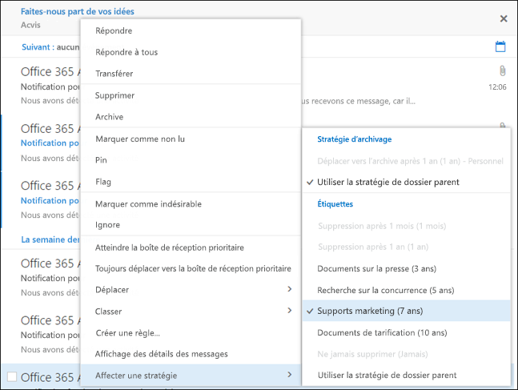
  
<span data-ttu-id="d508d-p118">Après avoir appliqué l’étiquette, vous pouvez l’afficher, ainsi que son action, en haut de l’élément. Si un e-mail est classé et associé à une période de rétention, vous pouvez connaître en un clin d’œil la date d’expiration de l’e-mail.</span><span class="sxs-lookup"><span data-stu-id="d508d-p118">After the label is applied, you can view that label and what action it takes at the top of the item. If an email is classified and has an associated retention period, you can know at a glance when the email will expire.</span></span>
  
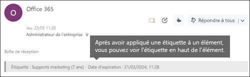
  
<span data-ttu-id="d508d-208">Vous pouvez également appliquer des étiquettes à des dossiers. Dans ce cas, tenez compte des points suivants :</span><span class="sxs-lookup"><span data-stu-id="d508d-208">You can also apply labels to folders, in which case:</span></span>
  
- <span data-ttu-id="d508d-p119">Tous les éléments du dossier héritent automatiquement de cette même étiquette, **à l’exception** des éléments auxquels une étiquette a été appliquée explicitement. Les éléments étiquetés explicitement conservent leur étiquette. Pour obtenir plus d’informations, consultez la section relative aux principes de rétention ci-après.</span><span class="sxs-lookup"><span data-stu-id="d508d-p119">All items in the folder automatically get the same label, **except** for items that have had a label applied explicitly to them. Explicitly labeled items keep their existing label. For more information, see the below section on the principles of retention.</span></span> 
    
- <span data-ttu-id="d508d-212">Si vous modifiez ou supprimez l’étiquette par défaut d’un dossier, l’étiquette est également modifiée ou supprimée pour tous les éléments dans le dossier **à l’exception** des éléments portant des étiquettes explicites.</span><span class="sxs-lookup"><span data-stu-id="d508d-212">If you change or remove the default label for a folder, the label's also changed or removed for all items in the folder, **except** items with explicit labels.</span></span> 
    
- <span data-ttu-id="d508d-213">Si vous déplacez un élément portant une étiquette par défaut d’un dossier vers un autre dossier portant une étiquette par défaut différente, l’élément reçoit la nouvelle étiquette par défaut.</span><span class="sxs-lookup"><span data-stu-id="d508d-213">If you move an item with a default label from one folder to another folder with a different default label, the item will get the new default label.</span></span>
    
- <span data-ttu-id="d508d-214">Si vous déplacez un élément portant une étiquette par défaut d’un dossier vers un autre dossier ne portant pas d’étiquette par défaut, l’ancienne étiquette par défaut est supprimée.</span><span class="sxs-lookup"><span data-stu-id="d508d-214">If you move an item with a default label from one folder to another folder with no default label, the old default label is removed.</span></span>
    
### <a name="outlook-2010-and-later"></a><span data-ttu-id="d508d-215">Outlook 2010 et versions ultérieures</span><span class="sxs-lookup"><span data-stu-id="d508d-215">Outlook 2010 and later</span></span>

<span data-ttu-id="d508d-216">Pour étiqueter un élément dans Outlook sur le web, cliquez sur l’élément \> sur le **Ruban** \> **Attribuer une stratégie** \> choisissez l’étiquette.</span><span class="sxs-lookup"><span data-stu-id="d508d-216">To label an item in Outlook on the web, right-click the item \> on the **Ribbon** \> **Assign Policy** \> choose the label.</span></span> 
  
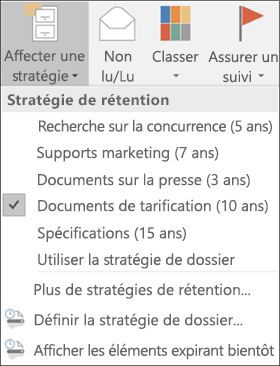
  
<span data-ttu-id="d508d-p120">Après avoir appliqué l’étiquette, vous pouvez l’afficher, ainsi que son action, en haut de l’élément. Si un e-mail est classé et associé à une période de rétention, vous pouvez connaître en un clin d’œil la date d’expiration de l’e-mail.</span><span class="sxs-lookup"><span data-stu-id="d508d-p120">After the label is applied, you can view that label and what action it takes at the top of the item. If an email is classified and has an associated retention period, you can know at a glance when the email will expire.</span></span>
  
<span data-ttu-id="d508d-p121">Vous pouvez également appliquer des étiquettes aux dossiers. Le processus est le même pour Outlook 2010 et versions ultérieures que pour Outlook sur le web : consultez la section précédente pour obtenir plus d’informations.</span><span class="sxs-lookup"><span data-stu-id="d508d-p121">You can also apply labels to folders. This works the same in Outlook 2010 and later as it does in Outlook on the web -- see the previous section for more info.</span></span>
  
### <a name="onedrive-and-sharepoint"></a><span data-ttu-id="d508d-222">OneDrive et SharePoint</span><span class="sxs-lookup"><span data-stu-id="d508d-222">OneDrive and SharePoint</span></span>

<span data-ttu-id="d508d-223">Pour étiqueter un document (notamment les fichiers OneNote) dans OneDrive ou SharePoint, sélectionnez l’élément \> dans le coin supérieur droit, sélectionnez **Ouvrir le volet d’informations** \> **Appliquer une étiquette** \> choisissez l’étiquette.</span><span class="sxs-lookup"><span data-stu-id="d508d-223">To label a document (including OneNote files) in OneDrive or SharePoint, select the item \> in the upper-right corner, choose **Open the details pane** \> **Apply label** \> choose the label.</span></span> 
  
<span data-ttu-id="d508d-224">Notez que vous pouvez également appliquer une étiquette à un ensemble de dossiers ou de documents, et que vous pouvez définir une étiquette par défaut pour une bibliothèque de documents : consultez la section ci-après pour obtenir plus d’informations.</span><span class="sxs-lookup"><span data-stu-id="d508d-224">Note that you can also apply a label to a folder or document set, and you can set a default label for a document library - see the section below for more information.</span></span>
  

  
<span data-ttu-id="d508d-226">Après avoir appliqué une étiquette à un élément, vous pouvez l’afficher dans le volet d’informations lorsque cet élément est sélectionné.</span><span class="sxs-lookup"><span data-stu-id="d508d-226">After a label is applied to an item, you can view it in the details pane when that item's selected.</span></span>
  
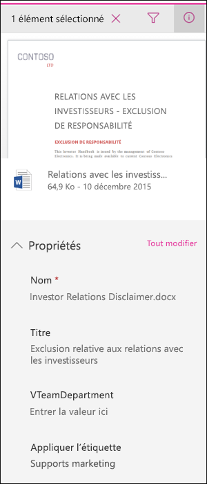
  
<span data-ttu-id="d508d-p122">Vous pouvez également créer un affichage de la bibliothèque qui contient la colonne **Étiquettes** ou la colonne **Élément est un enregistrement**, afin que vous puissiez voir en un clin d’œil les étiquettes attribuées à tous les éléments, et les éléments qui sont des enregistrements. Toutefois, notez que vous ne pouvez pas filtrer l’affichage par la colonne **Élément est un enregistrement**.</span><span class="sxs-lookup"><span data-stu-id="d508d-p122">You can also create a view of the library that contains the **Labels** column or **Item is a Record** column, so that you can see at a glance the labels assigned to all items and which items are records. Note, however, that you can't filter the view by the **Item is a Record** column.</span></span> 
  
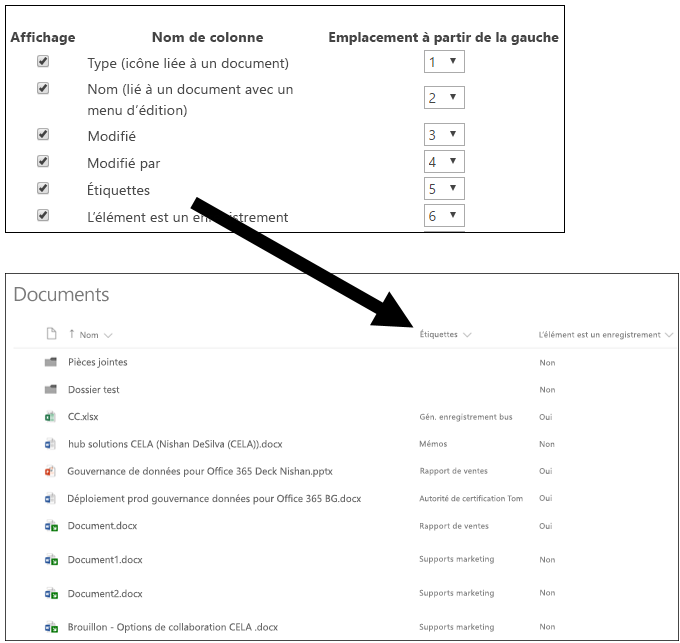
  
### <a name="office-365-groups"></a><span data-ttu-id="d508d-231">Groupes Office 365</span><span class="sxs-lookup"><span data-stu-id="d508d-231">Office 365 groups</span></span>

<span data-ttu-id="d508d-p123">Lorsque vous publiez des étiquettes à un groupe Office 365, les étiquettes apparaissent dans le site de groupe et la boîte aux lettres de groupe dans Outlook sur le web. L’expérience d’application d’une étiquette au contenu est identique à celle illustrée ci-dessus pour la messagerie et les documents.</span><span class="sxs-lookup"><span data-stu-id="d508d-p123">When you publish labels to an Office 365 group, the labels appear in both the group site and group mailbox in Outlook on the web. The experience of applying a label to content is identical to that shown above for email and documents.</span></span>
  
## <a name="applying-a-label-automatically-based-on-conditions"></a><span data-ttu-id="d508d-234">Application d’une étiquette automatiquement en fonction de conditions</span><span class="sxs-lookup"><span data-stu-id="d508d-234">Applying a label automatically based on conditions</span></span>

<span data-ttu-id="d508d-p124">L’une des fonctionnalités les plus puissantes des étiquettes est la possibilité de les appliquer automatiquement au contenu qui remplit certaines conditions. Dans ce cas, les membres de votre organisation ne doivent pas appliquer ces étiquettes : Office 365 s’en charge à leur place.</span><span class="sxs-lookup"><span data-stu-id="d508d-p124">One of the most powerful features of labels is the ability to apply them automatically to content that matches certain conditions. In this case, people in your organization don't need to apply the labels - Office 365 does the work for them.</span></span>
  
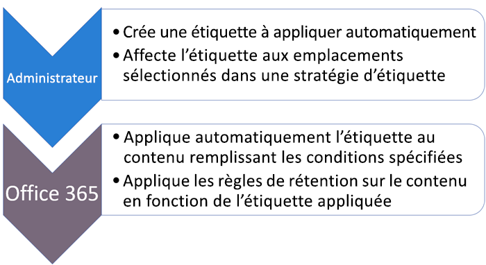
  
<span data-ttu-id="d508d-238">Les étiquettes à appliquer automatiquement sont puissantes pour les raisons suivantes :</span><span class="sxs-lookup"><span data-stu-id="d508d-238">Auto-apply labels are powerful because:</span></span>
  
- <span data-ttu-id="d508d-239">Vous n’avez pas à former les utilisateurs à l’ensemble de vos classifications.</span><span class="sxs-lookup"><span data-stu-id="d508d-239">You don't need to train your users on all of your classifications.</span></span>
    
- <span data-ttu-id="d508d-240">Vous n’avez pas à dépendre des utilisateurs pour classer tout le contenu correctement.</span><span class="sxs-lookup"><span data-stu-id="d508d-240">You don't need to rely on users to classify all content correctly.</span></span>
    
- <span data-ttu-id="d508d-241">Les utilisateurs n’ont plus à connaître les stratégies de gouvernance des données : ils peuvent se concentrer sur leur travail.</span><span class="sxs-lookup"><span data-stu-id="d508d-241">Users no longer need to know about data governance policies - they can focus on their work.</span></span>
    
<span data-ttu-id="d508d-242">Vous pouvez choisir d’appliquer automatiquement des étiquettes au contenu quand celui-ci inclut :</span><span class="sxs-lookup"><span data-stu-id="d508d-242">You can choose to apply labels to content automatically when that content contains:</span></span>
  
- <span data-ttu-id="d508d-243">des types spécifiques d’informations sensibles ;</span><span class="sxs-lookup"><span data-stu-id="d508d-243">Specific types of sensitive information.</span></span>
    
- <span data-ttu-id="d508d-244">des mots clés spécifiques correspondant à une requête que vous créez.</span><span class="sxs-lookup"><span data-stu-id="d508d-244">Specific keywords that match a query you create.</span></span>
    
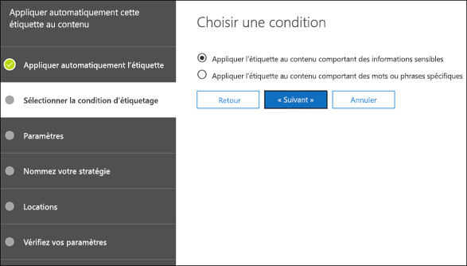
  
<span data-ttu-id="d508d-246">Notez que les étiquettes à appliquer automatiquement requièrent un abonnement Office 365 Entreprise E5 et que cela peut prendre jusqu’à sept jours pour que les étiquettes à appliquer automatiquement soient appliquées à tout le contenu remplissant les conditions, comme décrit ci-dessus.</span><span class="sxs-lookup"><span data-stu-id="d508d-246">Note that auto-apply labels require an Office 365 Enterprise E5 subscription, and that it can take up to seven days for auto-apply labels to be applied to all content that matches the conditions, as described above.</span></span>
  
### <a name="auto-apply-labels-to-content-with-specific-types-of-sensitive-information"></a><span data-ttu-id="d508d-247">Application automatique d’étiquettes au contenu incluant des types spécifiques d’informations sensibles</span><span class="sxs-lookup"><span data-stu-id="d508d-247">Auto-apply labels to content with specific types of sensitive information</span></span>

<span data-ttu-id="d508d-p125">Lorsque vous créez des étiquettes à appliquer automatiquement pour des informations sensibles, vous observez la même liste de modèles de stratégies que lorsque vous créez une stratégie de prévention contre la perte de données (DLP). Chaque modèle de stratégie est préconfiguré pour rechercher des types spécifiques d’informations sensibles. Par exemple, le modèle présenté ici recherche les numéros d’identification fiscale individuels américains (ITIN), les numéros de sécurité sociale et les numéros de passeport. Pour en savoir plus sur la protection contre la perte de données, consultez l’article [Vue d’ensemble des stratégies de protection contre la perte de données](data-loss-prevention-policies.md).</span><span class="sxs-lookup"><span data-stu-id="d508d-p125">When you create auto-apply labels for sensitive information, you see the same list of policy templates as when you create a data loss prevention (DLP) policy. Each policy template is preconfigured to look for specific types of sensitive information - for example, the template shown here looks for U.S. ITIN, SSN, and passport numbers. To learn more about DLP, see [Overview of data loss prevention policies](data-loss-prevention-policies.md).</span></span>
  
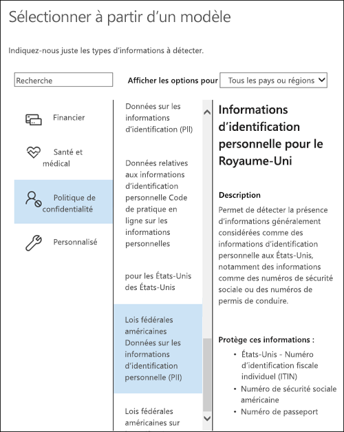
  
<span data-ttu-id="d508d-p126">Après avoir sélectionné un modèle de stratégie, vous pouvez ajouter ou supprimer tout type d’informations sensibles, et vous pouvez modifier le nombre d’instances et la précision de correspondance. Dans l’exemple présenté ici, une étiquette sera appliquée automatiquement uniquement dans les cas suivants :</span><span class="sxs-lookup"><span data-stu-id="d508d-p126">After you select a policy template, you can add or remove any types of sensitive information, and you can change the instance count and match accuracy. In the example shown here, a label will be auto-applied only when:</span></span>
  
- <span data-ttu-id="d508d-p127">Le contenu comprend entre 1 et 9 instances de l’un de ces trois types d’informations sensibles. Vous pouvez supprimer la valeur **max** pour la définir sur **any**.</span><span class="sxs-lookup"><span data-stu-id="d508d-p127">The content contains between 1 and 9 instances of any of these three sensitive information types. You can delete the **max** value so that it changes to **any**.</span></span>
    
- <span data-ttu-id="d508d-p128">Le type d’informations sensibles détecté a une précision de correspondance (ou niveau de confiance) minimale de 75. De nombreux types d’informations sensibles sont définis avec plusieurs modèles. Tandis qu’un modèle avec une précision de correspondance plus élevée nécessite un nombre de preuves plus important (par exemple, des mots clés, des dates ou des adresses), un modèle avec une précision de correspondance inférieure nécessite moins de preuves. En d’autres termes, plus la précision de correspondance **min** est faible, plus il est facile de faire correspondre le contenu à la condition.</span><span class="sxs-lookup"><span data-stu-id="d508d-p128">The type of sensitive information that's detected has a match accuracy (or confidence level) of at least 75. Many sensitive information types are defined with multiple patterns, where a pattern with a higher match accuracy requires more evidence to be found (such as keywords, dates, or addresses), while a pattern with a lower match accuracy requires less evidence. Simply put, the lower the **min** match accuracy, the easier it is for content to match the condition.</span></span> 
    
    <span data-ttu-id="d508d-259">Si vous modifiez la précision de correspondance (ou niveau de confiance), vous devez utiliser l’un des niveaux de confiance utilisés dans un modèle pour ce type d’informations sensibles, comme défini dans [Éléments recherchés par les types d’informations sensibles](what-the-sensitive-information-types-look-for.md).</span><span class="sxs-lookup"><span data-stu-id="d508d-259">If you change the match accuracy (or confidence level), you should use one of confidence levels used in a pattern for that type of sensitive information, as defined in [What the sensitive information types look for](what-the-sensitive-information-types-look-for.md).</span></span>
    
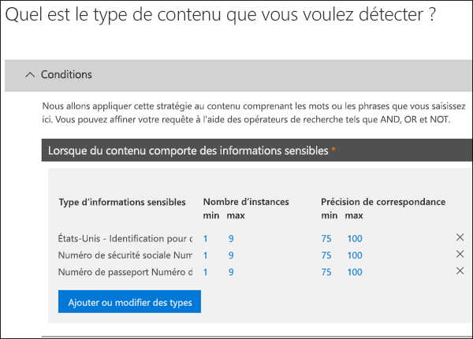
  
### <a name="auto-apply-labels-to-content-with-specific-keywords"></a><span data-ttu-id="d508d-261">Application automatique d’étiquettes au contenu avec des mots clés spécifiques</span><span class="sxs-lookup"><span data-stu-id="d508d-261">Auto-apply labels to content with specific keywords</span></span>

<span data-ttu-id="d508d-p129">Vous pouvez appliquer automatiquement des étiquettes au contenu remplissant certaines conditions. Les conditions actuellement disponibles prennent en charge l’application d’une étiquette au contenu comprenant des mots ou des phrases spécifiques. Vous pouvez affiner votre requête à l’aide des opérateurs de recherche tels que AND, OR et NOT. Pour obtenir plus d’informations sur ces opérateurs, consultez l’article [Requêtes par mots clés et conditions de recherche pour la recherche de contenu](keyword-queries-and-search-conditions.md).</span><span class="sxs-lookup"><span data-stu-id="d508d-p129">You can auto-apply labels to content that satisfies certain conditions. The conditions available now support applying a label to content that contains specific words or phrases. You can refine your query by using search operators like AND, OR, and NOT. For more information on operators, see [Keyword queries and search conditions for Content Search](keyword-queries-and-search-conditions.md).</span></span>
  
<span data-ttu-id="d508d-266">La prise en charge de l’ajout de propriétés utilisables dans une requête (par exemple, **subject:**) sera bientôt disponible.</span><span class="sxs-lookup"><span data-stu-id="d508d-266">Support for adding searchable properties (for example, **subject:** ) is coming soon.</span></span> 
  
<span data-ttu-id="d508d-267">Notez que les étiquettes basées sur une requête utilisent l’index de recherche pour identifier le contenu.</span><span class="sxs-lookup"><span data-stu-id="d508d-267">Note that query-based labels use the search index to identify content.</span></span>
  
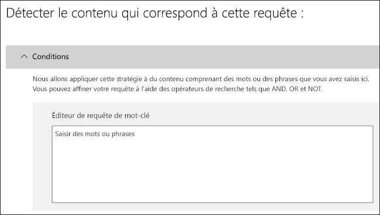
  
## <a name="applying-a-default-label-to-all-content-in-a-sharepoint-library-folder-or-document-set"></a><span data-ttu-id="d508d-269">Application d’une étiquette par défaut à tout le contenu dans une bibliothèque, un dossier ou un ensemble de documents SharePoint</span><span class="sxs-lookup"><span data-stu-id="d508d-269">Applying a default label to all content in a SharePoint library, folder, or document set</span></span>

<span data-ttu-id="d508d-270">En plus de permettre aux utilisateurs d’appliquer une étiquette à des documents individuels, vous pouvez également appliquer une étiquette par défaut à une bibliothèque, à un dossier ou à un ensemble de documents SharePoint, afin que tous les documents dans cet emplacement héritent de cette étiquette par défaut.</span><span class="sxs-lookup"><span data-stu-id="d508d-270">In addition to enabling people to apply a label to individual documents, you can also apply a default label to a SharePoint library, folder, or document set, so that all documents in that location get the default label.</span></span>
  
<span data-ttu-id="d508d-p130">Pour une bibliothèque de documents, cette opération s’effectue sur la page **Paramètres de la bibliothèque**. Lorsque vous choisissez l’étiquette par défaut, vous pouvez également choisir de l’appliquer à tous les éléments présents dans la bibliothèque.</span><span class="sxs-lookup"><span data-stu-id="d508d-p130">For a document library, this is done on the **Library settings** page for a document library. When you choose the default label, you can also choose to apply it to any existing items in the library.</span></span> 
  
<span data-ttu-id="d508d-273">Par exemple, si vous avez une balise pour des documents marketing et vous savez qu’une bibliothèque de documents spécifique contient uniquement ce type de contenu, vous pouvez rendre la balise Document marketing par défaut pour tous les documents de cette bibliothèque.</span><span class="sxs-lookup"><span data-stu-id="d508d-273">For example, if you have a tag for marketing materials, and you know a specific document library will contain only that type of content, you can make the Marketing Materials tag the default for all documents in that library.</span></span>
  
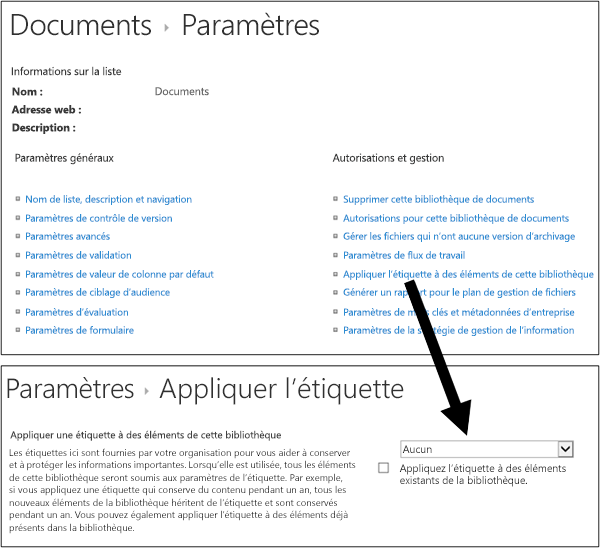
  
<span data-ttu-id="d508d-275">Si vous appliquez une étiquette par défaut à des éléments existants dans la bibliothèque, le dossier ou l’ensemble de documents, procédez comme suit :</span><span class="sxs-lookup"><span data-stu-id="d508d-275">If you apply a default label to existing items in the library, folder, or document set:</span></span>
  
- <span data-ttu-id="d508d-p131">Tous les éléments de la bibliothèque, du dossier ou de l’ensemble de documents héritent automatiquement de cette même étiquette, **à l’exception** des éléments auxquels une étiquette a été appliquée explicitement. Les éléments étiquetés explicitement conservent leur étiquette. Pour obtenir plus d’informations, consultez la section [Principes de rétention et priorité](labels.md#principles) indiquée ci-après.</span><span class="sxs-lookup"><span data-stu-id="d508d-p131">All items in the library, folder, or document set automatically get the same label, **except** for items that have had a label applied explicitly to them. Explicitly labeled items keep their existing label. For more information, see the below section on [The principles of retention, or what takes precedence?](labels.md#principles).</span></span>
    
- <span data-ttu-id="d508d-279">Si vous modifiez ou supprimez l’étiquette par défaut d’une bibliothèque, d’un dossier ou de l’ensemble de documents, l’étiquette est également modifiée ou supprimée pour tous les éléments dans la bibliothèque, le dossier ou l’ensemble de documents, **à l’exception** des éléments portant des étiquettes explicites.</span><span class="sxs-lookup"><span data-stu-id="d508d-279">If you change or remove the default label for a library, folder, or document set, the label's also changed or removed for all items in the library, folder, or document set, **except** items with explicit labels.</span></span> 
    
- <span data-ttu-id="d508d-280">Si vous déplacez un élément portant une étiquette par défaut d’une bibliothèque, d’un dossier ou d’un ensemble de documents vers une autre bibliothèque, un autre dossier ou un autre ensemble de documents, l’élément conserve son étiquette par défaut existante, même si l’étiquette par défaut du nouvel emplacement est différente.</span><span class="sxs-lookup"><span data-stu-id="d508d-280">If you move an item with a default label from one library, folder, or document set to another library, folder, or document set, the item keeps its existing default label, even if the new location has a different default label.</span></span>
    
## <a name="applying-a-label-to-email-by-using-rules"></a><span data-ttu-id="d508d-281">Application d’une étiquette à la messagerie à l’aide de règles</span><span class="sxs-lookup"><span data-stu-id="d508d-281">Applying a label to email by using rules</span></span>

<span data-ttu-id="d508d-282">Dans Outlook 2010 ou versions ultérieures, vous pouvez créer des règles pour appliquer une étiquette ou une stratégie de rétention.</span><span class="sxs-lookup"><span data-stu-id="d508d-282">In Outlook 2010 or later, you can create rules to apply a label or retention policy.</span></span>
  
<span data-ttu-id="d508d-283">Par exemple, vous pouvez créer une règle qui applique une étiquette spécifique de tous les messages envoyés vers un groupe de distribution spécifique ou à partir de celui-ci.</span><span class="sxs-lookup"><span data-stu-id="d508d-283">For example, you can create a rule that applies a specific label to all messages sent to or from a specific distribution group.</span></span>
  
<span data-ttu-id="d508d-284">Pour créer une règle, faites un clic droit sur un élément \> **Règles** \> **Créer une règle** \> **Options avancées** \> **Assistant de règles** \> **appliquez la stratégie de rétention**.</span><span class="sxs-lookup"><span data-stu-id="d508d-284">To create a rule, right-click an item \> **Rules** \> **Create Rule** \> **Advanced Options** \> **Rules Wizard** \> **apply retention policy**.</span></span>
  

  
## <a name="classifying-content-without-applying-any-actions"></a><span data-ttu-id="d508d-286">Classification de contenu sans appliquer d’action</span><span class="sxs-lookup"><span data-stu-id="d508d-286">Classifying content without applying any actions</span></span>

<span data-ttu-id="d508d-p132">Lorsque vous créez une étiquette, vous pouvez le faire sans activer de rétention ou d’autres actions, comme illustré ci-dessous. Dans ce cas, vous pouvez utiliser une étiquette comme simple étiquette de texte sans y appliquer la moindre action.</span><span class="sxs-lookup"><span data-stu-id="d508d-p132">When you create a label, you can do so without turning on any retention or other actions, as shown below. In this case, you can use a label simply as a text label, without enforcing any actions.</span></span>
  
<span data-ttu-id="d508d-289">Par exemple, vous pouvez créer une étiquette nommée « Réviser plus tard » sans action, puis appliquer automatiquement cette étiquette au contenu avec des types d’informations sensibles ou au contenu recherché.</span><span class="sxs-lookup"><span data-stu-id="d508d-289">For example, you can create a label named "Review later" with no actions, and then auto-apply that label to content with sensitive information types or queried content.</span></span>
  
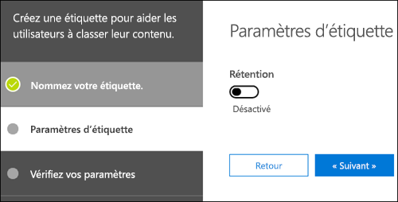
  
## <a name="using-labels-for-records-management"></a><span data-ttu-id="d508d-291">Utilisation d’étiquettes pour la gestion des enregistrements</span><span class="sxs-lookup"><span data-stu-id="d508d-291">Using labels for records management</span></span>

<span data-ttu-id="d508d-292">À un niveau élevé, la gestion des enregistrements implique les points suivants :</span><span class="sxs-lookup"><span data-stu-id="d508d-292">At a high level, records management means that:</span></span>
  
- <span data-ttu-id="d508d-293">Le contenu important est classé comme un enregistrement par les utilisateurs.</span><span class="sxs-lookup"><span data-stu-id="d508d-293">Important content is classified as a record by users.</span></span>
    
- <span data-ttu-id="d508d-294">Un enregistrement ne peut pas être modifié ou supprimé.</span><span class="sxs-lookup"><span data-stu-id="d508d-294">A record can't be modified or deleted.</span></span>
    
- <span data-ttu-id="d508d-295">Les enregistrements sont finalement supprimés à l’issue de l’expiration de leur durée de vie.</span><span class="sxs-lookup"><span data-stu-id="d508d-295">Records are finally disposed of after their stated lifetime is past.</span></span>
    
<span data-ttu-id="d508d-p133">Vous pouvez utiliser des étiquettes pour implémenter une stratégie de gestion des enregistrements simple et cohérente dans Office 365, tandis que les autres fonctionnalités de gestion des enregistrements telles que le Centre des enregistrements s’appliquent uniquement au contenu SharePoint. De plus, vous pouvez entreprendre des actions de rétention sur des enregistrements afin qu’ils soient automatiquement supprimés à la fin de leur cycle de vie.</span><span class="sxs-lookup"><span data-stu-id="d508d-p133">You can use labels to implement a single, consistent records-management strategy across Office 365, whereas other records-management features such as the Record Center apply only to SharePoint content. And you can enforce retention actions on records, so that they're disposed of automatically at the end of their lifecycle.</span></span>
  
<span data-ttu-id="d508d-298">Lorsque vous créez une étiquette, vous pouvez l’utiliser pour classer le contenu en tant qu’enregistrement.</span><span class="sxs-lookup"><span data-stu-id="d508d-298">When you create a label, you have the option to use the label to classify the content as a record.</span></span>
  
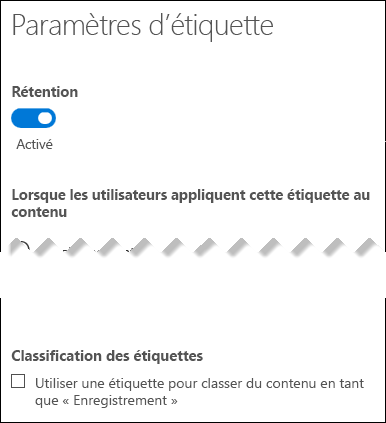
  
<span data-ttu-id="d508d-300">Lorsqu’un élément est étiqueté en tant qu’enregistrement, quatre événements se produisent :</span><span class="sxs-lookup"><span data-stu-id="d508d-300">When an item is labeled as a record, four things happen:</span></span>
  
- <span data-ttu-id="d508d-301">L’élément ne peut pas être supprimé définitivement.</span><span class="sxs-lookup"><span data-stu-id="d508d-301">The item can't be permanently deleted.</span></span>
    
- <span data-ttu-id="d508d-302">L’élément ne peut pas être modifié.</span><span class="sxs-lookup"><span data-stu-id="d508d-302">The item can't be edited.</span></span>
    
- <span data-ttu-id="d508d-303">L’étiquette ne peut pas être modifiée.</span><span class="sxs-lookup"><span data-stu-id="d508d-303">The label can't be changed.</span></span>
    
- <span data-ttu-id="d508d-304">L’étiquette ne peut pas être supprimée.</span><span class="sxs-lookup"><span data-stu-id="d508d-304">The label can't be removed.</span></span>
    
### <a name="who-can-classify-content-as-a-record"></a><span data-ttu-id="d508d-305">Utilisateur autorisé à classer du contenu en tant qu’enregistrement</span><span class="sxs-lookup"><span data-stu-id="d508d-305">Who can classify content as a record</span></span>

<span data-ttu-id="d508d-p134">Pour le contenu SharePoint, tous les utilisateurs du groupe Membres par défaut (le niveau d’autorisation Collaboration) peuvent appliquer une étiquette d’enregistrement au contenu. Seul l’administrateur de collection de sites peut supprimer ou modifier cette étiquette une fois que celle-ci a été appliquée. Par ailleurs, une étiquette qui classe du contenu en tant qu’enregistrement doit être appliquée manuellement ; elle ne peut pas être appliquée automatiquement.</span><span class="sxs-lookup"><span data-stu-id="d508d-p134">For SharePoint content, any user in the default Members group (the Contribute permission level) can apply a record label to content. Only the site collection administrator can remove or change that label after it's been applied. In addition, a label that classifies content as a record needs to be applied manually; it can't be auto-applied.</span></span>
  
### <a name="records-and-folders"></a><span data-ttu-id="d508d-309">Enregistrements et dossiers</span><span class="sxs-lookup"><span data-stu-id="d508d-309">Records and folders</span></span>

<span data-ttu-id="d508d-p135">Vous pouvez appliquer une étiquette à un dossier dans Exchange, SharePoint ou OneDrive. Si un dossier est étiqueté en tant qu’enregistrement et que vous déplacez un élément dans le dossier, l’élément est étiqueté en tant qu’enregistrement. Lorsque vous déplacez l’élément hors du dossier, l’élément reste étiqueté en tant qu’enregistrement.</span><span class="sxs-lookup"><span data-stu-id="d508d-p135">You can apply a label to a folder in Exchange, SharePoint, or OneDrive. If a folder is labeled as a record, and you move an item into the folder, the item is labeled as a record. When you move the item out of the folder, the item will continue to be labeled as a record.</span></span>
  
### <a name="records-cant-be-deleted"></a><span data-ttu-id="d508d-313">Impossible de supprimer les enregistrements</span><span class="sxs-lookup"><span data-stu-id="d508d-313">Records can't be deleted</span></span>

<span data-ttu-id="d508d-314">Si vous tentez de supprimer un enregistrement dans Exchange, l’élément est déplacé vers le dossier Éléments récupérables, comme décrit dans la rubrique [Fonctionnement d’une stratégie de rétention avec du contenu sur place](retention-policies.md#how-a-retention-policy-works-with-content-in-place).</span><span class="sxs-lookup"><span data-stu-id="d508d-314">If you attempt to delete a record in Exchange, the item is moved to the Recoverable Items folder as described in [How a retention policy works with content in place](retention-policies.md#how-a-retention-policy-works-with-content-in-place).</span></span>
  
<span data-ttu-id="d508d-315">Si vous tentez de supprimer un enregistrement dans SharePoint, vous recevez une erreur indiquant que l’élément n’a pas été supprimé, et l’élément reste dans la bibliothèque.</span><span class="sxs-lookup"><span data-stu-id="d508d-315">If you attempt to delete a record in a SharePoint, you see an error that the item wasn't deleted, and the item remains in the library.</span></span>
  
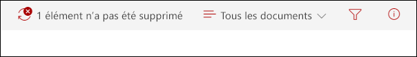
  
<span data-ttu-id="d508d-317">Si vous tentez de supprimer un enregistrement dans OneDrive, l’élément est déplacé vers la bibliothèque de conservation et de préservation des documents, comme décrit dans la rubrique [Fonctionnement d’une stratégie de rétention avec du contenu sur place](retention-policies.md#how-a-retention-policy-works-with-content-in-place).</span><span class="sxs-lookup"><span data-stu-id="d508d-317">If you attempt to delete a record in OneDrive, the item is moved to the Preservation Hold library as described in [How a retention policy works with content in place](retention-policies.md#how-a-retention-policy-works-with-content-in-place).</span></span>
  
## <a name="using-a-label-as-a-condition-in-a-dlp-policy"></a><span data-ttu-id="d508d-318">Utilisation d’une étiquette comme condition dans une stratégie DLP</span><span class="sxs-lookup"><span data-stu-id="d508d-318">Using a label as a condition in a DLP policy</span></span>

<span data-ttu-id="d508d-p136">Une étiquette peut appliquer des actions de **rétention** sur le contenu. En outre, vous pouvez utiliser une étiquette comme condition dans une stratégie prévention contre la perte de données (DLP). Cela signifie qu’une stratégie DLP peut appliquer des actions de **protection**, telles que la restriction d’accès, au contenu portant une étiquette spécifique.</span><span class="sxs-lookup"><span data-stu-id="d508d-p136">A label can enforce **retention** actions on content. In addition, you can use a label as a condition in a data loss prevention (DLP) policy. This means that a DLP policy can enforce **protection** actions, such as restricting access, on content that contains a specific label.</span></span> 
  
<span data-ttu-id="d508d-322">Pour obtenir plus d’informations, consultez la rubrique [Utilisation d’une étiquette comme condition dans une stratégie DLP](data-loss-prevention-policies.md#using-a-label-as-a-condition-in-a-dlp-policy).</span><span class="sxs-lookup"><span data-stu-id="d508d-322">For more information, see [Using a label as a condition in a DLP policy](data-loss-prevention-policies.md#using-a-label-as-a-condition-in-a-dlp-policy).</span></span>
  
## <a name="using-the-label-activity-explorer-and-the-data-governance-reports"></a><span data-ttu-id="d508d-323">Utilisation de l’Explorateur d’activité des étiquettes et des rapports de gouvernance des données</span><span class="sxs-lookup"><span data-stu-id="d508d-323">Using the Label Activity Explorer and the data governance reports</span></span>

<span data-ttu-id="d508d-p137">Après avoir publié ou appliqué automatiquement vos étiquettes, vous voudrez vérifier qu’elles s’appliquent correctement au contenu. Pour contrôler vos étiquettes, vous pouvez utiliser les éléments suivants :</span><span class="sxs-lookup"><span data-stu-id="d508d-p137">After you publish or auto-apply your labels, you'll want to verify that they're being applied to content as you intended. To monitor your labels, you can use the:</span></span>
  
- <span data-ttu-id="d508d-p138">**Explorateur d’activité des étiquettes**. Grâce à l’explorateur (voir ci-après), vous pouvez rapidement rechercher et afficher l’activité des étiquettes pour tout le contenu au sein de SharePoint et OneDrive Entreprise au cours des 30 derniers jours. Pour obtenir plus d’informations, consultez l’article [Afficher l’activité des étiquettes pour les documents](view-label-activity-for-documents.md).</span><span class="sxs-lookup"><span data-stu-id="d508d-p138">**Label Activity Explorer**. With the explorer (shown below), you can quickly search and view label activity for all content across SharePoint and OneDrive for Business over the past 30 days. For more information, see [View label activity for documents](view-label-activity-for-documents.md).</span></span>
    
- <span data-ttu-id="d508d-p139">**Rapports de gouvernance des données**. Grâce à ces rapports, vous pouvez rapidement afficher les activités et les tendances des étiquettes pour tout le contenu dans Exchange, SharePoint et OneDrive Entreprise au cours des 90 derniers jours. Pour obtenir plus d’informations, consultez l’article [Affichage des rapports de gouvernance des données](view-the-data-governance-reports.md).</span><span class="sxs-lookup"><span data-stu-id="d508d-p139">**Data governance reports**. With these reports, you can quickly view label trends and activity for all content across Exchange, SharePoint, and OneDrive for Business over the past 90 days. For more information, see [View the data governance reports](view-the-data-governance-reports.md).</span></span>
    
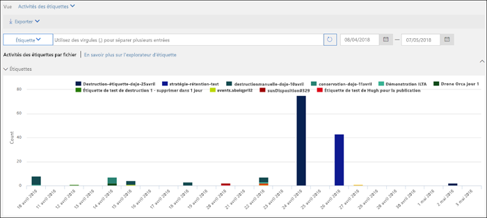
  
## <a name="using-content-search-to-find-all-content-with-a-specific-label-applied-to-it"></a><span data-ttu-id="d508d-333">Utilisation de la recherche de contenu pour rechercher tout le contenu portant une étiquette spécifique</span><span class="sxs-lookup"><span data-stu-id="d508d-333">Using Content Search to find all content with a specific label applied to it</span></span>

<span data-ttu-id="d508d-334">Une fois que les étiquettes sont attribuées au contenu, par les utilisateurs ou automatiquement, vous pouvez utiliser la recherche de contenu dans le Centre de sécurité &amp; conformité pour rechercher tout le contenu classé avec une étiquette spécifique.</span><span class="sxs-lookup"><span data-stu-id="d508d-334">After labels are assigned to content, either by users or auto-applied, you can use content search in the Security &amp; Compliance Center to find all content that's classified with a specific label.</span></span>
  
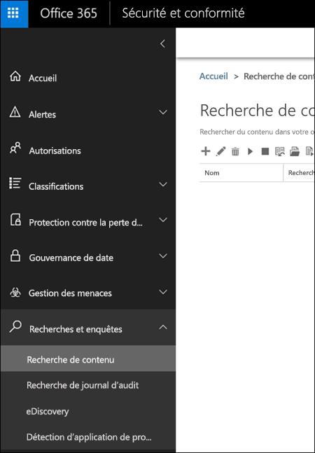
  
<span data-ttu-id="d508d-p140">Lorsque vous créez une recherche de contenu, sélectionnez la condition **Balise de conformité**, puis saisissez l’intégralité ou une partie du nom de l’étiquette et utilisez un caractère générique. Pour obtenir plus d’informations, consultez l’article [Requêtes par mots clés et conditions de recherche pour la recherche de contenu](keyword-queries-and-search-conditions.md).</span><span class="sxs-lookup"><span data-stu-id="d508d-p140">When you create a content search, choose the **Compliance Tag** condition, and then enter the complete label name or part of the label name and use a wildcard. For more information, see [Keyword queries and search conditions for Content Search](keyword-queries-and-search-conditions.md).</span></span>
  
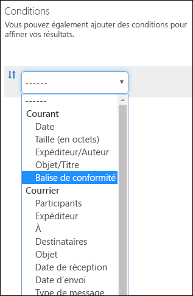
  
## <a name="the-principles-of-retention-or-what-takes-precedence"></a><span data-ttu-id="d508d-339">Principes de rétention et priorité</span><span class="sxs-lookup"><span data-stu-id="d508d-339">The principles of retention, or what takes precedence?</span></span>

<span data-ttu-id="d508d-p141">Il est possible, voire même probable, que le contenu fasse l’objet de plusieurs stratégies de rétention, chacune avec une action (conservation, suppression ou les deux) et une période de rétention différentes. Laquelle est prioritaire ? Au plus haut niveau, sachez que le contenu conservé par une stratégie ne peut pas être supprimé définitivement par une autre stratégie.</span><span class="sxs-lookup"><span data-stu-id="d508d-p141">It's possible or even likely that content might have several retention policies applied to it, each with a different action (retain, delete, or both) and retention period. What takes precedence? At the highest level, rest assured that content being retained by one policy can't be permanently deleted by another policy.</span></span>
  
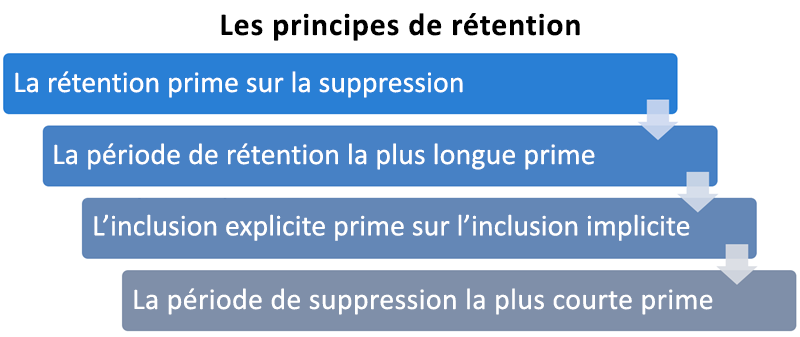
  
<span data-ttu-id="d508d-344">Pour comprendre comment les différentes étiquettes avec des actions de rétention s’appliquent au contenu, prenez en compte les principes de rétention suivants :</span><span class="sxs-lookup"><span data-stu-id="d508d-344">To understand how different labels with retention actions are applied to content, keep these principles of retention in mind:</span></span>
  
1. <span data-ttu-id="d508d-p142">**La rétention l’emporte sur la suppression.** Supposons qu’une stratégie de rétention stipule de supprimer la messagerie Exchange au bout de trois ans, mais qu’une autre stratégie de rétention stipule de la conserver pendant cinq ans, puis de la supprimer. Le contenu atteignant trois ans est supprimé et masqué des utilisateurs, mais est conservé dans le dossier Éléments récupérables jusqu’à ce que le contenu atteigne cinq ans, avant d’être définitivement supprimé.</span><span class="sxs-lookup"><span data-stu-id="d508d-p142">**Retention wins over deletion.** Suppose that one retention policy says to delete Exchange email after three years, but another retention policy says to retain Exchange email for five years and then delete it. Any content that reaches three years old will be deleted and hidden from the users' view, but still retained in the Recoverable Items folder until the content reaches five years old, when it will be permanently deleted.</span></span> 
    
2. <span data-ttu-id="d508d-p143">\*\*La plus longue période de rétention l’emporte. \*\* Si du contenu est soumis à plusieurs stratégies de rétention, il est conservé jusqu’à la fin de la période de rétention la plus longue.</span><span class="sxs-lookup"><span data-stu-id="d508d-p143">**The longest retention period wins.** If content's subject to multiple policies that retain content, it will be retained until the end of the longest retention period.</span></span> 
    
3. <span data-ttu-id="d508d-p144">\*\*L’inclusion explicite l’emporte sur l’inclusion implicite. \*\* Il faut donc prendre en compte les points suivants :</span><span class="sxs-lookup"><span data-stu-id="d508d-p144">**Explicit inclusion wins over implicit inclusion.** This means:</span></span> 
    
    1. <span data-ttu-id="d508d-p145">Si une étiquette avec des paramètres de rétention est attribuée manuellement par un utilisateur à un élément, par exemple, un e-mail Exchange ou un document OneDrive, cette étiquette est prioritaire sur une stratégie assignée au niveau du site ou de la boîte aux lettres et une étiquette par défaut attribuée par la bibliothèque de documents. Par exemple, si l’étiquette explicite stipule que la période de rétention est de dix ans, mais que la stratégie appliquée au site indique que la période de rétention est de cinq ans, l’étiquette est prioritaire. Notez que les étiquettes appliquées automatiquement sont considérées comme implicites et non explicites, car elles sont appliquées automatiquement par Office 365.</span><span class="sxs-lookup"><span data-stu-id="d508d-p145">If a label with retention settings is manually assigned by a user to an item, such as an Exchange email or OneDrive document, that label takes precedence over both a policy assigned at the site or mailbox level and a default label assigned by the document library. For example, if the explicit label says to retain for ten years, but the policy assigned to the site says to retain for only five years, the label takes precedence. Note that auto-apply labels are considered implicit, not explicit, because they're applied automatically by Office 365.</span></span>
    
    2. <span data-ttu-id="d508d-355">Si une stratégie de rétention inclut un emplacement spécifique, tel que la boîte aux lettres d’un utilisateur spécifique ou compte OneDrive Entreprise, cette stratégie l’emporte sur une autre stratégie de rétention qui s’applique à l’ensemble des boîtes aux lettres ou des comptes OneDrive Entreprise des utilisateurs, mais n’inclut pas spécifiquement la boîte aux lettres de l’utilisateur en question.</span><span class="sxs-lookup"><span data-stu-id="d508d-355">If a retention policy includes a specific location, such as a specific user's mailbox or OneDrive for Business account, that policy takes precedence over another retention policy that applies to all users' mailboxes or OneDrive for Business accounts but doesn't specifically include that user's mailbox.</span></span>
    
4. <span data-ttu-id="d508d-p146">\*\*La période de suppression la plus courte l’emporte. \*\* De même, si du contenu est soumis à plusieurs stratégies de suppression (sans aucune rétention), il est supprimé à la fin de la période de rétention la plus courte.</span><span class="sxs-lookup"><span data-stu-id="d508d-p146">**The shortest deletion period wins.** Similarly, if content's subject to multiple policies that delete content (with no retention), it will be deleted at the end of the shortest retention period.</span></span> 
    
<span data-ttu-id="d508d-358">Notez que les principes de rétention opèrent comme un flux de partage du haut vers le bas : si les règles appliquées par toutes les stratégies ou étiquettes sont identiques sur un même niveau, le flux passe au niveau inférieur pour déterminer la règle prioritaire à appliquer.</span><span class="sxs-lookup"><span data-stu-id="d508d-358">Understand that the principles of retention work as a tie-breaking flow from top to bottom: If the rules applied by all policies or labels are the same at one level, the flow moves down to the next level to determine precedence for which rule is applied.</span></span>
  
<span data-ttu-id="d508d-p147">Enfin, une stratégie de rétention ou une étiquette ne peut pas supprimer définitivement du contenu placé en conservation pour eDiscovery. Lorsque cette conservation est levée, le contenu est de nouveau éligible pour le processus de nettoyage décrit ci-dessus.</span><span class="sxs-lookup"><span data-stu-id="d508d-p147">Finally, a retention policy or label cannot permanently delete any content that's on hold for eDiscovery. When the hold is released, the content again becomes eligible for the cleanup process described above.</span></span>
  
## <a name="use-labels-instead-of-these-features"></a><span data-ttu-id="d508d-361">Utilisation des étiquettes au lieu de ces fonctionnalités</span><span class="sxs-lookup"><span data-stu-id="d508d-361">Use labels instead of these features</span></span>

<span data-ttu-id="d508d-p148">Les étiquettes peuvent facilement être rendues disponibles pour l’ensemble d’une organisation et son contenu dans Office 365, y compris Exchange, SharePoint, OneDrive et les groupes Office 365. Si vous devez classer du contenu ou gérer des enregistrements dans Office 365, nous vous recommandons d’utiliser des étiquettes.</span><span class="sxs-lookup"><span data-stu-id="d508d-p148">Labels can easily be made available to an entire organization and its content across Office 365, including Exchange, SharePoint, OneDrive, and Office 365 groups. If you need to classify content or manage records anywhere in Office 365, we recommend that you use labels.</span></span>
  
<span data-ttu-id="d508d-p149">Il existe plusieurs autres fonctionnalités utilisées auparavant pour classer du contenu ou gérer des enregistrements dans Office 365. Celles-ci sont répertoriées ci-après. Ces fonctionnalités continuent de fonctionner parallèlement aux étiquettes créées dans le Centre de sécurité &amp; conformité. Notez que, bien qu’il existe des instances où l’implémentation d’étiquettes diffère des fonctionnalités précédentes, la nouvelle génération d’étiquettes préside l’avenir de la gestion des enregistrements dans Office 365. Par conséquent, pour la gouvernance des données, nous vous recommandons d’utiliser des étiquettes plutôt que ces fonctionnalités.</span><span class="sxs-lookup"><span data-stu-id="d508d-p149">There are several other features that have previously been used to classify content or manage records in Office 365. These are listed below. These features will continue to work side by side with labels created in the Security &amp; Compliance Center. Note that while there are instances where the implementation of labels differs from previous features, the evolution of labels will drive the future of records management across Office 365. Therefore, moving forward, for data governance, we recommend that you use labels instead of these features.</span></span>
  
### <a name="exchange-online"></a><span data-ttu-id="d508d-369">Exchange Online</span><span class="sxs-lookup"><span data-stu-id="d508d-369">Exchange Online</span></span>

- <span data-ttu-id="d508d-370">[Balises de rétention et stratégies de rétention](https://go.microsoft.com/fwlink/?linkid=846125), aussi appelées [gestion des enregistrements de messagerie (MRM)](https://go.microsoft.com/fwlink/?linkid=846126) (suppression uniquement)</span><span class="sxs-lookup"><span data-stu-id="d508d-370">[Retention tags and retention policies](https://go.microsoft.com/fwlink/?linkid=846125), also known as [messaging records management (MRM)](https://go.microsoft.com/fwlink/?linkid=846126) (Deletion only)</span></span> 
    
### <a name="sharepoint-online-and-onedrive-for-business"></a><span data-ttu-id="d508d-371">Sharepoint Online et OneDrive Entreprise</span><span class="sxs-lookup"><span data-stu-id="d508d-371">SharePoint Online and OneDrive for Business</span></span>

- <span data-ttu-id="d508d-372">[Configuration en place de gestion des enregistrements](https://support.office.com/article/7707a878-780c-4be6-9cb0-9718ecde050a) (rétention)</span><span class="sxs-lookup"><span data-stu-id="d508d-372">[Configuring in place records management](https://support.office.com/article/7707a878-780c-4be6-9cb0-9718ecde050a) (Retention)</span></span> 
    
- <span data-ttu-id="d508d-373">[Présentation du Centre des enregistrements](https://support.office.com/article/bae6ca5a-7b19-40e0-b433-e3613a747c2c) (rétention)</span><span class="sxs-lookup"><span data-stu-id="d508d-373">[Introduction to the Records Center](https://support.office.com/article/bae6ca5a-7b19-40e0-b433-e3613a747c2c) (Retention)</span></span> 
    
- <span data-ttu-id="d508d-374">[Stratégies de gestion des informations](intro-to-info-mgmt-policies.md) (suppression uniquement)</span><span class="sxs-lookup"><span data-stu-id="d508d-374">[Information management policies](intro-to-info-mgmt-policies.md) (Deletion only)</span></span> 
    
## <a name="permissions"></a><span data-ttu-id="d508d-375">Autorisations</span><span class="sxs-lookup"><span data-stu-id="d508d-375">Permissions</span></span>

<span data-ttu-id="d508d-p150">Les membres de votre équipe de conformité appelés à créer des étiquettes nécessitent des autorisations pour le Centre de sécurité &amp; conformité. Par défaut, votre administrateur client a accès à cet emplacement et peut accorder l’accès aux responsables de la mise en conformité et à d’autres personnes au Centre de sécurité &amp; conformité, sans leur donner toutes les autorisations d’un administrateur client. Pour ce faire, nous vous recommandons d’accéder à la page **Autorisations** du Centre de sécurité &amp; conformité, de modifier le groupe de rôles **Administrateur de conformité** et d’ajouter des membres à ce groupe de rôles.</span><span class="sxs-lookup"><span data-stu-id="d508d-p150">Members of your compliance team who will create labels need permissions to the Security &amp; Compliance Center. By default, your tenant admin will have access to this location and can give compliance officers and other people access to the Security &amp; Compliance Center, without giving them all of the permissions of a tenant admin. To do this, we recommend that you go to the **Permissions** page of the Security &amp; Compliance Center, edit the **Compliance Administrator** role group, and add members to that role group.</span></span> 
  
<span data-ttu-id="d508d-378">Pour obtenir plus d’informations, consultez l’article [Octroi de l’accès au Centre de sécurité &amp; conformité Office 365 aux utilisateurs](grant-access-to-the-security-and-compliance-center.md).</span><span class="sxs-lookup"><span data-stu-id="d508d-378">For more information, see [Give users access to the Office 365 Compliance Center](grant-access-to-the-security-and-compliance-center.md).</span></span>
  
<span data-ttu-id="d508d-p151">Ces autorisations sont requises uniquement pour créer et appliquer des étiquettes et une stratégie d’étiquette. L’application d’une stratégie ne nécessite pas d’accès au contenu.</span><span class="sxs-lookup"><span data-stu-id="d508d-p151">These permissions are required only to create and apply a DLP policy. Policy enforcement does not require access to the content.</span></span>
  
## <a name="find-the-powershell-cmdlets-for-labels"></a><span data-ttu-id="d508d-381">Trouver les cmdlets PowerShell pour les étiquettes</span><span class="sxs-lookup"><span data-stu-id="d508d-381">Find the PowerShell cmdlets for labels</span></span>

<span data-ttu-id="d508d-382">Pour utiliser les cmdlets, vous devez effectuer les actions suivantes :</span><span class="sxs-lookup"><span data-stu-id="d508d-382">To use the label cmdlets, you need to:</span></span>
  
1. <span data-ttu-id="d508d-383">[Se connecter au Centre de sécurité &amp; conformité Office 365 à l’aide de PowerShell à distance](http://go.microsoft.com/fwlink/?LinkID=799771&amp;clcid=0x409)</span><span class="sxs-lookup"><span data-stu-id="d508d-383">For connection instructions for Security  Compliance Center PowerShell, click [Connect to the Office 365 Security &amp; Compliance Center using remote PowerShell](http://go.microsoft.com/fwlink/?LinkID=799771&amp;clcid=0x409).</span></span>
    
2. <span data-ttu-id="d508d-384">Utiliser ces [cmdlets du Centre de sécurité &amp; conformité Office 365](http://go.microsoft.com/fwlink/?LinkID=799772&amp;clcid=0x409)</span><span class="sxs-lookup"><span data-stu-id="d508d-384">Use these [Office 365 Security &amp; Compliance Center cmdlets](http://go.microsoft.com/fwlink/?LinkID=799772&amp;clcid=0x409)</span></span>
    
## <a name="more-information"></a><span data-ttu-id="d508d-385">Plus d’informations</span><span class="sxs-lookup"><span data-stu-id="d508d-385">More information</span></span>

- [<span data-ttu-id="d508d-386">Vue d’ensemble des stratégies de rétention</span><span class="sxs-lookup"><span data-stu-id="d508d-386">Overview of retention policies in Office 365</span></span>](retention-policies.md)
    

