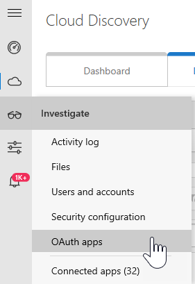
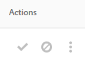
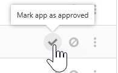
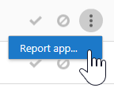
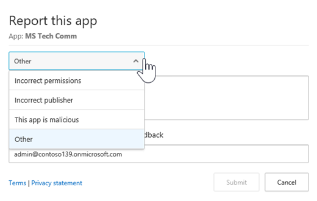
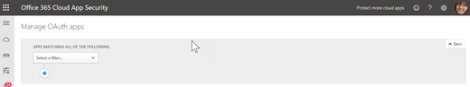
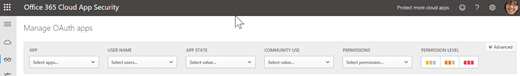

# Gérer les applications OAuth à l’aide de la sécurité des applications cloud Office 365

|Évaluation * *\>**|Planification * *\>**|Déploiement * *\>**|Utilisation * * * *|
|:-----|:-----|:-----|:-----|
|[Commencer l'évaluation](office-365-cas-overview.md)   |[Commencer la planification](get-ready-for-office-365-cas.md)   |[Démarrer le déploiement](turn-on-office-365-cas.md)   |Vous êtes là!    [Étapes suivantes](#next-steps)  |
   
Les personnes aiment les applications et elles les téléchargent souvent, en particulier les applications que les personnes pensent gagner du temps en facilitant l'accès à leurs informations professionnelles ou scolaires. Toutefois, certaines applications peuvent potentiellement présenter un risque de sécurité pour votre organisation, en fonction de leurs informations d'accès et de leur gestion. Avec la [sécurité des applications Cloud d'Office 365](office-365-cas-overview.md), si vous êtes un administrateur global ou de sécurité, vous pouvez gérer les applications OAuth pour votre organisation. Vous pouvez voir les applications que les utilisateurs utilisent avec les données Office 365, les autorisations de ces applications, et bien plus encore. 
  
Cet article explique où accéder à la rubrique gérer les applications OAuth, comment approuver, bloquer ou signaler une application, et comment créer une requête d'application.
  
## Comment trouver la page gérer les applications OAuth

> [!NOTE]
> Les applications OAuth sont gérées dans le portail de sécurité des applications Cloud Office 365. Vous devez être un administrateur général ou un administrateur de sécurité pour effectuer la tâche suivante. Pour plus d'informations [, consultez la rubrique autorisations dans &amp; le centre de sécurité conformité Office 365](permissions-in-the-security-and-compliance-center.md). 
  
1. Accédez au portail de sécurité des applications Cloud[https://portal.cloudappsecurity.com](https://portal.cloudappsecurity.com)() et connectez-vous.
  
2. Sélectionnez **examiner** \> les **applications OAuth**.  
  
## Ce que vous verrez dans la page gérer les applications OAuth

Le tableau suivant décrit les contrôles et les options disponibles dans la page gérer les applications OAuth.
  
|**Item**|**Description**|
|:-----|:-----|
|Icône de base dans la barre de requête de l'application    |Sélectionnez cette option pour basculer vers l'affichage avancé.    (Si vous voyez de **base**, vous utilisez l'affichage avancé)    |
|Icône avancé dans la barre de requête de l'application    |Sélectionnez cette option pour basculer vers l'affichage de base.    (Si vous voyez **avancé**, vous utilisez l'affichage de base.)    |
|Icône ouvrir ou fermer toutes les détails dans la liste des applications    |Sélectionnez cette icône pour afficher plus ou moins de détails sur chaque application.    |
|Icône exporter dans la liste des applications    |Sélectionnez cette icône pour exporter un fichier CSV contenant une liste d'applications, le nombre d'utilisateurs pour chaque application, les autorisations associées à l'application, le niveau d'autorisation, l'état de l'application et le niveau d'utilisation de la communauté.    |
|Nom    |Utilisez cette pour afficher le nom d'une application. Sélectionnez le nom pour afficher plus d'informations, telles que sa description, son éditeur, son site Web d'application et son ID d'application.    |
|Autorisé par    |Utilisez cette méthode pour voir le nombre d'utilisateurs qui ont autorisé une application à accéder à leur compte Office 365. Sélectionnez le numéro pour afficher plus d'informations, telles que la liste des comptes d'utilisateur.    |
|Niveau d'autorisation    |Utilisez cette méthode pour voir le niveau d'accès d'une application aux données Office 365. Les niveaux d'autorisation indiquent **faible**, **moyen**ou **élevé**, où **faible** peut indiquer que l'application accède uniquement au profil et au nom d'un utilisateur. Sélectionnez le niveau pour afficher plus d'informations, telles que les autorisations accordées à l'application, l'utilisation de la communauté et l'activité connexe dans le [Journal de gouvernance](suspend-or-restore-an-account-in-ocas.md).    |
|Dernière autorisation   |Utilisez cette pour afficher la date et l'heure auxquelles une application OAuth a été autorisée pour la dernière fois pour accéder aux données Office 365 de votre organisation.    |
|Actions   |Utilisez cette option pour afficher ou marquer une application comme approuvée ou interdite, signaler une application OAuth à Microsoft ou la laisser comme non déterminée.    |
   
## Marquer une application comme approuvée

Dans la page **gérer les applications OAuth** , recherchez l'application que vous souhaitez approuver, puis sélectionnez l'icône **marquer l'application comme approuvée** . 
  

  
L'icône devient verte et l'application est approuvée pour tous vos utilisateurs d'Office 365.
  
> [!NOTE]
> Lorsque vous marquez une application comme approuvée, il n'y a aucun effet sur l'utilisateur final. Le marquage visuel des applications approuvées permet de les séparer des applications qui n'ont pas encore été révisées. 
  
## Interdire une application

1. Dans la page **gérer les applications OAuth** , recherchez l'application que vous souhaitez interdire, puis sélectionnez l'icône **marquer l'application comme interdite** . 
  
2. Dans la boîte de message de notification, conservez le texte existant tel quel, ou personnalisez le texte. Indiquez si les utilisateurs doivent savoir que leur application a été interdite.   
  
3. Sélectionnez **interdire l'application**.

## Signaler une application OAuth à Microsoft

Si vous souhaitez soumettre une application OAuth à Microsoft pour analyse, vous pouvez signaler cette application.

1. Dans la page **gérer les applications OAuth** , recherchez l'application que vous souhaitez soumettre pour analyse.

2. Sélectionnez les points de suspension verticaux, puis choisissez **application de rapport...**.  

3. Dans la boîte de dialogue **signaler cette application** , utilisez la liste déroulante pour indiquer votre préoccupation. Par défaut, **cette application est malveillante** . Toutefois, vous pouvez choisir l'une des autres options disponibles.   

4. Recommandation Conservez l'option de contact que vous avez sélectionnée et confirmez (ou modifiez) l'adresse de messagerie indiquée.

5. Choose **Submit**. 
    
## Créer une requête d'application

Nous vous recommandons d'utiliser l'affichage avancé, qui se présente comme suit: 

Dans la barre de requête application, si vous voyez **avancé**, vous utilisez l'affichage de base. Cliquez (ou appuyez) sur **avancé** pour accéder à l'affichage avancé. 

    
1. Dans la barre de requête, sélectionnez une option dans la liste **Sélectionner une** liste de filtres. 
    - **Application** Applications portant certains noms
    - **État** de l'application Applications en fonction de leur état (approuvé, interdit ou indéterminé)
    - **Utilisation communautaire** Applications basées sur les niveaux d'utilisation de la Communauté (rare, rares ou communs)
    - **Niveau d'autorisation** Applications basées sur certains niveaux d'autorisation 
    - **Autorisations** Applications qui requièrent certaines autorisations
    - **Éditeur**  Applications de certains éditeurs
    - **User (utilisateur** ) Applications autorisées par un certain utilisateur
   
2. Sélectionnez **est égal** ou **** différent de, puis spécifiez une valeur pour votre filtre.
    
3. Pour ajouter des filtres supplémentaires, sélectionnez le signe plus (), puis répétez les étapes 2 et 3.
    
4. Pour supprimer un filtre, sélectionnez le x () en regard d'un nom de filtre.
    
Les filtres sont appliqués automatiquement et la liste applications est mise à jour en conséquence.
  
## Étapes suivantes

- [Passer en revue et effectuer une action sur les alertes](review-office-365-cas-alerts.md)
    
- Passez en revue les [journaux de trafic Web et les sources de données pour Office 365 Cloud App Security](web-traffic-logs-and-data-sources-for-ocas.md)
    
- Examiner vos [activités d'utilisation pour Office 365 Cloud App Security](utilization-activities-for-ocas.md)
    

