# Répondre aux exigences sur la protection des données et aux réglementations pendant l’utilisation des services de cloud computing Microsoft à l’aide du Gestionnaire de conformité

 *Le Gestionnaire de conformité n’est pas disponible dans Office 365 géré par 21Vianet, Office 365 Germany, Office 365 U.S. GCC High ou Office 365 Department of Defense.* 
  
Le gestionnaire de conformité est un outil d’évaluation des risques des flux de travail disponible dans le [Portail d’approbation de services de Microsoft](https://support.office.com/article/f30e2353-0bd6-41ed-8347-eea1fb8d2662). Il vous permet de suivre, d’affecter et de vérifier les activités de mise en conformité de votre organisation avec les réglementations liées aux services professionnels Microsoft et aux services de cloud computing Microsoft, tels que Microsoft Office 365, Microsoft Dynamics 365 et Microsoft Azure. 

Gestionnaire de conformité :
  
- Rassemble, d’une part, les informations détaillées fournies par Microsoft aux auditeurs et aux autorités de régulation dans le cadre des audits des services cloud de Microsoft menés par des tiers dans le but de vérifier le respect de différentes normes (par exemple, ISO 27001, ISO 27018 et NIST), et, d’autre part, les informations collectées en interne par Microsoft pour assurer sa conformité aux réglementations en vigueur (par exemple, la loi américaine HIPAA et le Règlement général sur la protection des données de l’UE, ou RGPD) en laissant votre organisation vérifier sa propre conformité avec ces normes et réglementations.
    
- Vous permet d’affecter, de suivre et d’enregistrer les activités de conformité et d’évaluation, pour aider vos équipes à contourner les obstacles à la réalisation des objectifs de conformité de votre organisation.
    
- Attribue un Score de conformité qui vous permet de suivre votre progression et de hiérarchiser les contrôles d’audit qui vous aideront à limiter les risques auxquels votre organisation s’expose.
    
- Vous offre un référentiel sécurisé pour charger et gérer les preuves et autres artefacts liés à vos activités de conformité.
    
- Génère des rapports détaillés dans Microsoft Excel qui documentent les activités de conformité effectuées par Microsoft et votre organisation, qui peuvent être fournis aux auditeurs, aux autorités de régulation et aux autres acteurs de la conformité.

Pour une brève démonstration du Gestionnaire de conformité, regardez cette vidéo [Gestionnaire de conformité](https://www.youtube.com/watch?v=r1vs8NdSXKQ).

    
> [!IMPORTANT]
> Le Gestionnaire de conformité est un tableau de bord qui vous donne un aperçu de votre situation en matière de protection des données et de conformité, ainsi que des recommandations pour l’améliorer. Les actions du client fournies dans le Gestionnaire de conformité sont des recommandations. Il appartient à chaque organisation d’évaluer l’efficacité de ces recommandations dans leur cadre réglementaire avant de les implémenter. Les recommandations figurant dans le Gestionnaire de conformité ne peuvent en aucun cas garantir le respect des réglementations en vigueur.

    
## Qu’est-ce que le Gestionnaire de conformité ?

Le Gestionnaire de conformité est un outil d’évaluation des risques des flux de travail conçu pour vous aider à gérer votre mise en conformité avec les réglementations dans le cadre du modèle de responsabilité partagée du cloud. Le Gestionnaire de conformité affiche sous forme de tableau de bord les normes, les réglementations et les évaluations qui contiennent des détails sur l’implémentation des contrôles Microsoft, les résultats de test, des conseils pour implémenter les contrôles du client et le numéro de suivi à saisir par votre organisation. Le Gestionnaire de conformité définit les contrôles d’évaluation des certifications, propose des conseils sur l’implémentation et le test des contrôles, attribue aux contrôles un score pondéré en fonction des risques, assure la gestion des accès en fonction des rôles et fournit un flux de travail d’affectation des actions de contrôle inaltérable pour suivre l’implémentation des contrôles, l’état des tests et la gestion des preuves. Le Gestionnaire de conformité optimise la charge de travail liée à la vérification de la conformité en permettant aux clients de regrouper de façon logique les évaluations et de tester les contrôles d’évaluation identiques ou associés, leur permettant ainsi de réduire les efforts déployés pour satisfaire plus efficacement aux exigences relatives aux contrôles identiques imposées par différentes certifications.

## Évaluations dans le Gestionnaire de conformité

L’*évaluation* est le composant majeur du Gestionnaire de conformité. Son rôle est d’évaluer un service Microsoft par rapport à une norme de certification ou à un règlement relatif à la protection des données (par exemple, la norme ISO 27001:2013 et le RGPD). Les évaluations vous aident à connaître la situation de votre organisation en matière de protection des données et de conformité par rapport à la norme industrielle sélectionnée pour le service cloud Microsoft sélectionné. Les évaluations sont terminées quand des contrôles renvoyant à la norme de certification évaluée sont implémentés. 
  
La structure d’une évaluation repose sur la responsabilité partagée entre Microsoft et votre organisation pour évaluer les risques de sécurité et de conformité dans le cloud et pour implémenter les dispositifs de protection des données établis par une norme de conformité, une norme de protection des données, une réglementation ou une loi.
  
Une évaluation est constituée de plusieurs composants :
  
- **Services inclus** : chaque évaluation concerne un ensemble spécifique de services Microsoft, qui sont répertoriés dans la section Services cloud inclus. 
    
- **Contrôles gérés par Microsoft** : pour chaque service cloud, Microsoft implémente et gère un ensemble de *contrôles* dans le cadre de la mise en conformité de Microsoft avec les différentes normes et réglementations en vigueur. Ces contrôles sont organisés en *familles de contrôle* qui respectent la structure de la certification ou réglementation correspondante à laquelle l’évaluation se conforme. Pour chaque contrôle géré par Microsoft, le Gestionnaire de conformité indique la façon dont Microsoft a implémenté le contrôle, ainsi que la façon dont cette implémentation a été testée et validée par un auditeur tiers indépendant et la date à laquelle elle a été effectuée. 
    
    Voici un exemple de trois contrôles gérés par Microsoft dans la famille de contrôles **Sécurité** extraits d’une évaluation d’Office 365 par rapport au RGPD. 

    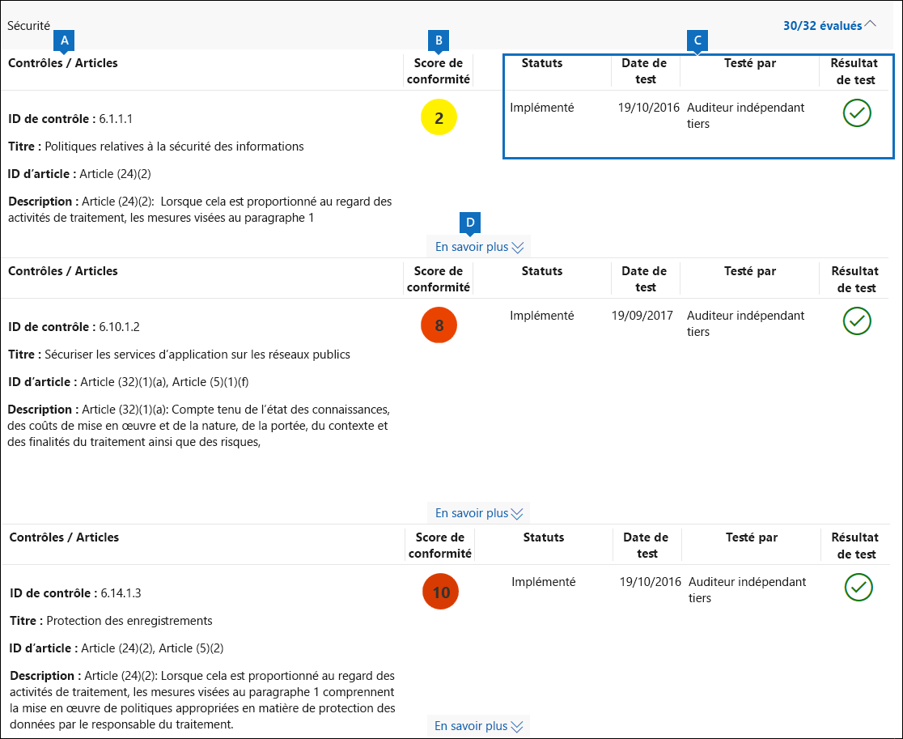
  
  a. Indique les informations extraites de la certification ou de la réglementation qui renvoie au contrôle géré par Microsoft.

  - **ID du contrôle** : numéro de la section ou de l’article extrait de la certification ou de la réglementation qui renvoie au contrôle.
    
  - **Titre** : titre de la certification ou de la réglementation correspondante.
    
  - **ID de l’article** : ce champ apparaît uniquement pour les évaluations du RGPD, car il indique le numéro de l’article du RGPD correspondant.
    
  - **Description** : texte de la norme ou de la réglementation qui renvoie au contrôle géré par Microsoft sélectionné.

  b. Score de conformité du contrôle, qui indique le niveau de risque (pour cause de non conformité ou de défaillance du contrôle) associé à chaque contrôle géré par Microsoft. Consultez la section [Présentation du Score de conformité](#understanding-the-compliance-score) pour obtenir de plus amples informations. Notez que les Scores de conformité sont compris entre 1 et 10 et répondent à un code couleur. Le jaune désigne des contrôles à faible risque, le orange désigne des contrôles à risque modéré et le rouge désigne des contrôles à risque élevé. 
    
  c. Informations sur l’état d’implémentation d’un contrôle, la date à laquelle le contrôle a été testé, la personne ayant effectué le test, et le résultat du test.
    
  d. Pour chaque contrôle, vous pouvez cliquer sur **Plus** pour afficher des informations supplémentaires, notamment des informations sur l’implémentation du contrôle de Microsoft et sur la façon dont le contrôle a été testé et validé par un auditeur tiers indépendant. 
    
- **Contrôles gérés par le client** : collection de contrôles gérés par votre organisation. Votre organisation est responsable de l’implémentation de ces contrôles dans le cadre de votre processus de mise en conformité avec une norme ou une réglementation donnée. Ces contrôles sont également organisés en familles pour la certification ou la réglementation correspondante. Utilisez ces contrôles pour implémenter les actions recommandées suggérées par Microsoft dans le cadre de vos activités de conformité. Votre organisation peut utiliser les conseils et les actions du client recommandées dans chaque contrôle pour gérer l’implémentation et l’évaluation de ce contrôle.
    
    Les contrôles gérés par le client dans les évaluations disposent également d’une fonctionnalité intégrée de gestion des flux de travail que vous pouvez utiliser pour gérer et suivre la progression de l’évaluation réalisée par votre organisation. Par exemple, un responsable de la mise en conformité de votre organisation peut affecter un élément d’action à un administrateur informatique qui a la responsabilité et les autorisations nécessaires pour effectuer les actions recommandées pour le contrôle. Une fois cette tâche terminée, l’administrateur informatique peut charger les preuves des tâches d’implémentation (par exemple, captures d’écran des paramètres de configuration ou de stratégie) puis réaffecter l’élément d’action au responsable de la mise en conformité pour qu’il évalue la preuve collectée, teste l’implémentation du contrôle et enregistre la date d’implémentation et les résultats de test dans le Gestionnaire de conformité. Pour en savoir plus, consultez la section [Gestion du processus d’évaluation](#managing-the-assessment-process) plus loin dans cet article. 
  
## Autorisations et contrôle d’accès en fonction du rôle

Par défaut, tous les membres de votre organisation ayant un compte Office 365 ou Azure AD ont accès au Gestionnaire de conformité et peuvent y effectuer des actions. Pour remplacer les autorisations par défaut par le modèle de contrôle d’accès en fonction du rôle, au moins un utilisateur doit être ajouté à chaque rôle du Gestionnaire de conformité (voir les instructions suivantes). Une fois qu’un utilisateur est ajouté à un rôle, les autorisations accordées pour effectuer les actions liées à ce rôle sont supprimées des autorisations accordées par défaut à tous les utilisateurs. Désormais, seuls les utilisateurs ayant obtenu ce rôle peuvent accéder au Gestionnaire de conformité et effectuer les actions autorisées par ce rôle.
  
Une fois l’accès en fonction du rôle implémenté, tous les utilisateurs qui ne sont pas affectés à un rôle défini du Gestionnaire de conformité peuvent y accéder en tant qu’invité.
  
> [!NOTE]
> Pour implémenter totalement le contrôle d’accès en fonction du rôle et gérer les utilisateurs autorisés à accéder et à effectuer des actions dans le Gestionnaire de conformité, un utilisateur doit être ajouté à chaque rôle pour que les autorisations par défaut puissent être modifiées. Par exemple, si vous ajoutez un utilisateur au rôle qui autorise les utilisateurs à gérer les évaluations, seuls les membres de ce rôle peuvent gérer les évaluations. De même, si vous n’ajoutez pas un utilisateur au rôle qui autorise les utilisateurs à lire les données des évaluations, tous les utilisateurs de votre organisation peuvent alors accéder au Gestionnaire de conformité et lire les données de n’importe quelle évaluation. 
  
Le tableau suivant décrit chaque autorisation du Gestionnaire de conformité et les actions que l’utilisateur peut effectuer. Le tableau indique également le rôle auquel chaque autorisation est affectée.
  
||**Lecteur du Gestionnaire de conformité**|**Contributeur du Gestionnaire de conformité**|**Évaluateur du Gestionnaire de conformité**|**Administrateur du Gestionnaire de conformité**|**Administrateur du Portail**|
|:-----|:-----|:-----|:-----|:-----|:-----|
|**Lire les données** : les utilisateurs peuvent consulter les données sans pouvoir les modifier.    |             |             |             |             |             |
|**Modifier les données** : les utilisateurs peuvent modifier tous les champs à l’exception des champs Résultat de test et Date du test.    ||             |             |             |             |
|**Modifier les résultats de test** : les utilisateurs peuvent modifier les champs Résultat de test et Date du test.    |||             |             |             |
|**Gérer les évaluations** : les utilisateurs peuvent créer, archiver et supprimer des évaluations.    ||||             |             |
|**Gérer les utilisateurs** : les utilisateurs peuvent ajouter d’autres utilisateurs de leur organisation aux rôles Lecteur, Contributeur, Évaluateur et Administrateur. Seuls les utilisateurs ayant le rôle Administrateur général dans votre organisation peuvent ajouter ou supprimer des utilisateurs du rôle Administrateur du Portail.    |||||             |
   
### Accès invité
  
Une fois le Gestionnaire de conformité configuré, tous les utilisateurs qui n’ont pas obtenu un rôle entre par défaut dans la catégorie **Accès invité** (vaut également pour n’importe quel compte extérieur à l’organisation, à l’instar des comptes Microsoft personnels). Les utilisateurs bénéficiant d’un accès invité ne peuvent ni accéder à toutes les fonctionnalités du Gestionnaire de conformité, ni consulter les données d’évaluation de la conformité de l’organisation. En revanche, ils peuvent utiliser le Gestionnaire de conformité pour afficher les rapports d’évaluation de la conformité de Microsoft et les documents d’approbation de services. Pour connaître les fonctionnalités accessibles et inaccessibles, consultez les images ci-dessous. Les fonctionnalités accessibles sont en bleu, les fonctionnalités inaccessibles sont en rouge. 
  
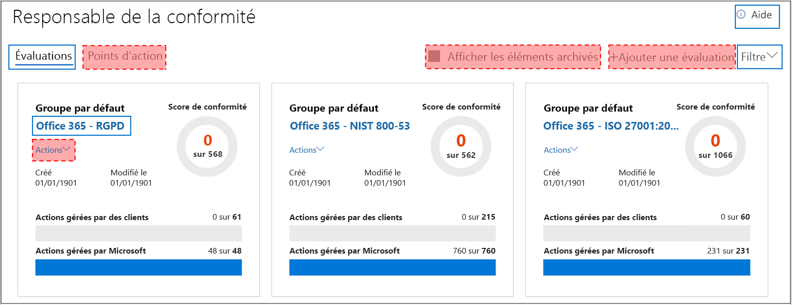
  
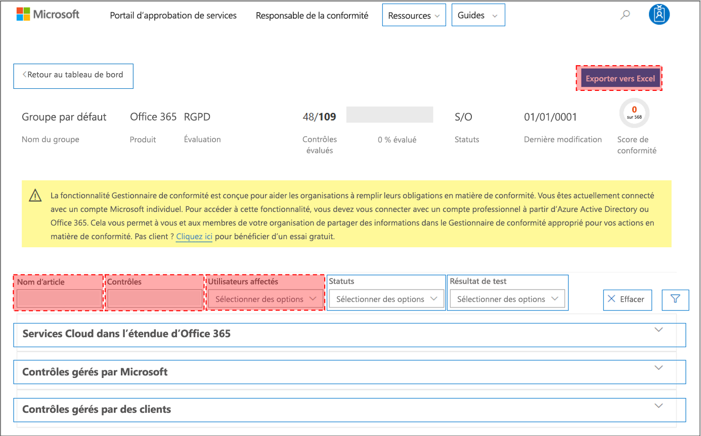

## Présentation du Score de conformité

Dans le tableau de bord, le gestionnaire de conformité affiche le score total des évaluations Office 365 dans le coin supérieur droit de la vignette. Il représente le score de conformité total de l’évaluation. Celui-ci correspond à une accumulation de points obtenus pour chaque évaluation de contrôle marquée comme étant Implémenté et Testé dans l’évaluation. Quand vous ajoutez une évaluation, le score de conformité affiché est supérieur à 0, car il prend en compte les points alloués aux contrôles gérés par Microsoft ayant été implémentés par Microsoft et testés par des tiers indépendants.
  
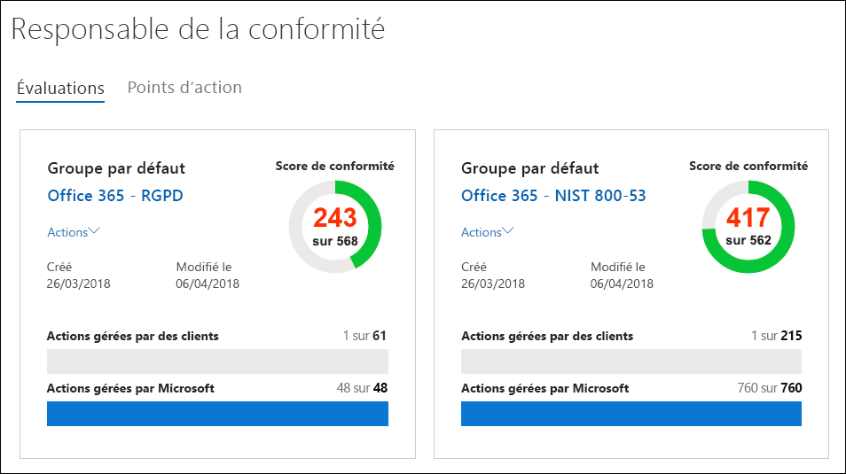
  
Les points restants proviennent de l’évaluation réussie du contrôle du client, à la suite de l’implémentation et du test des contrôles gérés par le client, chaque étape correspondant à une valeur spécifique qui s’ajoute au score de conformité global. 
  
Chaque évaluation affiche un Score de conformité basé sur les risques pour vous aider à évaluer le niveau de risque (pour cause de non conformité ou de défaillance d’un contrôle) associé à chaque contrôle (qu’il soit géré par Microsoft ou le client) d’une évaluation. Chaque contrôle géré par le client reçoit un certain nombre de points (classement selon la gravité) sur une échelle de 1 à 10 en fonction de la gravité du risque : plus le facteur de risque est élevé, plus le contrôle obtient de points. 
  
Par exemple, le contrôle d’évaluation Gestion de l’accès utilisateur illustré ci-dessous présente un risque très élevé et affiche une valeur de 10.
  
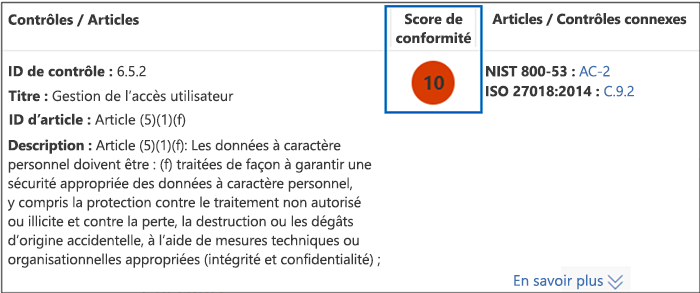
  
 En comparaison, le contrôle d’évaluation Sauvegarde des informations ci-dessous présente un risque plus faible et affiche une valeur de 3. 
  
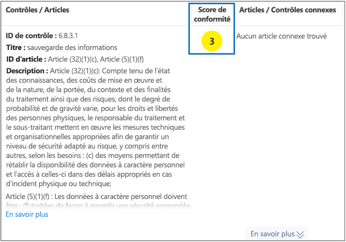
  
Le Gestionnaire de conformité affecte un degré de gravité par défaut à chaque contrôle. Le classement des risques est calculé selon les critères suivants :
  
- Si un contrôle évite des incidents (classement le plus élevé), détecte des incidents qui se sont produits ou corrige l’impact d’un incident (classement le plus faible). En termes de classement, un contrôle obligatoire qui prévient une menace obtient le nombre de points le plus élevé ; les contrôles de détection ou de correction (qu’ils soient obligatoires ou discrétionnaires) obtiennent le nombre de points le plus faible.
    
- Si un contrôle (une fois implémenté) est obligatoire et ne peut pas être contourné par les utilisateurs (par exemple, les utilisateurs devant réinitialiser leur mot de passe et respecter les caractères et longueur de mot de passe exigés), ou s’il est discrétionnaire et peut être contourné par les utilisateurs (par exemple, des règles métier qui obligent les utilisateurs à verrouiller leur écran quand leur ordinateur est laissé sans surveillance).
    
- Si les risques exposant la confidentialité, l’intégrité et la disponibilité des données proviennent de menaces internes ou externes et si la menace est malveillante ou accidentelle. Par exemple, les contrôles permettant d’empêcher une personne malveillante externe d’accéder indûment à ce réseau et aux informations d’identification personnelle obtiendraient plus de points qu’un contrôle empêchant un employé de mal configurer accidentellement un paramètre du routeur réseau qui pourrait entraîner une panne du réseau.
    
- Les risques liés à des facteurs juridiques externes, tels que les contrats, les réglementations et les engagements publics, de chaque contrôle.
    
Les valeurs affichées du Score de conformité du contrôle sont appliquées *intégralement* au Score de conformité total si le contrôle est implémenté et réussit le test d’évaluation qui suit. Aucun point n’est accordé pour une implémentation partielle. Les points accordés sont ajoutés au Score de conformité total seulement si l’**État d’implémentation** du contrôle est défini sur **Implémenté** ou **Implémentation alternative** et le **Résultat de test** est défini sur **Réussite**. 
  
De plus, le Score de conformité peut vous aider à hiérarchiser les contrôles à implémenter en priorité en indiquant les contrôles ayant un risque potentiel plus élevé en cas de problème lié à un contrôle. De plus, quand les contrôles d’évaluation sont associés à d’autres contrôles (soit dans la même évaluation, soit dans une autre évaluation du même regroupement), le succès de l’implémentation et du test d’un contrôle peut permettre de considérablement réduire les efforts liés à la synchronisation des résultats de test du contrôle.
  
Par exemple, dans l’image ci-dessous, l’évaluation GDPR-Office 365 est finalisée à 46 %, avec 51 contrôles sur 111 évalués et un score de conformité total de 289 sur un total possible de 600.
  

  
Dans l’évaluation GDPR ci-dessous, le contrôle 7.5.5 est associé à 5 autres contrôles (7.4.1, 7.4.3, 7.4.4, 7.4.8,.7.4.9 et 6) ayant une cote de risque modéré à élevé de 8 ou 8). Nous avons utilisé le filtre de l’évaluation pour sélectionner tous ces contrôles et les afficher. Nous pouvons alors voir qu’aucun d’entre eux n’a été évalué. 
  
 Si l’un de ces 6 contrôles est finalisé, les résultats de test seront synchronisés avec les contrôles associés de cette évaluation (tout comme n’importe quel contrôle d’une évaluation appartenant au même regroupement). À la fin de l’implémentation et du test du contrôle GDPR 7.5.5, la zone de détails du contrôle s’actualise et indique que les 6 contrôles ont été évalués, le nombre de contrôles évalués passant de 57 et 51 % et le Score de conformité total à + 40. 
  
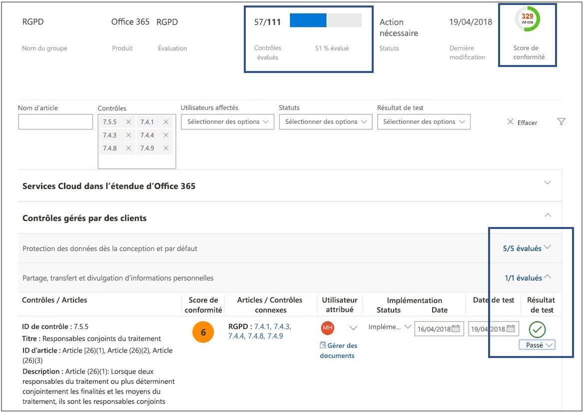
  
Cette boîte de dialogue de confirmation de mise à jour apparaît si vous êtes sur le point de modifier l’état d’implémentation d’un contrôle d’une manière qui influera sur les autres contrôles associés.
  
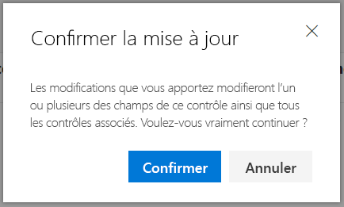
  
> [!NOTE]
> Pour l’instant, seules les évaluations des services cloud Office 365 affichent un Score de conformité. Les évaluations pour Azure et Dynamics indiquent seulement l’état de l’évaluation. 

## Méthodologie du Score de conformité

Le Score de conformité, à l’instar du Degré de sécurisation Microsoft, s’apparente à d’autres systèmes de notation basés sur le comportement ; l’activité de votre organisation peut augmenter son Score de conformité en effectuant des activités liées à la sécurité, la confidentialité et la protection des données.
  
> [!NOTE]
> Le Score de conformité ne reflète pas forcément la conformité absolue de l’organisation avec une norme ou une réglementation spécifique. Il indique les contrôles que vous avez adoptés pour réduire les risques liés à la protection des données personnelles. Aucun service ne peut garantir que vous êtes en conformité avec une norme ou une réglementation. Le Score de conformité ne doit donc en aucun cas être considéré comme une garantie du respect des réglementations en vigueur. 
  
Les évaluations dans le Gestionnaire de conformité sont basées sur le modèle de responsabilité partagée relatif au cloud computing. Dans le modèle de responsabilité partagée, Microsoft et le client sont chacun responsables de la protection des données du client quand celles-ci sont stockées dans notre cloud.
  
Comme illustré dans l’évaluation GDPR-Office 365 ci-dessous, Microsoft et les clients sont chacun responsables de prendre des mesures pour satisfaire aux exigences de la norme ou du règlement évalué. Pour rationaliser et comprendre les actions requises par différentes normes et réglementations, le Gestionnaire de conformité traite toutes les normes et réglementations comme s’il s’agissait de cadres de contrôle. Ainsi, les Actions effectuées par Microsoft et les clients pour chaque évaluation exigent l’implémentation et la validation de plusieurs contrôles.
  
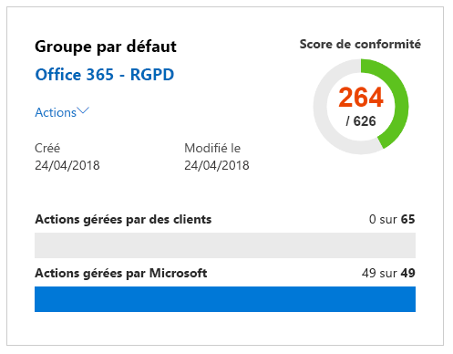
  
Voici le flux de travail standard d’une Action classique :
  
1. Le délégué à la protection des données, à la conformité, et/ou aux risques d’une organisation affecte la tâche à un membre de l’organisation pour qu’il implémente un contrôle. Cette personne peut être :

    - Le propriétaire d’une stratégie d’entreprise
    
    - Un ingénieur informatique
    
    - Une autre personne de l’organisation chargée d’accomplir cette tâche
    
2. Cet individu effectue les tâches nécessaires pour implémenter le contrôle, charge les preuves de l’implémentation dans le Gestionnaire de conformité et marque le ou les contrôles associé(s) à l’Action comme Implémenté. Une fois ces tâches terminées, il affecte l’Action à un évaluateur pour qu’elle soit validée. Les évaluateurs peuvent être :
    
    - Des évaluateurs internes qui valident les contrôles au sein d’une organisation
    
    - Des évaluateurs externes qui examinent, vérifient et certifient la conformité, telles que les organisations indépendantes tierces qui auditent les services de cloud computing Microsoft
    
3. L’évaluateur valide le contrôle et examine les preuves, puis il marque le ou les contrôles évalué(s) et les résultats de l’évaluation (par exemple, réussite).
    
Une fois que tous les contrôles associés à une évaluation ont été évalués, l’évaluation est considérée comme étant terminée.
  
Chaque évaluation figurant dans le Gestionnaire de conformité contient dès le départ des informations sur les Actions entreprises par Microsoft pour satisfaire aux exigences des contrôles dont Microsoft est responsable. Ces informations indiquent notamment la manière dont Microsoft a implémenté chaque contrôle, ainsi que la façon dont l’implémentation de Microsoft a été évaluée et vérifiée par un auditeur tiers et la date à laquelle elle a été effectuée. Pour cette raison, les contrôles gérés par Microsoft pour chaque évaluation sont marqués comme validés. Le Score de conformité de l’évaluation reflète ce résultat.
  
Chaque évaluation comprend un Score de conformité total basé sur le modèle de responsabilité partagée. L’implémentation et le test des contrôles réalisés par Microsoft pour Office 365 couvre une partie du total de points possible pouvant être attribués à une évaluation RGPD. À mesure que le client implémente et teste les actions du client, le Score de conformité de l’évaluation augmente selon la valeur affectée au contrôle. 
  
 ### Méthodologie du score basé sur les risques
  
Selon la méthodologie du Gestionnaire de conformité, le score basé sur le risque est compris entre 1 et 10. Une valeur plus élevée est attribuée aux contrôles qui présentent un risque plus élevé dans le cas où ils échoueraient ou ne seraient pas conformes. Le système de notation utilisé par le Score de conformité repose sur plusieurs facteurs clés, notamment :
  
- La nature du contrôle
    
- Le niveau de risque du contrôle selon les types de menace auxquelles il est exposé
    
- Les facteurs externes au contrôle
    
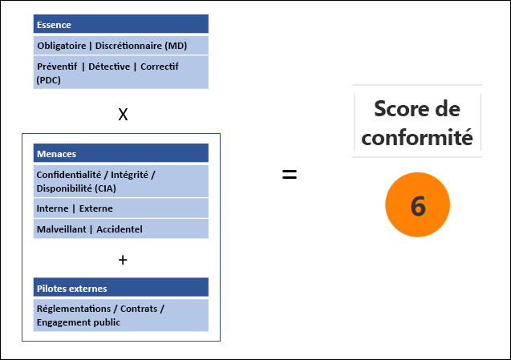
  
 ### Nature du contrôle
  
Un contrôle peut être Obligatoire ou Discrétionnaire, et Préventif, Détecteur ou Correctif.
  
 ### Obligatoire ou discrétionnaire
  
 Les *contrôles obligatoires* ne peuvent pas être contournés de façon intentionnelle ou accidentelle. Par exemple, une stratégie de mot de passe centralisée qui définit la longueur, la complexité et l’expiration requises du mot de passe. Les utilisateurs doivent respecter ces exigences pour accéder au système. 
  
 Les *contrôles discrétionnaires* s’appuient sur la compréhension et le respect des utilisateurs des règles métier. Par exemple, une politique qui exige des utilisateurs de verrouiller leur ordinateur quand ils le laissent sans surveillance est un contrôle discrétionnaire car il s’appuie sur l’utilisateur. 
  
 ### Préventif, détecteur ou correctif
  
 Les *contrôles préventifs* préviennent des risques spécifiques. Par exemple, la protection des informations au repos à l’aide du chiffrement est un contrôle préventif contre les attaques, les violations, etc. La séparation des tâches est un contrôle préventif pour gérer les conflits d’intérêt et lutter contre la fraude. 
  
 Les *contrôles détecteurs* surveillent activement les systèmes pour identifier les conditions ou les comportements irréguliers qui présentent un risque ou qui peuvent être utilisés pour détecter des intrusions ou déterminer s’il y a eu violation. L’audit des accès au système et des actions administratives privilégiées sont des types de contrôle de surveillance détecteurs ; les audits de conformité réglementaire sont un type de contrôle détecteur servant à détecter des problèmes liés aux processus. 
  
 Les *contrôles correctifs* essaient de limiter le nombre des effets secondaires d’un incident de sécurité, exécutent des actions correctives pour réduire l’effet immédiat et corriger les dommages créés, si possible. La réponse à un incident de confidentialité est un contrôle correctif qui limite les dommages et restaure les systèmes à l’état opérationnel en cas d’incident. 
  
En évaluant chaque contrôle à l’aide de ces facteurs, nous déterminons la nature du contrôle et lui attribuons une valeur par rapport au risque qu’il présente.
  
 **Menace**
  
||||
|:-----|:-----|:-----|
||**Obligatoire**   |**Discrétionnaire**   |
|**Préventif**   |Risque élevé    |Risque modéré    |
|**Détecteur**   |Risque modéré    |Risque faible    |
|**Correctif**   |Risque modéré    |Risque faible    |
   
Une menace désigne tout ce qui présente un risque pour la confidentialité, l’intégrité et la disponibilité des données, une norme de sécurité fondamentale universellement acceptée :
  
- La confidentialité signifie que les informations peuvent être lues et comprises uniquement par les personnes de confiance autorisées.
    
- L’intégrité signifie que les informations n’ont pas été modifiées ou détruites par des personnes non autorisées.
    
- La disponibilité signifie que les informations sont facilement accessibles selon un niveau de qualité de service élevé.
    
Tout manquement à l’une de ces caractéristiques est considéré comme une faille du système. Les menaces peuvent provenir de sources internes et externes, et l’intention du responsable peut être accidentelle ou malveillante. Ces facteurs sont estimés dans une matrice d’évaluation des menaces qui attribue des niveaux de menace Élevé, Modéré ou Faible à chaque scénario.

||**Interne** ||**Externe** ||||
|:-----|:-----|:-----|:-----|:-----|:-----|:-----|
||*Malveillant* |*Accidentel* |*Malveillant* |*Accidentel* |||
|**Confidentialité** |(E, M ou F)    |(E, M ou F)    |(E, M ou F)    |(E, M ou F)|
|**Intégrité** |(E, M ou F)    |(E, M ou F)    |(E, M ou F)    |(E, M ou F)|
|**Disponibilité** |(E, M ou F)    |(E, M ou F)    |(E, M ou F)    |(E, M ou F)|
   
 **Facteurs externes**
  
|**Contrats**|**Réglementations**|**Engagements publics**|
|:-----|:-----|:-----|
|(E, M ou F)    |(E, M ou F)    |(E, M ou F)    |
   
Les facteurs externes, tels que les réglementations en vigueur, les contrats et les engagements publics, peuvent influer sur les contrôles conçus pour protéger les données et prévenir les violations de données. Chacun de ces facteurs obtient une valeur de risque Élevé, Modéré ou Faible.
  
Le nombre estimé d’occurrences de ces valeurs de risque dans les 15 scénarios de risque possibles représentés dans les deux tableaux ci-dessus permet d’établir une pondération des risques, qui tient compte de l’importance de la probabilité et du nombre d’occurrences des risques à une valeur donnée, et qui est pris en compte dans le calcul du classement du contrôle selon sa gravité.
  
En fonction de la gravité du contrôle, le contrôle obtient un score de conformité, compris entre 1 (minimum) et 10 (maximum), selon le classement suivant :
  
|**Niveau de risque**|**Score du contrôle**|
|:-----|:-----|
|Faible    |1-3    |
|Modéré    |6    |
|Élevé    |8    |
|Grave    |10    |
   
En hiérarchisant les contrôles d’évaluation selon la valeur du score de conformité, l’organisation peut se concentrer sur les éléments qui présentent le risque le plus élevé. Ainsi, plus de points sont ajoutés au score de conformité total de l’évaluation pour chaque évaluation de contrôle terminée.
  
### Résumé de la méthodologie de notation
  
Le Score de conformité est un composant majeur du Gestionnaire de conformité qui permet aux organisations de comprendre et de gérer leur conformité. Le Score de conformité d’une évaluation reflète la conformité de l’entreprise avec une norme ou un règlement donné. Plus le score est élevé (jusqu’au nombre maximal de points alloué pour l’évaluation), plus l’entreprise est en conformité avec cette norme ou ce règlement. Il est essentiel pour les organisations de bien comprendre la méthodologie de notation de la conformité pour pouvoir hiérarchiser leurs actions. Pour la résumer, les contrôles d’évaluation obtiennent des notes comprises entre 1 et 10 selon la gravité du risque (faible à élevé) et les évaluations des contrôles terminées augmentent le score de conformité total.

## Regroupement des évaluations

Lorsque vous créez une analyse, vous êtes invité à créer un groupe auquel attribuer l’analyse ou à attribuer cette dernière à un groupe existant. Les groupes vous permettent d’organiser logiquement les analyses et de partager des informations courantes ainsi que des tâches de flux de travail entre les analyses dotées de contrôles gérés par le client similaires ou associés.
  
Par exemple, vous pouvez regrouper les évaluations par année ou par équipe, service ou organisme au sein de votre organisation. Voici quelques exemples de groupe et d’évaluation qu’ils peuvent contenir.
  
- Évaluations RGPD – 2018
    
  - Office 365 + RGPD
    
  - Azure + RGPD
    
  - Dynamics + RGPD
    
- Évaluations Azure – 2018
    
  - Azure + RGPD
    
  - Azure + ISO 27001:2013
    
  - Azure + ISO 27018:2014
    
- Évaluations de confidentialité et de sécurité des données
    
  - Office 365 + ISO 27001:2013
    
  - Office 365 + ISO 27018:2014
    
  - Azure + ISO 27001:2013
    
  - Azure + ISO 27018:2014
    
> [!TIP]
> Nous vous recommandons de déterminer une stratégie de regroupement pour votre organisation avant d’ajouter de nouvelles évaluations. 
  
Voici les conditions requises pour regrouper des évaluations :
  
- Le nom de chaque groupe (également appelé ID de groupe) doit être unique au sein de votre organisation. 
    
- Les groupes peuvent contenir des évaluations pour la même certification/réglementation, mais chaque groupe peut contenir une seule évaluation pour une paire service cloud/certification spécifique. Par exemple, un groupe ne peut pas contenir deux évaluations pour Office 365 et le RGPD. De même, un groupe peut contenir plusieurs évaluations pour le même service cloud à condition que la certification/réglementation correspondante soit différente pour chacune d’entre elles.
    
Une fois qu’une analyse a été ajoutée à un groupe d’analyses, il n’est plus possible de modifier celui-ci. Vous pouvez renommer le groupe d’analyses, ce qui a pour effet de modifier son nom pour toutes les analyses qui y sont associées. Vous pouvez créer une analyse et nouveau groupe d’analyses, puis copier les informations d’une analyse existante, ce qui a pour effet de créer une copie de cette analyse dans un autre groupe d’analyses. L’archivage d’une analyse rompt la relation entre cette analyse et le groupe d’analyse. Les mises à jour apportées aux autres analyses associées ne sont plus répercutées dans l’analyse archivée.
  
Comme expliqué précédemment, l’utilisation de groupes lorsque deux analyses du même groupe partagent le même contrôle géré par le client (et dès lors, les actions du client sont les mêmes pour chaque contrôle) présente l’avantage de synchroniser les détails de mise en œuvre, les informations de test et l’état du contrôle dans une analyse avec le même contrôle dans toute autre analyse du groupe. En d’autres termes, si des analyses partagent le même contrôle et que ces analyses appartiennent au même groupe, vous pouvez gérer le processus d’analyse du contrôle dans une même analyse. Les résultats de ce contrôle sont automatiquement synchronisés avec d’autres analyses. Par exemple, ISO 27001 et ISO 27018 possèdent un contrôle associé aux stratégies de mot de passe. Si le paramètre État du test correspondant au contrôle est défini sur « Réussi » dans une analyse, le contrôle est mis à jour (et marqué comme « Réussi ») dans l’autre analyse, tant que les deux analyses font partie du même groupe d’analyses.
  
À titre d’exemple, considérons ces deux contrôles d’analyse connexes ayant trait au chiffrement de données sur des réseaux publics, à savoir le contrôle 6.10.1.2 dans l’analyse Office 365 - RGPD et le contrôle SC-13 dans Office 365 - NIST 800- 53. Il s’agit de contrôles d’analyse connexes, dans deux analyses différentes faisant partie du groupe par défaut.  Dans un premier temps, aucune analyse n’a porté sur le contrôle du client, comme le montre le tableau de bord du Gestionnaire de conformité présentant ces deux analyses.
  

  
En cliquant sur l’évaluation **Office 365-GDPR**, et en utilisant les contrôles de filtre pour afficher le contrôle GDPR 6.10.1.2, nous pouvons voir que le contrôle NIST 800-53 SC-13 est répertorié dans la liste des contrôles associés.
  

  
 Vous pouvez voir ci-dessous que l’implémentation et le test du contrôle GDPR 6.10.1.2 sont terminés. 
  
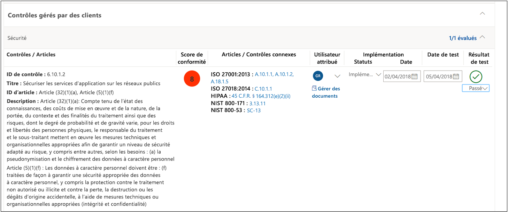
  
En accédant au contrôle associé de l’évaluation groupée, nous pouvons voir que le contrôle NIST 800-53 SC-13 a également été marqué comme terminé à la même date et à la même heure, alors qu’aucun effort n’a été déployé pour réaliser l’implémentation et le test de ce contrôle.
  
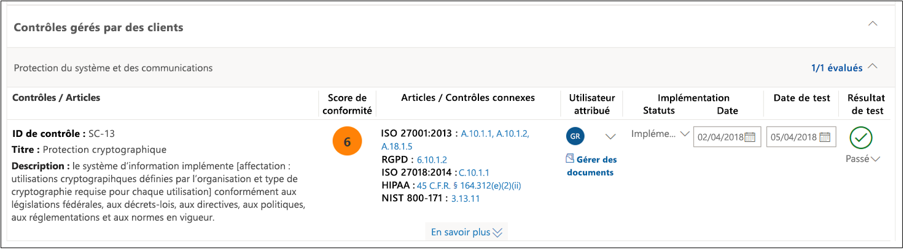
  
Dans le tableau de bord, nous pouvons voir que chaque évaluation comporte une évaluation de contrôle terminée et que le Score de conformité total de chaque évaluation a augmenté de 8 points (valeur du score de conformité de ce contrôle partagé).
  
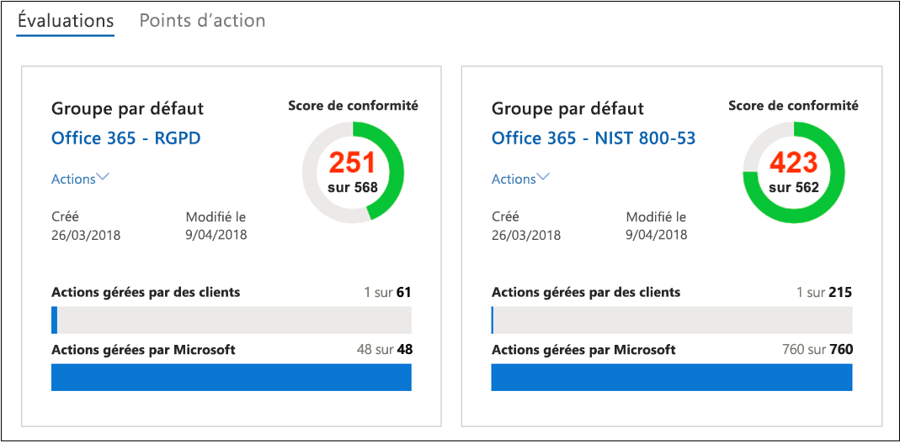

## Fonctions d’administration

Certaines fonctions d’administration spécifiques sont uniquement disponibles dans le compte Administrateur client et visibles seulement si vous êtes connecté en tant qu’administrateur général.
  
> [!NOTE]
> L’autorisation Accès aux documents restreints figurant dans la liste déroulante permet aux administrateurs d’autoriser les utilisateurs à accéder à des documents restreints partagés par Microsoft sur le Portail d’approbation de services. La fonctionnalité Documents restreints sera bientôt disponible. 
  
### Affectation des rôles du Gestionnaire de conformité aux utilisateurs

Chaque rôle du Gestionnaire de conformité bénéficie d’autorisations légèrement différentes. Vous pouvez consulter les autorisations affectées à chaque rôle, connaître les utilisateurs affectés aux rôles et ajouter ou supprimer des utilisateurs d’un rôle via le Portail d’approbation de services en sélectionnant **Administrateur** dans le menu, puis **Paramètres**. 
  
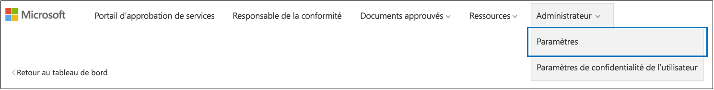
  
Pour ajouter ou supprimer des utilisateurs des rôles du Gestionnaire de conformité.
  
1. Accédez à [https://servicetrust.microsoft.com](https://servicetrust.microsoft.com).
    
2. Connectez-vous avec votre compte Administrateur général Azure Active Directory.
    
3. Dans la barre de menus supérieure du Portail d’approbation de services, cliquez sur **Administrateur**, puis **Paramètres**. 
    
4. Dans la liste déroulante **Sélectionner un rôle**, cliquez sur le rôle à gérer. 
    
5. Les utilisateurs ajoutés à chaque rôle figurent sur la page **Sélectionner un rôle**. 
    
6. Pour ajouter des utilisateurs à ce rôle, cliquez sur **Ajouter**. Dans la boîte de dialogue **Ajouter des utilisateurs**, cliquez sur le champ utilisateur. Vous pouvez parcourir la liste des utilisateurs disponibles ou saisir le nom de l’utilisateur pour filtrer la liste selon votre recherche. Cliquez sur l’utilisateur pour ajouter ce compte à la liste **Ajouter des utilisateurs** et lui affecter ce rôle. Pour ajouter plusieurs utilisateurs simultanément, commencez à saisir un nom d’utilisateur pour filtrer la liste, puis cliquez sur l’utilisateur à ajouter à la liste. Cliquez sur **Enregistrer** pour affecter le rôle sélectionné à ces utilisateurs. 
    
    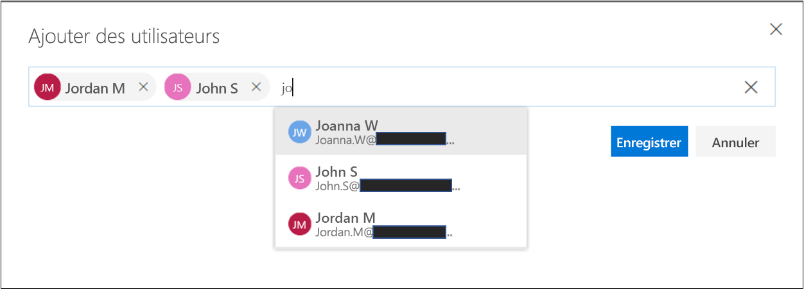
  
7. Pour supprimer des utilisateurs de ce rôle, sélectionnez le ou les utilisateurs, puis cliquez sur **Supprimer**. 
    
    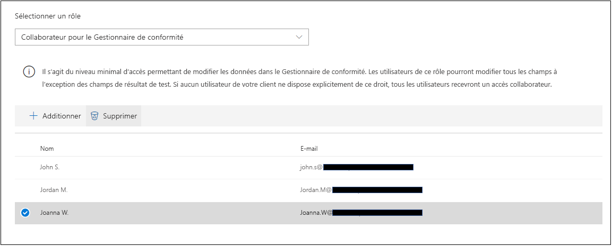
 
## Paramètres de confidentialité de l’utilisateur

Certaines réglementations exigent que les organisations soient en mesure de supprimer les données de l’historique d’un utilisateur. Pour activer cette option, le Gestionnaire de conformité propose les fonctions **Paramètres de confidentialité de l’utilisateur**, qui permettent aux administrateurs d’effectuer les actions suivantes : 
  
- [Rechercher un utilisateur](#search-for-a-user)

- [Exporter le rapport de l’historique des données d’un compte](#export-a-report-of-account-data-history)

- [Réaffecter des éléments d’action](#reassign-action-items)

- [Supprimer l’historique des données d’un utilisateur](#delete-user-data-history)
    
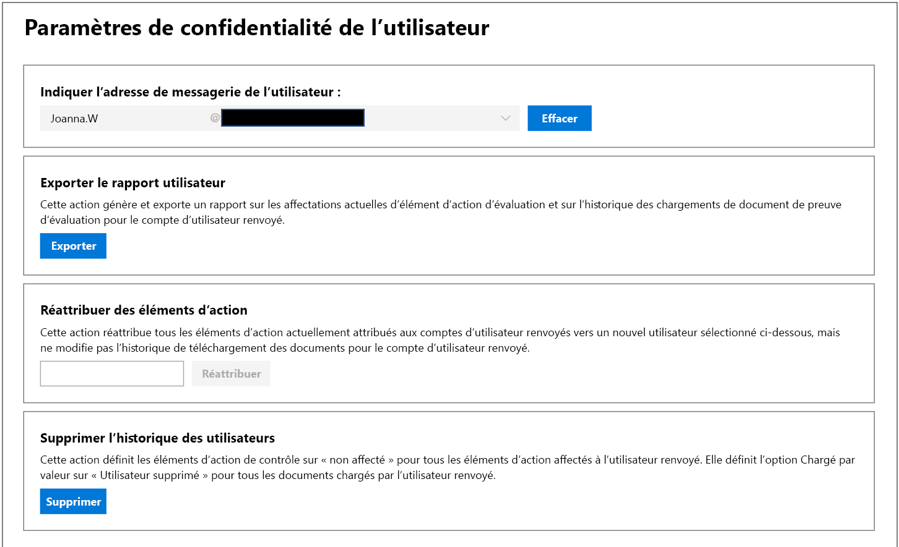
  
### Rechercher un utilisateur

Pour rechercher un compte d’utilisateur :
  
1. Entrez l’adresse e-mail de l’utilisateur en saisissant l’alias (informations situées à gauche du symbole @), puis choisissez le nom de domaine en cliquant sur la liste des suffixes de domaine à droite. S’il s’agit d’un client comportant plusieurs domaines inscrits, vous pouvez revérifier le suffixe du nom de domaine de l’adresse e-mail pour vous assurer qu’il est correct.
    
2. Une fois que le nom d’utilisateur est correctement entré, cliquez sur **Rechercher**. 
    
3. Si le compte d’utilisateur est introuvable, le message d’erreur « Utilisateur introuvable » s’affiche sur la page. Vérifiez les informations de l’adresse e-mail de l’utilisateur, corrigez si nécessaire et cliquez sur **Rechercher** pour réessayer. 
    
4. Si le compte d’utilisateur est trouvé, le texte du bouton n’affichera plus **Rechercher** mais **Effacer**, ce qui indique que le compte d’utilisateur renvoyé peut utiliser les autres fonctions qui seront affichées ci-dessous, et que l’exécution de ces fonctions sera rattachée à ce compte d’utilisateur. 
    
5. Pour effacer les résultats de la recherche et rechercher un autre utilisateur, cliquez sur **Effacer**. 
    
### Exporter le rapport de l’historique des données d’un compte

Une fois le compte d’utilisateur identifié, vous pouvez générer un rapport sur les dépendances liées à ce compte. Cette information vous permettra de réattribuer des éléments d’action ouverts ou de garantir l’accès aux preuves précédemment chargées. 
  
 Pour générer et exporter un rapport :
  
1. Cliquez sur **Exporter** pour générer et télécharger un rapport sur les éléments d’action de contrôle du Gestionnaire de conformité actuellement attribués au compte d’utilisateur renvoyé, ainsi que la liste des documents chargés par cet utilisateur. En l’absence d’actions attribuées ou de documents chargés, un message d’erreur indique « Aucune données pour cet utilisateur ». 
    
2. Le rapport est téléchargé en arrière-plan de la fenêtre active du navigateur. Si aucune fenêtre de téléchargement n’apparaît, vérifiez l’historique de téléchargement de votre navigateur.
    
3. Ouvrez le document pour consulter les données du rapport.
    
> [!NOTE]
> Il ne s’agit pas d’un rapport historique qui consigne et présente les changements d’état de l’historique d’affectation des éléments d’action. Le rapport généré est une capture instantanée des éléments d’action du contrôle affectés pendant l’exécution du rapport (horodateur indiqué dans le rapport). Par exemple, toute réaffectation des éléments d’action générera une autre capture instantanée des données du rapport si ce rapport est généré une nouvelle fois pour le même utilisateur. 
  
### Réaffecter des éléments d’action

Cette fonction permet aux organisations de supprimer des dépendances actives ou en attente du compte d’utilisateur en réaffectant à un nouvel utilisateur sélectionné les éléments d’action (actifs et terminés) du compte d’utilisateur renvoyé. Cette action ne modifie pas l’historique de chargement des documents pour le compte d’utilisateur renvoyé. 
  
 Pour réaffecter des éléments d’action à un autre utilisateur :
  
1. Cliquez sur la zone d’entrée à rechercher et sélectionner un autre utilisateur de l’organisation auquel les éléments d’action de l’utilisateur renvoyé doivent être affectés.
    
2. Sélectionnez **Remplacer** pour réaffecter au nouvel utilisateur sélectionné tous les éléments d’action du contrôle de l’utilisateur renvoyé. 
    
3. Une boîte de dialogue de confirmation affiche le message suivant : « Tous les éléments d’action de contrôle de l’utilisateur actuel seront réattribués à l’utilisateur sélectionné. Cette action ne peut pas être annulée. Voulez-vous vraiment continuer ? »
    
4. Pour continuer, cliquez sur **OK**, sinon cliquez sur **Annuler**. 
    
> [!NOTE]
> Tous les éléments d’action (actifs et terminés) sont affectés au nouvel utilisateur sélectionné. Toutefois, cette action n’affecte pas l’historique de chargement des documents ; tous les documents chargés par l’utilisateur précédemment affecté continuent d’afficher la date/l’heure et le nom de l’utilisateur précédemment affecté. 
  
Pour supprimer l’utilisateur précédemment affecté, il faut modifier l’historique de chargement des documents manuellement. Dans ce cas, l’administrateur doit :
  
1. Ouvrir le rapport d’exportation précédemment téléchargé.
  
2. Identifier l’élément d’action du contrôle souhaité et y accéder.
  
3. Cliquez sur **Gérer les documents** pour accéder au référentiel de preuves de ce contrôle. 
  
4. Télécharger le document.
  
5. Supprimer le document dans le référentiel de preuves.
  
6. Recharger le document. Le document indiquera alors de nouvelles date et heure de chargement, ainsi qu’un nouveau nom d’utilisateur à côté de « Chargé par ». 
  
### Supprimer l’historique des données d’un utilisateur

Cette fonction définit tous les éléments d’action du contrôle affectés à l’utilisateur renvoyé sur « Non affecté ». Elle définit également la valeur « Chargé par » sur « Utilisateur supprimé » pour tous les documents chargés par l’utilisateur renvoyé.
  
 Pour supprimer un élément d’action du compte d’utilisateur et l’historique de chargement des documents :
  
1. Cliquez sur **Supprimer**. 

    Une boîte de dialogue de confirmation apparaît, indiquant « Cette action supprime tous les éléments d’action du contrôle affectés et l’histoire de chargement des documents pour l’utilisateur sélectionné. Cette action ne peut pas être annulée. Voulez-vous vraiment continuer ? »
    
3. Pour continuer, cliquez sur **OK**, sinon cliquez sur **Annuler**. 
  
## Utilisation du Gestionnaire de conformité

Le Gestionnaire de conformité propose des outils qui vous permettent d’affecter, de suivre et d’enregistrer les activités de conformité et d’évaluation, et aident vos équipes à atteindre les objectifs de conformité de votre organisation.
  
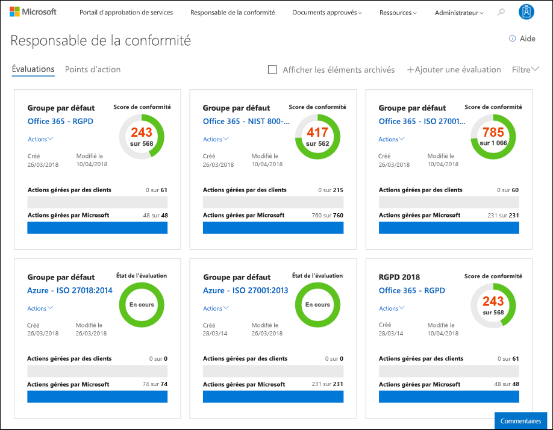

## Accès au Gestionnaire de conformité

Le Gestionnaire de conformité est accessible depuis le Portail d’approbation de services. Toute personne ayant un compte Microsoft ou un compte professionnel Azure Active Directory peut accéder au Gestionnaire de conformité.
  

  
1. Accédez à [https://servicetrust.microsoft.com](https://servicetrust.microsoft.com/).
    
2. Connectez-vous avec votre compte Azure Active Directory (Azure AD).
    
3. Dans le Portail d’approbation de services, cliquez sur **Gestionnaire de conformité**. 
    
4. Une fois le contrat de confidentialité affiché, lisez-le, puis cliquez sur **J’accepte** pour continuer. Vous n’aurez à le faire qu’une seule fois. Le tableau de bord du Gestionnaire de conformité s’affiche. 

    Pour vous aider à prendre en main le Gestionnaire de conformité, nous avons ajouté les évaluations par défaut suivantes :
    
    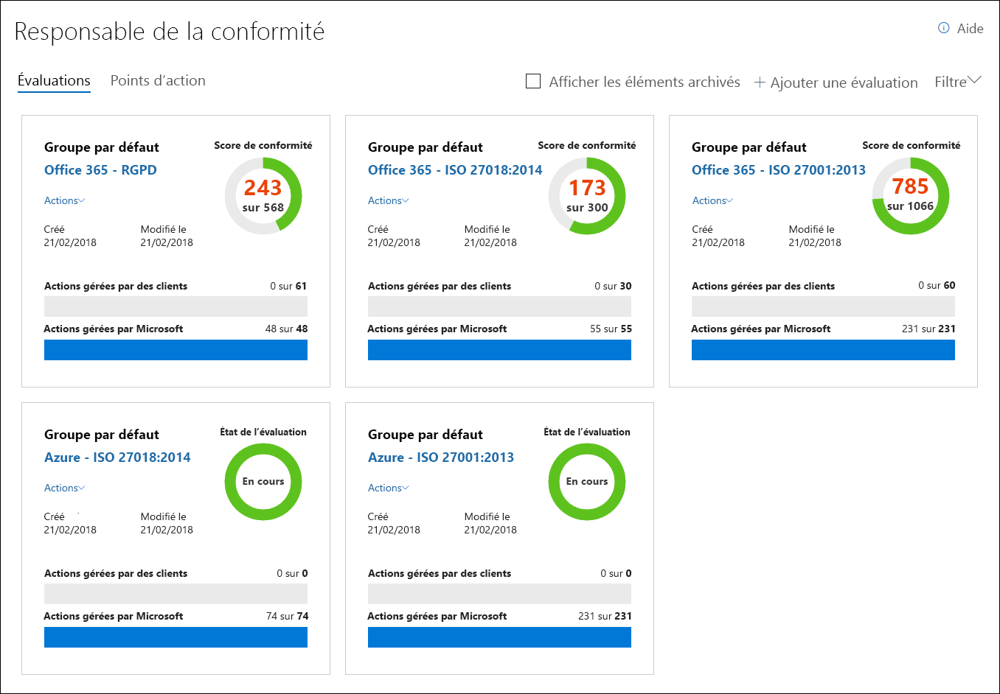
    
5. Cliquez sur  **Aide** pour suivre une présentation rapide du Gestionnaire de conformité. 
  
## Affichage des éléments d’action

Le Gestionnaire de conformité fournit une vue pratique de tous les points d’action d’analyse de contrôle qui vous sont attribués, ce qui vous permet d’agir rapidement et facilement sur ceux-ci. Vous pouvez afficher tous les points d’action ou sélectionner ceux qui correspondent à une certification spécifique en cliquant sur l’onglet associé à cette analyse. Par exemple, dans l’image ci-dessous, l’onglet RGPD sélectionné présente les contrôles liés à l’analyse RGPD.
  
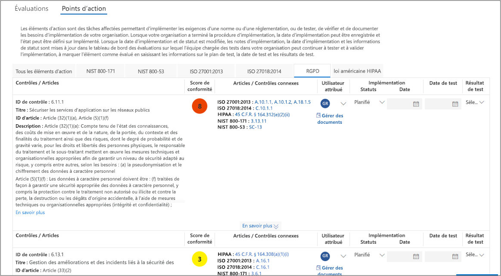
  
Pour afficher vos éléments d’action :
  
1. Accédez au tableau de bord du Gestionnaire de conformité
    
2. Cliquez sur le lien **Éléments d’action**. La page s’actualise pour afficher les éléments d’action qui vous ont été affectés. 
    
    Par défaut, tous les éléments d’action sont affichés. Si vous avez des éléments d’action dans plusieurs certifications, les noms des certifications sont répertoriés dans les onglets situés au-dessus du contrôle d’évaluation. Pour afficher les éléments d’action d’une certification spécifique, cliquez sur cet onglet.

## Ajout d’une évaluation

Pour ajouter une évaluation au Gestionnaire de conformité :
  
1. Dans le tableau de bord du Gestionnaire de conformité, cliquez sur  **Ajouter une évaluation**. 
    
2. Dans la fenêtre **Ajouter une évaluation**, vous pouvez créer un groupe auquel ajouter l’évaluation ou vous pouvez l’ajouter à un groupe existant (le groupe intégré est intitulé « Groupe initial »). Selon l’option choisie, soit vous tapez le nom d’un nouveau groupe, soit vous sélectionnez un groupe existant dans la liste déroulante. Pour en savoir plus, consultez la section [Regroupement des évaluations](#grouping-assessments).
    
    Si vous créez un groupe, vous avez également la possibilité de copier les informations d’un groupe existant vers la nouvelle analyse. Ainsi, les informations ajoutées dans les champs Détails de mise en œuvre, Plan du test et Réponse de gestion des contrôles gérés par le client des analyses du groupe à partir duquel vous effectuez la copie sont copiées vers les mêmes contrôles gérés par le client (ou associés) dans la nouvelle analyse. Si vous ajoutez une nouvelle analyse à un groupe existant, les informations courantes des analyses de ce groupe sont copiées vers la nouvelle analyse. Pour plus d’informations, voir [Copie d’informations à partir d’analyse existantes](#copying-information-from-existing-assessments).
    
3. Cliquez sur **Suivant**, puis :
    
    a. Sélectionnez un service de cloud computing Microsoft à des fins d’analyse de la conformité dans la liste déroulante **Sélectionner un produit**. 
    
    b. Sélectionnez une certification pour analyser le service de cloud computing dans la liste déroulante **Sélectionner une certification**. 
    
4. Cliquez sur **Ajouter au tableau de bord** pour créer l’évaluation. L’évaluation est ajoutée au tableau de bord du Gestionnaire de conformité dans une nouvelle vignette à la fin de la liste des vignettes existantes. 
    
    La **vignette de l’évaluation** dans le tableau de bord du Gestionnaire de conformité affiche le regroupement d’évaluations, le nom de l’évaluation (créé automatiquement en combinant le nom du service et la certification sélectionnée), la date de création et la date de dernière modification, le Score de conformité total (somme de toutes les valeurs de risque du contrôle affecté qui ont été implémentées, testées et réussies), et les indicateurs de progression qui indiquent le nombre de contrôles évalués. 
    
5. Cliquez sur le nom de l’évaluation pour l’ouvrir et afficher les détails de l’évaluation.
    
6. Cliquez sur le menu **Actions** pour consulter les éléments d’action affectés, renommer le groupe d’évaluations, exporter le rapport d’évaluation ou archiver l’évaluation. 
    
    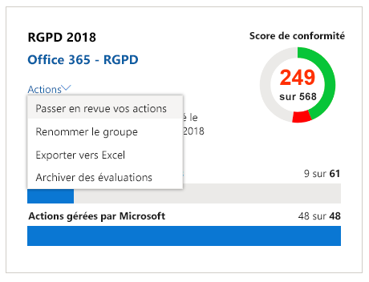

## Copie des informations des évaluations existantes

Comme indiqué précédemment, lorsque vous créez un groupe d’analyses, vous avez la possibilité de copier les informations des analyses d’un groupe existant vers la nouvelle analyse du nouveau groupe. Vous pouvez ainsi appliquer l’analyse et le processus de test effectués pour les mêmes contrôles gérés par le client à la nouvelle analyse. Par exemple, si vous disposez d’un groupe pour toutes les analyses RGPD associées au sein de votre organisation, vous pouvez copier les informations courantes d’une analyse existante lorsque vous ajoutez une nouvelle analyse au groupe.
  
Vous pouvez copier les informations suivantes d’un contrôle géré par le client dans une nouvelle évaluation :
  
- Utilisateurs de l’évaluation. Il s’agit des personnes auxquelles le contrôle est affecté.
    
- État, Date du test et Résultats de test.
    
- Informations sur les détails de l’implémentation et le plan de test.
    
De même, les informations issues des contrôles gérés par le client partagés dans le même groupe d’analyses sont synchronisées. Les informations issues des contrôles gérés par le client associés dans la même analyse sont également synchronisées.

## Affichage des évaluations

1. Localisez la vignette de l’évaluation que vous souhaitez consulter, puis cliquez sur le nom de l’évaluation pour l’ouvrir et afficher les contrôles gérés par Microsoft et le client associés à l’évaluation, ainsi que la liste des services cloud inclus dans l’évaluation.  Voici un exemple d’évaluation liée à Office 365 et au RGPD.
    
    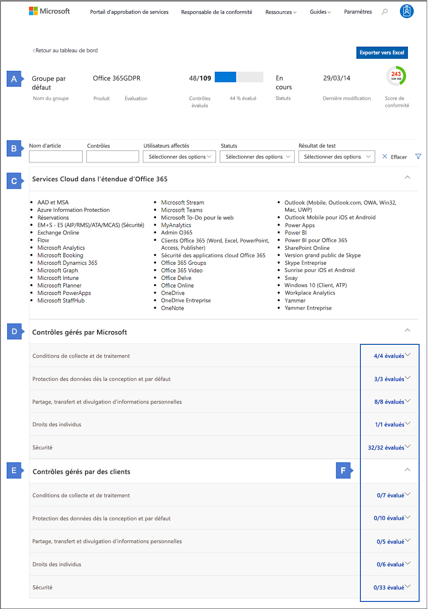
  
1. Cette section présente les informations récapitulatives de l’évaluation, notamment le nom du regroupement d’évaluations, le produit, le nom de l’évaluation et le nombre de contrôles évalués.
    
2. Cette section affiche les contrôles de filtre de l’évaluation. Pour savoir comment utiliser ces contrôles, consultez la section [Gestion du processus d’évaluation](#managing-the-assessment-process). 
    
3. Cette section affiche les services cloud inclus dans l’évaluation.
    
4. Cette section contient les contrôles gérés par Microsoft. Les contrôles associés sont organisés par famille de contrôles. Cliquez sur une famille de contrôles pour la développer et afficher les contrôles individuels.
    
5. Cette section contient les contrôles gérés par le client, qui sont également organisés par famille de contrôles. Cliquez sur une famille de contrôles pour la développer et afficher les contrôles individuels.
    
6. Affiche le nombre total de contrôles de la famille de contrôles ainsi que le nombre de contrôles analysés. Le suivi de la progression de votre organisation en matière d’analyse des contrôles gérés par le client constitue une fonctionnalité clé du Gestionnaire de conformité. Pour plus d’informations, voir [Compréhension du score de conformité](#understanding-the-compliance-score). 

## Gestion du processus d’évaluation

Le créateur d’une analyse est dans un premier temps le seul utilisateur de l’analyse. Pour chaque contrôle géré par le client, vous pouvez attribuer un élément d’action à une membre de votre organisation pour permettre à ce membre de devenir utilisateur de l’analyse, d’effectuer les actions du client recommandées, de collecter et de charger des preuves. Lorsque vous attribuez un élément d’action, vous pouvez choisir d’envoyer un e-mail contenant les détails à une personne, notamment les actions du client recommandées ainsi que l’élément d’action prioritaire. La notification par e-mail comprend un lien vers le tableau de bord **Éléments d’action**, qui répertorie tous les éléments d’action attribués à cette personne. 
  
Voici une liste des tâches que vous pouvez effectuer à l’aide des fonctionnalités de flux de travail du Gestionnaire de conformité.
  
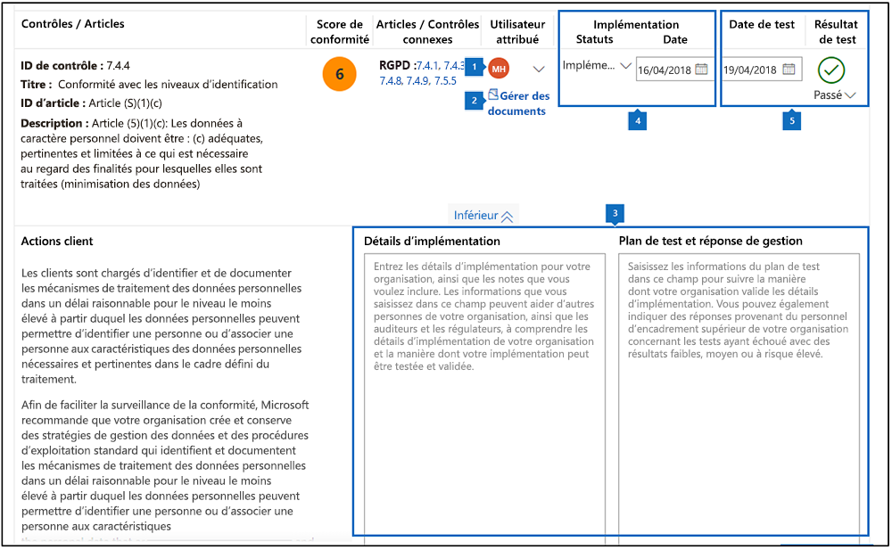
  
1. **Utilisez les options de filtrage pour trouver des contrôles d’évaluation spécifiques** : le Gestionnaire de conformité propose des **Options de filtrage** qui vous permettent d’afficher des contrôles d’évaluation selon des critères de sélection très précis et de concentrer vos efforts de mise en conformité sur des points spécifiques. 
    
    L’icône d’entonnoir du côté droit de la page permet d’afficher ou de masquer les contrôles **Options de filtre**. Ces contrôles vous permettent de spécifier des critères de filtre de façon à ce que seul les contrôles d’analyse correspondant à ceux-ci s’affichent en dessous. 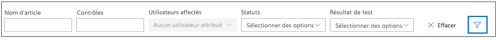
  
    - **Articles**: permet de filtrer sur le nom de l’article pour obtenir les contrôles d’analyse associés à celui-ci. Par exemple, en tapant « Article (5) », vous obtenez une liste de sélection répertoriant les articles dont le nom inclut cette chaîne, à savoir l’Article (5)(1)(a), l’Article (5)(1)(b), l’Article (5)(1)(c), etc. Sélectionner l’article (5)(1)(c) va renvoyer les contrôles associés à l’article (5)(1)(c). Il s’agit d’un champ à sélections multiples qui utilise un opérateur OU avec plusieurs valeurs. Par exemple, si vous sélectionnez Article (5)(1)(a), puis ajoutez Article (5)(1)(c), le filtre retourne les contrôles associés à l’Article (5)(1)(a) ou à l’Article (5)(1)(c). 
    
      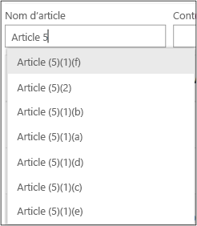
  
    - **Contrôles** : affiche la liste des contrôles dont le nom correspond au filtre. Par exemple, si vous tapez 7.3, une liste de sélection des éléments est renvoyée (par exemple, 7.3.1, 7.3.4, 7.3.5, etc.). Il s’agit d’un champ à sélection multiple qui utilise un opérateur OR à valeurs multiples. Par exemple, si vous sélectionnez 7.3.1, puis ajoutez 7.3.4, le filtre renvoie les contrôles associés à 7.3.1 ou 7.3.4. 
    
      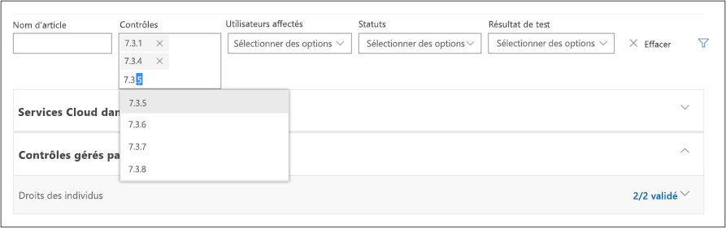
  
    - **Utilisateurs affectés** : affiche la liste des contrôles affectés à l’utilisateur sélectionné. 
    
    - **État** : affiche la liste des contrôles ayant l’état sélectionné. 
    
    - **Résultat de test** : affiche la liste des contrôles ayant le résultat de test sélectionné. 
    
    Quand vous appliquez les conditions de filtre, les contrôles applicables affichés changent pour refléter vos conditions de filtre. Développez les sections de chaque famille de contrôles pour afficher les détails des contrôles en dessous. 
    
    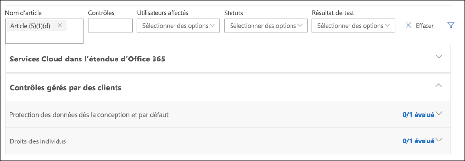
  
2. Si, après avoir sélectionné les filtres souhaités, aucun résultat n’est affiché, cela signifie qu’aucun contrôle ne correspond aux conditions de filtre spécifiées. Par exemple, si vous sélectionnez un **Utilisateur affecté** particulier, puis choisissez un nom de **Contrôle** correspondant au contrôle affecté à cet utilisateur, aucune évaluation n’est affichée dans la page en dessous. 
    
3. **Affecter un élément d’action à un utilisateur** : vous pouvez affecter un élément d’action à une personne pour implémenter les exigences d’une certification/réglementation, ou pour tester, vérifier et documenter les exigences d’implémentation de votre organisation. Quand vous affectez un élément d’action, vous pouvez choisir d’envoyer un e-mail à cette personne en l’informant des actions du client recommandées et de la priorité de l’élément d’action. Vous pouvez également désaffecter ou réaffecter un élément d’action à une autre personne. 
    
4. **Gérer les documents** Les contrôles gérés par le client permettent aussi de gérer les documents associés afin d’effectuer des tâches de mise en œuvre, ainsi que des tâches de test et de validation. Toute personne disposant des autorisations requises pour modifier les données dans le Gestionnaire de conformité peut charger des documents en cliquant sur **Gérer les documents**. Une fois le document chargé, cliquez sur **Gérer les documents** pour afficher et télécharger les fichiers. 
    
5. **Fournir des détails sur l’implémentation et le test** : tous les contrôles gérés par le client contiennent un champ modifiable où les utilisateurs peuvent ajouter des détails sur l’implémentation qui documentent les tâches effectuées par votre organisation pour répondre aux exigences de la certification/réglementation, et pour valider et documenter les actions effectuées par votre organisation pour y répondre.
    
6. **Définir l’état** : permet de définir l’état de chaque élément dans le cadre du processus d’évaluation. Les états disponibles sont **Implémenté**, **Implémentation alternative**, **Planifié** et **Non inclus**. 
    
7. **Entrer la date du test et les résultats du test** La personne dotée du rôle Analyste du Gestionnaire de conformité peut vérifier la bonne exécution du test, revoir les détails de mise en œuvre, du plan du test, des résultats du test et toute autre preuve chargée, puis définir la Date du test et les Résultats du test. Les valeurs de résultat de test disponibles sont les suivantes : **Réussi**, **Échec avec faible risque**, **Échec avec risque intermédiaire** et Échec avec risque élevé. 

## Gestion des éléments d’action

Les employés impliqués dans le processus d’analyse de votre organisation peuvent utiliser le Gestionnaire de conformité pour examiner les contrôles gérés par le client de toutes les analyses pour lesquelles il existe des utilisateurs. Lorsqu’un utilisateur se connecte au Gestionnaire de conformité et ouvre le tableau de bord **Éléments d’action**, la liste des éléments d’action qui lui sont attribués s’affiche. Selon le rôle du Gestionnaire de conformité attribué à l’utilisateur, il peut fournir les détails de mise en œuvre et de test, mettre à jour l’état ou attribuer des éléments d’action. 
  
Comme les contrôles des certifications sont généralement implémentés par une seule personne et testés par une autre, l’élément d’action du contrôle peut être affecté dès le départ au responsable de l’implémentation. Une fois cette opération terminée, cette personne peut réaffecter l’élément d’action du contrôle à une autre personne pour tester le contrôle et charger les preuves. Tout utilisateur ayant un rôle dans le Gestionnaire de conformité et les autorisations requises peut affecter/réaffecter les actions du contrôle, ce qui lui permet de centraliser la gestion des affectations ou de décentraliser le routage des éléments d’action du contrôle, du responsable de l’implémentation au testeur selon le contexte.
  
Pour affecter un élément d’action :
  
1. Sur le tableau de bord du Gestionnaire de conformité, localisez la vignette de l’évaluation avec laquelle vous souhaitez travailler et cliquez sur le nom de l’évaluation pour accéder à la page de détails de l’évaluation.
    
2. Vous pouvez cliquer sur **Filtrer** et utiliser les contrôles de filtre pour trouver le contrôle d’évaluation spécifique à affecter, ou 
    
3. Faites défiler la page vers le bas jusqu’à la section Contrôles gérés par le client, développez la famille de contrôles et parcourez la liste de contrôles jusqu’à ce que vous trouviez le contrôle d’évaluation à affecter.
    
4. Sous la colonne **Utilisateur affecté**, cliquez sur **Affecter**. 
    
5. Dans la boîte de dialogue Affecter un élément d’action, cliquez sur le champ **Affecter à** pour remplir la liste des utilisateurs auxquels l’action peut être affectée. Vous pouvez parcourir la liste pour rechercher l’utilisateur cible ou commencez à saisir dans le champ pour rechercher le nom de l’utilisateur. 
    
6. Cliquez sur l’utilisateur pour lui affecter cet élément d’action.
    
7. Pour envoyer une notification par e-mail à l’utilisateur, vérifiez que la case **Envoyer une notification par e-mail** est cochée. 
    
8. Tapez des notes destinées à cet utilisateur et cliquez sur **Affecter**. 
 
    L’utilisateur recevra la notification qui l’informera de l’affectation de l’élément d’action, ainsi que les notes fournies.
    
Les notes associées à l’élément d’action sont conservées dans la section Notes, disponible quand l’élément d’action est affecté pour la deuxième fois. Ces notes ne sont pas en lecture seule, elles peuvent être modifiées, remplacées ou supprimées par la personne ayant affecté l’élément d’action.

## Exportation des informations d’une évaluation

Vous pouvez exporter une analyse vers un fichier Excel. Celui-ci peut ensuite être examiné par les parties prenantes en matière de conformité de votre organisation, et mis à la disposition d’auditeurs et de régulateurs. Ce rapport d’analyse est un instantané de l’analyse aux date et heure de création du rapport. Il contient les détails des contrôles gérés par Microsoft et par le client pour cette analyse, à savoir l’état d’implémentation du contrôle, la date de test du contrôle, les résultats du test et des liens vers les documents de preuve chargés. Il est recommandé d’exporter le rapport d’analyse avant d’archiver une analyse, car les analyses archivées ne conservent pas les liens vers les documents chargés.
  
Pour exporter un rapport d’évaluation :
  
- Dans le tableau de bord du Gestionnaire de conformité, cliquez sur **Actions** sur la vignette de l’évaluation à exporter, puis sélectionnez **Exporter vers Excel**

  Ou
    
- Si vous affichez la page Détails de l’évaluation, cliquez sur le bouton **Exporter vers Excel** qui se trouve dans le coin supérieur droit de la page au-dessus du Score de conformité de l’évaluation.
    
Le rapport d’évaluation est téléchargé dans la session de votre navigateur. Si aucune fenêtre contextuelle ne s’affiche pour vous en informer, vérifiez le dossier de téléchargement de votre navigateur.

## Archivage d’une évaluation

Quand vous avez terminé une évaluation et que vous n’en avez plus besoin dans le cadre de votre mise en conformité, vous pouvez l’archiver. Quand une évaluation est archivée, elle est supprimée du tableau de bord des évaluations.
  
> [!NOTE]
> Une fois qu’une évaluation est archivée, elle ne peut pas être « désarchivée » ou restaurée dans la liste En cours en lecture-écriture. Notez que les évaluations archivées ne contiennent plus les liens vers les preuves chargées. C’est pourquoi nous vous recommandons vivement d’exporter l’évaluation avant de l’archiver, car le rapport d’évaluation exporté contient les liens vers les preuves, dans le cas où vous en auriez besoin. 
  
Pour archiver une évaluation :
  
1. Dans la vignette du tableau de bord de l’évaluation souhaitée, cliquez sur **Actions**. 
    
2. Sélectionnez **Archiver l’évaluation**. 
 
    La boîte de dialogue **Archiver des évaluations** s’affiche pour vous demander de confirmer l’archivage de l’évaluation.
    
4. Pour continuer, cliquez sur **Archiver**, sinon cliquez sur **Annuler**. 
    
Pour afficher les évaluations archivées :
  
1. Sur le tableau de bord du Gestionnaire de conformité, cochez la case **Afficher les évaluations archivées**. 
    
    Les évaluations archivées sont affichées dans une nouvelle section en dessous des évaluations actives sous une barre intitulée **Évaluations archivées**.
    
3. Cliquez sur le nom de l’évaluation que vous souhaitez consulter.
    
Quand vous affichez une évaluation archivée, aucun contrôle habituellement modifiable (par exemple, Implémentation, Résultats de test) ne sera actif et le bouton **Documents gérés** ne sera pas affiché.

## Utilisation de la recherche

  
Cliquez sur la loupe dans le coin supérieur droit de la page pour développer le champ d’entrée Recherche. Saisissez les mots que vous recherchez et appuyez sur Entrée. Le contrôle Recherche apparaît avec le mot recherché dans le champ d’entrée du volet de recherche, et les résultats de la recherche s’affichent en dessous.
  
Par défaut, le contrôle Recherche affiche des documents dans les résultats. Vous pouvez utiliser les listes déroulantes situées à côté de « Filtrer par » pour affiner la liste des documents affichés, ou pour ajouter ou supprimer des résultats sur la page. Vous pouvez utiliser plusieurs filtres d’attribut en même temps pour réduire le nombre de documents liés à des services cloud, des catégories de pratiques de conformité ou de sécurité, des régions du monde, ou des secteurs d’activité spécifiques. Cliquez sur le lien du document pour le télécharger.
  

  
Cliquez sur le lien Gestionnaire de conformité afin d’afficher les résultats de la recherche pour les contrôles d’analyse du Gestionnaire de conformité. Les résultats de la recherche affichent la date de création de l’analyse, le nom du regroupement d’analyses, le service cloud applicable, et indiquent si les contrôles sont gérés par Microsoft ou le client.
  

  
> [!NOTE]
> Les rapports et les documents du Portail d’approbation de services peuvent être téléchargés dans les douze mois suivant leur publication ou jusqu’à ce qu’une nouvelle version du document soit disponible. 
 
## Prise en charge de localisation

Le Portail d’approbation de services vous permet d’afficher le contenu de la page dans différentes langues. Pour modifier la langue de la page, cliquez sur l’icône du globe dans le coin inférieur gauche de la page et sélectionnez la langue de votre choix. 
  

## Journal des modifications des contrôles gérés par le client

Le gestionnaire de conformité est conçu pour être mis à jour régulièrement afin qu’il prenne en compte les modifications apportées aux exigences réglementaires, ainsi que les modifications apportées à nos services cloud. Ces mises à jour incluent les modifications apportées aux contrôles gérés par les clients. Un journal des modifications est fourni afin de vous aider à comprendre l’impact de ces changements, par exemple, les détails du contenu ajouté ou modifié et des indications relatives à l’incidence des modifications sur les analyses existantes. En règle générale, il existe deux types de modifications :
  
- Une modification **majeure** désigne une modification importante apportée aux actions du client, telles que l’ajout ou la suppression d’un contrôle ou d’étapes numérotées spécifiques, ou à l’aide portant sur les responsabilités, les recommandations ou les preuves. Pour effectuer des modifications majeures, nous vous recommandons de ré-évaluer votre implémentation et/ou votre évaluation du contrôle concerné.
    
- Une modification **mineure** désigne une modification peu importante apportée aux actions du client, tel que la correction d’une faute de frappe ou d’un problème de mise en forme, ou la mise à jour ou la correction des liens hypertexte. En règle générale, les modifications mineures n’exigent pas la ré-évaluation du contrôle. Toutefois, nous vous recommandons de vérifier l’action du client mise à jour.
  
### Contrôles gérés par le client Office 365 – Journal des modifications de juillet 2018

|**ID de contrôle**|**Évaluation**|**Type de modification**|**Description de la modification**|**Actions recommandées aux clients**|
|:-----|:-----|:-----|:-----|:-----|:-----|:-----|:-----|:-----|
|45 C.F.R. § 164.308(a)(7)(ii)(A)  |Office 365 : HIPAA|Majeure|Ajout du contrôle HITECH à l’évaluation HIPAA pour Office 365 |Vérifiez le contrôle ajouté et les actions du client recommandées  |
|45 C.F.R.  164.312(a)(6)(ii)|Office 365 : HIPAA|Majeure|Ajout du contrôle HITECH à l’évaluation HIPAA pour Office 365|Vérifiez le contrôle ajouté et les actions du client recommandées |
45 C.F.R. § 164.312(c)(1)| Office 365 : HIPAA|Majeure| Ajout du contrôle HITECH à l’évaluation HIPAA pour Office 365 |Vérifiez le contrôle ajouté et les actions du client recommandées  |
45 C.F.R.  § 164.316(b)(2)(iii)| Office 365 : HIPAA|Majeure|Ajout du contrôle HITECH à l’évaluation HIPAA pour Office 365|Vérifiez le contrôle ajouté et les actions du client recommandées |
|

### Contrôles gérés par le client Office 365 – Journal des modifications d’avril 2018

|**RGPD**|**Loi américaine HIPAA**|**ISO 27001**|**ISO 27018**|**NIST 800-53**|**NIST 800-171**|**Type de modification**|**Description de la modification**|**Actions recommandées aux clients**|
|:-----|:-----|:-----|:-----|:-----|:-----|:-----|:-----|:-----|
|6.13.2    |||C.16.1.1    |||Majeure    |Précédemment numérotée 6.12.1.1.    Ajout de détails aux recommandations.    |Ré-évaluez le contrôle : vérifiez l’aide mise à jour dans les actions du client et suivez les étapes recommandées pour implémenter et évaluer le contrôle.    |
||||||3.1.6    |Majeure    |Ajout d’étapes à l’aide, dont l’activation de l’audit et la recherche des journaux d’audit.    |Vérifiez les recommandations mises à jour dans les actions du client.    |
|6.8.2    |||A.10.2    |||Majeure    |Précédemment numérotée 6.7.2.9.    Aide mise à jour avec des recommandations et des éléments d’action supplémentaires.    |Ré-évaluez le contrôle : vérifiez l’aide mise à jour dans les actions du client et suivez les étapes recommandées pour implémenter et évaluer le contrôle.    |
|6.6.4    |45 C.F.R. § 164.312(a)(2)(i)              45 C.F.R. § 164.312(d)    |A.9.4.2    ||IA-2    |3.5.1    |Majeure    |Précédemment numérotée 6.5.2.3.    Aide mise à jour avec des recommandations et des éléments d’action supplémentaires.    |Ré-évaluez le contrôle : vérifiez l’aide mise à jour dans les actions du client et suivez les étapes recommandées pour implémenter et évaluer le contrôle.    |
|6.13.1    |45 C.F.R. § 164.308(a)(1)(i)    |A.16.1    |C.16.1    |IR-4(a)    |3.6.1    |Majeure    |Précédemment numérotée 6.12.1.    Aide mise à jour avec des recommandations et des éléments d’action supplémentaires.    |Ré-évaluez le contrôle : vérifiez l’aide mise à jour dans les actions du client et suivez les étapes recommandées pour implémenter et évaluer le contrôle.    |
|6.7    ||||||Majeure    |Précédemment numérotée 6.6.1.1.    Aide mise à jour avec des recommandations et des éléments d’action supplémentaires.    |Ré-évaluez le contrôle : vérifiez l’aide mise à jour dans les actions du client et suivez les étapes recommandées pour implémenter et évaluer le contrôle.    |
|6.6.5    |||A.10.8    |IA-3    |3.5.2    |Majeure    |Précédemment numérotée 6.5.4.2.    Aide mise à jour avec des recommandations et des éléments d’action supplémentaires.    |Ré-évaluez le contrôle : vérifiez l’aide mise à jour dans les actions du client et suivez les étapes recommandées pour implémenter et évaluer le contrôle.    |
|6.15.1    ||||||Majeure    |Précédemment numérotée 6.14.1.3.    Aide mise à jour avec des recommandations et des éléments d’action supplémentaires.    |Ré-évaluez le contrôle : vérifiez l’aide mise à jour dans les actions du client et suivez les étapes recommandées pour implémenter et évaluer le contrôle.    |
|||||AC-2(h)(2)    ||Mineure    |Ajout d’un lien au panneau Activer l’audit.    |Aucune action requise.    |
|||||AC-2(7)(b)    ||Mineure    |Ajout d’un lien au panneau Activer l’audit.    |Aucune action requise.    |
|||||AC-2(h)(1)    ||Mineure    |Ajout d’un lien au panneau Activer l’audit.    |Aucune action requise.    |
||45 C.F.R. § 164.308(a)(5)(ii)(A)    |||AC-2(g)    ||Mineure    |Ajout d’un lien au panneau Activer l’audit.    |Aucune action requise.    |
|||||AC-2(12)    ||Mineure    |Ajout d’un lien au panneau Activer l’audit.    |Aucune action requise.    |
||45 C.F.R. § 164.312(b)    |A.12.4.3    ||AU-2(d)    ||Mineure    |Ajout d’un lien au panneau Activer l’audit.    |Aucune action requise.    |
|||||AC-2(4)    ||Mineure    |Ajout d’un lien au panneau Activer l’audit.    |Aucune action requise.    |
||||||3.1.7    |Mineure    |Ajout d’un lien au panneau Activer l’audit.    |Aucune action requise.    |
|||A.16.1.7    |C.12.4.2, partie 2    |||Mineure    |Ajout d’un lien au panneau Activer l’audit.    |Aucune action requise.    |
|||||AC-2(h)(3)    ||Mineure    |Ajout d’un lien au panneau Activer l’audit.    |Aucune action requise.    |
|||A.12.4.2    ||||Mineure    |Ajout d’un lien au panneau Activer l’audit.    |Aucune action requise.    |
|||A.7.2.8    ||||Mineure    |Ajout de liens au panneau Recherche de contenu et au Portail des demandes d’accès aux données personnelles (DSR).    |Aucune action requise.    |
||45 C.F.R. § 164.308(a)(3)(ii)(C)    |||||Mineure    |Ajout de liens au tableau Activer l’audit et aux rubriques d’aide du rôle d’administrateur Office 365.    |Aucune action requise.    |
|5.2.1    ||||||Mineure    |Précédemment numérotée 5.2.2.    Clarification des responsabilités du client dans l’aide.    |Vérifiez les recommandations mises à jour dans les actions du client.    |
|masse 6.11.1    |45 C.F.R. § 164.312(e)(2)(ii)    |A.10.1.1          A.10.1.2          A.18.1.5    |C.10.1.1    |SC-13    |3.13.11    |Mineure    |Précédemment numérotée 6.10.1.2.    Correction d’une faute de frappe.    |Aucune action requise.    |
|7.5.1    ||||||Mineure    |Précédemment numérotée A.7.4.1.    Correction d’une faute de frappe.    |Aucune action requise.    |
|||A.8.2.3    |||3.1.3    |Mineure    |Suppression d’une phrase inutile.    |Aucune action requise.    |
||45 C.F.R. § 164.308(a)(4)(i)    |A.6.1.2    ||AC-5(a)    |3.1.2          3.1.4    |Mineure    |Aide mise à jour avec des recommandations et des éléments d’action supplémentaires.    |Vérifiez les recommandations mises à jour dans les actions du client.    |
||45 C.F.R. § 164.308(a)(7)(ii)(E)    |||RA-2(a)    ||Mineure    |Mise à jour du lien vers la rubrique d’aide du service d’importation en FWLink.    |Aucune action requise.    |
|

### Référence des modifications de l’ID de contrôle de l’évaluation RGPD – Journal des modifications de février 2018 

|**ID de contrôle précédent (Préversion de novembre 2017)**|**Nouvel ID de contrôle (mise à disposition générale de février 2018)**|
|:-----|:-----|
|5.2.2    |5.2.1    |
|5.2.3    |5.2.2    |
|5.2.4    |5.2.3    |
|6.1.1.1    |6.2    |
|6.10.1.2    |masse 6.11.1    |
|6.10.2.5    |6.11.2    |
|6.11.1.2    |6.12    |
|6.12.1    |6.13.1    |
|6.12.1.1    |6.13.2    |
|6.12.1.5    |6.13.3    |
|6.14.1.3    |6.15.1    |
|6.14.2.1    |6.15.2    |
|6.14.2.3    |6.15.3    |
|6.2.1.1    |6.3    |
|6.3.2.2    |6.4    |
|6.4.3.1    |6.5.2    |
|6.4.3.2    |6.8.1    |
|6.4.3.3    |6.5.3    |
|6.5.2    |6.6.1    |
|6.5.2.1    |6.6.2    |
|6.5.2.2    |6.6.3    |
|6.5.2.3    |6.6.4    |
|6.5.4.2    |6.6.5    |
|6.6.1.1    |6.7      |
|6.7.2.7    |6.8.1    |
|6.7.2.9    |6.8.2    |
|6.8.1.4    |6.9.1    |
|6.8.4.1    |6.9.3    |
|6.8.4.2    |6.9.4    |
|6.9.2.1    |6.10.1   |
|6.9.2.3    |6.10.2   |
|A.7.1.1    |7.2.1    |
|A.7.1.2    |7.2.2    |
|A.7.1.3    |7.2.3    |
|A.7.1.4    |7.2.4    |
|A.7.1.5    |7.2.5    |
|A.7.1.6    |7.2.6    |
|A.7.1.7    |7.2.7    |
|A.7.2.1    |7.3.1    |
|A.7.2.10   |7.3.9    |
|A.7.2.11   |7.3.10   |
|A.7.2.2    |7.3.2    |
|A.7.2.3    |7.3.3    |
|A.7.2.4    |7.3.4    |
|A.7.2.5    |7.3.5    |
|A.7.2.6    |7.3.6    |
|A.7.2.7    |7.3.7    |
|A.7.2.8    |7.3.8    |
|A.7.3.1    |7.4.1    |
|A.7.3.10   |7.4.10   |
|A.7.3.2    |7.4.2    |
|A.7.3.3    |7.4.3    |
|A.7.3.4    |7.4.4    |
|A.7.3.5    |7.4.5    |
|A.7.3.6    |7.4.6    |
|A.7.3.7    |7.4.7    |
|A.7.3.8    |7.4.8    |
|A.7.3.9    |7.4.9    |
|A.7.4.1    |7.5.1    |
|A.7.4.2    |7.5.2    |
|A.7.4.3    |7.5.3    |
|A.7.4.4    |7.5.4    |
|A.7.4.5    |7.5.5    |
|B.8.1.1    |8.2.1    |
|B.8.1.2    |8.2.2    |
|B.8.1.3    |8.2.3    |
|B.8.1.4    |8.2.4    |
|B.8.1.5    |8.2.5    |
|B.8.1.6    |8.2.6    |
|B.8.2.1    |8.3.1    |
|B.8.3.1    |8.4.1    |
|B.8.3.2    |8.4.2    |
|B.8.3.3    |8.4.3    |
|B.8.4.1    |8.5.1    |
|B.8.4.2    |8.5.2    |
|B.8.4.3    |8.5.4    |
|B.8.4.4    |8.5.5    |
|B.8.4.5    |8.5.3    |
|B.8.4.6    |8.5.6    |
|B.8.4.7    |8.5.7    |
|B.8.4.8    |8.5.8    |
|
   
## Voir aussi

- [Guide interactif sur le gestionnaire de conformité](https://content.cloudguides.com/guides/Compliance%20Manager)

- [Annonce de la mise à disposition générale du gestionnaire de conformité](https://techcommunity.microsoft.com/t5/Security-Privacy-and-Compliance/Announcing-Compliance-Manager-general-availability/ba-p/161922)

- [Microsoft 365 propose une stratégie de protection des données pour se conformer au RGPD](https://blogs.office.com/en-us/2018/02/22/microsoft-365-provides-an-information-protection-strategy-to-help-with-the-gdpr)
