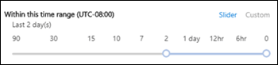

# Suivi des messages dans le centre de conformité et de sécuritéMessage trace in the Security & Compliance Center

## Vue d’ensembleOverview

Le suivi des messages dans le centre de sécurité & conformité suit les messages électroniques échangés via votre organisation Exchange Online.Message trace in the Security & Compliance Center follows email messages as they travel through your Exchange Online organization. Vous pouvez déterminer si un message a été reçu, rejeté, différé ou remis par le service.You can determine if a message was received, rejected, deferred, or delivered by the service. Cela indique également les actions entamées par rapport au message avant qu'il atteigne son statut final.It also shows what actions were taken on the message before it reached its final status.

Le suivi des messages dans le centre de sécurité & conformité améliore le suivi des messages qui était disponible dans le centre d'administration Exchange.Message trace in the Security & Compliance Center improves upon message trace that was available in the Exchange admin center (EAC). Vous pouvez utiliser les informations du suivi des messages pour répondre efficacement aux questions des utilisateurs sur ce qui s'est passé à leurs messages, résoudre les problèmes de flux de messagerie et valider les modifications de stratégie.You can use the information from message trace to efficiently answer user questions about what happened to their messages, troubleshoot mail flow issues, and validate policy changes.

## Ouvrir le suivi des messagesOpen message trace

1. [Connectez-vous à Office 365](https://support.office.com/article/e9eb7d51-5430-4929-91ab-6157c5a050b4) à l'aide de votre compte professionnel ou scolaire.[Sign in to Office 365](https://support.office.com/article/e9eb7d51-5430-4929-91ab-6157c5a050b4) with your work or school account.

2. Sélectionnez l'icône du lanceur d'applications  dans la partie supérieure gauche, puis **Administrateur**.Select the app launcher icon  in the upper-left and choose **Admin**.

3. Dans le volet de navigation en bas à gauche, développez **centres d'administration** et sélectionnez **sécurité & conformité**.In the lower-left navigation, expand **Admin centers** and select **Security & Compliance**.

4. Dans la page conformité du service de **sécurité &** qui s'ouvre, développez **flux de messagerie**, puis sélectionnez **suivi des messages**.In the **Security & Compliance** page that opens, expand **Mail flow**, and select **Message trace**.

## Page de suivi des messagesMessage trace page

À partir de là, vous pouvez démarrer un nouveau suivi par défaut en cliquant sur le bouton **Démarrer un suivi** .From here you can start a new default trace by clicking on the **Start a trace** button. Cette opération recherche tous les messages pour tous les expéditeurs et destinataires au cours des deux derniers jours.This will search for all messages for all senders and recipients for the last two days. Vous pouvez aussi utiliser l'une des requêtes stockées des catégories de requête disponibles et les exécuter telles quelles ou les utiliser comme points de départ pour vos propres requêtes:Or you can use one of the stored queries from the available query categories and either run them as-is or use them as starting points for your own queries:

- **Requêtes par défaut**: requêtes intégrées fournies par Office 365.**Default queries**: Built-in queries provided by Office 365.

- **Requêtes personnalisées**: requêtes enregistrées par les administrateurs de votre organisation en vue d'une utilisation ultérieure.**Custom queries**: Queries saved by admins in your organization for future use.

- **Requêtes enregistrées automatiquement**: les dix dernières requêtes exécutées.**Autosaved queries**: The last ten most recently run queries. Cette liste facilite la récupération là où vous vous étiez arrêté.This list makes it simple to pick up where you left off.

Cette page contient également une section **rapports** téléchargeable pour les demandes que vous avez envoyées, ainsi que les rapports eux-mêmes lorsqu'ils sont disponibles pour le téléchargement.Also on this page is a **Downloadable reports** section for the requests you've submitted, as well as the reports themselves when they're are available for download.

## Options pour un nouveau suivi des messagesOptions for a new message trace

### Filtrer par expéditeurs et destinatairesFilter by senders and recipients

Les valeurs par défaut sont **tous les expéditeurs** et **tous les destinataires**, mais vous pouvez utiliser les champs suivants pour filtrer les résultats:The default values are **All senders** and **All recipients**, but you can use the following fields to filter the results:

- **Par ces personnes**: cliquez dans ce champ pour sélectionner un ou plusieurs expéditeurs de votre organisation.**By these people**: Click in this field to select one or more senders from your organization. Vous pouvez également commencer à taper un nom et les éléments de la liste seront filtrés en fonction de ce que vous avez tapé, de la même manière qu'une page de recherche.You can also start to type a name and the items in the list will be filtered by what you've typed, much like how a search page behaves.

- **Pour les personnes**suivantes: cliquez dans ce champ pour sélectionner un ou plusieurs destinataires dans votre organisation.**To these people**: Click in this field to select one or more recipients in your organization.

> [!NOTE]
> Vous pouvez également taper les adresses de messagerie des expéditeurs et des destinataires externes.You can also type the email addresses of external senders and recipients. Les caractères génériques sont pris`*@contoso.com` en `scot?@contoso.com`charge (ou), mais vous ne pouvez pas utiliser plusieurs entrées génériques dans le même champ simultanément.Wildcards are supported (`*@contoso.com` or `scot?@contoso.com`), but you can't use multiple wildcard entries in the same field at the same time. Vous pouvez coller plusieurs expéditeurs ou listes de destinataires séparés par`;`des points-virgules ().You can paste multiple senders or recipients list separated with semicolon (`;`). Les espaces`\s`(), les retours chariot (`\r`) ou`\n`les lignes () sont autorisés.Spaces (`\s`), carriage return (`\r`) or next lines (`\n`) symbols are allowed.

### Plage horaireTime range

La valeur par défaut est **2 jours**, mais vous pouvez spécifier des plages de date/heure allant jusqu'à 90 jours.The default value is **2 days**, but you can specify date/time ranges of up to 90 days. Lorsque vous utilisez des plages date/heure, tenez compte des points suivants:When you use date/time ranges, consider these issues:

- Par défaut, vous sélectionnez la plage de temps dans le mode **curseur** à l'aide d'une ligne de temps.By default, you select the time range in **Slider** view using a time line. Vous pouvez uniquement sélectionner les paramètres de jour ou d'heure affichés.You can only select the day or time settings that are displayed. La tentative de sélection d'une valeur entre-entre va aligner la bulle de début/fin au paramètre affiché le plus proche.Trying to select an in-between value will snap the start/end bubble to the nearest displayed setting.

   

   Toutefois, vous pouvez également passer en mode affichage **personnalisé** où vous pouvez spécifier les valeurs de date de **début** et de **Date de fin** (y compris les heures), et vous pouvez également sélectionner le **fuseau horaire** pour la plage date/heure.But, you can also switch to **Custom** view where you can specify the **Start date** and **End date** values (including times), and you can also select the **Time zone** for the date/time range. Notez que le paramètre **fuseau horaire** s'applique à la fois à vos entrées de requête et à vos résultats de requête.Note that the **Time zone** setting applies to both your query inputs and your query results.

   

   Pendant 10 jours ou moins, les résultats sont disponibles instantanément sous la forme d'un rapport de **synthèse** .For 10 days or less, the results are available instantly as a **Summary** report. Si vous spécifiez un intervalle de temps qui est encore légèrement supérieur à 10 jours, les résultats seront retardés, car ils ne seront disponibles que sous forme de fichier CSV \*\*\*\* téléchargeable ( **Résumé amélioré** ou rapports étendus).If you specify a time range that's even slightly greater than 10 days, the results will be delayed as they are only available as a downloadable CSV file ( **Enhanced summary** or **Extended** reports).

   Pour plus d'informations sur les différents types de rapport, reportez-vous à la section [choisir un type de rapport](#choose-report-type) dans cette rubrique.For more information about the different report types, see the [Choose report type](#choose-report-type) section in this topic.

   **Remarque**: le résumé amélioré et les rapports étendus sont préparés à l'aide des données de suivi des messages archivés, et peuvent prendre jusqu'à plusieurs heures avant que le rapport ne soit disponible pour téléchargement.**Note**: Enhanced summary and Extended reports are prepared using archived message trace data, and it can take up to several hours before your report is available for download. En fonction du nombre d'autres administrateurs ayant également envoyé des demandes de rapports en même temps, vous pouvez également remarquer un délai avant le début du traitement de votre demande en file d'attente.Depending on how many other admins have also submitted report requests around the same time, you might also notice a delay before processing starts for your queued request.

- L'enregistrement d'une requête en mode **curseur** enregistre la plage de temps relative (par exemple, 3 jours à partir d'aujourd'hui).Saving a query in **Slider** view saves the relative time range (for example, 3 days from today). L'enregistrement d'une requête en mode **personnalisé** enregistre la plage date/heure absolue (par exemple, 2018-05-06 13:00 à 2018-05-08 18:00).Saving a query in **Custom** view saves the absolute date/time range (for example, 2018-05-06 13:00 to 2018-05-08 18:00).

### Autres options de rechercheMore search options

#### État de remiseDelivery status

Vous pouvez laisser la valeur par défaut **tous** sélectionnée ou vous pouvez sélectionner l'une des valeurs suivantes pour filtrer les résultats:You can leave the default value **All** selected, or you can select one of the following values to filter the results:

- **Remis**: le message a bien été remis à la destination prévue.**Delivered**: The message was successfully delivered to the intended destination.

- **En attente**: la remise du message est tentée ou retentée.**Pending**: Delivery of the message is being attempted or re-attempted.

- **Étendu**: un destinataire de groupe de distribution a été étendu avant la remise aux membres individuels du groupe.**Expanded**: A distribution group recipient was expanded before delivery to the individual members of the group.

- **Échec**: le message n'a pas été remis.**Failed**: The message was not delivered.

- **Mis en quarantaine**: le message a été mis en quarantaine (en tant que courrier indésirable, courrier en nombre ou hameçonnage).**Quarantined**: The message was quarantined (as spam, bulk mail, or phishing). Pour plus d'informations, consultez la rubrique [mise en quarantaine des messages électroniques dans Office 365](https://support.office.com/article/4c234874-015e-4768-8495-98fcccfc639b.aspx).For more information, see [Quarantine email messages in Office 365](https://support.office.com/article/4c234874-015e-4768-8495-98fcccfc639b.aspx).

- **Filtré en tant que courrier**indésirable: le message a été identifié comme courrier indésirable, et a été rejeté ou bloqué (non mis en quarantaine).**Filtered as spam**: The message was identified spam, and was rejected or blocked (not quarantined).

- **Obtention de l'État:** Le message a été récemment reçu par Office 365, mais aucune autre donnée d'État n'est encore disponible.**Getting status:** The message was recently received by Office 365, but no other status data is yet available. Vérifiez de nouveau dans quelques minutes.Check back in a few minutes.

**Remarque**: les valeurs **en attente,** **mises en quarantaine**et **filtrées en tant que courrier** indésirable sont uniquement disponibles pour les recherches de moins de 10 jours.**Note**: The values **Pending,** **Quarantined**, and **Filter as spam** are only available for searches less than 10 days. De plus, il peut y avoir un délai de 5 à 10 minutes entre l'état de remise réel et signalé.Also, there might be a 5 to 10 minute delay between the actual and reported delivery status.

#### ID du messageMessage ID

Il s'agit de l'ID de message Internet (également appelé ID de client) qui se trouve dans le champ d'en-tête **message-ID:** dans l'en-tête du message.This is the internet message ID (also known as the Client ID) that's found in the **Message-ID:** header field in the message header. Les utilisateurs peuvent vous donner cette valeur pour examiner des messages spécifiques.Users can give you this value to investigate specific messages.

Cette valeur est constante pendant toute la durée de vie du message.This value is constant for the lifetime of the message. Pour les messages créés dans Office 365 ou Exchange, la valeur est au format `<GUID@ServerFQDN>`, y compris les chevrons\< \>().For messages created in Office 365 or Exchange, the value is in the format `<GUID@ServerFQDN>`, including the angle brackets (\< \>). Par exemple, `<d9683b4c-127b-413a-ae2e-fa7dfb32c69d@DM3NAM06BG401.Eop-nam06.prod.protection.outlook.com>`.For example, `<d9683b4c-127b-413a-ae2e-fa7dfb32c69d@DM3NAM06BG401.Eop-nam06.prod.protection.outlook.com>`. D'autres systèmes de messagerie peuvent utiliser des valeurs ou une syntaxe différentes.Other messaging systems might use different syntax or values. Cette valeur est supposée unique, mais tous les systèmes de courrier ne respectent pas strictement cette exigence.This value is supposed to be unique, but not all email systems strictly follow this requirement. Si le champ d'en-tête **message-ID:** n'existe pas ou est vide pour les messages entrants provenant de sources externes, une valeur arbitraire est assignée.If the **Message-ID:** header field doesn't exist or is blank for incoming messages from external sources, an arbitrary value is assigned.

Lorsque vous utilisez l' **ID de message** pour filtrer les résultats, veillez à inclure la chaîne complète, y compris tous les chevrons.When you use **Message ID** to filter the results, be sure to include the full string, including any angle brackets.

#### DirectionDirection

Vous pouvez laisser la valeur par défaut **tous** sélectionnée ou vous pouvez sélectionner \*\*\*\* les messages entrants (messages envoyés à des destinataires dans votre organisation) ou **sortants** (messages envoyés par les utilisateurs de votre organisation) pour filtrer les résultats.You can leave the default value **All** selected, or you can select **Inbound** (messages sent to recipients in your organization) or **Outbound** (messages sent from users in your organization) to filter the results.

#### Adresse IP du client d’origineOriginal client IP address

Vous pouvez échanger les résultats par adresse IP du client pour enquêter sur les ordinateurs piratés qui envoient de grandes quantités de courrier indésirable ou de programmes malveillants.You can filer the results by client IP address to investigate hacked computers that are sending large amounts of spam or malware. Bien que les messages semblent provenir de plusieurs expéditeurs, il est probable que le même ordinateur génère tous les messages.Although the messages might appear to come from multiple senders, it's likely that the same computer is generating all of the messages.

**Remarque**: les informations d'adresse IP du client sont disponibles uniquement pendant 10 jours et sont disponibles uniquement dans le **Résumé amélioré** ou les rapports **étendus** (fichiers CSV téléchargeables).**Note**: The client IP address information is only available for 10 days, and is only available in the **Enhanced summary** or **Extended** reports (downloadable CSV files).

### Choisir le type de rapportChoose report type

Les types de rapports disponibles sont les suivants:The available report types are:

- **Résumé**: disponible si l'intervalle de temps est inférieur à 10 jours et ne requiert aucune option de filtrage supplémentaire.**Summary**: Available if the time range is less than 10 days, and requires no additional filtering options. Les résultats sont disponibles presque immédiatement après que vous avez cliqué sur **Rechercher**.The results are available almost immediately after you click **Search**.

- **Résumé amélioré** ou **étendu**: ces rapports sont disponibles uniquement en tant que fichiers CSV téléchargeables et nécessitent une ou plusieurs des options de filtrage suivantes, quelle que soit la plage horaire: **par ces personnes**, **à ces personnes**, ou \*\* ID du message\*\*.**Enhanced summary** or **Extended**: These reports are only available as downloadable CSV files, and require one or more of the following filtering options regardless of the time range: **By these people**, **To these people**, or **Message ID**. Vous pouvez utiliser des caractères génériques pour les expéditeurs ou les destinataires (par \*exemple, @contoso. com).You can use wildcards for the senders or the recipients (for example, \*@contoso.com).

**Remarques** :**Notes**:

- Le résumé amélioré et les rapports étendus sont préparés à l'aide de données de suivi des messages archivés, et peuvent prendre jusqu'à plusieurs heures avant le téléchargement de votre rapport.Enhanced summary and Extended reports are prepared using archived message trace data, and it can take up to several hours before your report is available to download. En fonction du nombre d'autres administrateurs ayant également envoyé des demandes de rapports en même temps, vous pouvez également remarquer un délai avant le début du traitement de votre demande en file d'attente.Depending on how many other admins have also submitted report requests around the same time, you might also notice a delay before your queued request starts to be processed.

- Bien que vous puissiez sélectionner un rapport avancé ou étendu pour n'importe quelle plage date/heure, les quatre dernières heures de données archivées ne sont pas encore disponibles pour ces deux types de rapports.While you can select an Enhanced summary or Extended report for any date/time range, commonly the last four hours of archived data will not yet be available for these two types of reports.

Lorsque vous cliquez sur **suivant**, une page de résumé répertorie les options de filtrage que vous avez sélectionnées, un titre unique (modifiable) pour le rapport et l'adresse de messagerie qui reçoit la notification lorsque le suivi des messages est terminé (également modifiable, et doit se trouver dans l'un des domaines acceptés de votre organisation).When you click **Next**, you're presented with a summary page that lists the filtering options that you selected, a unique (editable) title for the report, and the email address that receives the notification when the message trace completes (also editable, and must be in one of your organization's accepted domains). Cliquez sur **préparer le rapport** pour envoyer le suivi des messages.Click **Prepare report** to submit the message trace. Sur la page principale de **suivi des messages** , vous pouvez voir l'état du rapport dans la section **rapports** téléchargeables.On the main **Message trace** page, you can see the status of the report in the **Downloadable reports** section.

Pour plus d'informations sur les informations renvoyées dans les différents types de rapports, voir la section suivante.For more information about the information that's returned in the different report types, see the next section.

## Résultats du suivi des messagesMessage trace results

Les différents types de rapport renvoient différents niveaux d'informations.The different report types return different levels of information. Les informations disponibles dans les différents rapports sont décrites dans les sections suivantes.The information that's available in the different reports is described in the following sections.

### Sortie du rapport de synthèseSummary report output

Après avoir exécuté le suivi des messages, les résultats sont affichés, triés par ordre décroissant de date/heure (en premier lieu).After running the message trace, the results will be listed, sorted by descending date/time (most recent first).

Le rapport de synthèse contient les informations suivantes:The summary report contains the following information:

- **Date**: date et heure auxquelles le message a été reçu par le service, à l'aide du fuseau horaire UTC configuré.**Date**: The date and time at which the message was received by the service, using the configured UTC time zone.

- **Sender**: adresse de messagerie de l'expéditeur (*alias*@*Domain*).**Sender**: The email address of the sender (*alias*@*domain*).

- **Recipient**: adresse de messagerie du ou des destinataires.**Recipient**: The email address of the recipient or recipients. Pour un message envoyé à plusieurs destinataires, il y a une ligne par destinataire.For a message sent to multiple recipients, there's one line per recipient. Si le destinataire est un groupe de distribution, un groupe de distribution dynamique ou un groupe de sécurité à extension messagerie, le groupe sera le premier destinataire, puis chaque membre du groupe se trouve sur une ligne distincte.If the recipient is a distribution group, dynamic distribution group, or mail-enabled security group, the group will be the first recipient, and then each member of the group is on a separate line.

- **Objet**: les premiers 256 caractères du champ objet du message **:****Subject**: The first 256 characters of the message's **Subject:** field.

- **État**: ces valeurs sont décrites dans la section [État de remise](#delivery-status) .**Status**: These values are described in the [Delivery status](#delivery-status) section.

Par défaut, le premier résultat 250 est chargé et immédiatement disponible.By default, the first 250 results are loaded and readily available. Lorsque vous faites défiler vers le bas, il y a une légère pause lorsque le lot de résultats suivant est chargé.When you scroll down, there's a slight pause as the next batch of results are loaded. Au lieu de faire défiler, vous pouvez cliquer sur **charger tout** pour charger tous les résultats jusqu'à un maximum de 10 000.Instead of scrolling, you can click **Load all** to load all of the results up to a maximum of 10,000.

Vous pouvez cliquer sur les en-têtes de colonne pour trier les résultats en fonction des valeurs de cette colonne dans l'ordre croissant ou décroissant.You can click on the column headers to sort the results by the values in that column in ascending or descending order.

Vous pouvez cliquer sur **Filtrer les résultats** pour filtrer les résultats par une ou plusieurs colonnes.You can click **Filter results** to filter the results by one or more columns.

Vous pouvez exporter les résultats une fois que vous avez sélectionné une ou plusieurs lignes en cliquant sur **Exporter les résultats** , puis en sélectionnant **exporter tous les résultats**, **Exporter les résultats chargés**ou **Exporter la sélection**.You can export the results after you've selected one or more rows by clicking **Export results** and then selecting **Export all results**, **Export loaded results**, or **Export selected**.

#### Rechercher des enregistrements associés pour ce messageFind related records for this message

Les enregistrements de message associés sont des enregistrements qui ont partagé le même ID de message.Related message records are records that shared the same Message ID. N'oubliez pas qu'un seul message envoyé entre deux personnes peut générer plusieurs enregistrements.Remember, even a single message sent between two people can generate multiple records. Le nombre d'enregistrements augmente lorsque le message est affecté par l'expansion du groupe de distribution, le transfert, les règles de flux de messagerie (également appelées règles de transport), etc.The number of records increases when the message is affected by distribution group expansion, forwarding, mail flow rules (also known as transport rules), etc.

Une fois que vous avez activé la case à cocher d'une ligne, vous pouvez trouver des enregistrements correspondants pour le message en cliquant sur le bouton **Rechercher connexe** qui s'affiche, ou en sélectionnant **plus d'options**  \> **pour ce message**.After you select a row's check box, you can find related records for the message by clicking the **Find related** button that appears, or by selecting **More options**  \> **Find related records for this message**).

Pour plus d'informations sur l'ID de message, consultez la section ID de message plus haut dans cette rubrique.For more information about the Message ID, see the Message ID section earlier in this topic.

#### Détails du suivi des messagesMessage trace details

Dans le rapport de synthèse, vous pouvez afficher les détails relatifs à un message à l'aide de l'une des méthodes suivantes:In the summary report output, you can view details about a message by using either of the following methods:

- Sélectionnez la ligne (cliquez n'importe où dans la ligne à l'exception de la case à cocher).Select the row (click anywhere in the row except the check box).

- Activez la case à cocher ligne, puis cliquez sur **autres options**  \> **afficher les détails du message**.Select the row's check box and click **More options**  \> **View message details**.

   

Les détails de suivi des messages contiennent les informations supplémentaires suivantes qui ne sont pas présentes dans le rapport récapitulatif:The message trace details contain the following additional information that's not present in the summary report:

- **Événements de message**: cette section contient des classifications qui permettent de classer les actions effectuées par le service sur les messages.**Message events**: This section contains classifications that help categorize the actions that the service takes on messages. Voici quelques-uns des événements les plus intéressants que vous pouvez rencontrer:Some of the more interesting events that you might encounter are:

   - **Receive**: le message a été reçu par le service.**Receive**: The message was received by the service.

   - **Send**: le message a été envoyé par le service.**Send**: The message was sent by the service.

   - **Échec**: le message n'a pas pu être remis.**Fail**: The message failed to be delivered.

   - **Remettre**: le message a été remis à une boîte aux lettres.**Deliver**: The message was delivered to a mailbox.

   - **Expand**: le message a été envoyé à un groupe de distribution qui a été étendu.**Expand**: The message was sent to a distribution group that was expanded.

   - **Transfert**: les destinataires ont été déplacés vers un message de bifurcation en raison de la conversion de contenu, de limites de destinataires de messages ou d'agents.**Transfer**: Recipients were moved to a bifurcated message because of content conversion, message recipient limits, or agents.

   - **Defer**: la remise du message a été différée et peut être retentée ultérieurement.**Defer**: The message delivery was postponed and might be re-attempted later.

   - **Résolu**: le message a été redirigé vers une nouvelle adresse de destinataire en fonction d'une recherche Active Directory.**Resolved**: The message was redirected to a new recipient address based on an Active Directory look up. Lorsque cela se produit, l'adresse du destinataire d'origine est répertoriée sur une ligne distincte dans le suivi des messages avec l'état de remise final du message.When this happens, the original recipient address is listed in a separate row in the message trace along with the final delivery status for the message.

   Notez que même un message qui n'a pas été correctement remis génère plusieurs entrées d' **événements** dans le suivi des messages.Note that even an uneventful message that's successfully delivered will generate multiple **Event** entries in the message trace.

- **Informations supplémentaires**: cette section contient les informations suivantes:**More information**: This section contains the following details:

   - **ID du message**: cette valeur est décrite dans la section [ID du message](#message-id) , plus haut dans cette rubrique.**Message ID**: This value is described in the [Message ID](#message-id) section earlier in this topic. Par exemple, `<d9683b4c-127b-413a-ae2e-fa7dfb32c69d@DM3NAM06BG401.Eop-nam06.prod.protection.outlook.com>`.For example, `<d9683b4c-127b-413a-ae2e-fa7dfb32c69d@DM3NAM06BG401.Eop-nam06.prod.protection.outlook.com>`.

   - **Taille du message****Message size**

   - **IP from**: adresse IP de l'ordinateur qui a envoyé le message.**From IP**: The IP address of the computer that sent the message. Pour les messages sortants envoyés à partir d'Exchange Online, ce champ est vide.For outbound messages sent from Exchange Online, this value is blank.

   - **Vers IP**: adresse ou adresses IP où le service a tenté de livrer le message.**To IP**: The IP address or addresses where the service attempted to deliver the message. Si le message contient plusieurs destinataires, ceux-ci sont affichés.If the message has multiple recipients, these are displayed. Pour les messages entrants envoyés à Exchange Online, ce champ est vide.For inbound messages sent to Exchange Online, this value is blank.

### Rapports de synthèse améliorésEnhanced summary reports

Les rapports de synthèse (terminé) disponibles sont disponibles dans la section **rapports** téléchargeables au début du suivi des messages.Available (completed) Enhanced summary reports are available in the **Downloadable reports** section at the beginning message trace. Les informations suivantes sont disponibles dans le rapport:The following information is available in the report:

- **origin_timestamp**\*: date et heure de réception initiale du message par le service, à l'aide du fuseau horaire UTC configuré.**origin_timestamp**\*: The date and time when the message was initially received by the service, using the configured UTC time zone.

- **sender_address**: adresse de messagerie de l'expéditeur (*alias*@de*domaine*).**sender_address**: The sender's email address (*alias*@*domain*).

- **Recipient_status**: état de la remise du message au destinataire.**Recipient_status**: The status of the delivery of the message to the recipient. Si le message a été envoyé à plusieurs destinataires, il affiche tous les destinataires et l'état correspondant pour chacun, au format \<:*État*\>de l' *adresse*\>##\<de messagerie.If the message was sent to multiple recipients, it will show all the recipients and the corresponding status for each, in the format: \<*email address*\>##\<*status*\>. Par exemple :For example:

   - **# #Receive, envoyer** signifie que le message a été reçu par le service et qu'il a été envoyé à la destination prévue.**##Receive, Send** means the message was received by the service and was sent to the intended destination.

   - **# #Receive, Fail** signifie que le message a été reçu par le service, mais que la remise à la destination prévue a échoué.**##Receive, Fail** means the message was received by the service but delivery to the intended destination failed.

   - **# #Receive, Deliver** signifie que le message a été reçu par le service et qu'il a été remis à la boîte aux lettres du destinataire.**##Receive, Deliver** means the message was received by the service and was delivered to the recipient's mailbox.

- **message_subject**: les premiers 256 caractères du champ **Subject** du message.**message_subject**: The first 256 characters of the message's **Subject** field.

- **total_bytes**: taille du message en octets, pièces jointes comprises.**total_bytes**: The size of the message in bytes, including attachments.

- **message_id**: cette valeur est décrite dans la section [ID du message](#message-id) plus haut dans cette rubrique.**message_id**: This value is described in the [Message ID](#message-id) section earlier in this topic. Par exemple, `<d9683b4c-127b-413a-ae2e-fa7dfb32c69d@DM3NAM06BG401.Eop-nam06.prod.protection.outlook.com>`.For example, `<d9683b4c-127b-413a-ae2e-fa7dfb32c69d@DM3NAM06BG401.Eop-nam06.prod.protection.outlook.com>`.

- **network_message_id**: valeur unique d'ID de message qui persiste sur toutes les copies du message qui peuvent être créées suite à une bifurcation ou à une expansion du groupe de distribution.**network_message_id**: A unique message ID value that persists across all copies of the message that might be created due to bifurcation or distribution group expansion. Par exemple, la `1341ac7b13fb42ab4d4408cf7f55890f`valeur est.An example value is `1341ac7b13fb42ab4d4408cf7f55890f`.

- **original_client_ip**: adresse IP du client de l'expéditeur.**original_client_ip**: The IP address of the sender's client.

- **directionnel**: indique si le message a été envoyé (1) à votre organisation ou s'il a été envoyé (2) à partir de votre organisation.**directionality**: Indicates whether the message was sent inbound (1) to your organization, or whether it was sent outbound (2) from your organization.

- **connector_id**: nom du connecteur source ou de destination.**connector_id**: The name of the source or destination connector. Pour plus d'informations sur les connecteurs dans Exchange Online, consultez la rubrique [configure mail Flow using Connectors in Office 365](https://docs.microsoft.com/Exchange/mail-flow-best-practices/use-connectors-to-configure-mail-flow/use-connectors-to-configure-mail-flow).For more information about connectors in Exchange Online, see [Configure mail flow using connectors in Office 365](https://docs.microsoft.com/Exchange/mail-flow-best-practices/use-connectors-to-configure-mail-flow/use-connectors-to-configure-mail-flow).

- **delivery_priority**\*: indique si le message a été envoyé avec **une priorité élevée**, **faible**ou **normale** .**delivery_priority**\*: Whether the message was sent with **High**, **Low**, or **Normal** priority.

\*Ces propriétés sont disponibles uniquement dans les rapports de synthèse étendus.\*These properties are only available in Enhanced summary reports.

### Rapports étendusExtended reports

Les rapports étendus disponibles (terminés) sont disponibles dans la section **rapports** téléchargeables au début du suivi des messages.Available (completed) Extended reports are available in the **Downloadable reports** section at the beginning of message trace. Presque toutes les informations d'un rapport de synthèse amélioré sont disponibles dans un rapport étendu (à l'exception de **origin_timestamp** et **delivery_priority**).Virtually all of the information from an Enhanced summary report is available in an Extended report (with the exception of **origin_timestamp** and **delivery_priority**). Les informations supplémentaires suivantes sont disponibles uniquement dans un rapport étendu:The following additional information is only available in an Extended report:

- **client_IP**: adresse IP du serveur de messagerie ou du client de messagerie ayant envoyé le message.**client_ip**: The IP address of the email server or messaging client that submitted the message.

- **client_hostname**: le nom d'hôte ou le nom de domaine complet (FQDN) du serveur de messagerie ou du client de messagerie qui a envoyé le message.**client_hostname**: The host name or FQDN of the email server or messaging client that submitted the message.

- **server_ip**: adresse IP du serveur source ou de destination.**server_ip**: The IP address of the source or destination server.

- **server_hostname**: le nom d'hôte ou le nom de domaine complet du serveur de destination.**server_hostname**: The host name or FQDN of the destination server.

- **source_context**: informations supplémentaires associées au champ **source** .**source_context**: Extra information associated with the **source** field. Par exemple :For example:

   - `Protocol Filter Agent`

   - `3489061114359050000`

- **source**: composant Exchange Online responsable de l'événement.**source**: The Exchange Online component that's responsible for the event. Par exemple :For example:

   - `AGENT`

   - `MAILBOXRULE`

   - `SMTP`

- **event_id**: ils correspondent aux valeurs d' **événement de message** qui sont expliquées dans la section [Rechercher des enregistrements liés pour ce message](#find-related-records-for-this-message) .**event_id**: These correspond to the **Message event** values that are explained in the [Find related records for this message](#find-related-records-for-this-message) section.

- **internal_message_id**: identificateur de message qui est affecté par le serveur Exchange Online qui traite actuellement le message.**internal_message_id**: A message identifier that's assigned by the Exchange Online server that's currently processing the message.

- **recipient_address**: adresses de messagerie des destinataires du message.**recipient_address**: The email addresses of the message's recipients. Les adresses de messagerie multiples sont séparées par des points-virgules (;).Multiple email addresses are separated by the semicolon character (;).

- **recipient_count**: nombre total de destinataires dans le message.**recipient_count**: The total number of recipients in the message.

- **related_recipient_address**: utilisé avec `EXPAND`, `REDIRECT`et `RESOLVE` les événements pour afficher d'autres adresses de messagerie de destinataires associées au message.**related_recipient_address**: Used with `EXPAND`, `REDIRECT`, and `RESOLVE` events to display other recipient email addresses that are associated with the message.

- **référence**: ce champ contient des informations supplémentaires pour des types d'événements spécifiques.**reference**: This field contains additional information for specific types of events. Par exemple :For example:

   - **DSN**: contient le lien de rapport, qui est la valeur **message_id** de la notification d'état de remise associée (également appelée DSN, notification d'échec de remise, notification d'échec de remise ou message de retour) si un DSN est généré suite à cet événement.**DSN**: Contains the report link, which is the **message_id** value of the associated delivery status notification (also known as a DSN, non-delivery report, NDR, or bounce message) if a DSN is generated subsequent to this event. S'il s'agit d'un message DSN, ce champ contient la valeur **message_id** du message d'origine pour lequel le DSN a été généré.If this is a DSN message, this field contains the **message_id** value of the original message that the DSN was generated for.

   - **Expand**: contient la valeur **related_recipient_address** des messages connexes.**EXPAND**: Contains the **related_recipient_address** value of the related messages.

   - **Receive**: peut contenir la valeur **message_id** du message connexe si le message a été généré par d'autres processus (par exemple, les règles de boîte de réception).**RECEIVE**: Might contain the **message_id** value of the related message if the message was generated by other processes (for example, Inbox rules).

   - **Send**: contient la valeur **internal_message_id** de tous les messages DSN.**SEND**: Contains the **internal_message_id** value of any DSN messages.

   - **Transfer**: contient la valeur **internal_message_id** du message en cours de bifurcation (par exemple, par conversion de contenu, limites de destinataires de message ou agents).**TRANSFER**: Contains the **internal_message_id** value of the message that's being forked (for example, by content conversion, message recipient limits, or agents).

   - **MAILBOXRULE**: contient la valeur **internal_message_id** du message entrant qui a provoqué la génération du message sortant par la règle de boîte de réception.**MAILBOXRULE**: Contains the **internal_message_id** value of the inbound message that caused the Inbox rule to generate the outbound message.

   Pour les autres types d'événements, ce champ est généralement vide.For other types of events, this field is usually blank.

- **return_path**: adresse de messagerie de retour spécifiée par la commande **Mail from** qui a envoyé le message.**return_path**: The return email address specified by the **MAIL FROM** command that sent the message. Bien que ce champ ne soit jamais vide, il peut avoir la valeur de l'adresse de `<>`l'expéditeur null représentée par.Although this field is never empty, it can have the null sender address value represented as `<>`.

- **message_info**: informations supplémentaires sur le message.**message_info**: Additional information about the message. Par exemple :For example:

   - Date et heure d'origine du message au format UTC `DELIVER` pour `SEND` les événements et.The message origination date-time in UTC for `DELIVER` and `SEND` events. La date d'origine date-heure est l'heure à laquelle le message est entré pour la première fois dans l'organisation Exchange Online.The origination date-time is the time when the message first entered the Exchange Online organization. L'heure UTC est représentée au format de date-heure ISO 8601: `yyyy-mm-ddThh:mm:ss.fffZ`, où `yyyy` = année, `mm` = mois, `dd` = jour, `T` indique le début du composant d'heure, `hh` = heure, `mm` = minute, `ss` = seconde, = `fff` les fractions de seconde, et `Z` signifient `Zulu`, qui est une autre façon de désigner UTC.The UTC date-time is represented in the ISO 8601 date-time format: `yyyy-mm-ddThh:mm:ss.fffZ`, where `yyyy` = year, `mm` = month, `dd` = day, `T` indicates the beginning of the time component, `hh` = hour, `mm` = minute, `ss` = second, `fff` = fractions of a second, and `Z` signifies `Zulu`, which is another way to denote UTC.

   - Erreurs d'authentification.Authentication errors. Par exemple, vous pouvez voir la valeur `11a` et le type d'authentification utilisé lorsque l'erreur d'authentification s'est produite.For example, you might see the value `11a` and the type of authentication that was used when the authentication error occurred.

- **tenant_id**: valeur GUID qui représente l'organisation Exchange Online (par exemple, `39238e87-b5ab-4ef6-a559-af54c6b07b42`).**tenant_id**: A GUID value that represents the Exchange Online organization (for example, `39238e87-b5ab-4ef6-a559-af54c6b07b42`).

- **original_server_ip**: adresse IP du serveur d'origine.**original_server_ip**: The IP address of the original server.

- **custom_data**: contient des données liées à des types d'événements spécifiques.**custom_data**: Contains data related to specific event types. Pour plus d'informations, consultez les sections suivantes.For more information, see the following sections.

#### valeurs custom_datacustom_data values

Le champ **custom_data** d'un `AGENTINFO` événement est utilisé par divers agents Exchange Online pour enregistrer les détails de traitement des messages.The **custom_data** field for an `AGENTINFO` event is used by a variety of Exchange Online agents to log message processing details. Certains des agents les plus intéressants sont décrits dans les sections suivantes.Some of the more interesting agents are described in the following sections.

#### Agent de filtrage du courrier inDésirableSpam filter agent

Une valeur **custom_data** qui commence par `S:SFA` est l'agent de filtrage du courrier indésirable.A **custom_data** value that starts with `S:SFA` is from the spam filter agent. Les détails clés sont décrits dans le tableau suivant:The key details are described in the following table:

|**Value****Value**|**Description****Description**|
|:-----|:-----|
|`SFV=NSPM`|Le message a été marqué comme n'étant pas un courrier indésirable et a été envoyé aux destinataires appropriés.The message was marked as non-spam and was sent to the intended recipients.|
|`SFV=SPM`|Le message a été marqué comme courrier indésirable par le filtre de contenu.The message was marked as spam by the content filter.|
|`SFV=BLK`|Le filtrage a été ignoré et le message a été bloqué, car il provient d'un expéditeur bloqué.Filtering was skipped and the message was blocked because it originated from a blocked sender.|
|`SFV=SKS`|Le message a été marqué comme courrier indésirable avant d'être traité par le filtre de contenu. Il s'agit des messages marqués automatiquement comme courrier indésirable par une règle de transport et qui n'ont donc pas fait l'objet d'un filtrage supplémentaire.The message was marked as spam prior to being processed by the content filter. This includes messages where the message matched a Transport rule to automatically mark it as spam and bypass all additional filtering.|
|`SCL=<number>`|Pour plus d'informations sur les différentes valeurs de SCL et leur signification, voir [Seuils de probabilité de courrier indésirable](https://technet.microsoft.com/library/jj200686.aspx).For more information about the different SCL values and what they mean, see [Spam confidence levels](https://technet.microsoft.com/library/jj200686.aspx).|
|`PCL=<number>`|Valeur du seuil de probabilité de courrier d'hameçonnage (PCL) du message. Ces valeurs peuvent être interprétées de la même façon que les valeurs SCL répertoriées dans [Seuils de probabilité de courrier indésirable](https://technet.microsoft.com/library/jj200686.aspx).  The Phishing Confidence Level (PCL) value of the message. These can be interpreted the same way as the SCL values documented in [Spam confidence levels](https://technet.microsoft.com/library/jj200686.aspx).|
|`DI=SB`|L'expéditeur du message a été bloqué.The sender of the message was blocked.|
|`DI=SQ`|Le message a été mis en quarantaine.The message was quarantined.|
|`DI=SD`|Le message a été supprimé.The message was deleted.|
|`DI=SJ`|Le message a été mis dans le dossier Courrier indésirable du destinataire.The message was sent to the recipient's Junk Email folder.|
|`DI=SN`|Le message a été routé via le pool de remises à haut risque.The message was routed through the higher risk delivery pool. Pour plus d'informations, consultez la rubrique [pool de remise à haut risque pour les messages sortants](https://technet.microsoft.com/library/jj200746.aspx).For more information, see [High-risk delivery pool for outbound messages](https://technet.microsoft.com/library/jj200746.aspx).|
|`DI=SO`|Le message a été routé via le pool de remises normal pour les messages sortants.The message was routed through the normal outbound delivery pool.|
|`SFS=[a]|SFS=[b]`|Cela indique que des règles anti-spam ont été associées.This denotes that spam rules were matched.|
|`IPV=CAL`|Le message n'a pas été bloqué par les filtres anti-spam car l'adresse IP se trouve dans une liste d'adresses IP autorisées du filtrage des connexions.The message was allowed through the spam filters because the IP address was specified in an IP Allow list in the connection filter.|
|`H=<EHLOstring>`|La chaîne HELO ou EHLO du serveur de messagerie de connexion.The HELO or EHLO string of the connecting email server.|
|`PTR=<ReverseDNS>`|Enregistrement PTR de l'adresse IP d'envoi, également appelé adresse DNS inverse.The PTR record of the sending IP address, also known as the reverse DNS address.|

Exemple de valeur **custom_data** pour un message qui est filtré pour le courrier indésirable comme suit:An example **custom_data** value for a message that's filtered for spam like this:

`S:SFA=SUM|SFV=SPM|IPV=CAL|SRV=BULK|SFS=470454002|SFS=349001|SCL=9|SCORE=-1|LIST=0|DI=SN|RD=ftmail.inc.com|H=ftmail.inc.com|CIP=98.129.140.74|SFP=1501|ASF=1|CTRY=US|CLTCTRY=|LANG=en|LAT=287|LAT=260|LAT=18;`

#### Agent de filtrage des programmes malveillantsMalware filter agent

Une valeur **custom_data** qui commence par `S:AMA` provient de l'agent de filtrage des programmes malveillants.A **custom_data** value that starts with `S:AMA` is from the malware filter agent. Les détails clés sont décrits dans le tableau suivant:The key details are described in the following table:

|**Value****Value**|**Description****Description**|
|:-----|:-----|
|`AMA=SUM|v=1|` ou `AMA=EV|v=1``AMA=SUM|v=1|` or `AMA=EV|v=1`|Un programme malveillant a été détecté dans le message.The message was determined to contain malware. `SUM`indique que le programme malveillant a pu être détecté par n'importe quel nombre de moteurs.`SUM` indicates the malware could've been detected by any number of engines. `EV`indique que le programme malveillant a été détecté par un moteur spécifique.`EV` indicates the malware was detected by a specific engine. Lorsqu'un programme malveillant est détecté par un moteur, les actions suivantes se produisent.When malware is detected by an engine this triggers the subsequent actions.|
|`Action=r`|Le message a été remplacé.The message was replaced.|
|`Action=p`|Le message a été ignoré.The message was bypassed.|
|`Action=d`|Le message a été différé.The message was deferred.|
|`Action=s`|Le message a été supprimé.The message was deleted.|
|`Action=st`|Le message a été ignoré.The message was bypassed.|
|`Action=sy`|Le message a été ignoré.The message was bypassed.|
|`Action=ni`|Le message a été rejeté.The message was rejected.|
|`Action=ne`|Le message a été rejeté.The message was rejected.|
|`Action=b`|Le message a été bloqué.The message was blocked.|
|`Name=<malware>`|Nom du programme malveillant détecté.The name of the malware that was detected.|
|`File=<filename>`|Nom du fichier qui contenait le programme malveillant.The name of the file that contained the malware.|

Voici un exemple de valeur **custom_data** pour un message qui contient un programme malveillant:An example **custom_data** value for a message that contains malware looks like this:

`S:AMA=SUM|v=1|action=b|error=|atch=1;S:AMA=EV|engine=M|v=1|sig=1.155.974.0|name=DOS/Test_File|file=filename;S:AMA=EV|engine=A|v=1|sig=201707282038|name=Test_File|file=filename`

#### Agent de règle de transportTransport Rule agent

Une valeur **custom_data** qui commence par`S:TRA` provient de l'agent de règles de transport pour les règles de flux de messagerie (également appelées règles de transport).A **custom_data** value that starts with`S:TRA` is from the Transport Rule agent for mail flow rules (also known as transport rules). Les détails clés sont décrits dans le tableau suivant:The key details are described in the following table:

|**Value****Value**|**Description****Description**|
|:-----|:-----|
|`ETR|ruleId=<guid>`|ID de la règle qui s'applique.The rule ID that was matched.|
|`St=<datetime>`|Date et heure UTC de la correspondance de la règle.The date and time in UTC when the rule match occurred.|
|`Action=<ActionDefinition>`|Action appliquée.The action that was applied. Pour obtenir la liste des actions disponibles, consultez la rubrique [mail Flow Rule actions in Exchange Online](https://technet.microsoft.com/library/jj919237.aspx).For a list of available actions, see [Mail flow rule actions in Exchange Online](https://technet.microsoft.com/library/jj919237.aspx).|
|`Mode=<Mode>`|Mode de la règle.The mode of the rule. UserMailboxValid values are:  • **Appliquer**: toutes les actions de la règle seront appliquées.• **Enforce**: All actions on the rule will be enforced.  • **Test avec conseils de stratégie:**: toutes les actions de Conseil de stratégie seront envoyées, mais les autres actions d'application ne seront pas traitées.• **Test with Policy Tips:**: Any Policy Tip actions will be sent, but other enforcement actions will not be acted on.  • **Test sans conseils de stratégie**: les actions seront consignées dans un fichier journal, mais les expéditeurs ne recevront aucune notification et les actions d'application ne seront pas effectuées.• **Test without Policy Tips**: Actions will be listed in a log file, but senders will not be notified in any way, and enforcement actions will not be acted on.|

Voici un exemple de valeur **custom_data** pour les messages qui correspondent aux conditions d'une règle de flux de messagerie comme suit:An example **custom_data** value for a messages that matches the conditions of a mail flow rule looks like this:

`S:TRA=ETR|ruleId=19a25eb2-3e43-4896-ad9e-47b6c359779d|st=7/17/2017 12:31:25 AM|action=ApplyHtmlDisclaimer|sev=1|mode=Enforce`
