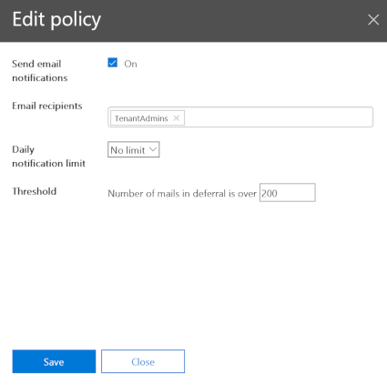
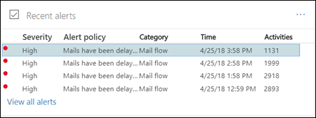

# Alertes de files d’attente et files d’attente

## Alertes de file d'attente

Lorsque des messages ne peuvent pas être envoyés de votre organisation Office 365 à vos serveurs de messagerie locaux ou partenaires à l'aide de connecteurs, les messages sont mis en file d'attente dans Office 365. Les exemples courants qui génèrent cette condition sont les suivants:

- Le connecteur est configuré de manière incorrecte.

- Des modifications de mise en réseau ou de pare-feu ont été apportées dans votre environnement local.

Office 365 continuera à nouvelle tentative de remise pendant 48 heures. Après 48 heures, les messages arriveront à expiration et seront renvoyés aux expéditeurs dans les notifications d'échec de remise (également appelées notifications de non-remise).

Si le volume de messagerie en file d'attente dépasse le seuil prédéfini (la valeur par défaut est 2000 messages), les alertes seront disponibles dans le tableau de bord du flux de messagerie dans les **alertes récentes**, et les administrateurs recevront une notification par courrier électronique (à leur adresse de messagerie alternative). . Pour configurer le seuil d'alerte, la limite de notification quotidienne et/ou les destinataires de l'alerte, consultez la section **personnaliser les alertes de file d'attente** ci-dessous.

## Personnaliser les alertes de file d'attente

Informations sur le flux de messagerie créer une stratégie d'alerte nommée les **messages ont été** retardées (la case à cocher **Envoyer des notifications par courrier électronique** dans la capture d'écran d'exemple ci-dessous) figurant dans **stratégies d'alerte**des **alertes** \> . Vous pouvez modifier les destinataires du seuil et des alertes en cliquant sur la stratégie.

Vous verrez une nouvelle Blade d'informations de stratégie, vous pouvez maintenant cliquer sur **modifier la stratégie**.

Le panneau d'informations passe à la **stratégie de modification**. Vous pouvez désormais modifier les destinataires du message d'alerte, la limite du nombre de notifications envoyées par jour et le seuil minimal de déclenchement de l'alerte (200 ou plus).

## Détails des alertes en file d'attente

Lorsque vous cliquez sur l'alerte, les détails de l'alerte s'affichent dans un volet flyout.

Vous pouvez cliquer sur **afficher la file d'attente** dans les détails de l'alerte pour voir les détails de la file d'attente, les problèmes et les liens vers les correctifs disponibles dans un nouveau volet flyout.

## Files d’attente

Même si le volume des messages mis en file d'attente n'a pas dépassé le seuil, vous pouvez toujours utiliser la zone **files d'attente** du tableau de bord du flux de messagerie pour afficher les messages qui ont été mis en file d'attente pendant plus d'une heure. Vous pouvez utiliser la zone **files d'attente** pour surveiller le nombre de messages en file d'attente (la valeur 0 indique que le flux de messagerie est correct) et prendre des mesures avant que le nombre de messages en file d'attente devienne trop important.

Lorsque vous cliquez sur le nombre de messages en file d'attente dans les **files d'attente**, les détails de la file d'attente et des instructions sur la résolution du problème apparaissent dans un volet flyout (le même menu volant qui s'affiche une fois que vous avez cliqué sur **afficher la file d'attente** dans les détails d'une alerte de file d'attente).

## Voir aussi

Pour plus d'informations sur les autres flux de messagerie dans le tableau de bord de flux de messagerie, voir [mail Flow Insights in the Security _AMP_ Compliance Center](mail-flow-insights.md).
