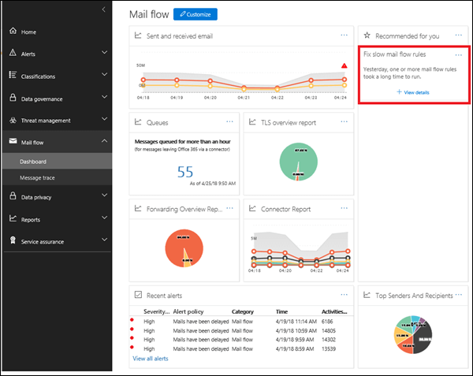
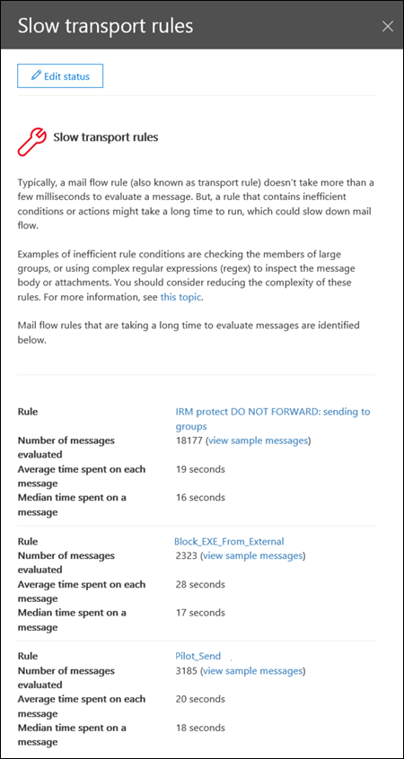

# Informations sur les règles de flux de messagerie lentSlow mail flow rules insight

Des règles inefficaces de flux de messagerie (également appelées règles de transport) peuvent entraîner des retards de flux de messagerie pour votre organisation.Inefficient mail flow rules (also known as transport rules) can lead to mail flow delays for your organization. Cette vue d'État indique les règles de flux de messagerie qui ont un impact sur le flux de messagerie de votre organisation.This insight reports mail flow rules that have an impact on your organization's mail flow. Voici des exemples de ces types de règles:Examples of these types of rules are:

- Conditions utilisées par **est membre de** pour les grands groupes.Conditions that use **Is member of** for large groups.

- Conditions qui utilisent des critères de correspondance des expressions régulières complexes (Regex).Conditions that use complex regular expression (regex) pattern matching.

- Conditions d'utilisation de l'archivage de contenu dans les pièces jointes.Conditions that use content checking in attachments.

Le centre d'analyse vous aidera à identifier et à ajuster les règles de flux de messagerie afin de réduire les délais de flux de messagerie.The insight will help you to identify and fine-tune mail flow rules to help reduce mail flow delays.

Lorsque vous cliquez sur **afficher les détails**, un volet flyout apparaît dans lequel vous pouvez examiner la règle.When you click **View details**, a flyout pane appears where you can review the rule. Dans le volet flyout, peut également cliquer sur **afficher les exemples de messages** pour voir les types de messages concernés par la règle.In the flyout pane, can also click **view sample messages** to see what kind of messages are impacted by the rule.

## Voir aussiSee also

Pour plus d'informations sur les autres flux de messagerie dans le tableau de bord de flux de messagerie, voir [mail Flow Insights in the Security _AMP_ Compliance Center](mail-flow-insights.md).For more information about other mail flow insights in the mail flow dashboard, see [Mail flow insights in the Security & Compliance Center](mail-flow-insights.md).
