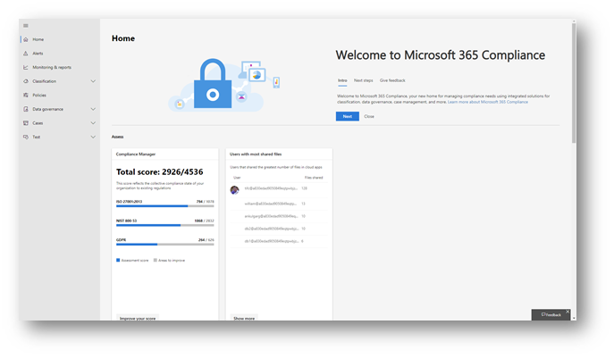
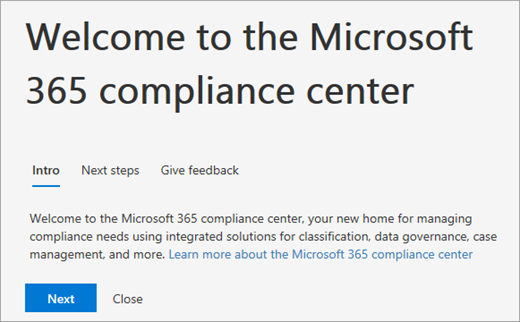
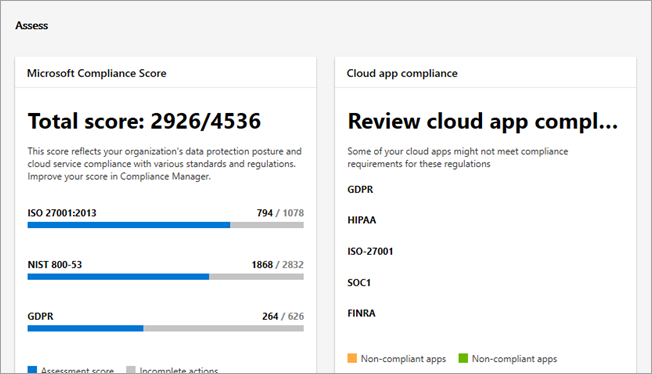
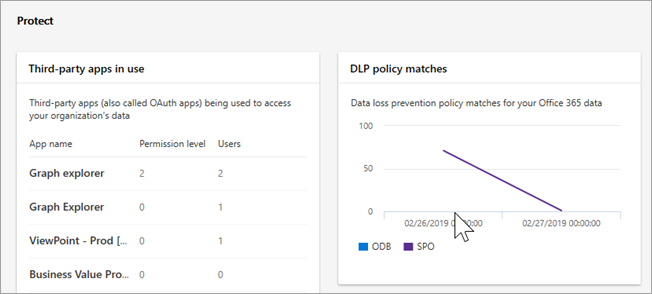
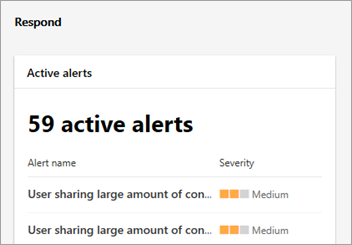
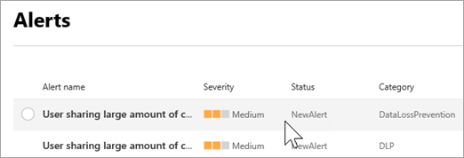
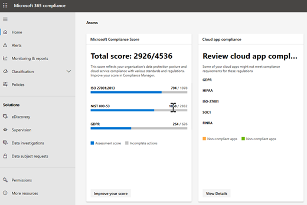

# Vue d'ensemble du nouveau centre de conformité Microsoft 365Overview of the all-new Microsoft 365 compliance center

## Vue d’ensembleOverview

Si vous êtes intéressé par la position de conformité de votre organisation, vous allez adorer le nouveau [Centre de conformité Microsoft 365](https://compliance.microsoft.com).If you're interested in your organization's compliance posture, you're going to love the new [Microsoft 365 compliance center](https://compliance.microsoft.com). Le centre de conformité Microsoft 365 offre un accès facile aux données et aux outils dont vous avez besoin pour gérer les besoins de conformité de votre organisation.The Microsoft 365 compliance center provides easy access to the data and tools you need to manage to your organization's compliance needs. 

Lisez cet article pour découvrir le centre de conformité Microsoft 365, comment l' [obtenir](#how-do-i-get-this), les [questions fréquemment posées](#frequently-asked-questions)et les [étapes suivantes](#next-steps).Read this article to get acquainted with the Microsoft 365 compliance center, [how to get it](#how-do-i-get-this), [frequently asked questions](#frequently-asked-questions), and your [next steps](#next-steps).

## Bienvenue dans la conformité Microsoft 365Welcome to Microsoft 365 compliance

Lorsque vous accédez à votre centre de conformité Microsoft 365 pour la première fois, vous recevrez le message d'accueil suivant:When you go to your Microsoft 365 compliance center for the first time, you'll be greeted with the following welcome message:

La bannière de bienvenue vous donne des conseils sur la façon de commencer, avec les étapes suivantes et une invitation pour vous permettre de nous faire part de vos commentaires.The welcome banner gives you some pointers on how to get started, with next steps and an invitation for you to give us feedback.

## Section évaluationThe Assess section

La section **évaluation** de la page d'accueil vous permet d'avoir un aperçu de la façon dont votre organisation est en relation avec la [protection et la conformité des données](protect-access-to-data-and-services.md).The **Assess** section on the home page shows you at a glance how your organization is doing with respect to [data protection and compliance](protect-access-to-data-and-services.md).

À partir de là, vous pouvez accéder à la fiche de score de conformité Microsoft, qui vous dirige vers le [Gestionnaire de conformité](meet-data-protection-and-regulatory-reqs-using-microsoft-cloud.md), dans lequel vous pouvez consulter ou modifier vos configurations et éventuellement améliorer votre score de conformité global.From here, you can go to the Microsoft Compliance Score card, which leads you to [Compliance Manager](meet-data-protection-and-regulatory-reqs-using-microsoft-cloud.md), where you can review or edit your configurations and potentially improve your overall compliance score.

Vous verrez des cartes supplémentaires, telles que l'une d'elles montrant la conformité de l'application Cloud de votre organisation et une autre qui affiche des données sur les utilisateurs avec des fichiers partagés, avec des liens vers la [sécurité des applications Cloud](https://docs.microsoft.com/cloud-app-security/) ou d'autres outils permettant d'explorer les données.You'll see additional cards, such as one showing your organization's cloud app compliance, and another showing data about users with shared files, with links to [Cloud App Security](https://docs.microsoft.com/cloud-app-security/) or other tools where you can explore data.

## La section protégerThe Protect section

La section **protéger** de la page d'accueil contient des cartes qui fournissent des informations de haut niveau sur les [étiquettes](labels.md), la [protection contre la perte de données (DLP)](data-loss-prevention-policies.md), les applications tierces en cours d'utilisation, les fichiers partagés, les applications informatiques de clichés instantanés, etc.The **Protect** section on the home page contains cards that provide you with high-level information about [labels](labels.md), [data loss prevention (DLP)](data-loss-prevention-policies.md), third-party apps in use, shared files, shadow IT apps, and so on. 

Chaque carte comporte un lien vers un rapport ou des informations supplémentaires pour en savoir plus.Each card has a link to a report or additional information where you can learn more.

## La section répondreThe Respond section

La section **répondre** sur la page d'accueil affiche les [alertes](alerts.md) et les impositions [en attente](disposition-reviews.md) que vous souhaitez examiner et sur lequel vous pouvez agir.The **Respond** section on the home page surfaces [alerts](alerts.md) and [pending dispositions](disposition-reviews.md) that you'll want to review and potentially act upon.

Les cartes, telles que la carte des [alertes actives](alerts.md) , comportent un lien vers une page où vous pouvez afficher des informations plus détaillées, telles que la gravité, l'État, la catégorie, et bien plus encore.Cards, such as the [Active alerts](alerts.md) card, include a link to a page where you can view more detailed information, such as Severity, Status, Category, and more.

 

## Navigation facile vers des fonctionnalités et des fonctionnalités de conformité supplémentairesEasy navigation to more compliance features and capabilities

Outre les liens des cartes sur la page d'accueil, vous trouverez un volet de navigation sur le côté gauche de l'écran qui vous permet d'accéder facilement à vos [alertes](alerts.md), [rapports](reports-in-security-and-compliance.md), [stratégies](alert-policies.md), solutions de conformité et bien plus encore.In addition to links in cards on the home page, you'll find a navigation pane on the left side of the screen that gives you easy access to your [alerts](alerts.md), [reports](reports-in-security-and-compliance.md), [policies](alert-policies.md), compliance solutions, and more. 

|  |  |
|---------|---------|
|  |   Accéder aux **alertes** pour afficher et résoudre les [alertes](alerts.md)Go to **Alerts** to view and resolve [alerts](alerts.md)  Consultez la rubrique **monitorIng &** Reports pour afficher les données sur [l'utilisation et](sensitivity-labels.md)la rétention des étiquettes, les [correspondances et les remplacements de stratégies DLP](view-the-dlp-reports.md), les [fichiers partagés](https://docs.microsoft.com/cloud-app-security/file-filters), les [applications tierces en cours d'utilisation](https://docs.microsoft.com/cloud-app-security/discovered-apps), et bien plus encore.Visit **Monitoring & reports** to view data about [label usage and retention](sensitivity-labels.md), [DLP policy matches and overrides](view-the-dlp-reports.md), [shared files](https://docs.microsoft.com/cloud-app-security/file-filters), [third-party apps in use](https://docs.microsoft.com/cloud-app-security/discovered-apps), and more.  Développez la section **classification** pour accéder à vos [étiquettes](labels.md), [stratégies d'étiquette](sensitivity-labels.md#what-label-policies-can-do), [types d'informations sensibles](what-the-sensitive-information-types-look-for.md)et [analyse d'étiquette](view-label-activity-for-documents.md).Expand the **Classification** section to access your [labels](labels.md), [label policies](sensitivity-labels.md#what-label-policies-can-do), [sensitive information types](what-the-sensitive-information-types-look-for.md), and [label analytics](view-label-activity-for-documents.md).  Accédez à **stratégies** pour afficher les [alertes](alerts.md) et accéder à vos stratégies [DLP](data-loss-prevention-policies.md) et de rétention. Go to **Policies** to view [alerts](alerts.md) and to access your [DLP](data-loss-prevention-policies.md) and [retention](retention-policies.md) policies.   Utilisez les liens de la section **solutions** pour accéder aux solutions de conformité de votre organisation.Use the links in the **Solutions** section to access your organization's compliance solutions. Ces approches sont les suivantes :These include:  [Impositions > de gouvernance des donnéesData governance > Dispositions](disposition-reviews.md) [eDiscovery (aperçu)eDiscovery (preview)](compliance20/overview-ediscovery-20.md) [SupervisionSupervision](supervision-policies.md) [Enquêtes de donnéesData investigations](datainvestigations/overview-data-investigations.md) [Demandes des personnes concernéesData subject requests](manage-gdpr-data-subject-requests-with-the-dsr-case-tool.md)        |

## Comment puis-je obtenir cela?How do I get this?

- Si vous n'avez pas encore le nouveau centre de conformité Microsoft 365, vous en aurez bientôt.If you don't have the new Microsoft 365 compliance center already, you will have it soon. Le [nouveau centre de conformité Microsoft 365](microsoft-security-and-compliance.md#microsoft-365-compliance-center) sera disponible dès à présent.The [new Microsoft 365 compliance center](microsoft-security-and-compliance.md#microsoft-365-compliance-center) will be generally available now.

- Pour visiter le centre de conformité Microsoft 365, en tant qu'administrateur général ou administrateur de conformité [https://compliance.microsoft.com](https://compliance.microsoft.com) , accédez à et connectez-vous.To visit the Microsoft 365 compliance center, as a global administrator or compliance administrator, go to [https://compliance.microsoft.com](https://compliance.microsoft.com) and sign in. 

- Pour en savoir plus sur les conditions requises, consultez la rubrique [Required licenses and](microsoft-security-and-compliance.md#required-licenses-and-permissions)Permissions.To learn more about requirements, see [Required licenses and permissions](microsoft-security-and-compliance.md#required-licenses-and-permissions).

## Questions fréquemment poséesFrequently asked questions

### Pourquoi est-ce que j'ai adopté le centre de sécurité & Office 365 pour effectuer certaines tâches, telles que la définition de certaines stratégies?Why am I taken to the Office 365 Security & Compliance Center to perform some tasks, such as defining certain policies?

Nous développons toujours le centre de conformité Microsoft 365 et nous ajoutons davantage de fonctionnalités et de solutions au cours des prochains mois.We are still developing the Microsoft 365 compliance center, and we'll be adding more functionality and solutions over the coming months. En attendant, certaines tâches doivent être effectuées dans le centre de sécurité & de la sécurité d'Office 365 ([https://protection.office.com](https://protection.office.com)).In the meantime, there are some tasks that must be performed in the Office 365 Security & Compliance Center ([https://protection.office.com](https://protection.office.com)). Dans ce cas, vous serez dirigé automatiquement vers l'emplacement où vous pouvez effectuer la tâche, telle que la création ou la modification d'une stratégie de surveillance.In those cases, you'll be directed automatically to the location where you can perform the task at hand, such as creating or editing a supervision policy.

### Pourquoi ne puis-je pas encore voir le nouveau centre de conformité Microsoft 365?Why don't I see the new Microsoft 365 compliance center yet?

Tout d'abord, vérifiez que vous disposez des [autorisations et des licences](microsoft-security-and-compliance.md#required-licenses-and-permissions)appropriées.First, make sure you have the appropriate [licenses and permissions](microsoft-security-and-compliance.md#required-licenses-and-permissions). Ensuite, connectez-vous [https://compliance.microsoft.com](https://compliance.microsoft.com)à l'adresse.Then, sign in at [https://compliance.microsoft.com](https://compliance.microsoft.com). Si vous ne voyez pas le nouveau centre de conformité, vous en aurez bientôt terminé.If you don't see the new compliance center yet, you will have it soon.

### Je ne parviens pas à trouver certains de mes paramètres de conformité.I can't find some of my compliance settings. What do I do?What do I do?

Nous ajoutons toujours des fonctionnalités au centre de conformité Microsoft 365.We are still adding functionality to the Microsoft 365 compliance center. Si vous ne trouvez pas de contenu, tel que la recherche de journal d'audit, essayez d'accéder au centre de sécurité[https://protection.office.com](https://protection.office.com)_AMP_ de sécurité Office 365 ().If you can't find something, such as audit log search, try navigating to the Office 365 Security & Compliance Center ([https://protection.office.com](https://protection.office.com)). Vos configurations seront enregistrées dans le centre de sécurité & Office 365 et dans le nouveau centre de conformité Microsoft 365 automatiquement.Your configurations will be saved in both the existing Office 365 Security & Compliance Center and in the new Microsoft 365 compliance center automatically.

## Étapes suivantesNext steps

- **Examinez votre score de conformité Microsoft**et utilisez le gestionnaire de conformité pour améliorer votre score.**Review your Microsoft Compliance Score**, and use Compliance Manager to improve your score. Pour en savoir plus, consultez [la rubrique utiliser le gestionnaire de conformité pour répondre aux exigences réglementaires et de protection des données lors de l'utilisation des services Cloud Microsoft](meet-data-protection-and-regulatory-reqs-using-microsoft-cloud.md).To learn more, see [Use Compliance Manager to help meet data protection and regulatory requirements when using Microsoft cloud services](meet-data-protection-and-regulatory-reqs-using-microsoft-cloud.md).

- **Examinez les stratégies de protection contre la perte de données de votre organisation** et effectuez les ajustements nécessaires.**Review your organization's Data Loss Prevention policies** and make required adjustments as necessary. Pour en savoir plus sur, consultez la rubrique [vue d'ensemble des stratégies de protection contre la perte de données](data-loss-prevention-policies.md).To learn more about, see [Overview of data loss prevention policies](data-loss-prevention-policies.md). 

- Familiarisez-vous **avec la sécurité des applications Cloud de Microsoft et**configurez-la.**Get acquainted with and set up Microsoft Cloud App Security**. Voir [démarrage rapide: prise en main de la sécurité des applications Cloud Microsoft](https://docs.microsoft.com/cloud-app-security/getting-started-with-cloud-app-security).See [Quickstart: Get started with Microsoft Cloud App Security](https://docs.microsoft.com/cloud-app-security/getting-started-with-cloud-app-security).  

- **Consultez régulièrement votre centre de conformité Microsoft 365**et assurez-vous de consulter les alertes ou les risques potentiels susceptibles de se produire.**Visit your Microsoft 365 compliance center often**, and make sure to review any alerts or potential risks that might arise. Accédez à [https://compliance.microsoft.com](https://compliance.microsoft.com) et connectez-vous.Go to [https://compliance.microsoft.com](https://compliance.microsoft.com) and sign in.