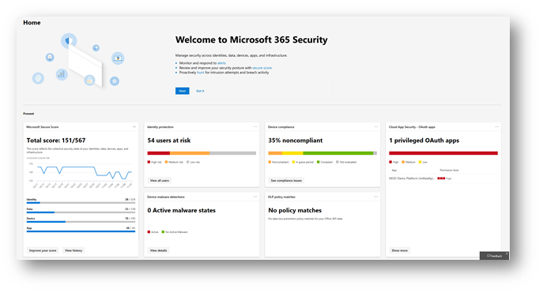

# Le nouveau centre de sécurité Microsoft 365 et le centre de conformité Microsoft 365 sont désormais généralement disponiblesThe new Microsoft 365 security center and Microsoft 365 compliance center are now generally available

**Nous avons le plaisir de vous annoncer que le nouveau centre de [sécurité Microsoft 365](#microsoft-365-security-center) et le [centre de conformité Microsoft 365](#microsoft-365-compliance-center)** sont désormais généralement disponibles.**We are pleased to announce that the all-new [Microsoft 365 security center](#microsoft-365-security-center) and [Microsoft 365 compliance center](#microsoft-365-compliance-center)**, are now generally available. Lisez cet article pour obtenir une vue d'ensemble des nouveautés, des [éléments à prévoir](#what-to-expect)et des [licences et autorisations requises](#required-licenses-and-permissions).Read this article to get an overview of what's new, [what to expect](#what-to-expect), and [required licenses and permissions](#required-licenses-and-permissions).

## Centre de sécurité Microsoft 365Microsoft 365 security center

Votre nouveau [Centre de sécurité Microsoft 365](overview-security-center.md) inclut un tableau de bord pour vous aider à gérer et à surveiller la sécurité de vos identités, données, périphériques, applications et infrastructure.Your new [Microsoft 365 security center](overview-security-center.md) includes a dashboard to help you manage and monitor security across your identities, data, devices, apps, and infrastructure. Vous pouvez également accéder facilement à votre nouveau score de sécurité [Microsoft](microsoft-secure-score.md), aux rapports sur les menaces de nouveaux appareils, aux rapports sur les menaces d'identité et aux rapports de sécurité de vos applications Cloud.You will also have easy access to your all-new [Microsoft Secure Score](microsoft-secure-score.md), new device threat reports, new identity threat reports, and your Cloud App Security reports. 

Lorsque vous utilisez le centre de sécurité Microsoft 365 pour la première fois, des informations s'affichent dans la partie supérieure de l'écran pour vous aider à commencer.When you use the Microsoft 365 security center for the first time, you'll see information across the top of the screen to help you get started. Vous verrez également comment naviguer facilement dans les fonctionnalités de sécurité que vous souhaitez explorer.You'll also see how to navigate easily to the security features you're most interested in exploring. Pour plus d'informations, reportez-vous à [la rubrique vue d'ensemble du centre de sécurité Microsoft 365](overview-security-center.md).To learn more, see [Overview of the Microsoft 365 security center](overview-security-center.md).

Vous serez en mesure d'accéder au centre de sécurité Microsoft 365 [https://security.microsoft.com](https://security.microsoft.com)à l'adresse.You will be able to access the Microsoft 365 security center at [https://security.microsoft.com](https://security.microsoft.com). 

> [!NOTE]
> Vous devez disposer d'un rôle Azure Active Directory valide pour accéder au centre de sécurité Microsoft 365.You must be assigned a valid Azure Active Directory role to access the Microsoft 365 security center. Pour plus d'informations, reportez-vous à la section [licences et autorisations requises](#required-licenses-and-permissions) (dans cet article).To learn more, see the [Required licenses and permissions](#required-licenses-and-permissions) section (in this article).

## Centre de conformité Microsoft 365Microsoft 365 compliance center

Votre nouveau [Centre de conformité microsoft 365](microsoft-365-compliance-center.md) vous offre une visibilité sur le gestionnaire de conformité Microsoft, qui reflète votre position globale de conformité et vous propose des actions recommandées pour vous aider à configurer les paramètres afin de répondre à une conformité complexe. résultant.Your new [Microsoft 365 compliance center](microsoft-365-compliance-center.md) provides you with visibility into Microsoft Compliance Manager, which reflects your overall compliance posture and gives you recommended actions to help you configure settings to meet complex compliance obligations. 

Vous aurez accès facilement aux étiquettes et stratégies de rétention, à la protection contre la perte de données (DLP), à la gouvernance des données, à la découverte électronique, aux demandes des personnes associées aux données (DSR), à la gestion des cas et à la sécurité des applications Cloud.You’ll have easy access to sensitivity and retention labels and policies, data loss prevention (DLP), data governance, eDiscovery, data subject requests (DSRs), case management, and Cloud App Security. En outre, vous pouvez obtenir des informations pertinentes et utiliser l'automatisation intelligente pour réduire vos risques de conformité et protéger votre patrimoine numérique.Additionally, you can gain actionable insights and leverage intelligent automation to reduce your compliance risks and safeguard your digital estate. 

Lorsque vous utilisez le centre de conformité Microsoft 365 pour la première fois, des informations s'affichent dans la partie supérieure de l'écran pour vous aider à commencer.When you use the Microsoft 365 compliance center for the first time, you'll see information across the top of the screen to help you get started. Vous verrez comment naviguer facilement dans les fonctionnalités de conformité que vous êtes le plus à même d'explorer.You'll see how to navigate easily to the compliance features you're most interested in exploring. Pour en savoir plus, consultez [la page Bienvenue dans votre nouveau centre de conformité Microsoft 365](microsoft-365-compliance-center.md).To learn more, see [Welcome to your all-new Microsoft 365 compliance center](microsoft-365-compliance-center.md).

Vous pouvez accéder au centre de conformité Microsoft 365 à l' [https://compliance.microsoft.com](https://compliance.microsoft.com)adresse.You will be to access the Microsoft 365 compliance center at [https://compliance.microsoft.com](https://compliance.microsoft.com).  

> [!NOTE]
> Vous devez disposer d'un rôle Azure Active Directory valide pour accéder au centre de conformité Microsoft 365.You must be assigned a valid Azure Active Directory role to access the Microsoft 365 compliance center. Pour plus d'informations, reportez-vous à la section [licences et autorisations requises](#required-licenses-and-permissions) (dans cet article).To learn more, see the [Required licenses and permissions](#required-licenses-and-permissions) section (in this article).

## À quoi s'attendreWhat to expect

### Disponibilité générale!General availability!

Le nouveau centre de sécurité Microsoft 365 et le nouveau centre de conformité Microsoft 365 sont désormais généralement disponibles à la fin du 2019 mars.The new Microsoft 365 security center and the new Microsoft 365 compliance center are now generally available at the end of March 2019. Si ce n'est pas déjà fait, vous devez avoir accès au nouveau centre de sécurité Microsoft 365 et au centre de conformité Microsoft 365 très prochainement.If you don't have this already, you should have access to the new Microsoft 365 security center and Microsoft 365 compliance center very soon.

### Accès facileEasy access!

Avec une navigation améliorée, des solutions intégrées et une expérience rationalisée, vous serez en mesure de voir et d'accéder aux informations qui vous intéressent le plus et de tirer parti des puissantes solutions de sécurité et de conformité dans Microsoft 365.With improved navigation, integrated solutions, and a streamlined experience, you'll be able to see and access the information you're most interested in and take advantage of the powerful security and compliance solutions in Microsoft 365.

### Transition en douceur!Smooth transition!

Vous pouvez vous attendre à une transition progressive vers les nouveaux centres.You can expect a smooth transition to the new centers. Une fois cette modification entièrement déployée, nous prévoyons de retirer l'ancien centre de sécurité & de Microsoft 365[https://protection.microsoft.com](https://protection.microsoft.com)().After this change is fully rolled out, we plan to retire the former Microsoft 365 Security & Compliance Center ([https://protection.microsoft.com](https://protection.microsoft.com)). L'expérience de l'administrateur change, mais cela n'a pas d'impact sur vos configurations de sécurité et de conformité actuelles.The administrator experience will change, but this won’t impact your current security and compliance configurations.

Une fois que cette mise à jour est déployée, si votre organisation a Microsoft 365 entreprise E3 ou E5, vos administrateurs de sécurité et de conformité peuvent:After this update is rolled out, if your organization has Microsoft 365 Enterprise E3 or E5, your security and compliance administrators can:

- Accédez directement à [https://security.microsoft.com](https://security.microsoft.com) et [https://compliance.microsoft.com](https://compliance.microsoft.com);Navigate directly to [https://security.microsoft.com](https://security.microsoft.com) and [https://compliance.microsoft.com](https://compliance.microsoft.com);  ouor  
- Accédez au centre d'administration Microsoft 365, puis accédez au nouveau centre de sécurité Microsoft 365 et au centre de conformité Microsoft 365 (les liens se trouvent sous centres d'administration dans le volet de navigation de gauche).Go to the Microsoft 365 admin center, and then navigate to the new Microsoft 365 security center and Microsoft 365 compliance center (links are under Admin Centers in the left navigation pane).

> [!TIP]
> Si vous utilisez le centre de sécurité & conformité d'Office 365[https://protection.office.com](http://protection.office.com)(), vous pourrez toujours configurer et gérer vos paramètres Office 365 dans votre centre de sécurité & conformité existant.If you are using the Office 365 Security & Compliance Center ([https://protection.office.com](http://protection.office.com)), you will still be able to configure and manage your Office 365 settings within your existing Security & Compliance Center. Les configurations seront conservées dans le centre de sécurité &, ainsi que dans le nouveau centre de sécurité Microsoft 365 et le centre de conformité Microsoft 365.Configurations will be maintained in the existing Security & Compliance Center as well as in the new Microsoft 365 security center and Microsoft 365 compliance center.  

## Licences et autorisations requisesRequired licenses and permissions

### LicencesLicenses

Pour obtenir le nouveau centre de sécurité Microsoft 365 et le centre de conformité Microsoft 365, votre organisation doit disposer d'un abonnement à Microsoft 365 E3 ou E5, ou un équivalent de licence en volume (qui se compose d'Office 365 entreprise E3 ou E5, Enterprise Mobility + Security E3 ou E5, et Windows 10 entreprise E3/E5).To get the new Microsoft 365 security center and Microsoft 365 compliance center, your organization must have a subscription to Microsoft 365 E3 or E5, or a Volume Licensing equivalent (which consists of Office 365 Enterprise E3 or E5, Enterprise Mobility + Security E3 or E5, and Windows 10 Enterprise E3/E5). Pour en savoir plus sur ces offres, consultez [la rubrique Découvrez la solution Microsoft 365 Enterprise qui vous convient](https://www.microsoft.com/microsoft-365/compare-all-microsoft-365-plans).To learn more about these plans, see [Discover the Microsoft 365 Enterprise solution that’s right for you](https://www.microsoft.com/microsoft-365/compare-all-microsoft-365-plans).

### Rôles et autorisationsRoles and permissions

Les utilisateurs doivent se voir attribuer le rôle administrateur général, administrateur de conformité, administrateur des données de conformité, administrateur de sécurité, opérateur de sécurité ou lecteur de sécurité dans Azure Active Directory pour accéder au nouveau centre de sécurité Microsoft 365 ou Centre de conformité Microsoft 365.Users must be assigned the Global Administrator, Compliance Administrator, Compliance Data Administrator, Security Administrator, Security Operator, or Security Reader role in Azure Active Directory to access the new Microsoft 365 security center or Microsoft 365 compliance center.

- Les administrateurs globaux peuvent accéder au centre de sécurité et au centre de conformitéGlobal Administrators can access both the security center and the compliance center

- Administrateurs de conformité les administrateurs de données de conformité peuvent accéder au centre de conformitéCompliance Administrators and Compliance Data Administrators can access the compliance center

- Les administrateurs de sécurité, les opérateurs de sécurité et les lecteurs de sécurité peuvent accéder au centre de sécuritéSecurity Administrators, Security Operators, and Security Readers can access the security center

Le tableau suivant résume qui peut accéder à différents portails dans Azure, Office 365 et Windows:The following table summarizes who can access various portals across Azure, Office 365, and Windows:

|PortailPortal |Administrateur généralGlobal Administrator |Administrateur de sécurité, opérateur de sécurité ou lecteur de sécuritéSecurity Administrator, Security Operator, or Security Reader|Administrateur de conformité ou administrateur de données de conformitéCompliance  Administrator or Compliance Data Administrator |
|---------|---------|---------|---------|
|[Centre de sécurité & conformitéSecurity & Compliance Center](https://protection.office.com) |OuiYes |OuiYes  |OuiYes |
|[Centre de sécurité Microsoft 365Microsoft 365 security center](https://security.microsoft.com) |OuiYes  | OuiYes  | NonNo        |
|[Centre de conformité Microsoft 365Microsoft 365 compliance center](https://compliance.microsoft.com) | OuiYes | NonNo | OuiYes |
|[Gestionnaire de conformitéCompliance Manager](https://aka.ms/compliancemanager) |OuiYes | OuiYes |OuiYes  |
|[Azure Information ProtectionAzure Information Protection](https://docs.microsoft.com/azure/information-protection) |OuiYes |OuiYes |NonNo |
|[Azure Security CenterAzure Security Center](https://docs.microsoft.com/azure/security-center/)  |OuiYes |OuiYes |NonNo |
|[Protection avancée contre les menacesAzure Advanced Threat Protection](https://docs.microsoft.com/azure-advanced-threat-protection/what-is-atp)  |OuiYes |OuiYes |NonNo |
|[Windows Defender ATPWindows Defender ATP](https://docs.microsoft.com/windows/security/threat-protection/windows-defender-atp/windows-defender-advanced-threat-protection?ocid=tia-260153000#windows-defender-atp) |OuiYes |OuiYes |NonNo |
|[Protection des identitésIdentity Protection](https://docs.microsoft.com/azure/active-directory/identity-protection)     |OuiYes |OuiYes |NonNo |
|[Privileged Identity ManagementPrivileged Identity Management](https://docs.microsoft.com/azure/active-directory/privileged-identity-management)     |OuiYes |OuiYes |NonNo |
|[IntuneIntune](https://docs.microsoft.com/intune)     |OuiYes |OuiYes |OuiYes |
|[Cloud App SecurityCloud App Security](https://docs.microsoft.com/cloud-app-security/)     |OuiYes |OuiYes |OuiYes |
|[Secure ScoreSecure Score](https://docs.microsoft.com/office365/securitycompliance/office-365-secure-score)     |OuiYes |OuiYes |NonNo |
|[ExchangeExchange](https://docs.microsoft.com/exchange/)     |OuiYes |OuiYes |OuiYes |

## Ressources supplémentairesAdditional resources

[Feuille de route Microsoft 365Microsoft 365 roadmap](https://www.microsoft.com/microsoft-365/roadmap)

