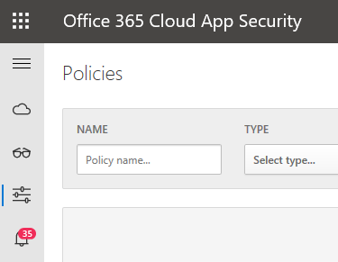
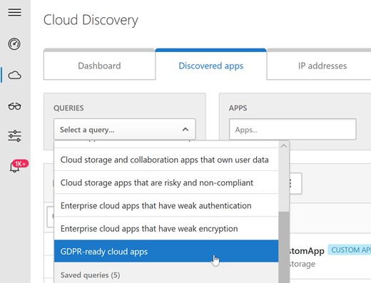
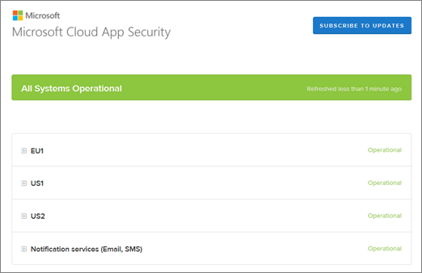

# Mises à jour de sécurité des applications Cloud Office 365 pendant 2018

## Office 365 Cloud App Security version 138

*Publication du 23 décembre 2018*

**Suivi de la [version 138 de Microsoft Cloud App Security](https://docs.microsoft.com/cloud-app-security/release-notes#cloud-app-security-release-138)**:

- **Chargement de journal automatique à l'aide de docker sur Windows** La sécurité des applications Cloud prend désormais en charge le téléchargement automatique des journaux pour Windows 10 ([automne Creators Update](https://docs.microsoft.com/windows/whats-new/whats-new-windows-10-version-1709) et versions ultérieures) et Windows Server ([version 1709](https://docs.microsoft.com/windows-server/get-started/whats-new-in-windows-server-1709) et ultérieures) à l'aide de docker sur Windows. Consultez [cet article](https://docs.microsoft.com/cloud-app-security/discovery-docker-windows) pour en savoir plus et configurer le docker.  

- **Intégration de flux Microsoft** La sécurité des applications Cloud s'intègre désormais à [Microsoft Flow](https://docs.microsoft.com/flow/getting-started) pour fournir des règles d'automatisation et d'orchestration des alertes personnalisées. Consultez [cet article](https://docs.microsoft.com/cloud-app-security/flow-integration) pour en savoir plus et configurer l'intégration du flux Microsoft. 

## Office 365 Cloud App Security version 137

*Publié le 8 décembre 2018*

**Suivi de la [version 137 de Microsoft Cloud App Security](https://docs.microsoft.com/cloud-app-security/release-notes#cloud-app-security-release-137)**:

- **Prise en charge supplémentaire de Dynamics** La sécurité des applications Cloud inclut désormais la prise en charge des activités Microsoft Dynamics prises en charge dans le journal d'audit Office 365. 

- La **nouvelle terminologie!** Le nom des fonctionnalités d'autorisations d'application a été modifié pour plus de clarté: il est maintenant appelé applications OAuth. 

## Office 365 Cloud App Security version 136

*Publié le 25 novembre 2018*

**Suivi de la [version 136 de Microsoft Cloud App Security](https://docs.microsoft.com/cloud-app-security/release-notes#cloud-app-security-release-136)**:

- **Mises à jour** de la découverte du Cloud L'analyseur de journal personnalisé a été amélioré pour prendre en charge des formats de journaux de trafic Web supplémentaires et plus complexes. Dans le cadre de ces améliorations, les utilisateurs peuvent désormais entrer des en-têtes personnalisés pour les fichiers journaux CSV sans en-tête, utiliser des délimiteurs spéciaux pour les fichiers de valeurs clés, traiter le format de fichier syslog, et bien plus encore.

- **Nouvelle stratégie de détection d'anomalies: règles de manipulation de boîte de réception suspectes** Cette stratégie Profile votre environnement et déclenche des alertes lorsque des règles suspectes qui suppriment ou déplacent des messages ou des dossiers sont définies dans la boîte de réception d'un utilisateur. Cela peut indiquer que le compte de l'utilisateur est compromis, que les messages sont intentionnellement masqués et que la boîte aux lettres est utilisée pour distribuer le courrier indésirable ou les programmes malveillants dans votre organisation.

- **Prise en charge des groupes dans les stratégies d'autorisation de l'application** La sécurité des applications Cloud vous donne désormais la possibilité de définir des stratégies d'autorisation de l'application de façon plus précise, en fonction de l'appartenance aux groupes des utilisateurs qui ont autorisé les applications. Par exemple, un administrateur peut décider de définir une stratégie qui révoque les applications peu courantes s'il demande des autorisations élevées, uniquement si l'utilisateur qui a autorisé les autorisations est membre du groupe administrateurs.

## Versions Office 365 Cloud App Security Release 133, 134 et 135

*Publié en octobre-novembre, 2018*

À la **suite de [Microsoft Cloud App Security version 133, 134 et 135](https://docs.microsoft.com/cloud-app-security/release-notes#cloud-app-security-release-133-134-135)**:

- Les **nouvelles stratégies de détection** d'anomalies se dérouleront graduellement:
    
    - La nouvelle stratégie **de données d'infiltration vers les applications** non sanctionnées est automatiquement activée pour vous avertir lorsqu'un utilisateur ou une adresse IP utilise une application qui n'est pas sanctionnée par une tentative d'exfiltre des informations à partir de votre organisation.
    
    - La nouvelle stratégie de **Suppression de plusieurs** machines virtuelles Profile votre environnement et déclenche des alertes lorsque les utilisateurs suppriment plusieurs machines virtuelles dans une seule session, par rapport à la ligne de base de votre organisation.

- **Prise en charge de la détection sur le Cloud pour i-Filter** La fonctionnalité de découverte du Cloud de sécurité des applications Cloud offre désormais une meilleure prise en charge du parseur syslog i-Filter.

## Office 365 Cloud App Security version 131

*Publié le 16 septembre 2018*

**Suivi de la [version 131 de Microsoft Cloud App Security](https://docs.microsoft.com/cloud-app-security/release-notes#cloud-app-security-release-131)**:

- **RévoquEr automatiquement les autorisations sur les applications OAuth risquées** Vous pouvez maintenant contrôler les applications OAuth auxquelles vos utilisateurs ont accès, en révoquant l'autorisation App pour les applications OAuth sur Office. Lors de la création d'une stratégie d'autorisation d'application, vous pouvez définir la stratégie pour révoquer l'autorisation d'une application.

- **Découverte du Cloud-analyseur intégré supplémentaire pris en charge** La découverte du Cloud prend désormais en charge le format de journal du Cloud de sécurité Web Forcepoint.
  
## Office 365 Cloud App Security version 130

*Publié le 5 septembre 2018*

**Suivi de la [version 130 de Microsoft Cloud App Security](https://docs.microsoft.com/cloud-app-security/release-notes#cloud-app-security-release-130)**:

- **Nouvelle barre de menus** Pour offrir une expérience d'administration plus cohérente sur les produits Microsoft 365 et pour faciliter le déplacement entre les solutions de sécurité Microsoft, la barre de menus du portail de sécurité des applications Cloud a été déplacée vers le côté gauche de l'écran. Cette expérience de navigation cohérente vous aide à vous orienter lors du passage d'un portail de sécurité Microsoft à un autre.  

- **Score d'application OAuth d'impact** Vous pouvez désormais envoyer les commentaires de l'équipe de sécurité des applications Cloud pour nous indiquer si une application OAuth découverte dans votre organisation semble malveillante. Cette nouvelle fonctionnalité vous permet de faire partie de notre communauté de sécurité et d'améliorer le score de risque et l'analyse des applications OAuth. Pour plus d'informations, consultez la rubrique [gérer les applications OAuth](manage-app-permissions-in-ocas.md).

- **Nouveaux analyseUrs de découverte du Cloud** Les analyseurs de découverte du Cloud prennent désormais en charge iboss Secure Cloud Gateway et Sophos XG.

## Office 365 Cloud App Security version 128

*Publié le 5 août 2018* 
  
**Suivi de la [version 128 de Microsoft Cloud App Security](https://docs.microsoft.com/cloud-app-security/release-notes#cloud-app-security-release-128)**: 
  
- **Applications OAuth sur plusieurs applications** Pour les applications OAuth, vous pouvez désormais bloquer ou approuver plusieurs applications en une seule action. Par exemple, vous pouvez passer en revue toutes les applications qui bénéficient de l'autorisation des utilisateurs de votre organisation, sélectionner toutes les applications que vous souhaitez interdire, puis cliquer sur interdire les applications pour révoquer tout consentement accordé et ne pas autoriser les utilisateurs à accorder des autorisations à ces applications. Pour en savoir plus, consultez la rubrique [gérer les applications OAuth à l'aide d'Office 365 Cloud App Security](manage-app-permissions-in-ocas.md). 
    
- **Nouvelle requête suggérée: applications Cloud RGPD prêtes** Il existe une nouvelle requête proposée pour vous permettre d'identifier les applications découvertes qui sont RGPD prêtes. Comme vous le savez probablement déjà, RGPD a récemment été devenu une priorité pour les administrateurs de la sécurité. Cette requête vous permet d'identifier facilement les applications qui sont prêtes à l'emploi et de limiter les menaces en évaluant le risque des applications qui ne le sont pas. Pour utiliser la nouvelle requête, dans le tableau de bord de **découverte du Cloud** , sous l'onglet **applications découvertes** , sélectionnez **requêtes** > **RGPD Ready Apps Cloud Apps**.  
    
## Office 365 Cloud App Security version 126

*Publié le 7 juillet 2018* 
  
**Suivi de la [version 126 de Microsoft Cloud App Security](https://docs.microsoft.com/cloud-app-security/release-notes#cloud-app-security-release-126)**: 
  
- **Correction automatisée des activités suspectes** Vous pouvez désormais définir des actions de correction automatique pour une session suspecte déclenchée par les stratégies de détection des anomalies. Cette amélioration vous permet d'être alerté instantanément en cas de violation et d'appliquer les actions de gouvernance automatiquement, telles que l'interruption de l'utilisateur. Pour plus d'informations, consultez la rubrique relative aux [stratégies de détection des anomalies dans Office 365 Cloud App Security](anomaly-detection-policies-in-ocas.md).
    
- **Détection automatisée des applications OAuth risquées** En plus de l'enquête existante sur les applications OAuth connectées à votre environnement, la sécurité des applications Cloud Office 365 vous permet de définir des notifications automatiques pour vous informer lorsqu'une application OAuth répond à certains critères. Par exemple, vous pouvez automatiquement être alerté lorsqu'il existe des applications qui nécessitent un niveau d'autorisation élevé et qu'elles ont été approuvées par plus de 50 utilisateurs. Pour plus d'informations, consultez la rubrique [Manage OAuth Apps using Office 365 Cloud App Security](manage-app-permissions-in-ocas.md).
    
- **Prise en charge de la gestion des fournisseurs de services de sécurité (MSSP)** Office 365 Cloud App Security offre désormais une meilleure expérience de gestion à MSSP, et vous permet de configurer des partenaires externes en tant qu'administrateurs avec n'importe quel rôle actuellement disponible dans Office 365 Cloud App Security. En outre, les administrateurs disposant de droits d'accès à plusieurs clients peuvent désormais facilement pivoter entre les clients. 
    
## Office 365 Cloud App Security version 124

*Publié le 10 juin 2018* 
  
**Suivi de la [version 124 de Microsoft Cloud App Security](https://docs.microsoft.com/cloud-app-security/release-notes#cloud-app-security-release-124)**: 
  
- **Déploiements** délimités Les organisations d'entreprise peuvent déterminer de façon précise les utilisateurs à surveiller et à protéger en fonction de l'appartenance à un groupe. Cette fonctionnalité vous permet de sélectionner les utilisateurs dont les activités ne s'afficheront pas pour les applications protégées. La surveillance étendue est particulièrement utile pour la conformité et les licences. Certaines réglementations nécessitent de ne pas surveiller les utilisateurs de certains pays en raison de la réglementation locale. De plus, vous pouvez surveiller moins d'utilisateurs pour rester au sein des limites de vos licences de sécurité d'application Cloud Office 365. 
    
- **Nouveau serveur de messagerie** Le serveur de messagerie pour Office 365 Cloud App Security a changé et utilise des plages d'adresses IP différentes. Pour vous assurer que vous pouvez obtenir des notifications, ajoutez les nouvelles adresses IP à votre liste de blocage du courrier indésirable. Pour les organisations qui personnalisent leurs notifications, la sécurité des applications Cloud vous permet d'utiliser MailChimp, un service de messagerie tiers. Pour obtenir la liste des adresses IP de serveur de messagerie et des instructions permettant d'activer le travail avec MailChimp, consultez la rubrique [Network Requirements (Microsoft Cloud App Security)](https://docs.microsoft.com/cloud-app-security/network-requirements) et [mail Settings (Microsoft Cloud App Security)](https://docs.microsoft.com/cloud-app-security/mail-settings).
    
## Office 365 Cloud App Security version 121

*Publié le 6 mai 2018* 
  
**Suivi de la [version 121 de Microsoft Cloud App Security](https://docs.microsoft.com/cloud-app-security/release-notes#cloud-app-security-release-121)**: 
  
- **Améliorations des stratégies de détection**des anomalies. Les stratégies de détection des anomalies de la sécurité des applications Cloud d'Office 365 ont été améliorées pour inclure deux nouveaux types de détection de menaces qui sont progressivement déployés: 
    
  - **Activité de ransomware.** Les fonctionnalités de détection de ransomware sont étendues avec une détection d'anomalie afin de vous offrir une couverture plus complète contre les attaques de ransomware. 
    
  - **Activité de l'utilisateur arrêtée.** L'activité utilisateur terminée vous permet de surveiller les comptes des utilisateurs qui ont été désactivés à partir des applications d'entreprise, mais qui peuvent toujours avoir accès à certaines ressources d'entreprise. 
    
    pour afficher vos [stratégies de détection](anomaly-detection-policies-in-ocas.md)d'anomalies, dans le portail de sécurité des applications Cloud Office 365, sélectionnez **contrôler** \> les **stratégies**.
    
## Office 365 Cloud App Security version 120

*Publié le 22 avril 2018* 
  
**Suivi de la [version 120 de Microsoft Cloud App Security](https://docs.microsoft.com/cloud-app-security/release-notes#cloud-app-security-release-120)**: 
  
- **Applications internes en tant qu'activités utilisateur**. Pour Office 365 et Azure Active Directory (Azure AD), nous déployons progressivement la possibilité de détecter les applications internes en tant qu'activités de compte d'utilisateur effectuées par les applications Office 365 et Azure AD (internes et externes). Cela vous permet de créer des stratégies pour vous avertir si une application effectue des activités inattendues et non autorisées. 
    
- **Autres champs dans l'exportation de la liste des applications OAuth**. Lors de l'exportation d'une liste d'applications OAuth vers CSV, des champs supplémentaires tels que Publisher, le niveau des autorisations et l'utilisation de la Communauté sont inclus pour aider au processus de conformité et d'enquête. 
    
## Office 365 Cloud App Security version 119

*Publié le 1er avril 2018* 
  
**Suivi de la [version 119 de Microsoft Cloud App Security](https://docs.microsoft.com/cloud-app-security/release-notes#cloud-app-security-release-119)**: 
  
- **Améliorations de la découverte du Cloud**. La découverte du Cloud fournit plus d'informations sur les utilisateurs et les adresses IP les plus fréquents, ce qui facilite l'affichage des détails d'utilisation d'Office 365 et d'autres applications. Pour plus d'informations, consultez la rubrique [Review App Discovery découvertes in Office 365 Cloud App Security](review-app-discovery-findings-in-ocas.md).
    
    
  
## Office 365 Cloud App Security version 118

*Publié le 18 mars 2018* 
  
**Suivi de la [version 118 de Microsoft Cloud App Security](https://docs.microsoft.com/cloud-app-security/release-notes#cloud-app-security-release-118)**: 
  
- **Prise en charge de Barracuda**. La découverte du Cloud prend désormais en charge les pare-feu de la série C Barracuda et le flux de journal Web du pare-feu de série F. 
    
## Office 365 Cloud App Security version 117

*Publié le 6 mars 2018* 
  
**Suivi de la [version 117 de Microsoft Cloud App Security](https://docs.microsoft.com/cloud-app-security/release-notes#cloud-app-security-release-117)**: 
  
- **i-filtrer la prise en charge**. La découverte du Cloud prend désormais en charge le filtre i. 
    
## Office 365 Cloud App Security version 116

*Publié le 18 février 2018* 
  
**Suivi de la [version 116 de Microsoft Cloud App Security](https://docs.microsoft.com/cloud-app-security/release-notes#cloud-app-security-release-116)**: 
  
- **Améliorations**apportées aux stratégies de détection des anomalies. Les stratégies de détection des anomalies dans Office 365 Cloud App Security ont été améliorées grâce à de nouvelles détections basées sur des scénarios, notamment des déplacements impossibles, des activités provenant d'une adresse IP suspecte et plusieurs tentatives de connexion ayant échoué. Les nouvelles stratégies sont automatiquement activées, offrant une détection de menace prédéfinie dans votre environnement Cloud. En outre, les nouvelles stratégies exposent davantage de données à partir du moteur de détection de sécurité des applications Cloud d'Office 365, ce qui permet d'accélérer le processus d'enquête et de contenir des menaces en cours. Pour en savoir plus, consultez l'article sur la sécurité des applications Cloud de Microsoft, [obtenir des analyses comportementales instantanées et des détections](https://docs.microsoft.com/cloud-app-security/anomaly-detection-policy)d'anomalies.
    
- **Log Parser prend en charge les formats de point de contrôle**. Les analyseurs du journal de découverte du Cloud prennent désormais en charge deux formats de point de contrôle supplémentaires: XML et KPC. 
    
## Office 365 Cloud App Security version 114

*Publié le 21 janvier 2018* 
  
**Suivi de la [version 114 de Microsoft Cloud App Security](https://docs.microsoft.com/cloud-app-security/release-notes#cloud-app-security-release-114)**: 
  
- **État du service**. vous pouvez maintenant consulter l'état actuel du service de sécurité des applications Cloud d'Office 365 en accédant à l' **état du système**d' **aide** \> . 
    
    
  
- **Requêtes personnalisées pour le journal d'activité**. À partir de la version 114, la possibilité de créer et d'enregistrer des requêtes personnalisées dans le journal d'activité se développe graduellement. Les requêtes personnalisées vous permettent de créer des modèles de filtre qui peuvent être réutilisés pour une enquête approfondie. En outre, des requêtes suggérées ont été ajoutées pour fournir des modèles d'enquête prédéfinis pour filtrer vos activités et les applications découvertes. Les requêtes suggérées incluent des filtres personnalisés pour identifier des risques tels que les activités d'emprunt d'identité, les activités d'administrateur, les applications de stockage cloud non conformes risquées, les applications d'entreprise avec un chiffrement faible et les risques de sécurité. Utilisez les requêtes suggérées comme point de départ, modifiez-les si nécessaire, puis enregistrez-les en tant que nouvelle requête. 
    
## Office 365 Cloud App Security version 113

*Publié le 8 janvier 2018* 
  
**Suivi de la [version 113 de Microsoft Cloud App Security](https://docs.microsoft.com/cloud-app-security/release-notes#cloud-app-security-release-113)**: 
  
- **Journalisation de la prise en charge de l'analyseur pour les formats génériques**. Les analyseurs du journal de découverte du Cloud prennent désormais en charge les formats génériques suivants: LEEF, CEF et W3C. 

## Voir aussi

[Quelles sont les nouveautés de la sécurité des applications Cloud Office 365](new-in-office-365-cas.md)

[Consultez les mises à jour 2017 pour Office 365 Cloud App Security](new-in-office-365-cas-2017.md)
    
[Activités d’utilisation après avoir déployé la sécurité des applications cloud Office 365](utilization-activities-for-ocas.md)