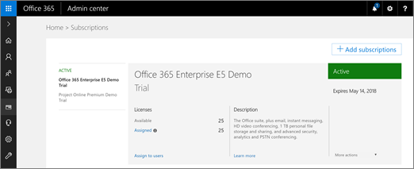

# Protection de Microsoft Office 365 menace avancéesOffice 365 Advanced Threat Protection

Office 365 Advanced Threat Protection (DAV) vous aide à protéger votre organisation contre les attaques par :Office 365 Advanced Threat Protection (ATP) helps to protect your organization from malicious attacks by:
  
- Analyse des pièces jointes avec les [Pièces jointes fiables DAV](atp-safe-attachments.md)Scanning email attachments with [ATP Safe Attachments](atp-safe-attachments.md)
    
- Analyse web adresses (URL) dans les messages électroniques et des documents Office avec [Des liens fiables DAV](atp-safe-links.md)Scanning web addresses (URLs) in email messages and Office documents with [ATP Safe Links](atp-safe-links.md)
    
- Identification et le blocage des fichiers dans des bibliothèques en ligne avec [DAV pour SharePoint, OneDrive et les équipes Microsoft](atp-for-spo-odb-and-teams.md) malveillantsIdentifying and blocking malicious files in online libraries with [ATP for SharePoint, OneDrive, and Microsoft Teams](atp-for-spo-odb-and-teams.md)
    
- Vérification des messages électroniques pour l’usurpation d’identité non autorisé avec [usurpation d’identité aide à la décision](learn-about-spoof-intelligence.md)Checking email messages for unauthorized spoofing with [spoof intelligence](learn-about-spoof-intelligence.md)
    
- Détecter lorsqu’un utilisateur tente d’emprunter l’identité de vos utilisateurs et les domaines personnalisés de votre organisation grâce à des [fonctionnalités anti-hameçonnage de DAV dans Office 365](atp-anti-phishing.md)Detecting when someone attempts to impersonate your users and your organization's custom domains with [ATP anti-phishing capabilities in Office 365](atp-anti-phishing.md)
    
Protection via Office 365 DAV est déterminée par les stratégies de l’équipe de sécurité de votre organisation définit pour les liens fiables, les pièces jointes sûres et Anti-hameçonnage. [Les rapports sont disponibles](view-reports-for-atp.md) pour afficher le fonctionne DAV pour votre organisation. Et, vous pouvez [Envoyer des fichiers suspects à Microsoft pour analyse](office-365-atp.md#submitlalware).Protection through Office 365 ATP is determined by policies that your organization's security team defines for Safe Links, Safe Attachments, and Anti-Phishing. [Reports are available](view-reports-for-atp.md) to show how ATP is working for your organization. And, you can [submit suspicious files to Microsoft for analysis](office-365-atp.md#submitlalware).
  
> [!IMPORTANT]
> Office 365 DAV est inclus dans les abonnements, telles que Office 365 entreprise E5 et Office 365 éducation A5 et, depuis le 30 avril 2018, également les [fonctionnalités de sécurité Microsoft 365 Business](https://support.office.com/article/c123694a-1efb-459e-a8d5-2187975373dc). Si votre organisation a un abonnement à Office 365 qui n’inclut pas d’Office 365 DAV, vous pouvez acheter potentiellement DAV comme module complémentaire. Pour plus d’informations, voir [Office 365 Advanced Threat Protection Service Description](https://technet.microsoft.com/library/exchange-online-advanced-threat-protection-service-description.aspx).Office 365 ATP is included in subscriptions, such as Office 365 Enterprise E5 and Office 365 Education A5, and, as of April 30, 2018, also [Microsoft 365 Business security features](https://support.office.com/article/c123694a-1efb-459e-a8d5-2187975373dc). If your organization has an Office 365 subscription that does not include Office 365 ATP, you can potentially purchase ATP as an add-on. For more information, see [Office 365 Advanced Threat Protection Service Description](https://technet.microsoft.com/library/exchange-online-advanced-threat-protection-service-description.aspx). 
      
## Obtenir DAV Office 365Get Office 365 ATP

1. En tant qu’un administrateur global ou de sécurité, accédez à [https://portal.office.com](https://portal.office.com) et connectez-vous avec votre compte professionnel ou de l’école pour Office 365.As a global or security administrator, go to [https://portal.office.com](https://portal.office.com) and sign in with your work or school account for Office 365. 
    
2. Choisissez **Admin** \> **facturation** pour voir ce que comprend votre abonnement actuel.Choose **Admin** \> **Billing** to see what your current subscription includes. 
    
    
  
3. Si vous voyez **Office 365 entreprise E5**, **Office 365 éducation A5**ou **Microsoft 365 Business**, votre organisation a DAV.If you see **Office 365 Enterprise E5**, **Office 365 Education A5**, or **Microsoft 365 Business**, then your organization has ATP. 
    
    Si vous voyez un autre abonnement, telles que **Office 365 entreprise E3** ou **Office 365 entreprise E1**, envisagez d’ajouter DAV. Pour ce faire, cliquez sur **+ Ajouter abonnement**.If you see a different subscription, such as **Office 365 Enterprise E3** or **Office 365 Enterprise E1**, consider adding ATP. To do that, choose **+ Add subscription**.
    
Une fois que vous avez DAV, l’étape suivante consiste à votre équipe de sécurité définir des stratégies de protection [Fiable liens](atp-safe-links.md), les [Pièces jointes sûres](atp-safe-attachments.md)et [Anti-hameçonnage](set-up-atp-anti-phishing-policies.md) .Once you have ATP, the next step is for your security team to define policies for [Safe Links](atp-safe-links.md), [Safe Attachments](atp-safe-attachments.md), and [Anti-phishing](set-up-atp-anti-phishing-policies.md) protection. 
  
[Que souhaitez-vous faire ?What do you want to do?](office-365-atp.md#TOC)
  
## Définir des stratégies pour DAVDefine policies for ATP

- **[Définir des stratégies de liens fiables DAV dans Office 365](set-up-atp-safe-links-policies.md)** , y compris la [liste URL bloqué personnalisée](set-up-a-custom-blocked-urls-list-wtih-atp.md) et [liste des URL personnalisée « Pas de rewrite »](set-up-a-custom-do-not-rewrite-urls-list-with-atp.md) de votre organisation**[Set up ATP Safe Links policies in Office 365](set-up-atp-safe-links-policies.md)** including your organization's [custom blocked URLs list](set-up-a-custom-blocked-urls-list-wtih-atp.md) and [custom "Do not rewrite" URLs list](set-up-a-custom-do-not-rewrite-urls-list-with-atp.md)
    
- **[Configurer les pièces jointes sûres DAV stratégies dans Office 365](set-up-atp-safe-attachments-policies.md)** comprenant [remise dynamique et l’aperçu](dynamic-delivery-and-previewing.md)**[Set up ATP Safe Attachments policies in Office 365](set-up-atp-safe-attachments-policies.md)** that can include [dynamic delivery and previewing](dynamic-delivery-and-previewing.md)
    
- **[Configurer des stratégies anti-hameçonnage de DAV dans Office 365](set-up-atp-anti-phishing-policies.md)** , y compris les attaques de l’emprunt d’identité pour protéger contre les attaques qui envoient des messages électroniques qui semblent à partir de domaines ou des personnes de confiance**[Set up ATP anti-phishing policies in Office 365](set-up-atp-anti-phishing-policies.md)** including impersonation-based attacks to protect against attackers who send email messages that appear to be from trusted people or domains 
  
## Voir comment fonctionne DAV en affichant des rapportsSee how ATP is working by viewing reports

Une fois vos stratégies DAV sont mis en place, les rapports sont disponibles pour afficher la façon dont le service fonctionne.After your ATP policies are in place, reports are available to show how the service is working.

  
1. Assurez-vous que vous êtes un administrateur global, administrateur de sécurité ou lecteur de sécurité Office 365. (Voir [les autorisations de sécurité Office 365 &amp; centre de conformité](permissions-in-the-security-and-compliance-center.md).)Make sure that you are an Office 365 global administrator, security administrator, or security reader. (See [Permissions in the Office 365 Security &amp; Compliance Center](permissions-in-the-security-and-compliance-center.md).)
    
2. [Afficher les rapports de protection contre les menaces avancées et Exchange Online Protection](view-reports-for-atp.md).[View reports for Advanced Threat Protection and Exchange Online Protection](view-reports-for-atp.md).
    
3. Si nécessaire, ajuster vos stratégies de sécurité. Voir les ressources suivantes :If needed, make adjustments to your security policies. See the following resources:
    
  - [Stratégies de liens fiables DAV dans Office 365ATP Safe Links policies in Office 365](set-up-atp-safe-links-policies.md)
    
  - [Stratégies de pièces jointes sûres DAV dans Office 365ATP Safe Attachments policies in Office 365](set-up-atp-safe-attachments-policies.md)
    
  - [Stratégies anti-hameçonnage DAV dans Office 365ATP anti-phishing policies in Office 365](set-up-atp-anti-phishing-policies.md)
    
[Que souhaitez-vous faire ?What do you want to do?](office-365-atp.md)
  
## Envoyer un fichier suspect à Microsoft pour analyseSubmit a suspicious file to Microsoft for analysis

Si vous obtenez un fichier que vous pensez que possible des programmes malveillants, vous pouvez envoyer ce fichier à Microsoft pour analyse. Visitez le [portail d’aide à la décision de Windows Defender sécurité envoi](https://go.microsoft.com/fwlink/?linkid=857185).If you get a file that you suspect could be malware, you can submit that file to Microsoft for analysis. Visit the [Windows Defender Security Intelligence submission portal](https://go.microsoft.com/fwlink/?linkid=857185).
  
## Voir aussiRelated topics

[Vue d’ensemble de la sécurité Office 365 &amp; centre de conformitéOverview of the Office 365 Security &amp; Compliance Center](https://support.office.com/article/a5f2fd18-b029-4257-b5a8-ae83e7768c85)
  
[Afficher les rapports de protection contre les menaces avancéesView the reports for Advanced Threat Protection](view-reports-for-atp.md)
  
[Menaces de sécurité Office 365 la gestion &amp; centre de conformitéThreat management in the Office 365 Security &amp; Compliance Center](threat-management.md)
  

