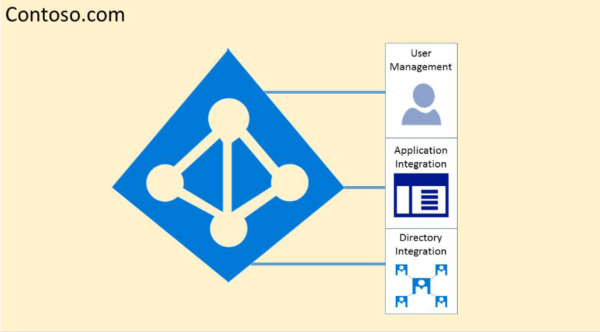

# Isolation et contrôle d’accès dans Azure Active Directory

Azure Active Directory a été conçu pour héberger plusieurs clients de manière hautement sécurisée via l'isolation logique des données. L'accès à Azure Active Directory est contrôlé par une couche d'autorisation. Azure Active Directory isole les clients qui utilisent des conteneurs clients comme limites de sécurité pour protéger le contenu d'un client afin qu'il ne soit pas accessible ou compromis par les co-locataires. Trois vérifications sont effectuées par la couche d'autorisation Azure Active Directory:
- Le principal est-il activé pour l'accès au client Azure Active Directory?
- Le principal est-il activé pour accéder aux données de ce client?
- Le rôle du principal dans ce client est-il autorisé pour le type d'accès aux données demandé?

Aucune application, utilisateur, serveur ou service ne peut accéder à Azure Active Directory sans l'authentification, le jeton ou le certificat approprié. Les demandes sont rejetées si elles ne sont pas accompagnées d'informations d'identification correctes.

En effet, Azure Active Directory héberge chaque client dans son propre conteneur protégé, avec des stratégies et des autorisations sur et dans le conteneur qui appartient et gère uniquement le client.
 

Le concept de conteneurs de client est profondément ingranulaire dans le service d'annuaire de toutes les couches, depuis les portails jusqu'au stockage persistant. Même lorsque plusieurs métadonnées client Azure Active Directory sont stockées sur le même disque physique, il n'existe pas de relation entre les conteneurs autres que ceux définis par le service d'annuaire, qui est à son tour dicté par l'administrateur client. Il ne peut y avoir aucune connexion directe au stockage Azure Active Directory à partir de l'application ou du service à l'origine de la demande, sans passer par la couche d'autorisation.

Dans l'exemple ci-dessous, contoso et Fabrikam ont des conteneurs distincts dédiés, et même si ces conteneurs peuvent partager une partie de la même infrastructure sous-jacente, telle que les serveurs et le stockage, ils restent séparés et isolés les uns des autres et contrôlés par couches d'autorisation et contrôle d'accès.
 

De plus, il n'existe pas de composants d'application pouvant s'exécuter à partir d'Azure Active Directory, et il n'est pas possible pour un client de violer l'intégrité d'un autre client, d'accéder aux clés de chiffrement d'un autre client ou de lire des données brutes à partir du serveur.

Par défaut, Azure Active Directory rejette toutes les opérations émises par des identités dans d'autres clients. Chaque client est logiquement isolé dans Azure Active Directory via des contrôles d'accès basés sur les revendications. Les lectures et les écritures des données d'annuaire sont étendues aux conteneurs de client, et la couche d'abstraction interne est contrôlée par une couche de contrôle d'accès basée sur un rôle (RBAC) qui, ensemble, appliquent le client en tant que limite de sécurité. Chaque demande d'accès aux données d'annuaire est traitée par ces couches et chaque demande d'accès dans Office 365 est conformée par la logique ci-dessus.

Azure Active Directory est doté de l'Amérique du Nord, du gouvernement américain, de l'Union européenne, de l'Allemagne et des partitions mondiales. Un client existe dans une seule partition, et les partitions peuvent contenir plusieurs clients. Les informations de partition sont extraites des utilisateurs. Une partition donnée (y compris tous les clients qu'elle contient) est répliquée sur plusieurs centres de données. La partition d'un client est choisie en fonction des propriétés du client (par exemple, le code pays). Les secrets et autres informations sensibles de chaque partition sont chiffrés à l'aide d'une clé dédiée. Les clés sont générées automatiquement lors de la création d'une nouvelle partition.

Les fonctionnalités système Azure Active Directory sont une instance unique de chaque session utilisateur. En outre, Azure Active Directory utilise des technologies de chiffrement pour isoler les ressources système partagées au niveau du réseau afin d'empêcher le transfert non autorisé et involontaire des informations.
