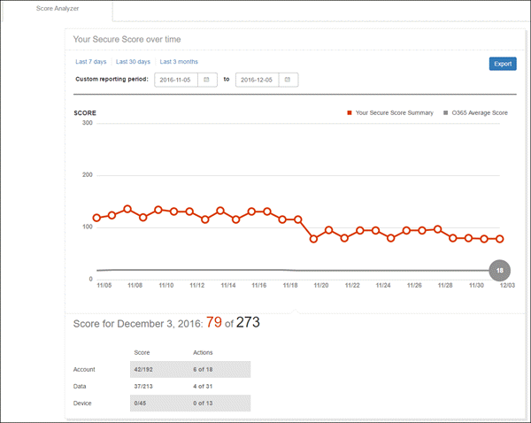
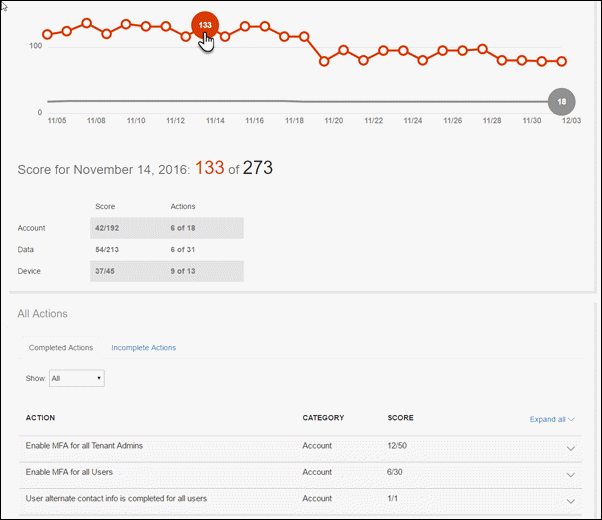

# Présentation de la note sécurisé Office 365

Demandez jamais votre organisation Office 365 vraiment est-il sécurisé ? Temps d’arrêt vous demandez - le Score de sécuriser Office 365 est là pour aider. Score sécurisé analyse la sécurité de votre organisation Office 365 basée sur les activités normales et les paramètres de sécurité et attribue une note. Considérer comme une note de crédit pour la sécurité.
  
## Contenu de cet article

[Comment obtenir au Score sécurisé ?](office-365-secure-score.md#howtoaccess)
  
[Comment cela fonctionne-t-il ?](office-365-secure-score.md#HowWorks)
  
[Comment cela va m’aider ?](office-365-secure-score.md#HowHelps)
  
[FAQ](office-365-secure-score.md#FAQ)
  
## Comment obtenir au Score sécurisé ?

Toute personne disposant d’autorisations d’administrateur (administrateur global ou un rôle d’administration personnalisée) pour un abonnement à Office 365 entreprise Premium ou entreprise peut accéder le Score d’informations sécurisé à [https://securescore.office.com](https://securescore.office.com). Les utilisateurs qui ne sont pas affectés à un rôle d’administrateur sera en mesure d’accéder de Score d’informations sécurisé. Toutefois, admins permet de partager leurs résultats avec d’autres personnes dans leur organisation.
  
## Comment fonctionne-t-il ?

Sécurisation du Score illustrations les services qu’Office 365, vous utilisez (comme OneDrive, SharePoint et Exchange), puis examine les paramètres et les activités et les compare à une base établie par Microsoft. Vous obtiendrez un score dépendent de comment aligné avec les meilleures pratiques de sécurité.
  

  
Si vous souhaitez améliorer votre résultat, passez en revue la file d’attente d’action pour voir ce que vous pouvez faire pour renforcer la sécurité et réduire les risques.
  

  
Développez une action en savoir plus sur les menaces aidera vous protégeant contre et comment vous obtenez le travail.
  

  
Pour voir l’impact de vos actions sur la sécurité de votre organisation, accédez à la page de **L’Analyseur de Score** et consulter l’historique de vos. 
  

  
Cliquez sur n’importe quel point de données pour afficher un découpage de votre score pour ce jour. Vous pouvez faire défiler jusqu'à voir les contrôles qui ont été activés et combien de points vous acquise ce jour pour chaque contrôle.
  

  
## Comment cela va m’aider ?

À l’aide de Score d’informations sécurisé vous aide à renforcer la sécurité de votre organisation en encourageant vous permet d’utiliser les fonctionnalités de sécurité intégrées dans Office 365 (dont beaucoup vous déjà acheté mais ne Sachez pas informés de). En savoir plus sur ces fonctionnalités que vous utilisez l’outil vous permettent d’exercer toute confiance que vous prenez les mesures à protéger votre organisation contre les menaces.
  
Mais ne prennent pas simplement notre word pour qu’il. Clients qui utilisent le Score d’informations sécurisé connaissent leur score augmenter 5 fois plus de clients qui ne sont pas à l’aide. (L’augmentation du score correspond avec les fonctionnalités de sécurité utilisées dans leur organisation.)
  
Consultez notre [billet de blog](https://go.microsoft.com/fwlink/?linkid=836898) pour en savoir plus. 
  
> [!NOTE]
> Le Score d’informations sécurisé n’exprime pas une mesure absolue de probable que vous êtes à obtenir franchi. Il exprime l’étendue à laquelle vous avez adoptées contrôles dont vous pouvant décaler le risque d’être franchi. Aucun service ne garantit que vous ne serez pas franchi, et le Score d’informations sécurisé ne doit pas être interprété comme une garantie en aucune façon. 
  
## FAQ

### Qui peut utiliser le Score d’informations sécurisé ?

Toute personne disposant d’autorisations d’administrateur (administrateur global ou un rôle d’administration personnalisée) pour un abonnement à Office 365 entreprise Premium ou entreprise peut accéder le Score d’informations sécurisé à [https://securescore.office.com](https://securescore.office.com). Les utilisateurs qui ne sont pas affectés à un rôle d’administrateur sera en mesure d’accéder de Score d’informations sécurisé. Toutefois, admins permet de partager leurs résultats avec d’autres personnes dans leur organisation. Nous cherchons à y compris les autres rôles non-admin dans la liste des autorisations à l’avenir. S’il existe des rôles spécifiques que vous souhaitez prendre en compte, faites-le nous savoir en le publiant sur le [Office sécurité, de confidentialité &amp; Communauté conformité](https://go.microsoft.com/fwlink/?linkid=836898).
  
### Quelle est l’utilité [pas notés] signifie ?

Actions appelées **[Pas notés]** sont ceux que vous pouvez effectuer dans votre organisation, mais ne sont pas un score, car ils ne sont pas raccordés dans l’outil (encore). Par conséquent, vous pouvez encore améliorer la sécurité, mais vous aurez crédit pour les actions maintenant. 
  
### La fréquence à laquelle est mon score mis à jour ?

Le score est calculé une fois par jour (environ 1:00 AM PST). Si vous apportez une modification à une action mesurée, le résultat sera automatiquement à jour le jour suivant. Jusqu'à 48 heures pour une modification soit répercutée dans votre score nécessaire.
  
### Qui peut voir mes résultats ?

Les résultats sont filtrés pour les scores bruts uniquement aux personnes de votre organisation qui sont affectés à un rôle admin (administrateur global ou un rôle d’administration personnalisée).
  
### Mon score a changé. Comment savoir pourquoi ?

Dans la page de **L’Analyseur de Score** , cliquez sur un point de données pour un jour spécifique, puis faites défiler jusqu'à voir les actions terminées et incomplètes pour le jour permettant de savoir ce qui est modifiées. 
  
### Le Score d’informations sécurisé mesure mon risque d’obtention franchi ?

Dans le champ n° court. Le Score d’informations sécurisé n’exprime pas une mesure absolue de probable que vous êtes à obtenir franchi. Il exprime l’étendue à laquelle vous avez adopté les fonctionnalités que vous pouvant décaler le risque d’être franchi. Aucun service ne garantit que vous ne serez pas franchi, et le Score d’informations sécurisé ne doit pas être interprété comme une garantie en aucune façon.
  
### Comment dois-je interpréter mon score ?

Vous êtes donné points pour la configuration recommandée des fonctionnalités de sécurité ou de tâches liées à la sécurité (telles que la lecture de rapports). Certaines actions sont notées achèvement partiel, comme l’activation de l’authentification multifacteur (MFA) pour vos utilisateurs. Le Score d’informations sécurisé est directement représentant des services de sécurité Microsoft que vous utilisez. N’oubliez pas que la sécurité doit toujours être équilibrée avec la facilité d’utilisation. Tous les contrôles de sécurité ont un composant d’impact utilisateur. Contrôles d’impact faible utilisateur doivent avoir très peu d’effet sur les opérations quotidiennes de vos utilisateurs.
  
Pour afficher l’historique de vos score, accédez à la page de **L’Analyseur de Score** . Choisissez une date spécifique pour afficher les contrôles qui ont été activés pour que jour et quelles sont les points vous acquise pour chacun d’eux. 
  
### J’ai une idée pour un autre contrôle. Comment permettre à vous connaissez ?

Nous aimerions vous. Veuillez envoyer vos idées sur le [Office sécurité, de confidentialité &amp; Communauté conformité](https://go.microsoft.com/fwlink/?linkid=836898). Nous écoutez et que vous voulez que le Score d’informations sécurisé pour inclure toutes les options qui vous intéressent.
  
### Quelque chose ne fonctionne pas à droite. Qui faut-il contacter ?

Si vous rencontrez des problèmes, faites-le nous savoir en le publiant sur le [Office sécurité, de confidentialité &amp; Communauté conformité](https://go.microsoft.com/fwlink/?linkid=836898). Nous vous surveillez la Communauté et fournir une aide.
  
### Mon organisation ne comporte que certaines fonctionnalités de sécurité. Cela affecte-t-il mon score ?

Le Score d’informations sécurisé calcule votre note basées sur les services que vous avez acheté. Par exemple, si vous avez acheté uniquement un plan Exchange Online, vous ne sont pas marqués pour les fonctionnalités de sécurité SharePoint Online. Le dénominateur de la note est la somme de toutes les lignes de base pour les contrôles qui s’appliquent aux produits que vous avez acheté. Le numérateur est la somme de tous les contrôles pour lesquels vous, ou partiellement achevée, les actions à réaliser ce contrôle.
  

