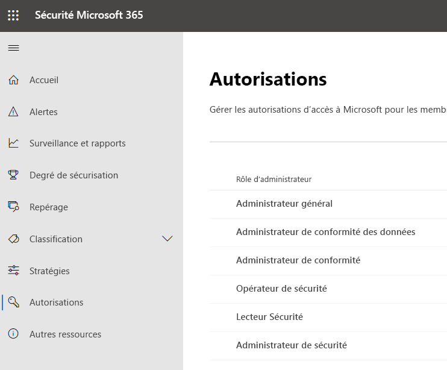
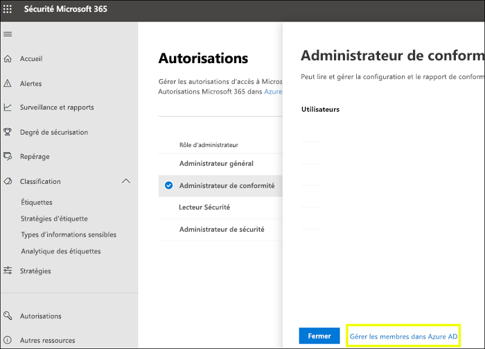
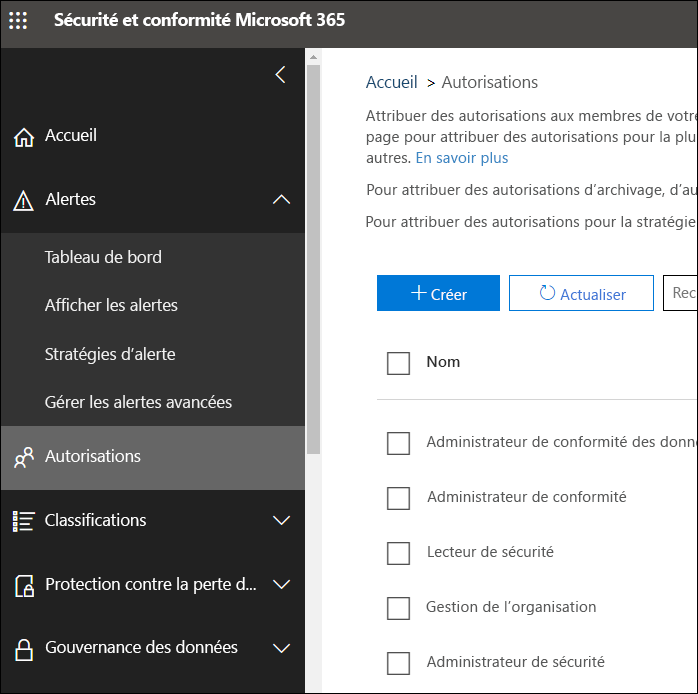

# Autorisations dans le Centre de conformité Microsoft 365 et le Centre de sécurité Microsoft 365

Votre organisation doit gérer les scénarios de sécurité et de conformité qui s’étendent sur tous les services Microsoft 365. Vous aurez besoin de flexibilité requise pour accorder les autorisations d’administrateur aux bonnes personnes du groupe informatique de votre organisation. En utilisant le Centre de sécurité Microsoft 365 ou le Centre de conformité Microsoft 365, vous pouvez gérer les autorisations de façon centralisée pour toutes les tâches liées à la sécurité ou à la conformité.

Une fois que l’administrateur général a attribué ces rôles d’administrateur, les administrateurs ont accès à des fonctionnalités et données qui couvrent tous les services dans Microsoft 365, tels que le Centre de sécurité Microsoft 365, le Centre de conformité Microsoft 365, Azure, Office 365 et Enterprise Mobility + Security.

## Quels sont les rôles Microsoft 365 ?

Les rôles qui apparaissent dans le Centre de conformité Microsoft 365 et le Centre de sécurité Microsoft 365 sont les rôles Azure Active Directory. Ces rôles sont conçus pour s’aligner sur les fonctions du groupe informatique de votre organisation, ce qui permet de donner à vos utilisateurs les autorisations nécessaires pour accomplir leur travail.

|**Role**|**Description**|
|:-----|:-----|
|**Administrateur général**|Les utilisateurs disposant de ce rôle ont accès à toutes les fonctionnalités d’administration de tous les services Microsoft 365. Seuls les administrateurs généraux peuvent affecter d’autres rôles d’administrateur.|
|**Administrateur de conformité des données**|Les utilisateurs disposant de ce rôle peuvent effectuer le suivi des données de votre organisation dans Microsoft 365, vérifier qu’elles sont protégées et se familiariser avec les problèmes liés à l’atténuation des risques.|
|**Administrateur de conformité**|Les utilisateurs ayant ce rôle peuvent aider votre organisation à respecter les exigences réglementaires, gérer les cas de découverte électronique et gérer les stratégies de gouvernance des données sur les emplacements, les identités et les applications Microsoft 365.|
|**Opérateur de sécurité**|Les utilisateurs disposant de ce rôle peuvent consulter, examiner et répondre aux menaces actives envers vos utilisateurs, appareils et contenus Microsoft 365.|
|**Lecteur Sécurité**|Les utilisateurs disposant de ce rôle peuvent consulter et examiner les menaces actives envers vos utilisateurs, appareils et contenus Microsoft 365, mais, contrairement à l’opérateur de sécurité, ils ne sont pas autorisés à répondre par une action.|
|**Administrateur de sécurité**|Les utilisateurs disposant de ce rôle peuvent contrôler la sécurité globale de votre organisation en gérant les stratégies de sécurité, en examinant les analyses de la sécurité et les rapports sur les produits Microsoft 365 et en se tenant à jour sur les menaces.|

## A quoi les rôles Microsoft 365 ont-ils accès ?

Voici les rôles disponibles et ce que les personnes auxquelles ils sont affectés peuvent faire.

### Administrateur général

Les utilisateurs avec ce rôle ont accès à toutes les fonctionnalités d’administration dans Azure Active Directory, ainsi qu’aux services qui utilisent des identités Azure Active Directory comme le Centre de sécurité Microsoft 365, le Centre de conformité Microsoft 365, Exchange Online, SharePoint Online et Skype Entreprise Online. La personne qui s’inscrit pour le locataire Azure Active Directory devient administrateur général. Seuls les administrateurs généraux peuvent affecter d’autres rôles d’administrateur. Une entreprise peut avoir plusieurs administrateurs généraux. Les administrateurs généraux peuvent réinitialiser le mot de passe des utilisateurs et de tous les autres administrateurs.

### Administrateur de conformité

Les utilisateurs avec ce rôle disposent des autorisations pour gérer les fonctionnalités liées à la conformité dans le Centre de conformité Microsoft 365, le Centre d'administration Microsoft 365, Azure et le Centre de sécurité et conformité Office 365. Les utilisateurs peuvent également gérer toutes les fonctionnalités dans le centre d’administration Exchange et le centre d’administration Teams et Skype Entreprise, et créer des tickets de support pour Azure et Microsoft 365.

|**Dans ce service...**|**L’administrateur de conformité peut...**|
|:-----|:-----|
|[**Centre de conformité Microsoft 365**](https://compliance.microsoft.com/)|Protéger et gérer les données de votre organisation au sein des services Microsoft 365.    Gérer les alertes de conformité.|
|[**Gestionnaire de conformité**](https://docs.microsoft.com/office365/securitycompliance/meet-data-protection-and-regulatory-reqs-using-microsoft-cloud)|Suivre, affecter et vérifier les activités de conformité réglementaire de votre organisation.|
|[**Centre de sécurité et conformité Office 365**](https://support.office.com/article/About-Office-365-admin-roles-da585eea-f576-4f55-a1e0-87090b6aaa9d)|Gérer la gouvernance des données.    Procéder à l'examen juridique des données.    Gérer une requête d'objet de données.|
|[**Intune**](https://docs.microsoft.com/intune/role-based-access-control)|Afficher toutes les données d’audit Intune.|
|[**Cloud App Security**](https://docs.microsoft.com/cloud-app-security/manage-admins)|Dispose d'autorisations en lecture seule et peut gérer les alertes.    Peut créer et modifier les stratégies de fichier et autoriser des actions de gouvernance de fichier.    Peut afficher tous les rapports intégrés sous Gestion des données.|

### Administrateur de conformité des données

Les utilisateurs avec ce rôle ont des autorisations pour protéger et suivre les données dans le Centre de conformité Microsoft 365, le Centre d’administration Microsoft 365 et Azure. Les utilisateurs peuvent également gérer toutes les fonctionnalités dans le centre d’administration Exchange, le Gestionnaire de compatibilité, le centre d’administration Teams et Skype Entreprise, et créer des tickets de support pour Azure et Microsoft 365.

|**Dans ce service...**|**L’administrateur de conformité des données peut...**|
|:-----|:-----|
|[**Centre de conformité Microsoft 365**](https://compliance.microsoft.com/)|Protéger et gérer les données de votre organisation au sein des services Microsoft 365.    Gérer les alertes de conformité.    Gérer les étiquettes de niveau de confidentialité|
|[**Gestionnaire de conformité**](https://docs.microsoft.com/office365/securitycompliance/meet-data-protection-and-regulatory-reqs-using-microsoft-cloud)|Suivre, affecter et vérifier les activités de conformité réglementaire de votre organisation.|
|[**Centre de sécurité et conformité Office 365**](https://support.office.com/article/About-Office-365-admin-roles-da585eea-f576-4f55-a1e0-87090b6aaa9d)|Gérer la gouvernance des données.    Procéder à l'examen juridique des données.    Gérer une requête d'objet de données.    Gérer les étiquettes de niveau de confidentialité|
|[**Intune**](https://docs.microsoft.com/intune/role-based-access-control) (prochainement disponible)|Afficher toutes les données d’audit Intune.|
|[**Cloud App Security**](https://docs.microsoft.com/cloud-app-security/manage-admins)|Utiliser des autorisations de lecture seule pour afficher des informations.  Gérer les alertes.    Créer et modifier les stratégies de fichier et autoriser des actions de gouvernance de fichier.    Afficher tous les rapports intégrés sous Gestion des données.|

### Administrateur de sécurité

Les utilisateurs disposant de ce rôle sont autorisés à gérer les fonctionnalités liées à la sécurité dans le Centre de sécurité Microsoft 365, Azure Active Directory Identity Protection, Azure Information Protection et le Centre de sécurité et conformité Office 365.

|**Dans ce service...**|**L’administrateur de sécurité peut...**|
|:-----|:-----|
|[**Centre de sécurité Microsoft 365**](https://security.microsoft.com/)|Surveiller les stratégies de sécurité au sein des services Microsoft 365.     Gérer les menaces et les alertes liées à la sécurité.    Affichage des rapports.    Gérer les étiquettes de niveau de confidentialité.|
|**Centre de protection de l’identité**|Rôle du lecteur de sécurité, avec en plus l’exécution de toutes les opérations du centre de protection de l’identité, à l’exception de la réinitialisation des mots de passe.|
|[**Privileged Identity Management**](https://docs.microsoft.com/azure/active-directory/privileged-identity-management/pim-configure)|Faites tout ce que peut faire le lecteur de sécurité.    **Ne peut pas** gérer les affectations ou paramètres de rôles Azure AD.|
|[**Centre de sécurité et conformité Office 365**](https://support.office.com/article/About-Office-365-admin-roles-da585eea-f576-4f55-a1e0-87090b6aaa9d)|Gérer les stratégies de sécurité.    Afficher, examiner et répondre aux menaces de sécurité    Affichage des rapports.    Gérer les étiquettes de niveau de confidentialité.|
|**Azure Advanced Threat Protection**|Surveiller et répondre aux activités de sécurité suspectes.|
|**Windows Defender ATP et EDR**|Attribuer des rôles.    Gérer des groupes de machines.    Configurer la détection des menaces liées aux points de terminaison et leur correction automatisée.    Afficher, examiner et répondre aux alertes.|
|[**Intune**](https://docs.microsoft.com/intune/role-based-access-control)|Affiche des informations relatives à l'utilisateur, l'appareil, l'inscription, la configuration et l'application.    **Ne peut pas** apporter de modifications à Intune.|
|[**Cloud App Security**](https://docs.microsoft.com/cloud-app-security/manage-admins)|Ajouter des administrateurs, des stratégies et des paramètres, charger des journaux et effectuer des actions de gouvernance.|
|[**Azure Security Center**](https://docs.microsoft.com/azure/role-based-access-control/built-in-roles) (bientôt disponible)|Afficher les stratégies de sécurité, les états de sécurité, les alertes et les recommandations, et ignorer les alertes et les recommandations.|
|[**Office 365 Service Health**](https://docs.microsoft.com/office365/enterprise/view-service-health)|Afficher l’intégrité des services Office 365.|

### Opérateur de sécurité

Les utilisateurs dotés de ce rôle peuvent gérer les alertes et ont un accès en lecture seule au niveau global à la fonctionnalité liée à la sécurité, notamment à toutes les informations dans le Centre de sécurité Microsoft 365, Azure Active Directory, Identity Protection, Privileged Identity Management. Ils peuvent aussi lire les rapports sur les connexions Azure Active Directory et les journaux d'audit, ainsi que dans le Centre de sécurité et conformité Office 365.

|**Dans ce service...**|**L’opérateur de sécurité peut...**|
|:-----|:-----|
|[**Centre de sécurité Microsoft 365**](https://security.microsoft.com/)|Faites tout ce que peut faire le lecteur de sécurité.    Afficher, examiner et répondre aux alertes de sécurité.|
|**Centre de protection de l’identité** (bientôt disponible)|Faites tout ce que peut faire le lecteur de sécurité.|
|[**Privileged Identity Management**](https://docs.microsoft.com/azure/active-directory/privileged-identity-management/pim-configure)|Faites tout ce que peut faire le lecteur de sécurité.|
|[**Centre de sécurité et conformité Office 365**](https://support.office.com/article/About-Office-365-admin-roles-da585eea-f576-4f55-a1e0-87090b6aaa9d)|Faites tout ce que peut faire le lecteur de sécurité.    Afficher, examiner et répondre aux menaces de sécurité|
|**Windows Defender ATP et EDR**|Faites tout ce que peut faire le lecteur de sécurité.    Afficher, examiner et répondre aux alertes.|
|[**Intune**](https://docs.microsoft.com/intune/role-based-access-control)|Affiche des informations relatives à l'utilisateur, l'appareil, l'inscription, la configuration et l'application.    **Ne peut pas** apporter de modifications à Intune.|
|[**Cloud App Security**](https://docs.microsoft.com/cloud-app-security/manage-admins)|Faites tout ce que peut faire le lecteur de sécurité, avec en plus le droit d’afficher et d’ignorer les alertes.|
|[**Office 365 Service Health**](https://docs.microsoft.com/office365/enterprise/view-service-health)|Afficher l’intégrité des services Office 365.|

### Lecteur Sécurité

Les utilisateurs dotés de ce rôle ont un accès en lecture seule au niveau global à la fonctionnalité liée à la sécurité, notamment à toutes les informations dans le Centre de sécurité Microsoft 365, Azure Active Directory, Identity Protection, Privileged Identity Management. Ils peuvent aussi lire les rapports sur les connexions Azure Active Directory et les journaux d'audit, ainsi que dans le Centre de sécurité et conformité Office 365.

|**Dans ce service...**|**Le lecteur sécurité peut...**|
|:-----|:-----|
|[**Centre de sécurité Microsoft 365**](https://security.microsoft.com/)|Afficher les stratégies de sécurité au sein des services Microsoft 365.    Afficher les menaces et les alertes liées à la sécurité.    Affichage des rapports.|
|**Centre de protection de l’identité**|Pour plus d’informations sur les fonctionnalités de sécurité, consultez tous les rapports et paramètres de sécurité : antispam, chiffrement, protection contre la perte de données (DLP), logiciel anti-programme malveillant, protection avancée contre les menaces (ATP), anti-hameçonnage et règles de flux de courrier (également appelé règles de transport).|
|[**Privileged Identity Management**](https://docs.microsoft.com/azure/active-directory/privileged-identity-management/pim-configure)|Utilisez l’accès en lecture seule pour consulter toutes les informations présentées dans Azure AD PIM :stratégies et rapports pour les attributions de rôle Azure AD, révisions de sécurité et prochainement données et rapports de stratégie pour les scénarios autres que l’attribution de rôle Azure AD.    **Ne peut pas** s’inscrire auprès de Microsoft Azure Active Directory PIM ou y apporter des modifications. Dans le portail PIM ou via PowerShell, un membre ayant ce rôle peut activer des rôles supplémentaires (par exemple, un administrateur général ou un administrateur de rôle privilégié), s’il est éligible.|
|[**Centre de sécurité et conformité Office 365**](https://support.office.com/article/About-Office-365-admin-roles-da585eea-f576-4f55-a1e0-87090b6aaa9d)|Afficher les stratégies de sécurité.    Afficher et examiner les menaces de sécurité.    Affichage des rapports.|
|**Windows Defender ATP et EDR**|Afficher et examiner les alertes.|
|[**Intune**](https://docs.microsoft.com/intune/role-based-access-control)|Affiche des informations relatives à l'utilisateur, l'appareil, l'inscription, la configuration et l'application.    **Ne peut pas** apporter de modifications à Intune.|
|[**Cloud App Security**](https://docs.microsoft.com/cloud-app-security/manage-admins)|Utiliser des autorisations de lecture seule pour afficher des informations.    Gérer les alertes.|
|[**Azure Security Center**](https://docs.microsoft.com/azure/role-based-access-control/built-in-roles)|Afficher les recommandations et les alertes.    Afficher les stratégies de sécurité.    Afficher les états de sécurité, mais sans pouvoir les modifier.|
|[**Office 365 Service Health**](https://docs.microsoft.com/office365/enterprise/view-service-health)|Afficher l’intégrité des services Office 365.|

## Les administrateurs généraux peuvent gérer les rôles dans Azure Active Directory

Dans le Centre de conformité Microsoft 365 et le Centre de sécurité Microsoft 365, lorsque vous sélectionnez un rôle, vous pouvez afficher ses affectations. Toutefois, pour gérer ces affectations, vous devez accéder à Azure Active Directory.

Pour plus d’informations, consultez [Affichage et attribution des rôles d’administrateur dans Azure Active Directory](https://docs.microsoft.com/azure/active-directory/users-groups-roles/directory-manage-roles-portal).

## Gestion des rôles dans un service à la place d’Azure Active Directory

Les rôles qui apparaissent dans le Centre de conformité Microsoft 365 et le Centre de sécurité Microsoft 365 apparaissent également dans les services où ils disposent d’autorisations. Par exemple, vous pouvez voir ces rôles dans le Centre de sécurité et conformité Office 365.

### Annulation de l’héritage

Il est important de comprendre que lorsque vous gérez ces rôles dans Azure Active Directory, vous travaillez de façon centralisée pour **tous** les services Microsoft 365. Toutefois, lorsque vous gérez un rôle dans un service spécifique, tel que le Centre de sécurité et conformité Office 365, vous gérez **uniquement** le rôle de ce service spécifique. Les affectations et autorisations d’un rôle dans un service remplacent toutes les autorisations accordées au rôle Azure Active Directory.

Cela peut être utile, par exemple, si une personne est affectée au rôle administrateur de la sécurité, elle n’a pas les autorisations nécessaires pour gérer les incidents. Vous pouvez toutefois utiliser les autorisations dans Windows Defender protection avancée contre les menaces pour leur octroyer l’autorisation spécifique de gestion des incidents au sein de ce service.

## Où trouver les informations de rôle pour chaque service Microsoft 365

En attribuant un utilisateur à l’un des rôles d’administrateur de conformité ou de sécurité Microsoft 365, vous accordez à cet utilisateur les autorisations d’accès à une plage de services Microsoft 365. Utilisez les liens ci-dessous pour trouver des informations supplémentaires sur les autorisations spécifiques d’un rôle dans chaque service.

|**Service Microsoft 365**|**Informations sur le rôle**|
|:-----|:-----|
|Rôles d’administrateur dans les plans commerciaux Office 365 et Microsoft 365|[Rôles d’administration Office 365](https://docs.microsoft.com/office365/admin/add-users/about-admin-roles?view=o365-worldwide)|
|Azure Active Directory (Azure AD) et Azure AD Identity Protection|[Rôles d’administrateur Azure AD](https://docs.microsoft.com/azure/active-directory/users-groups-roles/directory-assign-admin-roles)|
|Azure Advanced Threat Protection|[Groupes de rôles Azure ATP](https://docs.microsoft.com/azure-advanced-threat-protection/atp-role-groups)|
|Azure Information Protection|[Rôles d’administrateur Azure AD](https://docs.microsoft.com/azure/active-directory/users-groups-roles/directory-assign-admin-roles)|
|Gestionnaire de conformité|[Rôles Compliance Manager](https://docs.microsoft.com/office365/securitycompliance/meet-data-protection-and-regulatory-reqs-using-microsoft-cloud#permissions-and-role-based-access-control)|
|Exchange Online|[Contrôle d’accès en fonction du rôle Exchange](https://docs.microsoft.com/exchange/understanding-role-based-access-control-exchange-2013-help)|
|Intune|[Contrôle d’accès en fonction du rôle Intune](https://docs.microsoft.com/intune/role-based-access-control)|
|Ordinateur de bureau managé|[Rôles d’administrateur Azure AD](https://docs.microsoft.com/azure/active-directory/users-groups-roles/directory-assign-admin-roles)|
|Microsoft Cloud App Security|[Contrôle d’accès en fonction du rôle](https://docs.microsoft.com/cloud-app-security/manage-admins)|
|Centre de sécurité et conformité Office 365|[Rôles d’administration Office 365](https://docs.microsoft.com/office365/SecurityCompliance/permissions-in-the-security-and-compliance-center)|
|Privileged Identity Management|[Rôles d’administrateur Azure AD](https://docs.microsoft.com/azure/active-directory/users-groups-roles/directory-assign-admin-roles)|
|Degré de sécurisation|[Rôles d’administrateur Azure AD](https://docs.microsoft.com/azure/active-directory/users-groups-roles/directory-assign-admin-roles)|
|SharePoint Online|[Rôles d’administrateur Azure AD](https://docs.microsoft.com/azure/active-directory/users-groups-roles/directory-assign-admin-roles)    [À propos du rôle d’administrateur SharePoint dans Office 365](https://docs.microsoft.com/sharepoint/sharepoint-admin-role)|
|Teams/Skype Entreprise|[Rôles d’administrateur Azure AD](https://docs.microsoft.com/azure/active-directory/users-groups-roles/directory-assign-admin-roles)|
|Windows Defender Advanced Threat Protection|[Contrôle d’accès en fonction du rôle Windows Defender ATP](https://docs.microsoft.com/windows/security/threat-protection/windows-defender-atp/rbac-windows-defender-advanced-threat-protection)|

## A paraître prochainement

Nous travaillons sur les autorisations du Centre de conformité Microsoft 365 et du Centre de sécurité Microsoft 365. Par exemple, nous travaillons à la prise en charge pour effectuer les opérations suivantes :

- Gestion des rôles depuis le Centre de conformité Microsoft 365 et le Centre de sécurité Microsoft 365, au lieu de passer par Azure Active Directory.

- Personnalisez les rôles en ajoutant ou en supprimant des autorisations spécifiques.

- Créez des rôles personnalisés avec les autorisations que vous choisissez.
