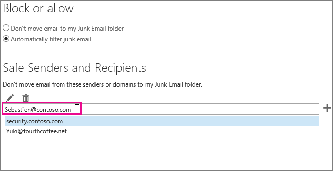

# <a name="how-to-prevent-real-email-from-being-marked-as-spam-in-office-365"></a>Empêcher le courrier d’être marqué comme courrier indésirable dans Office 365

 **Votre courrier est marqué comme courrier indésirable dans Office 365 ? Suivez ces conseils.**
  
Si vous obtenez un faux positif, merci de signaler le message à Microsoft à l’aide du [complément Utiliser la fonctionnalité de rapport d’un message](https://support.office.com/article/b5caa9f1-cdf3-4443-af8c-ff724ea719d2). En outre, vous pouvez transférer le message *en tant que pièce jointe* à not_junk@office365.microsoft.com.

**Important** Si vous ne pouvez pas transférer les messages en tant que pièces jointes, les en-têtes seront manquants et nous ne serons pas en mesure d’améliorer le filtrage du courrier indésirable dans Office 365.
    
## <a name="determine-the-reason-why-the-message-was-marked-as-spam"></a>Identifier pourquoi le message a été marqué comme courrier indésirable

De nombreux problèmes liés aux courriers indésirables dans Office 365 peuvent être résolus en [affichant les en-têtes de messages électroniques](https://support.office.com/article/cd039382-dc6e-4264-ac74-c048563d212c) et en déterminant la cause du problème. Vous devez rechercher un en-tête nommé X-Forefront-Antispam-Report. Vous pouvez consulter la rubrique sur les [en-têtes anti-courrier indésirable](https://technet.microsoft.com/library/dn205071%28v=exchg.150%29.aspx) pour en savoir plus.
  
Dans l’en-tête, repérez les titres et les valeurs suivantes.
  
### <a name="x-forefront-antispam-report"></a>X-Forefront-Antispam-Report

- **SFV:SPM** Indique que le message a été marqué comme courrier indésirable en raison des filtres de courrier indésirable EOP. 

- **SFV:BLK** Indique que le message a été marqué comme courrier indésirable, car l’adresse d’envoi figure dans la liste des expéditeurs bloqués du destinataire. 
    
- **SFV:SKS** Indique que le message a été marqué comme courrier indésirable avant le filtrage du contenu. Cela peut signifier qu’une règle de flux de messagerie (également appelée règle de transport) a marqué le message comme courrier indésirable. Exécutez un suivi des messages pour vérifier si une règle de transport s’est déclenchée et aurait pu configurer un seuil de probabilité de courrier indésirable élevé (SCL). 
    
- **SFV:SKB** Indique que le message a été marqué comme courrier indésirable, car il correspond à une liste d’expéditeurs bloqués dans la stratégie de filtrage du courrier indésirable. 
    
- 
  **SFV:BULK** Indique que la valeur BCL figurant dans l’en-tête X-Microsoft-Antispam dépasse le seuil de probabilité de courrier en nombre défini pour le filtrage de contenu. Le courrier en nombre désigne le courrier auquel les utilisateurs peuvent être abonnés mais qui est considéré comme indésirable. Dans l’en-tête de messages X-Microsoft-Antispam, recherchez la propriété BCL (seuil de probabilité de courrier en nombre). Si cette valeur est inférieure au seuil défini dans le filtre anti-courrier indésirable, nous vous recommandons d’ajuster ce seuil pour que ces messages en nombre soient marqués comme courrier indésirable. Les utilisateurs tolèrent différemment le courrier en nombre et ont différentes préférences concernant son [traitement](https://docs.microsoft.com/fr-FR/office365/SecurityCompliance/bulk-complaint-level-values). Vous pouvez créer des stratégies ou des règles différentes selon les préférences des utilisateurs.
    
- **CAT:SPOOF** ou **CAT:PHISH** Indique que le message semble être falsifié, ce qui signifie que la source du message ne peut pas être validée et pourrait être suspecte. Si l’expéditeur est valide, il doit s’assurer qu’une configuration SPF et DKIM adaptée est mise en place. Vérifiez l’en-tête Authentication-Results pour obtenir des informations complémentaires. Même s’il est difficile de convaincre tous les expéditeurs d’utiliser des méthodes d’authentification de messagerie appropriées, ignorer ces vérifications peut être très dangereux et entraîner des failles de sécurité. 
    
### <a name="x-customspam"></a>x-customspam

- La présence de cet en-tête indique que le message a été marqué comme courrier indésirable, car l’une des [options avancées de filtrage anti-courrier indésirable est activée](https://technet.microsoft.com/library/jj200750%28v=exchg.150%29.aspx) dans votre filtre anti-courrier indésirable. Sauf si vous avez besoin de ces fonctionnalités, nous vous conseillons d’utiliser les paramètres par défaut. 
    
## <a name="solutions-to-additional-causes-of-too-much-spam"></a>Solutions à appliquer en cas de courrier indésirable excessif

Pour travailler efficacement, Exchange Online Protection (EOP) exige que les administrateurs effectuent certaines tâches. Si vous n’êtes pas l’administrateur de votre client Office 365 et que vous recevez trop de courrier indésirable, nous vous recommandons de travailler avec votre administrateur sur ces tâches. Dans le cas contraire, vous pouvez passer directement à la section dédiée aux utilisateurs.
  
### <a name="for-admins"></a>Pour les administrateurs

- **Pointez vos enregistrements DNS vers Office 365** Afin qu’EOP vous protège efficacement du courrier indésirable, les enregistrements DNS de votre serveur de messagerie (MX) pour tous les domaines doivent pointer vers Office 365 uniquement. Si votre MX ne pointe pas vers Office 365, EOP ne filtre pas le courrier indésirable pour vos utilisateurs. Si vous voulez utiliser un autre service ou dispositif pour filtrer le courrier indésirable dans votre domaine, pensez à désactiver la protection contre le courrier indésirable dans EOP. Pour cela, vous pouvez créer une règle de flux de messagerie qui définit la valeur SCL sur -1. Si vous décidez ultérieurement d’utiliser EOP, pensez à supprimer cette règle de flux de messagerie. 
    
- **Activez le complément Message de notification pour les utilisateurs** Nous vous recommandons vivement d’[activer le complément Message de notification pour vos utilisateurs](enable-the-report-message-add-in.md). En tant qu’administrateur, vous pouvez également consulter les commentaires envoyés par vos utilisateurs et utiliser des modèles pour ajuster les paramètres qui peuvent être à l’origine des problèmes.

- 
  **Assurez-vous que vos utilisateurs respectent les limites autorisées** pour envoyer et recevoir des e-mails, comme indiqué [ici](https://docs.microsoft.com/fr-FR/office365/servicedescriptions/exchange-online-service-description/exchange-online-limits).

 - **Vérifiez les seuils de courrier en nombre**, comme précisé [ici](bulk-complaint-level-values.md)
    
### <a name="for-users"></a>Pour les utilisateurs
    
- **Créer une liste d’expéditeurs approuvés** Les utilisateurs peuvent ajouter les adresses des expéditeurs auxquels ils font confiance à leur liste d’expéditeurs approuvés dans [Outlook](https://go.microsoft.com/fwlink/p/?LinkId=270065) ou [Outlook sur le Web](https://go.microsoft.com/fwlink/p/?LinkId=294862). Pour commencer à utiliser la fonctionnalité dans Outlook sur le Web, sélectionnez **Paramètres** \> **Options** \> **Bloquer ou autoriser**. Le diagramme suivant illustre un exemple de l’ajout d’un élément à une liste d’expéditeurs approuvés.
  

  
EOP respecte la liste des expéditeurs et destinataires approuvés des utilisateurs, mais pas les domaines approuvés. Cela s’applique que le domaine soit ajouté via Outlook sur le Web, ou ajouté dans Outlook et synchronisé à l’aide de la synchronisation des annuaires.

- **Désactivez le filtrage SmartScreen dans Outlook** Si vous utilisez un ancien client Outlook pour ordinateur de bureau, vous devez désactiver la fonctionnalité de filtrage SmartScreen, qui n’est plus disponible. Si elle est activée, elle peut générer des faux positifs. Ignorez cette étape si vous exécutez un client Outlook pour ordinateur de bureau mis à jour.

## <a name="troubleshooting-a-message-ends-up-in-the-junk-folder-even-though-eop-marked-the-message-as-non-spam"></a>Résolution des problèmes : un message se retrouve dans le dossier courrier indésirable même si EOP marqué le message comme n’étant pas du courrier indésirable


Si vos utilisateurs ont l'option activée dans Outlook "Listes sécurisées uniquement : seul le courrier provenant de personnes ou de domaines figurant sur vos listes d'expéditeurs ou de destinataires approuvés sera envoyé dans votre boîte de réception", alors tous les e-mails seront envoyés dans le dossier des courriers indésirables de l'expéditeur, sauf si celui-ci est sur la liste des expéditeurs approuvés par le destinataire. Ceci se produira indépendamment du fait que EOP marque un message comme étant un message non indésirable, ou si vous avez configuré une règle dans EOP pour marquer un message comme non indésirable.
  
Vous pouvez désactiver l’option des listes sécurisées uniquement en suivant les instructions fournies dans [Outlook : Paramètre de stratégie pour désactiver l’interface utilisateur de courrier indésirable et le mécanisme de filtrage](https://support.microsoft.com/en-us/kb/2180568).
  
Si vous affichez le message dans Outlook sur le Web, un Conseil de sécurité de couleur jaune s’affiche, indiquant que le message se trouve dans le dossier courrier indésirable, car l’expéditeur n’est pas dans la liste des expéditeurs approuvés du destinataire.
  
Si vous examinez l’en-tête d’un message, il peut également inclure le label SFV:SKN (adresses IP autorisées ou ETR autorisé) ou SFV:NSPM (non-courrier indésirable), mais le message est quand-même placé dans le dossier de courrier indésirable de l’utilisateur. Rien dans l’en-tête de message indique que l’utilisateur a activé « Listes approuvées uniquement ». Cela se produit car l’option « Listes approuvées uniquement » définie par les utilisateurs dans Outlook remplace le paramètre EOP. 
  
 **Pour vérifier pourquoi un message provenant d’un expéditeur approuvé est marqué comme courrier non-indésirable dans l’en-tête du message, mais se retrouve quand-même dans le dossier courrier indésirable de l’utilisateur**
  
1. Pour découvrir comment vous connecter à Exchange Online PowerShell, voir [Connexion à Exchange Online PowerShell](https://go.microsoft.com/fwlink/p/?LinkId=396554). 
    
2. Exécutez la commande suivante pour afficher les paramètres de configuration concernant le courrier indésirable de l’utilisateur :
    
  ```Powershell
  Get-MailboxJunkEmailConfiguration example@contoso.com | fl TrustedListsOnly,ContactsTrusted,TrustedSendersAndDomains
  ```

- Si TrustedListsOnly est défini comme Vrai, cela signifie que ce paramètre est activé
- Si ContactsTrusted est défini comme Vrai, cela signifie que l’utilisateur approuve les Contacts et les Expéditeurs approuvés
- TrustedSendersAndDomains répertorie le contenu de la liste des expéditeurs approuvés de l’utilisateur


## <a name="eop-only-customers-use-directory-synchronization"></a>Clients d’EOP : utilisez la synchronisation d’annuaires

Si vous êtes un client EOP uniquement, c'est-à-dire que vous vous abonnez au service EOP pour l'utiliser avec votre serveur de messagerie sur site (Exchange), vous devez synchroniser les paramètres utilisateur avec le service en utilisant la synchronisation des annuaires. De cette façon, vous assurez que vos listes d'expéditeurs approuvés sont respectées par EOP. Pour plus d'informations, voir « Utiliser la synchronisation des répertoires pour gérer les utilisateurs de messagerie » dans [Gérer les utilisateurs de messagerie dans EOP](https://go.microsoft.com/fwlink/?LinkId=534098).
