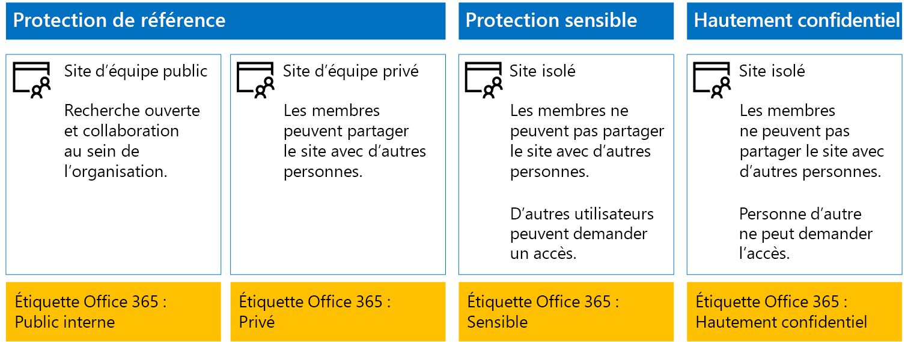
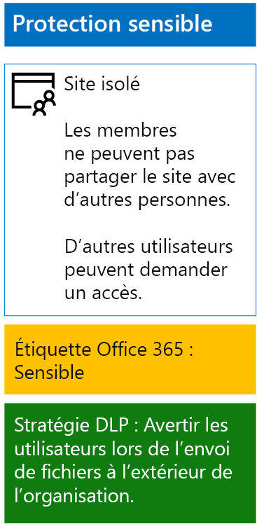
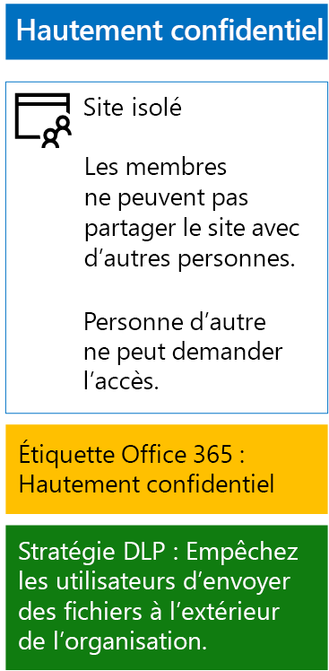

# Protéger les fichiers SharePoint Online avec des étiquettes de rétention et la protection contre la perte de données (DLP)

 **Résumé :** appliquez des étiquettes de rétention et des stratégies DLP à des sites d’équipe SharePoint Online, avec différents niveaux de protection des informations.
  
Suivez les étapes décrites dans cet article afin de créer et de déployer des étiquettes de rétention et des stratégies DLP pour des sites d’équipe SharePoint Online de base, sensibles et hautement confidentiels. Pour plus d’informations sur ces trois niveaux de protection, consultez [Sécuriser des sites et des fichiers SharePoint Online](secure-sharepoint-online-sites-and-files.md).
  
## Procédure
1. Créez les étiquettes de rétention de votre choix et publiez-les. La publication peut prendre jusqu’à 12 heures.
2. Pour les sites SharePoint souhaités, modifiez les paramètres de la bibliothèque de documents afin d’appliquer les étiquettes de rétention de votre choix aux éléments de la bibliothèque.
3. Créez des stratégies DLP pour prendre des mesures en fonction des étiquettes de rétention.

Lorsque des utilisateurs ajoutent un document à la bibliothèque, celui-ci reçoit par défaut l’étiquette de rétention attribuée. Si nécessaire, les utilisateurs peuvent changer l’étiquette. Lorsqu’un utilisateur partage un document en dehors de l’organisation, DLP vérifie si une étiquette est attribuée et prend les mesures qui s’imposent si une stratégie DLP correspond à l’étiquette. DLP recherche également les correspondances liées à d’autres stratégies, comme la protection des fichiers avec des numéros de carte de crédit si ce type de stratégie est configuré. 

## Étiquettes de rétention pour vos sites SharePoint Online

La création, puis l’attribution d’étiquettes de rétention à des sites d’équipe SharePoint Online se déroulent en trois phases.
  
### Phase 1 : Déterminer les noms des étiquettes de rétention

Au cours de cette phase, vous déterminez les noms de vos étiquettes de rétention pour les quatre niveaux de protection des informations appliqués aux sites d’équipe SharePoint Online. Le tableau suivant répertorie les noms recommandés pour chaque niveau.
  
|**Niveau de protection du site d’équipe SharePoint Online**|**Nom de l’étiquette**|
|:-----|:-----|
|Base de référence - Public    |Public interne    |
|Base de référence - Privé    |Private    |
|Sensible    |Sensible    |
|Hautement confidentiel    |Hautement confidentiel    |
   
### Phase 2 : Créer les étiquettes de rétention

Au cours de cette phase, vous créez puis vous publiez les étiquettes que vous avez déterminées pour les différents niveaux de protection des informations.
  
1. Connectez-vous au [portail de conformité Microsoft 365](https://compliance.microsoft.com) avec un compte disposant du rôle Administrateur de la sécurité ou Administrateur de la société.
    
2. Sous l’onglet **Accueil - Conformité Microsoft 365** de votre navigateur, cliquez sur **Classifications > Étiquettes**.
    
3. Cliquez sur **Étiquettes de rétention > Créer une étiquette**.
    
4. Dans le volet **Nommer l’étiquette**, entrez le nom de l’étiquette ainsi qu’une description destinée aux administrateurs et aux utilisateurs, puis cliquez sur **Suivant**.

5. Dans le volet **Descripteurs de plan de gestion de fichiers**, complétez les champs requis, puis cliquez sur **Suivant**.
    
6. Dans le volet **Paramètres d’étiquette**, si nécessaire, définissez **Rétention** sur **Activé** et configurez les paramètres de rétention. Cliquez sur **Suivant**.
    
7. Dans le volet **Vérifier vos paramètres**, cliquez sur **Créer l’étiquette**.
    
8. Pour vos autres étiquettes, cliquez sur **Créer une étiquette** puis, si nécessaire, répétez les étapes 3 à 7.
    

### Publier vos nouvelles étiquettes

Procédez comme suit pour publier les nouvelles étiquettes de rétention.
  
1. Depuis le volet **Étiquettes**, cliquez sur l’onglet **Étiquettes de rétention**, puis sur **Publier les étiquettes**.
    
2. Dans le volet **Choisir les étiquettes à publier**, cliquez sur **Choisir les étiquettes à publier**.
    
3. Dans le volet **Choisir des étiquettes**, cliquez sur **Ajouter**, sélectionnez les quatre étiquettes, puis cliquez à nouveau sur **Ajouter**.
    
4. Cliquez sur **Terminé**.
    
5. Dans le volet **Choisir les étiquettes à publier**, cliquez sur **Suivant**.
    
6. Dans le volet **Choisir les emplacements**, cliquez sur **Suivant**.
    
7. Dans le volet **Nom de votre stratégie**, entrez un nom pour désigner l’ensemble des étiquettes dans **Nom**, puis cliquez sur **Suivant**.
    
8. Dans le volet **Vérifier vos paramètres**, cliquez sur **Publier les étiquettes**, puis sur **Fermer**.

    
### Phase 3 : Appliquer les étiquettes de rétention à vos sites SharePoint Online

Procédez comme suit pour appliquer les étiquettes de rétention aux dossiers de documents de vos sites d’équipe SharePoint Online.
  
1. Connectez-vous au [portail Office 365](https://www.office.com) et cliquez sur l’application **SharePoint**.
    
2. Sous le nouvel onglet **SharePoint** de votre navigateur, cliquez sur un site auquel vous devez attribuer une étiquette de rétention.
    
3. Sous le nouvel onglet du Site SharePoint de votre navigateur, cliquez sur **Documents**.
    
4. Cliquez sur l’icône des paramètres, puis cliquez sur **Paramètres de la bibliothèque**.
    
5. Sous **Autorisations et gestion**, cliquez sur **Appliquer l’étiquette aux éléments de cette bibliothèque**.
    
6. Dans **Paramètres-Appliquer une étiquette**, sélectionnez l’étiquette de rétention qui convient, puis cliquez sur **Enregistrer**.
    
7. Fermez l’onglet du site SharePoint Online.
    
8. Répétez les étapes 2 à 8 pour attribuer des étiquettes de rétention à vos autres sites SharePoint Online.
    
Voici la configuration finale.
  

  
## Stratégies de protection contre la perte de données pour vos sites SharePoint Online

Suivez ces étapes pour configurer une stratégie DLP qui avertit les utilisateurs lorsqu’ils partagent un document sur un site d’équipe sensible SharePoint Online externe à l’organisation.

1. Connectez-vous au [portail de conformité Microsoft 365](https://compliance.microsoft.com/) avec un compte disposant du rôle Administrateur de la sécurité ou Administrateur de la société.
    
2. Sous le nouvel onglet **Conformité Microsoft 365** de votre navigateur, cliquez sur **Stratégie > Protection contre la perte de données**.
    
3. Dans le volet **Accueil > Protection contre la perte de données**, cliquez sur **Créer une stratégie**.
    
4. Dans le volet **Commencez en utilisant un modèle ou créez une stratégie personnalisée**, cliquez sur **Personnalisé**, puis sur **Suivant**.
    
5. Dans le volet **Nom de votre stratégie**, entrez le nom de la stratégie DLP sensible dans **Nom**, puis cliquez sur **Suivant**.
    
6. Dans le volet **Choisir les emplacements**, cliquez sur **Me laisser choisir des emplacements spécifiques**, puis sur **Suivant**.
    
7. Dans la liste des emplacements, désactivez les emplacements **Courrier Exchange**, **Comptes OneDrive** et **Messages de conversations et de canaux Teams**, puis cliquez sur **Suivant**.
    
8. Dans le volet **Personnalisez le type de contenu que vous voulez protéger**, cliquez sur **Modifier**.
    
9. Dans le volet **Choisissez les types de contenu à protéger**, cliquez sur **Ajouter** dans la zone déroulante, puis sélectionnez **Étiquettes de rétention**.
    
10. Dans le volet **Étiquettes de rétention**, cliquez sur **Ajouter**, sélectionnez l’étiquette **Sensible**, puis cliquez sur **Ajouter** et sur **Terminé**.
    
11. Dans le volet **Choisir les types de contenu à protéger**, cliquez sur **Enregistrer**.
    
12. Dans le volet **Personnaliser les types d’informations sensibles que vous souhaitez protéger**, cliquez sur **Suivant**.

13. Dans le volet **Que faire en cas de détection d’informations sensibles ?**, cliquez sur **Personnaliser l’info-bulle et l’e-mail**.
    
14. Dans le volet **Personnaliser les conseils et les notifications par e-mail de la stratégie**, cliquez sur **Personnaliser le texte de l’info-bulle de la stratégie**.
    
15. Dans la zone de texte, saisissez ou collez l’un des conseils suivants, selon si vous avez implémenté Azure Information Protection pour protéger les fichiers hautement confidentiels :
    
  - Pour partager un fichier avec un utilisateur extérieur à l’organisation, téléchargez-le et ouvrez-le. Cliquez sur Fichier > Protéger le document > Chiffrer avec mot de passe, puis indiquez un mot de passe fort. Envoyez le mot de passe par e-mail ou un autre moyen de communication.
  - Les fichiers hautement confidentiels sont protégés par chiffrement. Seuls les utilisateurs externes qui y ont été autorisés par votre service informatique peuvent lire ces fichiers.
    
    Vous pouvez également saisir ou coller votre propre conseil de stratégie pour expliquer aux utilisateurs comment partager un fichier en dehors de votre organisation.
    
16. Cliquez sur **OK**.
    
17. Dans le volet Office **Que faire en cas de détection d’informations sensibles ?**, cliquez sur **Suivant**.
    
18. Dans le volet **Voulez-vous activer la stratégie ou d’abord effectuer des tests ?**, cliquez sur **Oui, l’activer maintenant**, puis cliquez sur **Suivant**.
    
19. Dans le volet **Vérifier vos paramètres**, cliquez sur **Créer**, puis sur **Fermer**.
    
Voici le résultat de votre configuration pour les sites d’équipe SharePoint Online sensibles.
  

  
Utilisez ces étapes pour configurer une stratégie de protection contre la perte de données qui bloque les utilisateurs quand ils partagent un document sur un site d’équipe SharePoint Online hautement confidentiel à l’extérieur de l’organisation.
  
1. Sous le nouvel onglet **Conformité Microsoft 365** de votre navigateur, cliquez sur **Stratégie > Protection contre la perte de données**.
    
2. Dans le volet **Protection contre la perte de données**, cliquez sur **Créer une stratégie**.
    
3. Dans le volet **Utiliser un modèle ou créer une stratégie personnalisée**, cliquez sur **Personnalisé**, puis sur **Suivant**.
    
4. Dans le volet **Nom de votre stratégie**, entrez le nom de la stratégie DLP hautement sensible dans **Nom**, puis cliquez sur **Suivant**.
    
5. Dans le volet **Choisir des emplacements**, cliquez sur **Me laisser choisir des emplacements spécifiques**, puis cliquez sur **Suivant**.
    
6. Dans la liste des emplacements, désactivez les emplacements **Courrier Exchange**, **Comptes OneDrive** et **Messages de conversations et de canaux Teams**, puis cliquez sur **Suivant**.
    
7. Dans le volet **Personnalisez les types d’informations sensibles que vous voulez protéger**, cliquez sur **Modifier**.
    
8. Dans le volet **Choisissez les types de contenu à protéger**, cliquez sur **Ajouter** dans la zone déroulante, puis sélectionnez **Étiquettes de rétention**.
    
9. Dans le volet **Étiquettes de rétention**, cliquez sur **Ajouter**, sélectionnez l’étiquette **Hautement confidentiel**, puis cliquez sur **Ajouter** et sur **Terminé**.
    
10. Dans le volet **Choisir les types de contenu à protéger**, cliquez sur **Enregistrer**.
    
12. Dans le volet **Personnaliser les types d’informations sensibles que vous voulez protéger**, cliquez sur **Suivant**.
    
13. Dans le volet **Que voulez-vous faire si nous détectons des informations confidentielles ?**, cliquez sur **Personnaliser l’info-bulle et la messagerie électronique**.
    
14. Dans le volet **Personnaliser les conseils et les notifications par e-mail de la stratégie**, cliquez sur **Personnaliser le texte de l’info-bulle de la stratégie**.
    
15. Dans la zone de texte, tapez ou collez ce qui suit :
    
  - Pour partager un fichier avec un utilisateur extérieur à l’organisation, téléchargez-le et ouvrez-le. Cliquez sur Fichier > Protéger le document > Chiffrer avec mot de passe, puis indiquez un mot de passe fort. Envoyez le mot de passe par e-mail ou un autre moyen de communication.
    
    Vous pouvez également saisir ou coller votre propre conseil de stratégie pour expliquer aux utilisateurs comment partager un fichier en dehors de votre organisation.
    
16. Cliquez sur **OK**.
    
17. Dans le volet Office **Que faire en cas de détection d’informations sensibles ?**, cliquez sur **Suivant**.
    
18. Dans le volet **Voulez-vous activer la stratégie ou d’abord effectuer des tests ?**, cliquez sur **Oui, l’activer maintenant**, puis cliquez sur **Suivant**.
    
19. Dans le volet **Vérifier vos paramètres**, cliquez sur **Créer**, puis sur **Fermer**.
    
Voici le résultat de votre configuration pour les sites d’équipe SharePoint Online hautement confidentiels.
  

  
## Étape suivante

[Protéger les fichiers SharePoint Online avec Azure Information Protection](protect-sharepoint-online-files-with-azure-information-protection.md)
    
## Voir aussi

[Sécuriser les fichiers et sites SharePoint Online](secure-sharepoint-online-sites-and-files.md)
  
[Conseils de sécurité Microsoft pour les campagnes électorales, les organisations à but non lucratif et d’autres organisations flexibles](microsoft-security-guidance-for-political-campaigns-nonprofits-and-other-agile-o.md)
  
[Adoption du cloud et solutions hybrides](https://docs.microsoft.com/office365/enterprise/cloud-adoption-and-hybrid-solutions)

