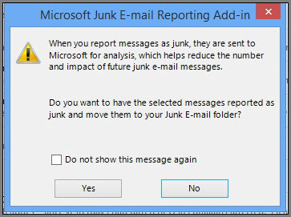

# Signaler les messages de courrier indésirable à MicrosoftReport junk email messages to Microsoft

Le complément de signalement de courrier indésirable de Microsoft pour Microsoft Office Outlook vous offre plusieurs méthodes pour signaler des messages en tant que courriers indésirables :The Microsoft Junk Email Reporting Add-in for Microsoft Office Outlook offers several ways for you to report junk email messages:
  
- à partir du ruban Outlook ;From the Outlook ribbon
    
- à partir de votre boîte de réception ;From your Inbox
    
- à partir d'un message électronique ouvert.From within an opened email message
    
Le complément de signalement de courrier indésirable vous permet de soumettre des rapports au service Microsoft Exchange Online Protection (EOP). Si votre boîte aux lettres n'est pas protégée par le service, la soumission de rapports de courrier indésirable n'affecte pas vos filtres de courrier indésirable. Les administrateurs peuvent en savoir plus sur d'autres paramètres de courrier indésirable qui s'appliquent à une organisation entière en consultant les rubriques [Comment s'assurer qu'un message n'est pas marqué comme du courrier indésirable](https://go.microsoft.com/fwlink/p/?LinkId=534224) ou [Bloquer le courrier indésirable avec le filtre de courrier indésirable Office 365 pour éviter les faux négatifs](https://go.microsoft.com/fwlink/p/?LinkId=534225). Ils sont utiles si vous avez un contrôle de niveau administrateur et que vous souhaitez éviter les faux positifs ou les faux négatifs.The Junk Email Reporting Add-in helps you submit reports to the Microsoft Exchange Online Protection (EOP) service. If your mailbox is not protected by the service, your junk email report submission will not affect your spam filters. Administrators can learn about more spam settings that apply to a whole organization at [How to help ensure that a message isn't marked as spam](https://go.microsoft.com/fwlink/p/?LinkId=534224) or [Block email spam with the Office 365 spam filter to prevent false negative issues](https://go.microsoft.com/fwlink/p/?LinkId=534225). These are helpful if you have administrator-level control and you want to prevent false positives or false negatives.
  
> [!TIP]
> Vous pouvez également envoyer des messages de courrier indésirable directement à Microsoft à l'aide de l'adresse de messagerie [junk@office365.microsoft.com](mailto:junk@office365.microsoft.com) et de messages faux positifs (autres que des courriers indésirables) à l'aide de l'adresse de messagerie [not_junk@office365.microsoft.com](mailto: not_junk@office365.microsoft.com) . Pour plus d'informations, consultez la rubrique soumettre des courriers indésirables, des courriers indésirables [et des tentatives de hameçonnage à Microsoft pour analyse](submit-spam-non-spam-and-phishing-scam-messages-to-microsoft-for-analysis.md).You can also submit spam messages directly to Microsoft by using the [junk@office365.microsoft.com](mailto:junk@office365.microsoft.com) email address, and false positive (non-spam) messages by using the [not_junk@office365.microsoft.com](mailto: not_junk@office365.microsoft.com) email address. For more information, see [Submit spam, non-spam, and phishing scam messages to Microsoft for analysis](submit-spam-non-spam-and-phishing-scam-messages-to-microsoft-for-analysis.md). 
  
### Pour signaler des messages électroniques indésirables à partir d'OutlookTo report junk email messages from Outlook

[Utiliser le complément de message de rapportUse the Report Message add-in](https://support.office.com/article/b5caa9f1-cdf3-4443-af8c-ff724ea719d2) 
  
### Pour signaler un message en tant que courrier indésirable à partir de votre boîte de réceptionTo report junk email messages from your Inbox

1. Sélectionnez les messages à signaler comme courrier indésirable.Right-click the message or messages that you want to report as junk.
    
2. Sélectionnez **courrier** indésirable, puis cliquez sur **signaler le courrier**indésirable.  Select **Junk** and then click **Report Junk**.  
  
3. La boîte **de dialogue complément de création de rapports de courrier indésirable de Microsoft** s'ouvre. Si vous êtes sûr de vouloir envoyer les messages que vous avez sélectionnés comme courrier indésirable, cliquez sur **Oui**.  The **Microsoft Junk E-mail Reporting Add-in** dialog box opens. If you're sure that you want to submit the messages you selected as junk, click **Yes**.  
  
    > [!NOTE]
    > Si vous ne souhaitez pas recevoir ce message de confirmation lors de l'envoi de courriers indésirables, cochez la case **Ne plus afficher ce message**.If you don't want to receive this confirmation message when submitting junk messages, check **Do not show this message again**. 
  
Les messages sélectionnés sont envoyés à Microsoft pour analyse et déplacés dans le dossier Courrier indésirable. Pour confirmer que les messages ont été envoyés, ouvrez le dossier **Éléments envoyés** pour afficher les messages envoyés.The selected messages will be sent to Microsoft for analysis and moved to the Junk Email folder. To confirm that the messages have been submitted, open your **Sent Items** folder to view the submitted messages. 
  
### Pour signaler un message en tant que courrier indésirable à partir d'un message électronique ouvertTo report a junk email message from within an opened message

1. À partir d'un message ouvert, cliquez sur le bouton **signaler le courrier** indésirable dans le ruban message. Par exemple, cliquez \*\*\*\* \> \*\*\*\* From within an opened message, click the **Report Junk** button on the message ribbon. For example, click **Junk** \> **Report Junk** 
  
2. La boîte **de dialogue complément de création de rapports de courrier indésirable de Microsoft** s'ouvre. Si vous êtes sûr de vouloir envoyer le message que vous avez sélectionné comme courrier indésirable, cliquez sur **Oui**.  The **Microsoft Junk E-mail Reporting Add-in** dialog box opens. If you're sure that you want to submit the message you selected as junk, click **Yes**.  
  
    > [!NOTE]
    > Si vous ne souhaitez pas recevoir ce message de confirmation lors de l'envoi de courriers indésirables, cochez la case **Ne plus afficher ce message**.If you don't want to receive this confirmation message when submitting junk messages, check **Do not show this message again**. 
  
Le message sélectionné est envoyé à Microsoft pour analyse et déplacé dans le dossier Courrier indésirable. Pour confirmer que le message a été envoyé, ouvrez le dossier **Éléments envoyés** pour afficher le message envoyé.The selected message will be sent to Microsoft for analysis and moved to the Junk Email folder. To confirm that the message has been submitted, open your **Sent Items** folder to view the submitted message. 
  
## Pour plus d’informationsFor more information

[Activer le complément Signaler le messageEnable the Report Message add-in](https://support.office.com/article/4250c4bc-6102-420b-9e0a-a95064837676)
  
[Résolution des problèmes et informations de support techniqueTroubleshooting and support information](troubleshooting-and-support-information.md)
  
[Comment s'assurer qu'un message n'est pas marqué comme du courrier indésirableHow to help ensure that a message isn't marked as spam](https://go.microsoft.com/fwlink/p/?LinkId=534224)
  
[Bloquer le courrier indésirable à l'aide du filtre d'Office 365 afin d'éviter les problèmes de faux négatifsBlock email spam with the Office 365 spam filter to prevent false negative issues](https://go.microsoft.com/fwlink/p/?LinkId=534225)
  

