# Vue d’ensemble des stratégies de rétention

Le volume et la complexité des données (e-mails, documents, messages instantanés et bien plus encore) de la majorité des organisations augmentent quotidiennement. Il est important de gérer et de gouverner efficacement ces informations, car vous devez :
  
- **respecter de façon proactive les réglementations du secteur et les stratégies internes** qui vous obligent à conserver du contenu pendant une période minimale. Par exemple, la loi Sarbanes-Oxley vous oblige à conserver certains types de contenu pendant sept ans ; 
    
- **réduire les risques en cas de litige ou de violation de la sécurité** en supprimant définitivement le contenu ancien qu’il n’est plus obligatoire de conserver ; 
    
- **aider votre organisation à partager efficacement les connaissances et à être plus agile** en vérifiant que vos utilisateurs traitent uniquement le contenu actuel et pertinent pour eux. 
    
Une stratégie de rétention dans Office 365 peut vous aider à atteindre ces objectifs. La gestion du contenu nécessite généralement les deux actions suivantes :
  
- **Conservation** du contenu afin que celui-ci ne puisse pas être supprimé définitivement avant la fin de la période de rétention. 
    
- **Suppression** définitive du contenu à la fin de la période de rétention. 
    
Une stratégie de rétention vous permet d’effectuer les actions suivantes :
  
- Décider de façon proactive de conserver du contenu, de le supprimer (ou les deux), de conserver du contenu, puis de le supprimer.
    
- Appliquer une stratégie unique à l’ensemble de l’organisation ou à seulement quelques emplacements ou utilisateurs.
    
- Appliquer une stratégie à tout le contenu ou seulement au contenu remplissant certaines conditions, comme le contenu comportant des mots clés spécifiques ou [des types spécifiques d’informations sensibles](what-the-sensitive-information-types-look-for.md).
    
Lorsque le contenu est soumis à une stratégie de rétention, les utilisateurs peuvent continuer à le modifier et à l’utiliser comme si rien n’avait changé, car le contenu est conservé sur place, à son emplacement d’origine. Mais si quelqu’un modifie ou supprime le contenu qui est soumis à la stratégie, une copie est enregistrée dans un emplacement sécurisé où elle est conservée tant que la stratégie est en vigueur.
  
Enfin, certaines organisations doivent respecter des réglementations telles que la règle 17a-4 de la SEC (Securities and Exchange Commission), stipulant qu’après l’activation d’une stratégie de rétention, celle-ci ne peut pas être désactivée ni rendue moins restrictive. Pour remplir cette obligation, vous pouvez utiliser le verrouillage de conservation. Une fois la stratégie verrouillée, personne ne peut la désactiver ni la rendre moins restrictive, pas même l’administrateur.
  
Vous créez et gérez des stratégies de rétention sur la page **Rétention** dans le Centre de sécurité &amp; conformité d’Office 365. 
  
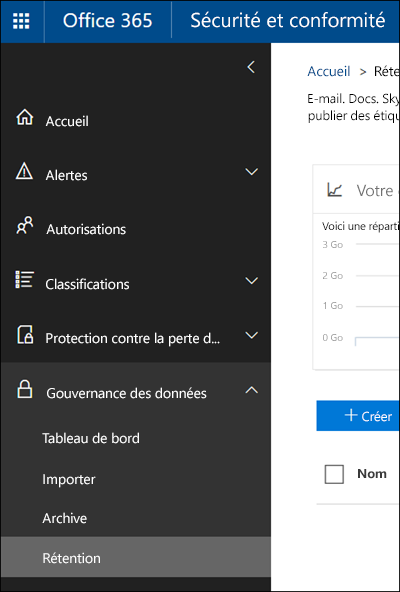
  
> [!NOTE]
> Pour inclure une boîte aux lettres Exchange Online dans une stratégie de rétention, la boîte aux lettres doit disposer d’une licence Exchange Online Plan 2. Si une boîte aux lettres dispose d’une licence Exchange Online Plan 1, vous devez lui attribuer une licence Archivage Exchange Online distincte pour l’inclure dans une stratégie de rétention. 
  
## Fonctionnement d’une stratégie de rétention avec du contenu sur place

Lorsque vous incluez un emplacement tel qu’un site ou une boîte aux lettres dans une stratégie de rétention, le contenu reste dans son emplacement d’origine. Les utilisateurs peuvent continuer à traiter leurs documents ou leurs e-mails comme si rien n’avait changé. Cependant, s’ils modifient ou suppriment le contenu inclus dans la stratégie, une copie du contenu tel qu’il était lorsque vous avez appliqué la stratégie est conservée.
  
Pour les sites, une copie du contenu d’origine est conservée dans la bibliothèque de conservation et de préservation des documents lorsque les utilisateurs le modifient ou le suppriment ; pour la messagerie et les dossiers publics, la copie est conservée dans le dossier Éléments récupérables. Ces emplacements sécurisés et le contenu conservé ne sont pas visibles à la plupart des utilisateurs. Avec une stratégie de rétention, il n’est même pas nécessaire de savoir que le contenu est soumis à la stratégie.
  
Remarques :
  
- Le contenu Skype est stocké dans Exchange, où la stratégie est appliquée en fonction du type de message (e-mail ou conversation).
    
- Une stratégie de rétention appliquée à un groupe Office 365 inclut la boîte aux lettres de groupe et le site.
    
### Contenu des comptes OneDrive et des sites SharePoint

Une stratégie de rétention est appliquée au niveau d’un site. Lorsque vous incluez un site SharePoint ou un compte OneDrive dans une stratégie de rétention, une bibliothèque de conservation et de préservation des documents est créée, le cas échéant. La plupart des utilisateurs ne peuvent pas visualiser cette bibliothèque, car elle n’est visible qu’aux administrateurs de collection de sites.
  
Si une personne tente de modifier ou de supprimer le contenu dans un site qui est soumis à une stratégie de rétention, la stratégie vérifie d’abord si le contenu a été modifié depuis qu’elle a été appliquée. S’il s’agit du premier changement depuis l’application de la stratégie de rétention, celle-ci copie le contenu dans la bibliothèque de conservation et de préservation des documents, puis permet à la personne de modifier ou de supprimer le contenu d’origine. Notez que tout le contenu du site peut être copié dans la bibliothèque de conservation et de préservation des documents, même si le contenu ne correspond pas à la requête utilisée par la stratégie de rétention.
  
Ensuite, un travail du minuteur nettoie la bibliothèque de conservation et de préservation des documents. Le travail du minuteur s’exécute périodiquement et compare tout le contenu de la bibliothèque de conservation et de préservation des documents à toutes les requêtes utilisées par les stratégies de rétention sur le site. À moins que le contenu corresponde à au moins une des requêtes, le travail du minuteur supprime définitivement le contenu de la bibliothèque de conservation et de préservation des documents.
  
Le précédent s’applique au contenu qui existe lorsque la stratégie de rétention est appliquée. En outre, tout contenu qui est créé ou ajouté au site après avoir été inclus dans la stratégie sera conservé après la suppression. Toutefois, le nouveau contenu n’est pas copié dans la bibliothèque de conservation et de préservation des documents la première fois qu’il est modifié, uniquement lorsqu’il est supprimé. Pour conserver les versions de tous les fichiers, vous devez activer le contrôle de version (consultez la section ci-après sur le contrôle de version).
  
Notez qu’un utilisateur reçoit un message d’erreur s’il tente de supprimer une bibliothèque, une liste, un dossier ou un site soumis à une stratégie de rétention. Un utilisateur peut supprimer un dossier s’il déplace ou supprime d’abord les fichiers du dossier en question qui sont soumis à la stratégie.
  
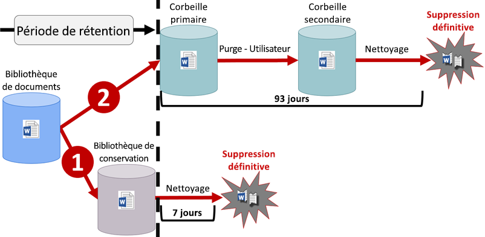
  
Lorsqu’une stratégie de rétention est affectée à un compte OneDrive ou à un site SharePoint, le contenu suit l’un des deux chemins suivants :
  
1. **Si le contenu est modifié ou supprimé** pendant la période de rétention, une copie du contenu d’origine tel qu’il était lorsque la stratégie de rétention a été attribuée est créée dans la bibliothèque de conservation et de préservation des documents. Ici, un travail du minuteur s’exécute régulièrement et identifie les éléments dont la période de rétention a expiré, et ces éléments sont supprimés définitivement dans les sept jours suivant la fin de la période de rétention. 
    
2. **Si le contenu n’est pas modifié ou supprimé** pendant la période de rétention, il est déplacé vers la Corbeille premier niveau à la fin de la période de rétention. Si un utilisateur supprime le contenu à partir de là ou vide cette Corbeille (également appelé purge), le document est déplacé vers la Corbeille second niveau. Une période de rétention de 93 jours s’étend sur les corbeilles premier niveau et second niveau. À la fin des 93 jours, le document est définitivement supprimé de son emplacement, la Corbeille premier niveau ou second niveau. Notez que la Corbeille n’est pas indexée et que, par conséquent, les recherches n’y trouvent pas de contenu. Cela signifie qu’une conservation eDiscovery ne trouve aucun contenu à conserver dans la Corbeille. 
    
### Contenu dans les boîtes aux lettres et les dossiers publics

Pour le courrier, le calendrier et d’autres éléments d’un utilisateur, une stratégie de rétention est appliquée au niveau d’une boîte aux lettres. Pour un dossier public, une stratégie de rétention est appliquée au niveau du dossier, et non au niveau de la boîte aux lettres. Les boîtes aux lettres et les dossiers publics utilisent le dossier Éléments récupérables pour conserver des éléments. Seules les personnes disposant d’autorisations eDiscovery peuvent afficher les éléments dans le dossier Éléments récupérables d’un autre utilisateur.
  
Par défaut, lorsqu’un utilisateur supprime un message d’un dossier autre que le dossier Éléments supprimés, le message est déplacé vers le dossier Éléments supprimés. Lorsqu’une personne supprime un élément dans le dossier Éléments supprimés, le message est déplacé vers le dossier Éléments récupérables. En outre, une personne peut supprimer (récupération possible) un élément (MAJ + SUPPR) dans n’importe quel dossier, ce qui permet d’ignorer le dossier Éléments supprimés et place directement l’élément dans le dossier Éléments récupérables.
  
Un processus évalue régulièrement les éléments du dossier Éléments récupérables. Si un élément ne correspond pas aux règles d’au moins une stratégie de rétention, l’élément est supprimé définitivement (processus également appelé suppression définitive) du dossier Éléments récupérables.
  
Lorsqu’un utilisateur tente de modifier certaines propriétés d’un élément de boîte aux lettres (objet, corps, pièces jointes, expéditeurs et destinataires ou la date d’envoi ou de réception d’un message), une copie de l’élément d’origine est enregistrée dans le dossier Éléments récupérables avant la validation de la modification. Cela se produit à chaque modification ultérieure. À la fin de la période de rétention, les copies présentes dans le dossier Éléments récupérables sont supprimées définitivement.
  
Si un utilisateur quitte votre organisation et que sa boîte aux lettres est incluse dans une stratégie de rétention, la boîte aux lettres devient inactive lorsque le compte d’utilisateur Office 365 est supprimé. Le contenu d’une boîte aux lettres inactive est toujours soumis à une stratégie de rétention placée sur la boîte aux lettres avant que celle-ci ne devienne inactive et ce contenu est disponible pour une recherche eDiscovery. Pour obtenir plus d’informations, consultez l’article [Boîtes aux lettres inactives dans Exchange Online](https://go.microsoft.com/fwlink/?linkid=846909).
  
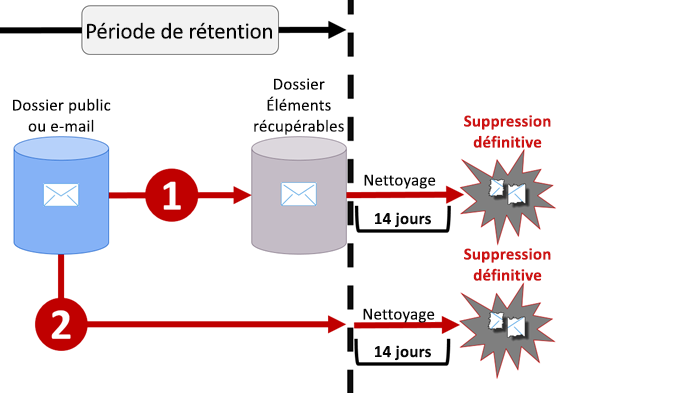
  
Lorsqu’une stratégie de rétention est affectée à une boîte aux lettres ou à un dossier public, le contenu suit l’un des deux chemins suivants :
  
1. **Si l’élément est modifié ou supprimé définitivement** par l’utilisateur (par MAJ + SUPPR ou supprimé du dossier Éléments supprimés) pendant la période de rétention, l’élément est déplacé (ou copié, dans le cas d’une modification) vers le dossier Éléments récupérables. Ici, un processus s’exécute régulièrement et identifie les éléments dont la période de rétention a expiré, et ces éléments sont supprimés définitivement dans les 14 jours suivant la fin de la période de rétention. Notez que le paramètre par défaut est de 14 jours, mais qu’il peut être configuré sur 30 jours. 
    
2. **Si l’élément n’est pas modifié ou supprimé** pendant la période de rétention, le même processus s’exécute régulièrement sur tous les dossiers dans la boîte aux lettres et identifie les éléments dont la période de rétention a expiré, et ces éléments sont supprimés définitivement dans les 14 jours suivant la fin de la période de rétention. Notez que le paramètre par défaut est de 14 jours, mais qu’il peut être configuré sur 30 jours. 
    
## Fonctionnement d’une stratégie de rétention avec les versions d’un document dans un site

Le contrôle de version est une fonctionnalité de toutes les bibliothèques de documents dans SharePoint Online et OneDrive Entreprise. Par défaut, le contrôle de version conserve un minimum de cent versions majeures, même si vous pouvez augmenter cette limite. Pour obtenir plus d’informations, consultez l’article [Activer et configurer le contrôle de version pour une liste ou une bibliothèque](https://support.office.com/article/1555d642-23ee-446a-990a-bcab618c7a37).
  
Une stratégie de rétention conserve toutes les versions d’un document dans un site SharePoint ou un compte OneDrive. Chaque fois qu’un document soumis à une stratégie de rétention est modifié ou supprimé, une version est copiée dans la bibliothèque de conservation et de préservation des documents. Chaque version d’un document dans la bibliothèque de conservation et de préservation des documents existe en tant qu’élément distinct avec sa propre période de rétention :
  
- Si la stratégie de rétention est basée sur la date de création du contenu, chaque version comporte la même date d’expiration que le document d’origine. Le document d’origine et toutes ses versions expirent en même temps.
    
- Si la stratégie de rétention est basée sur la date de la dernière modification du contenu, chaque version possède sa propre date d’expiration basée sur la date à laquelle le document d’origine a été modifié pour créer cette version. Les documents d’origine et ses versions expirent séparément l’un de l’autre.
    
## Conservation du contenu pendant une période de temps spécifique

Une stratégie de rétention vous permet de conserver le contenu indéfiniment ou pour un nombre déterminé de jours, de mois ou d’années. Notez que la durée de conservation du contenu est calculée selon l’ancienneté du contenu, et non en fonction de la date à laquelle la stratégie de rétention a été appliquée. Vous pouvez choisir si l’ancienneté est basée sur la date de création du contenu ou sur la date de sa dernière modification (pour OneDrive et SharePoint).
  
Par exemple, si vous souhaitez conserver le contenu d’un site pendant sept ans à compter de sa dernière modification, et qu’un document dans ce site n’a pas été modifié en six ans, le document sera conservé pendant un an de plus uniquement s’il n’est pas modifié. Si le document est modifié de nouveau, l’ancienneté du document est calculée à partir de la nouvelle date de dernière modification, et il sera conservé pendant sept ans supplémentaires.
  
De même, si vous voulez conserver le contenu d’une boîte aux lettres pendant sept ans et qu’un message a été envoyé il y a six ans, le message est conservé pendant un an seulement. Pour le contenu Exchange, l’ancienneté est toujours basée sur la date de réception ou d’envoi (elles sont identiques). La conservation du contenu basée sur la date de la dernière modification s’applique uniquement au contenu de site dans OneDrive et SharePoint.
  
Vous pouvez choisir de supprimer le contenu de façon définitive à la fin de la période de rétention. Une stratégie de rétention permet également de supprimer du contenu ancien sans le conserver (voir la section suivante).
  
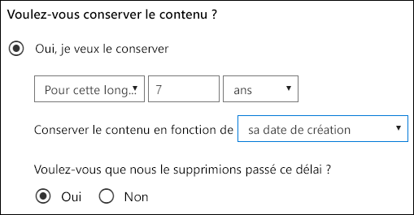
  
## Suppression du contenu antérieur à une date spécifique

Une stratégie de rétention permet à la fois de conserver, puis de supprimer du contenu, ou simplement de supprimer du contenu ancien sans le conserver.
  
Si votre stratégie de rétention supprime du contenu, il est important de comprendre que la période spécifiée pour une stratégie de rétention est calculée en fonction de la date de création ou de modification du contenu, et non de la date d’affectation de la stratégie.
  
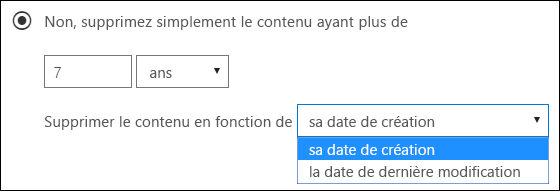
  
Par exemple, supposons que vous créez une stratégie de rétention qui supprime le contenu au bout de trois ans, puis que vous affectez cette stratégie à tous les comptes OneDrive, qui contiennent une grande quantité de contenu créé il y a quatre ou cinq ans. Dans ce cas, une grande quantité de contenu est supprimée peu après l’attribution de la stratégie de rétention pour la première fois. Pour cette raison, **une stratégie de rétention qui supprime le contenu peut avoir un impact considérable sur votre contenu**. 
  
Par conséquent, avant d’affecter une stratégie de rétention à un site pour la première fois, vous devez d’abord tenir compte de l’ancienneté du contenu existant et de la façon dont la stratégie peut avoir une incidence sur ce contenu. Vous pouvez également communiquer la nouvelle stratégie à vos utilisateurs avant de l’affecter, pour leur donner le temps d’évaluer les incidences éventuelles. Remarquez cet avertissement qui apparaît lorsque vous examinez les paramètres pour votre stratégie de rétention juste avant de la créer.
  
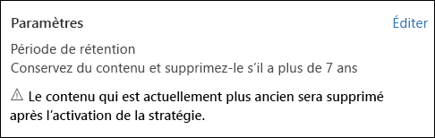
  
## Paramètres avancés qui appliquent une stratégie uniquement au contenu répondant à certaines conditions

Une stratégie de rétention peut s’appliquer à tout le contenu des emplacements qui lui est propre, ou vous pouvez choisir d’appliquer une stratégie de rétention uniquement au contenu qui contient des mots clés spécifiques ou [des types spécifiques d’informations sensibles](what-the-sensitive-information-types-look-for.md).
  
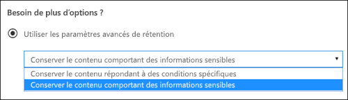
  
### Conservation du contenu qui contient des mots clés spécifiques

Vous pouvez appliquer une stratégie de rétention uniquement au contenu remplissant certaines conditions, puis mener des actions de rétention seulement sur ce contenu. Les conditions actuellement disponibles prennent en charge l’application d’une stratégie de rétention au contenu comprenant des mots ou des phrases spécifiques. Vous pouvez affiner votre requête à l’aide des opérateurs de recherche tels que AND, OR et NOT. Pour obtenir plus d’informations sur ces opérateurs, consultez l’article [Requêtes par mots clés et conditions de recherche pour la recherche de contenu](keyword-queries-and-search-conditions.md).
  
La prise en charge de l’ajout de propriétés utilisables dans une requête (par exemple, **subject:**) sera bientôt disponible.
  
Notez que la rétention basée sur une requête utilise l’index de recherche pour identifier le contenu.
  
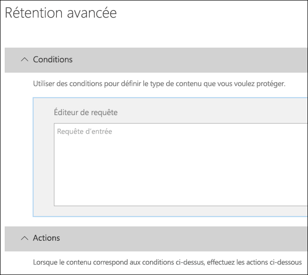
  
### Conservation du contenu qui contient des informations sensibles

Vous pouvez également appliquer une stratégie de rétention uniquement au contenu qui contient [des types spécifiques d’informations sensibles](what-the-sensitive-information-types-look-for.md). Par exemple, vous pouvez choisir d’appliquer des exigences de rétention uniques seulement au contenu qui contient des informations d’identification personnelle (PII) telles que les identifiants fiscaux, les numéros de sécurité sociale ou les numéros de passeport.
  
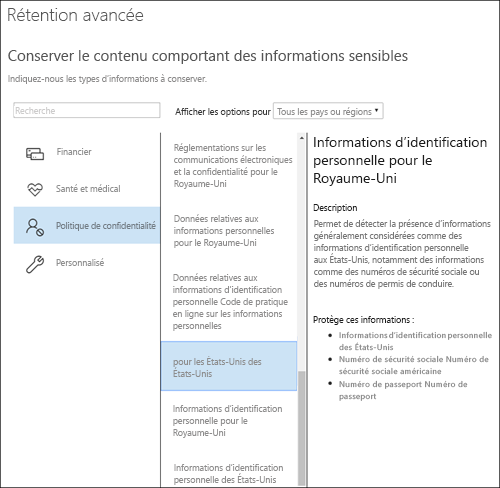
  
Remarques :
  
- La rétention avancée des informations sensibles ne s’applique pas aux dossiers publics Exchange ou Skype Entreprise, car ces emplacements ne prennent pas en charge les types d’informations sensibles.
    
- Étant donné qu’Exchange Online utilise les règles de transport pour identifier les informations sensibles, cette stratégie ne fonctionne que sur les messages en transit, pas sur tous les éléments déjà stockés dans une boîte aux lettres. Pour Exchange Online, cela signifie qu’une stratégie de rétention peut identifier les informations sensibles et mener des actions de rétention uniquement sur les messages reçus **après** l’application de la stratégie à la boîte aux lettres (notez que la rétention basée sur une requête décrite dans la section précédente n’a pas cette limitation, car elle utilise l’index de recherche pour identifier le contenu). 
    
## Application d’une stratégie de rétention à l’ensemble d’une organisation ou des emplacements spécifiques

Vous pouvez facilement appliquer une stratégie de rétention à l’ensemble d’une organisation, des emplacements entiers, ou uniquement à certains emplacements ou utilisateurs.
  
### Stratégie mise en place à l’échelle de l’organisation

L’une des fonctionnalités les plus puissantes d’une stratégie de rétention est que celle-ci s’applique par défaut aux emplacements au sein d’Office 365, notamment :
  
- Messagerie Exchange
    
- Sites SharePoint
    
- Comptes OneDrive
    
- Les groupes Office 365 (s’applique au contenu de la boîte aux lettres, du site et des documents du groupe. La prise en charge pour le contenu dans Planner, Yammer et CRM sera bientôt disponible.)
    
- Dossiers publics Exchange
    
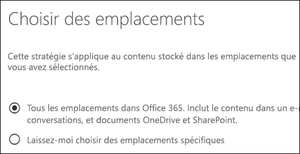
  
Voici d’autres fonctionnalités importantes d’une stratégie de rétention mise en place à l’échelle de l’organisation :
  
- Il n’existe aucune limite au nombre de boîtes aux lettres ou de sites que la stratégie peut inclure.
    
- Pour Exchange, toute nouvelle boîte aux lettres créée après l’application de la stratégie hérite automatiquement de la stratégie.
    
Toutefois, il existe une limite de 10 stratégies mise en place à l’échelle de l’organisation et d’emplacements entiers par locataire (voir la section suivante).
  
### Une stratégie qui s’applique aux emplacements entiers

Lorsque vous choisissez des emplacements, vous pouvez facilement inclure ou exclure un emplacement entier, tel que la messagerie Exchange ou les comptes OneDrive. Pour ce faire, il suffit d’activer ou de désactiver le **Statut** de cet emplacement. 
  
Comme pour une stratégie mise en place à l’échelle de l’organisation, si une stratégie s’applique à n’importe quelle combinaison d’emplacements entiers, il n’existe aucune limite au nombre de boîtes aux lettres ou de sites que la stratégie peut inclure. Par exemple, si une stratégie inclut toute la messagerie Exchange et tous les sites SharePoint, l’ensemble des sites et des boîtes aux lettres est également inclus, quel que soit le nombre. Et pour Exchange, toute nouvelle boîte aux lettres créée après la stratégie hérite automatiquement de la stratégie.
  
Toutefois, il existe une limite de 10 stratégies mise en place à l’échelle de l’organisation et d’emplacements entiers par locataire.
  

  
### Une stratégie avec des inclusions ou exclusions spécifiques

Vous pouvez également appliquer une stratégie de rétention à des utilisateurs spécifiques. Pour ce faire, activez le **Statut** de cet emplacement, puis utilisez les liens pour inclure ou exclure des utilisateurs, des groupes Office 365 ou des emplacements spécifiques. 
  
Cependant, notez que les limites suivantes existent pour une stratégie de rétention qui inclut ou exclut plus de 1 000 utilisateurs spécifiques :
  
- Une telle stratégie de rétention peut contenir 1 000 boîtes aux lettres et 100 sites au maximum.
    
- Un client peut contenir 1 000 stratégies de rétention au maximum.
    
Bien que ces limites existent, notez que vous pouvez les contourner en appliquant une stratégie mise en place à l’échelle de l’organisation ou une stratégie qui s’applique aux emplacements entiers.
  
### Emplacements Skype

Contrairement à la messagerie Exchange, vous ne pouvez pas simplement activer le statut de l’emplacement Skype pour inclure tous les utilisateurs, mais vous pouvez activer cet emplacement, puis sélectionner manuellement les utilisateurs dont vous souhaitez conserver les conversations.
  
Lorsque vous choisissez des utilisateurs de Skype Entreprise, vous pouvez rapidement inclure tous les utilisateurs en sélectionnant la zone **Nom** dans l’en-tête de colonne. Toutefois, il est important de comprendre que chaque utilisateur compte comme une inclusion spécifique dans la stratégie. Par conséquent, si vous incluez plus de 1 000 utilisateurs, les limites indiquées dans la section précédente s’appliquent. Sélectionner tous les utilisateurs Skype ici n’est pas pareil qu’une stratégie mise en place à l’échelle de l’organisation pouvant inclure tous les utilisateurs Skype par défaut. 
  
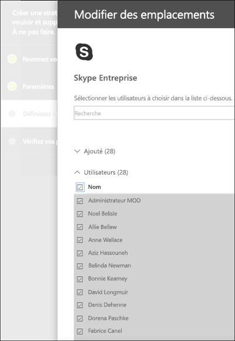
  
Notez que **Historique des conversations**, un dossier dans Outlook, est une fonctionnalité qui n’a rien à voir avec l’archivage Skype. La fonctionnalité **Historique des conversations** peut être désactivée par l’utilisateur final, mais l’archivage pour Skype s’effectue en stockant une copie des conversations Skype dans un dossier masqué inaccessible à l’utilisateur, mais disponible pour eDiscovery. 
  
### Emplacements Teams

Vous pouvez utiliser une stratégie de rétention pour conserver des conversations et des messages de canal dans Teams. Les conversations Teams sont stockées dans un dossier masqué dans la boîte aux lettres de chaque utilisateur inclus dans la conversation, et les messages de canal Teams sont stockés dans un dossier masqué similaire dans la boîte aux lettres de groupe de l’équipe. Toutefois, il est important de comprendre que Teams utilise un service de conversation basé sur Azure qui stocke également ces données. Par défaut, ce service stocke les données indéfiniment. Pour cette raison, nous vous recommandons vivement d’utiliser l’emplacement Teams pour conserver et supprimer des données Teams. Utiliser l’emplacement Teams permet de supprimer définitivement des données à partir de boîtes aux lettres Exchange et du service de conversation basé sur Azure. Pour obtenir plus d’informations, consultez l’article [Présentation de la sécurité et de la conformité dans Microsoft Teams](https://go.microsoft.com/fwlink/?linkid=871258).
  
Notez que les conversations et les messages de canal Teams ne sont pas affectés par les stratégies de rétention appliquées aux boîtes aux lettres utilisateur ou de groupe dans les emplacements d’Exchange ou de groupes Office 365. Même si les conversations et les messages de canal Teams sont stockés dans Exchange, ils sont affectés uniquement par une stratégie de rétention appliquée à l’emplacement Teams.
  
Nous continuons de travailler sur la rétention dans Teams, et des fonctionnalités supplémentaires sont à venir. En attendant, voici quelques limitations dont il faut tenir compte :
  
- **Teams requiert une stratégie de rétention distincte** Lorsque vous créez une stratégie de rétention et que vous activez l’emplacement Teams, tous les autres emplacements sont désactivés. Une stratégie de rétention qui inclut Teams ne peut inclure que Teams et aucun autre emplacement. 
    
- **Teams n’est pas inclus dans une stratégie mise en place à l’échelle de l’organisation** Si vous créez une stratégie mise en place à l’échelle de l’organisation, Teams n’est pas inclus, car il nécessite une stratégie de rétention distincte. 
    
- **Teams ne prend pas en charge la rétention avancée** Lorsque vous créez une stratégie de rétention, si vous choisissez les [paramètres avancés qui appliquent une stratégie uniquement au contenu qui répond à certaines conditions](retention-policies.md#advanced), l’emplacement Teams n’est pas disponible. À ce stade, la rétention dans Teams s’applique à tout le contenu de la conversation et du message de canal.
    
- **Le contenu Teams doit avoir été créé il y a 30 jours ou plus pour pouvoir être supprimé** À ce stade, la création d’une stratégie pour supprimer le contenu Teams de moins de 30 jours n’est pas prise en charge. Si vous souhaitez que cette stratégie soit appliquée au contenu Teams, indiquez une période de rétention égale ou supérieure à 30 jours. 
    
- **Teams peut prendre jusqu’à 30 jours pour nettoyer le contenu conservé** Une stratégie de rétention appliquée à Teams permet de supprimer le contenu de tous les emplacements de stockage pertinents. Toutefois, immédiatement après le lancement, cela peut prendre jusqu’à 30 jours à Teams pour nettoyer le contenu en fonction de la stratégie de rétention. Mais même si le contenu apparaît toujours dans les clients Teams, ce contenu n’apparaît pas dans la recherche de contenu ou eDiscovery après la fin de la période de rétention. 
    
Dans une équipe, les fichiers partagés dans une conversation sont stockés dans le compte OneDrive de l’utilisateur qui a partagé le fichier. Les fichiers chargés sur des canaux sont stockés dans le site SharePoint pour l’équipe en question. Par conséquent, pour conserver ou supprimer des fichiers dans une équipe, vous devez créer une stratégie de rétention qui s’applique aux emplacements SharePoint et OneDrive. Si vous voulez appliquer une stratégie aux fichiers d’une équipe spécifique, vous pouvez choisir le site SharePoint de l’équipe et les comptes OneDrive des utilisateurs au sein de l’équipe.
  
Une stratégie de rétention qui s’applique à Teams peut utiliser le [Verrouillage de conservation](retention-policies.md#locking).
  
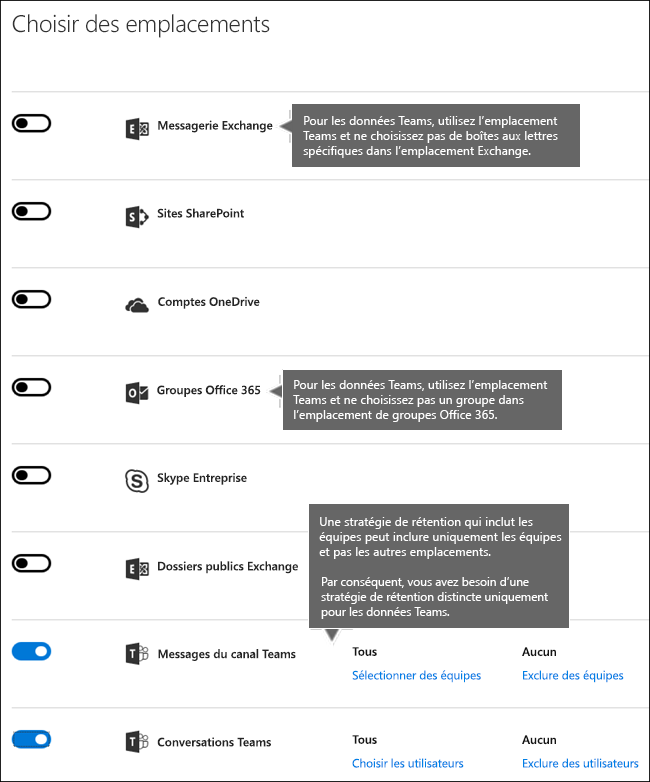
  
## Exclusion de types spécifiques d’éléments Exchange d’une stratégie de rétention
À l’aide de PowerShell, vous pouvez exclure des types spécifiques d’éléments Exchange d’une stratégie de rétention. Par exemple, vous pouvez exclure des messages vocaux, des conversations par messagerie instantanée et d’autre contenu Skype Entreprise Online dans les boîtes aux lettres. Vous pouvez également exclure des éléments de calendrier, de note et de tâche. Cette fonctionnalité est disponible uniquement à l’aide de PowerShell ; elle n’est pas disponible dans l’interface utilisateur lorsque vous créez une stratégie de rétention.
  
Pour ce faire, utilisez le paramètre `ExcludedItemClasses` des cmdlets `New-RetentionComplianceRule` et `Set-RetentionComplianceRule`. Pour obtenir plus d’informations sur PowerShell, consultez la section [Trouver les cmdlets PowerShell pour les stratégies de rétention](retention-policies.md#powershell) indiquée ci-après.
  
## Verrouillage d’une stratégie de rétention
Certaines organisations doivent respecter des règles définies par des organismes de réglementation, comme la règle 17a-4 de la SEC (Securities and Exchange Commission), stipulant qu’après l’activation d’une stratégie de rétention, celle-ci ne peut pas être désactivée ni rendue moins restrictive. Grâce au verrouillage de conservation, vous pouvez verrouiller la stratégie afin que personne ne puisse la désactiver ni la rendre moins restrictive, pas même l’administrateur.
  
Après qu’une stratégie a été verrouillée, personne ne peut la désactiver ou en supprimer des emplacements. De plus, il n’est pas possible de modifier ni de supprimer le contenu soumis à la stratégie pendant la période de rétention. Une fois que la stratégie est verrouillée, vous pouvez seulement y ajouter des emplacements ou la prolonger. Une stratégie verrouillée peut être accrue ou étendue, mais pas réduite ni désactivée.
  
Par conséquent, avant de verrouiller une stratégie de rétention, il est **essentiel** de comprendre les exigences de conformité de votre organisation. **Ne verrouillez pas une stratégie** tant que vous n’êtes pas certain qu’elle répond exactement à vos besoins.
  
Seule l’utilisation de PowerShell vous permet de verrouiller une stratégie de rétention. Utilisez le paramètre `RestrictiveRetention` de la cmdlet `New-RetentionCompliancePolicy` ou `Set-RetentionCompliancePolicy`. Pour obtenir plus d’informations sur PowerShell, consultez la section [Trouver les cmdlets PowerShell pour les stratégies de rétention](retention-policies.md#powershell) indiquée ci-après.
  
## Principes de rétention et priorité

Il est possible, voire même probable, que le contenu fasse l’objet de plusieurs stratégies de rétention, chacune avec une action (conserver, supprimer ou les deux) et une période de rétention différentes. Laquelle est prioritaire ? Au plus haut niveau, sachez que le contenu conservé par une stratégie ne peut pas être supprimé définitivement par une autre stratégie.
  

  
Pour comprendre comment les différentes stratégies de rétention s’appliquent au contenu, prenez en compte les principes de rétention suivants :
  
1. **La rétention l’emporte sur la suppression.** Supposons qu’une stratégie de rétention stipule de supprimer la messagerie Exchange au bout de trois ans, mais qu’une autre stratégie de rétention stipule de la conserver pendant cinq ans, puis de la supprimer. Le contenu atteignant trois ans est supprimé et masqué de la vue des utilisateurs, mais est conservé dans le dossier Éléments récupérables jusqu’à ce que le contenu atteigne cinq ans, avant d’être définitivement supprimé. 
    
2. **La plus longue période de rétention l’emporte. ** Si du contenu est soumis à plusieurs stratégies de rétention, il est conservé jusqu’à la fin de la période de rétention la plus longue. 
    
3. **L’inclusion explicite l’emporte sur l’inclusion implicite. ** Il faut donc prendre en compte les points suivants : 
    
    1. Si une étiquette avec des paramètres de rétention est attribuée manuellement par un utilisateur à un élément, par exemple, un e-mail Exchange ou un document OneDrive, cette étiquette est prioritaire sur une stratégie assignée au niveau du site ou de la boîte aux lettres et une étiquette par défaut attribuée par la bibliothèque de documents. Par exemple, si l’étiquette explicite stipule que la période de rétention est de dix ans, mais que la stratégie appliquée au site indique que la période de rétention est de cinq ans, l’étiquette est prioritaire. Notez que les étiquettes appliquées automatiquement sont considérées comme implicites et non explicites, car elles sont appliquées automatiquement par Office 365.
    
    2. Si une stratégie de rétention inclut un emplacement spécifique, tel que la boîte aux lettres d’un utilisateur spécifique ou compte OneDrive Entreprise, cette stratégie l’emporte sur une autre stratégie de rétention qui s’applique à l’ensemble des boîtes aux lettres ou des comptes OneDrive Entreprise des utilisateurs, mais n’inclut pas spécifiquement la boîte aux lettres de l’utilisateur en question.
    
4. **La période de suppression la plus courte l’emporte. ** De même, si du contenu est soumis à plusieurs stratégies de suppression (sans aucune rétention), il est supprimé à la fin de la période de rétention la plus courte. 
    
Notez que les principes de rétention opèrent comme un flux de partage du haut vers le bas : si les règles appliquées par toutes les stratégies ou étiquettes sont identiques sur un même niveau, le flux passe au niveau inférieur pour déterminer la règle prioritaire à appliquer.
  
Enfin, une stratégie de rétention ou une étiquette ne peut pas supprimer définitivement du contenu placé en conservation pour eDiscovery. Lorsque cette conservation est levée, le contenu est de nouveau éligible pour le processus de nettoyage décrit ci-dessus.
  
## Utilisation d’une stratégie de rétention au lieu de ces fonctionnalités

Vous pouvez facilement appliquer une stratégie de rétention unique à l’ensemble de l’organisation et des emplacements sur Office 365, notamment Exchange Online, SharePoint Online, OneDrive Entreprise et les groupes Office 365. Si vous avez besoin de conserver ou supprimer du contenu dans Office 365, nous vous recommandons d’utiliser une stratégie de rétention (vous pouvez également utiliser des étiquettes avec des paramètres de rétention ; pour obtenir plus d’informations, consultez l’article [Vue d’ensemble des étiquettes](labels.md)).
  
Il existe plusieurs autres fonctionnalités utilisées auparavant pour conserver ou supprimer du contenu dans Office 365. Celles-ci sont répertoriées ci-dessous. Ces fonctionnalités continuent de fonctionner parallèlement aux stratégies de rétention et aux étiquettes créées dans le Centre de sécurité &amp; conformité. Cependant, pour la gouvernance des données, nous vous recommandons d’utiliser une stratégie de rétention ou des étiquettes au lieu de ces fonctionnalités. Une stratégie de rétention est la seule fonctionnalité qui permet de conserver et de supprimer du contenu dans Office 365.
  
### Exchange Online

- [Gestion des cas eDiscovery dans le Centre de sécurité &amp; conformité Office 365](https://support.office.com/article/edea80d6-20a7-40fb-b8c4-5e8c8395f6da) (conservation eDiscovery) 
    
- [Conservation inaltérable et conservation pour litige](https://go.microsoft.com/fwlink/?linkid=846124) (conservation eDiscovery) 
    
- [Balises de rétention et stratégies de rétention](https://go.microsoft.com/fwlink/?linkid=846125), aussi appelées [gestion des enregistrements de messagerie (MRM)](https://go.microsoft.com/fwlink/?linkid=846126) (suppression uniquement) 
    
### Sharepoint Online et OneDrive Entreprise

- [Gestion des cas eDiscovery dans le Centre de sécurité &amp; conformité Office 365](https://support.office.com/article/edea80d6-20a7-40fb-b8c4-5e8c8395f6da) (conservation eDiscovery) 
    
- [Ajout du contenu à un incident et placement des sources en conservation dans le centre eDiscovery](https://support.office.com/article/54d70de9-1ec2-4325-84f3-aeb588554479) (conservation eDiscovery) 
    
- [Vue d’ensemble des stratégies de suppression de documents](https://support.office.com/article/55e8d858-f278-482b-a198-2e62d6a2e6e5) (suppression uniquement) 
    
- [Configuration en place de gestion des enregistrements](https://support.office.com/article/7707a878-780c-4be6-9cb0-9718ecde050a) (rétention) 
    
- [Utilisation de stratégies pour la fermeture et la suppression de sites](https://support.office.com/article/a8280d82-27fd-48c5-9adf-8a5431208ba5) (suppression uniquement) 
    
- [Stratégies de gestion des informations](intro-to-info-mgmt-policies.md) (suppression uniquement) 
    
Notez que si vous avez déjà utilisé des conservations eDiscovery aux fins de gouvernance des données, vous devez utiliser à la place une stratégie de rétention pour assurer une conformité proactive. Vous devez utiliser une conservation créée dans le Centre de sécurité &amp; conformité uniquement pour eDiscovery.
  
### Les stratégies de rétention remplacent les stratégies de gestion des informations

Dans les sites SharePoint, vous utilisez peut-être des [stratégies de gestion des informations](intro-to-info-mgmt-policies.md) pour conserver du contenu. Si vous appliquez une stratégie de rétention créée dans le Centre de sécurité et conformité à un site qui utilise déjà des stratégies de type de contenu ou des stratégies de gestion des informations pour une liste ou une bibliothèque, ces stratégies sont ignorées lorsque la stratégie de rétention est en vigueur. 
  
## Qu’est-il advenu des stratégies de conservation ?

Si vous utilisiez une stratégie de conservation, cette stratégie a été automatiquement convertie en stratégie de rétention qui utilise uniquement l’action de conservation : la stratégie ne va pas supprimer le contenu. La stratégie de conservation continuera de fonctionner et de conserver votre contenu sans exiger de modifications. Ces stratégies sont disponibles sur la page **Rétention** dans le Centre de sécurité &amp; conformité. Vous pouvez modifier une stratégie de conservation pour modifier la période de rétention, mais vous ne pouvez pas apporter d’autres modifications, par exemple, ajouter ou supprimer des emplacements. 
  
## Autorisations

Les membres de votre équipe de conformité appelés à créer des stratégies de rétention nécessitent des autorisations pour le Centre de sécurité &amp; conformité. Par défaut, votre administrateur client a accès à cet emplacement et peut accorder l’accès aux responsables de la mise en conformité et à d’autres personnes au Centre de sécurité &amp; conformité, sans leur donner toutes les autorisations d’un administrateur client. Pour ce faire, nous vous recommandons d’accéder à la page **Autorisations** du Centre de sécurité &amp; conformité, de modifier le groupe de rôles **Administrateur de conformité** et d’ajouter des membres à ce groupe de rôles. 
  
Pour obtenir plus d’informations, consultez l’article [Octroi de l’accès au Centre de sécurité &amp; conformité Office 365 aux utilisateurs](grant-access-to-the-security-and-compliance-center.md).
  
Ces autorisations sont requises uniquement pour créer et appliquer une stratégie de rétention. L’application d’une stratégie ne nécessite pas d’accès au contenu.
  
## Trouver les cmdlets PowerShell pour les stratégies de rétention

Pour utiliser les cmdlets des stratégies de rétention, vous devez effectuer les étapes suivantes :
  
1. [Se connecter au Centre de sécurité &amp; conformité Office 365 à l’aide de PowerShell à distance](http://go.microsoft.com/fwlink/?LinkID=799771&amp;clcid=0x409)
    
2. Utiliser ces [Cmdlets du Centre de sécurité &amp; conformité Office 365](http://go.microsoft.com/fwlink/?LinkID=799772&amp;clcid=0x409)
    
## Plus d’informations

- [Vue d’ensemble des étiquettes](labels.md)
    

