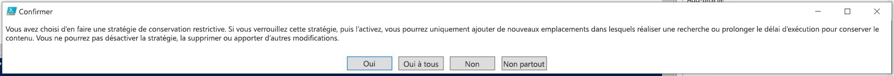

# Vue d’ensemble des stratégies de rétentionOverview of retention policies

Le volume et la complexité des données (e-mails, documents, messages instantanés et bien plus encore) de la majorité des organisations augmentent quotidiennement. Il est important de gérer et de gouverner efficacement ces informations, car vous devez :For most organizations, the volume and complexity of their data is increasing daily - email, documents, instant messages, and more. Effectively managing or governing this information is important because you need to:
  
- **respecter de façon proactive les réglementations du secteur et les stratégies internes** qui vous obligent à conserver du contenu pendant une période minimale. Par exemple, la loi Sarbanes-Oxley vous oblige à conserver certains types de contenu pendant sept ans ;**Comply proactively with industry regulations and internal policies** that require you to retain content for a minimum period of time - for example, the Sarbanes-Oxley Act might require you to retain certain types of content for seven years. 
    
- **réduire les risques en cas de litige ou de violation de la sécurité** en supprimant définitivement le contenu ancien qu’il n’est plus obligatoire de conserver ;**Reduce your risk in the event of litigation or a security breach** by permanently deleting old content that you're no longer required to keep. 
    
- **aider votre organisation à partager efficacement les connaissances et à être plus agile** en vérifiant que vos utilisateurs traitent uniquement le contenu actuel et pertinent pour eux.**Help your organization to share knowledge effectively and be more agile** by ensuring that your users work only with content that's current and relevant to them. 
    
Une stratégie de rétention dans Office 365 peut vous aider à atteindre ces objectifs. La gestion du contenu nécessite généralement les deux actions suivantes :A retention policy in Office 365 can help you achieve all of these goals. Managing content commonly requires two actions:
  
- **Conservation** du contenu afin que celui-ci ne puisse pas être supprimé définitivement avant la fin de la période de rétention.**Retaining** content so that it can't be permanently deleted before the end of the retention period. 
    
- **Suppression** définitive du contenu à la fin de la période de rétention.**Deleting** content permanently at the end of the retention period. 
    
Une stratégie de rétention vous permet d’effectuer les actions suivantes :With a retention policy, you can:
  
- Décider de façon proactive de conserver du contenu, de le supprimer (ou les deux), de conserver du contenu, puis de le supprimer.Decide proactively whether to retain content, delete content, or both - retain and then delete the content.
    
- Appliquer une stratégie unique à l’ensemble de l’organisation ou à seulement quelques emplacements ou utilisateurs.Apply a single policy to the entire organization or just specific locations or users.
    
- Appliquer une stratégie à tout le contenu ou seulement au contenu remplissant certaines conditions, comme le contenu comportant des mots clés spécifiques ou [des types spécifiques d’informations sensibles](what-the-sensitive-information-types-look-for.md).Apply a policy to all content or just content meeting certain conditions, such as content containing specific keywords or [specific types of sensitive information](what-the-sensitive-information-types-look-for.md).
    
Lorsque le contenu est soumis à une stratégie de rétention, les utilisateurs peuvent continuer à le modifier et à l’utiliser comme si rien n’avait changé, car le contenu est conservé sur place, à son emplacement d’origine. Mais si quelqu’un modifie ou supprime le contenu qui est soumis à la stratégie, une copie est enregistrée dans un emplacement sécurisé où elle est conservée tant que la stratégie est en vigueur.When content is subject to a retention policy, people can continue to edit and work with the content as if nothing's changed because the content is retained in place, in its original location. But if someone edits or deletes content that's subject to the policy, a copy is saved to a secure location where it's retained while the policy is in effect.
  
Enfin, certaines organisations doivent respecter des réglementations telles que la règle 17a-4 de la SEC (Securities and Exchange Commission), stipulant qu’après l’activation d’une stratégie de rétention, celle-ci ne peut pas être désactivée ni rendue moins restrictive. Pour remplir cette obligation, vous pouvez utiliser le verrouillage de conservation. Une fois la stratégie verrouillée, personne ne peut la désactiver ni la rendre moins restrictive, pas même l’administrateur.Finally, some organizations might need to comply with regulations such as Securities and Exchange Commission (SEC) Rule 17a-4, which requires that after a retention policy is turned on, it cannot be turned off or made less restrictive. To meet this requirement, you can use Preservation Lock. After a policy's been locked, no one—including the administrator—can turn off the policy or make it less restrictive.
  
Vous créez et gérez des stratégies de rétention sur la page **Rétention** dans le Centre de sécurité &amp; conformité d’Office 365.You create and manage retention policies on the **Retention** page in the Office 365 Security &amp; Compliance Center. 
  

  
> [!NOTE]
> Pour inclure une boîte aux lettres Exchange Online dans une stratégie de rétention, la boîte aux lettres doit disposer d’une licence Exchange Online Plan 2. Si une boîte aux lettres dispose d’une licence Exchange Online Plan 1, vous devez lui attribuer une licence Archivage Exchange Online distincte pour l’inclure dans une stratégie de rétention.To include an Exchange Online mailbox in a retention policy, the mailbox must be assigned an Exchange Online Plan 2 license. If a mailbox is assigned an Exchange Online Plan 1 license, you would have to assign it a separate Exchange Online Archiving license to include it in a retention policy. 
  
## Fonctionnement d’une stratégie de rétention avec du contenu sur placeHow a retention policy works with content in place

Lorsque vous incluez un emplacement tel qu’un site ou une boîte aux lettres dans une stratégie de rétention, le contenu reste dans son emplacement d’origine. Les utilisateurs peuvent continuer à traiter leurs documents ou leurs e-mails comme si rien n’avait changé. Cependant, s’ils modifient ou suppriment le contenu inclus dans la stratégie, une copie du contenu tel qu’il était lorsque vous avez appliqué la stratégie est conservée.When you include a location such as a site or mailbox in a retention policy, the content remains in its original location. People can continue to work with their documents or mail as if nothing's changed. But if they edit or delete content that's included in the policy, a copy of the content as it existed when you applied the policy is retained.
  
Pour les sites, une copie du contenu d’origine est conservée dans la bibliothèque de conservation et de préservation des documents lorsque les utilisateurs le modifient ou le suppriment ; pour la messagerie et les dossiers publics, la copie est conservée dans le dossier Éléments récupérables. Ces emplacements sécurisés et le contenu conservé ne sont pas visibles à la plupart des utilisateurs. Avec une stratégie de rétention, il n’est même pas nécessaire de savoir que le contenu est soumis à la stratégie.For sites, a copy of the original content is retained in the Preservation Hold library when users edit or delete it; for email and public folders, the copy is retained in the Recoverable Items folder. These secure locations and the retained content are not visible to most people. With a retention policy, people do not even need to know that their content is subject to the policy.
  
Remarques :Notes:
  
- Le contenu Skype est stocké dans Exchange, où la stratégie est appliquée en fonction du type de message (e-mail ou conversation).Skype content is stored in Exchange, where the policy is applied based on message type (email or conversation).
    
- Une stratégie de rétention appliquée à un groupe Office 365 inclut la boîte aux lettres de groupe et le site.A retention policy applied to an Office 365 group includes both the group mailbox and site.
    
### Contenu des comptes OneDrive et des sites SharePointContent in OneDrive accounts and SharePoint sites

Une stratégie de rétention est appliquée au niveau d’un site. Lorsque vous incluez un site SharePoint ou un compte OneDrive dans une stratégie de rétention, une bibliothèque de conservation et de préservation des documents est créée, le cas échéant. La plupart des utilisateurs ne peuvent pas visualiser cette bibliothèque, car elle n’est visible qu’aux administrateurs de collection de sites.A retention policy is applied at the level of a site. When you include a SharePoint site or OneDrive account in a retention policy, a Preservation Hold library is created, if one doesn't already exist. Most users can't view the Preservation Hold library because it's visible only to site collection administrators.
  
Si une personne tente de modifier ou de supprimer le contenu dans un site qui est soumis à une stratégie de rétention, la stratégie vérifie d’abord si le contenu a été modifié depuis qu’elle a été appliquée. S’il s’agit du premier changement depuis l’application de la stratégie de rétention, celle-ci copie le contenu dans la bibliothèque de conservation et de préservation des documents, puis permet à la personne de modifier ou de supprimer le contenu d’origine. Notez que tout le contenu du site peut être copié dans la bibliothèque de conservation et de préservation des documents, même si le contenu ne correspond pas à la requête utilisée par la stratégie de rétention.If a person attempts to change or delete content in a site that's subject to a retention policy, first the policy checks whether the content's been changed since the policy was applied. If this is the first change since the policy was applied, the retention policy copies the content to the Preservation Hold library, and then allows the person to change or delete the original content. Note that any content in the site can be copied to the Preservation Hold library, even if the content does not match the query used by the retention policy.
  
Ensuite, un travail du minuteur nettoie la bibliothèque de conservation et de préservation des documents. Le travail du minuteur s’exécute périodiquement et compare tout le contenu de la bibliothèque de conservation et de préservation des documents à toutes les requêtes utilisées par les stratégies de rétention sur le site. À moins que le contenu corresponde à au moins une des requêtes, le travail du minuteur supprime définitivement le contenu de la bibliothèque de conservation et de préservation des documents.Then a timer job cleans up the Preservation Hold library. The timer job runs periodically and compares all content in the Preservation Hold library to all of the queries used by the retention policies on the site. Unless content matches at least one of the queries, the timer job permanently deletes the content from the Preservation Hold library.
  
Le précédent s’applique au contenu qui existe lorsque la stratégie de rétention est appliquée. En outre, tout contenu qui est créé ou ajouté au site après avoir été inclus dans la stratégie sera conservé après la suppression. Toutefois, le nouveau contenu n’est pas copié dans la bibliothèque de conservation et de préservation des documents la première fois qu’il est modifié, uniquement lorsqu’il est supprimé. Pour conserver les versions de tous les fichiers, vous devez activer le contrôle de version (consultez la section ci-après sur le contrôle de version).The previous applies to content that exists when the retention policy is applied. In addition, any new content that's created or added to the site after it was included in the policy will be retained after deletion. However, new content isn't copied to the Preservation Hold library the first time it's edited, only when it's deleted. To retain all versions of a file, you need to turn on versioning — see the below section on versioning.
  
Notez qu’un utilisateur reçoit un message d’erreur s’il tente de supprimer une bibliothèque, une liste, un dossier ou un site soumis à une stratégie de rétention. Un utilisateur peut supprimer un dossier s’il déplace ou supprime d’abord les fichiers du dossier en question qui sont soumis à la stratégie.Note that a user will receive an error if they try to delete a library, list, folder, or site that's subject to a retention policy. A user can delete a folder if they first move or delete any files in the folder that are subject to the policy.
  

  
Lorsqu’une stratégie de rétention est affectée à un compte OneDrive ou à un site SharePoint, le contenu suit l’un des deux chemins suivants :After a retention policy is assigned to a OneDrive account or SharePoint site, content can follow one of two paths:
  
1. **Si le contenu est modifié ou supprimé** pendant la période de rétention, une copie du contenu d’origine tel qu’il était lorsque la stratégie de rétention a été attribuée est créée dans la bibliothèque de conservation et de préservation des documents. Ici, un travail du minuteur s’exécute régulièrement et identifie les éléments dont la période de rétention a expiré, et ces éléments sont supprimés définitivement dans les sept jours suivant la fin de la période de rétention.**If the content is modified or deleted** during the retention period, a copy of the original content as it existed when the retention policy was assigned is created in the Preservation Hold library. There, a timer job runs periodically and identifies items whose retention period has expired, and these items are permanently deleted within seven days of the end of the retention period. 
    
2. **Si le contenu n’est pas modifié ou supprimé** pendant la période de rétention, il est déplacé vers la Corbeille premier niveau à la fin de la période de rétention. Si un utilisateur supprime le contenu à partir de là ou vide cette Corbeille (également appelé purge), le document est déplacé vers la Corbeille second niveau. Une période de rétention de 93 jours s’étend sur les corbeilles premier niveau et second niveau. À la fin des 93 jours, le document est définitivement supprimé de son emplacement, la Corbeille premier niveau ou second niveau. Notez que la Corbeille n’est pas indexée et que, par conséquent, les recherches n’y trouvent pas de contenu. Cela signifie qu’une conservation eDiscovery ne trouve aucun contenu à conserver dans la Corbeille.**If the content is not modified or deleted** during the retention period, it's moved to the first-stage Recycle Bin at the end of the retention period. If a user deletes the content from there or empties this Recycle Bin (also known as purging), the document is moved to the second-stage Recycle Bin. A 93-day retention period spans both the first- and second-stage recycle bins. At the end of 93 days, the document is permanently deleted from wherever it resides, in either the first- or second-stage Recycle Bin. Note that the Recycle Bin is not indexed and therefore searches do not find content there. This means that an eDiscovery hold can't locate any content in the Recycle Bin in order to hold it. 
    
### Contenu dans les boîtes aux lettres et les dossiers publicsContent in mailboxes and public folders

Pour le courrier, le calendrier et d’autres éléments d’un utilisateur, une stratégie de rétention est appliquée au niveau d’une boîte aux lettres. Pour un dossier public, une stratégie de rétention est appliquée au niveau du dossier, et non au niveau de la boîte aux lettres. Les boîtes aux lettres et les dossiers publics utilisent le dossier Éléments récupérables pour conserver des éléments. Seules les personnes disposant d’autorisations eDiscovery peuvent afficher les éléments dans le dossier Éléments récupérables d’un autre utilisateur.For a user's mail, calendar, and other items, a retention policy is applied at the level of a mailbox. For a public folder, a retention policy is applied at the folder level, not the mailbox level. Both a mailbox and a public folder use the Recoverable Items folder to retain items. Only people whom have been assigned eDiscovery permissions can view items in another user's Recoverable Items folder.
  
Par défaut, lorsqu’un utilisateur supprime un message d’un dossier autre que le dossier Éléments supprimés, le message est déplacé vers le dossier Éléments supprimés. Lorsqu’une personne supprime un élément dans le dossier Éléments supprimés, le message est déplacé vers le dossier Éléments récupérables. En outre, une personne peut supprimer (récupération possible) un élément (MAJ + SUPPR) dans n’importe quel dossier, ce qui permet d’ignorer le dossier Éléments supprimés et place directement l’élément dans le dossier Éléments récupérables.By default, when a person deletes a message in a folder other than the Deleted Items folder, the message is moved to the Deleted Items folder. When a person deletes an item in the Deleted Items folder, the message is moved to the Recoverable Items folder. In addition, a person can soft delete an item (SHIFT+DELETE) in any folder, which bypasses the Deleted Items folder and moves the item directly to the Recoverable Items folder.
  
Un processus évalue régulièrement les éléments du dossier Éléments récupérables. Si un élément ne correspond pas aux règles d’au moins une stratégie de rétention, l’élément est supprimé définitivement (processus également appelé suppression définitive) du dossier Éléments récupérables.A process periodically evaluates items in the Recoverable Items folder. If an item doesn't match the rules of at least one retention policy, the item is permanently deleted (also called hard deleted) from the Recoverable Items folder.
  
Lorsqu’un utilisateur tente de modifier certaines propriétés d’un élément de boîte aux lettres (objet, corps, pièces jointes, expéditeurs et destinataires ou la date d’envoi ou de réception d’un message), une copie de l’élément d’origine est enregistrée dans le dossier Éléments récupérables avant la validation de la modification. Cela se produit à chaque modification ultérieure. À la fin de la période de rétention, les copies présentes dans le dossier Éléments récupérables sont supprimées définitivement.When a person attempts to change certain properties of a mailbox item — such as the subject, body, attachments, senders and recipients, or date sent or received for a message — a copy of the original item is saved to the Recoverable Items folder before the change is committed. This happens for each subsequent change. At the end of the retention period, copies in the Recoverable Items folder are permanently deleted.
  
Si un utilisateur quitte votre organisation et que sa boîte aux lettres est incluse dans une stratégie de rétention, la boîte aux lettres devient inactive lorsque le compte d’utilisateur Office 365 est supprimé. Le contenu d’une boîte aux lettres inactive est toujours soumis à une stratégie de rétention placée sur la boîte aux lettres avant que celle-ci ne devienne inactive et ce contenu est disponible pour une recherche eDiscovery. Pour obtenir plus d’informations, consultez l’article [Boîtes aux lettres inactives dans Exchange Online](https://go.microsoft.com/fwlink/?linkid=846909).If a user leaves your organization, and their mailbox is included in a retention policy, the mailbox becomes an inactive mailbox when the user's Office 365 account is deleted. The contents of an inactive mailbox are still subject to any retention policy that was placed on the mailbox before it was made inactive, and the contents are available to an eDiscovery search. For more information, see [Inactive mailboxes in Exchange Online](https://go.microsoft.com/fwlink/?linkid=846909).
  

  
Lorsqu’une stratégie de rétention est affectée à une boîte aux lettres ou à un dossier public, le contenu suit l’un des deux chemins suivants :After a retention policy is assigned to a mailbox or public folder, content can follow one of two paths:
  
1. **Si l’élément est modifié ou supprimé définitivement** par l’utilisateur (par MAJ + SUPPR ou supprimé du dossier Éléments supprimés) pendant la période de rétention, l’élément est déplacé (ou copié, dans le cas d’une modification) vers le dossier Éléments récupérables. Ici, un processus s’exécute régulièrement et identifie les éléments dont la période de rétention a expiré, et ces éléments sont supprimés définitivement dans les 14 jours suivant la fin de la période de rétention. Notez que le paramètre par défaut est de 14 jours, mais qu’il peut être configuré sur 30 jours.**If the item is modified or permanently deleted** by the user (either SHIFT+DELETE or deleted from Deleted Items) during the retention period, the item is moved (or copied, in the case of edit) to the Recoverable Items folder. There, a process runs periodically and identifies items whose retention period has expired, and these items are permanently deleted within 14 days of the end of the retention period. Note that 14 days is the default setting, but it can be configured up to 30 days. 
    
2. **Si l’élément n’est pas modifié ou supprimé** pendant la période de rétention, le même processus s’exécute régulièrement sur tous les dossiers dans la boîte aux lettres et identifie les éléments dont la période de rétention a expiré, et ces éléments sont supprimés définitivement dans les 14 jours suivant la fin de la période de rétention. Notez que le paramètre par défaut est de 14 jours, mais qu’il peut être configuré sur 30 jours.**If the item is not modified or deleted** during the retention period, the same process runs periodically on all folders in the mailbox and identifies items whose retention period has expired, and these items are permanently deleted within 14 days of the end of the retention period. Note that 14 days is the default setting but it can be configured up to 30 days. 
    
## Fonctionnement d’une stratégie de rétention avec les versions d’un document dans un siteHow a retention policy works with document versions in a site

Le contrôle de version est une fonctionnalité de toutes les bibliothèques de documents dans SharePoint Online et OneDrive Entreprise. Par défaut, le contrôle de version conserve un minimum de cent versions majeures, même si vous pouvez augmenter cette limite. Pour obtenir plus d’informations, consultez l’article [Activer et configurer le contrôle de version pour une liste ou une bibliothèque](https://support.office.com/article/1555d642-23ee-446a-990a-bcab618c7a37).Versioning is a feature of all document libraries in SharePoint Online and OneDrive for Business. By default, versioning retains a minimum of five hundred major versions, though you can increase this limit. For more information, see [Enable and configure versioning for a list or library](https://support.office.com/article/1555d642-23ee-446a-990a-bcab618c7a37).
  
Une stratégie de rétention conserve toutes les versions d’un document dans un site SharePoint ou un compte OneDrive. Chaque fois qu’un document soumis à une stratégie de rétention est modifié ou supprimé, une version est copiée dans la bibliothèque de conservation et de préservation des documents. Chaque version d’un document dans la bibliothèque de conservation et de préservation des documents existe en tant qu’élément distinct avec sa propre période de rétention :A retention policy retains all versions of a document in a SharePoint site or OneDrive account. Each time a document subject to a retention policy is edited or deleted, a version is copied to the Preservation Hold library. Each version of a document in the Preservation Hold library exists as a separate item with its own retention period:
  
- Si la stratégie de rétention est basée sur la date de création du contenu, chaque version comporte la même date d’expiration que le document d’origine. Le document d’origine et toutes ses versions expirent en même temps.If the retention policy is based on when the content was created, each version has the same expiration date as the original document. The original document and its versions all expire at the same time.
    
- Si la stratégie de rétention est basée sur la date de la dernière modification du contenu, chaque version possède sa propre date d’expiration basée sur la date à laquelle le document d’origine a été modifié pour créer cette version. Les documents d’origine et ses versions expirent séparément l’un de l’autre.If the retention policy is based on when the content was last modified, each version has its own expiration date based on when the original document was modified to create that version. The original documents and its versions expire independently of each other.
    
## Conservation du contenu pendant une période de temps spécifiqueRetaining content for a specific period of time

Une stratégie de rétention vous permet de conserver le contenu indéfiniment ou pour un nombre déterminé de jours, de mois ou d’années. Notez que la durée de conservation du contenu est calculée selon l’ancienneté du contenu, et non en fonction de la date à laquelle la stratégie de rétention a été appliquée. Vous pouvez choisir si l’ancienneté est basée sur la date de création du contenu ou sur la date de sa dernière modification (pour OneDrive et SharePoint).With a retention policy, you can retain content indefinitely or for a specific number of days, months, or years. Note that the duration for how long content is retained is calculated from the age of the content, not from when the retention policy is applied. You can choose whether the age is based on when the content was created or (for OneDrive and SharePoint) when it was last modified.
  
Par exemple, si vous souhaitez conserver le contenu d’un site pendant sept ans à compter de sa dernière modification, et qu’un document dans ce site n’a pas été modifié en six ans, le document sera conservé pendant un an de plus uniquement s’il n’est pas modifié. Si le document est modifié de nouveau, l’ancienneté du document est calculée à partir de la nouvelle date de dernière modification, et il sera conservé pendant sept ans supplémentaires.For example, if you want to retain content in a site for seven years since it was last modified, and a document in that site hasn't been modified in six years, the document will be retained for only another year if it's not modified. If the document is edited again, the age of the document is calculated from the new last modified date, and it will be retained for another seven years.
  
De même, si vous voulez conserver le contenu d’une boîte aux lettres pendant sept ans et qu’un message a été envoyé il y a six ans, le message est conservé pendant un an seulement. Pour le contenu Exchange, l’ancienneté est toujours basée sur la date de réception ou d’envoi (elles sont identiques). La conservation du contenu basée sur la date de la dernière modification s’applique uniquement au contenu de site dans OneDrive et SharePoint.Similarly, if you want to retain content in a mailbox for seven years, and a message was sent six years ago, the message will be retained for only one year. For Exchange content, the age is always based on the date received or sent (they are the same). Retaining content based on when it was last modified applies only to site content in OneDrive and SharePoint.
  
Vous pouvez choisir de supprimer le contenu de façon définitive à la fin de la période de rétention. Une stratégie de rétention permet également de supprimer du contenu ancien sans le conserver (voir la section suivante).You can choose whether you want the content to be permanently deleted at the end of the retention period. A retention policy can also simply delete old content without retaining it - see the next section.
  

  
## Suppression du contenu antérieur à une date spécifiqueDeleting content that's older than a specific age

Une stratégie de rétention permet à la fois de conserver, puis de supprimer du contenu, ou simplement de supprimer du contenu ancien sans le conserver.A retention policy can both retain and then delete content, or simply delete old content without retaining it.
  
Si votre stratégie de rétention supprime du contenu, il est important de comprendre que la période spécifiée pour une stratégie de rétention est calculée en fonction de la date de création ou de modification du contenu, et non de la date d’affectation de la stratégie.If your retention policy deletes content, it's important to understand that the time period specified for a retention policy is calculated from the time when the content was created or modified, not the time since the policy was assigned.
  

  
Par exemple, supposons que vous créez une stratégie de rétention qui supprime le contenu au bout de trois ans, puis que vous affectez cette stratégie à tous les comptes OneDrive, qui contiennent une grande quantité de contenu créé il y a quatre ou cinq ans. Dans ce cas, une grande quantité de contenu est supprimée peu après l’attribution de la stratégie de rétention pour la première fois. Pour cette raison, **une stratégie de rétention qui supprime le contenu peut avoir un impact considérable sur votre contenu**.For example, suppose that you create a retention policy that deletes content after three years, and then assign that policy to all OneDrive accounts, which contain a lot of content that was created four or five years ago. In this case, a lot of content will be deleted soon after assigning the retention policy for the first time. For this reason, **a retention policy that deletes content can have a considerable impact on your content**. 
  
Par conséquent, avant d’affecter une stratégie de rétention à un site pour la première fois, vous devez d’abord tenir compte de l’ancienneté du contenu existant et de la façon dont la stratégie peut avoir une incidence sur ce contenu. Vous pouvez également communiquer la nouvelle stratégie à vos utilisateurs avant de l’affecter, pour leur donner le temps d’évaluer les incidences éventuelles. Remarquez cet avertissement qui apparaît lorsque vous examinez les paramètres pour votre stratégie de rétention juste avant de la créer.Therefore, before you assign a retention policy to a site for the first time, you should first consider the age of the existing content and how the policy may impact that content. You may also want to communicate the new policy to your users before assigning it, to give them time to assess the possible impact. Note this warning that appears when you review the settings for your retention policy just before creating it.
  

  
## Paramètres avancés qui appliquent une stratégie uniquement au contenu répondant à certaines conditionsAdvanced settings that apply a policy only to content that meets certain conditions

Une stratégie de rétention peut s’appliquer à tout le contenu des emplacements qui lui est propre, ou vous pouvez choisir d’appliquer une stratégie de rétention uniquement au contenu qui contient des mots clés spécifiques ou [des types spécifiques d’informations sensibles](what-the-sensitive-information-types-look-for.md).A retention policy can apply to all content in the locations that it includes, or you can choose to apply a retention policy only to content that contains specific keywords or [specific types of sensitive information](what-the-sensitive-information-types-look-for.md).
  

  
### Conservation du contenu qui contient des mots clés spécifiquesRetain content that contains specific keywords

Vous pouvez appliquer une stratégie de rétention uniquement au contenu remplissant certaines conditions, puis mener des actions de rétention seulement sur ce contenu. Les conditions actuellement disponibles prennent en charge l’application d’une stratégie de rétention au contenu comprenant des mots ou des phrases spécifiques. Vous pouvez affiner votre requête à l’aide des opérateurs de recherche tels que AND, OR et NOT. Pour obtenir plus d’informations sur ces opérateurs, consultez l’article [Requêtes par mots clés et conditions de recherche pour la recherche de contenu](keyword-queries-and-search-conditions.md).You can apply a retention policy only to content that satisfies certain conditions, and then take retention actions on just that content. The conditions available now support applying a retention policy to content that contains specific words or phrases. You can refine your query by using search operators like AND, OR, and NOT. For more information on these operators, see [Keyword queries and search conditions for Content Search](keyword-queries-and-search-conditions.md).
  
La prise en charge de l’ajout de propriétés utilisables dans une requête (par exemple, **subject:**) sera bientôt disponible.Support for adding searchable properties (for example, **subject:**) is coming soon.
  
Notez que la rétention basée sur une requête utilise l’index de recherche pour identifier le contenu.Note that query-based retention uses the search index to identify content.
  

  
### Conservation du contenu qui contient des informations sensiblesRetain content that contains sensitive information

Vous pouvez également appliquer une stratégie de rétention uniquement au contenu qui contient [des types spécifiques d’informations sensibles](what-the-sensitive-information-types-look-for.md). Par exemple, vous pouvez choisir d’appliquer des exigences de rétention uniques seulement au contenu qui contient des informations d’identification personnelle (PII) telles que les identifiants fiscaux, les numéros de sécurité sociale ou les numéros de passeport.You can also apply a retention policy only to content that contains [specific types of sensitive information](what-the-sensitive-information-types-look-for.md). For example, you can choose to apply unique retention requirements only to content that contains personally identifiable information (PII) such as taxpayer identification numbers, social security numbers, or passport numbers.
  

  
Remarques :Notes:
  
- La rétention avancée des informations sensibles ne s’applique pas aux dossiers publics Exchange ou Skype Entreprise, car ces emplacements ne prennent pas en charge les types d’informations sensibles.Advanced retention for sensitive information doesn't apply to Exchange public folders or Skype for Business because those locations don't support sensitive information types.
    
- Étant donné qu’Exchange Online utilise les règles de transport pour identifier les informations sensibles, cette stratégie ne fonctionne que sur les messages en transit, pas sur tous les éléments déjà stockés dans une boîte aux lettres. Pour Exchange Online, cela signifie qu’une stratégie de rétention peut identifier les informations sensibles et mener des actions de rétention uniquement sur les messages reçus **après** l’application de la stratégie à la boîte aux lettres (notez que la rétention basée sur une requête décrite dans la section précédente n’a pas cette limitation, car elle utilise l’index de recherche pour identifier le contenu).You should understand that Exchange Online uses transport rules to identify sensitive information, so this works only on messages in transit — not on all items already stored in a mailbox. For Exchange Online, this means that a retention policy can identify sensitive information and take retention actions only on messages that are received **after** the policy is applied to the mailbox. (Note that query-based retention described in the previous section doesn't have this limitation because it uses the search index to identify content.) 
    
## Application d’une stratégie de rétention à l’ensemble d’une organisation ou des emplacements spécifiquesApplying a retention policy to an entire organization or specific locations

Vous pouvez facilement appliquer une stratégie de rétention à l’ensemble d’une organisation, des emplacements entiers, ou uniquement à certains emplacements ou utilisateurs.You can easily apply a retention policy to an entire organization, entire locations, or only to specific locations or users.
  
### Stratégie mise en place à l’échelle de l’organisationOrg-wide policy

L’une des fonctionnalités les plus puissantes d’une stratégie de rétention est que celle-ci s’applique par défaut aux emplacements au sein d’Office 365, notamment :One of the most powerful features of a retention policy is that by default it applies to locations across Office 365, including:
  
- Messagerie ExchangeExchange email
    
- Sites SharePointSharePoint sites
    
- Comptes OneDriveOneDrive accounts
    
- Les groupes Office 365 (s’applique au contenu de la boîte aux lettres, du site et des documents du groupe. La prise en charge pour le contenu dans Planner, Yammer et CRM sera bientôt disponible.)Office 365 groups (applies to content in the group's mailbox, site, and documents. Support for content in Planner, Yammer, and CRM is coming soon.)
    
- Dossiers publics ExchangeExchange public folders
    

  
Voici d’autres fonctionnalités importantes d’une stratégie de rétention mise en place à l’échelle de l’organisation :Other important features of an org-wide retention policy include:
  
- Il n’existe aucune limite au nombre de boîtes aux lettres ou de sites que la stratégie peut inclure.There is no limit to the number of mailboxes or sites the policy can include.
    
- Pour Exchange, toute nouvelle boîte aux lettres créée après l’application de la stratégie hérite automatiquement de la stratégie.For Exchange, any new mailbox created after the policy is applied will automatically inherit the policy.
  
### Une stratégie qui s’applique aux emplacements entiersA policy that applies to entire locations

Lorsque vous choisissez des emplacements, vous pouvez facilement inclure ou exclure un emplacement entier, tel que la messagerie Exchange ou les comptes OneDrive. Pour ce faire, il suffit d’activer ou de désactiver le **Statut** de cet emplacement.When you choose locations, you can easily include or exclude an entire location, such as Exchange email or OneDrive accounts. To do so, simply toggle the **Status** of that location on or off. 
  
Comme pour une stratégie mise en place à l’échelle de l’organisation, si une stratégie s’applique à n’importe quelle combinaison d’emplacements entiers, il n’existe aucune limite au nombre de boîtes aux lettres ou de sites que la stratégie peut inclure. Par exemple, si une stratégie inclut toute la messagerie Exchange et tous les sites SharePoint, l’ensemble des sites et des boîtes aux lettres est également inclus, quel que soit le nombre. Et pour Exchange, toute nouvelle boîte aux lettres créée après la stratégie hérite automatiquement de la stratégie.Like an org-wide policy, if a policy applies to any combination of entire locations, there is no limit to the number of mailboxes or sites the policy can include. For example, if a policy includes all Exchange email and all SharePoint sites, all sites and mailboxes will be included, no matter how many. And for Exchange, any new mailbox created after the policy is applied will automatically inherit the policy.
 

  
### Une stratégie avec des inclusions ou exclusions spécifiquesA policy with specific inclusions or exclusions

Vous pouvez également appliquer une stratégie de rétention à des utilisateurs spécifiques. Pour ce faire, activez le **Statut** de cet emplacement, puis utilisez les liens pour inclure ou exclure des utilisateurs, des groupes Office 365 ou des emplacements spécifiques.You can also apply a retention policy to specific users. To do so, toggle the **Status** of that location on, and then use the links to include or exclude specific users, Office 365 groups, or locations. 
  
Cependant, notez que les limites suivantes existent pour une stratégie de rétention qui inclut ou exclut plus de 1 000 utilisateurs spécifiques :However, note that the following limits exist for a retention policy that includes or excludes over 1,000 specific users:
  
- Une telle stratégie de rétention peut contenir 1 000 boîtes aux lettres et 100 sites au maximum.Such a retention policy can contain no more than 1,000 mailboxes and 100 sites.
    
- Un client peut contenir 10 000 stratégies de rétention au maximum.A tenant can contain no more than 10,000 retention policies.
    
Bien que ces limites existent, notez que vous pouvez les contourner en appliquant une stratégie mise en place à l’échelle de l’organisation ou une stratégie qui s’applique aux emplacements entiers.Although these limits exist, understand that you can get over these limits by applying either an org-wide policy or a policy that applies to entire locations.
  
### Emplacements SkypeSkype locations

Contrairement à la messagerie Exchange, vous ne pouvez pas simplement activer le statut de l’emplacement Skype pour inclure tous les utilisateurs, mais vous pouvez activer cet emplacement, puis sélectionner manuellement les utilisateurs dont vous souhaitez conserver les conversations.Unlike Exchange email, you can't simply toggle the status of the Skype location on to include all users, but you can turn on that location and then manually choose the users whose conversations you want to retain.
  
Lorsque vous choisissez des utilisateurs de Skype Entreprise, vous pouvez rapidement inclure tous les utilisateurs en sélectionnant la zone **Nom** dans l’en-tête de colonne. Toutefois, il est important de comprendre que chaque utilisateur compte comme une inclusion spécifique dans la stratégie. Par conséquent, si vous incluez plus de 1 000 utilisateurs, les limites indiquées dans la section précédente s’appliquent. Sélectionner tous les utilisateurs Skype ici n’est pas pareil qu’une stratégie mise en place à l’échelle de l’organisation pouvant inclure tous les utilisateurs Skype par défaut.When you choose Skype for Business users, you can quickly include all users by selecting the **Name** box in the column header - however, it's important to understand that each user counts as a specific inclusion in the policy. Therefore, if you include over 1,000 users, the limits noted in the previous section apply. Selecting all Skype users here is not the same as if an org-wide policy were able to include all Skype users by default. 
  

  
Notez que **Historique des conversations**, un dossier dans Outlook, est une fonctionnalité qui n’a rien à voir avec l’archivage Skype. La fonctionnalité **Historique des conversations** peut être désactivée par l’utilisateur final, mais l’archivage pour Skype s’effectue en stockant une copie des conversations Skype dans un dossier masqué inaccessible à l’utilisateur, mais disponible pour eDiscovery.Note that **Conversation History**, a folder in Outlook, is a feature that has nothing to do with Skype archiving. **Conversation History** can be turned off by the end user, but archiving for Skype is done by storing a copy of Skype conversations in a hidden folder that is inaccessible to the user but available to eDiscovery. 
  
### Emplacements TeamsTeams locations

Vous pouvez utiliser une stratégie de rétention pour conserver des conversations et des messages de canal dans Teams. Les conversations Teams sont stockées dans un dossier masqué dans la boîte aux lettres de chaque utilisateur inclus dans la conversation, et les messages de canal Teams sont stockés dans un dossier masqué similaire dans la boîte aux lettres de groupe de l’équipe. Toutefois, il est important de comprendre que Teams utilise un service de conversation basé sur Azure qui stocke également ces données. Par défaut, ce service stocke les données indéfiniment. Pour cette raison, nous vous recommandons vivement d’utiliser l’emplacement Teams pour conserver et supprimer des données Teams. Utiliser l’emplacement Teams permet de supprimer définitivement des données à partir de boîtes aux lettres Exchange et du service de conversation basé sur Azure. Pour obtenir plus d’informations, consultez l’article [Présentation de la sécurité et de la conformité dans Microsoft Teams](https://go.microsoft.com/fwlink/?linkid=871258).You can use a retention policy to retain chats and channel messages in Teams. Teams chats are stored in a hidden folder in the mailbox of each user included in the chat, and Teams channel messages are stored in a similar hidden folder in the group mailbox for the team. However, it's important to understand that Teams uses an Azure-powered chat service that also stores this data, and by default this service stores the data forever. For this reason, we strongly recommend that you use the Teams location to retain and delete Teams data. Using the Teams location will permanently delete data from both the Exchange mailboxes and the underlying Azure-powered chat service. For more information, see [Overview of security and compliance in Microsoft Teams](https://go.microsoft.com/fwlink/?linkid=871258).
  
Notez que les conversations et les messages de canal Teams ne sont pas affectés par les stratégies de rétention appliquées aux boîtes aux lettres utilisateur ou de groupe dans les emplacements d’Exchange ou de groupes Office 365. Même si les conversations et les messages de canal Teams sont stockés dans Exchange, ils sont affectés uniquement par une stratégie de rétention appliquée à l’emplacement Teams.Note that Teams chats and channel messages are not affected by retention policies applied to user or group mailboxes in the Exchange or Office 365 groups locations. Even though Teams chats and channel messages are stored in Exchange, they're affected only by a retention policy that's applied to the Teams location.
  
Nous continuons de travailler sur la rétention dans Teams, et des fonctionnalités supplémentaires sont à venir. En attendant, voici quelques limitations dont il faut tenir compte :We're still working on retention in Teams, and additional features are coming. In the meantime, here are a few limitations to be aware of:
  
- **Teams requiert une stratégie de rétention distincte** Lorsque vous créez une stratégie de rétention et que vous activez l’emplacement Teams, tous les autres emplacements sont désactivés. Une stratégie de rétention qui inclut Teams ne peut inclure que Teams et aucun autre emplacement.**Teams require a separate retention policy** When you create a retention policy and toggle on the Teams location, all other locations toggle off. A retention policy that includes Teams can include only Teams and no other locations. 
    
- **Teams n’est pas inclus dans une stratégie mise en place à l’échelle de l’organisation** Si vous créez une stratégie mise en place à l’échelle de l’organisation, Teams n’est pas inclus, car il nécessite une stratégie de rétention distincte.**Teams are not included in an org-wide policy** If you create an org-wide policy, Teams are not included because they require a separate retention policy. 
    
- **Teams ne prend pas en charge la rétention avancée** Lorsque vous créez une stratégie de rétention, si vous choisissez les [paramètres avancés qui appliquent une stratégie uniquement au contenu qui répond à certaines conditions](retention-policies.md#advanced), l’emplacement Teams n’est pas disponible. À ce stade, la rétention dans Teams s’applique à tout le contenu de la conversation et du message de canal.**Teams doesn't support advanced retention** When you create a retention policy, if you choose the [Advanced settings that apply a policy only to content that meets certain conditions](retention-policies.md#advanced), the Teams location is not available. At this time, retention in Teams applies to all of the chat and channel message content.
    
- **Le contenu Teams doit avoir été créé il y a 30 jours ou plus pour pouvoir être supprimé** À ce stade, la création d’une stratégie pour supprimer le contenu Teams de moins de 30 jours n’est pas prise en charge. Si vous souhaitez que cette stratégie soit appliquée au contenu Teams, indiquez une période de rétention égale ou supérieure à 30 jours.**Teams content must be at least 30 days old to be deleted** At this time, creating a policy to delete Teams content that's less than 30 days old is not supported. If you want this policy to apply to Teams content, specify a retention period that's equal to or greater than 30 days. 
    
- **Teams peut prendre jusqu’à 30 jours pour nettoyer le contenu conservé** Une stratégie de rétention appliquée à Teams permet de supprimer le contenu de tous les emplacements de stockage pertinents. Toutefois, immédiatement après le lancement, cela peut prendre jusqu’à 30 jours à Teams pour nettoyer le contenu en fonction de la stratégie de rétention. Mais même si le contenu apparaît toujours dans les clients Teams, ce contenu n’apparaît pas dans la recherche de contenu ou eDiscovery après la fin de la période de rétention.**Teams may take up to 30 days to clean up retained content** A retention policy applied to Teams will delete the content from all relevant storage locations. However, immediately after launch, it may take up to 30 days for Teams clients to clean up content based on the retention policy. But even though content still appears in the Teams clients, that content will not appear in content search or eDiscovery after the end of the retention period. 
    
Dans une équipe, les fichiers partagés dans une conversation sont stockés dans le compte OneDrive de l’utilisateur qui a partagé le fichier. Les fichiers chargés sur des canaux sont stockés dans le site SharePoint pour l’équipe en question. Par conséquent, pour conserver ou supprimer des fichiers dans une équipe, vous devez créer une stratégie de rétention qui s’applique aux emplacements SharePoint et OneDrive. Si vous voulez appliquer une stratégie aux fichiers d’une équipe spécifique, vous pouvez choisir le site SharePoint de l’équipe et les comptes OneDrive des utilisateurs au sein de l’équipe.In a Team, files that are shared in chat are stored in the OneDrive account of the user who shared the file. Files that are uploaded into channels are stored in the SharePoint site for the Team. Therefore, to retain or delete files in a Team, you need to create a retention policy that applies to the SharePoint and OneDrive locations. If you want to apply a policy to the files of just a specific team, you can choose the SharePoint site for the Team and the OneDrive accounts of users in the Team.
  
Une stratégie de rétention qui s’applique à Teams peut utiliser le [Verrouillage de conservation](retention-policies.md#locking).A retention policy that applies to Teams can use [Preservation Lock](retention-policies.md#locking).
  

  
## Exclusion de types spécifiques d’éléments Exchange d’une stratégie de rétentionExcluding specific types of Exchange items from a retention policy
À l’aide de PowerShell, vous pouvez exclure des types spécifiques d’éléments Exchange d’une stratégie de rétention. Par exemple, vous pouvez exclure des messages vocaux, des conversations par messagerie instantanée et d’autre contenu Skype Entreprise Online dans les boîtes aux lettres. Vous pouvez également exclure des éléments de calendrier, de note et de tâche. Cette fonctionnalité est disponible uniquement à l’aide de PowerShell ; elle n’est pas disponible dans l’interface utilisateur lorsque vous créez une stratégie de rétention.By using PowerShell, you can exclude specific types of Exchange items from a retention policy. For example, you can exclude voicemail messages, IM conversations, and other Skype for Business Online content in mailboxes. You can also exclude calendar, note, and task items. This capability is available only by using PowerShell; it's not available in the UI when you create a retention policy.
  
Pour ce faire, utilisez le paramètre `ExcludedItemClasses` des cmdlets `New-RetentionComplianceRule` et `Set-RetentionComplianceRule`. Pour obtenir plus d’informations sur PowerShell, consultez la section [Trouver les cmdlets PowerShell pour les stratégies de rétention](#find-the-powershell-cmdlets-for-retention-policies) indiquée ci-après.To do this, use the  `ExcludedItemClasses` parameter of the  `New-RetentionComplianceRule` and  `Set-RetentionComplianceRule` cmdlets. For more information about PowerShell, see the below section [Find the PowerShell cmdlets for retention policies](#find-the-powershell-cmdlets-for-retention-policies).
  
## Verrouillage d’une stratégie de rétentionLocking a retention policy
Certaines organisations doivent respecter des règles définies par des organismes de réglementation, comme la règle 17a-4 de la SEC (Securities and Exchange Commission), stipulant qu’après l’activation d’une stratégie de rétention, celle-ci ne peut pas être désactivée ni rendue moins restrictive. Grâce au verrouillage de conservation, vous pouvez verrouiller la stratégie afin que personne ne puisse la désactiver ni la rendre moins restrictive, pas même l’administrateur.Some organizations may need to comply with rules defined by regulatory bodies such as the Securities and Exchange Commission (SEC) Rule 17a-4, which requires that after a preservation policy is turned on, it cannot be turned off or made less restrictive. With Preservation Lock, you can lock the policy so that no one -- including the administrator -- can turn off the policy or make it less restrictive.
  
Après qu’une stratégie a été verrouillée, personne ne peut la désactiver ou en supprimer des emplacements. De plus, il n’est pas possible de modifier ni de supprimer le contenu soumis à la stratégie pendant la période de rétention. Une fois que la stratégie est verrouillée, vous pouvez seulement y ajouter des emplacements ou la prolonger. Une stratégie verrouillée peut être accrue ou étendue, mais pas réduite ni désactivée.After a policy's been locked, no one can turn it off or remove locations from the policy. And it's not possible to modify or delete content that's subject to the policy during the retention period. After the policy's been locked, the only ways you can modify the retention policy are by adding locations to it or extending its duration. A locked policy can be increased or extended, but it can't be reduced or turned off.
  
Par conséquent, avant de verrouiller une stratégie de rétention, il est **essentiel** de comprendre les exigences de conformité de votre organisation. **Ne verrouillez pas une stratégie** tant que vous n’êtes pas certain qu’elle réponde exactement à vos besoins.Therefore, before you lock a retention policy, it's **critical** that you understand your organization's compliance requirements, and that **you do not lock a policy** until you're certain that it's what you need.

### Verrouiller une stratégie de rétention à l’aide de PowerShellLock a retention policy by using PowerShell
  
Vous pouvez verrouiller une stratégie de rétention à l’aide de PowerShell.You can lock a retention policy only by using PowerShell.

Tout d’abord,[se connecter au Centre de Conformité et Sécurité Office 365 PowerShell](http://go.microsoft.com/fwlink/p/?LinkID=799771).[Connect to Office 365 Security & Compliance Center PowerShell](http://go.microsoft.com/fwlink/p/?LinkID=799771)

Ensuite, pour afficher une liste de vos stratégies de rétention et rechercher le nom de la stratégie que vous souhaitez verrouiller, exécutez `Get-RetentionCompliancePolicy`.Second, to view a list of your retention policies and find the name of the policy that you want to lock, run `Get-RetentionCompliancePolicy`.

Enfin, pour placer un Verrouillage de Conservation sur la stratégie de rétention, exécutez `Set-RetentionCompliancePolicy` avec le`RestrictiveRetention` paramètre défini sur true, par exemple :Third, to place a Preservation Lock on the retention policy, run `Set-RetentionCompliancePolicy` with the `RestrictiveRetention` parameter set to true -- for example:

`Set-RetentionCompliancePolicy -Identity “<Name of Policy>” – RestrictiveRetention $true`

Après avoir exécuté cette applet de commande, vous voyez une invite de confirmation. Sélectionnez **Oui partout**.After you run that cmdlet, you see a confirmation prompt. Choose **Yes to All**.

Enfin, pour placer un Verrouillage de Conservation sur la stratégie de rétention. Si vous exécutez `Get-RetentionCompliancePolicy`le`RestrictiveRetention` paramètre défini sur true, par exemple:A Preservation Lock is now placed on the retention policy. If you run `Get-RetentionCompliancePolicy`, the `RestrictiveRetention` parameter is set to true -- for example:

`Get-RetentionCompliancePolicy -Identity “<Name of Policy>” |Fl`

  
## Principes de rétention et prioritéThe principles of retention, or what takes precedence?

Il est possible, voire même probable, que le contenu fasse l’objet de plusieurs stratégies de rétention, chacune avec une action (conservation, suppression ou les deux) et une période de rétention différentes. Laquelle est prioritaire ? Au plus haut niveau, sachez que le contenu conservé par une stratégie ne peut pas être supprimé définitivement par une autre stratégie.It's possible or even likely that content might have several retention policies applied to it, each with a different action (retain, delete, or both) and retention period. What takes precedence? At the highest level, rest assured that content being retained by one policy can't be permanently deleted by another policy.
  

  
Pour comprendre comment les différentes stratégies de rétention s’appliquent au contenu, prenez en compte les principes de rétention suivants :To understand how different retention policies are applied to content, keep these principles of retention in mind:
  
1. **La rétention l’emporte sur la suppression.** Supposons qu’une stratégie de rétention stipule de supprimer la messagerie Exchange au bout de trois ans, mais qu’une autre stratégie de rétention stipule de la conserver pendant cinq ans, puis de la supprimer. Le contenu atteignant trois ans est supprimé et masqué de la vue des utilisateurs, mais est conservé dans le dossier Éléments récupérables jusqu’à ce que le contenu atteigne cinq ans, avant d’être définitivement supprimé.**Retention wins over deletion.** Suppose that one retention policy says to delete Exchange email after three years, but another retention policy says to retain Exchange email for five years and then delete it. Any content that reaches three years old will be deleted and hidden from the users' view, but still retained in the Recoverable Items folder until the content reaches five years old, when it will be permanently deleted. 
    
2. \*\*La plus longue période de rétention l’emporte. \*\* Si du contenu est soumis à plusieurs stratégies de rétention, il est conservé jusqu’à la fin de la période de rétention la plus longue.**The longest retention period wins.** If content's subject to multiple policies that retain content, it will be retained until the end of the longest retention period. 
    
3. \*\*L’inclusion explicite l’emporte sur l’inclusion implicite. \*\* Il faut donc prendre en compte les points suivants :**Explicit inclusion wins over implicit inclusion.** This means: 
    
    1. Si une étiquette avec des paramètres de rétention est attribuée manuellement par un utilisateur à un élément, par exemple, un e-mail Exchange ou un document OneDrive, cette étiquette est prioritaire sur une stratégie assignée au niveau du site ou de la boîte aux lettres et une étiquette par défaut attribuée par la bibliothèque de documents. Par exemple, si l’étiquette explicite stipule que la période de rétention est de dix ans, mais que la stratégie appliquée au site indique que la période de rétention est de cinq ans, l’étiquette est prioritaire. Notez que les étiquettes appliquées automatiquement sont considérées comme implicites et non explicites, car elles sont appliquées automatiquement par Office 365.If a label with retention settings is manually assigned by a user to an item, such as an Exchange email or OneDrive document, that label takes precedence over both a policy assigned at the site or mailbox level and a default label assigned by the document library. For example, if the explicit label says to retain for ten years, but the policy assigned to the site says to retain for only five years, the label takes precedence. Note that auto-apply labels are considered implicit, not explicit, because they're applied automatically by Office 365.
    
    2. Si une stratégie de rétention inclut un emplacement spécifique, tel que la boîte aux lettres d’un utilisateur spécifique ou compte OneDrive Entreprise, cette stratégie l’emporte sur une autre stratégie de rétention qui s’applique à l’ensemble des boîtes aux lettres ou des comptes OneDrive Entreprise des utilisateurs, mais n’inclut pas spécifiquement la boîte aux lettres de l’utilisateur en question.If a retention policy includes a specific location, such as a specific user's mailbox or OneDrive for Business account, that policy takes precedence over another retention policy that applies to all users' mailboxes or OneDrive for Business accounts but doesn't specifically include that user's mailbox.
    
4. \*\*La période de suppression la plus courte l’emporte. \*\* De même, si du contenu est soumis à plusieurs stratégies de suppression (sans aucune rétention), il est supprimé à la fin de la période de rétention la plus courte.**The shortest deletion period wins.** Similarly, if content's subject to multiple policies that delete content (with no retention), it will be deleted at the end of the shortest retention period. 
    
Notez que les principes de rétention opèrent comme un flux de partage du haut vers le bas : si les règles appliquées par toutes les stratégies ou étiquettes sont identiques sur un même niveau, le flux passe au niveau inférieur pour déterminer la règle prioritaire à appliquer.Understand that the principles of retention work as a tie-breaking flow from top to bottom: If the rules applied by all policies or labels are the same at one level, the flow moves down to the next level to determine precedence for which rule is applied.
  
Enfin, une stratégie de rétention ou une étiquette ne peut pas supprimer définitivement du contenu placé en conservation pour eDiscovery. Lorsque cette conservation est levée, le contenu est de nouveau éligible pour le processus de nettoyage décrit ci-dessus.Finally, a retention policy or label cannot permanently delete any content that's on hold for eDiscovery. When the hold is released, the content again becomes eligible for the cleanup process described above.
  
## Utilisation d’une stratégie de rétention au lieu de ces fonctionnalitésUse a retention policy instead of these features

Vous pouvez facilement appliquer une stratégie de rétention unique à l’ensemble de l’organisation et des emplacements sur Office 365, notamment Exchange Online, SharePoint Online, OneDrive Entreprise et les groupes Office 365. Si vous avez besoin de conserver ou supprimer du contenu dans Office 365, nous vous recommandons d’utiliser une stratégie de rétention (vous pouvez également utiliser des étiquettes avec des paramètres de rétention ; pour obtenir plus d’informations, consultez l’article [Vue d’ensemble des étiquettes](labels.md)).A single retention policy can easily apply to an entire organization and locations across Office 365, including Exchange Online, SharePoint Online, OneDrive for Business, and Office 365 groups. If you need to retain or delete content anywhere in Office 365, we recommend that you use a retention policy. (You can also use labels with retention settings - for more information, see [Overview of labels](labels.md).)
  
Il existe plusieurs autres fonctionnalités utilisées auparavant pour conserver ou supprimer du contenu dans Office 365. Celles-ci sont répertoriées ci-dessous. Ces fonctionnalités continuent de fonctionner parallèlement aux stratégies de rétention et aux étiquettes créées dans le Centre de sécurité &amp; conformité. Cependant, pour la gouvernance des données, nous vous recommandons d’utiliser une stratégie de rétention ou des étiquettes au lieu de ces fonctionnalités. Une stratégie de rétention est la seule fonctionnalité qui permet de conserver et de supprimer du contenu dans Office 365.There are several other features that have previously been used to retain or delete content in Office 365. These are listed below. These features will continue to work side by side with retention policies and labels created in the Security &amp; Compliance Center. But moving forward, for data governance, we recommend that you use a retention policy or labels instead of all of these features. A retention policy is the only feature that can both retain and delete content across Office 365.
  
### Exchange OnlineExchange Online

- [Gestion des cas eDiscovery dans le Centre de sécurité &amp; conformité Office 365](https://support.office.com/article/edea80d6-20a7-40fb-b8c4-5e8c8395f6da) (conservation eDiscovery)[Manage eDiscovery cases in the Office 365 Security &amp; Compliance Center](https://support.office.com/article/edea80d6-20a7-40fb-b8c4-5e8c8395f6da) (eDiscovery hold) 
    
- [Conservation inaltérable et conservation pour litige](https://go.microsoft.com/fwlink/?linkid=846124) (conservation eDiscovery)[In-Place Hold and Litigation Hold](https://go.microsoft.com/fwlink/?linkid=846124) (eDiscovery hold) 
    
- [Balises de rétention et stratégies de rétention](https://go.microsoft.com/fwlink/?linkid=846125), aussi appelées [gestion des enregistrements de messagerie (MRM)](https://go.microsoft.com/fwlink/?linkid=846126) (suppression uniquement)[Retention tags and retention policies](https://go.microsoft.com/fwlink/?linkid=846125), also known as [messaging records management (MRM)](https://go.microsoft.com/fwlink/?linkid=846126) (Deletion only) 
    
### Sharepoint Online et OneDrive EntrepriseSharePoint Online and OneDrive for Business

- [Gestion des cas eDiscovery dans le Centre de sécurité &amp; conformité Office 365](https://support.office.com/article/edea80d6-20a7-40fb-b8c4-5e8c8395f6da) (conservation eDiscovery)[Manage eDiscovery cases in the Office 365 Security &amp; Compliance Center](https://support.office.com/article/edea80d6-20a7-40fb-b8c4-5e8c8395f6da) (eDiscovery hold) 
    
- [Ajout du contenu à un incident et placement des sources en conservation dans le centre eDiscovery](https://support.office.com/article/54d70de9-1ec2-4325-84f3-aeb588554479) (conservation eDiscovery)[Add content to a case and place sources on hold in the eDiscovery Center](https://support.office.com/article/54d70de9-1ec2-4325-84f3-aeb588554479) (eDiscovery hold) 
    
- [Vue d’ensemble des stratégies de suppression de documents](https://support.office.com/article/55e8d858-f278-482b-a198-2e62d6a2e6e5) (suppression uniquement)[Overview of document deletion policies](https://support.office.com/article/55e8d858-f278-482b-a198-2e62d6a2e6e5) (Deletion only) 
    
- [Configuration en place de gestion des enregistrements](https://support.office.com/article/7707a878-780c-4be6-9cb0-9718ecde050a) (rétention)[Configuring in place records management](https://support.office.com/article/7707a878-780c-4be6-9cb0-9718ecde050a) (Retention) 
    
- [Utilisation de stratégies pour la fermeture et la suppression de sites](https://support.office.com/article/a8280d82-27fd-48c5-9adf-8a5431208ba5) (suppression uniquement)[Use policies for site closure and deletion](https://support.office.com/article/a8280d82-27fd-48c5-9adf-8a5431208ba5) (Deletion only) 
    
- [Stratégies de gestion des informations](intro-to-info-mgmt-policies.md) (suppression uniquement)[Information management policies](intro-to-info-mgmt-policies.md) (Deletion only) 
    
Notez que si vous avez déjà utilisé des conservations eDiscovery aux fins de gouvernance des données, vous devez utiliser à la place une stratégie de rétention pour assurer une conformité proactive. Vous devez utiliser une conservation créée dans le Centre de sécurité &amp; conformité uniquement pour eDiscovery.Note that if you've previously used any of the eDiscovery holds for the purpose of data governance, you should instead use a retention policy for proactive compliance. You should use a hold created in the Security &amp; Compliance Center only for eDiscovery.
  
### Les stratégies de rétention remplacent les stratégies de gestion des informationsRetention policies override information management policies

Dans les sites SharePoint, vous utilisez peut-être des [stratégies de gestion des informations](intro-to-info-mgmt-policies.md) pour conserver du contenu. Si vous appliquez une stratégie de rétention créée dans le Centre de sécurité et conformité à un site qui utilise déjà des stratégies de type de contenu ou des stratégies de gestion des informations pour une liste ou une bibliothèque, ces stratégies sont ignorées lorsque la stratégie de rétention est en vigueur.In SharePoint sites, you may be using [information management policies](intro-to-info-mgmt-policies.md) to retain content. If you apply a retention policy created in the Security and Compliance Center to a site that already uses content type policies or information management policies for a list or library, those policies are ignored while the retention policy is in effect. 
  
## Qu’est-il advenu des stratégies de conservation ?What happened to preservation policies?

Si vous utilisiez une stratégie de conservation, cette stratégie a été automatiquement convertie en stratégie de rétention qui utilise uniquement l’action de conservation : la stratégie ne va pas supprimer le contenu. La stratégie de conservation continuera de fonctionner et de conserver votre contenu sans exiger de modifications. Ces stratégies sont disponibles sur la page **Rétention** dans le Centre de sécurité &amp; conformité. Vous pouvez modifier une stratégie de conservation pour modifier la période de rétention, mais vous ne pouvez pas apporter d’autres modifications, par exemple, ajouter ou supprimer des emplacements.If you were using a preservation policy, that policy has been automatically converted to a retention policy that uses only the retain action - the policy won't delete content. The preservation policy will continue to work and preserve your content without requiring any changes from you. You can find these policies on the **Retention** page in the Security &amp; Compliance Center. You can edit a preservation policy to change the retention period, but you can't make other changes, such as adding or removing locations. 
  
## AutorisationsPermissions

Les membres de votre équipe de conformité appelés à créer des stratégies de rétention nécessitent des autorisations pour le Centre de sécurité &amp; conformité. Par défaut, votre administrateur client a accès à cet emplacement et peut accorder l’accès aux responsables de la mise en conformité et à d’autres personnes au Centre de sécurité &amp; conformité, sans leur donner toutes les autorisations d’un administrateur client. Pour ce faire, nous vous recommandons d’accéder à la page **Autorisations** du Centre de sécurité &amp; conformité, de modifier le groupe de rôles **Administrateur de conformité** et d’ajouter des membres à ce groupe de rôles.Members of your compliance team who will create retention policies need permissions to the Security &amp; Compliance Center. By default, your tenant admin will have access to this location and can give compliance officers and other people access to the Security &amp; Compliance Center, without giving them all of the permissions of a tenant admin. To do this, we recommend that you go to the **Permissions** page of the Security &amp; Compliance Center, edit the **Compliance Administrator** role group, and add members to that role group. 
  
Pour obtenir plus d’informations, consultez l’article [Octroi de l’accès au Centre de sécurité &amp; conformité Office 365 aux utilisateurs](grant-access-to-the-security-and-compliance-center.md).For more information, see [Give users access to the Office 365 Security &amp; Compliance Center](grant-access-to-the-security-and-compliance-center.md).
  
Ces autorisations sont requises uniquement pour créer et appliquer une stratégie de rétention. L’application d’une stratégie ne nécessite pas d’accès au contenu.These permissions are required only to create and apply a retention policy. Policy enforcement does not require access to the content.
  
## Trouver les cmdlets PowerShell pour les stratégies de rétentionFind the PowerShell cmdlets for retention policies

Pour utiliser les cmdlets des stratégies de rétention, vous devez effectuer les étapes suivantes :To use the retention policy cmdlets, you need to:
  
1. [Se connecter au Centre de sécurité &amp; conformité Office 365 à l’aide de PowerShell à distanceConnect to the Office 365 Security &amp; Compliance Center using remote PowerShell](http://go.microsoft.com/fwlink/?LinkID=799771&amp;clcid=0x409)
    
2. Utiliser ces [cmdlets du Centre de sécurité &amp; conformité Office 365](http://go.microsoft.com/fwlink/?LinkID=799772&amp;clcid=0x409)Use these [Office 365 Security &amp; Compliance Center cmdlets](http://go.microsoft.com/fwlink/?LinkID=799772&amp;clcid=0x409)
    
## Plus d’informationsMore information

- [Vue d’ensemble des étiquettesOverview of labels](labels.md)
    

