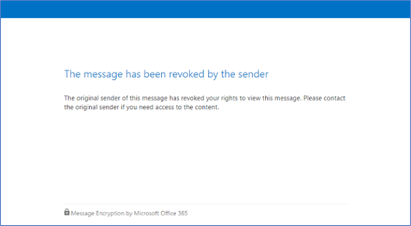

# <a name="office-365-message-encryption-email-revocation"></a>Révocation de courrier électronique de chiffrement de messages Office 365

Cet article fait partie d’une plus grande série d’articles sur [Office 365 Message Encryption](ome.md). Révocation de messagerie chiffrée maintenant droite est en mode Aperçu. Prévoient des mises à jour et les modifications apportées à la fonctionnalité et le contenu afin d’améliorer notre offre.

Vous serez peut-être amené à révoquer un courrier électronique qui a déjà été envoyé. Si le message électronique a été chiffré à l’aide du chiffrement de messages Office 365 et que vous êtes un administrateur Office 365, vous pouvez le faire pour le courrier électronique sous certaines conditions. Cet article décrit sous quelles conditions cela est possible et comment le faire.
  
## <a name="encrypted-emails-that-you-can-revoke"></a>Messages électroniques chiffrés que vous pouvez annuler
Vous pouvez annuler les messages électroniques chiffrés si le destinataire a reçu une base de liens, marque électroniques chiffrés. Si le destinataire a reçu une expérience native insérée dans un client Outlook pris en charge, les messages électroniques ne peut pas être révoqués.

Si un destinataire reçoit une expérience basée sur un lien ou une expérience en ligne varie selon le type de destinataire d’identité : Office 365 et Microsoft Account destinataires (par exemple, les utilisateurs outlook.com) obtenir une expérience en ligne dans les clients Outlook pris en charge.  
Tous les autres types destinataires, tel que Gmail destinataires, obtenez une expérience basée sur le lien. 

Bientôt disponible, organisations auront la possibilité de forcer une expérience basée sur le lien quel que soit l’identité du destinataire. De cette manière, tous les destinataires recevront un message électronique personnalisé avec un lien vers le portail Office 365 Message Encryption où ils seront en mesure de lire et répondre aux messages électroniques chiffrés. Ces messages électroniques chiffrés sera révocables. 
  
## <a name="recipient-experience-for-revoked-encrypted-emails"></a>Expérience de destinataire pour les messages électroniques chiffrés révoquées

Une fois qu’un message électronique a été révoqué, le destinataire obtenez une erreur lorsque vous essayez d’accéder à du message électronique chiffré via le portail Office 365 Message Encryption : « le message a été révoqué par l’émetteur ».


    
## <a name="how-to-revoke-an-encrypted-email"></a>Comment révoquer un message électronique chiffré

### <a name="step-1-obtain-the-message-id-of-the-email"></a>Étape 1. Obtenir l’ID de Message du courrier électronique

Avant que vous pouvez retirer un message chiffré, vous devez recueillir l’ID de Message du courrier électronique. L’ID du message est généralement au format :

`<xxxxxxxxxxxxxxxxxxxxxxx@xxxxxx.xxxx.prod.outlook.com>`  

Il existe plusieurs manières pour trouver l’ID de Message du courrier électronique que vous souhaitez révoquer. Cette section décrit quelques options, mais vous pouvez utiliser une méthode qui fournit le code.

  #### <a name="to-identify-the-message-id-of-the-email-you-want-to-revoke-by-using-message-trace-in-the-security-amp-compliance-center"></a>Pour identifier l’ID de Message du courrier électronique que vous souhaitez révoquer à l’aide de suivi des messages dans la sécurité &amp; centre de conformité

1. Recherchez le courrier électronique par l’expéditeur ou destinataire utilisant le [Nouveau suivi des messages dans Office 365 sécurité & centre de conformité](https://blogs.technet.microsoft.com/exchange/2018/05/02/new-message-trace-in-office-365-security-compliance-center/).
2. Une fois que vous avez trouvé le courrier électronique sélectionner pour afficher le volet de **Détails de suivi des messages** . Développez **Plus d’informations** pour localiser l’ID du Message.

  #### <a name="to-identify-the-message-id-of-the-email-you-want-to-revoke-by-using-office-message-encryption-reports-in-the-security-amp-compliance-center"></a>Pour identifier l’ID de Message du courrier électronique que vous souhaitez révoquer à l’aide de rapports de chiffrement de messages Office dans la sécurité &amp; centre de conformité
1. Dans la sécurité &amp; centre de conformité, accédez au **Rapport de chiffrement des messages**.
2. Choisissez la table **d’Afficher les détails** et d’identifier le message que vous souhaitez révoquer. 
3. Double-cliquez sur le message pour afficher les détails qui incluent l’ID de Message. 

### <a name="step-2-revoke-the-mail"></a>Étape 2. Révoquer le courrier  

Une fois que vous connaissez l’ID de Message du courrier électronique que vous souhaitez révoquer, vous pouvez annuler le courrier électronique à l’aide de l’applet de commande Set-OMEMessageRevocation. 

1. [Se connecter à Exchange Online à l’aide de PowerShell à distance](http://technet.microsoft.com/library/jj984289%28v=exchg.150%29.aspx).
    
2. Exécutez l’applet de commande Set-OMEMessageRevocation comme suit :
    
    ```
    Set-OMEMessageRevocation -Revoke $true -MessageId "<messageId>"
    ```  

3. Pour vérifier si le message électronique a été révoqué, exécutez l’applet de commande Get-OMEMessageStatus comme suit :
    
    ```
    Get-OMEMessageStatus -MessageId "<messageId>"
    ```  
    Si la révocation a réussi, l’applet de commande renvoie le résultat suivant :  

    ```The encrypted email with the subject "<subject>" and Message ID "<messageId>" was successfully revoked.```
