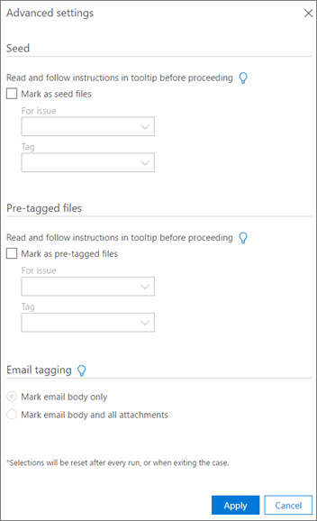

# Exécuter le module de processus et charger des données dans Office 365 Advanced eDiscovery

> [!NOTE]
> Pour utiliser Advanced eDiscovery, votre organisation doit souscrire un abonnement Office 365 E3 avec le module complémentaire Conformité avancée ou un abonnement E5. Si vous ne disposez pas d’un abonnement et que vous souhaitez essayer Advanced eDiscovery, vous pouvez vous [inscrire pour utiliser une version d’évaluation d’Office 365 Entreprise E5](https://go.microsoft.com/fwlink/p/?LinkID=698279). 
  
Cette section décrit les fonctionnalités du module Advanced eDiscovery Process. 
  
En plus des données de fichier, les métadonnées telles que le type de fichier, l’extension, l’emplacement ou le chemin d’accès, la date et l’heure de création, l’auteur, le dépositaire et l’objet peuvent être chargées dans eDiscovery avancée et enregistrées pour chaque cas. Certaines métadonnées sont calculées par Advanced eDiscovery, par exemple, lors du chargement des fichiers natifs. 
  
Advanced eDiscovery fournit des valeurs de métadonnées système, telles que des regroupements proches ou des scores de pertinence. D’autres métadonnées, telles que les annotations de fichier, peuvent être ajoutées par l’administrateur. 
  
## Processus en cours d’exécution

> [!NOTE]
> Les numéros de lot sont affectés à un fichier pendant le processus pour permettre le suivi des fichiers. Le numéro de lot permet également l’identification des lots de processus pour les options de retraitement. Des filtres supplémentaires sont disponibles pour le filtrage par numéro de lot et par session. 
  
Procédez comme suit pour exécuter le processus.
  
1. [Ouvrez le centre de sécurité &amp; conformité Office 365](go-to-the-securitycompliance-center.md) . 
    
2. Accédez à la **découverte électronique** de l' ** &amp; enquête** \> , puis cliquez sur **accéder à Advanced eDiscovery**.
    
3. Dans Advanced eDiscovery, sélectionnez la casse appropriée dans la page **incidents** affichés et cliquez sur **atteindre la casse**.
    
4. Dans **préparer** \> **** \> **le**processus de préparation, sélectionnez un conteneur dans la liste des conteneurs disponibles.
    
    
  
5. Cliquez sur **Paramètres avancés...** si vous voulez ajouter le conteneur comme fichiers de départ ou sous forme de fichiers pré-balisés. 
    
    Utilisez des fichiers de départ pour accélérer la formation des problèmes de faible richesse (généralement 2% ou moins). Pour les fichiers de départ, il est recommandé de sélectionner un grand nombre de fichiers de manière significative et de traiter environ 20-50 de dollars par problème (trop de fichiers de départ peuvent biaiser les résultats de la pertinence). Les fichiers de départ doivent être vérifiés par la même personne qui entraînera le problème.
    
    Utilisez des fichiers pré-balisés pour automatiser la formation à la pertinence. Vous devez marquer au moins 1 500 fichiers et conserver la proportion de fichiers pertinents pour les fichiers non pertinents le même que dans la collection ajoutée à la pertinence. Ces fichiers doivent être balisés manuellement, et vous devez être sûr de la qualité du marquage.
    
    
  
  - Dans la section **Seed** : 
    
    Sélectionnez **marquer comme fichiers de départ** pour marquer le conteneur comme fichiers de départ. Vous devez également choisir de les affecter par problème à partir de la liste déroulante **pour le problème** . Choisissez **pertinent** ou **non pertinent** dans la liste déroulante de **balises** . 
    
    > [!NOTE]
    > Une fois que vous avez défini les fichiers en tant que **Seed**, vous ne pouvez pas les marquer comme étant **préalablement balisés**. 
  
  - Dans la section **fichiers pré-balisés** : 
    
    Sélectionnez **marquer comme fichiers pré-balisés** pour marquer le conteneur comme des fichiers pré-balisés. Vous devez également les affecter par problème à partir de la liste déroulante **pour le problème** . Choisissez **pertinent** ou **non pertinent** dans la liste déroulante de **balises** . 
    
    > [!NOTE]
    > Une fois que vous avez défini les fichiers comme étant **déjà balisés**, vous ne pouvez pas les marquer comme **Seed**. 
  
  - Dans la section **étiquetage des courriers électroniques** . définir la partie d’un message électronique traité devant être marquée comme amorce ou pré-balisage. 
    
6. Pour commencer, cliquez sur **traiter**. Une fois terminé, les résultats du processus sont affichés.
    
7. Module Si vous devez attribuer des sources de données à un dépositaire spécifique, vous pouvez ajouter et modifier les noms des dépositaires dans les **** \> **dépositaires** \> pour **gérer** et attribuer des dépositaires à **attribuer**. 
    
Si vous ajoutez au cas, vous pouvez de nouveau traiter.
  
## Voir aussi

[Office 365 Advanced eDiscovery](office-365-advanced-ediscovery.md)
  
[Affichage des résultats de module de processus](view-process-module-results-in-advanced-ediscovery.md)

