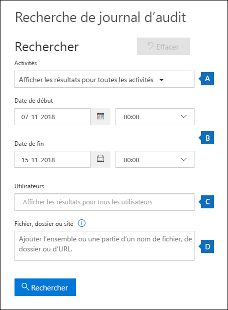
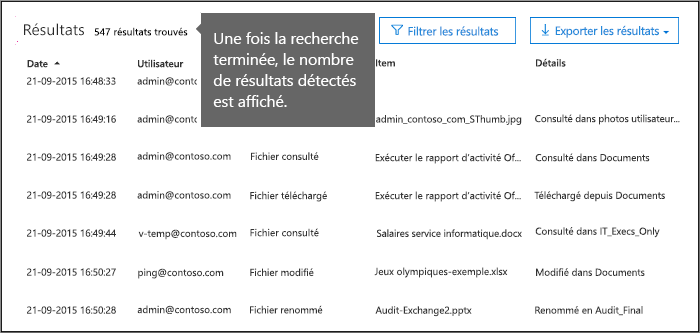
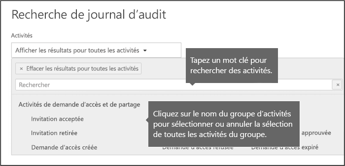
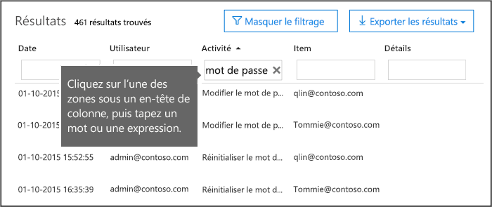

# <a name="search-the-audit-log-in-the-office-365-security--compliance-center"></a><span data-ttu-id="d5135-103">Recherche dans le journal d’audit de la sécurité pour Microsoft Office 365 et le centre de conformité</span><span class="sxs-lookup"><span data-stu-id="d5135-103">Search the audit log in the Office 365 Security & Compliance Center</span></span>

<span data-ttu-id="d5135-p101">Vous devez trouver si un utilisateur affiché d’un document spécifique ou purgés un élément à partir de leur boîte aux lettres ? Si ce cas, vous pouvez utiliser la sécurité de 365 Office &amp; centre de conformité pour la recherche dans le journal d’audit unifiée pour afficher l’activité utilisateur et l’administrateur de votre organisation Office 365. Pourquoi un audit unifié se connecter ? Étant donné que vous pouvez rechercher les types suivants de l’activité utilisateur et d’administration d’Office 365 :</span><span class="sxs-lookup"><span data-stu-id="d5135-p101">Need to find if a user viewed a specific document or purged an item from their mailbox? If so, you can use the Office 365 Security &amp; Compliance Center to search the unified audit log to view user and administrator activity in your Office 365 organization. Why a unified audit log? Because you can search for the following types of user and admin activity in Office 365:</span></span>
  
- <span data-ttu-id="d5135-108">Activité de l’utilisateur dans SharePoint Online et OneDrive entreprise</span><span class="sxs-lookup"><span data-stu-id="d5135-108">User activity in SharePoint Online and OneDrive for Business</span></span>
    
- <span data-ttu-id="d5135-109">Activité de l’utilisateur dans Exchange Online (enregistrement d’audit des boîtes aux lettres Exchange)</span><span class="sxs-lookup"><span data-stu-id="d5135-109">User activity in Exchange Online (Exchange mailbox audit logging)</span></span>
    
    > [!IMPORTANT]
    > <span data-ttu-id="d5135-p102">Audit de boîte aux lettres la journalisation doit être activée pour chaque boîte aux lettres de l’utilisateur avant d’activité de l’utilisateur dans Exchange Online est enregistrée. Pour plus d’informations, voir [Activer la boîte aux lettres de l’audit dans Office 365](enable-mailbox-auditing.md).</span><span class="sxs-lookup"><span data-stu-id="d5135-p102">Mailbox audit logging must be turned on for each user mailbox before user activity in Exchange Online will be logged. For more information, see [Enable mailbox auditing in Office 365](enable-mailbox-auditing.md).</span></span>
  
- <span data-ttu-id="d5135-112">Activité d’administration dans SharePoint Online</span><span class="sxs-lookup"><span data-stu-id="d5135-112">Admin activity in SharePoint Online</span></span>
    
- <span data-ttu-id="d5135-113">Activité d’administration dans Azure Active Directory (service d’annuaire pour Office 365)</span><span class="sxs-lookup"><span data-stu-id="d5135-113">Admin activity in Azure Active Directory (the directory service for Office 365)</span></span>
    
- <span data-ttu-id="d5135-114">Activité d’administration dans Exchange Online (enregistrement d’audit d’administration Exchange)</span><span class="sxs-lookup"><span data-stu-id="d5135-114">Admin activity in Exchange Online (Exchange admin audit logging)</span></span>
    
- <span data-ttu-id="d5135-115">Activité utilisateur et d’administration dans balancement</span><span class="sxs-lookup"><span data-stu-id="d5135-115">User and admin activity in Sway</span></span>
    
- <span data-ttu-id="d5135-116">activités de découverte de sécurité Office 365 &amp; centre de conformité</span><span class="sxs-lookup"><span data-stu-id="d5135-116">eDiscovery activities in the Office 365 Security &amp; Compliance Center</span></span>
    
- <span data-ttu-id="d5135-117">Activité utilisateur et d’administration dans Power BI pour Office 365</span><span class="sxs-lookup"><span data-stu-id="d5135-117">User and admin activity in Power BI for Office 365</span></span>
    
- <span data-ttu-id="d5135-118">Activité utilisateur et d’administration dans Microsoft Teams</span><span class="sxs-lookup"><span data-stu-id="d5135-118">User and admin activity in Microsoft Teams</span></span>

- <span data-ttu-id="d5135-119">Activité utilisateur et d’administration dans Dynamics 365</span><span class="sxs-lookup"><span data-stu-id="d5135-119">User and admin activity in Dynamics 365</span></span>
    
- <span data-ttu-id="d5135-120">Activité utilisateur et d’administration dans Yammer</span><span class="sxs-lookup"><span data-stu-id="d5135-120">User and admin activity in Yammer</span></span>
 
- <span data-ttu-id="d5135-121">Activité utilisateur et d’administration dans Microsoft Flow</span><span class="sxs-lookup"><span data-stu-id="d5135-121">User and admin activity in Microsoft Flow</span></span>
    
- <span data-ttu-id="d5135-122">Activité utilisateur et d’administration dans Microsoft Stream</span><span class="sxs-lookup"><span data-stu-id="d5135-122">User and admin activity in Microsoft Stream</span></span>
    
   
## <a name="before-you-begin"></a><span data-ttu-id="d5135-123">Avant de commencer</span><span class="sxs-lookup"><span data-stu-id="d5135-123">Before you begin</span></span>

<span data-ttu-id="d5135-124">Veillez à lire le journal d’audit des éléments suivants avant de commencer la recherche dans Office 365.</span><span class="sxs-lookup"><span data-stu-id="d5135-124">Be sure to read the following items before you start searching the Office 365 audit log.</span></span>
  
- <span data-ttu-id="d5135-p103">Vous (ou un autre administrateur) devez d’abord activer sur l’enregistrement d’audit avant de commencer la recherche dans le journal d’audit de Office 365. Pour l’activer, cliquez sur **Démarrer l’enregistrement d’utilisateur et des activités d’administration** dans la page de **recherche des journaux d’Audit** de sécurité &amp; centre de conformité. (Si vous ne voyez pas ce lien, l’audit a déjà été activé pour votre organisation.) Une fois que vous l’activer, un message s’affiche indiquant que le journal d’audit est préparé et que vous pouvez exécuter une recherche en quelques heures après que la préparation est terminée. Vous ne devez cela qu’une seule fois.</span><span class="sxs-lookup"><span data-stu-id="d5135-p103">You (or another admin) must first turn on audit logging before you can start searching the Office 365 audit log. To turn it on, just click **Start recording user and admin activity** on the **Audit log search** page in the Security &amp; Compliance Center. (If you don't see this link, auditing has already been turned on for your organization.) After you turn it on, a message is displayed that says the audit log is being prepared and that you can run a search in a couple of hours after the preparation is complete. You only have to do this once.</span></span> 
    
    > [!NOTE]
    > <span data-ttu-id="d5135-p104">Nous sommes en cours de l’activation de l’audit par défaut. En attendant, vous pouvez l’activer comme décrit précédemment.</span><span class="sxs-lookup"><span data-stu-id="d5135-p104">We're in the process of turning on auditing by default. Until then, you can turn it on as previously described.</span></span> 
  
- <span data-ttu-id="d5135-p105">Vous devez être le rôle journaux d’Audit en affichage seul ou des journaux d’Audit dans Exchange Online à rechercher dans le journal d’audit Office 365. Par défaut, ces rôles sont affectés aux groupes de rôle de gestion de la conformité et de gestion de l’organisation dans la page **autorisations** , dans le centre d’administration Exchange. Pour permettre à un utilisateur pour la recherche dans le journal d’audit Office 365 avec le niveau minimal de privilèges, vous pouvez créer un groupe de rôles personnalisés dans Exchange en ligne, ajouter le rôle journaux d’Audit en affichage seul ou des journaux d’Audit et puis ajouter l’utilisateur en tant que membre du nouveau groupe de rôles. Pour plus d’informations, voir [rôles de gérer les groupes dans Exchange Online](https://go.microsoft.com/fwlink/p/?LinkID=730688).</span><span class="sxs-lookup"><span data-stu-id="d5135-p105">You have to be assigned the View-Only Audit Logs or Audit Logs role in Exchange Online to search the Office 365 audit log. By default, these roles are assigned to the Compliance Management and Organization Management role groups on the **Permissions** page in the Exchange admin center. To give a user the ability to search the Office 365 audit log with the minimum level of privileges, you can create a custom role group in Exchange Online, add the View-Only Audit Logs or Audit Logs role, and then add the user as a member of the new role group. For more information, see [Manage role groups in Exchange Online](https://go.microsoft.com/fwlink/p/?LinkID=730688).</span></span>
    
    > [!IMPORTANT]
    > <span data-ttu-id="d5135-p106">Si vous attribuez à un utilisateur le rôle journaux d’Audit en affichage seul ou des journaux d’Audit dans la page **autorisations** de sécurité &amp; centre de conformité, ils ne pourront recherche Office 365 dans le journal d’audit. Vous devez attribuer les autorisations dans Exchange Online. Il s’agit de l’applet de commande sous-jacent utilisé pour la recherche dans le journal d’audit étant une applet de commande Exchange Online.</span><span class="sxs-lookup"><span data-stu-id="d5135-p106">If you assign a user the View-Only Audit Logs or Audit Logs role on the **Permissions** page in the Security &amp; Compliance Center, they won't be able to search the Office 365 audit log. You have to assign the permissions in Exchange Online. This is because the underlying cmdlet used to search the audit log is an Exchange Online cmdlet.</span></span> 
  
- <span data-ttu-id="d5135-p107">Lorsqu’une activité auditée est effectuée par un utilisateur ou un administrateur, un enregistrement d’audit est généré et stocké dans le journal d’audit de Office 365 pour votre organisation. La durée pendant laquelle un enregistrement d’audit est conservé (et de recherche dans le journal d’audit) dépend de votre abonnement à Office 365 et notamment le type de la licence est attribuée à un utilisateur spécifique.</span><span class="sxs-lookup"><span data-stu-id="d5135-p107">When an audited activity is performed by a user or admin, an audit record is generated and stored in the Office 365 audit log for your organization. The length of time that an audit record is retained (and searchable in the audit log) depends on your Office 365 subscription, and specifically the type of the license that is assigned to a specific user.</span></span>

     - <span data-ttu-id="d5135-p108">**Office 365 E3** - d’Audit des enregistrements sont conservées pendant 90 jours. Cela signifie que vous pouvez rechercher le journal d’audit pour les activités qui ont été effectuées au cours des 90 derniers jours.</span><span class="sxs-lookup"><span data-stu-id="d5135-p108">**Office 365 E3** - Audit records are retained for 90 days. That means you can search the audit log for activities that were performed within the last 90 days.</span></span>

     - <span data-ttu-id="d5135-p109">**Office 365 E5** - d’Audit de la rétention des enregistrements pour 365 jours (un an). Cela signifie que vous pouvez rechercher le journal d’audit pour les activités qui ont été effectuées dans l’année dernière. Conservation des enregistrements d’audit de l’année est également disponible pour les utilisateurs qui sont affectés à une licence E3/Exchange Online Plan 1 et qui ont une licence Office 365 avancée conformité.</span><span class="sxs-lookup"><span data-stu-id="d5135-p109">**Office 365 E5** - Audit records are retained for 365 days (one year). That means you can search the audit log for activities that were performed within the last year. Retaining audit records for one year is also available for users that are assigned an E3/Exchange Online Plan 1 license and have an Office 365 Advanced Compliance add-on license.</span></span>

        > [!NOTE]
        > <span data-ttu-id="d5135-p110">La période de rétention d’an pour les enregistrements d’audit pour les organisations de E5 (ou E3 aux organisations qui ont des licences de module complémentaire de conformité avancées) est actuellement disponible uniquement dans le cadre d’un programme d’aperçu privé. Pour vous inscrire dans ce programme Aperçu, une demande de [Support technique Microsoft](https://docs.microsoft.com/en-us/office365/admin/contact-support-for-business-products?redirectSourcePath=%252fen-us%252farticle%252fcontact-support-for-business-products-admin-help-32a17ca7-6fa0-4870-8a8d-e25ba4ccfd4b&view=o365-worldwide&tabs=online) de fichiers et inclure les éléments suivants en tant que la description de ce que vous avez besoin d’aide : « À long terme Office 365 d’audit journal privé preview ».</span><span class="sxs-lookup"><span data-stu-id="d5135-p110">The one-year retention period for audit records for E5 organizations (or E3 organizations that have Advanced Compliance add-on licenses) is currently available only as part of a private preview program. To enroll in this preview program, please file a request with [Microsoft Support](https://docs.microsoft.com/en-us/office365/admin/contact-support-for-business-products?redirectSourcePath=%252fen-us%252farticle%252fcontact-support-for-business-products-admin-help-32a17ca7-6fa0-4870-8a8d-e25ba4ccfd4b&view=o365-worldwide&tabs=online) and include the following as the description of what you need help with: "Long-term Office 365 audit log private preview".</span></span>

- <span data-ttu-id="d5135-147">Si vous souhaitez désactiver la recherche du journal d’audit dans Office 365 pour votre organisation, vous pouvez exécuter la commande suivante dans PowerShell distant connecté à votre organisation Exchange Online :</span><span class="sxs-lookup"><span data-stu-id="d5135-147">If you want to turn off audit log search in Office 365 for your organization, you can run the following command in remote PowerShell connected to your Exchange Online organization:</span></span>
    
  ```
  Set-AdminAuditLogConfig -UnifiedAuditLogIngestionEnabled $false
  ```

    <span data-ttu-id="d5135-148">Pour réactiver la recherche d’audit, vous pouvez exécuter la commande suivante dans Exchange Online PowerShell :</span><span class="sxs-lookup"><span data-stu-id="d5135-148">To turn on audit search again, you can run the following command in Exchange Online PowerShell:</span></span>
    
  ```
  Set-AdminAuditLogConfig -UnifiedAuditLogIngestionEnabled $true
  ```

    <span data-ttu-id="d5135-149">Pour plus d’informations, voir [désactiver la recherche du journal d’audit dans Office 365](turn-audit-log-search-on-or-off.md).</span><span class="sxs-lookup"><span data-stu-id="d5135-149">For more information, see [Turn off audit log search in Office 365](turn-audit-log-search-on-or-off.md).</span></span>
    
- <span data-ttu-id="d5135-p111">Comme indiqué précédemment, l’applet de commande sous-jacent utilisé pour la recherche dans le journal d’audit est une applet de commande Exchange Online, **UnifiedAuditLog de la recherche**. Cela signifie que vous pouvez utiliser cette applet de commande pour rechercher dans le journal d’audit Office 365 au lieu d’utiliser la page de **recherche des journaux d’Audit de** la sécurité &amp; centre de conformité. Vous devez exécuter cette applet de commande dans PowerShell distant connecté à votre organisation Exchange Online. Pour plus d’informations, voir [UnifiedAuditLog à la recherche](https://go.microsoft.com/fwlink/p/?linkid=834776).</span><span class="sxs-lookup"><span data-stu-id="d5135-p111">As previously stated, the underlying cmdlet used to search the audit log is an Exchange Online cmdlet, which is **Search-UnifiedAuditLog**. That means you can use this cmdlet to search the Office 365 audit log instead of using the **Audit log search** page in the Security &amp; Compliance Center. You have to run this cmdlet in remote PowerShell connected to your Exchange Online organization. For more information, see [Search-UnifiedAuditLog](https://go.microsoft.com/fwlink/p/?linkid=834776).</span></span>
    
- <span data-ttu-id="d5135-p112">Si vous souhaitez télécharger par programme des données à partir du journal d’audit de Office 365, nous recommandons d’utiliser l’API d’activité de gestion Office 365 au lieu d’utiliser un script PowerShell. L’API d’activité de gestion Office 365 est un service web REST que vous pouvez utiliser pour développer des solutions de surveillance de la conformité pour votre organisation, la sécurité et opérations. Pour plus d’informations, voir [référence des API d’activité de gestion Office 365](https://go.microsoft.com/fwlink/?linkid=852309).</span><span class="sxs-lookup"><span data-stu-id="d5135-p112">If you want to programmatically download data from the Office 365 audit log, we recommend that you use the Office 365 Management Activity API instead of using a PowerShell script. The Office 365 Management Activity API is a REST web service that you can use to develop operations, security, and compliance monitoring solutions for your organization. For more information, see [Office 365 Management Activity API reference](https://go.microsoft.com/fwlink/?linkid=852309).</span></span>
    
- <span data-ttu-id="d5135-p113">Il peut prendre jusqu'à 30 minutes ou les 24 heures après un événement se produit pour l’entrée du journal d’audit correspondant à afficher dans les résultats de recherche. Le tableau suivant indique le temps que nécessaire pour les différents services dans Office 365.</span><span class="sxs-lookup"><span data-stu-id="d5135-p113">It can take up to 30 minutes or up to 24 hours after an event occurs for the corresponding audit log entry to be displayed in the search results. The following table shows the time it takes for the different services in Office 365.</span></span>
    
    |<span data-ttu-id="d5135-159">**Service Office 365**</span><span class="sxs-lookup"><span data-stu-id="d5135-159">**Office 365 service**</span></span>|<span data-ttu-id="d5135-160">**30 minutes**</span><span class="sxs-lookup"><span data-stu-id="d5135-160">**30 minutes**</span></span>|<span data-ttu-id="d5135-161">**24 heures**</span><span class="sxs-lookup"><span data-stu-id="d5135-161">**24 hours**</span></span>|
    |:-----|:-----|:-----|
    |<span data-ttu-id="d5135-162">Protection contre les menaces avancées et les informations sur les menaces</span><span class="sxs-lookup"><span data-stu-id="d5135-162">Advanced Threat Protection and Threat Intelligence</span></span>  <br/> || |
    |<span data-ttu-id="d5135-164">Azure Active Directory (événements d’ouverture de session utilisateur)</span><span class="sxs-lookup"><span data-stu-id="d5135-164">Azure Active Directory (user login events)</span></span>  <br/> ||           <br/> |
    |<span data-ttu-id="d5135-166">Azure Active Directory (événements d’administration)</span><span class="sxs-lookup"><span data-stu-id="d5135-166">Azure Active Directory (admin events)</span></span>  <br/> || |
    |<span data-ttu-id="d5135-168">Azure Active Directory (événements d’ouverture de session utilisateur)</span><span class="sxs-lookup"><span data-stu-id="d5135-168">Azure Active Directory (user login events)</span></span>  <br/> ||           <br/> |
    |<span data-ttu-id="d5135-170">Prévention contre la perte de données</span><span class="sxs-lookup"><span data-stu-id="d5135-170">Data Loss Prevention</span></span>  <br/> |           <br/>| |
    |<span data-ttu-id="d5135-172">Dynamics 365 CRM</span><span class="sxs-lookup"><span data-stu-id="d5135-172">Dynamics 365 CRM</span></span> <br/> |           <br/>| |
    |<span data-ttu-id="d5135-174">eDiscovery</span><span class="sxs-lookup"><span data-stu-id="d5135-174">eDiscovery</span></span>  <br/> |           <br/>| |
    |<span data-ttu-id="d5135-176">Exchange Online</span><span class="sxs-lookup"><span data-stu-id="d5135-176">Exchange Online</span></span>  <br/> |           <br/> ||
    |<span data-ttu-id="d5135-178">Microsoft Flow</span><span class="sxs-lookup"><span data-stu-id="d5135-178">Microsoft Flow</span></span>  <br/> |           <br/>| |
    |<span data-ttu-id="d5135-180">Microsoft Forms</span><span class="sxs-lookup"><span data-stu-id="d5135-180">Microsoft Forms</span></span>  <br/> |           <br/>| |
    |<span data-ttu-id="d5135-182">Microsoft Project</span><span class="sxs-lookup"><span data-stu-id="d5135-182">Microsoft Project</span></span>  <br/> |           <br/>| |
    |<span data-ttu-id="d5135-184">Microsoft Stream</span><span class="sxs-lookup"><span data-stu-id="d5135-184">Microsoft Stream</span></span>  <br/> |           <br/>| |
    |<span data-ttu-id="d5135-186">Microsoft Teams</span><span class="sxs-lookup"><span data-stu-id="d5135-186">Microsoft Teams</span></span>  <br/> |           <br/> ||
    |<span data-ttu-id="d5135-188">Power BI</span><span class="sxs-lookup"><span data-stu-id="d5135-188">Power BI</span></span>  <br/> |           <br/>| |
    |<span data-ttu-id="d5135-190">Sécurité &amp; centre de conformité</span><span class="sxs-lookup"><span data-stu-id="d5135-190">Security &amp; Compliance Center</span></span>  <br/> |           <br/> ||
    |<span data-ttu-id="d5135-192">Sharepoint Online et OneDrive Entreprise</span><span class="sxs-lookup"><span data-stu-id="d5135-192">SharePoint Online and OneDrive for Business</span></span>  <br/> |           <br/> ||
    |<span data-ttu-id="d5135-194">Sway</span><span class="sxs-lookup"><span data-stu-id="d5135-194">Sway</span></span>  <br/> ||           <br/> |
    |<span data-ttu-id="d5135-196">Yammer</span><span class="sxs-lookup"><span data-stu-id="d5135-196">Yammer</span></span>  <br/> ||           <br/> |
   
- <span data-ttu-id="d5135-p114">Azure Active Directory (AD Azure) est le service d’annuaire pour Office 365. Le journal d’audit unifiée contient l’utilisateur, groupe, application, domaine et activités directory effectuées dans le centre d’administration d’Office 365 ou dans le dans Azure portail de gestion. Pour obtenir une liste complète des événements Azure AD, voir [Événements du rapport d’Audit Azure Active Directory](https://go.microsoft.com/fwlink/p/?LinkID=616549).</span><span class="sxs-lookup"><span data-stu-id="d5135-p114">Azure Active Directory (Azure AD) is the directory service for Office 365. The unified audit log contains user, group, application, domain, and directory activities performed in the Office 365 admin center or in the in Azure management portal. For a complete list of Azure AD events, see [Azure Active Directory Audit Report Events](https://go.microsoft.com/fwlink/p/?LinkID=616549).</span></span>
    
- <span data-ttu-id="d5135-p115">Les journaux d’audit Exchange Online se composent de deux types d’événements : les événements d’administration (actions effectuées par les administrateurs) et événements (actions effectuées par les utilisateurs de boîtes aux lettres) de la boîte aux lettres Exchange. Notez que l’audit de boîte aux lettres n’est pas activé par défaut. Il doit être activer pour chaque boîte aux lettres de l’utilisateur avant que les événements de boîte aux lettres peuvent être recherchées dans le journal d’audit d’Office 365. Pour plus d’informations sur l’audit des boîtes aux lettres et de la boîte aux lettres de l’audit des actions que vous avez ouvert une session, voir [Activer la boîte aux lettres de l’audit dans Office 365](enable-mailbox-auditing.md).</span><span class="sxs-lookup"><span data-stu-id="d5135-p115">Exchange Online audit logs consist of two types of events: Exchange admin events (actions taken by administrators) and mailbox events (actions taken by users on mailboxes). Note that mailbox auditing isn't enabled by default. It must be enable for each user mailbox before mailbox events can be searched for in the Office 365 audit log. For more information about mailbox auditing and the mailbox auditing actions that are logged, see [Enable mailbox auditing in Office 365](enable-mailbox-auditing.md).</span></span>
    
- <span data-ttu-id="d5135-p116">Enregistrement d’audit pour Power BI n’est pas activée par défaut. Pour rechercher des activités de Power BI dans le journal d’audit d’Office 365, vous devez activer l’audit dans le portail d’administration Power BI. Pour plus d’informations, voir [L’audit Power BI](https://docs.microsoft.com/power-bi/service-admin-auditing#enabling-auditing-functionality-in-the-power-bi-admin-portal).</span><span class="sxs-lookup"><span data-stu-id="d5135-p116">Audit logging for Power BI isn't enabled by default. To search for Power BI activities in the Office 365 audit log, you have to enable auditing in the Power BI admin portal. For instructions, see [Auditing Power BI](https://docs.microsoft.com/power-bi/service-admin-auditing#enabling-auditing-functionality-in-the-power-bi-admin-portal).</span></span>
    
    
## <a name="search-the-audit-log"></a><span data-ttu-id="d5135-208">Rechercher le journal d’audit</span><span class="sxs-lookup"><span data-stu-id="d5135-208">Search the audit log</span></span>

<span data-ttu-id="d5135-209">Voici le processus de recherche dans le journal d’audit dans Office 365.</span><span class="sxs-lookup"><span data-stu-id="d5135-209">Here's the process for searching the audit log in Office 365.</span></span>
  
[<span data-ttu-id="d5135-210">Étape 1 : Exécuter une recherche de journal d’audit</span><span class="sxs-lookup"><span data-stu-id="d5135-210">Step 1: Run an audit log search</span></span>](#step-1-run-an-audit-log-search)
  
[<span data-ttu-id="d5135-211">Étape 2 : Afficher les résultats de recherche</span><span class="sxs-lookup"><span data-stu-id="d5135-211">Step 2: View the search results</span></span>](#step-2-view-the-search-results)

[<span data-ttu-id="d5135-212">Étape 3 : Filtrer les résultats de recherche</span><span class="sxs-lookup"><span data-stu-id="d5135-212">Step 3: Filter the search results</span></span>](#step-3-filter-the-search-results)

[<span data-ttu-id="d5135-213">Étape 4 : Exporter les résultats de recherche vers un fichier</span><span class="sxs-lookup"><span data-stu-id="d5135-213">Step 4: Export the search results to a file</span></span>](#step-4-export-the-search-results-to-a-file)
  
### <a name="step-1-run-an-audit-log-search"></a><span data-ttu-id="d5135-214">Étape 1 : Exécuter une recherche de journal d’audit</span><span class="sxs-lookup"><span data-stu-id="d5135-214">Step 1: Run an audit log search</span></span>

1. <span data-ttu-id="d5135-215">Accédez à [https://protection.office.com](https://protection.office.com).</span><span class="sxs-lookup"><span data-stu-id="d5135-215">Go to [https://protection.office.com](https://protection.office.com).</span></span>
    
    > [!TIP]
    > <span data-ttu-id="d5135-p117">Utiliser une session de navigation privée (pas une session standard) pour accéder à la sécurité du Office 365 &amp; , car cela empêche les informations d’identification que vous êtes actuellement connecté avec utilisation du centre de conformité. Pour ouvrir une session de navigation InPrivate dans Internet Explorer ou Microsoft Edge, appuyez sur CTRL + MAJ + P. Pour ouvrir une session de navigation privée dans Google Chrome (appelé une fenêtre incognito), appuyez sur CTRL + MAJ + N.</span><span class="sxs-lookup"><span data-stu-id="d5135-p117">Use a private browsing session (not a regular session) to access the Office 365 Security &amp; Compliance Center because this will prevent the credential that you are currently logged on with from being used. To open an InPrivate Browsing session in Internet Explorer or Microsoft Edge, just press CTRL+SHIFT+P. To open a private browsing session in Google Chrome (called an incognito window), press CTRL+SHIFT+N.</span></span> 
  
2. <span data-ttu-id="d5135-219">Connectez-vous à Office 365 à l'aide de votre compte scolaire ou professionnel.</span><span class="sxs-lookup"><span data-stu-id="d5135-219">Sign in to Office 365 using your work or school account.</span></span>
    
3. <span data-ttu-id="d5135-220">Dans le volet gauche de la sécurité &amp; centre de conformité, cliquez sur **recherche &amp; enquête**, puis cliquez sur **Rechercher des journaux d’Audit**.</span><span class="sxs-lookup"><span data-stu-id="d5135-220">In the left pane of the Security &amp; Compliance Center, click **Search &amp; investigation**, and then click **Audit log search**.</span></span>
    
    <span data-ttu-id="d5135-221">La page de **recherche des journaux d’Audit** s’affiche.</span><span class="sxs-lookup"><span data-stu-id="d5135-221">The **Audit log search** page is displayed.</span></span> 
    
    
  
    > [!NOTE]
    > <span data-ttu-id="d5135-p118">Vous devez activer le premier enregistrement d’audit avant de pouvoir exécuter une recherche de journal d’audit. Si le lien **Démarrer l’enregistrement d’utilisateur et administration activité** s’affiche, cliquez dessus pour activer l’audit. Si vous ne voyez pas ce lien, l’audit a déjà été activé pour votre organisation.</span><span class="sxs-lookup"><span data-stu-id="d5135-p118">You have to first turn on audit logging before you can run an audit log search. If the **Start recording user and admin activity** link is displayed, click it to turn on auditing. If you don't see this link, auditing has already been turned on for your organization.</span></span> 
  
4. <span data-ttu-id="d5135-226">Configurer les critères de recherche suivants :</span><span class="sxs-lookup"><span data-stu-id="d5135-226">Configure the following search criteria:</span></span>
    
    <span data-ttu-id="d5135-p119">a. **activités** sur la liste déroulante pour afficher les activités que vous pouvez rechercher. Activités des utilisateurs et d’administration sont organisées dans vers des groupes d’activités associées. Vous pouvez sélectionner des activités spécifiques ou vous pouvez cliquer sur le nom du groupe activité à sélectionner toutes les activités dans le groupe. Vous pouvez également cliquer sur une activité sélectionnée pour effacer la sélection. Après avoir exécuté la recherche, uniquement les entrées du journal d’audit pour les activités sélectionnées sont affichées. Sélectionnez **Afficher les résultats pour toutes les activités** affiche les résultats de toutes les activités effectuées par l’utilisateur sélectionné ou un groupe d’utilisateurs.</span><span class="sxs-lookup"><span data-stu-id="d5135-p119">a. **Activities** Click the drop-down list to display the activities that you can search for. User and admin activities are organized in to groups of related activities. You can select specific activities or you can click the activity group name to select all activities in the group. You can also click a selected activity to clear the selection. After you run the search, only the audit log entries for the selected activities are displayed. Selecting **Show results for all activities** will display results for all activities performed by the selected user or group of users.</span></span> 
    
    <span data-ttu-id="d5135-p120">Plus de 100 activités d’utilisateur et d’administration sont consignées dans le journal d’audit d’Office 365. Cliquez sur l’onglet **activités contrôlé** le sujet de cet article pour consulter les descriptions de chaque activité dans chacun des différents services Office 365.</span><span class="sxs-lookup"><span data-stu-id="d5135-p120">Over 100 user and admin activities are logged in the Office 365 audit log. Click the **Audited activities** tab at the topic of this article to see the descriptions of every activity in each of the different Office 365 services.</span></span> 
    
    <span data-ttu-id="d5135-p121">b. **date de début** et **date de fin** au cours des sept derniers jours sont sélectionnés par défaut. Sélectionnez une plage de date et heure pour afficher les événements qui se sont produites pendant cette période. La date et l’heure sont présentées au format de temps universel coordonné (UTC). La plage de dates maximale que vous pouvez spécifier est 90 jours. Une erreur s’affiche si la plage de dates sélectionnée est supérieure à 90 jours.</span><span class="sxs-lookup"><span data-stu-id="d5135-p121">b. **Start date** and **End date** The last seven days are selected by default. Select a date and time range to display the events that occurred within that period. The date and time are presented in Coordinated Universal Time (UTC) format. The maximum date range that you can specify is 90 days. An error is displayed if the selected date range is greater than 90 days.</span></span> 
    
    > [!TIP]
    > <span data-ttu-id="d5135-p122">Si vous utilisez la plage de dates maximale de 90 jours, sélectionnez l’heure actuelle à la **date de début**. Sinon, vous recevrez une erreur indiquant que la date de début est antérieure à la date de fin. Si vous avez activé l’audit dans les 90 derniers jours, la plage de dates maximale ne peut pas démarrer avant la date à laquelle l’audit a été activé.</span><span class="sxs-lookup"><span data-stu-id="d5135-p122">If you're using the maximum date range of 90 days, select the current time for the **Start date**. Otherwise, you'll receive an error saying that the start date is earlier than the end date. If you've turned on auditing within the last 90 days, the maximum date range can't start before the date that auditing was turned on.</span></span> 
  
    <span data-ttu-id="d5135-p123">c. Cliquez sur **les utilisateurs** dans cette zone et sélectionnez un ou plusieurs utilisateurs à afficher la recherche résultats pour. Les entrées du journal d’audit pour l’activité sélectionnée effectuées par les utilisateurs que vous sélectionnez dans cette zone sont affichées dans la liste des résultats. Laissez cette zone vide de renvoi des entrées pour tous les utilisateurs (et les comptes de service) dans votre organisation.</span><span class="sxs-lookup"><span data-stu-id="d5135-p123">c. **Users** Click in this box and then select one or more users to display search results for. The audit log entries for the selected activity performed by the users you select in this box are displayed in the list of results. Leave this box blank to return entries for all users (and service accounts) in your organization.</span></span> 
    
    <span data-ttu-id="d5135-p124">**fichier ou dossier** tapez tout ou partie d’un nom de fichier ou un dossier pour rechercher des activités liées au fichier du dossier qui contient le mot clé spécifié. Vous pouvez également spécifier une URL d’un fichier ou un dossier. Si vous utilisez une URL, assurez-vous que le type le chemin d’URL complète ou si vous tapez uniquement une partie de l’URL, n’incluez pas des caractères spéciaux ou des espaces.</span><span class="sxs-lookup"><span data-stu-id="d5135-p124">d. **File or folder** Type some or all of a file or folder name to search for activity related to the file of folder that contains the specified keyword. You can also specify a URL of a file or folder. If you use a URL, be sure the type the full URL path or if you just type a portion of the URL, don't include any special characters or spaces.</span></span> 
    
    <span data-ttu-id="d5135-253">Laissez cette zone vide de renvoi des entrées pour tous les fichiers et dossiers dans votre organisation.</span><span class="sxs-lookup"><span data-stu-id="d5135-253">Leave this box blank to return entries for all files and folders in your organization.</span></span>
    
5. <span data-ttu-id="d5135-254">Cliquez sur **Rechercher** pour lancer la recherche à l’aide de vos critères de recherche.</span><span class="sxs-lookup"><span data-stu-id="d5135-254">Click **Search** to run the search using your search criteria.</span></span> 
    
    <span data-ttu-id="d5135-p125">Les résultats de recherche sont chargés, et après quelques instants, ils sont affichent sous **résultats**. Lors de la recherche est terminée, le nombre de résultats de la recherche s’affiche. Notez qu’un maximum de 5 000 événements s’affichera dans le volet **résultats** , par incréments de 150 événements ; Si plus de 5 000 événements répondent aux critères de recherche, les événements de 5 000 plus récents sont affichés.</span><span class="sxs-lookup"><span data-stu-id="d5135-p125">The search results are loaded, and after a few moments they are displayed under **Results**. When the search is finished, the number of results found is displayed. Note that a maximum of 5,000 events will be displayed in the **Results** pane in increments of 150 events; if more than 5,000 events meet the search criteria, the most recent 5,000 events are displayed.</span></span> 
    
    
  
  
#### <a name="tips-for-searching-the-audit-log"></a><span data-ttu-id="d5135-259">Conseils pour la recherche dans le journal d’audit</span><span class="sxs-lookup"><span data-stu-id="d5135-259">Tips for searching the audit log</span></span>

- <span data-ttu-id="d5135-p126">Vous pouvez sélectionner les activités spécifiques à rechercher en cliquant sur le nom de l’activité. Ou vous pouvez rechercher toutes les activités dans un groupe (par exemple, les **activités de fichiers et de dossiers**) en cliquant sur le nom du groupe. Si une activité est sélectionnée, vous pouvez cliquer dessus pour annuler la sélection. Vous pouvez également utiliser la zone de recherche pour afficher les activités qui contiennent le mot clé que vous tapez.</span><span class="sxs-lookup"><span data-stu-id="d5135-p126">You can select specific activities to search for by clicking on the activity name. Or you can search for all activities in a group (such as **File and folder activities**) by clicking on the group name. If an activity is selected, you can click it to cancel the selection. You can also use the search box to display the activities that contain the keyword that you type.</span></span>
    
    
  
- <span data-ttu-id="d5135-p127">Vous devez sélectionner **Afficher les résultats pour toutes les activités** dans la liste des **activités** pour afficher les événements dans le journal d’audit d’administration Exchange. Événements ce journal d’audit d’affichent un nom de l’applet de commande (par exemple, **Set-Mailbox** ) dans la colonne de **l’activité** dans les résultats. Pour plus d’informations, cliquez sur l’onglet **activités contrôlé** dans cette rubrique, puis sur **les activités d’administration Exchange**.</span><span class="sxs-lookup"><span data-stu-id="d5135-p127">You have to select **Show results for all activities** in the **Activities** list to display events from the Exchange admin audit log. Events from this audit log display a cmdlet name (for example, **Set-Mailbox** ) in the **Activity** column in the results. For more information, click the **Audited activities** tab in this topic and then click **Exchange admin activities**.</span></span>
    
    <span data-ttu-id="d5135-p128">De même, il existe des activités d’audit qui n’ont pas un élément correspondant dans la liste des **activités** . Si vous connaissez le nom de l’opération pour ces activités, vous pouvez rechercher toutes les activités, puis filtrer les résultats en tapant le nom de l’opération dans la zone de la colonne de **l’activité** . Voir [étape 3 : filtrer les résultats de recherche](#step-3-filter-the-search-results) pour plus d’informations sur le filtrage des résultats.</span><span class="sxs-lookup"><span data-stu-id="d5135-p128">Similarly, there are some auditing activities that don't have a corresponding item in the **Activities** list. If you know the name of the operation for these activities, you can search for all activities, then filter the results by typing the name of the operation in the box for the **Activity** column. See [Step 3: Filter the search results](#step-3-filter-the-search-results) for more information about filtering the results.</span></span> 
    
- <span data-ttu-id="d5135-p129">Cliquez sur **Effacer** pour effacer les critères de recherche en cours. La plage de dates renvoie la valeur par défaut au cours des sept derniers jours. Vous pouvez également cliquer sur **Effacer tout pour afficher les résultats pour toutes les activités** pour annuler toutes les activités sélectionnées.</span><span class="sxs-lookup"><span data-stu-id="d5135-p129">Click **Clear** to clear the current search criteria. The date range returns to the default of the last seven days. You can also click **Clear all to show results for all activities** to cancel all selected activities.</span></span> 
    
- <span data-ttu-id="d5135-p130">Si 5 000 résultats sont détectés, vous pouvez supposer que plus de 5 000 événements qui répondent aux critères de recherche. Vous pouvez affiner les critères de recherche et relancez la recherche pour renvoyer le nombre de résultats, ou vous pouvez exporter tous les résultats de recherche en sélectionnant **Exporter les résultats de** \> **Téléchargez tous les résultats**.</span><span class="sxs-lookup"><span data-stu-id="d5135-p130">If 5,000 results are found, you can probably assume there are more than 5,000 events that met the search criteria. You can either refine the search criteria and rerun the search to return fewer results, or you can export all of the search results by selecting **Export results** \> **Download all results**.</span></span>

  
### <a name="step-2-view-the-search-results"></a><span data-ttu-id="d5135-276">Étape 2 : Afficher les résultats de recherche</span><span class="sxs-lookup"><span data-stu-id="d5135-276">Step 2: View the search results</span></span>

<span data-ttu-id="d5135-p131">Les résultats d’une recherche de journal d’audit sont affichés sous **résultats** sur la page de **recherche des journaux d’Audit de** . Comme indiqué plus haut un maximum de 5 000 événements (les plus récentes) sont affichés par incréments de 150 événements. Pour afficher davantage d’événements vous pouvez utiliser la barre de défilement dans le volet **résultats** , ou vous pouvez appuyer sur **MAJ + fin** pour afficher les événements ensuite 150.</span><span class="sxs-lookup"><span data-stu-id="d5135-p131">The results of an audit log search are displayed under **Results** on the **Audit log search** page. As previously stated a maximum of 5,000 (newest) events are displayed in increments of 150 events. To display more events you can use the scroll bar in the **Results** pane or you can press **Shift + End** to display the next 150 events.</span></span> 
  
<span data-ttu-id="d5135-280">Les résultats contiennent les informations suivantes sur chaque événement renvoyé par la recherche.</span><span class="sxs-lookup"><span data-stu-id="d5135-280">The results contain the following information about each event returned by the search.</span></span>
  
- <span data-ttu-id="d5135-281">**Date :** La date et l’heure (au format UTC) lorsque l’événement s’est produite.</span><span class="sxs-lookup"><span data-stu-id="d5135-281">**Date:** The date and time (in UTC format) when the event occurred.</span></span> 
    
- <span data-ttu-id="d5135-p132">**Adresse IP :** L’adresse IP du périphérique qui a été utilisé lors de l’activité a été enregistrée. L’adresse IP est affichée dans le format d’adresse IPv4 ou IPv6.</span><span class="sxs-lookup"><span data-stu-id="d5135-p132">**IP address:** The IP address of the device that was used when the activity was logged. The IP address is displayed in either an IPv4 or IPv6 address format.</span></span> 
    
- <span data-ttu-id="d5135-284">**Utilisateur :** Le compte d’utilisateur (ou service) qui a effectué l’action qui a déclenché l’événement.</span><span class="sxs-lookup"><span data-stu-id="d5135-284">**User:** The user (or service account) who performed the action that triggered the event.</span></span> 
    
- <span data-ttu-id="d5135-p133">**Activité :** L’activité effectuée par l’utilisateur. Cette valeur correspond aux activités que vous avez sélectionné dans la liste déroulante **activités** . Pour un événement dans le journal d’audit d’administration Exchange, la valeur dans cette colonne est une cmdlet Exchange.</span><span class="sxs-lookup"><span data-stu-id="d5135-p133">**Activity:** The activity performed by the user. This value corresponds to the activities that you selected in the **Activities** drop down list. For an event from the Exchange admin audit log, the value in this column is an Exchange cmdlet.</span></span> 
    
- <span data-ttu-id="d5135-p134">**Élément :** L’objet qui a été créé ou modifié à la suite de l’activité correspondante. Par exemple, le fichier qui a été vus ou modifié ou le compte d’utilisateur qui a été mis à jour. Pas toutes les activités ont une valeur dans cette colonne.</span><span class="sxs-lookup"><span data-stu-id="d5135-p134">**Item:** The object that was created or modified as a result of the corresponding activity. For example, the file that was viewed or modified or the user account that was updated. Not all activities have a value in this column.</span></span> 
    
- <span data-ttu-id="d5135-p135">**Détails :** Plus de détails sur une activité. Là encore, pas toutes les activités aura une valeur.</span><span class="sxs-lookup"><span data-stu-id="d5135-p135">**Detail:** Additional detail about an activity. Again, not all activities will have a value.</span></span> 
    
> [!TIP]
> <span data-ttu-id="d5135-p136">Sous **résultats** pour trier les résultats, cliquez sur un en-tête de colonne. Vous pouvez trier les résultats de A à Z ou de Z à A. Cliquez sur l’en-tête de **Date** pour trier les résultats de la plus ancienne plus récent au plus ancien ou plus récent.</span><span class="sxs-lookup"><span data-stu-id="d5135-p136">Click a column header under **Results** to sort the results. You can sort the results from A to Z or Z to A. Click the **Date** header to sort the results from oldest to newest or newest to oldest.</span></span> 
  
#### <a name="view-the-details-for-a-specific-event"></a><span data-ttu-id="d5135-295">Afficher les détails d’un événement spécifique</span><span class="sxs-lookup"><span data-stu-id="d5135-295">View the details for a specific event</span></span>

<span data-ttu-id="d5135-p137">Vous pouvez afficher plus d’informations sur un événement en cliquant sur l’enregistrement des événements dans la liste des résultats de recherche. Une page de **Détails** s’affiche qui contient les propriétés détaillées de l’enregistrement de l’événement. Les propriétés qui sont affichées dépendent du service Office 365 dans lequel l’événement se produit. Pour afficher les détails, cliquez sur **plus d’informations**. Pour obtenir des descriptions, voir le [journal d’audit de propriétés détaillées dans Office 365](detailed-properties-in-the-office-365-audit-log.md).</span><span class="sxs-lookup"><span data-stu-id="d5135-p137">You can view more details about an event by clicking the event record in the list of search results. A **Details** page is displayed that contains the detailed properties from the event record. The properties that are displayed depend on the Office 365 service in which the event occurs. To display these details, click **More information**. For descriptions, see [Detailed properties in the Office 365 audit log](detailed-properties-in-the-office-365-audit-log.md).</span></span>
  


  
### <a name="step-3-filter-the-search-results"></a><span data-ttu-id="d5135-302">Étape 3 : Filtrer les résultats de recherche</span><span class="sxs-lookup"><span data-stu-id="d5135-302">Step 3: Filter the search results</span></span>

<span data-ttu-id="d5135-p138">En plus de tri, vous pouvez également filtrer les résultats d’une recherche de journal d’audit. Il s’agit d’une fonctionnalité très qui peut vous aider à rapidement filtrer les résultats pour un utilisateur spécifique ou une activité. Vous pouvez créer à l’origine une recherche à l’échelle et puis rapidement filtrer les résultats pour voir les événements spécifiques. Ensuite, vous pouvez limiter les critères de recherche et réexécuter la recherche pour renvoyer un ensemble de résultats plus petit, plus court.</span><span class="sxs-lookup"><span data-stu-id="d5135-p138">In addition to sorting, you can also filter the results of an audit log search. This is a great feature that can help you quickly filter the results for a specific user or activity. You can initially create a wide search and then quickly filter the results to see specific events. Then you can narrow the search criteria and re-run the search to return a smaller, more concise set of results.</span></span>
  
<span data-ttu-id="d5135-307">Pour filtrer les résultats :</span><span class="sxs-lookup"><span data-stu-id="d5135-307">To filter the results:</span></span>
  
1. <span data-ttu-id="d5135-308">Exécuter une recherche de journal d’audit.</span><span class="sxs-lookup"><span data-stu-id="d5135-308">Run an audit log search.</span></span>
    
2. <span data-ttu-id="d5135-309">Lorsque les résultats sont affichés, cliquez sur **filtrer les résultats**.</span><span class="sxs-lookup"><span data-stu-id="d5135-309">When the results are displayed, click **Filter results**.</span></span>
    
    <span data-ttu-id="d5135-310">Zones de mot clé sont affichés sous chaque en-tête de colonne.</span><span class="sxs-lookup"><span data-stu-id="d5135-310">Keyword boxes are displayed under each column header.</span></span>
    
3. <span data-ttu-id="d5135-p139">Cliquez sur l’une des cases sous un en-tête de colonne, tapez un mot ou une phrase, en fonction de la colonne que vous filtrez sur. Les résultats seront dynamiquement Ajustez à nouveau pour afficher les événements qui correspondent à votre filtre.</span><span class="sxs-lookup"><span data-stu-id="d5135-p139">Click one of the boxes under a column header and type a word or phrase, depending on the column you're filtering on. The results will dynamically readjust to display the events that match your filter.</span></span>
    
    
  
4. <span data-ttu-id="d5135-314">Pour effacer un filtre, cliquez sur le **X** dans la zone Filtre ou cliquer sur **Masquer le filtrage**.</span><span class="sxs-lookup"><span data-stu-id="d5135-314">To clear a filter, click the **X** in the filter box or just click **Hide filtering**.</span></span>
    
> [!TIP]
> <span data-ttu-id="d5135-p140">Pour afficher les événements dans le journal d’audit d’administration Exchange, tapez un **-** (tiret) dans la zone de filtre **d’activité** . Noms d’applet de commande, qui sont affichés dans la colonne **d’activité** pour les événements d’administration Exchange s’affiche. Vous pouvez ensuite trier les noms d’applet de commande dans l’ordre alphabétique.</span><span class="sxs-lookup"><span data-stu-id="d5135-p140">To display events from the Exchange admin audit log, type a **-** (dash) in the **Activity** filter box. This will display cmdlet names, which are displayed in the **Activity** column for Exchange admin events. Then you can sort the cmdlet names in alphabetical order.</span></span> 

### <a name="step-4-export-the-search-results-to-a-file"></a><span data-ttu-id="d5135-318">Étape 4 : Exporter les résultats de recherche vers un fichier</span><span class="sxs-lookup"><span data-stu-id="d5135-318">Step 4: Export the search results to a file</span></span>

<span data-ttu-id="d5135-p141">Vous pouvez exporter les résultats d’une recherche de journal d’audit pour un fichier de valeurs séparées (CSV) sur votre ordinateur local. Vous pouvez ouvrir ce fichier dans Microsoft Excel et utiliser des fonctionnalités telles que la recherche, tri, filtrage et fractionnement d’une seule colonne (qui contient les cellules de valeurs multiples) dans plusieurs colonnes.</span><span class="sxs-lookup"><span data-stu-id="d5135-p141">You can export the results of an audit log search to a comma separated value (CSV) file on your local computer. You can open this file in Microsoft Excel and use features such as search, sorting, filtering, and splitting a single column (that contains multi-value cells) into multiple columns.</span></span>
  
1. <span data-ttu-id="d5135-321">Exécuter une recherche de journal d’audit, puis modifier les critères de recherche jusqu'à ce que vous ayez les résultats souhaités.</span><span class="sxs-lookup"><span data-stu-id="d5135-321">Run an audit log search, and then revise the search criteria until you have the desired results.</span></span>
    
2. <span data-ttu-id="d5135-322">Cliquez sur **Exporter les résultats** , sélectionnez une des options suivantes :</span><span class="sxs-lookup"><span data-stu-id="d5135-322">Click **Export results** and select one of the following options:</span></span> 
    
  - <span data-ttu-id="d5135-p142">**Enregistrer les résultats chargés** Choisissez cette option pour exporter uniquement les entrées qui sont affichent sous **résultats** sur la \*\* recherche des journaux d’Audit \*\* page. Le fichier CSV qui est téléchargé contient les mêmes colonnes (et données) affiché dans la page (Date, utilisateur, les activités, élément et plus d’informations). Une colonne supplémentaire (appelée **plus**) est incluse dans le fichier CSV qui contient plus d’informations à partir de l’entrée du journal d’audit. Étant donné que vous exportez les mêmes résultats qui sont chargés (et visible) dans la page de **recherche des journaux d’Audit** , un maximum de 5 000 entrées sont exportées.</span><span class="sxs-lookup"><span data-stu-id="d5135-p142">**Save loaded results** Choose this option to export only the entries that are displayed under **Results** on the \*\* Audit log search \*\* page. The CSV file that is downloaded contains the same columns (and data) displayed on the page (Date, User, Activity, Item, and Details). An additional column (named **More**) is included in the CSV file that contains more information from the audit log entry. Because you're exporting the same results that are loaded (and viewable) on the **Audit log search** page, a maximum of 5,000 entries are exported.</span></span> 
    
  - <span data-ttu-id="d5135-p143">**Téléchargez tous les résultats** Choisissez cette option pour exporter toutes les entrées du journal d’audit de Office 365 qui répondent aux critères de recherche. Pour un grand ensemble de résultats de la recherche, choisissez cette option pour télécharger toutes les entrées du journal d’audit en plus de 5 000 résultats peuvent être affichés sur la page de **recherche des journaux d’Audit de** . Cette option télécharge les données brutes du journal d’audit dans un fichier CSV et contient des informations supplémentaires à partir de l’entrée du journal d’audit dans une colonne nommée **AuditData**. Elle peut prendre plus de temps pour télécharger le fichier si vous choisissez cette option Exporter, car le fichier peut être beaucoup plus volumineux que celui qui est téléchargé si vous choisissez l’option autres.</span><span class="sxs-lookup"><span data-stu-id="d5135-p143">**Download all results** Choose this option to export all entries from the Office 365 audit log that meet the search criteria. For a large set of search results, choose this option to download all entries from the audit log in addition to the 5,000 results that can be displayed on the **Audit log search** page. This option will download the raw data from the audit log to a CSV file, and contains additional information from the audit log entry in a column named **AuditData**. It may take longer to download the file if you choose this export option because the file may be much larger than the one that's downloaded if you choose the other option.</span></span>
    
    > [!IMPORTANT]
    > <span data-ttu-id="d5135-p144">Vous pouvez télécharger un maximum de 50 000 entrées dans un fichier CSV à partir d’une recherche de journal d’audit unique. Si 50 000 entrées sont téléchargées vers le fichier CSV, vous pouvez supposer que plus de 50 000 événements qui répondent aux critères de recherche. Pour exporter le plus de cette limite, essayez d’utiliser une plage de dates pour réduire le nombre d’entrées du journal d’audit. Vous devrez peut-être effectuer plusieurs recherches plus petite plage de dates pour exporter des entrées de plus de 50 000.</span><span class="sxs-lookup"><span data-stu-id="d5135-p144">You can download a maximum of 50,000 entries to a CSV file from a single audit log search. If 50,000 entries are downloaded to the CSV file, you can probably assume there are more than 50,000 events that met the search criteria. To export more than this limit, try using a date range to reduce the number of audit log entries. You might have to run multiple searches with smaller date ranges to export more than 50,000 entries.</span></span> 
  
3. <span data-ttu-id="d5135-335">Après avoir sélectionné une option d’exportation, un message s’affiche en bas de la fenêtre qui vous invite à ouvrir le fichier CSV, enregistrez-le dans le dossier téléchargements ou enregistrez-le dans un dossier spécifique.</span><span class="sxs-lookup"><span data-stu-id="d5135-335">After you select an export option, a message is displayed at the bottom of the window that prompts you to open the CSV file, save it to the Downloads folder, or save it to a specific folder.</span></span>

  
#### <a name="more-information-about-exporting-audit-log-search-results"></a><span data-ttu-id="d5135-336">Plus d’informations sur l’exportation de résultats de recherche du journal d’audit</span><span class="sxs-lookup"><span data-stu-id="d5135-336">More information about exporting audit log search results</span></span>

- <span data-ttu-id="d5135-p145">L’option de **téléchargement de tous les résultats** télécharge les données brutes à partir du journal d’audit de Office 365 dans un fichier CSV. Ce fichier contient les noms de colonne différents (CreationDate, UserIds, opération, AuditData) que le fichier est téléchargé si vous sélectionnez l’option **Enregistrer les résultats chargés** . Les valeurs dans les deux fichiers CSV différents pour la même activité peuvent également être différentes. Par exemple, l’activité dans la colonne **Action** du CSV du fichier et peut avoir une valeur autre que la version « conviviale » qui s’affiche dans la colonne de **l’activité** sur la page de **recherche des journaux d’Audit** ; par exemple, MailboxLogin et utilisateur connecté à la boîte aux lettres.</span><span class="sxs-lookup"><span data-stu-id="d5135-p145">The **Download all results** option downloads the raw data from the Office 365 audit log to a CSV file. This file contains different column names (CreationDate, UserIds, Operation, AuditData) than the file that's downloaded if you select the **Save loaded results** option. The values in the two different CSV files for the same activity may also be different. For example, the activity in the **Action** column in the CSV file and may have a different value than the "user-friendly" version that's displayed in the **Activity** column on the **Audit log search** page; for example, MailboxLogin vs. User signed in to mailbox.</span></span>
    
- <span data-ttu-id="d5135-p146">Si vous téléchargez tous les résultats, le fichier CSV contient une colonne nommée **AuditData**, qui contient des informations supplémentaires sur chaque événement. Comme indiqué précédemment, cette colonne contient une propriété à valeurs multiples pour plusieurs propriétés de l’enregistrement du journal d’audit. Chacune des paires **: valeur de la propriété** dans cette propriété à valeurs multiples sont séparés par une virgule. Vous pouvez utiliser la requête d’alimentation dans Excel pour fractionner cette colonne sur plusieurs colonnes afin que chaque propriété possède sa propre colonne. Cela vous permet de trier et filtrer sur un ou plusieurs de ces propriétés. Pour savoir comment procéder, voir la section « Fractionner une colonne par délimiteur » dans [une colonne de texte (requête Power) de fractionnement](https://support.office.com/article/5282d425-6dd0-46ca-95bf-8e0da9539662).</span><span class="sxs-lookup"><span data-stu-id="d5135-p146">If you download all results, the CSV file contains a column named **AuditData**, which contains additional information about each event. As previously stated, this column contains a multi-value property for multiple properties from the audit log record. Each of the **property:value** pairs in this multi-value property are separated by a comma. You can use the Power Query in Excel to split this column into multiple columns so that each property will have its own column. This will let you sort and filter on one or more of these properties. To learn how to do this, see the "Split a column by delimiter" section in [Split a column of text (Power Query)](https://support.office.com/article/5282d425-6dd0-46ca-95bf-8e0da9539662).</span></span>
    
    <span data-ttu-id="d5135-347">Une fois que vous avez séparé la colonne **AuditData** , vous pouvez filtrer la colonne **opérations** pour afficher les propriétés détaillées d’un type spécifique d’activité.</span><span class="sxs-lookup"><span data-stu-id="d5135-347">After you split the **AuditData** column, you can filter on the **Operations** column to display the detailed properties for a specific type of activity.</span></span> 
    
- <span data-ttu-id="d5135-p147">Il existe une limite de caractères 3,060 pour les données qui s’affiche dans le champ **AuditData** pour un enregistrement d’audit. Si la limite de caractères 3,060 est dépassée, les données dans ce champ sont tronquées.</span><span class="sxs-lookup"><span data-stu-id="d5135-p147">There's a 3,060-character limit for the data that's displayed in the **AuditData** field for an audit record. If the 3,060-character limit is exceeded, the data in this field is truncated.</span></span> 
    
- <span data-ttu-id="d5135-p148">Lorsque vous téléchargez tous les résultats d’une requête de recherche qui contient les événements à partir de différents services Office 365, la colonne **AuditData** dans le fichier CSV contient des propriétés différentes selon ce service l’action a été effectuée dans. Par exemple, les entrées de journaux d’audit Exchange et Azure AD incluent une propriété nommée **ResultStatus** qui indique si l’action a réussi ou non. Cette propriété n’est pas incluse pour les événements dans SharePoint. De même, les événements SharePoint ont une propriété qui identifie le site activités liées à l’URL pour les fichiers et dossiers. Pour modifier ce comportement, envisagez d’utiliser des recherches différentes pour exporter les résultats des activités d’un seul service.</span><span class="sxs-lookup"><span data-stu-id="d5135-p148">When you download all results from a search query that contains events from different Office 365 services, the **AuditData** column in the CSV file contains different properties depending on which service the action was performed in. For example, entries from Exchange and Azure AD audit logs include a property named **ResultStatus** that indicates if the action was successful or not. This property isn't included for events in SharePoint. Similarly, SharePoint events have a property that identifies the site URL for file and folder related activities. To mitigate this behavior, consider using different searches to export the results for activities from a single service.</span></span> 
    
    <span data-ttu-id="d5135-355">Pour obtenir une description des propriétés qui sont répertoriés dans la colonne **AuditData** dans le fichier CSV lorsque vous téléchargez tous les résultats et le service de chaque 1 s’applique à, consultez le [journal d’audit de propriétés détaillées dans Office 365](detailed-properties-in-the-office-365-audit-log.md).</span><span class="sxs-lookup"><span data-stu-id="d5135-355">For a description of the properties that are listed in the **AuditData** column in the CSV file when you download all results, and the service each one applies to, see [Detailed properties in the Office 365 audit log](detailed-properties-in-the-office-365-audit-log.md).</span></span>

  
## <a name="audited-activities"></a><span data-ttu-id="d5135-356">Audit des activités</span><span class="sxs-lookup"><span data-stu-id="d5135-356">Audited activities</span></span>

<span data-ttu-id="d5135-p149">Les tableaux de cette section décrivent les activités audités dans Office 365. Vous pouvez rechercher ces événements en recherchant l’audit journal de la sécurité &amp; centre de conformité. Cliquez sur l’onglet **recherche le journal d’audit** pour obtenir des instructions pas à pas.</span><span class="sxs-lookup"><span data-stu-id="d5135-p149">The tables in this section describe the activities that are audited in Office 365. You can search for these events by searching the audit log in the Security &amp; Compliance Center. Click the **Search the audit log** tab for step-by-step instructions.</span></span> 
  
<span data-ttu-id="d5135-p150">Ces tables groupe activités associées ou les activités d’un service spécifique d’Office 365. Les tableaux incluent le nom convivial qui s’affiche dans la liste déroulante des **activités** et le nom de l’opération correspondante qui s’affiche dans les informations détaillées d’un enregistrement d’audit, dans le fichier CSV lorsque vous exportez les résultats de recherche. Pour obtenir des descriptions des informations détaillées, consultez le [journal d’audit de propriétés détaillées dans Office 365](detailed-properties-in-the-office-365-audit-log.md).</span><span class="sxs-lookup"><span data-stu-id="d5135-p150">These tables group related activities or the activities from a specific Office 365 service. The tables include the friendly name that's displayed in the **Activities** drop-down list and the name of the corresponding operation that appears in the detailed information of an audit record and in the CSV file when you export the search results. For descriptions of the detailed information, see [Detailed properties in the Office 365 audit log](detailed-properties-in-the-office-365-audit-log.md).</span></span>
  
<span data-ttu-id="d5135-363">Cliquez sur un des liens suivants pour accéder à une table spécifique.</span><span class="sxs-lookup"><span data-stu-id="d5135-363">Click one of the following links to go to a specific table.</span></span>
  
||||
|:-----|:-----|:-----|
|[<span data-ttu-id="d5135-364">Activités de fichier et de page</span><span class="sxs-lookup"><span data-stu-id="d5135-364">File and page activities</span></span>](#file-and-page-activities)<br/> |[<span data-ttu-id="d5135-365">Activités de dossier</span><span class="sxs-lookup"><span data-stu-id="d5135-365">Folder activities</span></span>](#folder-activities)<br/> |[<span data-ttu-id="d5135-366">Activités de demande de partage et d’accès</span><span class="sxs-lookup"><span data-stu-id="d5135-366">Sharing and access request activities</span></span>](#sharing-and-access-request-activities)<br/> |
|[<span data-ttu-id="d5135-367">Activités de synchronisation</span><span class="sxs-lookup"><span data-stu-id="d5135-367">Synchronization activities</span></span>](#synchronization-activities)<br/> |[<span data-ttu-id="d5135-368">Activités de l’administration de site</span><span class="sxs-lookup"><span data-stu-id="d5135-368">Site administration activities</span></span>](#site-administration-activities)<br/> |[<span data-ttu-id="d5135-369">Activités de boîte aux lettres Exchange</span><span class="sxs-lookup"><span data-stu-id="d5135-369">Exchange mailbox activities</span></span>](#exchange-mailbox-activities)<br/> |
|[<span data-ttu-id="d5135-370">Balancement des activités</span><span class="sxs-lookup"><span data-stu-id="d5135-370">Sway activities</span></span>](#sway-activities) <br/> |[<span data-ttu-id="d5135-371">Activités de l’administration des utilisateurs</span><span class="sxs-lookup"><span data-stu-id="d5135-371">User administration activities</span></span>](#user-administration-activities) <br/> |[<span data-ttu-id="d5135-372">Activités de l’administration du groupe AD Azure</span><span class="sxs-lookup"><span data-stu-id="d5135-372">Azure AD group administration activities</span></span>](#azure-ad-group-administration-activities) <br/> |
|[<span data-ttu-id="d5135-373">Activités de l’administration d’applications</span><span class="sxs-lookup"><span data-stu-id="d5135-373">Application administration activities</span></span>](#application-administration-activities) <br/> |[<span data-ttu-id="d5135-374">Activités de l’administration des rôles</span><span class="sxs-lookup"><span data-stu-id="d5135-374">Role administration activities</span></span>](#role-administration-activities) <br/> |[<span data-ttu-id="d5135-375">Opérations de l’administration d’annuaire</span><span class="sxs-lookup"><span data-stu-id="d5135-375">Directory administration activities</span></span>](#directory-administration-activities) <br/> |
|[<span data-ttu-id="d5135-376">activités de découverte électronique</span><span class="sxs-lookup"><span data-stu-id="d5135-376">eDiscovery activities</span></span>](#ediscovery-activities) <br/> |[<span data-ttu-id="d5135-377">Activités de Power BI</span><span class="sxs-lookup"><span data-stu-id="d5135-377">Power BI activities</span></span>](#power-bi-activities) <br/> |[<span data-ttu-id="d5135-378">Activités Microsoft Teams</span><span class="sxs-lookup"><span data-stu-id="d5135-378">Microsoft Teams activities</span></span>](#microsoft-teams-activities) <br/> |
|[<span data-ttu-id="d5135-379">Activités de Yammer</span><span class="sxs-lookup"><span data-stu-id="d5135-379">Yammer activities</span></span>](#yammer-activities) <br/> |[<span data-ttu-id="d5135-380">Microsoft Flow</span><span class="sxs-lookup"><span data-stu-id="d5135-380">Microsoft Flow</span></span>](#microsoft-flow) <br/> |[<span data-ttu-id="d5135-381">Microsoft Stream</span><span class="sxs-lookup"><span data-stu-id="d5135-381">Microsoft Stream</span></span>](#microsoft-stream) <br/>|
|[<span data-ttu-id="d5135-382">Journal d’audit de l’administrateur Exchange</span><span class="sxs-lookup"><span data-stu-id="d5135-382">Exchange admin audit log</span></span>](#exchange-admin-audit-log) <br/> |
   
  
### <a name="file-and-page-activities"></a><span data-ttu-id="d5135-383">Activités de fichier et de page</span><span class="sxs-lookup"><span data-stu-id="d5135-383">File and page activities</span></span>
  
<span data-ttu-id="d5135-384">Le tableau suivant décrit les activités de fichier et de page dans SharePoint Online et OneDrive for Business.</span><span class="sxs-lookup"><span data-stu-id="d5135-384">The following table describes the file and page activities in SharePoint Online and OneDrive for Business.</span></span>
  
|<span data-ttu-id="d5135-385">**Nom convivial**</span><span class="sxs-lookup"><span data-stu-id="d5135-385">**Friendly name**</span></span>|<span data-ttu-id="d5135-386">**Operation**</span><span class="sxs-lookup"><span data-stu-id="d5135-386">**Operation**</span></span>|<span data-ttu-id="d5135-387">**Description**</span><span class="sxs-lookup"><span data-stu-id="d5135-387">**Description**</span></span>|
|:-----|:-----|:-----|
|<span data-ttu-id="d5135-388">Accès aux fichiers</span><span class="sxs-lookup"><span data-stu-id="d5135-388">Accessed file</span></span>  <br/> |<span data-ttu-id="d5135-389">FileAccessed</span><span class="sxs-lookup"><span data-stu-id="d5135-389">FileAccessed</span></span>  <br/> |<span data-ttu-id="d5135-390">Compte d’utilisateur ou le système accède à un fichier.</span><span class="sxs-lookup"><span data-stu-id="d5135-390">User or system account accesses a file.</span></span>  <br/> |
|<span data-ttu-id="d5135-391">(aucun)</span><span class="sxs-lookup"><span data-stu-id="d5135-391">(none)</span></span>  <br/> |<span data-ttu-id="d5135-392">FileAccessedExtended</span><span class="sxs-lookup"><span data-stu-id="d5135-392">FileAccessedExtended</span></span>  <br/> |<span data-ttu-id="d5135-p151">Cela est liée dans le fichier « accès » activité (FileAccessed). Un événement FileAccessedExtended est enregistré lors de la même personne en permanence accède à un fichier pour une longue période de temps (jusqu'à 3 heures). L’objectif de la journalisation des événements FileAccessedExtended consiste à réduire le nombre d’événements FileAccessed enregistrés lorsqu’un fichier est accessible en permanence. Cela permet de réduire le bruit de plusieurs enregistrements FileAccessed pour ce qui est identique à celui de l’activité des utilisateurs et vous pouvez vous concentrer sur l’événement FileAccessed initiale (et plus important).</span><span class="sxs-lookup"><span data-stu-id="d5135-p151">This is related to the "Accessed file" (FileAccessed) activity. A FileAccessedExtended event is logged when the same person continually accesses a file for an extended period of time (up to 3 hours). The purpose of logging FileAccessedExtended events is to reduce the number of FileAccessed events that are logged when a file is continually accessed. This helps reduce the noise of multiple FileAccessed records for what is essentially the same user activity, and lets you focus on the initial (and more important) FileAccessed event.</span></span>  <br/> |
|<span data-ttu-id="d5135-397">Fichier d’archivage</span><span class="sxs-lookup"><span data-stu-id="d5135-397">Checked in file</span></span>  <br/> |<span data-ttu-id="d5135-398">FileCheckedIn</span><span class="sxs-lookup"><span data-stu-id="d5135-398">FileCheckedIn</span></span>  <br/> |<span data-ttu-id="d5135-399">L’utilisateur archive un document qui ils extrait à partir d’une bibliothèque de documents.</span><span class="sxs-lookup"><span data-stu-id="d5135-399">User checks in a document that they checked out from a document library.</span></span>  <br/> |
|<span data-ttu-id="d5135-400">Extrait le fichier</span><span class="sxs-lookup"><span data-stu-id="d5135-400">Checked out file</span></span>  <br/> |<span data-ttu-id="d5135-401">FileCheckedOut</span><span class="sxs-lookup"><span data-stu-id="d5135-401">FileCheckedOut</span></span>  <br/> |<span data-ttu-id="d5135-p152">Utilisateur extrait un document situé dans une bibliothèque de documents. Les utilisateurs peuvent extraire et apporter des modifications à des documents qui ont été partagés avec eux.</span><span class="sxs-lookup"><span data-stu-id="d5135-p152">User checks out a document located in a document library. Users can check out and make changes to documents that have been shared with them.</span></span>  <br/> |
|<span data-ttu-id="d5135-404">Fichier copié</span><span class="sxs-lookup"><span data-stu-id="d5135-404">Copied file</span></span>  <br/> |<span data-ttu-id="d5135-405">FileCopied</span><span class="sxs-lookup"><span data-stu-id="d5135-405">FileCopied</span></span>  <br/> |<span data-ttu-id="d5135-p153">Utilisateur copie un document à partir d’un site. Le fichier copié peut être enregistré dans un autre dossier sur le site.</span><span class="sxs-lookup"><span data-stu-id="d5135-p153">User copies a document from a site. The copied file can be saved to another folder on the site.</span></span>  <br/> |
|<span data-ttu-id="d5135-408">Fichier supprimé</span><span class="sxs-lookup"><span data-stu-id="d5135-408">Deleted file</span></span>  <br/> |<span data-ttu-id="d5135-409">FileDeleted</span><span class="sxs-lookup"><span data-stu-id="d5135-409">FileDeleted</span></span>  <br/> |<span data-ttu-id="d5135-410">Utilisateur supprime un document d’un site.</span><span class="sxs-lookup"><span data-stu-id="d5135-410">User deletes a document from a site.</span></span>  <br/> |
|<span data-ttu-id="d5135-411">Fichier supprimé à partir de la Corbeille</span><span class="sxs-lookup"><span data-stu-id="d5135-411">Deleted file from recycle bin</span></span>  <br/> |<span data-ttu-id="d5135-412">FileDeletedFirstStageRecycleBin</span><span class="sxs-lookup"><span data-stu-id="d5135-412">FileDeletedFirstStageRecycleBin</span></span>  <br/> |<span data-ttu-id="d5135-413">Utilisateur supprime un fichier à partir de la Corbeille d’un site.</span><span class="sxs-lookup"><span data-stu-id="d5135-413">User deletes a file from the recycle bin of a site.</span></span>  <br/> |
|<span data-ttu-id="d5135-414">Fichier supprimé à partir de la Corbeille secondaire</span><span class="sxs-lookup"><span data-stu-id="d5135-414">Deleted file from second-stage recycle bin</span></span>  <br/> |<span data-ttu-id="d5135-415">FileDeletedSecondStageRecycleBin</span><span class="sxs-lookup"><span data-stu-id="d5135-415">FileDeletedSecondStageRecycleBin</span></span>  <br/> |<span data-ttu-id="d5135-416">Utilisateur supprime un fichier de la Corbeille de deuxième niveau d’un site.</span><span class="sxs-lookup"><span data-stu-id="d5135-416">User deletes a file from the second-stage recycle bin of a site.</span></span>  <br/> |
|<span data-ttu-id="d5135-417">Programme malveillant détecté dans le fichier</span><span class="sxs-lookup"><span data-stu-id="d5135-417">Detected malware in file</span></span>  <br/> |<span data-ttu-id="d5135-418">FileMalwareDetected</span><span class="sxs-lookup"><span data-stu-id="d5135-418">FileMalwareDetected</span></span>  <br/> |<span data-ttu-id="d5135-419">Moteur d’antivirus SharePoint détecte les logiciels malveillants dans un fichier.</span><span class="sxs-lookup"><span data-stu-id="d5135-419">SharePoint anti-virus engine detects malware in a file.</span></span>  <br/> |
|<span data-ttu-id="d5135-420">Extraction du fichier ignoré</span><span class="sxs-lookup"><span data-stu-id="d5135-420">Discarded file checkout</span></span>  <br/> |<span data-ttu-id="d5135-421">FileCheckOutDiscarded</span><span class="sxs-lookup"><span data-stu-id="d5135-421">FileCheckOutDiscarded</span></span>  <br/> |<span data-ttu-id="d5135-p154">L’utilisateur ignore (ou annule) un fichier extrait. Cela signifie que toutes les modifications apportées au fichier alors qu’il était extrait sont ignorées et ne sont pas enregistrées dans la version du document qui se trouve dans la bibliothèque de documents.</span><span class="sxs-lookup"><span data-stu-id="d5135-p154">User discards (or undos) a checked out file. That means any changes they made to the file when it was checked out are discarded, and not saved to the version of the document in the document library.</span></span>  <br/> |
|<span data-ttu-id="d5135-424">Fichier téléchargé</span><span class="sxs-lookup"><span data-stu-id="d5135-424">Downloaded file</span></span>  <br/> |<span data-ttu-id="d5135-425">FileDownloaded</span><span class="sxs-lookup"><span data-stu-id="d5135-425">FileDownloaded</span></span>  <br/> |<span data-ttu-id="d5135-426">Utilisateur télécharge un document à partir d’un site.</span><span class="sxs-lookup"><span data-stu-id="d5135-426">User downloads a document from a site.</span></span>  <br/> |
|<span data-ttu-id="d5135-427">Fichier modifié</span><span class="sxs-lookup"><span data-stu-id="d5135-427">Modified file</span></span>  <br/> |<span data-ttu-id="d5135-428">FileModified</span><span class="sxs-lookup"><span data-stu-id="d5135-428">FileModified</span></span>  <br/> |<span data-ttu-id="d5135-429">Compte d’utilisateur ou système modifie le contenu ou les propriétés d’un document situé sur un site.</span><span class="sxs-lookup"><span data-stu-id="d5135-429">User or system account modifies the content or the properties of a document located on a site.</span></span>  <br/> |
|<span data-ttu-id="d5135-430">(aucun)</span><span class="sxs-lookup"><span data-stu-id="d5135-430">(none)</span></span>  <br/> |<span data-ttu-id="d5135-431">FileModifiedExtended</span><span class="sxs-lookup"><span data-stu-id="d5135-431">FileModifiedExtended</span></span>  <br/> |<span data-ttu-id="d5135-p155">Ceci est lié à « le fichier modifié » activité (FileModified). Un événement FileModifiedExtended est enregistré lors de la même personne modifie régulièrement un fichier pour une longue période de temps (jusqu'à 3 heures). L’objectif de la journalisation des événements FileModifiedExtended consiste à réduire le nombre d’événements FileModified qui sont enregistrés lorsqu’un fichier est modifié en permanence. Cela permet de réduire le bruit de plusieurs enregistrements FileModified pour ce qui est identique à celui de l’activité des utilisateurs et vous pouvez vous concentrer sur l’événement FileModified initiale (et plus important).</span><span class="sxs-lookup"><span data-stu-id="d5135-p155">This is related to the "Modified file" (FileModified) activity. A FileModifiedExtended event is logged when the same person continually modifies a file for an extended period of time (up to 3 hours). The purpose of logging FileModifiedExtended events is to reduce the number of FileModified events that are logged when a file is continually modified. This helps reduce the noise of multiple FileModified records for what is essentially the same user activity, and lets you focus on the initial (and more important) FileModified event.</span></span>  <br/> |
|<span data-ttu-id="d5135-436">Fichier déplacé</span><span class="sxs-lookup"><span data-stu-id="d5135-436">Moved file</span></span>  <br/> |<span data-ttu-id="d5135-437">Fichier déplacé</span><span class="sxs-lookup"><span data-stu-id="d5135-437">FileMoved</span></span>  <br/> |<span data-ttu-id="d5135-438">Utilisateur déplace un document à partir de son emplacement actuel sur un site vers un nouvel emplacement.</span><span class="sxs-lookup"><span data-stu-id="d5135-438">User moves a document from its current location on a site to a new location.</span></span>  <br/> |
|<span data-ttu-id="d5135-439">Recyclés toutes les versions secondaires du fichier</span><span class="sxs-lookup"><span data-stu-id="d5135-439">Recycled all minor versions of file</span></span>  <br/> |<span data-ttu-id="d5135-440">FileVersionsAllMinorsRecycled</span><span class="sxs-lookup"><span data-stu-id="d5135-440">FileVersionsAllMinorsRecycled</span></span>  <br/> |<span data-ttu-id="d5135-p156">Utilisateur supprime toutes les versions secondaires de l’historique des versions d’un fichier. Les versions supprimées sont déplacées vers la Corbeille du site.</span><span class="sxs-lookup"><span data-stu-id="d5135-p156">User deletes all minor versions from the version history of a file. The deleted versions are moved to the site's recycle bin.</span></span>  <br/> |
|<span data-ttu-id="d5135-443">Recyclés toutes les versions de fichier</span><span class="sxs-lookup"><span data-stu-id="d5135-443">Recycled all versions of file</span></span>  <br/> |<span data-ttu-id="d5135-444">FileVersionsAllRecycled</span><span class="sxs-lookup"><span data-stu-id="d5135-444">FileVersionsAllRecycled</span></span>  <br/> |<span data-ttu-id="d5135-p157">Utilisateur supprime toutes les versions de l’historique des versions d’un fichier. Les versions supprimées sont déplacées vers la Corbeille du site.</span><span class="sxs-lookup"><span data-stu-id="d5135-p157">User deletes all versions from the version history of a file. The deleted versions are moved to the site's recycle bin.</span></span>  <br/> |
|<span data-ttu-id="d5135-447">Version recyclée du fichier</span><span class="sxs-lookup"><span data-stu-id="d5135-447">Recycled version of file</span></span>  <br/> |<span data-ttu-id="d5135-448">FileVersionRecycled</span><span class="sxs-lookup"><span data-stu-id="d5135-448">FileVersionRecycled</span></span>  <br/> |<span data-ttu-id="d5135-p158">Utilisateur supprime une version de l’historique des versions d’un fichier. La version supprimée est déplacée vers la Corbeille du site.</span><span class="sxs-lookup"><span data-stu-id="d5135-p158">User deletes a version from the version history of a file. The deleted version is moved to the site's recycle bin.</span></span>  <br/> |
|<span data-ttu-id="d5135-451">Fichier renommé</span><span class="sxs-lookup"><span data-stu-id="d5135-451">Renamed file</span></span>  <br/> |<span data-ttu-id="d5135-452">FileRenamed</span><span class="sxs-lookup"><span data-stu-id="d5135-452">FileRenamed</span></span>  <br/> |<span data-ttu-id="d5135-453">Utilisateur renomme un document sur un site.</span><span class="sxs-lookup"><span data-stu-id="d5135-453">User renames a document on a site.</span></span>  <br/> |
|<span data-ttu-id="d5135-454">Fichier restauré</span><span class="sxs-lookup"><span data-stu-id="d5135-454">Restored file</span></span>  <br/> |<span data-ttu-id="d5135-455">FileRestored</span><span class="sxs-lookup"><span data-stu-id="d5135-455">FileRestored</span></span>  <br/> |<span data-ttu-id="d5135-456">Utilisateur restaure un document à partir de la Corbeille d’un site.</span><span class="sxs-lookup"><span data-stu-id="d5135-456">User restores a document from the recycle bin of a site.</span></span>  <br/> |
|<span data-ttu-id="d5135-457">Fichier téléchargé</span><span class="sxs-lookup"><span data-stu-id="d5135-457">Uploaded file</span></span>  <br/> |<span data-ttu-id="d5135-458">FileUploaded</span><span class="sxs-lookup"><span data-stu-id="d5135-458">FileUploaded</span></span>  <br/> |<span data-ttu-id="d5135-459">Utilisateur télécharge un document dans un dossier sur un site.</span><span class="sxs-lookup"><span data-stu-id="d5135-459">User uploads a document to a folder on a site.</span></span>  <br/> |
|<span data-ttu-id="d5135-460">Page affichée</span><span class="sxs-lookup"><span data-stu-id="d5135-460">Viewed page</span></span>  <br/> |<span data-ttu-id="d5135-461">PageViewed</span><span class="sxs-lookup"><span data-stu-id="d5135-461">PageViewed</span></span>  <br/> |<span data-ttu-id="d5135-p159">Utilisateur visualise une page sur un site. Cela n’inclut pas à l’aide d’un navigateur Web pour afficher les fichiers situés dans une bibliothèque de documents.</span><span class="sxs-lookup"><span data-stu-id="d5135-p159">User views a page on a site. This doesn't include using a Web browser to view files located in a document library.</span></span>  <br/> |
|<span data-ttu-id="d5135-464">(aucun)</span><span class="sxs-lookup"><span data-stu-id="d5135-464">(none)</span></span>  <br/> |<span data-ttu-id="d5135-465">PageViewedExtended</span><span class="sxs-lookup"><span data-stu-id="d5135-465">PageViewedExtended</span></span>  <br/> |<span data-ttu-id="d5135-p160">Ceci est lié à la page « Affichage » activité (PageViewed). Un événement PageViewedExtended est enregistré lors de la même personne affiche en permanence une page web pour une longue période de temps (jusqu'à 3 heures). L’objectif de la journalisation des événements PageViewedExtended consiste à réduire le nombre d’événements PageViewed qui sont enregistrés lorsqu’une page est affichée en permanence. Cela permet de réduire le bruit de plusieurs enregistrements PageViewed pour ce qui est identique à celui de l’activité des utilisateurs et vous pouvez vous concentrer sur l’événement PageViewed initiale (et plus important).</span><span class="sxs-lookup"><span data-stu-id="d5135-p160">This is related to the "Viewed page" (PageViewed) activity. A PageViewedExtended event is logged when the same person continually views a web page for an extended period of time (up to 3 hours). The purpose of logging PageViewedExtended events is to reduce the number of PageViewed events that are logged when a page is continually viewed. This helps reduce the noise of multiple PageViewed records for what is essentially the same user activity, and lets you focus on the initial (and more important) PageViewed event.</span></span>  <br/> |
  
### <a name="folder-activities"></a><span data-ttu-id="d5135-470">Activités de dossier</span><span class="sxs-lookup"><span data-stu-id="d5135-470">Folder activities</span></span>
  
<span data-ttu-id="d5135-471">Le tableau suivant décrit les activités de dossier dans SharePoint Online et OneDrive for Business.</span><span class="sxs-lookup"><span data-stu-id="d5135-471">The following table describes the folder activities in SharePoint Online and OneDrive for Business.</span></span>
  
|<span data-ttu-id="d5135-472">**Nom convivial**</span><span class="sxs-lookup"><span data-stu-id="d5135-472">**Friendly name**</span></span>|<span data-ttu-id="d5135-473">**Operation**</span><span class="sxs-lookup"><span data-stu-id="d5135-473">**Operation**</span></span>|<span data-ttu-id="d5135-474">**Description**</span><span class="sxs-lookup"><span data-stu-id="d5135-474">**Description**</span></span>|
|:-----|:-----|:-----|
|<span data-ttu-id="d5135-475">Dossier copié</span><span class="sxs-lookup"><span data-stu-id="d5135-475">Copied folder</span></span>  <br/> |<span data-ttu-id="d5135-476">FolderCopied</span><span class="sxs-lookup"><span data-stu-id="d5135-476">FolderCopied</span></span>  <br/> |<span data-ttu-id="d5135-477">Utilisateur copie un dossier d’un site vers un autre emplacement dans SharePoint ou OneDrive for Business.</span><span class="sxs-lookup"><span data-stu-id="d5135-477">User copies a folder from a site to another location in SharePoint or OneDrive for Business.</span></span>  <br/> |
|<span data-ttu-id="d5135-478">Dossier créé</span><span class="sxs-lookup"><span data-stu-id="d5135-478">Created folder</span></span>  <br/> |<span data-ttu-id="d5135-479">FolderCreated</span><span class="sxs-lookup"><span data-stu-id="d5135-479">FolderCreated</span></span>  <br/> |<span data-ttu-id="d5135-480">Utilisateur crée un dossier sur un site.</span><span class="sxs-lookup"><span data-stu-id="d5135-480">User creates a folder on a site.</span></span>  <br/> |
|<span data-ttu-id="d5135-481">Dossier supprimé</span><span class="sxs-lookup"><span data-stu-id="d5135-481">Deleted folder</span></span>  <br/> |<span data-ttu-id="d5135-482">FolderDeleted</span><span class="sxs-lookup"><span data-stu-id="d5135-482">FolderDeleted</span></span>  <br/> |<span data-ttu-id="d5135-483">Utilisateur supprime un dossier d’un site.</span><span class="sxs-lookup"><span data-stu-id="d5135-483">User deletes a folder from a site.</span></span>  <br/> |
|<span data-ttu-id="d5135-484">Dossier supprimé à partir de la Corbeille</span><span class="sxs-lookup"><span data-stu-id="d5135-484">Deleted folder from recycle bin</span></span>  <br/> |<span data-ttu-id="d5135-485">FolderDeletedFirstStageRecycleBin</span><span class="sxs-lookup"><span data-stu-id="d5135-485">FolderDeletedFirstStageRecycleBin</span></span>  <br/> |<span data-ttu-id="d5135-486">Utilisateur supprime un dossier de la Corbeille sur un site.</span><span class="sxs-lookup"><span data-stu-id="d5135-486">User deletes a folder from the recycle bin on a site.</span></span>  <br/> |
|<span data-ttu-id="d5135-487">Dossier supprimé à partir de la Corbeille secondaire</span><span class="sxs-lookup"><span data-stu-id="d5135-487">Deleted folder from second-stage recycle bin</span></span>  <br/> |<span data-ttu-id="d5135-488">FolderDeletedSecondStageRecycleBin</span><span class="sxs-lookup"><span data-stu-id="d5135-488">FolderDeletedSecondStageRecycleBin</span></span>  <br/> |<span data-ttu-id="d5135-489">Utilisateur supprime un dossier de la Corbeille secondaire sur un site.</span><span class="sxs-lookup"><span data-stu-id="d5135-489">User deletes a folder from the second-stage recycle bin on a site.</span></span>  <br/> |
|<span data-ttu-id="d5135-490">Dossier modifié</span><span class="sxs-lookup"><span data-stu-id="d5135-490">Modified folder</span></span>  <br/> |<span data-ttu-id="d5135-491">FolderModified</span><span class="sxs-lookup"><span data-stu-id="d5135-491">FolderModified</span></span>  <br/> |<span data-ttu-id="d5135-p161">Utilisateur modifie un dossier sur un site. Cela implique de changer les métadonnées de dossier, telle que la modification des balises et des propriétés.</span><span class="sxs-lookup"><span data-stu-id="d5135-p161">User modifies a folder on a site. This includes changing the folder metadata, such as changing tags and properties.</span></span>  <br/> |
|<span data-ttu-id="d5135-494">Dossier déplacé</span><span class="sxs-lookup"><span data-stu-id="d5135-494">Moved folder</span></span>  <br/> |<span data-ttu-id="d5135-495">FolderMoved</span><span class="sxs-lookup"><span data-stu-id="d5135-495">FolderMoved</span></span>  <br/> |<span data-ttu-id="d5135-496">Utilisateur déplace un dossier à un autre emplacement sur un site.</span><span class="sxs-lookup"><span data-stu-id="d5135-496">User moves a folder to a different location on a site.</span></span>  <br/> |
|<span data-ttu-id="d5135-497">Dossier renommé</span><span class="sxs-lookup"><span data-stu-id="d5135-497">Renamed folder</span></span>  <br/> |<span data-ttu-id="d5135-498">FolderRenamed</span><span class="sxs-lookup"><span data-stu-id="d5135-498">FolderRenamed</span></span>  <br/> |<span data-ttu-id="d5135-499">Utilisateur renomme un dossier sur un site.</span><span class="sxs-lookup"><span data-stu-id="d5135-499">User renames a folder on a site.</span></span>  <br/> |
|<span data-ttu-id="d5135-500">Dossier restauré</span><span class="sxs-lookup"><span data-stu-id="d5135-500">Restored folder</span></span>  <br/> |<span data-ttu-id="d5135-501">FolderRestored</span><span class="sxs-lookup"><span data-stu-id="d5135-501">FolderRestored</span></span>  <br/> |<span data-ttu-id="d5135-502">Utilisateur restaure un dossier supprimé à partir de la Corbeille sur un site.</span><span class="sxs-lookup"><span data-stu-id="d5135-502">User restores a deleted folder from the recycle bin on a site.</span></span>  <br/> |
  
### <a name="sharing-and-access-request-activities"></a><span data-ttu-id="d5135-503">Activités de demande de partage et d’accès</span><span class="sxs-lookup"><span data-stu-id="d5135-503">Sharing and access request activities</span></span>
  
<span data-ttu-id="d5135-p162">Le tableau suivant décrit les activités utilisateur de demande de partage et d’accès dans SharePoint Online et OneDrive for Business. Pour partager des événements, la colonne **Détail** sous **résultats** identifie le nom de l’utilisateur ou le groupe d’avec que l’élément a été partagé, et si cet utilisateur ou ce groupe est un membre ou les invités dans votre organisation. Pour plus d’informations, voir [utiliser le partage d’audit dans le journal d’audit d’Office 365](use-sharing-auditing.md).</span><span class="sxs-lookup"><span data-stu-id="d5135-p162">The following table describes the user sharing and access request activities in SharePoint Online and OneDrive for Business. For sharing events, the **Detail** column under **Results** identifies the name of the user or group the item was shared with and whether that user or group is a member or guest in your organization. For more information, see [Use sharing auditing in the Office 365 audit log](use-sharing-auditing.md).</span></span>
  
> [!NOTE]
> <span data-ttu-id="d5135-p163">Les utilisateurs peuvent être *membres* ou *invités* , en fonction de la propriété UserType de l’objet utilisateur. Un membre est généralement un employé et invité est généralement un collaborateur à l’extérieur de votre organisation. Lorsqu’un utilisateur accepte une invitation de partage (et n’est pas déjà partie de votre organisation), un compte invité est créé pour eux dans l’annuaire de votre organisation. Une fois que l’utilisateur invité dispose d’un compte dans votre répertoire, ressources peuvent être partagées directement avec eux (sans nécessiter une invitation).</span><span class="sxs-lookup"><span data-stu-id="d5135-p163">Users can be either  *members*  or  *guests*  based on the UserType property of the user object. A member is usually an employee, and a guest is usually a collaborator outside of your organization. When a user accepts a sharing invitation (and isn't already part of your organization), a guest account is created for them in your organization's directory. Once the guest user has an account in your directory, resources may be shared directly with them (without requiring an invitation).</span></span> 
  
|<span data-ttu-id="d5135-511">**Nom convivial**</span><span class="sxs-lookup"><span data-stu-id="d5135-511">**Friendly name**</span></span>|<span data-ttu-id="d5135-512">**Operation**</span><span class="sxs-lookup"><span data-stu-id="d5135-512">**Operation**</span></span>|<span data-ttu-id="d5135-513">**Description**</span><span class="sxs-lookup"><span data-stu-id="d5135-513">**Description**</span></span>|
|:-----|:-----|:-----|
|<span data-ttu-id="d5135-514">Acceptation des demandes d’accès</span><span class="sxs-lookup"><span data-stu-id="d5135-514">Accepted access request</span></span>  <br/> |<span data-ttu-id="d5135-515">AccessRequestAccepted</span><span class="sxs-lookup"><span data-stu-id="d5135-515">AccessRequestAccepted</span></span>  <br/> |<span data-ttu-id="d5135-516">Une demande d’accès à un site, le dossier ou le document a été acceptée et l’utilisateur a accès.</span><span class="sxs-lookup"><span data-stu-id="d5135-516">An access request to a site, folder, or document was accepted and the requesting user has been granted access.</span></span>  <br/> |
|<span data-ttu-id="d5135-517">Accepté l’invitation de partage</span><span class="sxs-lookup"><span data-stu-id="d5135-517">Accepted sharing invitation</span></span>  <br/> |<span data-ttu-id="d5135-518">SharingInvitationAccepted</span><span class="sxs-lookup"><span data-stu-id="d5135-518">SharingInvitationAccepted</span></span>  <br/> |<span data-ttu-id="d5135-p164">Utilisateur (membre ou invité) accepté une invitation de partage et a été accordé l’accès à une ressource. Cet événement consacrée des informations sur l’utilisateur qui a été invité et l’adresse de messagerie qui a été utilisé pour accepter l’invitation (il peuvent être différents). Cette activité est souvent accompagnée d’un second événement qui décrit comment l’utilisateur a accès à la ressource, par exemple, les utilisateurs ajoutés à un groupe qui a accès à la ressource.</span><span class="sxs-lookup"><span data-stu-id="d5135-p164">User (member or guest) accepted a sharing invitation and was granted access to a resource. This event includes information about the user who was invited and the email address that was used to accept the invitation (they could be different). This activity is often accompanied by a second event that describes how the user was granted access to the resource, for example, adding the user to a group that has access to the resource.</span></span>  <br/> |
|<span data-ttu-id="d5135-522">Niveau d’autorisation ajouté à la collection de sites</span><span class="sxs-lookup"><span data-stu-id="d5135-522">Added permission level to site collection</span></span>  <br/> |<span data-ttu-id="d5135-523">PermissionLevelAdded</span><span class="sxs-lookup"><span data-stu-id="d5135-523">PermissionLevelAdded</span></span>  <br/> |<span data-ttu-id="d5135-524">Un niveau d’autorisation a été ajouté à une collection de sites.</span><span class="sxs-lookup"><span data-stu-id="d5135-524">A permission level was added to a site collection.</span></span>  <br/> |
|<span data-ttu-id="d5135-525">Utilisateur ajouté à un lien sécurisé</span><span class="sxs-lookup"><span data-stu-id="d5135-525">User added to secure link</span></span>  <br/> |<span data-ttu-id="d5135-526">AddedToSecureLink</span><span class="sxs-lookup"><span data-stu-id="d5135-526">AddedToSecureLink</span></span>  <br/> |<span data-ttu-id="d5135-527">Un utilisateur a été ajouté à la liste des entités qui peuvent utiliser ce lien de partage d’informations sécurisé.</span><span class="sxs-lookup"><span data-stu-id="d5135-527">A user was added to the list of entities who can use this secure sharing link.</span></span>  <br/> |
|<span data-ttu-id="d5135-528">Bloqué l’invitation de partage</span><span class="sxs-lookup"><span data-stu-id="d5135-528">Blocked sharing invitation</span></span>  <br/> |<span data-ttu-id="d5135-529">SharingInvitationBlocked</span><span class="sxs-lookup"><span data-stu-id="d5135-529">SharingInvitationBlocked</span></span>  <br/> | <span data-ttu-id="d5135-p165">Une invitation de partage envoyée par un utilisateur dans votre organisation est bloquée en raison d’une stratégie de partage externe qui autorise ou refuse partage externe basés sur le domaine de l’utilisateur cible. Dans ce cas, l’invitation de partage a été bloquée car :</span><span class="sxs-lookup"><span data-stu-id="d5135-p165">A sharing invitation sent by a user in your organization is blocked because of an external sharing policy that either allows or denies external sharing based on the domain of the target user. In this case, the sharing invitation was blocked because:  </span></span><br/>  <span data-ttu-id="d5135-532">Domaine de l’utilisateur cible n’est pas inclus dans la liste des domaines autorisés.</span><span class="sxs-lookup"><span data-stu-id="d5135-532">The target user's domain isn't included in the list of allowed domains.</span></span>  <br/>  <span data-ttu-id="d5135-533">Ou</span><span class="sxs-lookup"><span data-stu-id="d5135-533">Or</span></span>  <br/>  <span data-ttu-id="d5135-534">Domaine de l’utilisateur cible est inclus dans la liste des domaines bloqués.</span><span class="sxs-lookup"><span data-stu-id="d5135-534">The target user's domain is included in the list of blocked domains.</span></span>  <br/>  <span data-ttu-id="d5135-535">Pour plus d’informations sur Autoriser ou bloquer un partage externe basée sur les domaines, voir [domaines restreints partage dans SharePoint Online et OneDrive for Business](https://support.office.com/article/5d7589cd-0997-4a00-a2ba-2320ec49c4e9).</span><span class="sxs-lookup"><span data-stu-id="d5135-535">For more information about allowing or blocking external sharing based on domains, see [Restricted domains sharing in SharePoint Online and OneDrive for Business](https://support.office.com/article/5d7589cd-0997-4a00-a2ba-2320ec49c4e9).</span></span>  <br/> |
|<span data-ttu-id="d5135-536">L’héritage des autorisations au niveau de s’est arrêtée</span><span class="sxs-lookup"><span data-stu-id="d5135-536">Broke permission level inheritance</span></span>  <br/> |<span data-ttu-id="d5135-537">PermissionLevelsInheritanceBroken</span><span class="sxs-lookup"><span data-stu-id="d5135-537">PermissionLevelsInheritanceBroken</span></span>  <br/> |<span data-ttu-id="d5135-538">Un élément a été modifié de sorte qu’il n’est plus hérite des niveaux d’autorisation à partir de son parent.</span><span class="sxs-lookup"><span data-stu-id="d5135-538">An item was changed so that it no longer inherits permission levels from its parent.</span></span>  <br/> |
|<span data-ttu-id="d5135-539">A interrompu l’héritage des autorisations de partage</span><span class="sxs-lookup"><span data-stu-id="d5135-539">Broke sharing inheritance</span></span>  <br/> |<span data-ttu-id="d5135-540">SharingInheritanceBroken</span><span class="sxs-lookup"><span data-stu-id="d5135-540">SharingInheritanceBroken</span></span>  <br/> |<span data-ttu-id="d5135-541">Un élément a été modifié de sorte qu’il n’est plus hérite les autorisations de partage à partir de son parent.</span><span class="sxs-lookup"><span data-stu-id="d5135-541">An item was changed so that it no longer inherits sharing permissions from its parent.</span></span>  <br/> |
|<span data-ttu-id="d5135-542">Création d’un lien partageables société</span><span class="sxs-lookup"><span data-stu-id="d5135-542">Created a company shareable link</span></span>  <br/> |<span data-ttu-id="d5135-543">CompanyLinkCreated</span><span class="sxs-lookup"><span data-stu-id="d5135-543">CompanyLinkCreated</span></span>  <br/> |<span data-ttu-id="d5135-p166">Utilisateur créé un lien de l’entreprise à une ressource. échelle de la société liens peut uniquement être utilisés par les membres de votre organisation. Ils ne peuvent pas être utilisés par les invités.</span><span class="sxs-lookup"><span data-stu-id="d5135-p166">User created a company-wide link to a resource. company-wide links can only be used by members in your organization. They can't be used by guests.</span></span>  <br/> |
|<span data-ttu-id="d5135-547">Création de demandes d’accès</span><span class="sxs-lookup"><span data-stu-id="d5135-547">Created access request</span></span>  <br/> |<span data-ttu-id="d5135-548">AccessRequestCreated</span><span class="sxs-lookup"><span data-stu-id="d5135-548">AccessRequestCreated</span></span>  <br/> |<span data-ttu-id="d5135-549">Utilisateur demande l’accès à un site, dossier, document ou à qu'ils ne disposent d’autorisations d’accès.</span><span class="sxs-lookup"><span data-stu-id="d5135-549">User requests access to a site, folder, or document they don't have permissions to access.</span></span>  <br/> |
|<span data-ttu-id="d5135-550">Création d’un lien anonyme</span><span class="sxs-lookup"><span data-stu-id="d5135-550">Created an anonymous link</span></span>  <br/> |<span data-ttu-id="d5135-551">AnonymousLinkCreated</span><span class="sxs-lookup"><span data-stu-id="d5135-551">AnonymousLinkCreated</span></span>  <br/> |<span data-ttu-id="d5135-p167">Créé un lien vers une ressource anonyme par l’utilisateur. Toute personne possédant ce lien peut accéder à la ressource sans avoir à être authentifiés.</span><span class="sxs-lookup"><span data-stu-id="d5135-p167">User created an anonymous link to a resource. Anyone with this link can access the resource without having to be authenticated.</span></span>  <br/> |
|<span data-ttu-id="d5135-554">Lien d’informations sécurisé</span><span class="sxs-lookup"><span data-stu-id="d5135-554">Created secure link</span></span>  <br/> |<span data-ttu-id="d5135-555">SecureLinkCreated</span><span class="sxs-lookup"><span data-stu-id="d5135-555">SecureLinkCreated</span></span>  <br/> |<span data-ttu-id="d5135-556">Un lien sécurisé de partage a été créé pour cet élément.</span><span class="sxs-lookup"><span data-stu-id="d5135-556">A secure sharing link was created to this item.</span></span>  <br/> |
|<span data-ttu-id="d5135-557">Invitation de partage créée</span><span class="sxs-lookup"><span data-stu-id="d5135-557">Created sharing invitation</span></span>  <br/> |<span data-ttu-id="d5135-558">SharingInvitationCreated</span><span class="sxs-lookup"><span data-stu-id="d5135-558">SharingInvitationCreated</span></span>  <br/> |<span data-ttu-id="d5135-559">Utilisateur partagé une ressource dans SharePoint Online ou OneDrive entreprise avec un utilisateur qui ne figure pas dans l’annuaire de votre organisation.</span><span class="sxs-lookup"><span data-stu-id="d5135-559">User shared a resource in SharePoint Online or OneDrive for Business with a user who isn't in your organization's directory.</span></span>  <br/> |
|<span data-ttu-id="d5135-560">Lien sécurisé supprimée</span><span class="sxs-lookup"><span data-stu-id="d5135-560">Deleted secure link</span></span>  <br/> |<span data-ttu-id="d5135-561">SecureLinkDeleted</span><span class="sxs-lookup"><span data-stu-id="d5135-561">SecureLinkDeleted</span></span>  <br/> |<span data-ttu-id="d5135-562">Un lien sécurisé de partage a été supprimé.</span><span class="sxs-lookup"><span data-stu-id="d5135-562">A secure sharing link was deleted.</span></span>  <br/> |
|<span data-ttu-id="d5135-563">Refus des demandes d’accès</span><span class="sxs-lookup"><span data-stu-id="d5135-563">Denied access request</span></span>  <br/> |<span data-ttu-id="d5135-564">AccessRequestDenied</span><span class="sxs-lookup"><span data-stu-id="d5135-564">AccessRequestDenied</span></span>  <br/> |<span data-ttu-id="d5135-565">Une demande d’accès à un site, le dossier ou le document a été refusée.</span><span class="sxs-lookup"><span data-stu-id="d5135-565">An access request to a site, folder, or document was denied.</span></span>  <br/> |
|<span data-ttu-id="d5135-566">Niveau d’autorisation modification sur la collection de sites</span><span class="sxs-lookup"><span data-stu-id="d5135-566">Modified permission level on site collection</span></span>  <br/> |<span data-ttu-id="d5135-567">PermissionLevelModified</span><span class="sxs-lookup"><span data-stu-id="d5135-567">PermissionLevelModified</span></span>  <br/> |<span data-ttu-id="d5135-568">Un niveau d’autorisation a été modifié sur une collection de sites.</span><span class="sxs-lookup"><span data-stu-id="d5135-568">A permission level was changed on a site collection.</span></span>  <br/> |
|<span data-ttu-id="d5135-569">Supprimer un lien partageables société</span><span class="sxs-lookup"><span data-stu-id="d5135-569">Removed a company shareable link</span></span>  <br/> |<span data-ttu-id="d5135-570">CompanyLinkRemoved</span><span class="sxs-lookup"><span data-stu-id="d5135-570">CompanyLinkRemoved</span></span>  <br/> |<span data-ttu-id="d5135-p168">Utilisateur supprimé un lien de l’entreprise à une ressource. Le lien ne puisse plus être utilisé pour accéder à la ressource.</span><span class="sxs-lookup"><span data-stu-id="d5135-p168">User removed a company-wide link to a resource. The link can no longer be used to access the resource.</span></span>  <br/> |
|<span data-ttu-id="d5135-573">Supprimer un lien anonyme</span><span class="sxs-lookup"><span data-stu-id="d5135-573">Removed an anonymous link</span></span>  <br/> |<span data-ttu-id="d5135-574">AnonymousLinkRemoved</span><span class="sxs-lookup"><span data-stu-id="d5135-574">AnonymousLinkRemoved</span></span>  <br/> |<span data-ttu-id="d5135-p169">Utilisateur supprimé un lien vers une ressource anonyme. Le lien ne puisse plus être utilisé pour accéder à la ressource.</span><span class="sxs-lookup"><span data-stu-id="d5135-p169">User removed an anonymous link to a resource. The link can no longer be used to access the resource.</span></span>  <br/> |
|<span data-ttu-id="d5135-577">Supprimer un niveau d’autorisation à partir de la collection de sites</span><span class="sxs-lookup"><span data-stu-id="d5135-577">Removed permission level from site collection</span></span>  <br/> |<span data-ttu-id="d5135-578">PermissionLevelRemoved</span><span class="sxs-lookup"><span data-stu-id="d5135-578">PermissionLevelRemoved</span></span>  <br/> |<span data-ttu-id="d5135-579">Un niveau d’autorisation a été supprimé à partir d’une collection de sites.</span><span class="sxs-lookup"><span data-stu-id="d5135-579">A permission level was removed from a site collection.</span></span>  <br/> |
|<span data-ttu-id="d5135-580">Restaurer l’héritage des autorisations de partage</span><span class="sxs-lookup"><span data-stu-id="d5135-580">Restored sharing inheritance</span></span>  <br/> |<span data-ttu-id="d5135-581">SharingInheritanceReset</span><span class="sxs-lookup"><span data-stu-id="d5135-581">SharingInheritanceReset</span></span>  <br/> |<span data-ttu-id="d5135-582">Une modification a été apportée afin qu’un élément hérite des autorisations de partage de son parent.</span><span class="sxs-lookup"><span data-stu-id="d5135-582">A change was made so that an item inherits sharing permissions from its parent.</span></span>  <br/> |
|<span data-ttu-id="d5135-583">Fichier partagé, dossier ou site</span><span class="sxs-lookup"><span data-stu-id="d5135-583">Shared file, folder, or site</span></span>  <br/> |<span data-ttu-id="d5135-584">SharingSet</span><span class="sxs-lookup"><span data-stu-id="d5135-584">SharingSet</span></span>  <br/> |<span data-ttu-id="d5135-p170">Utilisateur (membre ou invité) partagé un fichier, un dossier ou un site SharePoint ou OneDrive entreprise avec un utilisateur dans l’annuaire de votre organisation. La valeur dans la colonne de **Détails** pour cette activité identifie le nom de l’utilisateur d’avec que la ressource a été partagée et si cet utilisateur est membre ou invité. Cette activité est souvent accompagnée d’un second événement qui décrit la façon dont l’utilisateur a été accordé l’accès à la ressource ; par exemple, ajout de l’utilisateur à un groupe qui a accès à la ressource.</span><span class="sxs-lookup"><span data-stu-id="d5135-p170">User (member or guest) shared a file, folder, or site in SharePoint or OneDrive for Business with a user in your organization's directory. The value in the **Detail** column for this activity identifies the name of the user the resource was shared with and whether this user is a member or a guest. This activity is often accompanied by a second event that describes how the user was granted access to the resource; for example, adding the user to a group that has access to the resource.  </span></span><br/> |
|<span data-ttu-id="d5135-588">Demande d’accès mis à jour</span><span class="sxs-lookup"><span data-stu-id="d5135-588">Updated access request</span></span>  <br/> |<span data-ttu-id="d5135-589">AccessRequestUpdated</span><span class="sxs-lookup"><span data-stu-id="d5135-589">AccessRequestUpdated</span></span>  <br/> |<span data-ttu-id="d5135-590">Une demande d’accès à un élément a été mis à jour.</span><span class="sxs-lookup"><span data-stu-id="d5135-590">An access request to an item was updated.</span></span>  <br/> |
|<span data-ttu-id="d5135-591">Mise à jour d’une liaison anonyme</span><span class="sxs-lookup"><span data-stu-id="d5135-591">Updated an anonymous link</span></span>  <br/> |<span data-ttu-id="d5135-592">AnonymousLinkUpdated</span><span class="sxs-lookup"><span data-stu-id="d5135-592">AnonymousLinkUpdated</span></span>  <br/> |<span data-ttu-id="d5135-p171">Utilisateur mis à jour une liaison anonyme pour une ressource. Le champ mise à jour est inclus dans la propriété EventData lorsque vous exportez les résultats de recherche.</span><span class="sxs-lookup"><span data-stu-id="d5135-p171">User updated an anonymous link to a resource. The updated field is included in the EventData property when you export the search results.</span></span>  <br/> |
|<span data-ttu-id="d5135-595">Mise à jour d’invitation de partage</span><span class="sxs-lookup"><span data-stu-id="d5135-595">Updated sharing invitation</span></span>  <br/> |<span data-ttu-id="d5135-596">SharingInvitationUpdated</span><span class="sxs-lookup"><span data-stu-id="d5135-596">SharingInvitationUpdated</span></span>  <br/> |<span data-ttu-id="d5135-597">Une invitation de partage externe a été mis à jour.</span><span class="sxs-lookup"><span data-stu-id="d5135-597">An external sharing invitation was updated.</span></span>  <br/> |
|<span data-ttu-id="d5135-598">Cliquez sur un lien anonyme</span><span class="sxs-lookup"><span data-stu-id="d5135-598">Used an anonymous link</span></span>  <br/> |<span data-ttu-id="d5135-599">AnonymousLinkUsed</span><span class="sxs-lookup"><span data-stu-id="d5135-599">AnonymousLinkUsed</span></span>  <br/> |<span data-ttu-id="d5135-p172">Un utilisateur anonyme accéder à une ressource à l’aide d’une liaison anonyme. Identité de l’utilisateur peut être inconnue, mais vous pouvez obtenir d’autres détails tels que les adresses IP de l’utilisateur.</span><span class="sxs-lookup"><span data-stu-id="d5135-p172">An anonymous user accessed a resource by using an anonymous link. The user's identity might be unknown, but you can get other details such as the user's IP address.</span></span>  <br/> |
|<span data-ttu-id="d5135-602">Fichier partagé, dossier ou site</span><span class="sxs-lookup"><span data-stu-id="d5135-602">Unshared file, folder, or site</span></span>  <br/> |<span data-ttu-id="d5135-603">SharingRevoked</span><span class="sxs-lookup"><span data-stu-id="d5135-603">SharingRevoked</span></span>  <br/> |<span data-ttu-id="d5135-604">Utilisateur (membre ou invité) non partagé un fichier, un dossier ou un site qui a été précédemment partagée avec un autre utilisateur.</span><span class="sxs-lookup"><span data-stu-id="d5135-604">User (member or guest) unshared a file, folder, or site that was previously shared with another user.</span></span>  <br/> |
|<span data-ttu-id="d5135-605">Utiliser un lien partageables société</span><span class="sxs-lookup"><span data-stu-id="d5135-605">Used a company shareable link</span></span>  <br/> |<span data-ttu-id="d5135-606">CompanyLinkUsed</span><span class="sxs-lookup"><span data-stu-id="d5135-606">CompanyLinkUsed</span></span>  <br/> |<span data-ttu-id="d5135-607">Utilisateur accéder à une ressource à l’aide d’un lien de l’entreprise.</span><span class="sxs-lookup"><span data-stu-id="d5135-607">User accessed a resource by using a company-wide link.</span></span>  <br/> |
|<span data-ttu-id="d5135-608">Cliquez sur lien sécurisé</span><span class="sxs-lookup"><span data-stu-id="d5135-608">Used secure link</span></span>  <br/> |<span data-ttu-id="d5135-609">SecureLinkUsed</span><span class="sxs-lookup"><span data-stu-id="d5135-609">SecureLinkUsed</span></span>  <br/> |<span data-ttu-id="d5135-610">Un utilisateur utilisé un lien sécurisé.</span><span class="sxs-lookup"><span data-stu-id="d5135-610">A user used a secure link.</span></span>  <br/> |
|<span data-ttu-id="d5135-611">Utilisateur ajouté à un lien sécurisé</span><span class="sxs-lookup"><span data-stu-id="d5135-611">User added to secure link</span></span>  <br/> |<span data-ttu-id="d5135-612">AddedToSecureLink</span><span class="sxs-lookup"><span data-stu-id="d5135-612">AddedToSecureLink</span></span>  <br/> |<span data-ttu-id="d5135-613">Un utilisateur a été ajouté à la liste des entités qui peuvent utiliser un lien de partage d’informations sécurisé.</span><span class="sxs-lookup"><span data-stu-id="d5135-613">A user was added to the list of entities who can use a secure sharing link.</span></span>  <br/> |
|<span data-ttu-id="d5135-614">Utilisateur supprimé de lien sécurisé</span><span class="sxs-lookup"><span data-stu-id="d5135-614">User removed from secure link</span></span>  <br/> |<span data-ttu-id="d5135-615">RemovedFromSecureLink</span><span class="sxs-lookup"><span data-stu-id="d5135-615">RemovedFromSecureLink</span></span>  <br/> |<span data-ttu-id="d5135-616">Un utilisateur a été supprimé de la liste des entités qui peuvent utiliser un lien de partage d’informations sécurisé.</span><span class="sxs-lookup"><span data-stu-id="d5135-616">A user was removed from the list of entities who can use a secure sharing link.</span></span>  <br/> |
|<span data-ttu-id="d5135-617">Retirée d’invitation de partage</span><span class="sxs-lookup"><span data-stu-id="d5135-617">Withdrew sharing invitation</span></span>  <br/> |<span data-ttu-id="d5135-618">SharingInvitationRevoked</span><span class="sxs-lookup"><span data-stu-id="d5135-618">SharingInvitationRevoked</span></span>  <br/> |<span data-ttu-id="d5135-619">Utilisateur utilisés à une invitation de partage à une ressource.</span><span class="sxs-lookup"><span data-stu-id="d5135-619">User withdrew a sharing invitation to a resource.</span></span>  <br/> |
  
### <a name="synchronization-activities"></a><span data-ttu-id="d5135-620">Activités de synchronisation</span><span class="sxs-lookup"><span data-stu-id="d5135-620">Synchronization activities</span></span>
  
<span data-ttu-id="d5135-621">Le tableau suivant répertorie les activités de la synchronisation de fichier dans SharePoint Online et OneDrive for Business.</span><span class="sxs-lookup"><span data-stu-id="d5135-621">The following table lists file synchronization activities in SharePoint Online and OneDrive for Business.</span></span>
  
|<span data-ttu-id="d5135-622">**Nom convivial**</span><span class="sxs-lookup"><span data-stu-id="d5135-622">**Friendly name**</span></span>|<span data-ttu-id="d5135-623">**Operation**</span><span class="sxs-lookup"><span data-stu-id="d5135-623">**Operation**</span></span>|<span data-ttu-id="d5135-624">**Description**</span><span class="sxs-lookup"><span data-stu-id="d5135-624">**Description**</span></span>|
|:-----|:-----|:-----|
|<span data-ttu-id="d5135-625">Autorisé d’ordinateur pour synchroniser des fichiers</span><span class="sxs-lookup"><span data-stu-id="d5135-625">Allowed computer to sync files</span></span>  <br/> |<span data-ttu-id="d5135-626">ManagedSyncClientAllowed</span><span class="sxs-lookup"><span data-stu-id="d5135-626">ManagedSyncClientAllowed</span></span>  <br/> |<span data-ttu-id="d5135-p173">Utilisateur a réussi à établir une relation de synchronisation avec un site. La relation de synchronisation réussit, car l’ordinateur de l’utilisateur est un membre d’un domaine qui a été ajouté à la liste des domaines (appelée la *liste des destinataires approuvés* ) qui peut accéder aux bibliothèques de documents dans votre organisation.</span><span class="sxs-lookup"><span data-stu-id="d5135-p173">User successfully establishes a sync relationship with a site. The sync relationship is successful because the user's computer is a member of a domain that's been added to the list of domains (called the  *safe recipients list*  ) that can access document libraries in your organization.  </span></span><br/> <span data-ttu-id="d5135-629">Pour plus d’informations sur cette fonctionnalité, voir [Use Windows PowerShell cmdlets pour activer la synchronisation de OneDrive pour les domaines qui figurent sur la liste des destinataires approuvés](https://go.microsoft.com/fwlink/p/?LinkID=534609).</span><span class="sxs-lookup"><span data-stu-id="d5135-629">For more information about this feature, see [Use Windows PowerShell cmdlets to enable OneDrive sync for domains that are on the safe recipients list](https://go.microsoft.com/fwlink/p/?LinkID=534609).</span></span>  <br/> |
|<span data-ttu-id="d5135-630">Bloquer la synchronisation des fichiers de l’ordinateur</span><span class="sxs-lookup"><span data-stu-id="d5135-630">Blocked computer from syncing files</span></span>  <br/> |<span data-ttu-id="d5135-631">UnmanagedSyncClientBlocked</span><span class="sxs-lookup"><span data-stu-id="d5135-631">UnmanagedSyncClientBlocked</span></span>  <br/> |<span data-ttu-id="d5135-p174">Utilisateur tente d’établir une relation de synchronisation avec un site à partir d’un ordinateur qui n’est pas un membre du domaine de votre organisation ou est un membre d’un domaine qui n’a pas été ajouté à la liste des domaines (appelé le *liste des destinataires approuvés)* qui peut accéder aux documents bibliothèques dans votre organisation. La relation de synchronisation n’est pas autorisée et ordinateur de l’utilisateur est bloqué à partir de la synchronisation, le téléchargement ou téléchargement de fichiers dans une bibliothèque de documents.</span><span class="sxs-lookup"><span data-stu-id="d5135-p174">User tries to establish a sync relationship with a site from a computer that isn't a member of your organization's domain or is a member of a domain that hasn't been added to the list of domains (called the  *safe recipients list)*  that can access document libraries in your organization. The sync relationship is not allowed, and the user's computer is blocked from syncing, downloading, or uploading files on a document library.  </span></span><br/> <span data-ttu-id="d5135-634">Pour plus d’informations sur cette fonctionnalité, voir [Use Windows PowerShell cmdlets pour activer la synchronisation de OneDrive pour les domaines qui figurent sur la liste des destinataires approuvés](https://go.microsoft.com/fwlink/p/?LinkID=534609).</span><span class="sxs-lookup"><span data-stu-id="d5135-634">For information about this feature, see [Use Windows PowerShell cmdlets to enable OneDrive sync for domains that are on the safe recipients list](https://go.microsoft.com/fwlink/p/?LinkID=534609).</span></span>  <br/> |
|<span data-ttu-id="d5135-635">Fichiers téléchargés vers l’ordinateur</span><span class="sxs-lookup"><span data-stu-id="d5135-635">Downloaded files to computer</span></span>  <br/> |<span data-ttu-id="d5135-636">FileSyncDownloadedFull</span><span class="sxs-lookup"><span data-stu-id="d5135-636">FileSyncDownloadedFull</span></span>  <br/> |<span data-ttu-id="d5135-637">Utilisateur établit une relation de synchronisation et télécharge correctement des fichiers pour la première fois sur leur ordinateur à partir d’une bibliothèque de documents.</span><span class="sxs-lookup"><span data-stu-id="d5135-637">User establishes a sync relationship and successfully downloads files for the first time to their computer from a document library.</span></span>  <br/> |
|<span data-ttu-id="d5135-638">Modifications du fichier téléchargé sur ordinateur</span><span class="sxs-lookup"><span data-stu-id="d5135-638">Downloaded file changes to computer</span></span>  <br/> |<span data-ttu-id="d5135-639">FileSyncDownloadedPartial</span><span class="sxs-lookup"><span data-stu-id="d5135-639">FileSyncDownloadedPartial</span></span>  <br/> |<span data-ttu-id="d5135-p175">Utilisateur télécharge correctement les modifications aux fichiers à partir d’une bibliothèque de documents. Cette activité indique que les modifications qui ont été apportées aux fichiers dans la bibliothèque de documents ont été téléchargées vers l’ordinateur de l’utilisateur. Seules les modifications ont été téléchargées, car la bibliothèque de documents a été préalablement téléchargée par l’utilisateur (comme indiqué par l’activité **téléchargé les fichiers de l’ordinateur** ).</span><span class="sxs-lookup"><span data-stu-id="d5135-p175">User successfully downloads any changes to files from a document library. This activity indicates that any changes that were made to files in the document library were downloaded to the user's computer. Only changes were downloaded because the document library was previously downloaded by the user (as indicated by the **Downloaded files to computer** activity).  </span></span><br/> |
|<span data-ttu-id="d5135-643">Fichiers téléchargés vers la bibliothèque de documents</span><span class="sxs-lookup"><span data-stu-id="d5135-643">Uploaded files to document library</span></span>  <br/> |<span data-ttu-id="d5135-644">FileSyncUploadedFull</span><span class="sxs-lookup"><span data-stu-id="d5135-644">FileSyncUploadedFull</span></span>  <br/> |<span data-ttu-id="d5135-645">Utilisateur distant établit une relation de synchronisation et télécharge correctement les fichiers pour la première fois à partir de leur ordinateur à une bibliothèque de documents.</span><span class="sxs-lookup"><span data-stu-id="d5135-645">User establishes a sync relationship and successfully uploads files for the first time from their computer to a document library.</span></span>  <br/> |
|<span data-ttu-id="d5135-646">Modifications du fichier téléchargé vers la bibliothèque de documents</span><span class="sxs-lookup"><span data-stu-id="d5135-646">Uploaded file changes to document library</span></span>  <br/> |<span data-ttu-id="d5135-647">FileSyncUploadedPartial</span><span class="sxs-lookup"><span data-stu-id="d5135-647">FileSyncUploadedPartial</span></span>  <br/> |<span data-ttu-id="d5135-p176">Utilisateur télécharge correctement les modifications aux fichiers dans une bibliothèque de documents. Cet événement indique que les modifications apportées à la version locale d’un fichier à partir d’une bibliothèque de documents sont correctement téléchargées vers la bibliothèque de documents. Seules les modifications sont déchargées parce que ces fichiers ont été précédemment téléchargés par l’utilisateur (comme indiqué par le \*\* les fichiers téléchargés vers la bibliothèque de documents \*\* activité).</span><span class="sxs-lookup"><span data-stu-id="d5135-p176">User successfully uploads changes to files on a document library. This event indicates that any changes made to the local version of a file from a document library are successfully uploaded to the document library. Only changes are unloaded because those files were previously uploaded by the user (as indicated by the \*\* Uploaded files to document library \*\* activity).</span></span>  <br/> |
  
### <a name="site-administration-activities"></a><span data-ttu-id="d5135-651">Activités de l’administration de site</span><span class="sxs-lookup"><span data-stu-id="d5135-651">Site administration activities</span></span>
  
<span data-ttu-id="d5135-652">Le tableau suivant répertorie les événements qui résultent de tâches d’administration de site dans SharePoint Online.</span><span class="sxs-lookup"><span data-stu-id="d5135-652">The following table lists the events that result from site administration tasks in SharePoint Online.</span></span>
  
|<span data-ttu-id="d5135-653">**Nom convivial**</span><span class="sxs-lookup"><span data-stu-id="d5135-653">**Friendly name**</span></span>|<span data-ttu-id="d5135-654">**Operation**</span><span class="sxs-lookup"><span data-stu-id="d5135-654">**Operation**</span></span>|<span data-ttu-id="d5135-655">**Description**</span><span class="sxs-lookup"><span data-stu-id="d5135-655">**Description**</span></span>|
|:-----|:-----|:-----|
|<span data-ttu-id="d5135-656">Ajout des agents utilisateurs exemptés</span><span class="sxs-lookup"><span data-stu-id="d5135-656">Added exempt user agent</span></span>  <br/> |<span data-ttu-id="d5135-657">ExemptUserAgentSet</span><span class="sxs-lookup"><span data-stu-id="d5135-657">ExemptUserAgentSet</span></span>  <br/> |<span data-ttu-id="d5135-658">Un administrateur global ou SharePoint ajoute un agent utilisateur à la liste des agents utilisateurs exemptés dans le centre d’administration de SharePoint.</span><span class="sxs-lookup"><span data-stu-id="d5135-658">A SharePoint or global administrator adds a user agent to the list of exempt user agents in the SharePoint admin center.</span></span>  <br/> |
|<span data-ttu-id="d5135-659">Administrateur de collection de site ajouté</span><span class="sxs-lookup"><span data-stu-id="d5135-659">Added site collection admin</span></span>  <br/> |<span data-ttu-id="d5135-660">SiteCollectionAdminAdded</span><span class="sxs-lookup"><span data-stu-id="d5135-660">SiteCollectionAdminAdded</span></span>  <br/> |<span data-ttu-id="d5135-p177">Administrateur de collection de sites ou propriétaire ajoute une personne comme un administrateur de collection de sites pour un site. Administrateurs de collection de sites ont des autorisations Contrôle total pour la collection de sites et tous ses sous-sites.</span><span class="sxs-lookup"><span data-stu-id="d5135-p177">Site collection administrator or owner adds a person as a site collection administrator for a site. Site collection administrators have full control permissions for the site collection and all subsites.</span></span>  <br/> |
|<span data-ttu-id="d5135-663">Ajout d’utilisateur ou un groupe au groupe SharePoint</span><span class="sxs-lookup"><span data-stu-id="d5135-663">Added user or group to SharePoint group</span></span>  <br/> |<span data-ttu-id="d5135-664">AddedToGroup</span><span class="sxs-lookup"><span data-stu-id="d5135-664">AddedToGroup</span></span>  <br/> |<span data-ttu-id="d5135-p178">Utilisateur ajouté un membre ou un invité à un groupe SharePoint. Cela a peut-être été une action intentionnelle ou le résultat d’une autre activité, par exemple un événement de partage.</span><span class="sxs-lookup"><span data-stu-id="d5135-p178">User added a member or guest to a SharePoint group. This might have been an intentional action or the result of another activity, such as a sharing event.</span></span>  <br/> |
|<span data-ttu-id="d5135-667">Autorisé l’utilisateur à créer des groupes</span><span class="sxs-lookup"><span data-stu-id="d5135-667">Allowed user to create groups</span></span>  <br/> |<span data-ttu-id="d5135-668">AllowGroupCreationSet</span><span class="sxs-lookup"><span data-stu-id="d5135-668">AllowGroupCreationSet</span></span>  <br/> |<span data-ttu-id="d5135-669">Administrateur de site ou propriétaire ajoute un niveau d’autorisation à un site qui permet à un utilisateur affecté à cette autorisation pour créer un groupe de ce site.</span><span class="sxs-lookup"><span data-stu-id="d5135-669">Site administrator or owner adds a permission level to a site that allows a user assigned that permission to create a group for that site.</span></span>  <br/> |
|<span data-ttu-id="d5135-670">Site annulé geo déplacer</span><span class="sxs-lookup"><span data-stu-id="d5135-670">Cancelled site geo move</span></span>  <br/> |<span data-ttu-id="d5135-671">SiteGeoMoveCancelled</span><span class="sxs-lookup"><span data-stu-id="d5135-671">SiteGeoMoveCancelled</span></span>  <br/> |<span data-ttu-id="d5135-p179">Un administrateur global ou SharePoint avec succès annule SharePoint ou déplacer OneDrive site géographique. La fonctionnalité Multi-Geo permet à une organisation Office 365 englober plusieurs régions de centre de données Office 365, qui sont appelées zones géographiques. Pour plus d’informations, voir [Fonctionnalités Multi-localisés dans OneDrive et SharePoint Online dans Office 365](https://go.microsoft.com/fwlink/?linkid=860840).</span><span class="sxs-lookup"><span data-stu-id="d5135-p179">A SharePoint or global administrator successfully cancels a SharePoint or OneDrive site geo move. The Multi-Geo capability lets an Office 365 organization span multiple Office 365 datacenter geographies, which are called geos. For more information, see [Multi-Geo Capabilities in OneDrive and SharePoint Online in Office 365](https://go.microsoft.com/fwlink/?linkid=860840).  </span></span><br/> |
|<span data-ttu-id="d5135-675">Modification d’une stratégie de partage</span><span class="sxs-lookup"><span data-stu-id="d5135-675">Changed a sharing policy</span></span>  <br/> |<span data-ttu-id="d5135-676">SharingPolicyChanged</span><span class="sxs-lookup"><span data-stu-id="d5135-676">SharingPolicyChanged</span></span>  <br/> |<span data-ttu-id="d5135-p180">Un administrateur global ou SharePoint modifié SharePoint stratégie de partage à l’aide du portail d’administration d’Office 365, portail d’administration de SharePoint ou SharePoint Online Management Shell. Toute modification apportée aux paramètres de la stratégie de partage de votre organisation est enregistrée. La stratégie qui a été modifiée est identifiée dans le champ **ModifiedProperties** dans les propriétés détaillées de l’enregistrement de l’événement.</span><span class="sxs-lookup"><span data-stu-id="d5135-p180">A SharePoint or global administrator changed a SharePoint sharing policy by using the Office 365 admin portal, SharePoint admin portal, or SharePoint Online Management Shell. Any change to the settings in the sharing policy in your organization will be logged. The policy that was changed is identified in the **ModifiedProperties** field in the detailed properties of the event record.  </span></span><br/> |
|<span data-ttu-id="d5135-680">Modifié la stratégie d’accès de périphérique</span><span class="sxs-lookup"><span data-stu-id="d5135-680">Changed device access policy</span></span>  <br/> |<span data-ttu-id="d5135-681">DeviceAccessPolicyChanged</span><span class="sxs-lookup"><span data-stu-id="d5135-681">DeviceAccessPolicyChanged</span></span>  <br/> |<span data-ttu-id="d5135-p181">Un SharePoint ou un administrateur global modifié la stratégie de périphériques non gérés pour votre organisation. Cette stratégie contrôle l’accès à SharePoint, OneDrive et Office 365 à partir des périphériques qui ne sont pas joints à votre organisation. La configuration de cette stratégie nécessite une mobilité d’entreprise + l’abonnement de sécurité. Pour plus d’informations, consultez [contrôler l’accès à partir des périphériques non gérés](https://support.office.com/article/5ae550c4-bd20-4257-847b-5c20fb053622).</span><span class="sxs-lookup"><span data-stu-id="d5135-p181">A SharePoint or global administrator changed the unmanaged devices policy for your organization. This policy controls access to SharePoint, OneDrive, and Office 365 from devices that aren't joined to your organization. Configuring this policy requires an Enterprise Mobility + Security subscription. For more information, see [Control access from unmanaged devices](https://support.office.com/article/5ae550c4-bd20-4257-847b-5c20fb053622).  </span></span><br/> |
|<span data-ttu-id="d5135-686">Modification des agents utilisateurs exemptés</span><span class="sxs-lookup"><span data-stu-id="d5135-686">Changed exempt user agents</span></span>  <br/> |<span data-ttu-id="d5135-687">CustomizeExemptUsers</span><span class="sxs-lookup"><span data-stu-id="d5135-687">CustomizeExemptUsers</span></span>  <br/> |<span data-ttu-id="d5135-p182">Un administrateur global ou SharePoint personnalisés à la liste des agents utilisateurs exemptés dans le centre d’administration de SharePoint. Vous pouvez spécifier les agents utilisateurs exemptés de recevoir une page web entière à l’index. Cela signifie lorsqu’un agent utilisateur que vous avez spécifiés en tant qu’identifiant rencontre un formulaire InfoPath, le formulaire est renvoyé comme un fichier XML, au lieu d’une page web entière. Cela accélère l’indexation des formulaires InfoPath.</span><span class="sxs-lookup"><span data-stu-id="d5135-p182">A SharePoint or global administrator customized the list of exempt user agents in the SharePoint admin center. You can specify which user agents to exempt from receiving an entire web page to index. This means when a user agent you've specified as exempt encounters an InfoPath form, the form will be returned as an XML file, instead of an entire web page. This makes indexing InfoPath forms faster.</span></span>  <br/> |
|<span data-ttu-id="d5135-692">Modifié la stratégie d’accès réseau</span><span class="sxs-lookup"><span data-stu-id="d5135-692">Changed network access policy</span></span>  <br/> |<span data-ttu-id="d5135-693">NetworkAccessPolicyChanged</span><span class="sxs-lookup"><span data-stu-id="d5135-693">NetworkAccessPolicyChanged</span></span>  <br/> |<span data-ttu-id="d5135-p183">Un SharePoint ou un administrateur global modifié la stratégie d’accès basé sur l’emplacement (également appelée une limite réseau approuvé) dans le centre d’administration de SharePoint ou à l’aide de SharePoint Online PowerShell. Ce type de contrôle de stratégie qui peut accéder aux ressources SharePoint et OneDrive dans votre organisation basée sur les plages d’adresses IP autorisées que vous spécifiez. Pour plus d’informations, consultez [contrôler l’accès à SharePoint Online et données OneDrive basées sur l’emplacement réseau](https://support.office.com/article/b5a5f1f1-1174-4c6b-91d0-9273a6b6971f).</span><span class="sxs-lookup"><span data-stu-id="d5135-p183">A SharePoint or global administrator changed the location-based access policy (also called a trusted network boundary) in the SharePoint admin center or by using SharePoint Online PowerShell. This type of policy controls who can access SharePoint and OneDrive resources in your organization based on authorized IP address ranges that you specify. For more information, see [Control access to SharePoint Online and OneDrive data based on network location](https://support.office.com/article/b5a5f1f1-1174-4c6b-91d0-9273a6b6971f).  </span></span><br/> |
|<span data-ttu-id="d5135-697">Déplacer de site terminés localisés</span><span class="sxs-lookup"><span data-stu-id="d5135-697">Completed site geo move</span></span>  <br/> |<span data-ttu-id="d5135-698">SiteGeoMoveCompleted</span><span class="sxs-lookup"><span data-stu-id="d5135-698">SiteGeoMoveCompleted</span></span>  <br/> |<span data-ttu-id="d5135-p184">Un déplacement localisés de site qui a été planifié par un administrateur global dans votre organisation a réussi. La fonctionnalité Multi-Geo permet à une organisation Office 365 englober plusieurs régions de centre de données Office 365, qui sont appelées zones géographiques. Pour plus d’informations, voir [Fonctionnalités Multi-localisés dans OneDrive et SharePoint Online dans Office 365](https://go.microsoft.com/fwlink/?linkid=860840).</span><span class="sxs-lookup"><span data-stu-id="d5135-p184">A site geo move that was scheduled by a global administrator in your organization was successfully completed. The Multi-Geo capability lets an Office 365 organization span multiple Office 365 datacenter geographies, which are called geos. For more information, see [Multi-Geo Capabilities in OneDrive and SharePoint Online in Office 365](https://go.microsoft.com/fwlink/?linkid=860840).  </span></span><br/> |
|<span data-ttu-id="d5135-702">Groupe créé</span><span class="sxs-lookup"><span data-stu-id="d5135-702">Created group</span></span>  <br/> |<span data-ttu-id="d5135-703">GroupAdded</span><span class="sxs-lookup"><span data-stu-id="d5135-703">GroupAdded</span></span>  <br/> |<span data-ttu-id="d5135-p185">Administrateur de site ou propriétaire crée un groupe pour un site ou effectue une tâche qui se traduit un groupe en cours de création. Par exemple, la première fois un utilisateur crée un lien pour partager un fichier, un groupe système est ajouté à OneDrive l’utilisateur pour le site de l’entreprise. Cet événement peut également être un utilisateur qui crée une liaison avec résultat modifier les autorisations à un fichier partagé.</span><span class="sxs-lookup"><span data-stu-id="d5135-p185">Site administrator or owner creates a group for a site, or performs a task that results in a group being created. For example, the first time a user creates a link to share a file, a system group is added to the user's OneDrive for Business site. This event can also be a result of a user creating a link with edit permissions to a shared file.</span></span>  <br/> |
|<span data-ttu-id="d5135-707">Connexion créée envoyés à</span><span class="sxs-lookup"><span data-stu-id="d5135-707">Created Sent To connection</span></span>  <br/> |<span data-ttu-id="d5135-708">SendToConnectionAdded</span><span class="sxs-lookup"><span data-stu-id="d5135-708">SendToConnectionAdded</span></span>  <br/> |<span data-ttu-id="d5135-p186">Un administrateur global ou SharePoint crée une connexion à envoyer dans la page de gestion des enregistrements dans le centre d’administration de SharePoint. Une connexion d’envoi spécifie les paramètres pour un référentiel de documents ou un centre des enregistrements. Lorsque vous créez une connexion envoyer vers, un organisateur de contenu peuvent envoyer des documents à l’emplacement spécifié.</span><span class="sxs-lookup"><span data-stu-id="d5135-p186">A SharePoint or global administrator creates a new Send To connection on the Records management page in the SharePoint admin center. A Send To connection specifies settings for a document repository or a records center. When you create a Send To connection, a Content Organizer can submit documents to the specified location.</span></span>  <br/> |
|<span data-ttu-id="d5135-712">Collection de sites créée</span><span class="sxs-lookup"><span data-stu-id="d5135-712">Created site collection</span></span>  <br/> |<span data-ttu-id="d5135-713">SiteCollectionCreated</span><span class="sxs-lookup"><span data-stu-id="d5135-713">SiteCollectionCreated</span></span>  <br/> |<span data-ttu-id="d5135-714">Un administrateur global ou SharePoint crée une nouvelle collection de sites dans votre organisation SharePoint Online ou un utilisateur a déployé leur OneDrive pour le site de l’entreprise.</span><span class="sxs-lookup"><span data-stu-id="d5135-714">A SharePoint or global administrator creates a new site collection in your SharePoint Online organization or a user provisions their OneDrive for Business site.</span></span>  <br/> |
|<span data-ttu-id="d5135-715">Groupe supprimé</span><span class="sxs-lookup"><span data-stu-id="d5135-715">Deleted group</span></span>  <br/> |<span data-ttu-id="d5135-716">GroupRemoved</span><span class="sxs-lookup"><span data-stu-id="d5135-716">GroupRemoved</span></span>  <br/> |<span data-ttu-id="d5135-717">Utilisateur supprime un groupe d’un site.</span><span class="sxs-lookup"><span data-stu-id="d5135-717">User deletes a group from a site.</span></span>  <br/> |
|<span data-ttu-id="d5135-718">Envoyé à connexion supprimée</span><span class="sxs-lookup"><span data-stu-id="d5135-718">Deleted Sent To connection</span></span>  <br/> |<span data-ttu-id="d5135-719">SendToConnectionRemoved</span><span class="sxs-lookup"><span data-stu-id="d5135-719">SendToConnectionRemoved</span></span>  <br/> |<span data-ttu-id="d5135-720">Un administrateur global ou SharePoint supprime une connexion à envoyer dans la page de gestion des enregistrements dans le centre d’administration de SharePoint.</span><span class="sxs-lookup"><span data-stu-id="d5135-720">A SharePoint or global administrator deletes a Send To connection on the Records management page in the SharePoint admin center.</span></span>  <br/> |
|<span data-ttu-id="d5135-721">Site supprimé</span><span class="sxs-lookup"><span data-stu-id="d5135-721">Deleted site</span></span>  <br/> |<span data-ttu-id="d5135-722">SiteDeleted</span><span class="sxs-lookup"><span data-stu-id="d5135-722">SiteDeleted</span></span>  <br/> |<span data-ttu-id="d5135-723">Administrateur de site supprime un site.</span><span class="sxs-lookup"><span data-stu-id="d5135-723">Site administrator deletes a site.</span></span>  <br/> |
|<span data-ttu-id="d5135-724">Extension d’aperçu des documents</span><span class="sxs-lookup"><span data-stu-id="d5135-724">Enabled document preview</span></span>  <br/> |<span data-ttu-id="d5135-725">PreviewModeEnabledSet</span><span class="sxs-lookup"><span data-stu-id="d5135-725">PreviewModeEnabledSet</span></span>  <br/> |<span data-ttu-id="d5135-726">Administrateur du site permet d’aperçu de documents à un site.</span><span class="sxs-lookup"><span data-stu-id="d5135-726">Site administrator enables document preview for a site.</span></span>  <br/> |
|<span data-ttu-id="d5135-727">Flux de travail activé hérité</span><span class="sxs-lookup"><span data-stu-id="d5135-727">Enabled legacy workflow</span></span>  <br/> |<span data-ttu-id="d5135-728">LegacyWorkflowEnabledSet</span><span class="sxs-lookup"><span data-stu-id="d5135-728">LegacyWorkflowEnabledSet</span></span>  <br/> |<span data-ttu-id="d5135-p187">L’administrateur de site ou le propriétaire ajoute le type de contenu Tâche de flux de travail SharePoint 2013 au site. Les administrateurs globaux peuvent également activer des flux de travail pour l’organisation entière dans le Centre d’administration SharePoint.</span><span class="sxs-lookup"><span data-stu-id="d5135-p187">Site administrator or owner adds the SharePoint 2013 Workflow Task content type to the site. Global administrators can also enable work flows for the entire organization in the SharePoint admin center.</span></span>  <br/> |
|<span data-ttu-id="d5135-731">Office activé à la demande</span><span class="sxs-lookup"><span data-stu-id="d5135-731">Enabled Office on Demand</span></span>  <br/> |<span data-ttu-id="d5135-732">OfficeOnDemandSet</span><span class="sxs-lookup"><span data-stu-id="d5135-732">OfficeOnDemandSet</span></span>  <br/> |<span data-ttu-id="d5135-p188">Administrateur du site permet à Office à la demande, ce qui permet aux utilisateurs d’accéder à la version la plus récente des applications bureautiques Office. Office à la demande est activée dans le centre d’administration SharePoint et requiert un abonnement à Office 365 qui inclut complètes, toutes les applications Office.</span><span class="sxs-lookup"><span data-stu-id="d5135-p188">Site administrator enables Office on Demand, which lets users access the latest version of Office desktop applications. Office on Demand is enabled in the SharePoint admin center and requires an Office 365 subscription that includes full, installed Office applications.</span></span>  <br/> |
|<span data-ttu-id="d5135-735">Flux RSS activés</span><span class="sxs-lookup"><span data-stu-id="d5135-735">Enabled RSS feeds</span></span>  <br/> |<span data-ttu-id="d5135-736">NewsFeedEnabledSet</span><span class="sxs-lookup"><span data-stu-id="d5135-736">NewsFeedEnabledSet</span></span>  <br/> |<span data-ttu-id="d5135-p189">Administrateur de site ou propriétaire permet de flux RSS pour un site. Les administrateurs globaux peuvent activer les flux RSS pour toute l’organisation dans le centre d’administration de SharePoint.</span><span class="sxs-lookup"><span data-stu-id="d5135-p189">Site administrator or owner enables RSS feeds for a site. Global administrators can enable RSS feeds for the entire organization in the SharePoint admin center.</span></span>  <br/> |
|<span data-ttu-id="d5135-739">Demande d’accès modifiés définition</span><span class="sxs-lookup"><span data-stu-id="d5135-739">Modified access request setting</span></span>  <br/> |<span data-ttu-id="d5135-740">WebRequestAccessModified</span><span class="sxs-lookup"><span data-stu-id="d5135-740">WebRequestAccessModified</span></span>  <br/> |<span data-ttu-id="d5135-741">Les paramètres de demande d’accès ont été modifiés sur un site.</span><span class="sxs-lookup"><span data-stu-id="d5135-741">The access request settings were modified on a site.</span></span>  <br/> |
|<span data-ttu-id="d5135-742">Paramètre de membres peuvent partager modifié</span><span class="sxs-lookup"><span data-stu-id="d5135-742">Modified Members Can Share setting</span></span>  <br/> |<span data-ttu-id="d5135-743">WebMembersCanShareModified</span><span class="sxs-lookup"><span data-stu-id="d5135-743">WebMembersCanShareModified</span></span>  <br/> |<span data-ttu-id="d5135-744">Le **Membres peuvent partager** un paramètre a été modifié sur un site.</span><span class="sxs-lookup"><span data-stu-id="d5135-744">The **Members Can Share** setting was modified on a site.</span></span>  <br/> |
|<span data-ttu-id="d5135-745">Autorisations de site modifié</span><span class="sxs-lookup"><span data-stu-id="d5135-745">Modified site permissions</span></span>  <br/> |<span data-ttu-id="d5135-746">SitePermissionsModified</span><span class="sxs-lookup"><span data-stu-id="d5135-746">SitePermissionsModified</span></span>  <br/> |<span data-ttu-id="d5135-p190">Administrateur de site ou propriétaire (ou compte système) modifie le niveau d’autorisation qui sont assignés à un groupe sur un site. Cette activité est également connectée si toutes les autorisations sont supprimées d’un groupe.</span><span class="sxs-lookup"><span data-stu-id="d5135-p190">Site administrator or owner (or system account) changes the permission level that are assigned to a group on a site. This activity is also logged if all permissions are removed from a group.  </span></span><br/> <span data-ttu-id="d5135-p191">> [!NOTE]> Cette opération a été désapprouvée dans SharePoint Online. Pour rechercher les événements associés, vous pouvez rechercher pour d’autres activités liées aux autorisations, comme **administrateur de collection de sites Ajout**, **Ajout d’utilisateur ou un groupe SharePoint groupe**, **utilisateur autorisé à créer des groupes**, **groupe créé**et **Deleted groupe.**</span><span class="sxs-lookup"><span data-stu-id="d5135-p191">> [!NOTE]> This operation has been deprecated in SharePoint Online. To find related events, you can search for other permission-related activities such as **Added site collection admin**, **Added user or group to SharePoint group**, **Allowed user to create groups**, **Created group**, and **Deleted group.**</span></span>         |
|<span data-ttu-id="d5135-751">Supprimé utilisateur ou du groupe SharePoint groupe</span><span class="sxs-lookup"><span data-stu-id="d5135-751">Removed user or group from SharePoint group</span></span>  <br/> |<span data-ttu-id="d5135-752">RemovedFromGroup</span><span class="sxs-lookup"><span data-stu-id="d5135-752">RemovedFromGroup</span></span>  <br/> |<span data-ttu-id="d5135-p192">Utilisateur supprimé un invité ou un membre d’un groupe SharePoint. Cela a peut-être été une action intentionnelle ou le résultat d’une autre activité, comme un événement d’annulation du partage.</span><span class="sxs-lookup"><span data-stu-id="d5135-p192">User removed a member or guest from a SharePoint group. This might have been an intentional action or the result of another activity, such as an unsharing event.</span></span>  <br/> |
|<span data-ttu-id="d5135-755">Site renommée</span><span class="sxs-lookup"><span data-stu-id="d5135-755">Renamed site</span></span>  <br/> |<span data-ttu-id="d5135-756">SiteRenamed</span><span class="sxs-lookup"><span data-stu-id="d5135-756">SiteRenamed</span></span>  <br/> |<span data-ttu-id="d5135-757">Administrateur de site ou propriétaire renomme un site</span><span class="sxs-lookup"><span data-stu-id="d5135-757">Site administrator or owner renames a site</span></span>  <br/> |
|<span data-ttu-id="d5135-758">Autorisations d’administrateur de site demandé</span><span class="sxs-lookup"><span data-stu-id="d5135-758">Requested site admin permissions</span></span>  <br/> |<span data-ttu-id="d5135-759">SiteAdminChangeRequest</span><span class="sxs-lookup"><span data-stu-id="d5135-759">SiteAdminChangeRequest</span></span>  <br/> |<span data-ttu-id="d5135-p193">Demandes de l’utilisateur à ajouter comme administrateur de collection de sites pour une collection de sites. Administrateurs de collection de sites ont des autorisations Contrôle total pour la collection de sites et tous ses sous-sites.</span><span class="sxs-lookup"><span data-stu-id="d5135-p193">User requests to be added as a site collection administrator for a site collection. Site collection administrators have full control permissions for the site collection and all subsites.</span></span>  <br/> |
|<span data-ttu-id="d5135-762">Déplacer de site planifiée localisés</span><span class="sxs-lookup"><span data-stu-id="d5135-762">Scheduled site geo move</span></span>  <br/> |<span data-ttu-id="d5135-763">SiteGeoMoveScheduled</span><span class="sxs-lookup"><span data-stu-id="d5135-763">SiteGeoMoveScheduled</span></span>  <br/> |<span data-ttu-id="d5135-p194">Un administrateur global ou SharePoint avec succès planifie SharePoint ou déplacer OneDrive site géographique. La fonctionnalité Multi-Geo permet à une organisation Office 365 englober plusieurs régions de centre de données Office 365, qui sont appelées zones géographiques. Pour plus d’informations, voir [Fonctionnalités Multi-localisés dans OneDrive et SharePoint Online dans Office 365](https://go.microsoft.com/fwlink/?linkid=860840).</span><span class="sxs-lookup"><span data-stu-id="d5135-p194">A SharePoint or global administrator successfully schedules a SharePoint or OneDrive site geo move. The Multi-Geo capability lets an Office 365 organization span multiple Office 365 datacenter geographies, which are called geos. For more information, see [Multi-Geo Capabilities in OneDrive and SharePoint Online in Office 365](https://go.microsoft.com/fwlink/?linkid=860840).  </span></span><br/> |
|<span data-ttu-id="d5135-767">Site hôte de jeu</span><span class="sxs-lookup"><span data-stu-id="d5135-767">Set host site</span></span>  <br/> |<span data-ttu-id="d5135-768">HostSiteSet</span><span class="sxs-lookup"><span data-stu-id="d5135-768">HostSiteSet</span></span>  <br/> |<span data-ttu-id="d5135-769">Un administrateur global ou SharePoint modifie le site désigné pour héberger personnel ou OneDrive pour les sites.</span><span class="sxs-lookup"><span data-stu-id="d5135-769">A SharePoint or global administrator changes the designated site to host personal or OneDrive for Business sites.</span></span>  <br/> |
|<span data-ttu-id="d5135-770">Groupe mis à jour</span><span class="sxs-lookup"><span data-stu-id="d5135-770">Updated group</span></span>  <br/> |<span data-ttu-id="d5135-771">GroupUpdated</span><span class="sxs-lookup"><span data-stu-id="d5135-771">GroupUpdated</span></span>  <br/> |<span data-ttu-id="d5135-p195">Administrateur de site ou propriétaire modifie les paramètres d’un groupe pour un site. Cela peut inclure la modification du nom du groupe, qui peut afficher ou modifier l’appartenance au groupe et la gestion des demandes d’appartenance.</span><span class="sxs-lookup"><span data-stu-id="d5135-p195">Site administrator or owner changes the settings of a group for a site. This can include changing the group's name, who can view or edit the group membership, and how membership requests are handled.</span></span>  <br/> |
  
### <a name="exchange-mailbox-activities"></a><span data-ttu-id="d5135-774">Activités de boîte aux lettres Exchange</span><span class="sxs-lookup"><span data-stu-id="d5135-774">Exchange mailbox activities</span></span>
  
<span data-ttu-id="d5135-p196">Le tableau suivant répertorie les activités qui peuvent être enregistrées par boîte aux lettres de journal d’audit. Activités de boîte aux lettres effectuées par le propriétaire de la boîte aux lettres, un utilisateur délégué ou un administrateur sont enregistrées. Par défaut, l’audit de boîte aux lettres dans Office 365 n’est pas activé. Audit de boîte aux lettres la journalisation doit être activée pour chaque boîte aux lettres avant d’activité de la boîte aux lettres sera considérée. Pour plus d’informations, voir [Activer la boîte aux lettres de l’audit dans Office 365](https://go.microsoft.com/fwlink/p/?LinkID=626109).</span><span class="sxs-lookup"><span data-stu-id="d5135-p196">The following table lists the activities that can be logged by mailbox audit logging. Mailbox activities performed by the mailbox owner, a delegated user, or an administrator are logged. By default, mailbox auditing in Office 365 isn't turned on. Mailbox audit logging must be turned on for each mailbox before mailbox activity will be logged. For more information, see [Enable mailbox auditing in Office 365](https://go.microsoft.com/fwlink/p/?LinkID=626109).</span></span>
  
|<span data-ttu-id="d5135-780">**Nom convivial**</span><span class="sxs-lookup"><span data-stu-id="d5135-780">**Friendly name**</span></span>|<span data-ttu-id="d5135-781">**Operation**</span><span class="sxs-lookup"><span data-stu-id="d5135-781">**Operation**</span></span>|<span data-ttu-id="d5135-782">**Description**</span><span class="sxs-lookup"><span data-stu-id="d5135-782">**Description**</span></span>|
|:-----|:-----|:-----|
|<span data-ttu-id="d5135-783">Ajout de déléguer des autorisations de boîte aux lettres</span><span class="sxs-lookup"><span data-stu-id="d5135-783">Added delegate mailbox permissions</span></span>  <br/> |<span data-ttu-id="d5135-784">Ajouter-MailboxPermission</span><span class="sxs-lookup"><span data-stu-id="d5135-784">Add-MailboxPermission</span></span>  <br/> |<span data-ttu-id="d5135-p197">Un administrateur a attribué l’autorisation de boîte aux lettres FullAccess à un utilisateur (appelé délégué) boîte aux lettres d’une autre personne. L’autorisation FullAccess permet au délégué d’ouvrir la boîte aux lettres de l’autre personne et de lire et de gérer le contenu de la boîte aux lettres.</span><span class="sxs-lookup"><span data-stu-id="d5135-p197">An administrator assigned the FullAccess mailbox permission to a user (known as a delegate) to another person's mailbox. The FullAccess permission allows the delegate to open the other person's mailbox, and read and manage the contents of the mailbox.</span></span>  <br/> |
|<span data-ttu-id="d5135-787">Messages copiés dans un autre dossier</span><span class="sxs-lookup"><span data-stu-id="d5135-787">Copied messages to another folder</span></span>  <br/> |<span data-ttu-id="d5135-788">Copy</span><span class="sxs-lookup"><span data-stu-id="d5135-788">Copy</span></span>  <br/> |<span data-ttu-id="d5135-789">Un message a été copié dans un autre dossier.</span><span class="sxs-lookup"><span data-stu-id="d5135-789">A message was copied to another folder.</span></span>  <br/> |
|<span data-ttu-id="d5135-790">Élément de boîte aux lettres créée</span><span class="sxs-lookup"><span data-stu-id="d5135-790">Created mailbox item</span></span>  <br/> |<span data-ttu-id="d5135-791">Create</span><span class="sxs-lookup"><span data-stu-id="d5135-791">Create</span></span>  <br/> |<span data-ttu-id="d5135-p198">Un élément est créé dans le dossier calendrier, Contacts, Notes ou les tâches dans la boîte aux lettres ; par exemple, une demande de réunion est créée. Notez que la création, l’envoi ou la réception d’un message n’est pas audités. En outre, la création d’un dossier de boîte aux lettres n’est pas analysé.</span><span class="sxs-lookup"><span data-stu-id="d5135-p198">An item is created in the Calendar, Contacts, Notes, or Tasks folder in the mailbox; for example, a new meeting request is created. Note that creating, sending, or receiving a message isn't audited. Also, creating a mailbox folder is not audited.</span></span>  <br/> |
|<span data-ttu-id="d5135-795">Messages supprimés du dossier éléments supprimés</span><span class="sxs-lookup"><span data-stu-id="d5135-795">Deleted messages from Deleted Items folder</span></span>  <br/> |<span data-ttu-id="d5135-796">SoftDelete</span><span class="sxs-lookup"><span data-stu-id="d5135-796">SoftDelete</span></span>  <br/> |<span data-ttu-id="d5135-p199">Un message a été définitivement supprimé ou supprimé du dossier éléments supprimés. Ces éléments sont déplacés vers le dossier éléments récupérables. Les messages sont également placés dans le dossier éléments récupérables lorsqu’un utilisateur sélectionne et appuie sur **MAJ + SUPPR**.</span><span class="sxs-lookup"><span data-stu-id="d5135-p199">A message was permanently deleted or deleted from the Deleted Items folder. These items are moved to the Recoverable Items folder. Messages are also moved to the Recoverable Items folder when a user selects it and presses **Shift+Delete**.  </span></span><br/> |
|<span data-ttu-id="d5135-800">Déplacer des messages vers un autre dossier</span><span class="sxs-lookup"><span data-stu-id="d5135-800">Moved messages to another folder</span></span>  <br/> |<span data-ttu-id="d5135-801">Move</span><span class="sxs-lookup"><span data-stu-id="d5135-801">Move</span></span>  <br/> |<span data-ttu-id="d5135-802">Un message a été déplacé vers un autre dossier.</span><span class="sxs-lookup"><span data-stu-id="d5135-802">A message was moved to another folder.</span></span>  <br/> |
|<span data-ttu-id="d5135-803">Déplacer des messages vers le dossier éléments supprimés</span><span class="sxs-lookup"><span data-stu-id="d5135-803">Moved messages to Deleted Items folder</span></span>  <br/> |<span data-ttu-id="d5135-804">MoveToDeletedItems</span><span class="sxs-lookup"><span data-stu-id="d5135-804">MoveToDeletedItems</span></span>  <br/> |<span data-ttu-id="d5135-805">Un message a été supprimé et déplacé vers le dossier Éléments supprimés.</span><span class="sxs-lookup"><span data-stu-id="d5135-805">A message was deleted and moved to the Deleted Items folder.</span></span>  <br/> |
|<span data-ttu-id="d5135-806">Autorisation de dossier modifié</span><span class="sxs-lookup"><span data-stu-id="d5135-806">Modified folder permission</span></span>  <br/> |<span data-ttu-id="d5135-807">UpdateFolderPermissions</span><span class="sxs-lookup"><span data-stu-id="d5135-807">UpdateFolderPermissions</span></span>  <br/> |<span data-ttu-id="d5135-p200">Une autorisation de dossier a été modifiée. Contrôle des autorisations du dossier les utilisateurs de votre organisation peuvent accéder aux dossiers de boîte aux lettres et les messages dans le dossier.</span><span class="sxs-lookup"><span data-stu-id="d5135-p200">A folder permission was changed. Folder permissions control which users in your organization can access mailbox folders and the messages in the folder.</span></span>  <br/> |
|<span data-ttu-id="d5135-810">Messages purgés à partir de la boîte aux lettres</span><span class="sxs-lookup"><span data-stu-id="d5135-810">Purged messages from the mailbox</span></span>  <br/> |<span data-ttu-id="d5135-811">HardDelete</span><span class="sxs-lookup"><span data-stu-id="d5135-811">HardDelete</span></span>  <br/> |<span data-ttu-id="d5135-812">Un message a été purgé à partir du dossier éléments récupérables (définitivement supprimé de la boîte aux lettres).</span><span class="sxs-lookup"><span data-stu-id="d5135-812">A message was purged from the Recoverable Items folder (permanently deleted from the mailbox).</span></span>  <br/> |
|<span data-ttu-id="d5135-813">Autorisations de boîte aux lettres de délégué supprimé</span><span class="sxs-lookup"><span data-stu-id="d5135-813">Removed delegate mailbox permissions</span></span>  <br/> |<span data-ttu-id="d5135-814">Remove-MailboxPermission</span><span class="sxs-lookup"><span data-stu-id="d5135-814">Remove-MailboxPermission</span></span>  <br/> |<span data-ttu-id="d5135-p201">Un administrateur a supprimé l’autorisation FullAccess (qui a été assignée à un délégué) à partir de la boîte aux lettres d’une personne. Une fois que l’autorisation FullAccess est supprimée, le délégué ne peut pas ouvrir les boîtes aux lettres de l’autre personne ou accéder au contenu de celui-ci.</span><span class="sxs-lookup"><span data-stu-id="d5135-p201">An administrator removed the FullAccess permission (that was assigned to a delegate) from a person's mailbox. After the FullAccess permission is removed, the delegate can't open the other person's mailbox or access any content in it.</span></span>  <br/> |
|<span data-ttu-id="d5135-817">Envoyé le message à l’aide des autorisations Envoyer en tant que</span><span class="sxs-lookup"><span data-stu-id="d5135-817">Sent message using Send As permissions</span></span>  <br/> |<span data-ttu-id="d5135-818">SendAs</span><span class="sxs-lookup"><span data-stu-id="d5135-818">SendAs</span></span>  <br/> |<span data-ttu-id="d5135-p202">Un message a été envoyé à l’aide de l’autorisation SendAs. Cela signifie qu’un autre utilisateur a envoyé le message comme s’il provenait du propriétaire de la boîte aux lettres.</span><span class="sxs-lookup"><span data-stu-id="d5135-p202">A message was sent using the SendAs permission. This means another user sent the message as though it came from the mailbox owner.</span></span>  <br/> |
|<span data-ttu-id="d5135-821">Envoyé à l’aide des autorisations Envoyer de la part de message</span><span class="sxs-lookup"><span data-stu-id="d5135-821">Sent message using Send On Behalf permissions</span></span>  <br/> |<span data-ttu-id="d5135-822">SendOnBehalf</span><span class="sxs-lookup"><span data-stu-id="d5135-822">SendOnBehalf</span></span>  <br/> |<span data-ttu-id="d5135-p203">Un message a été envoyé à l’aide de l’autorisation SendOnBehalf. Cela signifie qu’un autre utilisateur a envoyé le message de la part du propriétaire de la boîte aux lettres. Le message indique au destinataire de la part de qui le message a été envoyé et qui a envoyé réellement le message.</span><span class="sxs-lookup"><span data-stu-id="d5135-p203">A message was sent using the SendOnBehalf permission. This means another user sent the message on behalf of the mailbox owner. The message indicates to the recipient who the message was sent on behalf of and who actually sent the message.</span></span>  <br/> |
|<span data-ttu-id="d5135-826">Accès délégué mis à jour au dossier calendrier</span><span class="sxs-lookup"><span data-stu-id="d5135-826">Updated delegate access to calendar folder</span></span>  <br/> |<span data-ttu-id="d5135-827">UpdateCalendarDelegation</span><span class="sxs-lookup"><span data-stu-id="d5135-827">UpdateCalendarDelegation</span></span>  <br/> |<span data-ttu-id="d5135-p204">Une délégation de calendrier a été affectée à une boîte aux lettres. La délégation de calendrier donne à quelqu'un d’autre dans les mêmes autorisations d’organisation pour gérer le calendrier du propriétaire de la boîte aux lettres.</span><span class="sxs-lookup"><span data-stu-id="d5135-p204">A calendar delegation was assigned to a mailbox. Calendar delegation gives someone else in the same organization permissions to manage the mailbox owner's calendar.</span></span>  <br/> |
|<span data-ttu-id="d5135-830">Message mis à jour</span><span class="sxs-lookup"><span data-stu-id="d5135-830">Updated message</span></span>  <br/> |<span data-ttu-id="d5135-831">Update</span><span class="sxs-lookup"><span data-stu-id="d5135-831">Update</span></span>  <br/> |<span data-ttu-id="d5135-832">Un message ou ses propriétés ont été modifiés.</span><span class="sxs-lookup"><span data-stu-id="d5135-832">A message or its properties was changed.</span></span>  <br/> |
|<span data-ttu-id="d5135-833">Utilisateur connecté à la boîte aux lettres</span><span class="sxs-lookup"><span data-stu-id="d5135-833">User signed in to mailbox</span></span>  <br/> |<span data-ttu-id="d5135-834">MailboxLogin</span><span class="sxs-lookup"><span data-stu-id="d5135-834">MailboxLogin</span></span>  <br/> |<span data-ttu-id="d5135-835">L'utilisateur s'est connecté à sa boîte aux lettres.</span><span class="sxs-lookup"><span data-stu-id="d5135-835">The user signed in to their mailbox.</span></span>  <br/> |
|<span data-ttu-id="d5135-836">(aucun)</span><span class="sxs-lookup"><span data-stu-id="d5135-836">(none)</span></span>  <br/> |<span data-ttu-id="d5135-837">UpdateInboxRules</span><span class="sxs-lookup"><span data-stu-id="d5135-837">UpdateInboxRules</span></span>  <br/> |<span data-ttu-id="d5135-p205">Une règle de boîte de réception a été ajoutée, supprimée ou modifiée. Règles de boîte de réception sont utilisés pour traiter les messages dans la boîte de réception en fonction de conditions spécifiées et prennent les mesures lorsque les conditions d’une règle sont remplies, telles que le déplacement d’un message dans un dossier spécifié ou suppression d’un message.</span><span class="sxs-lookup"><span data-stu-id="d5135-p205">An inbox rule has been added, removed, or changed. Inbox rules are used to process messages in the user's Inbox based on the specified conditions and take actions when the conditions of a rule are met, such as moving a message to a specified folder or deleting a message.  </span></span><br/> <span data-ttu-id="d5135-p206">Pour renvoyer les entrées pour les activités de règle de boîte de réception, vous devez sélectionner **Afficher les résultats pour toutes les activités** dans la liste des **activités** . Utilisez les zones plage de dates et la liste des **utilisateurs** pour affiner les résultats de recherche.</span><span class="sxs-lookup"><span data-stu-id="d5135-p206">To return entries for inbox rule activities, you have to select **Show results for all activities** in the **Activities** list. Use the date range boxes and the **Users** list to narrow the search results.  </span></span><br/> |
  
### <a name="sway-activities"></a><span data-ttu-id="d5135-842">Balancement des activités</span><span class="sxs-lookup"><span data-stu-id="d5135-842">Sway activities</span></span>
  
<span data-ttu-id="d5135-p207">Le tableau suivant répertorie les activités des utilisateurs et d’administration de balancement. Balancement est une application Office 365 qui permet aux utilisateurs de collecter, mettre en forme et partager des idées, articles et des présentations sur une zone de dessin interactive, basée sur le web. Pour plus d’informations, voir le [Forum aux questions sur balancement - aide d’administration](https://support.office.com/article/446380fa-25bf-47b2-996c-e12cb2f9d075).</span><span class="sxs-lookup"><span data-stu-id="d5135-p207">The following table lists user and admin activities in Sway. Sway is an Office 365 app that helps users gather, format, and share ideas, stories, and presentations on an interactive, web-based canvas. For more information, see [Frequently asked questions about Sway - Admin Help](https://support.office.com/article/446380fa-25bf-47b2-996c-e12cb2f9d075).</span></span>
  
|<span data-ttu-id="d5135-846">**Nom convivial**</span><span class="sxs-lookup"><span data-stu-id="d5135-846">**Friendly name**</span></span>|<span data-ttu-id="d5135-847">**Operation**</span><span class="sxs-lookup"><span data-stu-id="d5135-847">**Operation**</span></span>|<span data-ttu-id="d5135-848">**Description**</span><span class="sxs-lookup"><span data-stu-id="d5135-848">**Description**</span></span>|
|:-----|:-----|:-----|
|<span data-ttu-id="d5135-849">Niveau de partage balancement modifié</span><span class="sxs-lookup"><span data-stu-id="d5135-849">Changed Sway share level</span></span>  <br/> |<span data-ttu-id="d5135-850">SwayChangeShareLevel</span><span class="sxs-lookup"><span data-stu-id="d5135-850">SwayChangeShareLevel</span></span>  <br/> |<span data-ttu-id="d5135-p208">Utilisateur modifie le niveau de partage d’un balancement. Cet événement capture de l’utilisateur de modifier l’étendue du partage associé à un balancement ; par exemple, public par rapport à l’intérieur de l’organisation.</span><span class="sxs-lookup"><span data-stu-id="d5135-p208">User changes the share level of a Sway. This event captures the user changing the scope of sharing associated with a Sway; for example, public versus inside the organization.</span></span>  <br/> |
|<span data-ttu-id="d5135-853">Balancement créée</span><span class="sxs-lookup"><span data-stu-id="d5135-853">Created Sway</span></span>  <br/> |<span data-ttu-id="d5135-854">SwayCreate</span><span class="sxs-lookup"><span data-stu-id="d5135-854">SwayCreate</span></span>  <br/> |<span data-ttu-id="d5135-855">L’utilisateur crée un balancement.</span><span class="sxs-lookup"><span data-stu-id="d5135-855">User creates a Sway.</span></span>  <br/> |
|<span data-ttu-id="d5135-856">Balancement supprimée</span><span class="sxs-lookup"><span data-stu-id="d5135-856">Deleted Sway</span></span>  <br/> |<span data-ttu-id="d5135-857">SwayDelete</span><span class="sxs-lookup"><span data-stu-id="d5135-857">SwayDelete</span></span>  <br/> |<span data-ttu-id="d5135-858">Utilisateur supprime un balancement.</span><span class="sxs-lookup"><span data-stu-id="d5135-858">User deletes a Sway.</span></span>  <br/> |
|<span data-ttu-id="d5135-859">Duplication de balancement désactivée</span><span class="sxs-lookup"><span data-stu-id="d5135-859">Disabled Sway duplication</span></span>  <br/> |<span data-ttu-id="d5135-860">SwayDisableDuplication</span><span class="sxs-lookup"><span data-stu-id="d5135-860">SwayDisableDuplication</span></span>  <br/> |<span data-ttu-id="d5135-861">Utilisateur désactive la duplication d’un balancement.</span><span class="sxs-lookup"><span data-stu-id="d5135-861">User disables duplication of a Sway.</span></span>  <br/> |
|<span data-ttu-id="d5135-862">Balancement dupliqué</span><span class="sxs-lookup"><span data-stu-id="d5135-862">Duplicated Sway</span></span>  <br/> |<span data-ttu-id="d5135-863">SwayDuplicate</span><span class="sxs-lookup"><span data-stu-id="d5135-863">SwayDuplicate</span></span>  <br/> |<span data-ttu-id="d5135-864">Utilisateur un balancement les doublons.</span><span class="sxs-lookup"><span data-stu-id="d5135-864">User duplicates a Sway.</span></span>  <br/> |
|<span data-ttu-id="d5135-865">Balancement modifiée</span><span class="sxs-lookup"><span data-stu-id="d5135-865">Edited Sway</span></span>  <br/> |<span data-ttu-id="d5135-866">SwayEdit</span><span class="sxs-lookup"><span data-stu-id="d5135-866">SwayEdit</span></span>  <br/> |<span data-ttu-id="d5135-867">L’utilisateur modifie un balancement.</span><span class="sxs-lookup"><span data-stu-id="d5135-867">User edits a Sway.</span></span>  <br/> |
|<span data-ttu-id="d5135-868">Duplication de balancement activée</span><span class="sxs-lookup"><span data-stu-id="d5135-868">Enabled Sway duplication</span></span>  <br/> |<span data-ttu-id="d5135-869">EnableDuplication</span><span class="sxs-lookup"><span data-stu-id="d5135-869">EnableDuplication</span></span>  <br/> |<span data-ttu-id="d5135-870">Utilisateur permet la duplication d’un balancement ; la possibilité pour un utilisateur d’activer la duplication d’un balancement est activée par défaut.</span><span class="sxs-lookup"><span data-stu-id="d5135-870">User enables duplication of a Sway; the ability for a user to enable duplication of a Sway is enabled by default.</span></span>  <br/> |
|<span data-ttu-id="d5135-871">Partage de balancement révoquées</span><span class="sxs-lookup"><span data-stu-id="d5135-871">Revoked Sway sharing</span></span>  <br/> |<span data-ttu-id="d5135-872">SwayRevokeShare</span><span class="sxs-lookup"><span data-stu-id="d5135-872">SwayRevokeShare</span></span>  <br/> |<span data-ttu-id="d5135-p209">Utilisateur arrête le partage un balancement par l’annulation de l’accès à celui-ci. Annulation de l’accès modifie les liens associés à un balancement.</span><span class="sxs-lookup"><span data-stu-id="d5135-p209">User stops sharing a Sway by revoking access to it. Revoking access changes the links associated with a Sway.</span></span>  <br/> |
|<span data-ttu-id="d5135-875">Balancement partagé</span><span class="sxs-lookup"><span data-stu-id="d5135-875">Shared Sway</span></span>  <br/> |<span data-ttu-id="d5135-876">SwayShare</span><span class="sxs-lookup"><span data-stu-id="d5135-876">SwayShare</span></span>  <br/> |<span data-ttu-id="d5135-p210">Utilisateur a l’intention de partager un balancement. Cet événement capture l’action de l’utilisateur de cliquer sur une destination spécifiques de partage dans le menu partager de balancement. L’événement n’indique pas si l’utilisateur s’est terminé l’action de partage.</span><span class="sxs-lookup"><span data-stu-id="d5135-p210">User intends to share a Sway. This event captures the user action of clicking a specific share destination within the Sway share menu. The event doesn't indicate whether the user completed the share action.</span></span>  <br/> |
|<span data-ttu-id="d5135-880">Désactivé le partage externe de balancement</span><span class="sxs-lookup"><span data-stu-id="d5135-880">Turned off external sharing of Sway</span></span>  <br/> |<span data-ttu-id="d5135-881">SwayExternalSharingOff</span><span class="sxs-lookup"><span data-stu-id="d5135-881">SwayExternalSharingOff</span></span>  <br/> |<span data-ttu-id="d5135-882">Administrateur désactive balancement partage externe pour toute l’organisation à l’aide du centre d’administration Office 365.</span><span class="sxs-lookup"><span data-stu-id="d5135-882">Administrator disables external Sway sharing for the entire organization by using the Office 365 admin center.</span></span>  <br/> |
|<span data-ttu-id="d5135-883">Partage externe de balancement activée</span><span class="sxs-lookup"><span data-stu-id="d5135-883">Turned on external sharing of Sway</span></span>  <br/> |<span data-ttu-id="d5135-884">SwayExternalSharingOn</span><span class="sxs-lookup"><span data-stu-id="d5135-884">SwayExternalSharingOn</span></span>  <br/> |<span data-ttu-id="d5135-885">Administrateur Active balancement partage externe pour toute l’organisation à l’aide du centre d’administration Office 365.</span><span class="sxs-lookup"><span data-stu-id="d5135-885">Administrator enables external Sway sharing for the entire organization by using the Office 365 admin center.</span></span>  <br/> |
|<span data-ttu-id="d5135-886">Désactivé le service balancement</span><span class="sxs-lookup"><span data-stu-id="d5135-886">Turned off Sway service</span></span>  <br/> |<span data-ttu-id="d5135-887">SwayServiceOff</span><span class="sxs-lookup"><span data-stu-id="d5135-887">SwayServiceOff</span></span>  <br/> |<span data-ttu-id="d5135-888">Administrateur désactive balancement pour toute l’organisation à l’aide du centre d’administration Office 365.</span><span class="sxs-lookup"><span data-stu-id="d5135-888">Administrator disables Sway for the entire organization by using the Office 365 admin center.</span></span>  <br/> |
|<span data-ttu-id="d5135-889">Service balancement activée</span><span class="sxs-lookup"><span data-stu-id="d5135-889">Turned on Sway service</span></span>  <br/> |<span data-ttu-id="d5135-890">SwayServiceOn</span><span class="sxs-lookup"><span data-stu-id="d5135-890">SwayServiceOn</span></span>  <br/> |<span data-ttu-id="d5135-891">Administrateur Active balancement pour toute l’organisation en utilisant le centre d’administration Office 365 (balancement service est activé par défaut).</span><span class="sxs-lookup"><span data-stu-id="d5135-891">Administrator enables Sway for the entire organization by using the Office 365 admin center (Sway service is enabled by default).</span></span>  <br/> |
|<span data-ttu-id="d5135-892">Balancement affichée</span><span class="sxs-lookup"><span data-stu-id="d5135-892">Viewed Sway</span></span>  <br/> |<span data-ttu-id="d5135-893">SwayView</span><span class="sxs-lookup"><span data-stu-id="d5135-893">SwayView</span></span>  <br/> |<span data-ttu-id="d5135-894">Utilisateur visualise un balancement.</span><span class="sxs-lookup"><span data-stu-id="d5135-894">User views a Sway.</span></span>  <br/> |

  
### <a name="user-administration-activities"></a><span data-ttu-id="d5135-895">Activités de l’administration des utilisateurs</span><span class="sxs-lookup"><span data-stu-id="d5135-895">User administration activities</span></span>
  
<span data-ttu-id="d5135-896">Le tableau suivant répertorie les activités de l’administration utilisateur enregistrés lorsqu’un administrateur ajoute ou modifie un compte d’utilisateur à l’aide du centre d’administration Office 365 ou le portail de gestion Azure.</span><span class="sxs-lookup"><span data-stu-id="d5135-896">The following table lists user administration activities that are logged when an admin adds or changes a user account by using the Office 365 admin center or the Azure management portal.</span></span>
  
|<span data-ttu-id="d5135-897">**Activité**</span><span class="sxs-lookup"><span data-stu-id="d5135-897">**Activity**</span></span>|<span data-ttu-id="d5135-898">**Operation**</span><span class="sxs-lookup"><span data-stu-id="d5135-898">**Operation**</span></span>|<span data-ttu-id="d5135-899">**Description**</span><span class="sxs-lookup"><span data-stu-id="d5135-899">**Description**</span></span>|
|:-----|:-----|:-----|
|<span data-ttu-id="d5135-900">Ajout d’utilisateur</span><span class="sxs-lookup"><span data-stu-id="d5135-900">Added user</span></span>  <br/> |<span data-ttu-id="d5135-901">Ajouter un utilisateur</span><span class="sxs-lookup"><span data-stu-id="d5135-901">Add user</span></span>  <br/> |<span data-ttu-id="d5135-902">Un compte d’utilisateur Office 365 a été créé.</span><span class="sxs-lookup"><span data-stu-id="d5135-902">An Office 365 user account was created.</span></span>  <br/> |
|<span data-ttu-id="d5135-903">Licence utilisateur modifié</span><span class="sxs-lookup"><span data-stu-id="d5135-903">Changed user license</span></span>  <br/> |<span data-ttu-id="d5135-904">Licence utilisateur de modification</span><span class="sxs-lookup"><span data-stu-id="d5135-904">Change user license</span></span>  <br/> |<span data-ttu-id="d5135-p211">La licence est attribuée à un utilisateur, ce qui a changé. Pour voir quelles licences ont été modifications, voir l’activité de **mise à jour utilisateur** correspondante.</span><span class="sxs-lookup"><span data-stu-id="d5135-p211">The license assigned to a user what changed. To see what licenses were changes, see the corresponding **Updated user** activity.  </span></span><br/> |
|<span data-ttu-id="d5135-907">Mot de passe utilisateur modifié</span><span class="sxs-lookup"><span data-stu-id="d5135-907">Changed user password</span></span>  <br/> |<span data-ttu-id="d5135-908">Modification mot de passe utilisateur</span><span class="sxs-lookup"><span data-stu-id="d5135-908">Change user password</span></span>  <br/> |<span data-ttu-id="d5135-909">Administrateur a modifié le mot de passe le mot de passe pour un utilisateur.</span><span class="sxs-lookup"><span data-stu-id="d5135-909">Administrator changed the password the password for a user.</span></span>  <br/> |
|<span data-ttu-id="d5135-910">Utilisateur supprimé</span><span class="sxs-lookup"><span data-stu-id="d5135-910">Deleted user</span></span>  <br/> |<span data-ttu-id="d5135-911">Delete user</span><span class="sxs-lookup"><span data-stu-id="d5135-911">Delete user</span></span>  <br/> |<span data-ttu-id="d5135-912">Un compte d’utilisateur Office 365 a été supprimé.</span><span class="sxs-lookup"><span data-stu-id="d5135-912">An Office 365 user account was deleted.</span></span>  <br/> |
|<span data-ttu-id="d5135-913">Réinitialiser le mot de passe utilisateur</span><span class="sxs-lookup"><span data-stu-id="d5135-913">Reset user password</span></span>  <br/> |<span data-ttu-id="d5135-914">Réinitialiser le mot de passe utilisateur</span><span class="sxs-lookup"><span data-stu-id="d5135-914">Reset user password</span></span>  <br/> |<span data-ttu-id="d5135-915">Administrateur de réinitialiser le mot de passe pour un utilisateur.</span><span class="sxs-lookup"><span data-stu-id="d5135-915">Administrator reset the password for a user.</span></span>  <br/> |
|<span data-ttu-id="d5135-916">Définir la propriété qui oblige l’utilisateur à modifier le mot de passe</span><span class="sxs-lookup"><span data-stu-id="d5135-916">Set property that forces user to change password</span></span>  <br/> |<span data-ttu-id="d5135-917">Jeu de force modification utilisateur mot de passe</span><span class="sxs-lookup"><span data-stu-id="d5135-917">Set force change user password</span></span>  <br/> |<span data-ttu-id="d5135-918">Administrateur de définie la propriété qui oblige un utilisateur à modifier leur mot de passe la prochaine fois que la connexion utilisateur vers Office 365.</span><span class="sxs-lookup"><span data-stu-id="d5135-918">Administrator set the property that forces a user to change their password the next time the user sign in to Office 365.</span></span>  <br/> |
|<span data-ttu-id="d5135-919">Définition des propriétés de licence</span><span class="sxs-lookup"><span data-stu-id="d5135-919">Set license properties</span></span>  <br/> |<span data-ttu-id="d5135-920">Définition des propriétés de licence</span><span class="sxs-lookup"><span data-stu-id="d5135-920">Set license properties</span></span>  <br/> |<span data-ttu-id="d5135-921">Administrateur modifie les propriétés d’une licence attribuée à un utilisateur.</span><span class="sxs-lookup"><span data-stu-id="d5135-921">Administrator modifies the properties of a licensed assigned to a user.</span></span>  <br/> |
|<span data-ttu-id="d5135-922">Utilisateur mis à jour</span><span class="sxs-lookup"><span data-stu-id="d5135-922">Updated user</span></span>  <br/> |<span data-ttu-id="d5135-923">Utilisateur de la mise à jour</span><span class="sxs-lookup"><span data-stu-id="d5135-923">Update user</span></span>  <br/> |<span data-ttu-id="d5135-p212">Administrateur modifie une ou plusieurs propriétés d’un compte d’utilisateur. Pour obtenir la liste des propriétés utilisateur pouvant être mis à jour, consultez la section « Mise à jour des attributs utilisateur » dans les [Événements du rapport d’Audit Azure Active Directory](https://go.microsoft.com/fwlink/p/?LinkID=616549).</span><span class="sxs-lookup"><span data-stu-id="d5135-p212">Administrator changes one or more properties of a user account. For a list of the user properties that can be updated, see the "Update user attributes" section in [Azure Active Directory Audit Report Events](https://go.microsoft.com/fwlink/p/?LinkID=616549).  </span></span><br/> |
  
### <a name="azure-ad-group-administration-activities"></a><span data-ttu-id="d5135-926">Activités de l’administration du groupe AD Azure</span><span class="sxs-lookup"><span data-stu-id="d5135-926">Azure AD group administration activities</span></span>
  
<span data-ttu-id="d5135-p213">Le tableau suivant répertorie les activités de l’administration de groupe qui sont enregistrées lorsqu’un administrateur ou un utilisateur crée ou modifie un groupe d’Office 365 ou lorsqu’un administrateur crée un groupe de sécurité à l’aide du centre d’administration Office 365 ou le portail de gestion Azure. Pour plus d’informations sur les groupes dans Office 365, voir [Afficher, créer et supprimer des groupes dans le centre d’administration d’Office 365](https://support.office.com/article/a6360120-2fc4-46af-b105-6a04dc5461c7).</span><span class="sxs-lookup"><span data-stu-id="d5135-p213">The following table lists group administration activities that are logged when an admin or a user creates or changes an Office 365 group or when an admin creates a security group by using the Office 365 admin center or the Azure management portal. For more information about groups in Office 365, see [View, create, and delete Groups in the Office 365 admin center](https://support.office.com/article/a6360120-2fc4-46af-b105-6a04dc5461c7).</span></span>
  
|<span data-ttu-id="d5135-929">**Nom convivial**</span><span class="sxs-lookup"><span data-stu-id="d5135-929">**Friendly name**</span></span>|<span data-ttu-id="d5135-930">**Operation**</span><span class="sxs-lookup"><span data-stu-id="d5135-930">**Operation**</span></span>|<span data-ttu-id="d5135-931">**Description**</span><span class="sxs-lookup"><span data-stu-id="d5135-931">**Description**</span></span>|
|:-----|:-----|:-----|
|<span data-ttu-id="d5135-932">Ajout de groupe</span><span class="sxs-lookup"><span data-stu-id="d5135-932">Added group</span></span>  <br/> |<span data-ttu-id="d5135-933">Ajouter un groupe</span><span class="sxs-lookup"><span data-stu-id="d5135-933">Add group</span></span>  <br/> |<span data-ttu-id="d5135-934">Un groupe a été créé.</span><span class="sxs-lookup"><span data-stu-id="d5135-934">A group was created.</span></span>  <br/> |
|<span data-ttu-id="d5135-935">Ajout de membres au groupe</span><span class="sxs-lookup"><span data-stu-id="d5135-935">Added member to group</span></span>  <br/> |<span data-ttu-id="d5135-936">Ajouter un membre au groupe</span><span class="sxs-lookup"><span data-stu-id="d5135-936">Add member to group</span></span>  <br/> |<span data-ttu-id="d5135-937">Un membre a été ajouté à un groupe.</span><span class="sxs-lookup"><span data-stu-id="d5135-937">A member was added to a group.</span></span>  <br/> |
|<span data-ttu-id="d5135-938">Groupe supprimé</span><span class="sxs-lookup"><span data-stu-id="d5135-938">Deleted group</span></span>  <br/> |<span data-ttu-id="d5135-939">Supprimer le groupe</span><span class="sxs-lookup"><span data-stu-id="d5135-939">Delete group</span></span>  <br/> |<span data-ttu-id="d5135-940">Un groupe a été supprimé.</span><span class="sxs-lookup"><span data-stu-id="d5135-940">A group was deleted.</span></span>  <br/> |
|<span data-ttu-id="d5135-941">Supprimé le membre du groupe</span><span class="sxs-lookup"><span data-stu-id="d5135-941">Removed member from group</span></span>  <br/> |<span data-ttu-id="d5135-942">Supprimer des membres du groupe</span><span class="sxs-lookup"><span data-stu-id="d5135-942">Remove member from group</span></span>  <br/> |<span data-ttu-id="d5135-943">Un membre a été supprimé d’un groupe.</span><span class="sxs-lookup"><span data-stu-id="d5135-943">A member was removed from a group.</span></span>  <br/> |
|<span data-ttu-id="d5135-944">Groupe mis à jour</span><span class="sxs-lookup"><span data-stu-id="d5135-944">Updated group</span></span>  <br/> |<span data-ttu-id="d5135-945">Groupe de mise à jour</span><span class="sxs-lookup"><span data-stu-id="d5135-945">Update group</span></span>  <br/> |<span data-ttu-id="d5135-946">Une propriété d’un groupe a été modifiée.</span><span class="sxs-lookup"><span data-stu-id="d5135-946">A property of a group was changed.</span></span>  <br/> |
   
### <a name="application-administration-activities"></a><span data-ttu-id="d5135-947">Activités de l’administration d’applications</span><span class="sxs-lookup"><span data-stu-id="d5135-947">Application administration activities</span></span>
  
<span data-ttu-id="d5135-p214">Le tableau suivant répertorie les activités d’administration d’applications qui sont enregistrées lorsqu’un administrateur ajoute ou modifie une application qui est enregistrée dans Azure AD. N’importe quelle application qui s’appuie sur Azure AD pour l’authentification doit être enregistrée dans le répertoire.</span><span class="sxs-lookup"><span data-stu-id="d5135-p214">The following table lists application admin activities that are logged when an admin adds or changes an application that's registered in Azure AD. Any application that relies on Azure AD for authentication must be registered in the directory.</span></span>
  
|<span data-ttu-id="d5135-950">**Nom convivial**</span><span class="sxs-lookup"><span data-stu-id="d5135-950">**Friendly name**</span></span>|<span data-ttu-id="d5135-951">**Operation**</span><span class="sxs-lookup"><span data-stu-id="d5135-951">**Operation**</span></span>|<span data-ttu-id="d5135-952">**Description**</span><span class="sxs-lookup"><span data-stu-id="d5135-952">**Description**</span></span>|
|:-----|:-----|:-----|
|<span data-ttu-id="d5135-953">Entrée de délégation Ajout</span><span class="sxs-lookup"><span data-stu-id="d5135-953">Added delegation entry</span></span>  <br/> |<span data-ttu-id="d5135-954">Ajoutez l’entrée de délégation</span><span class="sxs-lookup"><span data-stu-id="d5135-954">Add delegation entry</span></span>  <br/> |<span data-ttu-id="d5135-955">Une autorisation d’authentification a été créé/accordées à une application dans Azure AD.</span><span class="sxs-lookup"><span data-stu-id="d5135-955">A authentication permission was created/granted to an application in Azure AD.</span></span>  <br/> |
|<span data-ttu-id="d5135-956">Principaux de service supplémentaire</span><span class="sxs-lookup"><span data-stu-id="d5135-956">Added service principal</span></span>  <br/> |<span data-ttu-id="d5135-957">Ajouter des principaux de service</span><span class="sxs-lookup"><span data-stu-id="d5135-957">Add service principal</span></span>  <br/> |<span data-ttu-id="d5135-p215">Une application a été enregistrée dans Azure AD. Une application est représentée par un principal de service dans le répertoire.</span><span class="sxs-lookup"><span data-stu-id="d5135-p215">An application was registered in Azure AD. An application is represented by a service principal in the directory.</span></span>  <br/> |
|<span data-ttu-id="d5135-960">Informations d’identification ajoutées à une entité de service</span><span class="sxs-lookup"><span data-stu-id="d5135-960">Added credentials to a service principal</span></span>  <br/> |<span data-ttu-id="d5135-961">Ajouter des informations d’identification principal de service</span><span class="sxs-lookup"><span data-stu-id="d5135-961">Add service principal credentials</span></span>  <br/> |<span data-ttu-id="d5135-p216">Informations d’identification ont été ajoutées à un service principal dans Azure AD. Un principe service représente une application dans le répertoire.</span><span class="sxs-lookup"><span data-stu-id="d5135-p216">Credentials were added to a service principal in Azure AD. A service principle represents an application in the directory.</span></span>  <br/> |
|<span data-ttu-id="d5135-964">Entrée de délégation supprimées</span><span class="sxs-lookup"><span data-stu-id="d5135-964">Removed delegation entry</span></span>  <br/> |<span data-ttu-id="d5135-965">Supprimer l’entrée de délégation</span><span class="sxs-lookup"><span data-stu-id="d5135-965">Remove delegation entry</span></span>  <br/> |<span data-ttu-id="d5135-966">Une autorisation d’authentification a été supprimée d’une application dans Azure AD.</span><span class="sxs-lookup"><span data-stu-id="d5135-966">A authentication permission was removed from an application in Azure AD.</span></span>  <br/> |
|<span data-ttu-id="d5135-967">Supprimer un principal de service à partir du répertoire</span><span class="sxs-lookup"><span data-stu-id="d5135-967">Removed a service principal from the directory</span></span>  <br/> |<span data-ttu-id="d5135-968">Supprimer les principaux de service</span><span class="sxs-lookup"><span data-stu-id="d5135-968">Remove service principal</span></span>  <br/> |<span data-ttu-id="d5135-p217">Une application a été supprimée / n’est pas inscrite dans Azure AD. Une application est représentée par un principal de service dans le répertoire.</span><span class="sxs-lookup"><span data-stu-id="d5135-p217">An application was deleted/unregistered from Azure AD. An application is represented by a service principal in the directory.</span></span>  <br/> |
|<span data-ttu-id="d5135-971">Informations d’identification supprimées à partir d’un service principal</span><span class="sxs-lookup"><span data-stu-id="d5135-971">Removed credentials from a service principal</span></span>  <br/> |<span data-ttu-id="d5135-972">Supprimer les informations d’identification principal de service</span><span class="sxs-lookup"><span data-stu-id="d5135-972">Remove service principal credentials</span></span>  <br/> |<span data-ttu-id="d5135-p218">Informations d’identification ont été supprimées à partir d’un service principal dans Azure AD. Un principe service représente une application dans le répertoire.</span><span class="sxs-lookup"><span data-stu-id="d5135-p218">Credentials were removed from a service principal in Azure AD. A service principle represents an application in the directory.</span></span>  <br/> |
|<span data-ttu-id="d5135-975">Entrée de délégation Set</span><span class="sxs-lookup"><span data-stu-id="d5135-975">Set delegation entry</span></span>  <br/> |<span data-ttu-id="d5135-976">Entrée de délégation Set</span><span class="sxs-lookup"><span data-stu-id="d5135-976">Set delegation entry</span></span>  <br/> |<span data-ttu-id="d5135-977">Une autorisation d’authentification a été mis à jour pour une application dans Azure AD.</span><span class="sxs-lookup"><span data-stu-id="d5135-977">An authentication permission was updated for an application in Azure AD.</span></span>  <br/> |

### <a name="role-administration-activities"></a><span data-ttu-id="d5135-978">Activités de l’administration des rôles</span><span class="sxs-lookup"><span data-stu-id="d5135-978">Role administration activities</span></span>
  
<span data-ttu-id="d5135-979">Le tableau suivant répertorie les activités de l’administration de rôle Azure AD qui sont enregistrées lorsqu’un administrateur gère les rôles d’administrateur dans le centre d’administration Office 365 ou dans le portail de gestion Azure.</span><span class="sxs-lookup"><span data-stu-id="d5135-979">The following table lists Azure AD role administration activities that are logged when an admin manages admin roles in the Office 365 admin center or in the Azure management portal.</span></span>
  
|<span data-ttu-id="d5135-980">**Nom convivial**</span><span class="sxs-lookup"><span data-stu-id="d5135-980">**Friendly name**</span></span>|<span data-ttu-id="d5135-981">**Operation**</span><span class="sxs-lookup"><span data-stu-id="d5135-981">**Operation**</span></span>|<span data-ttu-id="d5135-982">**Description**</span><span class="sxs-lookup"><span data-stu-id="d5135-982">**Description**</span></span>|
|:-----|:-----|:-----|
|<span data-ttu-id="d5135-983">Ajouter des membres au rôle</span><span class="sxs-lookup"><span data-stu-id="d5135-983">Add member to Role</span></span>  <br/> |<span data-ttu-id="d5135-984">Ajouter un membre de rôle au rôle</span><span class="sxs-lookup"><span data-stu-id="d5135-984">Add role member to role</span></span>  <br/> |<span data-ttu-id="d5135-985">Ajouter un utilisateur à un rôle d’administrateur dans Office 365.</span><span class="sxs-lookup"><span data-stu-id="d5135-985">Added a user to an admin role in Office 365.</span></span>  <br/> |
|<span data-ttu-id="d5135-986">Supprimer un utilisateur d’un rôle de répertoire</span><span class="sxs-lookup"><span data-stu-id="d5135-986">Removed a user from a directory role</span></span>  <br/> |<span data-ttu-id="d5135-987">Supprimer des membres du rôle de rôle</span><span class="sxs-lookup"><span data-stu-id="d5135-987">Remove role member from role</span></span>  <br/> |<span data-ttu-id="d5135-988">Supprimer un utilisateur à un rôle d’administration dans Office 365.</span><span class="sxs-lookup"><span data-stu-id="d5135-988">Removed a user to from an admin role in Office 365.</span></span>  <br/> |
|<span data-ttu-id="d5135-989">Définir les informations de contact d’entreprise</span><span class="sxs-lookup"><span data-stu-id="d5135-989">Set company contact information</span></span>  <br/> |<span data-ttu-id="d5135-990">Définir les informations de contact d’entreprise</span><span class="sxs-lookup"><span data-stu-id="d5135-990">Set company contact information</span></span>  <br/> |<span data-ttu-id="d5135-p219">Mise à jour les préférences de contacts de votre organisation Office 365 au niveau de la société. Cela inclut les adresses de messagerie pour la messagerie associés aux abonnements envoyés par Office 365, ainsi que des notifications techniques sur les services Office 365.</span><span class="sxs-lookup"><span data-stu-id="d5135-p219">Updated the company-level contact preferences for your Office 365 organization. This includes email addresses for subscription-related email sent by Office 365, as well as technical notifications about Office 365 services.</span></span>  <br/> |
   
### <a name="directory-administration-activities"></a><span data-ttu-id="d5135-993">Opérations de l’administration d’annuaire</span><span class="sxs-lookup"><span data-stu-id="d5135-993">Directory administration activities</span></span>
  
<span data-ttu-id="d5135-994">Le tableau suivant répertorie Azure AD directory et le domaine des activités qui sont enregistrées lorsqu’un administrateur gère leur organisation Office 365 dans le centre d’administration Office 365 ou dans le portail de gestion Azure liées.</span><span class="sxs-lookup"><span data-stu-id="d5135-994">The following table lists Azure AD directory and domain related activities that are logged when an administrator manages their Office 365 organization in the Office 365 admin center or in the Azure management portal.</span></span>
  
|<span data-ttu-id="d5135-995">**Nom convivial**</span><span class="sxs-lookup"><span data-stu-id="d5135-995">**Friendly name**</span></span>|<span data-ttu-id="d5135-996">**Operation**</span><span class="sxs-lookup"><span data-stu-id="d5135-996">**Operation**</span></span>|<span data-ttu-id="d5135-997">**Description**</span><span class="sxs-lookup"><span data-stu-id="d5135-997">**Description**</span></span>|
|:-----|:-----|:-----|
|<span data-ttu-id="d5135-998">Domaine ajouté à la société</span><span class="sxs-lookup"><span data-stu-id="d5135-998">Added domain to company</span></span>  <br/> |<span data-ttu-id="d5135-999">Ajouter un domaine à la société</span><span class="sxs-lookup"><span data-stu-id="d5135-999">Add domain to company</span></span>  <br/> |<span data-ttu-id="d5135-1000">Ajout d’un domaine à votre organisation Office 365.</span><span class="sxs-lookup"><span data-stu-id="d5135-1000">Added a domain to your Office 365 organization.</span></span>  <br/> |
|<span data-ttu-id="d5135-1001">Ajout d’un partenaire dans le répertoire</span><span class="sxs-lookup"><span data-stu-id="d5135-1001">Added a partner to the directory</span></span>  <br/> |<span data-ttu-id="d5135-1002">Ajouter un partenaire de société</span><span class="sxs-lookup"><span data-stu-id="d5135-1002">Add partner to company</span></span>  <br/> |<span data-ttu-id="d5135-1003">Ajout d’un partenaire (administrateur délégué) à votre organisation Office 365.</span><span class="sxs-lookup"><span data-stu-id="d5135-1003">Added a partner (delegated administrator) to your Office 365 organization.</span></span>  <br/> |
|<span data-ttu-id="d5135-1004">Domaine supprimé de la société</span><span class="sxs-lookup"><span data-stu-id="d5135-1004">Removed domain from company</span></span>  <br/> |<span data-ttu-id="d5135-1005">Supprimer le domaine de la société</span><span class="sxs-lookup"><span data-stu-id="d5135-1005">Remove domain from company</span></span>  <br/> |<span data-ttu-id="d5135-1006">Supprimer un domaine de votre organisation Office 365.</span><span class="sxs-lookup"><span data-stu-id="d5135-1006">Removed a domain from your Office 365 organization.</span></span>  <br/> |
|<span data-ttu-id="d5135-1007">Supprimer un partenaire à partir du répertoire</span><span class="sxs-lookup"><span data-stu-id="d5135-1007">Removed a partner from the directory</span></span>  <br/> |<span data-ttu-id="d5135-1008">Supprimer un partenaire de la société</span><span class="sxs-lookup"><span data-stu-id="d5135-1008">Remove partner from company</span></span>  <br/> |<span data-ttu-id="d5135-1009">Supprimer un partenaire (administrateur délégué) à partir de votre organisation Office 365.</span><span class="sxs-lookup"><span data-stu-id="d5135-1009">Removed a partner (delegated administrator) from your Office 365 organization.</span></span>  <br/> |
|<span data-ttu-id="d5135-1010">Obtenir des informations société</span><span class="sxs-lookup"><span data-stu-id="d5135-1010">Set company information</span></span>  <br/> |<span data-ttu-id="d5135-1011">Obtenir des informations société</span><span class="sxs-lookup"><span data-stu-id="d5135-1011">Set company information</span></span>  <br/> |<span data-ttu-id="d5135-p220">Mise à jour les informations de société pour votre organisation Office 365. Cela inclut les adresses de messagerie pour la messagerie associés aux abonnements envoyés par Office 365, ainsi que des notifications techniques sur les services Office 365.</span><span class="sxs-lookup"><span data-stu-id="d5135-p220">Updated the company information for your Office 365 organization. This includes email addresses for subscription-related email sent by Office 365, as well as technical notifications about Office 365 services.</span></span>  <br/> |
|<span data-ttu-id="d5135-1014">Définir l’authentification de domaine</span><span class="sxs-lookup"><span data-stu-id="d5135-1014">Set domain authentication</span></span>  <br/> |<span data-ttu-id="d5135-1015">Définir l’authentification de domaine</span><span class="sxs-lookup"><span data-stu-id="d5135-1015">Set domain authentication</span></span>  <br/> |<span data-ttu-id="d5135-1016">Modification du paramètre d’authentification de domaine de votre organisation Office 365.</span><span class="sxs-lookup"><span data-stu-id="d5135-1016">Changed the domain authentication setting for your Office 365 organization.</span></span>  <br/> |
|<span data-ttu-id="d5135-1017">Mise à jour les paramètres de fédération pour un domaine</span><span class="sxs-lookup"><span data-stu-id="d5135-1017">Updated the federation settings for a domain</span></span>  <br/> |<span data-ttu-id="d5135-1018">Définir les paramètres de fédération de domaine</span><span class="sxs-lookup"><span data-stu-id="d5135-1018">Set federation settings on domain</span></span>  <br/> |<span data-ttu-id="d5135-1019">Modifier les paramètres de fédération (partage externe) pour votre organisation Office 365.</span><span class="sxs-lookup"><span data-stu-id="d5135-1019">Changed the federation (external sharing) settings for your Office 365 organization.</span></span>  <br/> |
|<span data-ttu-id="d5135-1020">Définir la stratégie de mot de passe</span><span class="sxs-lookup"><span data-stu-id="d5135-1020">Set password policy</span></span>  <br/> |<span data-ttu-id="d5135-1021">Définir la stratégie de mot de passe</span><span class="sxs-lookup"><span data-stu-id="d5135-1021">Set password policy</span></span>  <br/> |<span data-ttu-id="d5135-1022">Modifier les contraintes de longueur et de caractères pour les mots de passe utilisateur dans votre organisation Office 365.</span><span class="sxs-lookup"><span data-stu-id="d5135-1022">Changed the length and character constraints for user passwords in your Office 365 organization.</span></span>  <br/> |
|<span data-ttu-id="d5135-1023">Activé la synchronisation Azure AD</span><span class="sxs-lookup"><span data-stu-id="d5135-1023">Turned on Azure AD sync</span></span>  <br/> |<span data-ttu-id="d5135-1024">Définir l’indicateur DirSyncEnabled société</span><span class="sxs-lookup"><span data-stu-id="d5135-1024">Set DirSyncEnabled flag on company</span></span>  <br/> |<span data-ttu-id="d5135-1025">Définissez la propriété qui permet à un répertoire pour la synchronisation Azure AD.</span><span class="sxs-lookup"><span data-stu-id="d5135-1025">Set the property that enables a directory for Azure AD Sync.</span></span>  <br/> |
|<span data-ttu-id="d5135-1026">Domaine mis à jour</span><span class="sxs-lookup"><span data-stu-id="d5135-1026">Updated domain</span></span>  <br/> |<span data-ttu-id="d5135-1027">Domaine de mise à jour</span><span class="sxs-lookup"><span data-stu-id="d5135-1027">Update domain</span></span>  <br/> |<span data-ttu-id="d5135-1028">Mise à jour les paramètres d’un domaine dans votre organisation Office 365.</span><span class="sxs-lookup"><span data-stu-id="d5135-1028">Updated the settings of a domain in your Office 365 organization.</span></span>  <br/> |
|<span data-ttu-id="d5135-1029">Domaine vérifié</span><span class="sxs-lookup"><span data-stu-id="d5135-1029">Verified domain</span></span>  <br/> |<span data-ttu-id="d5135-1030">Vérifier le domaine</span><span class="sxs-lookup"><span data-stu-id="d5135-1030">Verify domain</span></span>  <br/> |<span data-ttu-id="d5135-1031">Vérifiez que votre organisation est le propriétaire d’un domaine.</span><span class="sxs-lookup"><span data-stu-id="d5135-1031">Verified that your organization is the owner of a domain.</span></span>  <br/> |
|<span data-ttu-id="d5135-1032">Domaine vérifié messagerie vérifié</span><span class="sxs-lookup"><span data-stu-id="d5135-1032">Verified email verified domain</span></span>  <br/> |<span data-ttu-id="d5135-1033">Vérifier le domaine vérifié de messagerie</span><span class="sxs-lookup"><span data-stu-id="d5135-1033">Verify email verified domain</span></span>  <br/> |<span data-ttu-id="d5135-1034">Vérification de messagerie permet de vérifier que votre organisation est le propriétaire d’un domaine.</span><span class="sxs-lookup"><span data-stu-id="d5135-1034">Used email verification to verify that your organization is the owner of a domain.</span></span>  <br/> |
   
### <a name="ediscovery-activities"></a><span data-ttu-id="d5135-1035">activités de découverte électronique</span><span class="sxs-lookup"><span data-stu-id="d5135-1035">eDiscovery activities</span></span>
  
<span data-ttu-id="d5135-p221">Activités de découverte électronique qui sont effectuées lors de la sécurité Office 365 et recherche de contenu &amp; centre de conformité ou en exécutant Windows PowerShell correspondant applets de commande sont consignés dans le journal d’audit de Office 365. Cela inclut les activités suivantes :</span><span class="sxs-lookup"><span data-stu-id="d5135-p221">Content Search and eDiscovery-related activities that are performed in Office 365 Security &amp; Compliance Center or by running the corresponding Windows PowerShell cmdlets are logged in the Office 365 audit log. This includes the following activities:</span></span>
  
- <span data-ttu-id="d5135-1038">Créer et gérer des affaires eDiscovery</span><span class="sxs-lookup"><span data-stu-id="d5135-1038">Creating and managing eDiscovery cases</span></span>
    
- <span data-ttu-id="d5135-1039">Création, de démarrage et de modification des recherches de contenu</span><span class="sxs-lookup"><span data-stu-id="d5135-1039">Creating, starting, and editing Content Searches</span></span>
    
- <span data-ttu-id="d5135-1040">Effectuer les opérations de recherche de contenu, tels que l’aperçu, des résultats de recherche, suppression et exportation</span><span class="sxs-lookup"><span data-stu-id="d5135-1040">Performing Content Search actions, such as previewing, exporting, and deleting search results</span></span>
    
- <span data-ttu-id="d5135-1041">Configuration des autorisations de filtrage pour la recherche de contenu</span><span class="sxs-lookup"><span data-stu-id="d5135-1041">Configuring permissions filtering for Content Search</span></span>
    
- <span data-ttu-id="d5135-1042">La gestion du rôle d’administrateur de découverte électronique</span><span class="sxs-lookup"><span data-stu-id="d5135-1042">Managing the eDiscovery Administrator role</span></span>
    
<span data-ttu-id="d5135-1043">Pour une liste et une description détaillée des activités de découverte électronique qui sont enregistrés, voir [recherche d’activités de découverte électronique dans Office 365 journal d’audit](search-for-ediscovery-activities-in-the-audit-log.md).</span><span class="sxs-lookup"><span data-stu-id="d5135-1043">For a list and detailed description of the eDiscovery activities that are logged, see [Search for eDiscovery activities in the Office 365 audit log](search-for-ediscovery-activities-in-the-audit-log.md).</span></span>
  
> [!NOTE]
> <span data-ttu-id="d5135-p222">Elle accepte jusqu'à 30 minutes pour les événements qui résultent des activités énumérées aux **activités de découverte électronique** dans la liste déroulante **activités** à afficher dans les résultats de recherche. Inversement, nécessaire dans les 24 heures pour les événements correspondants à partir de la découverte électronique activités d’applet de commande apparaissent dans les résultats de recherche.</span><span class="sxs-lookup"><span data-stu-id="d5135-p222">It takes up to 30 minutes for events that result from the activities listed under **eDiscovery activities** in the **Activities** drop-down list to be displayed in the search results. Conversely, it takes up to 24 hours for the corresponding events from eDiscovery cmdlet activities to appear in the search results.</span></span> 
  
### <a name="power-bi-activities"></a><span data-ttu-id="d5135-1046">Activités de Power BI</span><span class="sxs-lookup"><span data-stu-id="d5135-1046">Power BI activities</span></span>
  
<span data-ttu-id="d5135-1047">Le tableau suivant répertorie l’utilisateur et les activités d’administration dans Power BI qui sont enregistrées dans le journal d’audit Office 365.</span><span class="sxs-lookup"><span data-stu-id="d5135-1047">The following table lists user and admin activities in Power BI that are logged in the Office 365 audit log.</span></span>
  
 <span data-ttu-id="d5135-p223">**Important :** Enregistrement d’audit pour Power BI n’est pas activée par défaut. Pour rechercher des activités de Power BI dans le journal d’audit de theOffice 365, vous devez activer l’audit dans le portail d’administration Power BI. Pour plus d’informations, voir [L’audit Power BI](https://docs.microsoft.com/power-bi/service-admin-auditing#enabling-auditing-functionality-in-the-power-bi-admin-portal).</span><span class="sxs-lookup"><span data-stu-id="d5135-p223">**Important:** Audit logging for Power BI isn't enabled by default. To search for Power BI activities in theOffice 365 audit log, you have to enable auditing in the Power BI admin portal. For instructions, see [Auditing Power BI](https://docs.microsoft.com/power-bi/service-admin-auditing#enabling-auditing-functionality-in-the-power-bi-admin-portal).</span></span>
  
|<span data-ttu-id="d5135-1051">**Nom convivial**</span><span class="sxs-lookup"><span data-stu-id="d5135-1051">**Friendly name**</span></span>|<span data-ttu-id="d5135-1052">**Operation**</span><span class="sxs-lookup"><span data-stu-id="d5135-1052">**Operation**</span></span>|<span data-ttu-id="d5135-1053">**Description**</span><span class="sxs-lookup"><span data-stu-id="d5135-1053">**Description**</span></span>|
|:-----|:-----|:-----|
|<span data-ttu-id="d5135-1054">Membres du groupe ajoutés Power BI</span><span class="sxs-lookup"><span data-stu-id="d5135-1054">Added Power BI group members</span></span>  <br/> |<span data-ttu-id="d5135-1055">AddGroupMembers</span><span class="sxs-lookup"><span data-stu-id="d5135-1055">AddGroupMembers</span></span>  <br/> |<span data-ttu-id="d5135-1056">Un membre est ajouté à un espace de travail de groupe Power BI.</span><span class="sxs-lookup"><span data-stu-id="d5135-1056">A member is added to a Power BI group workspace.</span></span>  <br/> |
|<span data-ttu-id="d5135-1057">Jeu de données analysée Power BI</span><span class="sxs-lookup"><span data-stu-id="d5135-1057">Analyzed Power BI dataset</span></span>  <br/> |<span data-ttu-id="d5135-1058">AnalyzedByExternalApplication</span><span class="sxs-lookup"><span data-stu-id="d5135-1058">AnalyzedByExternalApplication</span></span>  <br/> |<span data-ttu-id="d5135-1059">Un ensemble de données est analysé par une application externe.</span><span class="sxs-lookup"><span data-stu-id="d5135-1059">A dataset is analyzed by an external application.</span></span>  <br/> |
|<span data-ttu-id="d5135-1060">Tableau de bord créé Power BI</span><span class="sxs-lookup"><span data-stu-id="d5135-1060">Created Power BI dashboard</span></span>  <br/> |<span data-ttu-id="d5135-1061">CreateDashboard</span><span class="sxs-lookup"><span data-stu-id="d5135-1061">CreateDashboard</span></span>  <br/> |<span data-ttu-id="d5135-1062">Un tableau de bord est créé.</span><span class="sxs-lookup"><span data-stu-id="d5135-1062">A new dashboard is created.</span></span>  <br/> |
|<span data-ttu-id="d5135-1063">Groupe Power BI</span><span class="sxs-lookup"><span data-stu-id="d5135-1063">Created Power BI group</span></span>  <br/> |<span data-ttu-id="d5135-1064">CreateGroup</span><span class="sxs-lookup"><span data-stu-id="d5135-1064">CreateGroup</span></span>  <br/> |<span data-ttu-id="d5135-1065">Un groupe est créé.</span><span class="sxs-lookup"><span data-stu-id="d5135-1065">A group is created.</span></span>  <br/> |
|<span data-ttu-id="d5135-1066">Création d’organisation pack contenu Power BI</span><span class="sxs-lookup"><span data-stu-id="d5135-1066">Created organizational Power BI content pack</span></span>  <br/> |<span data-ttu-id="d5135-1067">CreateOrgApp</span><span class="sxs-lookup"><span data-stu-id="d5135-1067">CreateOrgApp</span></span>  <br/> |<span data-ttu-id="d5135-1068">Un module d’organisation de contenu est créé.</span><span class="sxs-lookup"><span data-stu-id="d5135-1068">An organizational content pack is created.</span></span>  <br/> |
|<span data-ttu-id="d5135-1069">Tableau de bord supprimé Power BI</span><span class="sxs-lookup"><span data-stu-id="d5135-1069">Deleted Power BI dashboard</span></span>  <br/> |<span data-ttu-id="d5135-1070">DeleteDashboard</span><span class="sxs-lookup"><span data-stu-id="d5135-1070">DeleteDashboard</span></span>  <br/> |<span data-ttu-id="d5135-1071">Un tableau de bord est supprimé.</span><span class="sxs-lookup"><span data-stu-id="d5135-1071">A dashboard is deleted.</span></span>  <br/> |
|<span data-ttu-id="d5135-1072">Jeu de données supprimé Power BI</span><span class="sxs-lookup"><span data-stu-id="d5135-1072">Deleted Power BI dataset</span></span>  <br/> |<span data-ttu-id="d5135-1073">DeleteDataset</span><span class="sxs-lookup"><span data-stu-id="d5135-1073">DeleteDataset</span></span>  <br/> |<span data-ttu-id="d5135-1074">Un ensemble de données est supprimé.</span><span class="sxs-lookup"><span data-stu-id="d5135-1074">A dataset is deleted.</span></span>  <br/> |
|<span data-ttu-id="d5135-1075">Rapport Power BI supprimé</span><span class="sxs-lookup"><span data-stu-id="d5135-1075">Deleted Power BI report</span></span>  <br/> |<span data-ttu-id="d5135-1076">DeleteReport</span><span class="sxs-lookup"><span data-stu-id="d5135-1076">DeleteReport</span></span>  <br/> |<span data-ttu-id="d5135-1077">Un rapport est supprimé.</span><span class="sxs-lookup"><span data-stu-id="d5135-1077">A report is deleted.</span></span>  <br/> |
|<span data-ttu-id="d5135-1078">Rapport Power BI téléchargé</span><span class="sxs-lookup"><span data-stu-id="d5135-1078">Downloaded Power BI report</span></span>  <br/> |<span data-ttu-id="d5135-1079">DownloadReport</span><span class="sxs-lookup"><span data-stu-id="d5135-1079">DownloadReport</span></span>  <br/> |<span data-ttu-id="d5135-1080">Un utilisateur télécharge un rapport Power BI depuis le service sur leur ordinateur.</span><span class="sxs-lookup"><span data-stu-id="d5135-1080">A user downloads a Power BI report from the service to their computer.</span></span>  <br/> |
|<span data-ttu-id="d5135-1081">Tableau de bord modifiée Power BI</span><span class="sxs-lookup"><span data-stu-id="d5135-1081">Edited Power BI dashboard</span></span>  <br/> |<span data-ttu-id="d5135-1082">EditDashboard</span><span class="sxs-lookup"><span data-stu-id="d5135-1082">EditDashboard</span></span>  <br/> |<span data-ttu-id="d5135-1083">Un tableau de bord est renommé.</span><span class="sxs-lookup"><span data-stu-id="d5135-1083">A dashboard is renamed.</span></span>  <br/> |
|<span data-ttu-id="d5135-1084">Données de visual exportées des rapports Power BI</span><span class="sxs-lookup"><span data-stu-id="d5135-1084">Exported Power BI report visual data</span></span>  <br/> |<span data-ttu-id="d5135-1085">ExportReport</span><span class="sxs-lookup"><span data-stu-id="d5135-1085">ExportReport</span></span>  <br/> |<span data-ttu-id="d5135-1086">Données sont exportées depuis une mosaïque de rapport.</span><span class="sxs-lookup"><span data-stu-id="d5135-1086">Data is exported from a report tile.</span></span>  <br/> |
|<span data-ttu-id="d5135-1087">Données de mosaïque exportées Power BI</span><span class="sxs-lookup"><span data-stu-id="d5135-1087">Exported Power BI tile data</span></span>  <br/> |<span data-ttu-id="d5135-1088">ExportTile</span><span class="sxs-lookup"><span data-stu-id="d5135-1088">ExportTile</span></span>  <br/> |<span data-ttu-id="d5135-1089">Données sont exportées depuis une mosaïque de tableau de bord.</span><span class="sxs-lookup"><span data-stu-id="d5135-1089">Data is exported from a dashboard tile.</span></span>  <br/> |
|<span data-ttu-id="d5135-1090">Tableau de bord imprimé Power BI</span><span class="sxs-lookup"><span data-stu-id="d5135-1090">Printed Power BI dashboard</span></span>  <br/> |<span data-ttu-id="d5135-1091">PrintDashboard</span><span class="sxs-lookup"><span data-stu-id="d5135-1091">PrintDashboard</span></span>  <br/> |<span data-ttu-id="d5135-1092">Un tableau de bord est imprimée.</span><span class="sxs-lookup"><span data-stu-id="d5135-1092">A dashboard is printed.</span></span>  <br/> |
|<span data-ttu-id="d5135-1093">Page de rapport imprimé Power BI</span><span class="sxs-lookup"><span data-stu-id="d5135-1093">Printed Power BI report page</span></span>  <br/> |<span data-ttu-id="d5135-1094">PrintReport</span><span class="sxs-lookup"><span data-stu-id="d5135-1094">PrintReport</span></span>  <br/> |<span data-ttu-id="d5135-1095">Un état est imprimé.</span><span class="sxs-lookup"><span data-stu-id="d5135-1095">A report is printed.</span></span>  <br/> |
|<span data-ttu-id="d5135-1096">Publication web rapport Power BI</span><span class="sxs-lookup"><span data-stu-id="d5135-1096">Published Power BI report to web</span></span>  <br/> |<span data-ttu-id="d5135-1097">PublishToWebReport</span><span class="sxs-lookup"><span data-stu-id="d5135-1097">PublishToWebReport</span></span>  <br/> |<span data-ttu-id="d5135-1098">Un rapport est publié sur le web.</span><span class="sxs-lookup"><span data-stu-id="d5135-1098">A report is published to the web.</span></span>  <br/> |
|<span data-ttu-id="d5135-1099">Tableau de bord de Power BI partagé</span><span class="sxs-lookup"><span data-stu-id="d5135-1099">Shared Power BI dashboard</span></span>  <br/> |<span data-ttu-id="d5135-1100">ShareDashboard</span><span class="sxs-lookup"><span data-stu-id="d5135-1100">ShareDashboard</span></span>  <br/> |<span data-ttu-id="d5135-1101">Un tableau de bord est partagé.</span><span class="sxs-lookup"><span data-stu-id="d5135-1101">A dashboard is shared.</span></span>  <br/> |
|<span data-ttu-id="d5135-1102">Version d’évaluation de prise en main Power BI</span><span class="sxs-lookup"><span data-stu-id="d5135-1102">Started Power BI trial</span></span>  <br/> |<span data-ttu-id="d5135-1103">OptInForProTrial</span><span class="sxs-lookup"><span data-stu-id="d5135-1103">OptInForProTrial</span></span>  <br/> |<span data-ttu-id="d5135-1104">Un utilisateur démarre une inscription d’essai Power BI Pro.</span><span class="sxs-lookup"><span data-stu-id="d5135-1104">A user starts a Power BI Pro trial subscription.</span></span>  <br/> |
|<span data-ttu-id="d5135-1105">Paramètres de mise à jour de l’organisation Power BI</span><span class="sxs-lookup"><span data-stu-id="d5135-1105">Updated organization's Power BI settings</span></span>  <br/> |<span data-ttu-id="d5135-1106">UpdatedAdminFeatureSwitch</span><span class="sxs-lookup"><span data-stu-id="d5135-1106">UpdatedAdminFeatureSwitch</span></span>  <br/> |<span data-ttu-id="d5135-1107">Un administrateur modifié un paramètre d’organisation dans le portail d’administration Power BI.</span><span class="sxs-lookup"><span data-stu-id="d5135-1107">An admin changed an organizational setting in the Power BI admin portal.</span></span>  <br/> |
|<span data-ttu-id="d5135-1108">Tableau de bord affiché Power BI</span><span class="sxs-lookup"><span data-stu-id="d5135-1108">Viewed Power BI dashboard</span></span>  <br/> |<span data-ttu-id="d5135-1109">ViewDashboard</span><span class="sxs-lookup"><span data-stu-id="d5135-1109">ViewDashboard</span></span>  <br/> |<span data-ttu-id="d5135-1110">Un tableau de bord est affiché.</span><span class="sxs-lookup"><span data-stu-id="d5135-1110">A dashboard is viewed.</span></span>  <br/> |
|<span data-ttu-id="d5135-1111">Visualisé rapport Power BI</span><span class="sxs-lookup"><span data-stu-id="d5135-1111">Viewed Power BI report</span></span>  <br/> |<span data-ttu-id="d5135-1112">ViewReport</span><span class="sxs-lookup"><span data-stu-id="d5135-1112">ViewReport</span></span>  <br/> |<span data-ttu-id="d5135-1113">Un rapport est affiché.</span><span class="sxs-lookup"><span data-stu-id="d5135-1113">A report is viewed.</span></span>  <br/> |
  
### <a name="microsoft-teams-activities"></a><span data-ttu-id="d5135-1114">Activités Microsoft Teams</span><span class="sxs-lookup"><span data-stu-id="d5135-1114">Microsoft Teams activities</span></span>
  
<span data-ttu-id="d5135-p224">Le tableau suivant répertorie l’utilisateur et le journal d’audit des activités d’administration dans Microsoft Teams qui sont consignés dans Office 365. Microsoft Teams est un espace de travail centrée conversation dans Office 365. Il affiche les conversations, réunions, fichiers et notes d’une équipe en un seul emplacement. Pour plus d’informations et des liens vers les rubriques d’aide, voir :</span><span class="sxs-lookup"><span data-stu-id="d5135-p224">The following table lists the user and admin activities in Microsoft Teams that are logged in the Office 365 audit log. Microsoft Teams is a chat-centered workspace in Office 365. It brings a team's conversations, meetings, files and notes together into a single place. For more information and links to help topics, see:</span></span>
  
- [<span data-ttu-id="d5135-1119">Forum aux questions sur Microsoft Teams - aide d’administration</span><span class="sxs-lookup"><span data-stu-id="d5135-1119">Frequently asked questions about Microsoft Teams - Admin Help</span></span>](https://support.office.com/article/05cbe533-2181-4e95-a4b0-52cd7695fafc)
    
- [<span data-ttu-id="d5135-1120">Aide Microsoft Teams</span><span class="sxs-lookup"><span data-stu-id="d5135-1120">Microsoft Teams help</span></span>](https://support.office.com/article/23156c0c-2c6e-49dd-8b7b-7c564b76508c)
    
|<span data-ttu-id="d5135-1121">**Nom convivial**</span><span class="sxs-lookup"><span data-stu-id="d5135-1121">**Friendly name**</span></span>|<span data-ttu-id="d5135-1122">**Operation**</span><span class="sxs-lookup"><span data-stu-id="d5135-1122">**Operation**</span></span>|<span data-ttu-id="d5135-1123">**Description**</span><span class="sxs-lookup"><span data-stu-id="d5135-1123">**Description**</span></span>|
|:-----|:-----|:-----|
|<span data-ttu-id="d5135-1124">Ajout de robot à l’équipe</span><span class="sxs-lookup"><span data-stu-id="d5135-1124">Added bot to team</span></span>  <br/> |<span data-ttu-id="d5135-1125">BotAddedToTeam</span><span class="sxs-lookup"><span data-stu-id="d5135-1125">BotAddedToTeam</span></span>  <br/> |<span data-ttu-id="d5135-1126">Un utilisateur ajoute un robot à une équipe.</span><span class="sxs-lookup"><span data-stu-id="d5135-1126">A user adds a bot to a team.</span></span>  <br/> |
|<span data-ttu-id="d5135-1127">Ajout de canal</span><span class="sxs-lookup"><span data-stu-id="d5135-1127">Added channel</span></span>  <br/> |<span data-ttu-id="d5135-1128">ChannelAdded</span><span class="sxs-lookup"><span data-stu-id="d5135-1128">ChannelAdded</span></span>  <br/> |<span data-ttu-id="d5135-1129">Un utilisateur ajoute un canal à une équipe.</span><span class="sxs-lookup"><span data-stu-id="d5135-1129">A user adds a channel to a team.</span></span>  <br/> |
|<span data-ttu-id="d5135-1130">Ajout de connecteur</span><span class="sxs-lookup"><span data-stu-id="d5135-1130">Added connector</span></span>  <br/> |<span data-ttu-id="d5135-1131">ConnectorAdded</span><span class="sxs-lookup"><span data-stu-id="d5135-1131">ConnectorAdded</span></span>  <br/> |<span data-ttu-id="d5135-1132">Un utilisateur ajoute un connecteur à un canal.</span><span class="sxs-lookup"><span data-stu-id="d5135-1132">A user adds a connector to a channel.</span></span>  <br/> |
|<span data-ttu-id="d5135-1133">Ajout de membres à l’équipe</span><span class="sxs-lookup"><span data-stu-id="d5135-1133">Added members to team</span></span>  <br/> |<span data-ttu-id="d5135-1134">MemberAdded</span><span class="sxs-lookup"><span data-stu-id="d5135-1134">MemberAdded</span></span>  <br/> |<span data-ttu-id="d5135-1135">Un propriétaire de l’équipe ajoute des membres à une équipe.</span><span class="sxs-lookup"><span data-stu-id="d5135-1135">A team owner adds member(s) to a team.</span></span>  <br/> |
|<span data-ttu-id="d5135-1136">Onglet ajouté</span><span class="sxs-lookup"><span data-stu-id="d5135-1136">Added tab</span></span>  <br/> |<span data-ttu-id="d5135-1137">TabAdded</span><span class="sxs-lookup"><span data-stu-id="d5135-1137">TabAdded</span></span>  <br/> |<span data-ttu-id="d5135-1138">Un utilisateur ajoute un onglet à un canal.</span><span class="sxs-lookup"><span data-stu-id="d5135-1138">A user adds a tab to a channel.</span></span>  <br/> |
|<span data-ttu-id="d5135-1139">Modifié le paramètre de canal</span><span class="sxs-lookup"><span data-stu-id="d5135-1139">Changed channel setting</span></span>  <br/> |<span data-ttu-id="d5135-1140">ChannelSettingChanged</span><span class="sxs-lookup"><span data-stu-id="d5135-1140">ChannelSettingChanged</span></span>  <br/> | <span data-ttu-id="d5135-p225">L’opération ChannelSettingChanged est enregistrée lorsque les activités suivantes sont effectuées par un membre d’équipe. Pour chacune de ces activités, une description du paramètre qui a été modifié (indiqué entre parenthèses ci-dessous) s’affiche dans la colonne de **l’élément** dans les résultats de recherche du journal d’audit.</span><span class="sxs-lookup"><span data-stu-id="d5135-p225">The ChannelSettingChanged operation is logged when the following activities are performed by a team member. For each of these activities, a description of the setting that was changed (shown in parenthesis below) is displayed in the **Item** column in the audit log search results.  </span></span><br/> <br/><span data-ttu-id="d5135-1143">-Modifie le nom d’un canal d’équipe ( **nom de la chaîne**).</span><span class="sxs-lookup"><span data-stu-id="d5135-1143">- Changes the name of a team channel ( **Channel name**).</span></span>  <br/>  <br/><span data-ttu-id="d5135-1144">-Modifie la description d’un canal d’équipe ( **description de la chaîne**).</span><span class="sxs-lookup"><span data-stu-id="d5135-1144">- Changes the description of a team channel ( **Channel description**).</span></span>  <br/> |
|<span data-ttu-id="d5135-1145">Modifié le paramètre de l’organisation</span><span class="sxs-lookup"><span data-stu-id="d5135-1145">Changed organization setting</span></span>  <br/> |<span data-ttu-id="d5135-1146">TeamsTenantSettingChanged</span><span class="sxs-lookup"><span data-stu-id="d5135-1146">TeamsTenantSettingChanged</span></span>  <br/> | <span data-ttu-id="d5135-p226">L’opération TeamsTenantSettingChanged est enregistrée lorsque les activités suivantes sont effectuées par un administrateur global (à l’aide du centre d’administration Office 365) ; Notez que ces activités affectent les paramètres Microsoft Teams à l’échelle de l’organisation. Pour plus d’informations, voir [les paramètres administrateur pour les équipes Microsoft](https://support.office.com/article/3966a3f5-7e0f-4ea9-a402-41888f455ba2).</span><span class="sxs-lookup"><span data-stu-id="d5135-p226">The TeamsTenantSettingChanged operation is logged when the following activities are performed by a global admin (using the Office 365 admin center); note that these activities affect organization-wide Microsoft Teams settings. For more information, see [Administrator settings for Microsoft Teams](https://support.office.com/article/3966a3f5-7e0f-4ea9-a402-41888f455ba2).  </span></span><br/>  <span data-ttu-id="d5135-1149">Pour chacune de ces activités, une description du paramètre qui a été modifié (indiqué entre parenthèses ci-dessous) s’affiche dans la colonne de **l’élément** dans les résultats de recherche du journal d’audit.</span><span class="sxs-lookup"><span data-stu-id="d5135-1149">For each of these activities, a description of the setting that was changed (shown in parenthesis below) is displayed in the **Item** column in the audit log search results.</span></span>  <br/><br/><span data-ttu-id="d5135-1150">-Active ou désactive Teams Microsoft pour l’organisation ( **Les équipes Microsoft**).</span><span class="sxs-lookup"><span data-stu-id="d5135-1150">- Enables or disables Microsoft Teams for the organization ( **Microsoft Teams**).</span></span>  <br/><br/><span data-ttu-id="d5135-1151">-Active ou désactive l’interopérabilité entre Microsoft Teams et Skype pour les professionnels de l’organisation ( **Skype pour l’interopérabilité de l’entreprise**).</span><span class="sxs-lookup"><span data-stu-id="d5135-1151">- Enables or disables interoperability between Microsoft Teams and Skype for Business for the organization ( **Skype for Business interoperability**).</span></span><br/><br/><span data-ttu-id="d5135-1152">-Active ou désactive l’affichage de l’organigramme dans les clients Microsoft Teams ( **affichage graphique de l’organisation**).</span><span class="sxs-lookup"><span data-stu-id="d5135-1152">- Enables or disables the organizational chart view in Microsoft Teams clients ( **Org chart view**).</span></span>  <br/><br/><span data-ttu-id="d5135-1153">-Active ou désactive la possibilité pour les membres de l’équipe organiser des réunions privées ( **planification de la réunion privée**).</span><span class="sxs-lookup"><span data-stu-id="d5135-1153">-  Enables or disables the ability for team members to schedule private meetings ( **Private meeting scheduling**).</span></span>  <br/><br/><span data-ttu-id="d5135-1154">-Active ou désactive la possibilité pour les membres de l’équipe organiser des réunions de canal ( **Channel planifier des réunions**).</span><span class="sxs-lookup"><span data-stu-id="d5135-1154">- Enables or disables the ability for team members to schedule channel meetings ( **Channel meeting scheduling**).</span></span>  <br/><br/><span data-ttu-id="d5135-1155">-Active ou désactive l’appel vidéo dans des équipes de réunions ( **vidéo pour les réunions Skype**).</span><span class="sxs-lookup"><span data-stu-id="d5135-1155">- Enables or disables video calling in Teams meetings ( **Video for Skype meetings**).</span></span>  <br/><br/><span data-ttu-id="d5135-1156">-Active ou désactive le partage dans Microsoft Teams meetups pour l’organisation ( **partage d’écran pour les réunions Skype**) de l’écran.</span><span class="sxs-lookup"><span data-stu-id="d5135-1156">- Enables or disables screen sharing in Microsoft Teams meetups for the organization ( **Screen sharing for Skype meetings**).</span></span>  <br/><br/><span data-ttu-id="d5135-1157">-Active ou désactive cette possibilité d’ajouter des images animées (appelés Giphys) à des conversations équipes ( **images animés**).</span><span class="sxs-lookup"><span data-stu-id="d5135-1157">- Enables or disables that ability to add animated images (called Giphys) to Teams conversations ( **Animated images**).</span></span>  <br/><br/><span data-ttu-id="d5135-p227">-Modifier le paramètre pour l’organisation ( **évaluation du contenu**) de classification de contenu. L’évaluation du contenu restreint les types d’image animée qui peut être affiché dans les conversations.</span><span class="sxs-lookup"><span data-stu-id="d5135-p227">- Changes the content rating setting for the organization ( **Content rating**). The content rating restricts the type of animated image that can be displayed in conversations.  </span></span><br/><br/><span data-ttu-id="d5135-1160">-Active ou désactive la possibilité pour les membres de l’équipe ajouter des images personnalisables (appelés memes personnalisé) à partir d’Internet à des conversations d’équipe ( **images personnalisables à partir d’Internet**).</span><span class="sxs-lookup"><span data-stu-id="d5135-1160">-   Enables or disables the ability for team members to add customizable images (called custom memes) from the Internet to team conversations ( **Customizable images from the Internet**).</span></span>  <br/><br/><span data-ttu-id="d5135-1161">-Active ou désactive la possibilité pour les membres de l’équipe ajouter des images modifiables (appelés autocollants) à des conversations d’équipe ( **images modifiables**).</span><span class="sxs-lookup"><span data-stu-id="d5135-1161">- Enables or disables the ability for team members to add editable images (called stickers) to team conversations ( **Editable images**).</span></span><br/><br/><span data-ttu-id="d5135-1162">-Active ou désactive la possibilité pour les membres d’équipe utilisent des robots dans Microsoft Teams conversations et les canaux ( **robots de l’échelle de l’organisation**).</span><span class="sxs-lookup"><span data-stu-id="d5135-1162">- Enables or disables that ability for team members to use bots in Microsoft Teams chats and channels ( **Org-wide bots**).</span></span><br/><br/><span data-ttu-id="d5135-1163">-Permet de robots spécifiques pour Microsoft Teams ; Cela n’inclut pas le robot T est bot aide les équipes qui est disponible lorsque des robots sont activés pour l’organisation ( **robots individuels**).</span><span class="sxs-lookup"><span data-stu-id="d5135-1163">- Enables specific bots for Microsoft Teams; this doesn't include the T-Bot, which is Teams help bot that's available when bots are enabled for the organization ( **Individual bots**).</span></span>  <br/><br/><span data-ttu-id="d5135-1164">-Active ou désactive la possibilité pour les membres de l’équipe ajouter des extensions ou des onglets ( **Extensions ou onglets**).</span><span class="sxs-lookup"><span data-stu-id="d5135-1164">- Enables or disables the ability for team members to add extensions or tabs ( **Extensions or tabs**).</span></span>  <br/><br/><span data-ttu-id="d5135-1165">-Active ou désactive le chargement à côté de propriétaires robots pour Microsoft Teams ( **chargement de côté des robots**).</span><span class="sxs-lookup"><span data-stu-id="d5135-1165">- Enables or disables the side-loading of proprietary Bots for Microsoft Teams ( **Side loading of Bots**).</span></span>  <br/><br/><span data-ttu-id="d5135-1166">-Active ou désactive la possibilité pour les utilisateurs à envoyer des messages électroniques à un canal Teams Microsoft ( **messagerie canal**).</span><span class="sxs-lookup"><span data-stu-id="d5135-1166">- Enables or disables the ability for users to send email messages to a Microsoft Teams channel ( **Channel email**).</span></span>  <br/> |
|<span data-ttu-id="d5135-1167">Rôle modifiée de membres de l’équipe</span><span class="sxs-lookup"><span data-stu-id="d5135-1167">Changed role of members in team</span></span>  <br/> |<span data-ttu-id="d5135-1168">MemberRoleChanged</span><span class="sxs-lookup"><span data-stu-id="d5135-1168">MemberRoleChanged</span></span>  <br/> |<span data-ttu-id="d5135-p228">Un propriétaire de l’équipe change le rôle de membres dans une équipe. Les valeurs suivantes indiquent le type de rôle affecté à l’utilisateur.</span><span class="sxs-lookup"><span data-stu-id="d5135-p228">A team owner changes the role of member(s) in a team. The following values indicate the Role type assigned to the user.  </span></span><br/><br/><br/> <span data-ttu-id="d5135-1171">**1** - indique le rôle de propriétaire.</span><span class="sxs-lookup"><span data-stu-id="d5135-1171">**1** - Indicates the Owner role.</span></span><br/><span data-ttu-id="d5135-1172">**2** - indique le rôle de membre.</span><span class="sxs-lookup"><span data-stu-id="d5135-1172">**2** -   Indicates the Member role.</span></span> <br/><span data-ttu-id="d5135-1173">**3** - indique que le rôle invité.</span><span class="sxs-lookup"><span data-stu-id="d5135-1173">**3** - Indicates the Guest role.</span></span> <br/><span data-ttu-id="d5135-1174">La propriété Members inclut également le nom de votre organisation et l’adresse de messagerie.</span><span class="sxs-lookup"><span data-stu-id="d5135-1174">The Members property also includes the name of your organization, and the member's email address.</span></span>  <br/> |
|<span data-ttu-id="d5135-1175">Modifié le paramètre de l’équipe</span><span class="sxs-lookup"><span data-stu-id="d5135-1175">Changed team setting</span></span>  <br/> |<span data-ttu-id="d5135-1176">TeamSettingChanged</span><span class="sxs-lookup"><span data-stu-id="d5135-1176">TeamSettingChanged</span></span>  <br/> | <span data-ttu-id="d5135-p229">L’opération TeamSettingChanged est enregistrée lorsque les activités suivantes sont effectuées par un propriétaire de l’équipe. Pour chacune de ces activités, une description du paramètre qui a été modifié (indiqué entre parenthèses ci-dessous) s’affiche dans la colonne de **l’élément** dans les résultats de recherche du journal d’audit.</span><span class="sxs-lookup"><span data-stu-id="d5135-p229">The TeamSettingChanged operation is logged when the following activities are performed by a team owner. For each of these activities, a description of the setting that was changed (shown in parenthesis below) is displayed in the **Item** column in the audit log search results.  </span></span><br/><br/><span data-ttu-id="d5135-p230">-Modifie le type d’accès pour une équipe. Les équipes peuvent être défini comme privée ou publique ( **type d’accès équipe**). Lorsqu’une équipe est privée (paramètre par défaut), les utilisateurs peuvent accéder à l’équipe uniquement par l’invitation. Lorsqu’une équipe est publique, il est accessible par tout le monde.</span><span class="sxs-lookup"><span data-stu-id="d5135-p230">- Changes the access type for a team. Teams can be set as Private or Public ( **Team access type**). When a team is private (the default setting), users can access the team only by invitation. When a team is public, it's discoverable by anyone.  </span></span><br/><br/><span data-ttu-id="d5135-1183">-Modification de la classification des informations d’une équipe ( **classification de l’équipe**).</span><span class="sxs-lookup"><span data-stu-id="d5135-1183">- Changes the information classification of a team ( **Team classification**).</span></span>  <br/>  <span data-ttu-id="d5135-1184">Par exemple, les données de l’équipe peuvent être classées en tant que haute, moyenne entreprise ou faible impact.</span><span class="sxs-lookup"><span data-stu-id="d5135-1184">For example, team data can be classified as high business impact, medium business impact, or low business impact.</span></span><br/><br/><span data-ttu-id="d5135-1185">-Modifie le nom d’une équipe ( **nom de l’équipe**).</span><span class="sxs-lookup"><span data-stu-id="d5135-1185">- Changes the name of a team ( **Team name**).</span></span>  <br/><br/><span data-ttu-id="d5135-1186">-Modifie la description de l’équipe ( **description de l’équipe**).</span><span class="sxs-lookup"><span data-stu-id="d5135-1186">- Changes the team description ( **Team description**).</span></span> <br/><br/><span data-ttu-id="d5135-p231">-Les modifications apportées à un des paramètres de l’équipe. Un propriétaire de l’équipe permettre accéder à ces paramètres dans un client d’équipes en cliquant une équipe, cliquez sur **l’équipe de gestion**, puis en cliquant sur l’onglet **paramètres** . Pour ces activités, le nom du paramètre qui a été modifié s’affiche dans la colonne de **l’élément** dans les résultats de recherche du journal d’audit.</span><span class="sxs-lookup"><span data-stu-id="d5135-p231">- Changes made to any of the team settings. A team owner can access these settings in a Teams client by right-clicking a team, clicking **Manage team**, and then clicking the **Settings** tab. For these activities, the name of the setting that was changed is displayed in the **Item** column in the audit log search results.  </span></span><br/> |
|<span data-ttu-id="d5135-1189">Équipe créé</span><span class="sxs-lookup"><span data-stu-id="d5135-1189">Created team</span></span>  <br/> |<span data-ttu-id="d5135-1190">TeamCreated</span><span class="sxs-lookup"><span data-stu-id="d5135-1190">TeamCreated</span></span>  <br/> |<span data-ttu-id="d5135-1191">Un utilisateur crée une nouvelle équipe.</span><span class="sxs-lookup"><span data-stu-id="d5135-1191">A user creates a new team.</span></span>  <br/> |
|<span data-ttu-id="d5135-1192">Canal supprimé</span><span class="sxs-lookup"><span data-stu-id="d5135-1192">Deleted channel</span></span>  <br/> |<span data-ttu-id="d5135-1193">ChannelDeleted</span><span class="sxs-lookup"><span data-stu-id="d5135-1193">ChannelDeleted</span></span>  <br/> |<span data-ttu-id="d5135-1194">Un utilisateur supprime un canal d’une équipe.</span><span class="sxs-lookup"><span data-stu-id="d5135-1194">A user deletes a channel from a team.</span></span>  <br/> |
|<span data-ttu-id="d5135-1195">Équipe supprimé</span><span class="sxs-lookup"><span data-stu-id="d5135-1195">Deleted team</span></span>  <br/> |<span data-ttu-id="d5135-1196">TeamDeleted</span><span class="sxs-lookup"><span data-stu-id="d5135-1196">TeamDeleted</span></span>  <br/> |<span data-ttu-id="d5135-1197">Un propriétaire de l’équipe supprime une équipe.</span><span class="sxs-lookup"><span data-stu-id="d5135-1197">A team owner deletes a team.</span></span>  <br/> |
|<span data-ttu-id="d5135-1198">ROBOT supprimé de l’équipe</span><span class="sxs-lookup"><span data-stu-id="d5135-1198">Removed bot from team</span></span>  <br/> |<span data-ttu-id="d5135-1199">BotRemovedFromTeam</span><span class="sxs-lookup"><span data-stu-id="d5135-1199">BotRemovedFromTeam</span></span>  <br/> |<span data-ttu-id="d5135-1200">Un utilisateur supprime un robot d’une équipe.</span><span class="sxs-lookup"><span data-stu-id="d5135-1200">A user removes a bot from a team.</span></span>  <br/> |
|<span data-ttu-id="d5135-1201">Connecteur supprimée</span><span class="sxs-lookup"><span data-stu-id="d5135-1201">Removed connector</span></span>  <br/> |<span data-ttu-id="d5135-1202">ConnectorRemoved</span><span class="sxs-lookup"><span data-stu-id="d5135-1202">ConnectorRemoved</span></span>  <br/> |<span data-ttu-id="d5135-1203">Un utilisateur supprime un canal de connecteur.</span><span class="sxs-lookup"><span data-stu-id="d5135-1203">A user removes connector from a channel.</span></span>  <br/> |
|<span data-ttu-id="d5135-1204">Membres supprimés de l’équipe</span><span class="sxs-lookup"><span data-stu-id="d5135-1204">Removed members from team</span></span>  <br/> |<span data-ttu-id="d5135-1205">MemberRemoved</span><span class="sxs-lookup"><span data-stu-id="d5135-1205">MemberRemoved</span></span>  <br/> |<span data-ttu-id="d5135-1206">Un propriétaire de l’équipe supprime des membres d’une équipe.</span><span class="sxs-lookup"><span data-stu-id="d5135-1206">A team owner removes member(s) from a team.</span></span>  <br/> |
|<span data-ttu-id="d5135-1207">Onglet supprimée</span><span class="sxs-lookup"><span data-stu-id="d5135-1207">Removed tab</span></span>  <br/> |<span data-ttu-id="d5135-1208">TabRemoved</span><span class="sxs-lookup"><span data-stu-id="d5135-1208">TabRemoved</span></span>  <br/> |<span data-ttu-id="d5135-1209">Un utilisateur supprime un onglet d’un canal.</span><span class="sxs-lookup"><span data-stu-id="d5135-1209">A user removes a tab from a channel.</span></span>  <br/> |
|<span data-ttu-id="d5135-1210">Connecteur mis à jour</span><span class="sxs-lookup"><span data-stu-id="d5135-1210">Updated connector</span></span>  <br/> |<span data-ttu-id="d5135-1211">ConnectorUpdated</span><span class="sxs-lookup"><span data-stu-id="d5135-1211">ConnectorUpdated</span></span>  <br/> |<span data-ttu-id="d5135-1212">Un utilisateur a modifié un connecteur dans un canal.</span><span class="sxs-lookup"><span data-stu-id="d5135-1212">A user modified a connector in a channel.</span></span>  <br/> |
|<span data-ttu-id="d5135-1213">Onglet mis à jour</span><span class="sxs-lookup"><span data-stu-id="d5135-1213">Updated tab</span></span>  <br/> |<span data-ttu-id="d5135-1214">TabUpdated</span><span class="sxs-lookup"><span data-stu-id="d5135-1214">TabUpdated</span></span>  <br/> |<span data-ttu-id="d5135-1215">Un utilisateur a modifié un onglet dans un canal.</span><span class="sxs-lookup"><span data-stu-id="d5135-1215">A user modified a tab in a channel.</span></span>  <br/> |
|<span data-ttu-id="d5135-1216">Utilisateur connecté à des équipes</span><span class="sxs-lookup"><span data-stu-id="d5135-1216">User signed in to Teams</span></span>  <br/> |<span data-ttu-id="d5135-1217">TeamsSessionStarted</span><span class="sxs-lookup"><span data-stu-id="d5135-1217">TeamsSessionStarted</span></span>  <br/> |<span data-ttu-id="d5135-1218">Un utilisateur se connecte à un client Microsoft Teams.</span><span class="sxs-lookup"><span data-stu-id="d5135-1218">A user signs in to a Microsoft Teams client.</span></span>  <br/> |

### <a name="yammer-activities"></a><span data-ttu-id="d5135-1219">Activités de Yammer</span><span class="sxs-lookup"><span data-stu-id="d5135-1219">Yammer activities</span></span>
  
<span data-ttu-id="d5135-p232">Le tableau suivant répertorie l’utilisateur et le journal d’audit des activités d’administration dans Yammer et qui sont consignées dans Office 365. Pour renvoyer le journal d’audit des activités liées aux Yammer à partir d’Office 365, vous devez sélectionner **Afficher les résultats pour toutes les activités** dans la liste des **activités** . Utilisez les zones plage de dates et la liste des **utilisateurs** pour affiner les résultats de recherche.</span><span class="sxs-lookup"><span data-stu-id="d5135-p232">The following table lists the user and admin activities in Yammer that are logged in the Office 365 audit log. To return Yammer-related activities from the Office 365 audit log, you have to select **Show results for all activities** in the **Activities** list. Use the date range boxes and the **Users** list to narrow the search results.</span></span> 
  
|<span data-ttu-id="d5135-1223">**Nom convivial**</span><span class="sxs-lookup"><span data-stu-id="d5135-1223">**Friendly name**</span></span>|<span data-ttu-id="d5135-1224">**Operation**</span><span class="sxs-lookup"><span data-stu-id="d5135-1224">**Operation**</span></span>|<span data-ttu-id="d5135-1225">**Description**</span><span class="sxs-lookup"><span data-stu-id="d5135-1225">**Description**</span></span>|
|:-----|:-----|:-----|
|<span data-ttu-id="d5135-1226">Stratégie de rétention des données modifiées</span><span class="sxs-lookup"><span data-stu-id="d5135-1226">Changed data retention policy</span></span>  <br/> |<span data-ttu-id="d5135-1227">SoftDeleteSettingsUpdated</span><span class="sxs-lookup"><span data-stu-id="d5135-1227">SoftDeleteSettingsUpdated</span></span>  <br/> |<span data-ttu-id="d5135-p233">Admin vérifié met à jour le paramètre de la stratégie de rétention des données de réseau dur supprimez ou logicielle supprimer. Seuls les administrateurs vérifiés peuvent effectuer cette opération.</span><span class="sxs-lookup"><span data-stu-id="d5135-p233">Verified admin updates the setting for the network data retention policy to either Hard Delete or Soft Delete. Only verified admins can perform this operation.</span></span>  <br/> |
|<span data-ttu-id="d5135-1230">Configuration réseau modifiée</span><span class="sxs-lookup"><span data-stu-id="d5135-1230">Changed network configuration</span></span>  <br/> |<span data-ttu-id="d5135-1231">NetworkConfigurationUpdated</span><span class="sxs-lookup"><span data-stu-id="d5135-1231">NetworkConfigurationUpdated</span></span>  <br/> |<span data-ttu-id="d5135-p234">Réseau ou un administrateur vérifié modifie la configuration du réseau Yammer. Cela inclut la définition de l’intervalle pour l’exportation des données et l’activation de conversation.</span><span class="sxs-lookup"><span data-stu-id="d5135-p234">Network or verified admin changes the Yammer network's configuration. This includes setting the interval for exporting data and enabling chat.</span></span>  <br/> |
|<span data-ttu-id="d5135-1234">Paramètres du profil modifié</span><span class="sxs-lookup"><span data-stu-id="d5135-1234">Changed network profile settings</span></span>  <br/> |<span data-ttu-id="d5135-1235">ProcessProfileFields</span><span class="sxs-lookup"><span data-stu-id="d5135-1235">ProcessProfileFields</span></span>  <br/> |<span data-ttu-id="d5135-1236">Réseau ou un administrateur vérifié modifie les informations qui s’affiche sur les profils d’utilisateur pour le réseau d’utilisateurs.</span><span class="sxs-lookup"><span data-stu-id="d5135-1236">Network or verified admin changes the information that appears on member profiles for network users network.</span></span>  <br/> |
|<span data-ttu-id="d5135-1237">Modification du mode contenu privé</span><span class="sxs-lookup"><span data-stu-id="d5135-1237">Changed private content mode</span></span>  <br/> |<span data-ttu-id="d5135-1238">SupervisorAdminToggled</span><span class="sxs-lookup"><span data-stu-id="d5135-1238">SupervisorAdminToggled</span></span>  <br/> |<span data-ttu-id="d5135-p235">Admin vérifié Active ou désactive la *Mode de contenu privé* . Ce mode vous permet un affichage admin publie dans les groupes privés et affichage des messages privés entre les utilisateurs individuels (ou groupes d’utilisateurs). Seuls les administrateurs vérifiés peuvent uniquement effectuer cette opération.</span><span class="sxs-lookup"><span data-stu-id="d5135-p235">Verified admin turns  *Private Content Mode*  on or off. This mode lets an admin view posts in private groups and view private messages between individual users (or groups of users). Only verified admins only can perform this operation.  </span></span><br/> |
|<span data-ttu-id="d5135-1242">Configuration de la sécurité modifié</span><span class="sxs-lookup"><span data-stu-id="d5135-1242">Changed security configuration</span></span>  <br/> |<span data-ttu-id="d5135-1243">NetworkSecurityConfigurationUpdated</span><span class="sxs-lookup"><span data-stu-id="d5135-1243">NetworkSecurityConfigurationUpdated</span></span>  <br/> |<span data-ttu-id="d5135-p236">Admin vérifié met à jour la configuration de la sécurité du réseau Yammer. Cela inclut la définition des stratégies d’expiration de mot de passe et les restrictions sur les adresses IP. Seuls les administrateurs vérifiés peuvent effectuer cette opération.</span><span class="sxs-lookup"><span data-stu-id="d5135-p236">Verified admin updates the Yammer network's security configuration. This includes setting password expiration policies and restrictions on IP addresses. Only verified admins can perform this operation.</span></span>  <br/> |
|<span data-ttu-id="d5135-1247">Fichier créé</span><span class="sxs-lookup"><span data-stu-id="d5135-1247">Created file</span></span>  <br/> |<span data-ttu-id="d5135-1248">FileCreated</span><span class="sxs-lookup"><span data-stu-id="d5135-1248">FileCreated</span></span>  <br/> |<span data-ttu-id="d5135-1249">Utilisateur télécharge un fichier.</span><span class="sxs-lookup"><span data-stu-id="d5135-1249">User uploads a file.</span></span>  <br/> |
|<span data-ttu-id="d5135-1250">Groupe créé</span><span class="sxs-lookup"><span data-stu-id="d5135-1250">Created group</span></span>  <br/> |<span data-ttu-id="d5135-1251">GroupCreation</span><span class="sxs-lookup"><span data-stu-id="d5135-1251">GroupCreation</span></span>  <br/> |<span data-ttu-id="d5135-1252">Utilisateur crée un nouveau groupe.</span><span class="sxs-lookup"><span data-stu-id="d5135-1252">User creates a new group.</span></span>  <br/> |
|<span data-ttu-id="d5135-1253">Groupe supprimé</span><span class="sxs-lookup"><span data-stu-id="d5135-1253">Deleted group</span></span>  <br/> |<span data-ttu-id="d5135-1254">GroupDeletion</span><span class="sxs-lookup"><span data-stu-id="d5135-1254">GroupDeletion</span></span>  <br/> |<span data-ttu-id="d5135-1255">Un groupe est supprimé de Yammer.</span><span class="sxs-lookup"><span data-stu-id="d5135-1255">A group is deleted from Yammer.</span></span>  <br/> |
|<span data-ttu-id="d5135-1256">Message supprimé</span><span class="sxs-lookup"><span data-stu-id="d5135-1256">Deleted message</span></span>  <br/> |<span data-ttu-id="d5135-1257">MessageDeleted</span><span class="sxs-lookup"><span data-stu-id="d5135-1257">MessageDeleted</span></span>  <br/> |<span data-ttu-id="d5135-1258">Utilisateur supprime un message.</span><span class="sxs-lookup"><span data-stu-id="d5135-1258">User deletes a message.</span></span>  <br/> |
|<span data-ttu-id="d5135-1259">Fichier téléchargé</span><span class="sxs-lookup"><span data-stu-id="d5135-1259">Downloaded file</span></span>  <br/> |<span data-ttu-id="d5135-1260">FileDownloaded</span><span class="sxs-lookup"><span data-stu-id="d5135-1260">FileDownloaded</span></span>  <br/> |<span data-ttu-id="d5135-1261">Utilisateur télécharge un fichier.</span><span class="sxs-lookup"><span data-stu-id="d5135-1261">User downloads a file.</span></span>  <br/> |
|<span data-ttu-id="d5135-1262">Données exportées</span><span class="sxs-lookup"><span data-stu-id="d5135-1262">Exported data</span></span>  <br/> |<span data-ttu-id="d5135-1263">DonnéesExporter</span><span class="sxs-lookup"><span data-stu-id="d5135-1263">DataExport</span></span>  <br/> |<span data-ttu-id="d5135-p237">Admin vérifié exporte les données du réseau Yammer. Seuls les administrateurs vérifiés peuvent effectuer cette opération.</span><span class="sxs-lookup"><span data-stu-id="d5135-p237">Verified admin exports Yammer network data. Only verified admins can perform this operation.</span></span>  <br/> |
|<span data-ttu-id="d5135-1266">Fichier partagé</span><span class="sxs-lookup"><span data-stu-id="d5135-1266">Shared file</span></span>  <br/> |<span data-ttu-id="d5135-1267">FileShared</span><span class="sxs-lookup"><span data-stu-id="d5135-1267">FileShared</span></span>  <br/> |<span data-ttu-id="d5135-1268">Utilisateur partage un fichier avec un autre utilisateur.</span><span class="sxs-lookup"><span data-stu-id="d5135-1268">User shares a file with another user.</span></span>  <br/> |
|<span data-ttu-id="d5135-1269">Utilisateur suspendu réseau</span><span class="sxs-lookup"><span data-stu-id="d5135-1269">Suspended network user</span></span>  <br/> |<span data-ttu-id="d5135-1270">NetworkUserSuspended</span><span class="sxs-lookup"><span data-stu-id="d5135-1270">NetworkUserSuspended</span></span>  <br/> |<span data-ttu-id="d5135-1271">Interrompt le réseau ou un administrateur vérifié (désactive) un utilisateur de Yammer.</span><span class="sxs-lookup"><span data-stu-id="d5135-1271">Network or verified admin suspends (deactivates) a user from Yammer.</span></span>  <br/> |
|<span data-ttu-id="d5135-1272">Utilisateur suspendu</span><span class="sxs-lookup"><span data-stu-id="d5135-1272">Suspended user</span></span>  <br/> |<span data-ttu-id="d5135-1273">UserSuspension</span><span class="sxs-lookup"><span data-stu-id="d5135-1273">UserSuspension</span></span>  <br/> |<span data-ttu-id="d5135-1274">Compte d’utilisateur est suspendu (désactivé).</span><span class="sxs-lookup"><span data-stu-id="d5135-1274">User account is suspended (deactivated).</span></span>  <br/> |
|<span data-ttu-id="d5135-1275">Description du fichier mis à jour</span><span class="sxs-lookup"><span data-stu-id="d5135-1275">Updated file description</span></span>  <br/> |<span data-ttu-id="d5135-1276">FileUpdateDescription</span><span class="sxs-lookup"><span data-stu-id="d5135-1276">FileUpdateDescription</span></span>  <br/> |<span data-ttu-id="d5135-1277">Utilisateur modifie la description d’un fichier.</span><span class="sxs-lookup"><span data-stu-id="d5135-1277">User changes the description of a file.</span></span>  <br/> |
|<span data-ttu-id="d5135-1278">Nom du fichier mis à jour</span><span class="sxs-lookup"><span data-stu-id="d5135-1278">Updated file name</span></span>  <br/> |<span data-ttu-id="d5135-1279">FileUpdateName</span><span class="sxs-lookup"><span data-stu-id="d5135-1279">FileUpdateName</span></span>  <br/> |<span data-ttu-id="d5135-1280">Utilisateur modifie le nom d’un fichier.</span><span class="sxs-lookup"><span data-stu-id="d5135-1280">User changes the name of a file.</span></span>  <br/> |
|<span data-ttu-id="d5135-1281">Fichier visualisé</span><span class="sxs-lookup"><span data-stu-id="d5135-1281">Viewed file</span></span>  <br/> |<span data-ttu-id="d5135-1282">FileVisited</span><span class="sxs-lookup"><span data-stu-id="d5135-1282">FileVisited</span></span>  <br/> |<span data-ttu-id="d5135-1283">Utilisateur visualise un fichier.</span><span class="sxs-lookup"><span data-stu-id="d5135-1283">User views a file.</span></span>  <br/> |
   
### <a name="microsoft-flow"></a><span data-ttu-id="d5135-1284">Microsoft Flow</span><span class="sxs-lookup"><span data-stu-id="d5135-1284">Microsoft Flow</span></span>

<span data-ttu-id="d5135-p238">Vous pouvez rechercher le journal d’audit pour les activités in Microsoft Flow. Ces activités incluent la création, la modification et la suppression de flux et autorisations de flux. Pour plus d’informations sur l’audit des activités de flux, voir le blog [Microsoft flux Auditer maintenant disponibles dans Office 365 sécurité & centre de conformité](https://flow.microsoft.com/blog/security-and-compliance-center).</span><span class="sxs-lookup"><span data-stu-id="d5135-p238">You can search the audit log for activities in Microsoft Flow. These activities include creating, editing and deleting flows, and changing flow permissions. For information about auditing for Flow activities, see the blog  [Microsoft Flow audit events now available in Office 365 Security & Compliance Center](https://flow.microsoft.com/blog/security-and-compliance-center).</span></span>


### <a name="microsoft-stream"></a><span data-ttu-id="d5135-1288">Microsoft Stream</span><span class="sxs-lookup"><span data-stu-id="d5135-1288">Microsoft Stream</span></span>
  
<span data-ttu-id="d5135-p239">Vous pouvez rechercher le journal d’audit pour les activités dans Microsoft Stream. Ces activités incluent vidéo activités effectuées par les utilisateurs, les activités de canal de groupe et activités telles que la gestion des utilisateurs, la gestion des paramètres de l’organisation et l’exportation des rapports d’administration. Pour obtenir une description de ces activités, consultez la section « Activités enregistrées dans Microsoft Stream » dans [Les journaux d’Audit dans le flux de Microsoft](https://docs.microsoft.com/stream/audit-logs).</span><span class="sxs-lookup"><span data-stu-id="d5135-p239">You can search the audit log for activities in Microsoft Stream. These activities include video activities performed by users, group channel activities, and admin activities such as managing users, managing organization settings, and exporting reports. For a description of these activities, see the "Activities logged in Microsoft Stream" section in [Audit Logs in Microsoft Stream](https://docs.microsoft.com/stream/audit-logs).</span></span>
  
### <a name="exchange-admin-audit-log"></a><span data-ttu-id="d5135-1292">Journal d’audit de l’administrateur Exchange</span><span class="sxs-lookup"><span data-stu-id="d5135-1292">Exchange admin audit log</span></span>
  
<span data-ttu-id="d5135-p240">Enregistrement d’audit administrateur Exchange, qui est activé par défaut dans Office 365 : consigne un événement dans le journal d’audit Office 365 lorsqu’un administrateur (ou un utilisateur qui a été attribué des autorisations d’administration) apporte une modification au sein de votre organisation Exchange Online. Modifications apportées à l’aide du centre d’administration Exchange ou en exécutant une applet de commande de Windows PowerShell sont consignées dans le journal d’audit d’administration Exchange. Pour plus d’informations sur l’administration d’Exchange l’enregistrement d’audit, voir [enregistrement d’audit administrateur](https://go.microsoft.com/fwlink/p/?LinkID=619225).</span><span class="sxs-lookup"><span data-stu-id="d5135-p240">Exchange administrator audit logging—which is enabled by default in Office 365—logs an event in the Office 365 audit log when an administrator (or a user who has been assigned administrative permissions) makes a change in your Exchange Online organization. Changes made by using the Exchange admin center or by running a cmdlet in Windows PowerShell are logged in the Exchange admin audit log. For more detailed information about admin audit logging in Exchange, see [Administrator audit logging](https://go.microsoft.com/fwlink/p/?LinkID=619225).</span></span>
  
<span data-ttu-id="d5135-1296">Voici quelques conseils pour la recherche d’activité dans le journal d’audit d’administration Exchange :</span><span class="sxs-lookup"><span data-stu-id="d5135-1296">Here are some tips for searching for activity in the Exchange admin audit log:</span></span>
  
- <span data-ttu-id="d5135-p241">Pour renvoyer les entrées dans le journal d’audit d’administration Exchange, vous devez sélectionner **Afficher les résultats pour toutes les activités** dans la liste des **activités** . Utilisez les zones plage de dates et la liste des **utilisateurs** pour affiner les résultats de recherche pour les applets de commande exécutées par un administrateur Exchange spécifique au sein d’une plage de dates spécifique.</span><span class="sxs-lookup"><span data-stu-id="d5135-p241">To return entries from the Exchange admin audit log, you have to select **Show results for all activities** in the **Activities** list. Use the date range boxes and the **Users** list to narrow the search results for cmdlets run by a specific Exchange administrator within a specific date range.</span></span> 
    
- <span data-ttu-id="d5135-p242">Pour afficher les événements dans le journal d’audit d’administration Exchange, filtrer les résultats de la recherche et le type un **-** (tiret) dans la zone de filtre **d’activité** . Noms d’applet de commande, qui sont affichés dans la colonne **d’activité** pour les événements d’administration Exchange s’affiche. Vous pouvez ensuite trier les noms d’applet de commande dans l’ordre alphabétique.</span><span class="sxs-lookup"><span data-stu-id="d5135-p242">To display events from the Exchange admin audit log, filter the search results and type a **-** (dash) in the **Activity** filter box. This will display cmdlet names, which are displayed in the **Activity** column for Exchange admin events. Then you can sort the cmdlet names in alphabetical order.</span></span> 
    
    
  
- <span data-ttu-id="d5135-1303">Pour obtenir plus d’informations sur les applets de commande a été exécutée, les paramètres et les valeurs de paramètre ont été utilisés et les objets qui ont été affectées, vous devez exporter les résultats de recherche et sélectionnez l’option **télécharger tous les résultats** .</span><span class="sxs-lookup"><span data-stu-id="d5135-1303">To get information about what cmdlet was run, which parameters and parameter values were used, and what objects were affected, you will have to export the search results and select the **Download all results** option.</span></span> 
    
- <span data-ttu-id="d5135-p243">Vous pouvez également afficher les événements dans le journal d’audit d’administration Exchange à l’aide du centre d’administration Exchange. Pour obtenir des instructions, consultez la rubrique [Afficher journal d’audit de l’administrateur](https://technet.microsoft.com/library/dn342832%28v=exchg.150%29.aspx).</span><span class="sxs-lookup"><span data-stu-id="d5135-p243">You can also view events in the Exchange admin audit log by using the Exchange admin center. For instructions, see [View the administrator audit log](https://technet.microsoft.com/library/dn342832%28v=exchg.150%29.aspx).</span></span>
  
## <a name="frequently-asked-questions"></a><span data-ttu-id="d5135-1306">Questions fréquemment posées</span><span class="sxs-lookup"><span data-stu-id="d5135-1306">Frequently asked questions</span></span>

<span data-ttu-id="d5135-1307">**Où puis-je trouver sur les fonctionnalités offertes par le service d’audit dans Office 365 ?**</span><span class="sxs-lookup"><span data-stu-id="d5135-1307">**Where can I find about the features offered by the auditing service in Office 365?**</span></span>

<span data-ttu-id="d5135-1308">Pour plus d’informations sur les fonctionnalités d’audit et création de rapports disponibles dans Office 365, voir [l’audit et la création de rapports dans Office 365](office-365-auditing-and-reporting-overview.md).</span><span class="sxs-lookup"><span data-stu-id="d5135-1308">For more information about the auditing and reporting features available in Office 365, see [Auditing and Reporting in Office 365](office-365-auditing-and-reporting-overview.md).</span></span> 

<span data-ttu-id="d5135-1309">**Quels sont les différents Services Office 365 actuellement audités ?**</span><span class="sxs-lookup"><span data-stu-id="d5135-1309">**What are different Office 365 Services that are currently audited?**</span></span>

<span data-ttu-id="d5135-p244">Services Office 365 plus utilisés comme Exchange Online, SharePoint, OneDrive, Azure Active Directory, Microsoft Teams, CRM, protection contre les menaces avancées et Data Loss Prevention audités. Voir la section [Introduction](#search-the-audit-log-in-the-office-365-security-amp-compliance-center) de cet article pour obtenir la liste complète.</span><span class="sxs-lookup"><span data-stu-id="d5135-p244">The most used Office 365 Services like Exchange Online, SharePoint, OneDrive, Azure Active Directory, Microsoft Teams, CRM, Advanced Threat Protection, and Data Loss Prevention are audited. See the [Intro](#search-the-audit-log-in-the-office-365-security-amp-compliance-center) section in this article for a complete list.</span></span>

<span data-ttu-id="d5135-1312">**Quelles activités sont contrôlées par l’audit service dans Office 365 ?**</span><span class="sxs-lookup"><span data-stu-id="d5135-1312">**What activities are audited by auditing service in Office 365?**</span></span>

<span data-ttu-id="d5135-1313">Consultez la section [activités contrôlé](#audited-activities) dans cet article pour obtenir une liste et une description des activités audités dans Office 365.</span><span class="sxs-lookup"><span data-stu-id="d5135-1313">See the [Audited activities](#audited-activities) section in this article for a list and description of the activities that are audited in Office 365.</span></span>

<span data-ttu-id="d5135-1314">**Combien de temps faut-il pour un enregistrement d’audit après un événement s’est produit ?**</span><span class="sxs-lookup"><span data-stu-id="d5135-1314">**How long does it take for an auditing record to be available after an event has occurred?**</span></span>

<span data-ttu-id="d5135-p245">La plupart des données d’audit sont disponibles dans les 30 minutes, mais elle peut prendre jusqu'à 24 heures après qu’un événement se produit pour l’entrée du journal d’audit correspondant à afficher dans les résultats de recherche. Consultez le tableau dans la section [avant de commencer](#before-you-begin) de cet article qui indique le temps que nécessaire pour les événements dans les différents services Office 365 soit disponible.</span><span class="sxs-lookup"><span data-stu-id="d5135-p245">Most auditing data is available within 30 minutes but it may take up to 24 hours after an event occurs for the corresponding audit log entry to be displayed in the search results. See the table in the [Before you begin](#before-you-begin) section of this article that shows the time it takes for events in the different Office 365 services to be available.</span></span>

<span data-ttu-id="d5135-1317">**La durée pendant laquelle les enregistrements d’audit sont conservées pour ?**</span><span class="sxs-lookup"><span data-stu-id="d5135-1317">**How long are the audit records retained for?**</span></span>

<span data-ttu-id="d5135-1318">Comme expliqué précédemment, la période de rétention pour les enregistrements d’audit dépend de l’abonnement de votre organisation Office 365.</span><span class="sxs-lookup"><span data-stu-id="d5135-1318">As previously explained, the retention period for audit records depends on your organization's Office 365 subscription.</span></span>  

- <span data-ttu-id="d5135-1319">**Office 365 E3** - d’Audit des enregistrements sont conservées pendant 90 jours.</span><span class="sxs-lookup"><span data-stu-id="d5135-1319">**Office 365 E3** - Audit records are retained for 90 days.</span></span>

- <span data-ttu-id="d5135-p246">**Office 365 E5** - d’Audit de la rétention des enregistrements pour 365 jours (un an). Conservation des enregistrements d’audit de l’année est également disponible pour les organisations qui ont un abonnement E3 et un abonnement à Office 365 avancée conformité module complémentaire.</span><span class="sxs-lookup"><span data-stu-id="d5135-p246">**Office 365 E5** - Audit records are retained for 365 days (one year). Retaining audit records for one year is also available for organizations that have an E3 subscription and an Office 365 Advanced Compliance add-on subscription.</span></span>

     > [!NOTE]
     > <span data-ttu-id="d5135-p247">Expliqué précédemment, la période de rétention d’an pour les enregistrements d’audit pour les organisations de E5 (ou E3 aux organisations qui ont des licences de module complémentaire de conformité avancées) est actuellement disponible uniquement dans le cadre d’un programme d’aperçu privé. Pour vous inscrire dans ce programme Aperçu, une demande de [Support technique Microsoft](https://docs.microsoft.com/en-us/office365/admin/contact-support-for-business-products?redirectSourcePath=%252fen-us%252farticle%252fcontact-support-for-business-products-admin-help-32a17ca7-6fa0-4870-8a8d-e25ba4ccfd4b&view=o365-worldwide&tabs=online) de fichiers et inclure les éléments suivants en tant que la description de ce que vous avez besoin d’aide : « À long terme Office 365 d’audit journal privé preview ».</span><span class="sxs-lookup"><span data-stu-id="d5135-p247">As previously explained, the one-year retention period for audit records for E5 organizations (or E3 organizations that have Advanced Compliance add-on licenses) is currently available only as part of a private preview program. To enroll in this preview program, please file a request with [Microsoft Support](https://docs.microsoft.com/en-us/office365/admin/contact-support-for-business-products?redirectSourcePath=%252fen-us%252farticle%252fcontact-support-for-business-products-admin-help-32a17ca7-6fa0-4870-8a8d-e25ba4ccfd4b&view=o365-worldwide&tabs=online) and include the following as the description of what you need help with: "Long-term Office 365 audit log private preview".</span></span>

<span data-ttu-id="d5135-p248">Notez également que la durée de la période de rétention pour les enregistrements d’audit est basée sur la gestion des licences utilisateur. Par exemple, si un utilisateur de votre organisation est attribué une licence Office 365 E3, les enregistrements d’audit pour les opérations effectuées par l’utilisateur sont conservées pendant 90 jours. Si un autre utilisateur est attribué une licence Office 365 E5, les enregistrements d’audit sont conservés pendant un an.</span><span class="sxs-lookup"><span data-stu-id="d5135-p248">Also note that the duration of the retention period for audit records is based on per-user licensing. For example, if a user in your organization is assigned an Office 365 E3 license, then the audit records for activities performed by that user are retained for 90 days. If a different user is assigned an Office 365 E5 license, their audit records are retained for one year.</span></span> 

<span data-ttu-id="d5135-1327">**Puis-je accéder par programme les données d’audit ?**</span><span class="sxs-lookup"><span data-stu-id="d5135-1327">**Can I access the auditing data programmatically?**</span></span>

<span data-ttu-id="d5135-p249">Oui. L’API d’activité de gestion Office 365 est utilisé pour extraire les journaux d’audit par programme.  Pour commencer, consultez la rubrique [en route avec l’API de gestion d’Office 365](https://docs.microsoft.com/office/office-365-management-api/get-started-with-office-365-management-apis).</span><span class="sxs-lookup"><span data-stu-id="d5135-p249">Yes. The Office 365 Management Activity API is used to fetch the audit logs programmatically.  To get started, see [Get started with Office 365 Management APIs](https://docs.microsoft.com/office/office-365-management-api/get-started-with-office-365-management-apis).</span></span>

<span data-ttu-id="d5135-1331">**Existe-t-il d’autres façons d’obtenir l’audit des journaux qu’exploiteront la Office 365 Security & centre de conformité ou de l’API d’activité de gestion Office 365 ?**</span><span class="sxs-lookup"><span data-stu-id="d5135-1331">**Are there other ways to get auditing logs other than suing the Office 365 Security & Compliance Center or the Office 365 Management Activity API?**</span></span>

<span data-ttu-id="d5135-p250">Non. Voici les uniquement deux façons d’obtenir des données à partir du service d’audit Office 365.</span><span class="sxs-lookup"><span data-stu-id="d5135-p250">No. These are the only two ways to get data from the Office 365 auditing service.</span></span> 

<span data-ttu-id="d5135-1334">**Dois-je individuellement activer l’audit dans chaque service à capturer des journaux d’audit pour ?**</span><span class="sxs-lookup"><span data-stu-id="d5135-1334">**Do I need to individually enable auditing in each service that I want to capture audit logs for?**</span></span>

<span data-ttu-id="d5135-p251">Dans la plupart des services Office 365, l’audit est activé par défaut après l’activation à l’origine de l’audit pour votre organisation Office 365 (comme décrit dans la section [avant de commencer](#before-you-begin) dans cet article). Toutefois, vous devez activer la boîte aux lettres de l’audit dans Exchange Online pour chaque boîte aux lettres que vous souhaitez auditer.   Nous cherchons sur l’activation de l’audit des boîtes aux lettres par défaut pour toutes les boîtes aux lettres dans une organisation Office 365. Pour plus d’informations, voir « audit de boîte aux lettres Exchange sera activé par défaut » dans le [blog de sécurité de Microsoft, de confidentialité et de conformité](https://techcommunity.microsoft.com/t5/Security-Privacy-and-Compliance/Exchange-Mailbox-Auditing-will-be-enabled-by-default/ba-p/215171).</span><span class="sxs-lookup"><span data-stu-id="d5135-p251">In most Office 365 services, auditing is enabled by default after you initially turn on auditing for your Office 365 organization (as described in the [Before you begin](#before-you-begin) section in this article). However, you have to enable mailbox auditing in Exchange Online for each mailbox that you want to audit.   We are working on enabling mailbox auditing by default for all mailboxes in an Office 365 organization. For more information, see "Exchange mailbox auditing will be enabled by default" in the [Microsoft Security, Privacy, and Compliance blog](https://techcommunity.microsoft.com/t5/Security-Privacy-and-Compliance/Exchange-Mailbox-Auditing-will-be-enabled-by-default/ba-p/215171).</span></span>

<span data-ttu-id="d5135-1339">**Supprime la prise en charge de service audit Office 365 les doublons d’enregistrements ?**</span><span class="sxs-lookup"><span data-stu-id="d5135-1339">**Does the Office 365 auditing service support de-duplication of records?**</span></span>

<span data-ttu-id="d5135-p252">Non. Le pipeline de service d’audit est quasiment en temps réel et par conséquent ne prennent en charge la déduplication.</span><span class="sxs-lookup"><span data-stu-id="d5135-p252">No. The auditing service pipeline is near real time, and therefore can't support de-duplication.</span></span>
 
<span data-ttu-id="d5135-1342">**Données d’audit Office 365 ne sont transmis dans le monde entier ?**</span><span class="sxs-lookup"><span data-stu-id="d5135-1342">**Does Office 365 auditing data flow across geographies?**</span></span>

<span data-ttu-id="d5135-p253">Non. Nous disposons d’audit des déploiements de pipeline NA (Amérique du Nord), EMEA (Europe, Moyen-Orient et Afrique) et régions APAC (Asie-Pacifique). Toutefois, nous pouvons le débit entre ces régions pour l’équilibrage de charge et uniquement pendant les problèmes live. Lorsque nous effectuer ces activités, les données en transit sont chiffrées.</span><span class="sxs-lookup"><span data-stu-id="d5135-p253">No. We currently have auditing pipeline deployments in the NA (North America), EMEA (Europe, Middle east and Africa) and APAC (Asia Pacific) regions. However, we may flow the data across these regions for load-balancing and only during live-site issues. When we do perform these activities, the data in transit is encrypted.</span></span>   
 
<span data-ttu-id="d5135-1347">**Est l’audit des données chiffrées ?**</span><span class="sxs-lookup"><span data-stu-id="d5135-1347">**Is auditing data encrypted?**</span></span>

<span data-ttu-id="d5135-p254">Données d’audit sont stockée dans des boîtes aux lettres Exchange (données au repos) dans la même région dans lequel le pipeline de l’audit est déployé. Ces données ne sont pas chiffrées. Toutefois, les données en transit sont toujours chiffrées.</span><span class="sxs-lookup"><span data-stu-id="d5135-p254">Auditing data is stored in Exchange mailboxes (data at rest) in the same region where the auditing pipeline is deployed. This data is not encrypted. However, data in transit is always encrypted.</span></span> 


