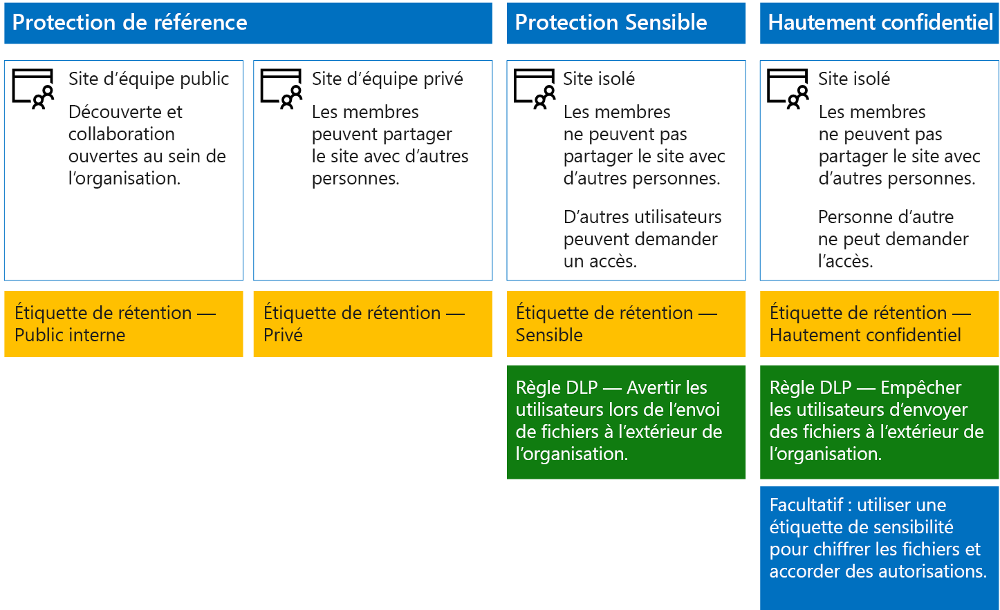

# Sécuriser des sites et des fichiers SharePoint OnlineSecure SharePoint Online sites and files

 **Résumé :** Recommandations de configuration pour la protection des fichiers dans SharePoint Online et Office 365.**Summary:** Configuration recommendations for protecting files in SharePoint Online and Office 365.
  
Cet article fournit des recommandations pour configurer les sites d’équipe SharePoint Online et la protection des fichiers d’une façon qui combine sécurité et simplicité de collaboration. Cet article définit quatre configurations différentes, en commençant par un site public au sein de votre organisation avec les stratégies de partage les plus ouvertes. Chacune des autres configurations représente une amélioration significative de la protection, mais limite l’accès aux ressources et les possibilités de collaboration à l’ensemble d’utilisateurs concerné. Utilisez ces recommandations comme point de départ et ajustez les configurations pour répondre aux besoins de votre organisation.This article provides recommendations for configuring SharePoint Online team sites and file protection that balances security with ease of collaboration. This article defines four different configurations, starting with a public site within your organization with the most open sharing policies. Each additional configuration represents a meaningful step up in protection, but the ability to access and collaborate on resources is reduced to the relevant set of users. Use these recommendations as a starting point and adjust the configurations to meet the needs of your organization. 
  
Les configurations décrites dans cet article respectent les recommandations de Microsoft quant aux trois niveaux de protection des données, des identités et des appareils :The configurations in this article align with Microsoft's recommendations for three tiers of protection for data, identities, and devices:
  
- Protection Base de référenceBaseline protection
    
- Protection SensibleSensitive protection
    
- Protection Hautement confidentielHighly confidential protection
    
Pour plus d’informations sur ces niveaux et les fonctionnalités recommandées pour chacun d’eux, consultez les ressources suivantes.For more information about these tiers and capabilities recommended for each tier, see the following resources. 
  
- [Protection des appareils et de l’identité pour Office 365Identity and Device Protection for Office 365](https://docs.microsoft.com/office365/enterprise/microsoft-cloud-it-architecture-resources#BKMK_O365IDP)
    
- [Solutions de protection des fichiers dans Office 365File Protection Solutions in Office 365](https://docs.microsoft.com/office365/enterprise/microsoft-cloud-it-architecture-resources#BKMK_O365fileprotect)
    
## Vue d’ensemble des fonctionnalitésCapability overview

Les recommandations pour les sites d’équipe SharePoint Online s’appuient sur différentes fonctionnalités de Microsoft 365.Recommendations for SharePoint Online team sites draw on a variety of Microsoft 365 capabilities. L’illustration suivante montre les configurations recommandées pour quatre sites d’équipe SharePoint Online.The following illustration shows the recommended configurations for four SharePoint Online team sites.

Comme illustré :As illustrated:
  
- La protection de référence inclut deux options pour les sites d’équipe SharePoint Online : un site public et un site privé. Les sites publics peuvent être recherchés et sont accessibles à toute personne de l’organisation. Les sites privés peuvent uniquement être recherchés par les membres du site et seuls ces derniers peuvent y accéder. Ces deux configurations de site permettent le partage en dehors du groupe.Baseline protection includes two options for SharePoint Online team sites — a public site and private site. Public sites can be discovered and accessed by anybody in the organization. Private sites can only be discovered and accessed by members of the site. Both of these site configurations allow for sharing outside the group. 
    
- Les sites pour la protection Hautement confidentiel et Sensible sont des sites privés avec un accès limité aux seuls membres de groupes spécifiques.Sites for sensitive and highly confidential protection are private sites with access limited only to members of specific groups.
    
- Les [Étiquettes de rétention](labels.md) offrent un moyen pour classer les fichiers dans les sites.[Retention labels](labels.md) provide a way to classify files within the sites. Chacun des sites d’équipe SharePoint Online est configuré pour étiqueter automatiquement les fichiers dans des bibliothèques de documents avec une étiquette par défaut pour le site.Each of the SharePoint Online team sites are configured to automatically label files in document libraries with a default retention label for the site. Correspondant aux configurations des quatre sites, les étiquettes de cet exemple sont Public interne, Privé, Sensible et Hautement confidentiel.Corresponding to the four site configurations, the labels in this example are Internal Public, Private, Sensitive, and Highly Confidential. Les utilisateurs peuvent changer les étiquettes, mais cette configuration garantit que tous les fichiers reçoivent une étiquette par défaut.Users can change the labels, but this configuration ensures all files receive a default label.
    
- [Protection contre la perte de données](data-loss-prevention-policies.md)Les stratégies de protection contre la perte de données (DLP) sont configurées pour les étiquettes Sensibles et Hautement confidentielles afin de prévenir les utilisateurs quand ils essaient d’envoyer ces types de fichiers à l’extérieur de l’organisation, ou de les en empêcher.[Data loss prevention](data-loss-prevention-policies.md) (DLP) policies are configured for the Sensitive and Highly Confidential retention labels to either warn or prevent users when they attempt to send these types of files outside the organization.
    
- Si nécessaire pour votre scénario, vous pouvez utiliser les[étiquettes sensibilité](sensitivity-labels.md) à protéger les fichiers confidentiels hautement avec le chiffrement et les autorisations.If needed for your scenario, you can use [sensitivity labels](sensitivity-labels.md) to protect highly confidential files with encryption and permissions. Pour les clients Azure Information Protection, vous pouvez utiliser vos étiquettes Azure Information Protection dans le centre de conformité de Microsoft 365 et vos étiquettes sont synchronisées avec le portail Azure au cas où vous choisissez d’effectuer une configuration supplémentaire ou avancée.For Azure Information Protection customers, you can use your Azure Information Protection labels in the Microsoft 365 compliance center, and your labels will be synced with the Azure portal in case you choose to perform additional or advanced configuration. Les étiquettes Azure Information Protection et les étiquettes de niveau de confidentialité Office 365 sont totalement compatibles avec chacun d’eux.Azure Information Protection labels and Office 365 sensitivity labels are fully compatible with each other. Cela signifie, par exemple, que si vous avez du contenu par Azure Information Protection, vous ne devez pas reclasser ou attribuer un nouveau libellé votre contenu. Tous les clients n’auront pas besoin de ce niveau de protection.This means, for example, if you have content labeled by Azure Information Protection, you won’t need to reclassify or relabel your content.Not all customers need this level of protection. 
    
## Paramètres à l’échelle du client pour SharePoint Online et OneDrive EntrepriseTenant-wide settings for SharePoint Online and OneDrive for Business

SharePoint Online et OneDrive Entreprise incluent des paramètres à l’échelle du client qui concernent tous les sites et les utilisateurs. Certains de ces paramètres peuvent également être ajustés au niveau du site pour que ce dernier soit plus restrictif (mais pas moins). Cette section décrit les paramètres à l’échelle du client qui concernent la sécurité et la collaboration.SharePoint Online and OneDrive for Business include tenant-wide settings that affect all sites and users. Some of these settings can also be adjusted at the site level to be more restrictive (but not less). This section discusses tenant-wide settings that affect security and collaboration. 
  
### PartageSharing

Pour cette solution, nous recommandons les paramètres au niveau du locataire suivants :For this solution, we recommend the following tenant-wide settings:
  
- Conservez la stratégie de partage par défaut qui autorise le partage complet avec tous les types de comptes, notamment le partage anonyme.Keep the default sharing policy that allows all sharing with all account types, including anonymous sharing.
    
- Configurez les liens anonymes de sorte à ce qu’ils expirent, si vous le souhaitez.Set anonymous links to expire, if desired.
    
- Modifiez le type de liaison par défaut pour le partage sur Interne. Cela contribue à la prévention des fuites accidentelles de données à l’extérieur de votre organisation.Change the default link type for sharing to Internal. This helps prevent accidental data leakage outside your organization.
    
Bien qu’il puisse sembler contre-intuitif d’autoriser le partage externe, cette approche offre davantage de contrôle sur le partage de fichiers par rapport à l’envoi de fichiers par courrier électronique. SharePoint Online et Outlook fonctionnent ensemble pour sécuriser la collaboration sur les fichiers.While it might seem counterintuitive to allow external sharing, this approach provides more control over file sharing compared to sending files in email. SharePoint Online and Outlook work together to provide secure collaboration on files. 
  
- Par défaut, Outlook partage un lien vers un fichier au lieu d’envoyer le fichier dans un e-mail.By default, Outlook shares a link to a file instead of sending the file in email. 
    
- SharePoint Online et OneDrive Entreprise facilitent le partage de liens vers des fichiers avec des collaborateurs qui se trouvent à l’intérieur et à l’extérieur de votre organisationSharePoint Online and OneDrive for Business make it easy to share links to files with contributors who are both inside and outside your organization
    
Vous avez également des contrôles pour vous aider à gérer le partage externe. Par exemple, vous pouvez :You also have controls to help govern external sharing. For example, you can:
  
- désactiver un lien invité anonyme ;Disable an anonymous guest link.
    
- Révoquer l’accès utilisateur à un site.Revoke user access to a site.
    
- Voir qui a accès à un site ou un document spécifique.See who has access to a specific site or document.
    
- Spécifier que les liens de partage anonyme doivent expirer (paramètre au niveau du locataire).Set anonymous sharing links to expire (tenant setting).
    
- Limiter qui peut partager à l’extérieur de votre organisation (paramètre au niveau du locataire).Limit who can share outside your organization (tenant setting).
    
### Utiliser le partage externe avec la protection contre la perte de donnéesUse external sharing together with data loss prevention (DLP)

Si vous n’autorisez pas le partage externe, les utilisateurs ayant des besoins métier trouveront d’autres outils et d’autres méthodes. Microsoft vous recommande de combiner le partage externe avec des stratégies de protection contre la perte de données pour protéger les fichiers sensibles et hautement confidentiels.If you don't allow external sharing, users with a business need will find alternate tools and methods. Microsoft recommends you combine external sharing with DLP policies to protect sensitive and highly confidential files.
  
### Paramètres d’accès d’appareilDevice access settings

Les paramètres d’accès aux appareils pour SharePoint Online et OneDrive Entreprise vous permettent de déterminer si l’accès est limité au navigateur uniquement (fichiers ne pouvant pas être téléchargés) ou si l’accès est bloqué.Device access settings for SharePoint Online and OneDrive for Business let you determine whether access is limited to browser only (files can't be downloaded) or if access is blocked. Pour plus d’informations, voir [Contrôler l’accès à partir des appareils non gérés](https://docs.microsoft.com/fr-FR/sharepoint/control-access-from-unmanaged-devices).For more information, see [Control access from unmanaged devices](https://docs.microsoft.com/fr-FR/sharepoint/control-access-from-unmanaged-devices). 

Pour utiliser les paramètres d’accès appareil avec les stratégies d’accès conditionnel recommandée dans Azure Active Directory, voir[recommandations en matière de stratégie de sécurisation des sites SharePoint et des fichiers](https://docs.microsoft.com/fr-FR/microsoft-365/enterprise/sharepoint-file-access-policies).To use device access settings with recommended conditional access policies in Azure Active Directory, see [Policy recommendations for securing SharePoint sites and files](https://docs.microsoft.com/fr-FR/microsoft-365/enterprise/sharepoint-file-access-policies).
  
### OneDrive EntrepriseOneDrive for Business

Consultez ces paramètres pour décider si vous souhaitez modifier les paramètres par défaut pour les sites OneDrive Entreprise. Actuellement, le partage et les paramètres d’accès aux appareils sont dupliqués à partir du centre d’administration SharePoint Online et s’appliquent aux deux environnements.Visit these settings to decide if you want to change the default settings for OneDrive for Business sites. Currently, the sharing and device access settings are duplicated from the SharePoint Online admin center and apply to both environments.
  
## Configuration d’un site d’équipe SharePointSharePoint team site configuration

Le tableau suivant récapitule la configuration pour chacun des sites d’équipe décrits plus haut dans cet article. Utilisez ces configurations comme recommandations de point de départ et ajustez les configurations et les types de site pour répondre aux besoins de votre organisation. Les organisations n’ont pas toutes besoin de tous les types de site. Seules quelques organisations requièrent la protection hautement confidentielle.The following table summarizes the configuration for each of the team sites described earlier in this article. Use these configurations as starting point recommendations and adjust the site types and configurations to meet the needs of your organization. Not every organization needs every type of site. Only a small number of organizations require highly confidential protection.
  
||||||
|:-----|:-----|:-----|:-----|:-----|
||**Protection Base de référence #1****Baseline protection #1**   |**Protection Base de référence #2****Baseline protection #2**   |**Protection Sensible****Sensitive protection**   |**Hautement confidentiel****Highly confidential**   |
|DescriptionDescription    |Découverte et collaboration ouvertes au sein de l’organisation.Open discovery and collaboration within the organization.    |Site privé et groupe avec partage autorisé en dehors du groupe.Private site and group with sharing allowed outside the group.    |Site isolé, dans lequel les niveaux d’accès sont définis par l’appartenance à des groupes spécifiques. Le partage est autorisé uniquement aux membres du site. La protection contre la perte de données avertit les utilisateurs quand ils tentent d’envoyer des fichiers à l’extérieur de l’organisation.Isolated site, in which levels of access are defined by membership in specific groups. Sharing is only allowed to members of the site. DLP warns users when attempting to send files outside the organization.    |Site isolé + chiffrement des fichiers et autorisations avec Azure Information Protection. La protection contre la perte de données empêche les utilisateurs d’envoyer des fichiers à l’extérieur de l’organisation.Isolated site + file encryption and permissions with Azure Information Protection. DLP prevents users from sending files outside the organization.    |
|Site d’équipe privé ou publicPrivate or public team site    |PublicPublic    |PrivatePrivate    |PrivatePrivate    |PrivatePrivate    |
|Qui a accès ?Who has access?    |Tous les membres de l’organisation, y compris les utilisateurs B2B et les utilisateurs invités.Everybody in the organization, including B2B users and guest users.    |Les membres du site uniquement. D’autres utilisateurs peuvent demander l’accès.Members of the site only. Others can request access.    |Les membres du site uniquement. D’autres utilisateurs peuvent demander l’accès.Members of the site only. Others can request access.    |Uniquement les membres. Personne d’autre ne peut demander l’accès.Members only. Others cannot request access.    |
|Contrôles de partage au niveau du siteSite-level sharing controls    |Partage autorisé avec tout le monde. Paramètres par défaut.Sharing allowed with anybody. Default settings.    |Partage autorisé avec tout le monde. Paramètres par défaut.Sharing allowed with anybody. Default settings.    |Les membres ne peuvent pas partager l’accès au site.Members cannot share access to the site.    Les non-membres peuvent demander l’accès au site, mais ces demandes doivent être traitées par un administrateur du site.Non-members can request access to the site, but these requests need to be addressed by a site administrator.    |Les membres ne peuvent pas partager l’accès au site.Members cannot share access to the site.    Les non-membres ne peuvent pas demander l’accès au site ou au contenu.Non-members cannot request access to the site or contents.    |
|Contrôles d’accès d’appareil au niveau du siteSite-level device access controls    |Pas de contrôles supplémentaires.No additional controls.    |Pas de contrôles supplémentaires.No additional controls.    |Empêchent les utilisateurs de télécharger des fichiers sur des appareils non conformes ou non liés à un domaine. Cela permet un accès par navigateur uniquement à partir de tous les autres appareils.Site-level controls are coming soon, which prevents users from downloading files to non-compliant or non-domain joined devices. This allows browser-only access from all other devices.    |Bloquent le téléchargement de fichiers sur des appareils non conformes ou non joints à un domaine.Site-level controls are coming soon, which blocks downloading of files to non-compliant or non-domain joined devices.    |
|Étiquettes de rétentionRetention labels    |Public interneInternal Public    |PrivatePrivate    |SensibleSensitive    |Hautement confidentielHighly Confidential    |
|Stratégies de protection contre la perte de donnéesDLP policies    |||Avertissez les utilisateurs lors de l’envoi des fichiers qui sont étiquetés comme sensibles à l’extérieur de l’organisation.Warn users when sending files that are labeled as Sensitive outside the organization.    Pour bloquer le partage externe de types de données sensibles, telles que les numéros de carte de crédit ou d’autres données personnelles, vous pouvez configurer des stratégies de protection contre la perte de données supplémentaires pour ces types de données (y compris les types de données personnalisés que vous configurez).To block external sharing of sensitive data types, such as credit card numbers or other personal data, you can configure additional DLP policies for these data types (including custom data types you configure).    |Empêchent les utilisateurs d’envoyer des fichiers portant l’étiquette Hautement confidentiel en dehors de l’organisation. Autorisent les utilisateurs à passer outre ce paramètre en fournissant une justification, notamment en indiquant la personne avec laquelle ils partagent le fichier.Block users from sending files that are labeled as highly confidential outside organization. Allow users to override this by providing justification, including who they are sharing the file with.    |
|Étiquettes de niveau de confidentialitéSensitivity labels    ||||Utilisez Azure Information Protection pour chiffrer automatiquement les fichiers et accorder des autorisations sur ceux-ci.Use sensitivity labels to automatically encrypt and grant permissions to files. Les étiquettes de sensibilité utilisent la Protection d’informations Azure pour chiffrer les fichiers.Sensitivity labels use Azure Information Protection to encrypt files. Cette protection reste associée aux fichiers dans le cas où ils sont divulgués.This protection travels with the files in case they are leaked.    Office 365 ne peut pas lire les fichiers chiffrés avec Azure Information Protection. En outre, les stratégies de protection contre la perte de données (DLP) peuvent fonctionner uniquement avec les métadonnées (y compris les étiquettes), et pas avec le contenu de ces fichiers (par exemple, des numéros de cartes de crédit au sein des fichiers).Office 365 cannot read files encrypted with Azure Information Protection. Additionally, DLP policies can only work with the metadata (including labels) but not the contents of these files (such as credit card numbers within files).    |
   
Pour savoir comment déployer les quatre différents types de sites d’équipe SharePoint Online dans cette solution, voir [Déployer des sites SharePoint Online pour les trois niveaux de protection](deploy-sharepoint-online-sites-for-three-tiers-of-protection.md).For the steps to deploy the four different types of SharePoint Online team sites in this solution, see [Deploy sites for three tiers of protection](deploy-sharepoint-online-sites-for-three-tiers-of-protection.md). 
  
## Étiquettes de rétention Office 365Office 365 retention labels

L’utilisation des étiquettes de rétention est recommandée pour les environnements avec des données sensibles.Using retention labels is recommended for environments with sensitive data. Après avoir configuré et publié des étiquettes de rétention:After you configure and publish retention labels:
  
- Vous pouvez appliquer une étiquette par défaut à une bibliothèque de documents dans un site d’équipe SharePoint Online, afin que tous les documents figurant dans cette bibliothèque obtiennent l’étiquette par défaut.You can apply a default label to a document library in a SharePoint Online team site, so that all documents in that library get the default label. 
    
- Vous pouvez appliquer des étiquettes au contenu automatiquement s’il répond à des conditions spécifiques.You can apply labels to content automatically if it matches specific conditions.
    
- Vous pouvez appliquer des stratégies de protection DLP contre la perte de données qui reposent sur les étiquettes de rétention.You can apply DLP policies that are based on retention labels.
    
- Des personnes de votre organisation peuvent appliquer une étiquette manuellement au contenu dans Outlook sur le web, Outlook 2010 et versions ultérieures, OneDrive Entreprise, SharePoint Online et les groupes Office 365. Les utilisateurs savent souvent mieux quel type de contenu ils utilisent, ils peuvent donc le classer et appliquer la stratégie DLP appropriée.People in your organization can apply a label manually to content in Outlook on the web, Outlook 2010 and later, OneDrive for Business, SharePoint Online, and Office 365 groups. Users often know best what type of content they're working with, so they can classify it and have the appropriate DLP policy applied.
    

  
Comme illustré, cette solution inclut la création des étiquettes de rétention suivantes :As illustrated, this solution includes creating the following retention labels:
  
- Hautement confidentielHighly Confidential
    
- SensibleSensitive
    
- PrivatePrivate
    
- Public interneInternal Public
    
Ces étiquettes sont mises en correspondance avec les sites recommandés dans les illustrations et graphiques figurant plus haut dans cet article. Cette solution recommande de configurer des stratégies DLP pour empêcher la fuite de fichiers portant l’étiquette Sensible et Hautement confidentiel.These labels are mapped to the recommended sites in the illustrations and charts earlier in this article. This solution recommends configuring DLP policies to help prevent the leakage of files labeled as Sensitive and Highly Confidential.
  
Pour connaître les étapes de configuration des étiquettes de rétention et des stratégies de protection contre la perte de données dans cette solution, consultez [Protéger des fichiers SharePoint Online avec des étiquettes de rétention et la protection contre la perte de données DLP](protect-sharepoint-online-files-with-office-365-labels-and-dlp.md).For the steps to configure retention labels and DLP policies in this solution, see [Protect SharePoint Online files with retention labels and DLP](protect-sharepoint-online-files-with-office-365-labels-and-dlp.md).
  
## Étiquettes de niveau de confidentialitéSensitivity labels 

Si cela se justifie pour votre scénario de sécurité, vous pouvez utiliser des étiquettes de sensibilité pour appliquer des protections fiables qui suivent les fichiers là où elles accèdent.If warranted for your security scenario, you can use sensitivity labels to apply protections that follow the files wherever they go. Les étiquettes de niveau de confidentialité dans le centre de conformité de Microsoft 365 et Azure Information Protection étiquettes sont identiques.Sensitivity labels in the Microsoft 365 compliance center and Azure Information Protection labels are the same. Pour cette solution, nous vous recommandons d’utiliser une stratégie délimitée Azure Information Protection et une sous-étiquette de l’étiquette Hautement confidentiel pour chiffrer et accorder des autorisations sur les fichiers qui doivent être protégés avec le plus haut niveau de sécurité.For this solution, we recommend you use a scoped Azure Information Protection policy and a sub-label of the Highly Confidential label to encrypt and grant permissions to files that need to be protected with the highest level of security. 
  
Attention, quand le chiffrement Azure Information Protection est appliqué aux fichiers stockés dans Office 365, le service ne peut pas traiter le contenu de ces fichiers.Be aware that when Azure Information Protection encryption is applied to files stored in Office 365, the service cannot process the contents of these files. La co-édition, eDiscovery, la recherche, Delve et d’autres fonctionnalités de collaboration ne fonctionnent pas.Co-authoring, eDiscovery, search, Delve, and other collaborative features do not work. Les stratégies de protection contre la perte de données DLP peuvent fonctionner seulement avec les métadonnées (notamment les étiquettes de rétention), mais pas avec le contenu de ces fichiers (comme des numéros de carte de crédit dans des fichiers).DLP policies can only work with the metadata (including retention labels) but not the contents of these files (such as credit card numbers within files).

Pour plus d’informations, voir[Vue d’ensemble d’étiquettes de sensibilité](sensitivity-labels.md).For more information, see [Overview of sensitivity labels](sensitivity-labels.md).

    
### Ajout d’autorisations pour les utilisateurs externesAdding permissions for external users

Il existe deux façons d’accorder à des utilisateurs externes un accès à des fichiers protégés par le service Azure Information Protection. Dans les deux cas, les utilisateurs externes doivent disposer d’un compte Azure Active Directory. Si les utilisateurs externes ne sont pas membres d’une organisation qui utilise Azure AD, ils peuvent obtenir un compte Azure AD individuel via cette page d’inscription : [https://aka.ms/aip-signup](https://aka.ms/aip-signup)There are two ways you can grant external users access to files protected with Azure Information Protection. In both these cases, external users must have an Azure AD account. If external users aren't members of an organization that uses Azure AD, they can obtain an Azure AD account as an individual by using this sign-up page: [https://aka.ms/aip-signup](https://aka.ms/aip-signup).
  
- Ajouter des utilisateurs externes à un groupe Azure AD qui est utilisé pour configurer la protection d’une étiquetteAdd external users to an Azure AD group that is used to configure protection for a label
    
     Vous devez tout d’abord ajouter le compte en tant qu’utilisateur B2B dans votre répertoire. La [mise en cache de l’appartenance au groupe par Azure Rights Management](https://docs.microsoft.com/information-protection/plan-design/prepare#group-membership-caching-by-azure-rights-management) peut prendre quelques heures. Avec cette méthode, les autorisations sont accordées à tous les fichiers existants protégés avec l’étiquette (même les fichiers protégés avant l’ajout d’un utilisateur au groupe Azure AD).You'll need to first add the account as a B2B user in your directory. It can take a couple of hours for [group membership caching by Azure Rights Management](https://docs.microsoft.com/information-protection/plan-design/prepare#group-membership-caching-by-azure-rights-management). With this method, permissions are granted to all existing files protected with the label (even files protected before a user is added to the Azure AD group).
    
- Ajouter des utilisateurs externes directement à la protection d’étiquetteAdd external users directly to the label protection
    
     Vous pouvez ajouter tous les utilisateurs d’une organisation (par exemple, Fabrikam.com), un groupe Azure AD (par exemple, un groupe financier au sein d’une organisation) ou un utilisateur individuel. Par exemple, vous pouvez ajouter une équipe externe de régulateurs à la protection d’une étiquette. Avec cette méthode, les autorisations sont accordées uniquement aux fichiers protégés avec l’étiquette une fois que l’entité externe est ajoutée à la protection.You can add all users from an organization (e.g. Fabrikam.com), an Azure AD group (such as a finance group within an organization), or an individual user. For example, you can add an external team of regulators to the protection for a label. With this method, permissions are granted only to files protected with the label after the external entity is added to the protection.
    
### Déploiement et utilisation d’Azure Information ProtectionDeploying and using Azure Information Protection

Pour connaître les étapes de configuration d’Azure Information Protection dans cette solution, consultez [Protéger des fichiers SharePoint Online avec Azure Information Protection](protect-sharepoint-online-files-with-azure-information-protection.md).For the steps to configure Azure Information Protection in this solution, see [Protect SharePoint Online files with Azure Information Protection](protect-sharepoint-online-files-with-azure-information-protection.md).
  
## Voir aussiSee Also

[Conseils de sécurité Microsoft pour les campagnes électorales, les organisations à but non lucratif et d’autres organisations flexiblesMicrosoft Security Guidance for Political Campaigns, Nonprofits, and Other Agile Organizations](microsoft-security-guidance-for-political-campaigns-nonprofits-and-other-agile-o.md)
  
[Adoption du cloud et solutions hybridesCloud adoption and hybrid solutions](https://docs.microsoft.com/office365/enterprise/cloud-adoption-and-hybrid-solutions)
  
