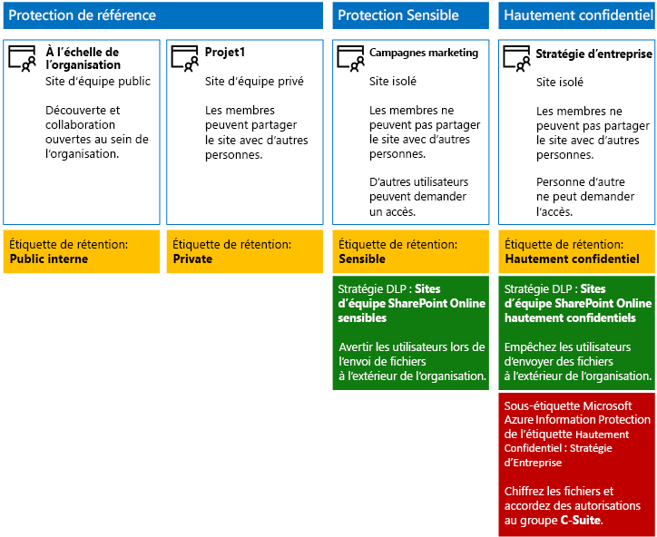
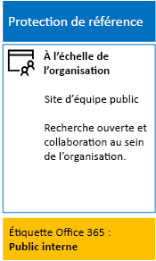
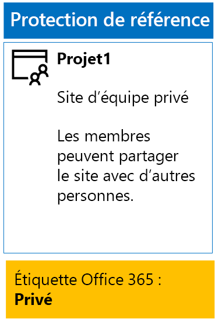
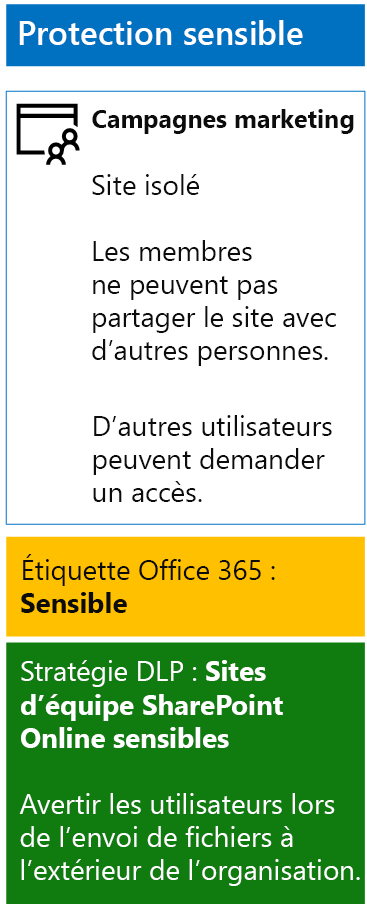
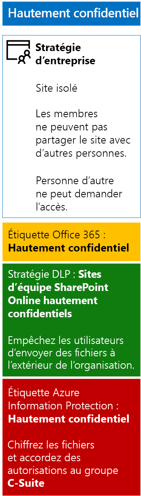

# <a name="secure-sharepoint-online-sites-in-a-devtest-environment"></a><span data-ttu-id="c52ef-103">Sécuriser des sites SharePoint Online dans un environnement de développement et de test</span><span class="sxs-lookup"><span data-stu-id="c52ef-103">Secure SharePoint Online sites in a dev/test environment</span></span>

 <span data-ttu-id="c52ef-104">**Résumé :** Créez des sites d’équipe SharePoint Online publics, privés, sensibles et hautement confidentiels dans un environnement de développement/test.</span><span class="sxs-lookup"><span data-stu-id="c52ef-104">**Summary:** Create public, private, sensitive, and highly confidential SharePoint Online team sites in a dev/test environment.</span></span>
  
<span data-ttu-id="c52ef-105">Cet article fournit des instructions pas à pas pour créer un environnement de développement et de test qui inclut les quatre types différents de sites d’équipe SharePoint Online pour la solution de [sécurisation des sites et des fichiers SharePoint Online](secure-sharepoint-online-sites-and-files.md).</span><span class="sxs-lookup"><span data-stu-id="c52ef-105">This article provides step-by-step instructions to create a dev/test environment that includes the four different types of SharePoint Online team sites for the [Secure SharePoint Online sites and files](secure-sharepoint-online-sites-and-files.md) solution.</span></span>
  

  
<span data-ttu-id="c52ef-107">Utilisez cet environnement de développement/test pour expérimenter les comportements de protection des informations et optimiser les paramètres en fonction de vos besoins avant de déployer des sites d’équipe SharePoint Online en production.</span><span class="sxs-lookup"><span data-stu-id="c52ef-107">Use this dev/test environment to experiment with the information protection behaviors and fine-tune settings for your specific needs before deploying SharePoint Online team sites in production.</span></span>
  
## <a name="phase-1-create-your-devtest-environment"></a><span data-ttu-id="c52ef-108">Phase 1 : Créer votre environnement de développement et de test</span><span class="sxs-lookup"><span data-stu-id="c52ef-108">Phase 1: Create your dev/test environment</span></span>

<span data-ttu-id="c52ef-109">Dans cette phase, vous obtenez des abonnements d’essai pour Office 365 et Enterprise Mobility + Security pour une entreprise fictive.</span><span class="sxs-lookup"><span data-stu-id="c52ef-109">In this phase, you obtain trial subscriptions for Office 365 and Enterprise Mobility + Security for a fictional organization.</span></span>
  
<span data-ttu-id="c52ef-110">Suivez d’abord les instructions de la **Phase 2** de l’[environnement de développement/test Office 365](https://docs.microsoft.com/office365/enterprise/office-365-dev-test-environment).</span><span class="sxs-lookup"><span data-stu-id="c52ef-110">First, follow the instructions in **Phase 2** of the [Office 365 dev/test environment](https://docs.microsoft.com/office365/enterprise/office-365-dev-test-environment).</span></span>
  
<span data-ttu-id="c52ef-111">Ensuite, inscrivez-vous à l’abonnement d’évaluation EMS et ajoutez-le à la même organisation que votre abonnement d’évaluation Office 365.</span><span class="sxs-lookup"><span data-stu-id="c52ef-111">Next, sign up for the EMS trial subscription and add it to the same organization as your Office 365 trial subscription.</span></span>
  
1. <span data-ttu-id="c52ef-p101">Si nécessaire, connectez-vous au portail Office 365 avec les informations d’identification du compte d’administrateur général de votre abonnement d’essai. Pour obtenir de l’aide, consultez [Où se connecter à Office 365](https://support.office.com/Article/Where-to-sign-in-to-Office-365-e9eb7d51-5430-4929-91ab-6157c5a050b4).</span><span class="sxs-lookup"><span data-stu-id="c52ef-p101">If needed, sign in to the Office 365 portal with the credentials of the global administrator account of your trial subscription. For help, see [Where to sign in to Office 365](https://support.office.com/Article/Where-to-sign-in-to-Office-365-e9eb7d51-5430-4929-91ab-6157c5a050b4).</span></span>
    
2. <span data-ttu-id="c52ef-114">Cliquez sur la vignette **Administration**.</span><span class="sxs-lookup"><span data-stu-id="c52ef-114">Click the **Admin** tile.</span></span>
    
3. <span data-ttu-id="c52ef-115">Sous l’onglet **Centre d’administration Office** de votre navigateur, dans le volet de navigation gauche, cliquez sur **Facturation > Acheter des services**.</span><span class="sxs-lookup"><span data-stu-id="c52ef-115">On the **Office Admin center** tab in your browser, in the left navigation, click **Billing > Purchase services**.</span></span>
    
4. <span data-ttu-id="c52ef-p102">Dans la page **Acheter des services**, recherchez l’élément **Enterprise Mobility + Security E5**. Pointez votre souris dessus et cliquez sur **Démarrer l’essai gratuit**.</span><span class="sxs-lookup"><span data-stu-id="c52ef-p102">On the **Purchase services** page, find the **Enterprise Mobility + Security E5** item. Hover your mouse pointer over it and click **Start free trial**.</span></span>
    
5. <span data-ttu-id="c52ef-118">Dans la page **Confirmer votre commande**, cliquez sur **Essayer maintenant**.</span><span class="sxs-lookup"><span data-stu-id="c52ef-118">On the **Confirm your order** page, click **Try now**.</span></span>
    
6. <span data-ttu-id="c52ef-119">Dans la page **Réception de la commande**, cliquez sur **Continuer**.</span><span class="sxs-lookup"><span data-stu-id="c52ef-119">On the **Order receipt** page, click **Continue**.</span></span>
    
<span data-ttu-id="c52ef-120">Ensuite, activez la licence Enterprise Mobility + Security E5 pour votre compte d’administrateur général.</span><span class="sxs-lookup"><span data-stu-id="c52ef-120">Next, enable the Enterprise Mobility + Security E5 license for your global administrator account.</span></span>
  
1. <span data-ttu-id="c52ef-121">Sous l’onglet **Centre d’administration Office 365** de votre navigateur, dans le volet de navigation gauche, cliquez sur **Utilisateurs > Utilisateurs actifs**.</span><span class="sxs-lookup"><span data-stu-id="c52ef-121">On the **Office 365 Admin center** tab in your browser, in the left navigation, click **Users > Active users**.</span></span>
    
2. <span data-ttu-id="c52ef-122">Cliquez sur votre compte Administrateur général, puis cliquez sur **Modifier** pour les **licences de produit**.</span><span class="sxs-lookup"><span data-stu-id="c52ef-122">Click your global administrator account, and then click **Edit** for **Product licenses**.</span></span>
    
3. <span data-ttu-id="c52ef-123">Dans le volet **Licences de produit**, activez la licence de produit pour **Enterprise Mobility + Security E5** en sélectionnant **Activer**, cliquez sur **Enregistrer**, cliquez deux fois sur **Fermer**.</span><span class="sxs-lookup"><span data-stu-id="c52ef-123">On the **Product licenses** pane, turn the product license for **Enterprise Mobility + Security E5** to **On**, click **Save,** and then click **Close** twice.</span></span>
    
## <a name="phase-2-create-and-configure-your-azure-active-directory-ad-groups-and-users"></a><span data-ttu-id="c52ef-124">Phase 2 : Création et configuration de vos groupes et utilisateurs Azure Active Directory (AD)</span><span class="sxs-lookup"><span data-stu-id="c52ef-124">Phase 2: Create and configure your Azure Active Directory (AD) groups and users</span></span>

<span data-ttu-id="c52ef-125">Dans cette phase, vous créez et vous configurez les groupes et les utilisateurs Azure AD de votre organisation fictive.</span><span class="sxs-lookup"><span data-stu-id="c52ef-125">In this phase, you create and configure the Azure AD groups and users for your fictional organization.</span></span>
  
<span data-ttu-id="c52ef-126">Commencez par créer un ensemble de groupes pour une organisation standard avec le portail Azure.</span><span class="sxs-lookup"><span data-stu-id="c52ef-126">First, create a set of groups for a typical organization with the Azure portal.</span></span>
  
1. <span data-ttu-id="c52ef-p103">Créez un onglet distinct dans votre navigateur, puis accédez au portail Azure à l’adresse [https://portal.azure.com](https://portal.azure.com). Si nécessaire, connectez-vous avec les informations d’identification du compte Administrateur général de votre abonnement d’essai Office 365 E5.</span><span class="sxs-lookup"><span data-stu-id="c52ef-p103">Create a separate tab in your browser, and then go to the Azure portal at [https://portal.azure.com](https://portal.azure.com). If needed, sign in with the credentials of the global administrator account for your Office 365 E5 trial subscription.</span></span>
    
2. <span data-ttu-id="c52ef-129">Dans le portail Azure, cliquez sur **Azure Active Directory > Groupes**.</span><span class="sxs-lookup"><span data-stu-id="c52ef-129">In the Azure portal, click **Azure Active Directory > Groups**.</span></span>
    
3. <span data-ttu-id="c52ef-130">Dans le panneau **Groupes - Tous les groupes**, cliquez sur **+ Nouveau groupe**.</span><span class="sxs-lookup"><span data-stu-id="c52ef-130">On the **Groups - All groups** blade, click **+ New group**.</span></span>
    
4. <span data-ttu-id="c52ef-131">Dans le panneau **Groupe** :</span><span class="sxs-lookup"><span data-stu-id="c52ef-131">On the **Group** blade:</span></span>
    
  - <span data-ttu-id="c52ef-132">Sélectionnez **Office 365** dans **Type de groupe**.</span><span class="sxs-lookup"><span data-stu-id="c52ef-132">Select **Office 365** in **Group type**.</span></span>
    
  - <span data-ttu-id="c52ef-133">Tapez **C-Suite** dans le champ **Nom**.</span><span class="sxs-lookup"><span data-stu-id="c52ef-133">Type **C-Suite** in **Name**.</span></span>
    
  - <span data-ttu-id="c52ef-134">Sélectionnez **Affecté** dans le champ **Type d’appartenance**.</span><span class="sxs-lookup"><span data-stu-id="c52ef-134">Select **Assigned** in **Membership type**.</span></span>
      
5. <span data-ttu-id="c52ef-135">Cliquez sur **Créer** et fermez le panneau **Groupe**.</span><span class="sxs-lookup"><span data-stu-id="c52ef-135">Click **Create**, and then close the **Group** blade.</span></span>
    
6. <span data-ttu-id="c52ef-136">Répétez les étapes 3 à 5 pour les noms de groupe suivants :</span><span class="sxs-lookup"><span data-stu-id="c52ef-136">Repeat steps 3-5 for the following group names:</span></span>
    
  - <span data-ttu-id="c52ef-137">Équipe Informatique</span><span class="sxs-lookup"><span data-stu-id="c52ef-137">IT staff</span></span>
    
  - <span data-ttu-id="c52ef-138">Équipe Recherche</span><span class="sxs-lookup"><span data-stu-id="c52ef-138">Research staff</span></span>
    
  - <span data-ttu-id="c52ef-139">Équipe Standard</span><span class="sxs-lookup"><span data-stu-id="c52ef-139">Regular staff</span></span>
    
  - <span data-ttu-id="c52ef-140">Équipe Marketing</span><span class="sxs-lookup"><span data-stu-id="c52ef-140">Marketing staff</span></span>
    
  - <span data-ttu-id="c52ef-141">Équipe Ventes</span><span class="sxs-lookup"><span data-stu-id="c52ef-141">Sales staff</span></span>
    
7. <span data-ttu-id="c52ef-142">Gardez l’onglet du portail Azure ouvert dans votre navigateur.</span><span class="sxs-lookup"><span data-stu-id="c52ef-142">Keep the Azure portal tab in your browser open.</span></span>
    
<span data-ttu-id="c52ef-143">Ensuite, configurez l’octroi de licence automatique afin que des licences soient automatiquement attribuées aux membres de vos groupes pour les abonnements Office 365 et EMS.</span><span class="sxs-lookup"><span data-stu-id="c52ef-143">Next, you configure automatic licensing so that members of your groups are automatically assigned licenses for your Office 365 and EMS subscriptions.</span></span>
  
1. <span data-ttu-id="c52ef-144">Dans le portail Azure, cliquez sur **Azure Active Directory > Licences > Tous les produits**.</span><span class="sxs-lookup"><span data-stu-id="c52ef-144">In the Azure portal, click **Azure Active Directory > Licenses > All products**.</span></span>
    
2. <span data-ttu-id="c52ef-145">Dans la liste, sélectionnez **Enterprise Mobility + Security E5** et **Office 365 Entreprise E5**, puis cliquez sur **Affecter**.</span><span class="sxs-lookup"><span data-stu-id="c52ef-145">In the list, select **Enterprise Mobility + Security E5** and **Office 365 Enterprise E5**, and then click **Assign**.</span></span>
    
3. <span data-ttu-id="c52ef-146">Dans le panneau **Affecter une licence**, cliquez sur **Utilisateurs et groupes**.</span><span class="sxs-lookup"><span data-stu-id="c52ef-146">In the **Assign license** blade, click **Users and groups**.</span></span>
    
4. <span data-ttu-id="c52ef-147">Dans la liste des groupes, sélectionnez les éléments suivants :</span><span class="sxs-lookup"><span data-stu-id="c52ef-147">In the list of groups, select the following:</span></span>
    
  - <span data-ttu-id="c52ef-148">C-Suite</span><span class="sxs-lookup"><span data-stu-id="c52ef-148">C-Suite</span></span>
    
  - <span data-ttu-id="c52ef-149">Équipe Informatique</span><span class="sxs-lookup"><span data-stu-id="c52ef-149">IT staff</span></span>
    
  - <span data-ttu-id="c52ef-150">Équipe Recherche</span><span class="sxs-lookup"><span data-stu-id="c52ef-150">Research staff</span></span>
    
  - <span data-ttu-id="c52ef-151">Équipe Standard</span><span class="sxs-lookup"><span data-stu-id="c52ef-151">Regular staff</span></span>
    
  - <span data-ttu-id="c52ef-152">Équipe Marketing</span><span class="sxs-lookup"><span data-stu-id="c52ef-152">Marketing staff</span></span>
    
  - <span data-ttu-id="c52ef-153">Équipe de vente</span><span class="sxs-lookup"><span data-stu-id="c52ef-153">Sales staff</span></span>
    
5. <span data-ttu-id="c52ef-154">Cliquez sur **Sélectionner**, puis sur **Affecter**.</span><span class="sxs-lookup"><span data-stu-id="c52ef-154">Click **Select**, and then click **Assign**.</span></span>
    
6. <span data-ttu-id="c52ef-155">Fermez l’onglet du portail Azure dans votre navigateur.</span><span class="sxs-lookup"><span data-stu-id="c52ef-155">Close the Azure portal tab in your browser.</span></span>
    
<span data-ttu-id="c52ef-156">Ensuite, vous vous [connectez au module PowerShell Azure Active Directory V2](https://go.microsoft.com/fwlink/?linkid=842218).</span><span class="sxs-lookup"><span data-stu-id="c52ef-156">Next, you [Connect with the Azure Active Directory V2 PowerShell module](https://go.microsoft.com/fwlink/?linkid=842218).</span></span>
  
<span data-ttu-id="c52ef-157">Renseignez le nom de votre organisation, votre emplacement et un mot de passe commun, puis exécutez les commandes suivantes à partir de l’invite de commandes PowerShell ou de l’environnement de script intégré (ISE) pour créer des comptes d’utilisateur et les ajouter à leurs groupes :</span><span class="sxs-lookup"><span data-stu-id="c52ef-157">Fill in your organization name, your location, and a common password, and then run these commands from the PowerShell command prompt or Integrated Script Environment (ISE) to create user accounts and add them to their groups:</span></span>
  
```
$orgName="<organization name, such as contoso for the contoso.onmicrosoft.com trial subscription domain name>"
$location="<the ISO ALPHA2 country code, such as US for the United States>"
$commonPassword="<common password for all the new accounts>"

$PasswordProfile=New-Object -TypeName Microsoft.Open.AzureAD.Model.PasswordProfile
$PasswordProfile.Password=$commonPassword

$groupName="C-Suite"
$userNames=@("CEO","CFO","CIO") 
$groupID=(Get-AzureADGroup | Where { $_.DisplayName -eq $groupName }).ObjectID
ForEach ($element in $userNames){ 
New-AzureADUser -DisplayName $element -PasswordProfile $PasswordProfile -UserPrincipalName ($element + "@" + $orgName + ".onmicrosoft.com") -AccountEnabled $true -MailNickName $element -UsageLocation $location 
Add-AzureADGroupMember -RefObjectId (Get-AzureADUser | Where { $_.DisplayName -eq $element }).ObjectID -ObjectId $groupID
}
$groupName="IT staff"
$userNames=@("ITAdmin1","ITAdmin2") 
$groupID=(Get-AzureADGroup | Where { $_.DisplayName -eq $groupName }).ObjectID
ForEach ($element in $userNames){ 
New-AzureADUser -DisplayName $element -PasswordProfile $PasswordProfile -UserPrincipalName ($element + "@" + $orgName + ".onmicrosoft.com") -AccountEnabled $true -MailNickName $element -UsageLocation $location 
Add-AzureADGroupMember -RefObjectId (Get-AzureADUser | Where { $_.DisplayName -eq $element }).ObjectID -ObjectId $groupID
}
$groupName="Research staff"
$userNames=@("Researcher1") 
$groupID=(Get-AzureADGroup | Where { $_.DisplayName -eq $groupName }).ObjectID
ForEach ($element in $userNames){ 
New-AzureADUser -DisplayName $element -PasswordProfile $PasswordProfile -UserPrincipalName ($element + "@" + $orgName + ".onmicrosoft.com") -AccountEnabled $true -MailNickName $element -UsageLocation $location 
Add-AzureADGroupMember -RefObjectId (Get-AzureADUser | Where { $_.DisplayName -eq $element }).ObjectID -ObjectId $groupID
}
$groupName="Regular staff"
$userNames=@("Regular1", "Regular2") 
$groupID=(Get-AzureADGroup | Where { $_.DisplayName -eq $groupName }).ObjectID
ForEach ($element in $userNames){ 
New-AzureADUser -DisplayName $element -PasswordProfile $PasswordProfile -UserPrincipalName ($element + "@" + $orgName + ".onmicrosoft.com") -AccountEnabled $true -MailNickName $element -UsageLocation $location 
Add-AzureADGroupMember -RefObjectId (Get-AzureADUser | Where { $_.DisplayName -eq $element }).ObjectID -ObjectId $groupID
}
$groupName="Marketing staff"
$userNames=@("Marketing1", "Marketing2") 
$groupID=(Get-AzureADGroup | Where { $_.DisplayName -eq $groupName }).ObjectID
ForEach ($element in $userNames){ 
New-AzureADUser -DisplayName $element -PasswordProfile $PasswordProfile -UserPrincipalName ($element + "@" + $orgName + ".onmicrosoft.com") -AccountEnabled $true -MailNickName $element -UsageLocation $location 
Add-AzureADGroupMember -RefObjectId (Get-AzureADUser | Where { $_.DisplayName -eq $element }).ObjectID -ObjectId $groupID
}
$groupName="Sales staff"
$userNames=@("SalesPerson1") 
$groupID=(Get-AzureADGroup | Where { $_.DisplayName -eq $groupName }).ObjectID
ForEach ($element in $userNames){ 
New-AzureADUser -DisplayName $element -PasswordProfile $PasswordProfile -UserPrincipalName ($element + "@" + $orgName + ".onmicrosoft.com") -AccountEnabled $true -MailNickName $element -UsageLocation $location 
Add-AzureADGroupMember -RefObjectId (Get-AzureADUser | Where { $_.DisplayName -eq $element }).ObjectID -ObjectId $groupID
}
```

> [!NOTE]
> <span data-ttu-id="c52ef-p104">L’utilisation d’un mot de passe commun permet d’automatiser et de faciliter la configuration d’un environnement de développement/test. Il n’est pas recommandé de l’utiliser dans un environnement de production.</span><span class="sxs-lookup"><span data-stu-id="c52ef-p104">The use of a common password here is for automation and ease of configuration for a dev/test environment. This is not recommended for production subscriptions.</span></span> 
  
<span data-ttu-id="c52ef-160">Utilisez ces étapes pour vérifier que la gestion des licences basée sur un groupe fonctionne correctement.</span><span class="sxs-lookup"><span data-stu-id="c52ef-160">Use these steps to verify that group-based licensing is working correctly.</span></span>
  
1. <span data-ttu-id="c52ef-161">Sous l’onglet **Accueil Microsoft Office** de votre navigateur, cliquez sur la vignette **Administration**.</span><span class="sxs-lookup"><span data-stu-id="c52ef-161">From the **Microsoft Office Home** tab of your browser, click the **Admin** tile.</span></span>
    
2. <span data-ttu-id="c52ef-162">Sous le nouvel onglet **Centre d’administration Office** de votre navigateur, cliquez sur **Utilisateurs**.</span><span class="sxs-lookup"><span data-stu-id="c52ef-162">From the new **Office Admin center** tab of your browser, click **Users**.</span></span>
    
3. <span data-ttu-id="c52ef-163">Dans la liste des utilisateurs, cliquez sur **PDG**.</span><span class="sxs-lookup"><span data-stu-id="c52ef-163">In the list of users, click **CEO**.</span></span>
    
4. <span data-ttu-id="c52ef-164">Dans le volet qui affiche les propriétés du compte d’utilisateur **PDG**, vérifiez que les licences **Enterprise Mobility + Security E5** et **Office 365 Enterprise E5** lui ont été affectées (dans **Licences de produit**).</span><span class="sxs-lookup"><span data-stu-id="c52ef-164">In the pane that lists the properties of the **CEO** user account, verify that it has been assigned the **Enterprise Mobility + Security E5** and **Office 365 Enterprise E5** licenses (in **Product licenses**).</span></span>
    
## <a name="phase-3-create-office-365-labels"></a><span data-ttu-id="c52ef-165">Phase 3 : Créer des étiquettes Office 365</span><span class="sxs-lookup"><span data-stu-id="c52ef-165">Phase 3: Create Office 365 labels</span></span>

<span data-ttu-id="c52ef-166">Dans cette phase, vous allez créer les étiquettes correspondant aux différents niveaux de sécurité pour les dossiers de documents du site d’équipe SharePoint Online.</span><span class="sxs-lookup"><span data-stu-id="c52ef-166">In this phase, you create the labels for the different levels of security for SharePoint Online team site documents folders.</span></span>
  
1. <span data-ttu-id="c52ef-p105">Si nécessaire, utilisez une instance privée de votre navigateur Internet et connectez-vous au portail Office 365 avec le compte d’administrateur général de votre abonnement d’essai Office 365 E5. Pour obtenir de l’aide, consultez [Où se connecter à Office 365](https://support.office.com/Article/Where-to-sign-in-to-Office-365-e9eb7d51-5430-4929-91ab-6157c5a050b4).</span><span class="sxs-lookup"><span data-stu-id="c52ef-p105">If needed, use a private instance of your Internet browser and sign in to the Office 365 portal with the global administrator account of your Office 365 E5 trial subscription. For help, see [Where to sign in to Office 365](https://support.office.com/Article/Where-to-sign-in-to-Office-365-e9eb7d51-5430-4929-91ab-6157c5a050b4).</span></span>
    
2. <span data-ttu-id="c52ef-169">Sous l’onglet **Accueil Microsoft Office**, cliquez sur la vignette **Administration**.</span><span class="sxs-lookup"><span data-stu-id="c52ef-169">From the **Microsoft Office Home** tab, click the **Admin** tile.</span></span>
    
3. <span data-ttu-id="c52ef-170">Sous le nouvel onglet **Centre d’administration Office** de votre navigateur, cliquez sur **Centres d’administration > Sécurité &amp; conformité**.</span><span class="sxs-lookup"><span data-stu-id="c52ef-170">From the new **Office Admin center** tab of your browser, click **Admin centers > Security &amp; Compliance**.</span></span>
    
4. <span data-ttu-id="c52ef-171">Sous le nouvel onglet **Accueil - Sécurité &amp; conformité de votre navigateur**, cliquez sur **Classifications > Étiquettes**.</span><span class="sxs-lookup"><span data-stu-id="c52ef-171">From the new **Home - Security &amp; Compliance** tab of your browser, click **Classifications > Labels**.</span></span>
    
5. <span data-ttu-id="c52ef-172">Depuis le volet Office **Accueil > Étiquettes**, cliquez sur l’onglet **Rétention**, puis cliquez sur **Créer une étiquette**.</span><span class="sxs-lookup"><span data-stu-id="c52ef-172">From the **Home > Labels** pane, click the **Retention** tab, and then click **Create a label**.</span></span>
    
6. <span data-ttu-id="c52ef-173">Dans le volet **Nom de l’étiquette**, saisissez **Interne public** et cliquez sur **Suivant**.</span><span class="sxs-lookup"><span data-stu-id="c52ef-173">On the **Name your label** pane, type **Internal Public**, and then click **Next**.</span></span>
    
7. <span data-ttu-id="c52ef-174">Dans le volet **Paramètres de l’étiquette**, cliquez sur **Suivant**.</span><span class="sxs-lookup"><span data-stu-id="c52ef-174">On the **Label settings** pane, click **Next**.</span></span>
    
8. <span data-ttu-id="c52ef-175">Dans le volet **Vérifier vos paramètres**, cliquez sur **Créer cette étiquette**, puis cliquez sur **Fermer**.</span><span class="sxs-lookup"><span data-stu-id="c52ef-175">On the **Review your settings** pane, click **Create this label**, and then click **Close**.</span></span>
    
9. <span data-ttu-id="c52ef-176">Répétez les étapes 5 à 8 pour les autres étiquettes suivantes :</span><span class="sxs-lookup"><span data-stu-id="c52ef-176">Repeat steps 5-8 for these additional labels:</span></span>
    
  - <span data-ttu-id="c52ef-177">Privé</span><span class="sxs-lookup"><span data-stu-id="c52ef-177">Private</span></span>
    
  - <span data-ttu-id="c52ef-178">Sensible</span><span class="sxs-lookup"><span data-stu-id="c52ef-178">Sensitive</span></span>
    
  - <span data-ttu-id="c52ef-179">Hautement confidentiel</span><span class="sxs-lookup"><span data-stu-id="c52ef-179">Highly Confidential</span></span>
    
10. <span data-ttu-id="c52ef-180">Dans le volet **Accueil > Étiquettes**, cliquez sur **Publier des étiquettes**.</span><span class="sxs-lookup"><span data-stu-id="c52ef-180">From the **Home > Labels** pane, click **Publish labels**.</span></span>
    
11. <span data-ttu-id="c52ef-181">Dans le volet **Choisir les étiquettes à publier**, cliquez sur **Choisir les étiquettes à publier**.</span><span class="sxs-lookup"><span data-stu-id="c52ef-181">On the **Choose labels to publish** pane, click **Choose labels to publish**.</span></span>
    
12. <span data-ttu-id="c52ef-182">Dans le volet **Choisir des étiquettes**, cliquez sur **Ajouter** et sélectionnez les quatre étiquettes.</span><span class="sxs-lookup"><span data-stu-id="c52ef-182">On the **Choose labels** pane, click **Add** and select all four labels.</span></span>
    
13. <span data-ttu-id="c52ef-183">Cliquez sur **Terminé**.</span><span class="sxs-lookup"><span data-stu-id="c52ef-183">Click **Done**.</span></span>
    
14. <span data-ttu-id="c52ef-184">Dans le volet **Choisir les étiquettes à publier**, cliquez sur **Suivant**.</span><span class="sxs-lookup"><span data-stu-id="c52ef-184">On the **Choose labels to publish** pane, click **Next**.</span></span>
    
15. <span data-ttu-id="c52ef-185">Dans le volet **Choisir les emplacements**, cliquez sur **Suivant**.</span><span class="sxs-lookup"><span data-stu-id="c52ef-185">On the **Choose locations** pane, click **Next**.</span></span>
    
16. <span data-ttu-id="c52ef-186">Dans le volet **Nom de votre stratégie**, saisissez **Exemple d’organisation** sous **Nom**, puis cliquez sur **Suivant**.</span><span class="sxs-lookup"><span data-stu-id="c52ef-186">On the **Name your policy** pane, type **Example organization** in **Name**, and then click **Next**.</span></span>
    
17. <span data-ttu-id="c52ef-187">Dans le volet **Vérifier vos paramètres**, cliquez sur **Publier les étiquettes**, puis sur **Fermer**.</span><span class="sxs-lookup"><span data-stu-id="c52ef-187">On the **Review your settings** pane, click **Publish labels**, and then click **Close**.</span></span>
    
## <a name="phase-4-create-your-sharepoint-online-team-sites"></a><span data-ttu-id="c52ef-188">Phase 4 : Création de vos sites d’équipe SharePoint Online</span><span class="sxs-lookup"><span data-stu-id="c52ef-188">Phase 4: Create your SharePoint Online team sites</span></span>

<span data-ttu-id="c52ef-189">Dans cette phase, vous créez et vous configurez les quatre types de sites d’équipe SharePoint Online pour votre exemple d’organisation.</span><span class="sxs-lookup"><span data-stu-id="c52ef-189">In this phase, you create and configure the four types of SharePoint Online team sites for your example organization.</span></span>
  
### <a name="organization-wide-team-site"></a><span data-ttu-id="c52ef-190">Site d’équipe au niveau de l’organisation</span><span class="sxs-lookup"><span data-stu-id="c52ef-190">Organization wide team site</span></span>

<span data-ttu-id="c52ef-191">Pour créer une base de référence de site d’équipe SharePoint Online public, procédez comme suit :</span><span class="sxs-lookup"><span data-stu-id="c52ef-191">To create a baseline public SharePoint Online team site, do the following:</span></span>
  
1. <span data-ttu-id="c52ef-p106">Si nécessaire, utilisez un navigateur sur votre ordinateur local et connectez-vous au portail Office 365 en utilisant votre compte d’administrateur général. Pour obtenir de l’aide, consultez [Où se connecter à Office 365](https://support.office.com/Article/Where-to-sign-in-to-Office-365-e9eb7d51-5430-4929-91ab-6157c5a050b4).</span><span class="sxs-lookup"><span data-stu-id="c52ef-p106">If needed, use a browser on your local computer and sign in to the Office 365 portal using your global administrator account. For help, see [Where to sign in to Office 365](https://support.office.com/Article/Where-to-sign-in-to-Office-365-e9eb7d51-5430-4929-91ab-6157c5a050b4).</span></span>
    
2. <span data-ttu-id="c52ef-194">Dans la liste des vignettes, cliquez sur **SharePoint**.</span><span class="sxs-lookup"><span data-stu-id="c52ef-194">In the list of tiles, click **SharePoint**.</span></span>
    
3. <span data-ttu-id="c52ef-195">Sous le nouvel onglet **SharePoint** de votre navigateur, cliquez sur **+ Créer un site**.</span><span class="sxs-lookup"><span data-stu-id="c52ef-195">On the new **SharePoint** tab in your browser, click **+ Create site**.</span></span>
    
4. <span data-ttu-id="c52ef-196">Dans la page **Créer un site**, cliquez sur **Site d’équipe**.</span><span class="sxs-lookup"><span data-stu-id="c52ef-196">On the **Create a site** page, click **Team site**.</span></span>
    
5. <span data-ttu-id="c52ef-197">Dans **Nom du site**, tapez **Toute l’organisation**.</span><span class="sxs-lookup"><span data-stu-id="c52ef-197">In **Site name**, type **Organization wide**.</span></span> 
    
6. <span data-ttu-id="c52ef-198">Dans **Description du site d’équipe**, tapez **Site SharePoint pour toute l’organisation**.</span><span class="sxs-lookup"><span data-stu-id="c52ef-198">In **Team site description**, type **SharePoint site for the entire organization**.</span></span>
    
7. <span data-ttu-id="c52ef-199">Dans **Paramètres de confidentialité**, sélectionnez **Public - tout le monde dans l’organisation peut accéder à ce site**, puis cliquez sur **Suivant**.</span><span class="sxs-lookup"><span data-stu-id="c52ef-199">In **Privacy settings**, select **Public - anyone in the organization can access this site**, and then click **Next**.</span></span>
    
8. <span data-ttu-id="c52ef-200">Dans le volet **Qui voulez-vous ajouter ?**, cliquez sur **Terminer**.</span><span class="sxs-lookup"><span data-stu-id="c52ef-200">On the **Who do you want to add?** pane, click **Finish**.</span></span>
    
<span data-ttu-id="c52ef-201">Ensuite, configurez le dossier des documents du site d’équipe Toute l’organisation pour l’étiquette Publique interne.</span><span class="sxs-lookup"><span data-stu-id="c52ef-201">Next, configure the documents folder of the Organization wide team site for the Internal Public label.</span></span>
  
1. <span data-ttu-id="c52ef-202">Sous l’onglet **Toute l’organisation - Accueil** de votre navigateur, cliquez sur **Documents**.</span><span class="sxs-lookup"><span data-stu-id="c52ef-202">In the **Organization wide-Home** tab of your browser, click **Documents**.</span></span>
    
2. <span data-ttu-id="c52ef-203">Cliquez sur l’icône des paramètres, puis cliquez sur **Paramètres de la bibliothèque**.</span><span class="sxs-lookup"><span data-stu-id="c52ef-203">Click the settings icon, and then click **Library settings**.</span></span>
    
3. <span data-ttu-id="c52ef-204">Sous **Autorisations et gestion**, cliquez sur **Appliquer l’étiquette aux éléments de cette bibliothèque**.</span><span class="sxs-lookup"><span data-stu-id="c52ef-204">Under **Permissions and Management**, click **Apply label to items in this library**.</span></span>
    
4. <span data-ttu-id="c52ef-205">Dans **Paramètres - Appliquer une étiquette**, sélectionnez **Interne public**, puis cliquez sur **Enregistrer**.</span><span class="sxs-lookup"><span data-stu-id="c52ef-205">In **Settings-Apply Label**, select **Internal Public**, and then click **Save**.</span></span>
    
<span data-ttu-id="c52ef-206">Voici la configuration finale.</span><span class="sxs-lookup"><span data-stu-id="c52ef-206">Here is your resulting configuration.</span></span>
  

  
### <a name="project-1-team-site"></a><span data-ttu-id="c52ef-208">Site d’équipe Projet 1</span><span class="sxs-lookup"><span data-stu-id="c52ef-208">Project 1 team site</span></span>

<span data-ttu-id="c52ef-209">Pour créer un site d’équipe SharePoint Online privé de base de référence pour un projet au sein de l’organisation, procédez comme suit :</span><span class="sxs-lookup"><span data-stu-id="c52ef-209">To create a baseline private SharePoint Online team site for a project within the organization, do the following:</span></span>
  
1. <span data-ttu-id="c52ef-p107">Si nécessaire, utilisez un navigateur sur votre ordinateur local et connectez-vous au portail Office 365 en utilisant votre compte d’administrateur général. Pour obtenir de l’aide, consultez [Où se connecter à Office 365](https://support.office.com/Article/Where-to-sign-in-to-Office-365-e9eb7d51-5430-4929-91ab-6157c5a050b4).</span><span class="sxs-lookup"><span data-stu-id="c52ef-p107">If needed, use a browser on your local computer and sign in to the Office 365 portal using your global administrator account. For help, see [Where to sign in to Office 365](https://support.office.com/Article/Where-to-sign-in-to-Office-365-e9eb7d51-5430-4929-91ab-6157c5a050b4).</span></span>
    
2. <span data-ttu-id="c52ef-212">Dans la liste des vignettes, cliquez sur **SharePoint**.</span><span class="sxs-lookup"><span data-stu-id="c52ef-212">In the list of tiles, click **SharePoint**.</span></span>
    
3. <span data-ttu-id="c52ef-213">Sous le nouvel onglet **SharePoint** de votre navigateur, cliquez sur **+ Créer un site**.</span><span class="sxs-lookup"><span data-stu-id="c52ef-213">On the new **SharePoint** tab in your browser, click **+ Create site**.</span></span>
    
4. <span data-ttu-id="c52ef-214">Dans la page **Créer un site**, cliquez sur **Site d’équipe**.</span><span class="sxs-lookup"><span data-stu-id="c52ef-214">On the **Create a site** page, click **Team site**.</span></span>
    
5. <span data-ttu-id="c52ef-215">Dans **Nom du site**, tapez **Projet 1**.</span><span class="sxs-lookup"><span data-stu-id="c52ef-215">In **Site name**, type **Project 1**.</span></span> 
    
6. <span data-ttu-id="c52ef-216">Dans **Description du site d’équipe**, tapez **Site SharePoint pour Projet 1**.</span><span class="sxs-lookup"><span data-stu-id="c52ef-216">In **Team site description,** type **SharePoint site for Project 1**.</span></span>
    
7. <span data-ttu-id="c52ef-217">Dans **Paramètres de confidentialité**, sélectionnez **Privé - Seuls les membres peuvent accéder à ce site**, puis cliquez sur **Suivant**.</span><span class="sxs-lookup"><span data-stu-id="c52ef-217">In **Privacy settings**, select **Private - only members can access this site**, and then click **Next**.</span></span>
    
8. <span data-ttu-id="c52ef-218">Dans le volet **Qui voulez-vous ajouter ?**, cliquez sur **Terminer**.</span><span class="sxs-lookup"><span data-stu-id="c52ef-218">On the **Who do you want to add?** pane, click **Finish**.</span></span>
    
<span data-ttu-id="c52ef-219">Ensuite, configurez le dossier des documents du site d’équipe Projet 1 pour l’étiquette Privé.</span><span class="sxs-lookup"><span data-stu-id="c52ef-219">Next, configure the documents folder of the Project 1 team site for the Private label.</span></span>
  
1. <span data-ttu-id="c52ef-220">Sous l’onglet **Projet 1 - Accueil** de votre navigateur, cliquez sur **Documents**.</span><span class="sxs-lookup"><span data-stu-id="c52ef-220">In the **Project 1-Home** tab of your browser, click **Documents**.</span></span>
    
2. <span data-ttu-id="c52ef-221">Cliquez sur l’icône des paramètres, puis cliquez sur **Paramètres de la bibliothèque**.</span><span class="sxs-lookup"><span data-stu-id="c52ef-221">Click the settings icon, and then click **Library settings**.</span></span>
    
3. <span data-ttu-id="c52ef-222">Sous **Autorisations et gestion**, cliquez sur **Appliquer l’étiquette aux éléments de cette bibliothèque**.</span><span class="sxs-lookup"><span data-stu-id="c52ef-222">Under **Permissions and Management**, click **Apply label to items in this library**.</span></span>
    
4. <span data-ttu-id="c52ef-223">Dans **Paramètres - Appliquer l’étiquette**, sélectionnez **Privé**, puis cliquez sur **Enregistrer**.</span><span class="sxs-lookup"><span data-stu-id="c52ef-223">In **Settings-Apply Label**, select **Private**, and then click **Save**.</span></span>
    
<span data-ttu-id="c52ef-224">Voici la configuration finale.</span><span class="sxs-lookup"><span data-stu-id="c52ef-224">Here is your resulting configuration.</span></span>
  

  
### <a name="marketing-campaigns-team-site"></a><span data-ttu-id="c52ef-226">Site d’équipe des campagnes marketing</span><span class="sxs-lookup"><span data-stu-id="c52ef-226">Marketing campaigns team site</span></span>

<span data-ttu-id="c52ef-227">Pour créer un site d’équipe SharePoint Online isolé de niveau sensible pour les ressources des campagnes marketing, procédez comme suit :</span><span class="sxs-lookup"><span data-stu-id="c52ef-227">To create a sensitive-level isolated SharePoint Online team site for marketing campaign resources, do the following:</span></span>
  
1. <span data-ttu-id="c52ef-p108">En utilisant un navigateur sur votre ordinateur local, connectez-vous au portail Office 365 avec votre compte d’administrateur général. Pour obtenir de l’aide, consultez [Où se connecter à Office 365](https://support.office.com/Article/Where-to-sign-in-to-Office-365-e9eb7d51-5430-4929-91ab-6157c5a050b4).</span><span class="sxs-lookup"><span data-stu-id="c52ef-p108">Using a browser on your local computer, sign in to the Office 365 portal using your global administrator account. For help, see [Where to sign in to Office 365](https://support.office.com/Article/Where-to-sign-in-to-Office-365-e9eb7d51-5430-4929-91ab-6157c5a050b4).</span></span>
    
2. <span data-ttu-id="c52ef-230">Dans la liste des vignettes, cliquez sur **SharePoint**.</span><span class="sxs-lookup"><span data-stu-id="c52ef-230">In the list of tiles, click **SharePoint**.</span></span>
    
3. <span data-ttu-id="c52ef-231">Sous le nouvel onglet **SharePoint** de votre navigateur, cliquez sur **+ Créer un site**.</span><span class="sxs-lookup"><span data-stu-id="c52ef-231">On the new **SharePoint** tab in your browser, click **+ Create site**.</span></span>
    
4. <span data-ttu-id="c52ef-232">Dans la page **Créer un site**, cliquez sur **Site d’équipe**.</span><span class="sxs-lookup"><span data-stu-id="c52ef-232">On the **Create a site** page, click **Team site**.</span></span>
    
5. <span data-ttu-id="c52ef-233">Dans **Nom du site d’équipe**, tapez **Campagnes marketing**.</span><span class="sxs-lookup"><span data-stu-id="c52ef-233">In **Team site name**, type **Marketing campaigns**.</span></span>
    
6. <span data-ttu-id="c52ef-234">Dans **Description du site d’équipe**, tapez **Site SharePoint pour les ressources des campagnes marketing (sensible)**.</span><span class="sxs-lookup"><span data-stu-id="c52ef-234">In **Team site description**, type **SharePoint site for marketing campaign resources (sensitive)**.</span></span>
    
7.  <span data-ttu-id="c52ef-235">Dans **Paramètres de confidentialité**, sélectionnez **Privé - Seuls les membres peuvent accéder à ce site**, puis cliquez sur **Suivant**.</span><span class="sxs-lookup"><span data-stu-id="c52ef-235">In **Privacy settings**, select **Private - only members can access this site**, and then click **Next**.</span></span>
    
8. <span data-ttu-id="c52ef-236">Dans le volet **Qui voulez-vous ajouter ?**, cliquez sur **Terminer**.</span><span class="sxs-lookup"><span data-stu-id="c52ef-236">On the **Who do you want to add?** pane, click **Finish**.</span></span>
    
9. <span data-ttu-id="c52ef-237">Dans le nouvel onglet **Campagnes marketing** de votre navigateur, cliquez sur l’icône des paramètres dans la barre d’outils, puis sur **Autorisations du site**.</span><span class="sxs-lookup"><span data-stu-id="c52ef-237">On the new **Marketing campaigns** tab in your browser, in the tool bar, click the settings icon, and then click **Site permissions**.</span></span>
    
10. <span data-ttu-id="c52ef-238">Dans le volet **Autorisations du site**, cliquez sur **Paramètres d’autorisations avancés**.</span><span class="sxs-lookup"><span data-stu-id="c52ef-238">In the **Site permissions** pane, click **Advanced permissions settings**.</span></span>
    
11. <span data-ttu-id="c52ef-239">Sous le nouvel onglet **Autorisations** dans votre navigateur, cliquez sur **Paramètres des demandes d’accès**.</span><span class="sxs-lookup"><span data-stu-id="c52ef-239">In the new **Permissions** tab in your browser, click **Access Request Settings**.</span></span>
    
12. <span data-ttu-id="c52ef-240">Dans la boîte de dialogue **Paramètres de demande d’accès**, désactivez les cases à cocher **Autoriser les membres à partager le site, ainsi que des fichiers et dossiers individuels** et **Autoriser les membres à inviter d’autres personnes sur le groupe de membres du site**, saisissez **ITAdmin1@**\<nom de votre organisation>**.onmicrosoft.com** dans le champ **Envoyer toutes les demandes d’accès à**, puis cliquez sur **OK**.</span><span class="sxs-lookup"><span data-stu-id="c52ef-240">In the **Access Request Settings** dialog box, clear the **Allow members to share the site and individual files and folders** and **Allow members to invite others to the site members group** check boxes, type **ITAdmin1@**\<your organization name>**.onmicrosoft.com** in **Send all requests for access**, and then click **OK**.</span></span>
    
13. <span data-ttu-id="c52ef-241">Cliquez sur **Membres de Campagnes marketing** dans la liste.</span><span class="sxs-lookup"><span data-stu-id="c52ef-241">Click **Marketing campaigns Members** in the list.</span></span>
    
14. <span data-ttu-id="c52ef-242">Dans la page **Personnes et groupes**, cliquez sur **Nouveau**.</span><span class="sxs-lookup"><span data-stu-id="c52ef-242">On the **People and Groups** page, click **New**.</span></span>
    
15. <span data-ttu-id="c52ef-243">Dans la boîte de dialogue **Partager**, saisissez **Personnel marketing**, sélectionnez-le, puis cliquez sur **Partager**.</span><span class="sxs-lookup"><span data-stu-id="c52ef-243">In the **Share** dialog box, type **Marketing staff**, select it, and then click **Share**.</span></span>
    
16. <span data-ttu-id="c52ef-244">Répétez les étapes 14 et 15 pour le compte utilisateur **Researcher1**.</span><span class="sxs-lookup"><span data-stu-id="c52ef-244">Repeat steps 14 and 15 for the **Researcher1** user account.</span></span>
    
17. <span data-ttu-id="c52ef-245">Cliquez sur le bouton de retour de votre navigateur.</span><span class="sxs-lookup"><span data-stu-id="c52ef-245">Click the back button on your browser.</span></span>
    
18. <span data-ttu-id="c52ef-246">Cliquez sur **Propriétaires de campagnes marketing** dans la liste.</span><span class="sxs-lookup"><span data-stu-id="c52ef-246">Click **Marketing campaigns Owners** in the list.</span></span>
    
19. <span data-ttu-id="c52ef-247">Dans la page **Personnes et groupes**, cliquez sur **Nouveau**.</span><span class="sxs-lookup"><span data-stu-id="c52ef-247">On the **People and Groups** page, click **New**.</span></span>
    
20. <span data-ttu-id="c52ef-248">Dans la boîte de dialogue **Partager**, saisissez **Équipe informatique**, sélectionnez-la, puis cliquez sur **Partager**.</span><span class="sxs-lookup"><span data-stu-id="c52ef-248">In the **Share** dialog box, type **IT staff**, select it, and then click **Share**.</span></span>
    
21. <span data-ttu-id="c52ef-249">Cliquez sur le bouton de retour de votre navigateur.</span><span class="sxs-lookup"><span data-stu-id="c52ef-249">Click the back button on your browser.</span></span>
    
22. <span data-ttu-id="c52ef-250">Fermez l’onglet **Personnes et groupes** de votre navigateur, cliquez sur l’onglet **Campagnes marketing - Accueil** de votre navigateur, puis fermez le volet **Autorisations du site**.</span><span class="sxs-lookup"><span data-stu-id="c52ef-250">Close the **People and Groups** tab in your browser, click the **Marketing campaigns-Home** tab in your browser, and then close the **Site permissions** pane.</span></span>
    
<span data-ttu-id="c52ef-251">Voici les résultats de la configuration des autorisations :</span><span class="sxs-lookup"><span data-stu-id="c52ef-251">Here are the results of configuring permissions:</span></span>
  
- <span data-ttu-id="c52ef-252">Le groupe SharePoint **Campagnes marketing - Membres** contient seulement le groupe **Campagnes marketing** (qui contient le compte d’utilisateur Administrateur global), le groupe **Équipe Marketing** (qui contient les comptes d’utilisateur Marketing1 et Marketing2) et le compte d’utilisateur **Chercheur1**.</span><span class="sxs-lookup"><span data-stu-id="c52ef-252">The **Marketing campaigns-Members** SharePoint group contains only the **Marketing campaigns** group (which contains the global administrator user account), the **Marketing staff** group (which contains the Marketing1 and Marketing2 user accounts), and the **Researcher1** user account.</span></span>
    
- <span data-ttu-id="c52ef-253">Le groupe SharePoint **Campagnes marketing - Propriétaires** contient seulement le groupe **Équipe Informatique** (qui contient seulement les comptes d’utilisateur ITAdmin1 et ITAdmin2).</span><span class="sxs-lookup"><span data-stu-id="c52ef-253">The **Marketing campaigns-Owners** SharePoint group contains only the **IT staff** group (which contains only the ITAdmin1 and ITAdmin2 user accounts).</span></span>
    
- <span data-ttu-id="c52ef-254">Le groupe SharePoint **Campagnes marketing - Visiteurs** ne contient aucun groupe ni compte d’utilisateur.</span><span class="sxs-lookup"><span data-stu-id="c52ef-254">The **Marketing campaigns-Visitors** SharePoint group contains no groups or user accounts.</span></span>
    
- <span data-ttu-id="c52ef-255">Les membres ne peuvent pas modifier les autorisations au niveau du site (ceci peut être fait seulement par les membres du groupe **Campagnes marketing - Propriétaires**).</span><span class="sxs-lookup"><span data-stu-id="c52ef-255">Members cannot modify site-level permissions (this can only be done by members of the **Marketing campaigns-Owners** group).</span></span>
    
- <span data-ttu-id="c52ef-256">Les autres comptes d’utilisateurs ne peuvent pas accéder au site ni à ses ressources, mais peuvent demander d’avoir accès au site. Un courrier électronique sera envoyé à la boîte aux lettres du compte d’utilisateur ITAdmin1.</span><span class="sxs-lookup"><span data-stu-id="c52ef-256">Other user accounts cannot access the site or its resources, but can request access to the site, which will send an email to the ITAdmin1 user account mailbox.</span></span>
    
<span data-ttu-id="c52ef-257">Ensuite, configurez le dossier de documents du site d’équipe Campagnes marketing pour l’étiquette Sensible.</span><span class="sxs-lookup"><span data-stu-id="c52ef-257">Next, configure the documents folder of the Marketing campaigns team site for the Sensitive label.</span></span>
  
1. <span data-ttu-id="c52ef-258">Sous l’onglet **Campagne marketing - Accueil** de votre navigateur, cliquez sur **Documents**.</span><span class="sxs-lookup"><span data-stu-id="c52ef-258">In the **Marketing campaigns-Home** tab of your browser, click **Documents**.</span></span>
    
2. <span data-ttu-id="c52ef-259">Cliquez sur l’icône des paramètres, puis cliquez sur **Paramètres de la bibliothèque**.</span><span class="sxs-lookup"><span data-stu-id="c52ef-259">Click the settings icon, and then click **Library settings**.</span></span>
    
3. <span data-ttu-id="c52ef-260">Sous **Autorisations et gestion**, cliquez sur **Appliquer l’étiquette aux éléments de cette bibliothèque**.</span><span class="sxs-lookup"><span data-stu-id="c52ef-260">Under **Permissions and Management**, click **Apply label to items in this library**.</span></span>
    
4. <span data-ttu-id="c52ef-261">Dans **Paramètres - Appliquer l’étiquette**, sélectionnez **Sensible**, puis cliquez sur **Enregistrer**.</span><span class="sxs-lookup"><span data-stu-id="c52ef-261">In **Settings-Apply Label**, select **Sensitive**, and then click **Save**.</span></span>
    
<span data-ttu-id="c52ef-262">Ensuite, configurez une stratégie de protection contre la perte de données qui avertit les utilisateurs quand ils partagent un document à l’extérieur de l’organisation sur un site d’équipe SharePoint Online avec l’étiquette Sensible, qui inclut le site Campagnes marketing.</span><span class="sxs-lookup"><span data-stu-id="c52ef-262">Next, configure a data loss prevention (DLP) policy that notifies users when they share a document on a SharePoint Online team site with the Sensitive label, which includes the Marketing campaigns site, outside the organization.</span></span>
  
1. <span data-ttu-id="c52ef-263">Sous l’onglet **Accueil Microsoft Office** de votre navigateur, cliquez sur la vignette **Sécurité &amp; conformité**.</span><span class="sxs-lookup"><span data-stu-id="c52ef-263">From the **Microsoft Office Home** tab in your browser, click the **Security &amp; Compliance** tile.</span></span>
    
2. <span data-ttu-id="c52ef-264">Sous le nouvel onglet **Sécurité &amp; conformité** de votre navigateur, cliquez sur **Protection contre la perte de données > Stratégie**.</span><span class="sxs-lookup"><span data-stu-id="c52ef-264">On the new **Security &amp; Compliance** tab in your browser, click **Data loss prevention > Policy**.</span></span>
    
3. <span data-ttu-id="c52ef-265">Dans le volet **Protection contre la perte de données**, cliquez sur **+ Créer une stratégie**.</span><span class="sxs-lookup"><span data-stu-id="c52ef-265">In the **Data loss prevention** pane, click **+ Create a policy**.</span></span>
    
4. <span data-ttu-id="c52ef-266">Dans le volet **Utiliser un modèle ou créer une stratégie personnalisée**, cliquez sur **Personnalisé**, puis sur **Suivant**.</span><span class="sxs-lookup"><span data-stu-id="c52ef-266">In the **Start with a template or create a custom policy** pane, click **Custom**, and then click **Next**.</span></span>
    
5. <span data-ttu-id="c52ef-267">Dans le volet **Nom de votre stratégie**, saisissez les **sites d’équipe SharePoint Online avec étiquette Sensible** sous **Nom**, puis cliquez sur **Suivant**.</span><span class="sxs-lookup"><span data-stu-id="c52ef-267">In the **Name your policy** pane, type **Sensitive label SharePoint Online team sites** in **Name**, and then click **Next**.</span></span>
    
6. <span data-ttu-id="c52ef-268">Dans le volet **Choisir des emplacements**, cliquez sur **Me laisser choisir des emplacements spécifiques**, puis cliquez sur **Suivant**.</span><span class="sxs-lookup"><span data-stu-id="c52ef-268">In the **Choose locations** pane, click **Let me choose specific locations**, and then click **Next**.</span></span>
    
7. <span data-ttu-id="c52ef-269">Dans la liste des emplacements, désactivez les emplacements **Messagerie Exchange** et **Comptes OneDrive**, puis cliquez sur **Suivant**.</span><span class="sxs-lookup"><span data-stu-id="c52ef-269">In the list of locations, disable the **Exchange email** and **OneDrive accounts** locations, and then click **Next**.</span></span>
    
8. <span data-ttu-id="c52ef-270">Dans le volet **Personnaliser les types d’informations sensibles que vous voulez protéger**, cliquez sur **Modifier**.</span><span class="sxs-lookup"><span data-stu-id="c52ef-270">In the **Customize the types of sensitive info you want to protect** pane, click **Edit**.</span></span>
    
9. <span data-ttu-id="c52ef-271">Dans le volet **Choisir les types de contenu à protéger**, cliquez sur **Ajouter** dans la zone de liste déroulante, puis cliquez sur **Étiquettes**.</span><span class="sxs-lookup"><span data-stu-id="c52ef-271">In the **Choose the types of content to protect** pane, click **Add** in the drop-down box, and then click **Labels**.</span></span>
    
10. <span data-ttu-id="c52ef-272">Dans le volet **Étiquettes**, cliquez sur **+ Ajouter**, sélectionnez l’étiquette **Sensible**, cliquez sur **Ajouter**, puis sur **Terminé**.</span><span class="sxs-lookup"><span data-stu-id="c52ef-272">In the **Labels** pane, click **+ Add**, select the **Sensitive** label, click **Add**, and then click **Done**.</span></span>
    
11. <span data-ttu-id="c52ef-273">Dans le volet **Choisir les types de contenu à protéger**, cliquez sur **Enregistrer**.</span><span class="sxs-lookup"><span data-stu-id="c52ef-273">In the **Choose the types of content to protect** pane, click **Save**.</span></span>
    
12. <span data-ttu-id="c52ef-274">Dans le volet **Personnaliser les types d’informations sensibles que vous voulez protéger**, cliquez sur **Suivant**.</span><span class="sxs-lookup"><span data-stu-id="c52ef-274">In the **Customize the types of sensitive info you want to protect** pane, click **Next**.</span></span>
    
13. <span data-ttu-id="c52ef-275">Dans le volet **Que voulez-vous faire si nous détectons des informations confidentielles ?**, cliquez sur **Personnaliser l’info-bulle et la messagerie électronique**.</span><span class="sxs-lookup"><span data-stu-id="c52ef-275">In the **What do you want to do if we detect sensitive info?** pane, click **Customize the tip and email**.</span></span>
    
14. <span data-ttu-id="c52ef-276">Dans le volet **Personnaliser les conseils et les notifications par e-mail de la stratégie**, cliquez sur **Personnaliser le texte de l’info-bulle de la stratégie**.</span><span class="sxs-lookup"><span data-stu-id="c52ef-276">In the **Customize policy tips and email notifications** pane, click **Customize the policy tip text**.</span></span>
    
15. <span data-ttu-id="c52ef-277">Dans la zone de texte, tapez ou collez ce qui suit :</span><span class="sxs-lookup"><span data-stu-id="c52ef-277">In the text box, type or paste in the following:</span></span>
    
  - <span data-ttu-id="c52ef-p109">Pour partager un fichier avec un utilisateur extérieur à l’organisation, téléchargez-le et ouvrez-le. Cliquez sur Fichier > Protéger le document > Chiffrer avec mot de passe, puis indiquez un mot de passe fort. Envoyez le mot de passe par e-mail ou un autre moyen de communication.</span><span class="sxs-lookup"><span data-stu-id="c52ef-p109">To share with a user outside the organization, download the file and then open it. Click File, then Protect Document, and then Encrypt with Password, and then specify a strong password. Send the password in a separate email or other means of communication.</span></span>
    
16. <span data-ttu-id="c52ef-281">Cliquez sur **OK**.</span><span class="sxs-lookup"><span data-stu-id="c52ef-281">Click **OK**.</span></span>
    
17. <span data-ttu-id="c52ef-282">Dans le volet **Que faire en cas de détection d’informations sensibles ?**, désélectionnez la case **Empêcher les utilisateurs de partager un fichier et restreindre l’accès au contenu partagé**, puis cliquez sur **Suivant**.</span><span class="sxs-lookup"><span data-stu-id="c52ef-282">In the **What do you want to do if we detect sensitive info?** pane, clear the **Block people from sharing, and restrict access to shared content** check box, and then click **Next**.</span></span>
    
18. <span data-ttu-id="c52ef-283">Dans le volet **Voulez-vous activer la stratégie ou d’abord effectuer des tests ?**, cliquez sur **Oui, l’activer maintenant**, puis cliquez sur **Suivant**.</span><span class="sxs-lookup"><span data-stu-id="c52ef-283">In the **Do you want to turn on the policy or test things out first?** pane, click **Yes, turn it on right away**, and then click **Next**.</span></span>
    
19. <span data-ttu-id="c52ef-284">Dans le volet **Vérifier vos paramètres**, cliquez sur **Créer**, puis sur **Fermer**.</span><span class="sxs-lookup"><span data-stu-id="c52ef-284">In the **Review your settings** pane, click **Create**, and then click **Close**.</span></span>
    
<span data-ttu-id="c52ef-285">Voici la configuration finale.</span><span class="sxs-lookup"><span data-stu-id="c52ef-285">Here is your resulting configuration.</span></span>
  

  
### <a name="company-strategy-team-site"></a><span data-ttu-id="c52ef-287">Site d’équipe Stratégie d’entreprise</span><span class="sxs-lookup"><span data-stu-id="c52ef-287">Company strategy team site</span></span>

<span data-ttu-id="c52ef-288">Pour créer un site d’équipe SharePoint Online isolé au niveau Hautement confidentiel pour les ressources d’entreprise stratégiques des dirigeants de l’organisation, procédez comme suit :</span><span class="sxs-lookup"><span data-stu-id="c52ef-288">To create an isolated SharePoint Online team site at the highly confidential level for strategic company resources of the chief executives of the organization, do the following:</span></span>
  
1. <span data-ttu-id="c52ef-p110">Si nécessaire, utilisez un navigateur sur votre ordinateur local et connectez-vous au portail Office 365 en utilisant votre compte d’administrateur général. Pour obtenir de l’aide, consultez [Où se connecter à Office 365](https://support.office.com/Article/Where-to-sign-in-to-Office-365-e9eb7d51-5430-4929-91ab-6157c5a050b4).</span><span class="sxs-lookup"><span data-stu-id="c52ef-p110">If needed, use a browser on your local computer and sign in to the Office 365 portal using your global administrator account. For help, see [Where to sign in to Office 365](https://support.office.com/Article/Where-to-sign-in-to-Office-365-e9eb7d51-5430-4929-91ab-6157c5a050b4).</span></span>
    
2. <span data-ttu-id="c52ef-291">Dans la liste des vignettes, cliquez sur **SharePoint**.</span><span class="sxs-lookup"><span data-stu-id="c52ef-291">In the list of tiles, click **SharePoint**.</span></span>
    
3. <span data-ttu-id="c52ef-292">Sous le nouvel onglet **SharePoint** de votre navigateur, cliquez sur **+ Créer un site**.</span><span class="sxs-lookup"><span data-stu-id="c52ef-292">On the new **SharePoint** tab in your browser, click **+ Create site**.</span></span>
    
4. <span data-ttu-id="c52ef-293">Dans la page **Créer un site**, cliquez sur **Site d’équipe**.</span><span class="sxs-lookup"><span data-stu-id="c52ef-293">On the **Create a site** page, click **Team site**.</span></span>
    
5. <span data-ttu-id="c52ef-294">Dans **Nom du site d’équipe**, tapez **Stratégie de l’entreprise**.</span><span class="sxs-lookup"><span data-stu-id="c52ef-294">In **Team site name**, type **Company strategy**.</span></span>
    
6. <span data-ttu-id="c52ef-295">Dans **Description du site d’équipe**, tapez **Site SharePoint pour la stratégie de l’entreprise (Hautement confidentiel)**.</span><span class="sxs-lookup"><span data-stu-id="c52ef-295">In **Team site description**, type **SharePoint site for company strategy (highly confidential)**.</span></span>
    
7.  <span data-ttu-id="c52ef-296">Dans **Paramètres de confidentialité**, sélectionnez **Privé - Seuls les membres peuvent accéder à ce site**, puis cliquez sur **Suivant**.</span><span class="sxs-lookup"><span data-stu-id="c52ef-296">In **Privacy settings**, select **Private - only members can access this site**, and then click **Next**.</span></span>
    
8. <span data-ttu-id="c52ef-297">Dans le volet **Qui voulez-vous ajouter ?**, cliquez sur **Terminer**.</span><span class="sxs-lookup"><span data-stu-id="c52ef-297">On the **Who do you want to add?** pane, click **Finish**.</span></span>
    
9. <span data-ttu-id="c52ef-298">Dans le nouvel onglet **Stratégie d’entreprise** de votre navigateur, cliquez sur l’icône des paramètres dans la barre d’outils, puis sur **Autorisations du site**.</span><span class="sxs-lookup"><span data-stu-id="c52ef-298">On the new **Company strategy** tab in your browser, in the tool bar, click the settings icon, and then click **Site permissions**.</span></span>
    
10. <span data-ttu-id="c52ef-299">Dans le volet **Autorisations du site**, cliquez sur **Paramètres d’autorisations avancés**.</span><span class="sxs-lookup"><span data-stu-id="c52ef-299">In the **Site permissions** pane, click **Advanced permissions settings**.</span></span>
    
11. <span data-ttu-id="c52ef-300">Sous le nouvel onglet **Autorisations** dans votre navigateur, cliquez sur **Paramètres des demandes d’accès**.</span><span class="sxs-lookup"><span data-stu-id="c52ef-300">In the new **Permissions** tab in your browser, click **Access Request Settings**.</span></span>
    
12. <span data-ttu-id="c52ef-301">Dans la boîte de dialogue **Paramètres de demande d’accès**, désactivez les cases à cocher **Autoriser les membres à partager le site et les fichiers et dossiers individuels** et **Autoriser les membres à inviter d’autres personnes sur le groupe de membres du site** (afin que les trois cases à cocher soient désactivées), puis cliquez sur **OK**.</span><span class="sxs-lookup"><span data-stu-id="c52ef-301">In the **Access Request Settings** dialog box, clear **Allow members to share the site and individual files and folders** and **Allow members to invite others to the site members group** (so that all three check boxes are cleared), and then click **OK**.</span></span>
    
13. <span data-ttu-id="c52ef-302">Cliquez sur les **Membres de l’équipe Stratégie d’entreprise** dans la liste.</span><span class="sxs-lookup"><span data-stu-id="c52ef-302">Click **Company strategy Members** in the list.</span></span>
    
14. <span data-ttu-id="c52ef-303">Dans la page **Personnes et groupes**, cliquez sur **Nouveau**.</span><span class="sxs-lookup"><span data-stu-id="c52ef-303">On the **People and Groups** page, click **New**.</span></span>
    
15. <span data-ttu-id="c52ef-304">Dans la boîte de dialogue **Partager**, saisissez **C-Suite**, sélectionnez-le, puis cliquez sur **Partager**.</span><span class="sxs-lookup"><span data-stu-id="c52ef-304">In the **Share** dialog box, type **C-Suite**, select it, and then click **Share**.</span></span>
    
16. <span data-ttu-id="c52ef-305">Cliquez sur les **Propriétaires de la stratégie d’entreprise** dans la liste.</span><span class="sxs-lookup"><span data-stu-id="c52ef-305">Click **Company strategy Owners** in the list.</span></span>
    
17. <span data-ttu-id="c52ef-306">Dans la page **Personnes et groupes**, cliquez sur **Nouveau**.</span><span class="sxs-lookup"><span data-stu-id="c52ef-306">On the **People and Groups** page, click **New**.</span></span>
    
18. <span data-ttu-id="c52ef-307">Dans la boîte de dialogue **Partager**, saisissez **Équipe informatique**, sélectionnez-la, puis cliquez sur **Partager**.</span><span class="sxs-lookup"><span data-stu-id="c52ef-307">In the **Share** dialog box, type **IT staff**, select it, and then click **Share**.</span></span>
    
19. <span data-ttu-id="c52ef-308">Cliquez sur le bouton de retour de votre navigateur.</span><span class="sxs-lookup"><span data-stu-id="c52ef-308">Click the back button on your browser.</span></span>
    
20. <span data-ttu-id="c52ef-309">Fermez l’onglet **Personnes et groupes** de votre navigateur, cliquez sur l’onglet **Stratégie d’entreprise - Accueil** de votre navigateur, puis fermez le volet **Autorisations du site**.</span><span class="sxs-lookup"><span data-stu-id="c52ef-309">Close the **People and Groups** tab in your browser, click the **Company strategy-Home** tab in your browser, and then close the **Site permissions** pane.</span></span>
    
<span data-ttu-id="c52ef-310">Voici les résultats de la configuration des autorisations :</span><span class="sxs-lookup"><span data-stu-id="c52ef-310">Here are the results of configuring permissions:</span></span>
  
- <span data-ttu-id="c52ef-311">Le groupe SharePoint **Stratégie de l’entreprise - Membres** contient seulement le groupe **C-Suite** (qui contient uniquement les comptes d’utilisateur PDG, Directeur financier et Directeur informatique) et le groupe **Stratégie de l’entreprise** (qui contient uniquement le compte d’utilisateur de l’administrateur général).</span><span class="sxs-lookup"><span data-stu-id="c52ef-311">The **Company strategy-Members** SharePoint group contains only the **C-Suite** group (which contains only the CEO, CFO, and CIO user accounts) and the **Company strategy** group (which contains only the global administrator user account).</span></span>
    
- <span data-ttu-id="c52ef-312">Le groupe SharePoint **Stratégie de l’entreprise - Propriétaires** contient seulement le groupe **Équipe Informatique** (qui contient seulement les comptes d’utilisateur ITAdmin1 et ITAdmin2).</span><span class="sxs-lookup"><span data-stu-id="c52ef-312">The **Company strategy-Owners** SharePoint group contains only the **IT staff** group (which contains only the ITAdmin1 and ITAdmin2 user accounts).</span></span>
    
- <span data-ttu-id="c52ef-313">Le groupe SharePoint **Stratégie de l’entreprise - Visiteurs** ne contient aucun groupe ni compte d’utilisateur.</span><span class="sxs-lookup"><span data-stu-id="c52ef-313">The **Company strategy-Visitors** SharePoint group contains no groups or user accounts.</span></span>
    
- <span data-ttu-id="c52ef-314">Les membres ne peuvent pas modifier les autorisations au niveau du site (ceci peut être fait seulement par les membres du groupe **Stratégie de l’entreprise - Propriétaires**).</span><span class="sxs-lookup"><span data-stu-id="c52ef-314">Members cannot modify site-level permissions (this can only be done by members of the **Company strategy-Owners** group).</span></span>
    
- <span data-ttu-id="c52ef-p111">Les autres comptes d’utilisateur ne peuvent ni accéder au site ou à ses ressources, ni demander l’accès au site. Des autorisations supplémentaires pour le site doivent être octroyées par l’administrateur général ou un membre du groupe **Stratégie de l’entreprise - Propriétaires**.</span><span class="sxs-lookup"><span data-stu-id="c52ef-p111">Other user accounts cannot access the site or its resources or request access to the site. Additional permissions to the site must be done by the global administrator or by a member of the **Company strategy-Owners** group.</span></span>
    
<span data-ttu-id="c52ef-317">Ensuite, configurez le dossier de documents du site d’équipe Stratégie d’entreprise pour l’étiquette Hautement confidentiel.</span><span class="sxs-lookup"><span data-stu-id="c52ef-317">Next, configure the documents folder of the Company strategy team site for the Highly Confidential label.</span></span>
  
1. <span data-ttu-id="c52ef-318">Sous l’onglet **Stratégie de l’entreprise - Accueil** de votre navigateur, cliquez sur **Documents**.</span><span class="sxs-lookup"><span data-stu-id="c52ef-318">In the **Company strategy-Home** tab of your browser, click **Documents**.</span></span>
    
2. <span data-ttu-id="c52ef-319">Cliquez sur l’icône des paramètres, puis cliquez sur **Paramètres de la bibliothèque**.</span><span class="sxs-lookup"><span data-stu-id="c52ef-319">Click the settings icon, and then click **Library settings**.</span></span>
    
3. <span data-ttu-id="c52ef-320">Sous **Autorisations et gestion**, cliquez sur **Appliquer l’étiquette aux éléments de cette bibliothèque**.</span><span class="sxs-lookup"><span data-stu-id="c52ef-320">Under **Permissions and Management**, click **Apply label to items in this library**.</span></span>
    
4. <span data-ttu-id="c52ef-321">Dans **Paramètres - Appliquer une étiquette**, sélectionnez **Hautement confidentiel**, puis cliquez sur **Enregistrer**.</span><span class="sxs-lookup"><span data-stu-id="c52ef-321">In **Settings-Apply Label**, select **Highly Confidential**, and then click **Save**.</span></span>
    
<span data-ttu-id="c52ef-322">Ensuite, configurez une stratégie de protection contre la perte de données qui bloque les utilisateurs quand ils partagent un document à l’extérieur de l’organisation sur un site d’équipe SharePoint Online avec l’étiquette Hautement confidentiel, qui inclut le site Stratégie de l’entreprise.</span><span class="sxs-lookup"><span data-stu-id="c52ef-322">Next, configure a DLP policy that blocks users when they share a document on a SharePoint Online team site with the Highly Confidential label, which includes the Company strategy site, outside the organization.</span></span>
  
1. <span data-ttu-id="c52ef-p112">Si nécessaire, utilisez un navigateur sur votre ordinateur local et connectez-vous au portail Office 365 avec un compte disposant du rôle Administrateur de sécurité ou Administrateur de la société. Pour obtenir de l’aide, consultez [Où se connecter à Office 365](https://support.office.com/Article/Where-to-sign-in-to-Office-365-e9eb7d51-5430-4929-91ab-6157c5a050b4).</span><span class="sxs-lookup"><span data-stu-id="c52ef-p112">If needed, use a browser on your local computer and sign in to the Office 365 portal with an account that has the Security Administrator or Company Administrator role. For help, see [Where to sign in to Office 365](https://support.office.com/Article/Where-to-sign-in-to-Office-365-e9eb7d51-5430-4929-91ab-6157c5a050b4).</span></span>
    
2. <span data-ttu-id="c52ef-325">Sous l’onglet **Accueil Microsoft Office** de votre navigateur, cliquez sur la vignette **Sécurité &amp; conformité**.</span><span class="sxs-lookup"><span data-stu-id="c52ef-325">From the **Microsoft Office Home** tab in your browser, click the **Security &amp; Compliance** tile.</span></span>
    
3. <span data-ttu-id="c52ef-326">Sous le nouvel onglet **Sécurité &amp; conformité** de votre navigateur, cliquez sur **Protection contre la perte de données > Stratégie**.</span><span class="sxs-lookup"><span data-stu-id="c52ef-326">On the new **Security &amp; Compliance** tab in your browser, click **Data loss prevention > Policy**.</span></span>
    
4. <span data-ttu-id="c52ef-327">Dans le volet **Protection contre la perte de données**, cliquez sur **+ Créer une stratégie**.</span><span class="sxs-lookup"><span data-stu-id="c52ef-327">In the **Data loss prevention** pane, click **+ Create a policy**.</span></span>
    
5. <span data-ttu-id="c52ef-328">Dans le volet **Utiliser un modèle ou créer une stratégie personnalisée**, cliquez sur **Personnalisé**, puis sur **Suivant**.</span><span class="sxs-lookup"><span data-stu-id="c52ef-328">In the **Start with a template or create a custom policy** pane, click **Custom**, and then click **Next**.</span></span>
    
6. <span data-ttu-id="c52ef-329">Dans le volet **Nom de votre stratégie**, saisissez les **sites d’équipe SharePoint Online avec étiquette Hautement confidentiel** sous **Nom**, puis cliquez sur **Suivant**.</span><span class="sxs-lookup"><span data-stu-id="c52ef-329">In the **Name your policy** pane, type **Highly Confidential label SharePoint Online team sites** in **Name**, and then click **Next**.</span></span>
    
7. <span data-ttu-id="c52ef-330">Dans le volet **Choisir des emplacements**, cliquez sur **Me laisser choisir des emplacements spécifiques**, puis cliquez sur **Suivant**.</span><span class="sxs-lookup"><span data-stu-id="c52ef-330">In the **Choose locations** pane, click **Let me choose specific locations**, and then click **Next**.</span></span>
    
8. <span data-ttu-id="c52ef-331">Dans la liste des emplacements, désactivez les emplacements **Messagerie Exchange** et **Comptes OneDrive**, puis cliquez sur **Suivant**.</span><span class="sxs-lookup"><span data-stu-id="c52ef-331">In the list of locations, disable the **Exchange email** and **OneDrive accounts** locations, and then click **Next**.</span></span>
    
9. <span data-ttu-id="c52ef-332">Dans le volet **Personnaliser les types d’informations sensibles que vous voulez protéger**, cliquez sur **Modifier**.</span><span class="sxs-lookup"><span data-stu-id="c52ef-332">In the **Customize the types of sensitive info you want to protect** pane, click **Edit**.</span></span>
    
10. <span data-ttu-id="c52ef-333">Dans le volet **Choisir les types de contenu à protéger**, cliquez sur **Ajouter** dans la zone de liste déroulante, puis cliquez sur **Étiquettes**.</span><span class="sxs-lookup"><span data-stu-id="c52ef-333">In the **Choose the types of content to protect** pane, click **Add** in the drop-down box, and then click **Labels**.</span></span>
    
11. <span data-ttu-id="c52ef-334">Dans le volet **Étiquettes**, cliquez sur **+ Ajouter**, sélectionnez l’étiquette **Hautement confidentiel**, cliquez sur **Ajouter**, puis sur **Terminé**.</span><span class="sxs-lookup"><span data-stu-id="c52ef-334">In the **Labels** pane, click **+ Add**, select the **Highly Confidential** label, click **Add**, and then click **Done**.</span></span>
    
12. <span data-ttu-id="c52ef-335">Dans le volet **Choisir les types de contenu à protéger**, cliquez sur **Enregistrer**.</span><span class="sxs-lookup"><span data-stu-id="c52ef-335">In the **Choose the types of content to protect** pane, click **Save**.</span></span>
    
13. <span data-ttu-id="c52ef-336">Dans le volet **Personnaliser les types d’informations sensibles que vous voulez protéger**, cliquez sur **Suivant**.</span><span class="sxs-lookup"><span data-stu-id="c52ef-336">In the **Customize the types of sensitive info you want to protect** pane, click **Next**.</span></span>
    
14. <span data-ttu-id="c52ef-337">Dans le volet **Que voulez-vous faire si nous détectons des informations confidentielles ?**, cliquez sur **Personnaliser l’info-bulle et la messagerie électronique**.</span><span class="sxs-lookup"><span data-stu-id="c52ef-337">In the **What do you want to do if we detect sensitive info?** pane, click **Customize the tip and email**.</span></span>
    
15. <span data-ttu-id="c52ef-338">Dans le volet **Personnaliser les conseils et les notifications par e-mail de la stratégie**, cliquez sur **Personnaliser le texte de l’info-bulle de la stratégie**.</span><span class="sxs-lookup"><span data-stu-id="c52ef-338">In the **Customize policy tips and email notifications** pane, click **Customize the policy tip text**.</span></span>
    
16. <span data-ttu-id="c52ef-339">Dans la zone de texte, tapez ou collez ce qui suit :</span><span class="sxs-lookup"><span data-stu-id="c52ef-339">In the text box, type or paste in the following:</span></span>
    
  - <span data-ttu-id="c52ef-p113">Pour partager un fichier avec un utilisateur extérieur à l’organisation, téléchargez-le et ouvrez-le. Cliquez sur Fichier > Protéger le document > Chiffrer avec mot de passe, puis indiquez un mot de passe fort. Envoyez le mot de passe par e-mail ou un autre moyen de communication.</span><span class="sxs-lookup"><span data-stu-id="c52ef-p113">To share with a user outside the organization, download the file and then open it. Click File, then Protect Document, and then Encrypt with Password, and then specify a strong password. Send the password in a separate email or other means of communication.</span></span>
    
17. <span data-ttu-id="c52ef-343">Cliquez sur **OK**.</span><span class="sxs-lookup"><span data-stu-id="c52ef-343">Click **OK**.</span></span>
    
18. <span data-ttu-id="c52ef-344">Dans le volet Office **Que faire en cas de détection d’informations sensibles ?**, cliquez sur **Suivant**.</span><span class="sxs-lookup"><span data-stu-id="c52ef-344">In the **What do you want to do if we detect sensitive info?** pane, click **Next**.</span></span>
    
19. <span data-ttu-id="c52ef-345">Dans le volet **Voulez-vous activer la stratégie ou d’abord effectuer des tests ?**, cliquez sur **Oui, l’activer maintenant**, puis cliquez sur **Suivant**.</span><span class="sxs-lookup"><span data-stu-id="c52ef-345">In the **Do you want to turn on the policy or test things out first?** pane, click **Yes, turn it on right away**, and then click **Next**.</span></span>
    
20. <span data-ttu-id="c52ef-346">Dans le volet **Vérifier vos paramètres**, cliquez sur **Créer**, puis sur **Fermer**.</span><span class="sxs-lookup"><span data-stu-id="c52ef-346">In the **Review your settings** pane, click **Create**, and then click **Close**.</span></span>
    
<span data-ttu-id="c52ef-347">Suivez ensuite les instructions contenues dans [Comment activer Azure Rights Management à partir du centre d’administration Office 365](https://docs.microsoft.com/information-protection/deploy-use/activate-office365).</span><span class="sxs-lookup"><span data-stu-id="c52ef-347">Next, follow the instructions in [Activate Azure RMS with the Office 365 admin center](https://docs.microsoft.com/information-protection/deploy-use/activate-office365).</span></span>
  
<span data-ttu-id="c52ef-348">Ensuite, configurez Azure Information Protection avec une nouvelle stratégie et une sous-étiquette délimitée pour le groupe C-Suite pour la protection et les autorisations en suivant ces étapes :</span><span class="sxs-lookup"><span data-stu-id="c52ef-348">Next, configure Azure Information Protection with a new policy and sub-label scoped for the C-Suite group for protection and permissions with the following steps:</span></span>
  
1. <span data-ttu-id="c52ef-p114">Connectez-vous au portail Office 365 avec un compte disposant du rôle Administrateur de sécurité ou Administrateur d’entreprise. Pour obtenir de l’aide, consultez la rubrique [Se connecter à Office 365](https://support.office.com/Article/Where-to-sign-in-to-Office-365-e9eb7d51-5430-4929-91ab-6157c5a050b4).</span><span class="sxs-lookup"><span data-stu-id="c52ef-p114">Sign in to the Office 365 portal with an account that has the Security Administrator or Company Administrator role. For help, see [Where to sign in to Office 365](https://support.office.com/Article/Where-to-sign-in-to-Office-365-e9eb7d51-5430-4929-91ab-6157c5a050b4).</span></span>
    
2. <span data-ttu-id="c52ef-351">Dans un nouvel onglet de votre navigateur, accédez au portail Azure ([https://portal.azure.com](https://portal.azure.com)).</span><span class="sxs-lookup"><span data-stu-id="c52ef-351">In a separate tab of your browser, go to the Azure portal ([https://portal.azure.com](https://portal.azure.com)).</span></span>
    
3. <span data-ttu-id="c52ef-352">Si vous configurez Azure Information Protection pour la première fois, consultez ces [instructions](https://docs.microsoft.com/information-protection/deploy-use/configure-policy#to-access-the-azure-information-protection-blade-for-the-first-time).</span><span class="sxs-lookup"><span data-stu-id="c52ef-352">If this is the first time you are configuring Azure Information Protection, see these [instructions](https://docs.microsoft.com/information-protection/deploy-use/configure-policy#to-access-the-azure-information-protection-blade-for-the-first-time).</span></span>
    
4. <span data-ttu-id="c52ef-353">Dans le volet Liste, cliquez sur **Tous les services**, saisissez **Informations**, puis cliquez sur **Azure Information Protection**.</span><span class="sxs-lookup"><span data-stu-id="c52ef-353">In the list pane, click **All services**, type **information**, and then click **Azure Information Protection**.</span></span>

5. <span data-ttu-id="c52ef-354">Cliquez sur **Étiquettes**.</span><span class="sxs-lookup"><span data-stu-id="c52ef-354">Click **Labels**.</span></span>
    
6. <span data-ttu-id="c52ef-355">Cliquez avec le bouton droit de la souris sur l’étiquette **Hautement confidentiel**, puis sur **Ajouter une sous-étiquette**.</span><span class="sxs-lookup"><span data-stu-id="c52ef-355">Right-click the **Highly Confidential** label, and then click **Add a sub-label**.</span></span>
    
7. <span data-ttu-id="c52ef-356">Saisissez **Membres C-Suite** dans **Nom** et **Description**.</span><span class="sxs-lookup"><span data-stu-id="c52ef-356">Type **C-Suite members** in **Name** and **Description**.</span></span>
    
8. <span data-ttu-id="c52ef-357">Cliquez sur **Protéger** dans **Définir les autorisations pour les documents et les e-mails contenant cette étiquette**.</span><span class="sxs-lookup"><span data-stu-id="c52ef-357">In **Set permissions for documents and emails containing this label**, click **Protect**.</span></span>
    
9. <span data-ttu-id="c52ef-358">Dans la section **Protection**, cliquez sur **Azure (clé cloud)**.</span><span class="sxs-lookup"><span data-stu-id="c52ef-358">In the **Protection** section, click **Azure (cloud key)**.</span></span>
    
10. <span data-ttu-id="c52ef-359">Dans le panneau **Protection**, sous **Paramètres de protection**, cliquez sur **+ Ajouter des autorisations**.</span><span class="sxs-lookup"><span data-stu-id="c52ef-359">On the **Protection** blade, under **Protection settings**, click **+ Add permissions**.</span></span>
    
11. <span data-ttu-id="c52ef-360">Dans le panneau **Ajouter des autorisations**, sous **Spécifier les utilisateurs et les groupes**, cliquez sur **+ Parcourir le répertoire**.</span><span class="sxs-lookup"><span data-stu-id="c52ef-360">On the **Add permissions** blade, under **Specify users and groups**, click **+ Browse directory**.</span></span>
    
12. <span data-ttu-id="c52ef-361">Dans le volet **Utilisateurs et groupes AAD**, sélectionnez **C-Suite**, puis cliquez sur **Sélectionner**.</span><span class="sxs-lookup"><span data-stu-id="c52ef-361">On the **AAD Users and Groups** pane, select **C-Suite**, and then click **Select**.</span></span>
    
13. <span data-ttu-id="c52ef-362">Sous **Choisir les autorisations parmi les autorisations personnalisées prédéfinies ou définies**, cliquez sur **Personnalisé**, puis sur les cases à cocher **Afficher les droits**, **Modifier le contenu**, **Enregistrer**, **Répondre**, et **Répondre à tous**.</span><span class="sxs-lookup"><span data-stu-id="c52ef-362">Under **Choose permissions from the preset or set custom**, click **Custom**, and then click the **View Rights**, **Edit Content**, **Save**, **Reply**, and **Reply all** check boxes.</span></span>
    
14. <span data-ttu-id="c52ef-363">Cliquez deux fois sur **OK**.</span><span class="sxs-lookup"><span data-stu-id="c52ef-363">Click **OK** twice.</span></span>
    
15. <span data-ttu-id="c52ef-364">Dans le panneau **Sous-étiquette**, cliquez sur **Enregistrer**, puis sur **OK**.</span><span class="sxs-lookup"><span data-stu-id="c52ef-364">On the **Sub-label** blade, click **Save**, and then click **OK**.</span></span>

16. <span data-ttu-id="c52ef-365">Dans le panneau **Azure Information Protection**, cliquez sur **Stratégies > + Ajouter une nouvelle stratégie**.</span><span class="sxs-lookup"><span data-stu-id="c52ef-365">On the **Azure Information protection** blade, click **Policies > + Add a new policy**.</span></span>
    
17. <span data-ttu-id="c52ef-366">Tapez **CompanyStrategy** dans **Nom de la stratégie** et **Étiquette pour les documents dans le site d’équipe Stratégie d’entreprise** dans **Description**.</span><span class="sxs-lookup"><span data-stu-id="c52ef-366">Type **CompanyStrategy** in **Policy name** and **Documents in the Company strategy team site** in **Description**.</span></span>
    
18. <span data-ttu-id="c52ef-367">Cliquez sur**Sélectionner les utilisateurs ou groupes devant recevoir cette stratégie > Utilisateurs/Groupes**, puis sélectionnez **C-Suite**.</span><span class="sxs-lookup"><span data-stu-id="c52ef-367">Click **Select which users or groups get this policy > User/Groups**, and then select **C-Suite**.</span></span>
    
19. <span data-ttu-id="c52ef-368">Cliquez sur **Sélectionner > OK**.</span><span class="sxs-lookup"><span data-stu-id="c52ef-368">Click **Select > OK**.</span></span>

20. <span data-ttu-id="c52ef-p115">Cliquez sur **Ajouter ou supprimer des étiquettes**. Dans le volet **Stratégie : Ajouter ou supprimer des étiquettes**, cliquez sur **C-Suite**, puis sur **OK**.</span><span class="sxs-lookup"><span data-stu-id="c52ef-p115">Click **Add or remove labels**. In the **Policy: Add or remove labels** pane, click **C-Suite**, and then click **OK**.</span></span>   

21. <span data-ttu-id="c52ef-371">Cliquez sur **Enregistrer**, puis sur **OK**.</span><span class="sxs-lookup"><span data-stu-id="c52ef-371">Click **Save**, and then click **OK**.</span></span>
    
<span data-ttu-id="c52ef-372">Pour protéger un document avec Azure Information Protection et cette nouvelle étiquette, vous devez [installer le client Azure Information Protection](https://docs.microsoft.com/information-protection/rms-client/install-client-app) sur une machine de test, installer Office à partir du portail Office 365, puis vous connecter à partir de Microsoft Word avec un compte du groupe **C-Suite** de votre abonnement d’essai.</span><span class="sxs-lookup"><span data-stu-id="c52ef-372">To protect a document with Azure Information Protection and this new label, you must [install the Azure Information Protection client](https://docs.microsoft.com/information-protection/rms-client/install-client-app) on a test machine, install Office from the Office 365 portal, and then sign in from Microsoft Word with an account in the **C-Suite** group of your trial subscription.</span></span>
  
<span data-ttu-id="c52ef-373">Voici la configuration finale.</span><span class="sxs-lookup"><span data-stu-id="c52ef-373">Here is your resulting configuration.</span></span>
  

  
<span data-ttu-id="c52ef-375">Vous êtes maintenant prêt à créer des documents dans ces quatre sites et à tester l’accès à ceux-ci avec différents comptes d’utilisateur de votre abonnement d’essai.</span><span class="sxs-lookup"><span data-stu-id="c52ef-375">You are now ready to create documents in these four sites and test access to them with various user accounts in your trial subscription.</span></span>
  
<span data-ttu-id="c52ef-376">Voici la configuration globale pour les quatre sites d’équipe SharePoint Online.</span><span class="sxs-lookup"><span data-stu-id="c52ef-376">Here is the overall configuration for all four SharePoint Online team sites.</span></span>
  

  
## <a name="next-step"></a><span data-ttu-id="c52ef-378">Étape suivante</span><span class="sxs-lookup"><span data-stu-id="c52ef-378">Next step</span></span>

<span data-ttu-id="c52ef-379">Quand vous êtes prêt à effectuer le déploiement en production de sites SharePoint Online sécurisés, consultez [Sécuriser des sites et des fichiers SharePoint Online](secure-sharepoint-online-sites-and-files.md) pour obtenir des informations détaillées et des liens vers des articles sur le déploiement étape par étape.</span><span class="sxs-lookup"><span data-stu-id="c52ef-379">When you are ready for production deployment of secure SharePoint Online sites, see [Secure SharePoint Online sites and files](secure-sharepoint-online-sites-and-files.md) for detailed information and links to step-by-step deployment articles.</span></span>
  
## <a name="see-also"></a><span data-ttu-id="c52ef-380">Voir aussi</span><span class="sxs-lookup"><span data-stu-id="c52ef-380">See Also</span></span>

[<span data-ttu-id="c52ef-381">Sécuriser les fichiers et sites SharePoint Online</span><span class="sxs-lookup"><span data-stu-id="c52ef-381">Secure SharePoint Online sites and files</span></span>](secure-sharepoint-online-sites-and-files.md)
  
[<span data-ttu-id="c52ef-382">Adoption du cloud et solutions hybrides</span><span class="sxs-lookup"><span data-stu-id="c52ef-382">Cloud adoption and hybrid solutions</span></span>](https://docs.microsoft.com/office365/enterprise/cloud-adoption-and-hybrid-solutions)
  
[<span data-ttu-id="c52ef-383">Conseils de sécurité Microsoft pour les campagnes électorales, les organisations à but non lucratif et d’autres organisations flexibles</span><span class="sxs-lookup"><span data-stu-id="c52ef-383">Microsoft Security Guidance for Political Campaigns, Nonprofits, and Other Agile Organizations</span></span>](microsoft-security-guidance-for-political-campaigns-nonprofits-and-other-agile-o.md)


