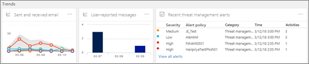

# Vue d’ensemble du tableau de bord de sécurité

Le [sécurité &amp; centre de conformité](go-to-the-securitycompliance-center.md) permet à votre organisation gérer la protection des données et conformité. Début mars 2018, la sécurité &amp; centre de conformité comprend un tableau de bord de la sécurité vous pouvez utiliser pour consulter votre état de Protection des menaces et afficher et agir sur les alertes de sécurité. 
  
Regarder la vidéo pour obtenir une vue d’ensemble, puis lisez cet article pour en savoir plus.
  
> [!VIDEO https://www.microsoft.com/videoplayer/embed/3540b1f8-62d2-47fa-a07d-d7ad76f55b0f?autoplay=false]
  
Selon ce que l’abonnement de votre organisation Office 365 comprend le tableau de bord de sécurité comprend les sections suivantes :
  
- [État de Protection de menace](#threat-protection-status)
    
- [Informations](#insights)
    
- [Informations sur les menaces](#threat-intelligence)
    
- [Tendances](#trends)
    
Pour afficher le tableau de bord de sécurité, dans le [Office 365 sécurité &amp; centre de conformité](go-to-the-securitycompliance-center.md), accédez à **gestion de menace** \> **tableau de bord**.
  
> [!NOTE]
> Vous devez être un administrateur global d’Office 365, un administrateur de sécurité ou un lecteur de sécurité pour afficher le tableau de bord de sécurité. Voir [les autorisations de sécurité Office 365 &amp; centre de conformité](permissions-in-the-security-and-compliance-center.md). 
  
## État de Protection de menace

Dans le coin supérieur gauche du tableau de bord de sécurité est un widget Threat Protection état montrant l’efficacité de protection de menace. Ce widget indique un coup de œil les menaces combien ont été bloqués par [Office 365 Exchange Online Protection](anti-spam-protection.md) et [Contre les menaces avancées Office 365](office-365-atp.md) (si configuré) au cours des sept derniers jours. Ce widget indique également le nombre de messages électroniques identifié comme mal classés et signalés à l’aide de l’option [utiliser le complément de Message de rapport](https://support.office.com/article/b5caa9f1-cdf3-4443-af8c-ff724ea719d2). Passez en revue votre anti-spam, contre les programmes malveillants et des stratégies anti-hameçonnage pour améliorer votre configuration.
  

  
En outre, les rapports de programmes malveillants peuvent servir pour effectuer le suivi des tendances récents du contenu malveillant destinés à votre organisation. Cliquez sur une vignette pour afficher plus d’informations dans le rapport.
  
## Connaissances

Insights surface non seulement les principaux problèmes, que vous devez consulter, elles incluent également des recommandations et les actions à prendre en compte. Par exemple, vous pouvez voir que les messages électroniques d’hameçonnage sont remis, car certains utilisateurs ont désactivé les options de courrier indésirable. Pour plus d’informations sur le fonctionnement de détails, consultez la rubrique [des rapports et des vues d’ensemble de sécurité Office 365 &amp; centre de conformité](reports-and-insights-in-security-and-compliance.md).
  
## Informations sur les menaces

Si votre organisation dispose des [Informations sur les menaces Office 365](office-365-ti.md), votre tableau de bord de sécurité comprend une section **Sur les menaces** qui inclut des outils avancés. L’équipe de sécurité de votre organisation permet les informations de cette section comprendre les nouvelles campagnes, d’étudier les menaces et de gérer les incidents. 
  

  
> [!TIP]
> Menaces d’Office 365 est inclus avec Office 365 entreprise E5 ; Toutefois, si votre organisation utilise un autre abonnement Office 365 pour entreprises, les menaces Office 365 peut être acheté comme module complémentaire. Pour plus d’informations, voir [Menaces Office 365](office-365-ti.md). 
  
## Tendances

Au bas du tableau de bord de sécurité est une section **tendances** , qui résume les tendances de flux de messagerie pour votre organisation. Rapports fournissent des informations sur la messagerie classé comme du courrier indésirable, les logiciels malveillants, les tentatives de hameçonnage et messagerie électronique. Cliquez sur une vignette pour afficher des informations plus détaillées dans le rapport. 
  

  
Et, si l’abonnement à Office 365 de votre organisation comprend des [Menaces Office 365](office-365-ti.md), vous devez également un rapport **récent gestion des alertes** dans cette section qui permet à votre équipe de sécurité pour afficher et agir sur haute priorité alertes de sécurité. 
  
## Voir aussi

[Afficher les rapports de sécurité de messagerie de la sécurité &amp; centre de conformité](view-email-security-reports.md)
  
[Afficher les rapports de Protection de menace avancées d’Office 365](view-reports-for-atp.md)
  
[Protection avancée contre les menaces dans Office 365](office-365-atp.md)
  
[Intelligence des menaces d’Office 365](office-365-ti.md)
  

