# Vue d’ensemble des étiquettes de niveau de confidentialité

Pour mener à bien leur travail, les membres de votre organisation doivent collaborer avec d’autres personnes au sein de l’organisation et en dehors de celle-ci. Cela signifie que le contenu n’est plus protégé par un pare-feu : il est en itinérance partout, sur les appareils, applications et services. Dans ce cas, vous devez sécuriser et protéger l’itinérance, tout en respectant les stratégies métier et de conformité de votre organisation.

Avec les étiquettes de sensibilité, vous pouvez classer et protéger le contenu sensible, tout en vous assurant que la productivité et la possibilité de collaboration des membres de votre organisation ne sont pas altérées.

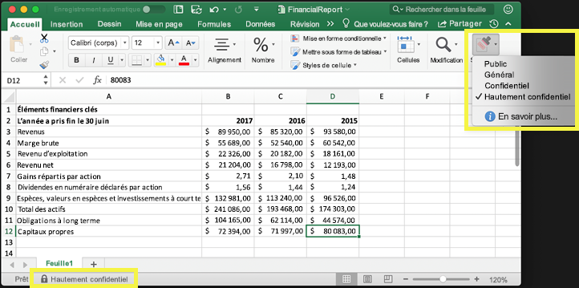

Vous pouvez utiliser les étiquettes de niveau de confidentialité aux fins suivantes :
  
- **Appliquer des paramètres de protection tels que le chiffrement ou des filigranes sur le contenu étiqueté.** Par exemple, vos utilisateurs peuvent appliquer une étiquette Confidentiel à un document ou un message électronique, et cette étiquette peut chiffrer le contenu et appliquer un filigrane Confidentiel.    

- **Protéger le contenu dans les applications Office sur vos différents appareils et plateformes.** Les étiquettes de niveau de confidentialité fonctionnent dans les applications Office sur Windows, Mac, iOS et Android. La prise en charge pour les applications web Office sera bientôt disponible.
    
- **Empêcher le contenu sensible de sortir de votre organisation sur des appareils exécutant Windows**, à l’aide de la protection de point de terminaison (Endpoint Protection) dans Microsoft Intune. Après l’application d’une étiquette de niveau de confidentialité à du contenu qui se trouve sur un appareil Windows, Endpoint Protection peut empêcher de copier le contenu vers une application tierce, comme Twitter ou Gmail, ou de le copier sur un périphérique de stockage amovible, comme un lecteur USB.

- **Protéger le contenu dans les services tiers et les applications tierces** à l’aide de Microsoft Cloud App Security. Avec Cloud App Security (CAS), vous pouvez détecter, classer, étiqueter et protéger le contenu dans les services tiers et applications tierces, comme SalesForce, Box ou Dropbox, même si l’application tierce ou le service tiers ne lit pas ou ne prend pas en charge les étiquettes de niveau de confidentialité.

- **Étendre les étiquettes de niveau de confidentialité à des applications et services tiers.** Avec le kit de développement logiciel (SDK) Microsoft Information Protection, les applications tierces sur Windows, Mac et Linux peuvent lire les étiquettes de niveau de confidentialité et appliquer les paramètres de protection. La prise en charge pour les applications sur iOS et Android sera bientôt disponible.

- **Classer le contenu sans utiliser les paramètres de protection.** Vous pouvez également affecter une classification au contenu (par exemple, un autocollant) qui continue de s’afficher en itinérance au fur et à mesure qu’il est utilisé et partagé. Vous pouvez utiliser cette classification pour générer des rapports d’utilisation et consulter les données d’activité liées au contenu sensible. En fonction de ces informations, vous pouvez toujours choisir ultérieurement d’appliquer les paramètres de protection.
    
Dans tous ces cas, les étiquettes de niveau de confidentialité dans Office 365 vous aident à entreprendre les bonnes actions sur le contenu approprié. Grâce aux étiquettes de niveau de confidentialité, vous pouvez classer les données au sein de votre organisation et appliquer des paramètres de protection en fonction de cette classification.
  
Pour créer des étiquettes de sensibilité, vous devez accéder au Centre de conformité Microsoft 365, au Centre de sécurité Microsoft 365 ou au Centre de sécurité et conformité Office 365. Ces étiquettes peuvent être utilisées par Azure Information Protection, les applications Office et les services Office 365.

Si vous êtes client d’Azure Information Protection, vous pouvez utiliser vos étiquettes Azure Information Protection dans les autres centres d’administration. Celles-ci seront synchronisées avec le portail Azure si vous choisissez d’effectuer une configuration supplémentaire ou avancée. **Les étiquettes Azure Information Protection et les étiquettes de sensibilité Office 365 sont entièrement compatibles entre elles.** Cela signifie, par exemple, que si vous avez du contenu étiqueté par Azure Information Protection, vous n’avez pas besoin de reclassifier ou de ré-étiqueter votre contenu.

## Qu’est-ce qu’une étiquette de niveau de confidentialité ?

Lorsque vous affectez une étiquette de niveau de confidentialité à un document ou à un message électronique, elle agit tout simplement comme une balise ayant les caractéristiques suivantes :

- **Personnalisable.** Vous pouvez créer des catégories pour les différents niveaux de sensibilité du contenu dans votre organisation, comme Personnel, Public, Général, Confidentiel ou Hautement confidentiel.

- **Texte en clair.** L’étiquette apparaissant sous la forme de texte en clair, elle est disponible pour les services tiers et les applications tierces afin d’appliquer des actions de protection au contenu étiqueté.

- **Permanente.** Une fois qu’une étiquette de niveau de confidentialité a été appliquée à du contenu, elle continue de s’afficher dans les métadonnées de cet e-mail ou de ce document. Cela signifie que l’étiquette se déplace en itinérance avec le contenu, y compris les paramètres de protection, et devient la base de l’application des stratégies.

Dans les applications Office, une étiquette de niveau de confidentialité apparaît simplement sous la forme d’une balise sur un message électronique ou un document.

Une seule étiquette de niveau de confidentialité peut être affectée à chaque élément de contenu. Toutefois, un élément peut disposer d’une étiquette de niveau de confidentialité et d’une [étiquette de rétention](labels.md).

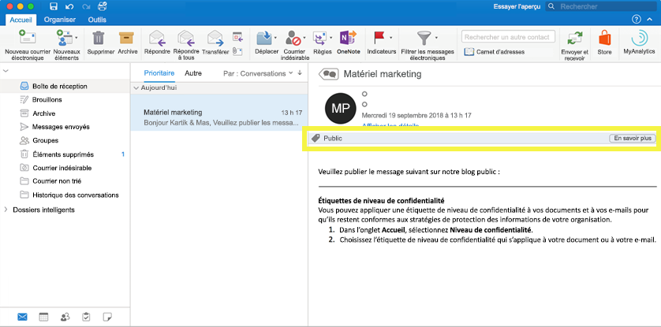

## Fonction des étiquettes de niveau de confidentialité

Une fois qu’une étiquette de niveau de confidentialité est appliquée à un e-mail ou un document, les paramètres de protection relatifs à cette étiquette sont appliqués au contenu. Avec une étiquette de niveau de confidentialité, vous pouvez effectuer les actions suivantes :

- **Chiffrer** des e-mails uniquement, ou des e-mails et des documents. Vous pouvez déterminer quels utilisateurs ou groupes sont autorisés à effectuer telle ou telle action, et pendant combien de temps. Par exemple, vous pouvez choisir d’autoriser les utilisateurs dans un domaine spécifique en dehors de votre organisation à passer en revue le contenu pendant 7 jours uniquement une fois que le contenu est étiqueté. Pour plus d’informations, reportez-vous à l’article [Restriction de l’accès au contenu à l’aide du chiffrement dans les étiquettes de sensibilité](encryption-sensitivity-labels.md).

- **Marquer le contenu** en ajoutant des en-têtes, des pieds de page ou des filigranes personnalisés à des e-mails ou à des documents auxquels l’étiquette a été appliquée. Notez que les filigranes sont appliqués uniquement aux documents, et non aux e-mails, et qu’ils sont limités à 255 caractères. Quant aux en-têtes et aux pieds de page, ils sont limités à 1 024 caractères (sauf dans Excel, où ils sont limités à 255 caractères, en fonction de la présence d’autres en-têtes ou pieds de page dans le document ainsi que d’autres facteurs).

    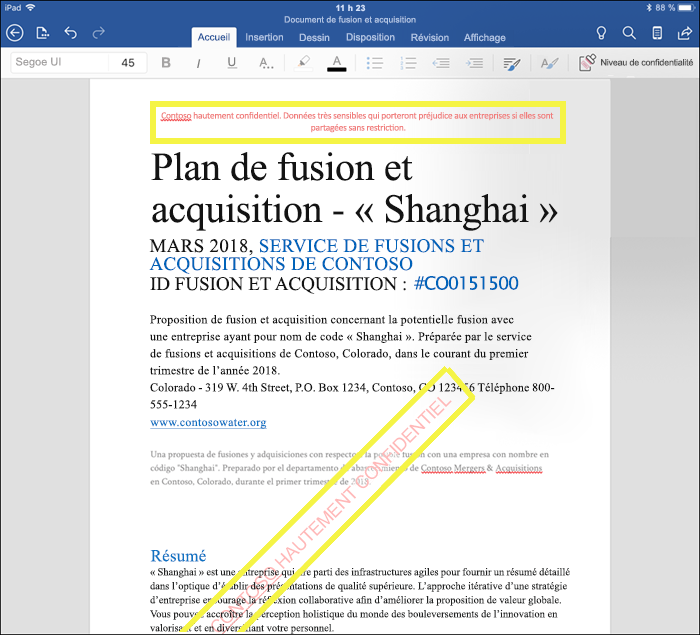

- 
  **Éviter la perte de données** en activant la protection de point de terminaison dans Intune. Si du contenu sensible est téléchargé, vous pouvez empêcher la perte de données sur les appareils Windows. Par exemple, vous ne pouvez pas copier de contenu étiqueté dans Dropbox, Gmail ou un lecteur USB. Avant que les étiquettes de niveau de confidentialité puissent utiliser la protection des informations Windows, vous devez d’abord créer une stratégie de protection des applications dans le portail Azure. Pour plus d’informations, reportez-vous à l’article relatif à la manière dont [la protection des informations Windows protège les fichiers avec une étiquette de niveau de confidentialité](https://docs.microsoft.com/fr-FR/windows/security/information-protection/windows-information-protection/how-wip-works-with-labels?branch=vsts17546553).

- **Appliquer automatiquement l’étiquette au contenu qui contient des informations sensibles.** Vous pouvez choisir quels types d’informations sensibles vous souhaitez étiqueter et pouvez appliquer l’étiquette automatiquement, ou vous pouvez inviter les utilisateurs à appliquer l’étiquette que vous recommandez. si vous  recommandez une étiquette, l’invitation affiche le texte souhaité. Pour plus d’informations, voir[Appliquer automatiquement une étiquette sensibilité au contenu](apply_sensitivity_label_automatically.md).

    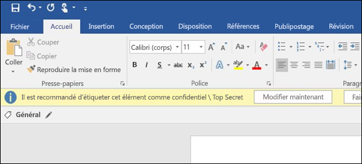

Toutes ces options sont disponibles lorsque vous créez une étiquette de sensibilité.

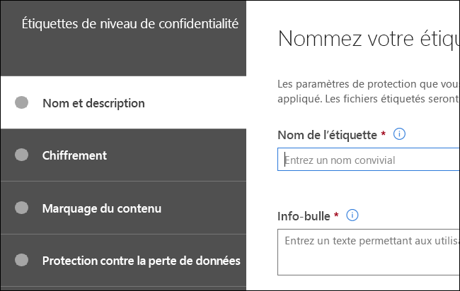

### Priorité des étiquettes (l’ordre est important)

Lorsque vous créez vos étiquettes de sensibilité, elles apparaissent dans une liste située sous l’onglet **Sensibilité** de la page **Étiquettes**. Dans cette liste, l’ordre des étiquettes est important car il reflète leur priorité. Vous souhaitez que votre étiquette de sensibilité la plus restrictive, comme l’étiquette Hautement confidentiel, apparaisse en **bas** de la liste, et que la moins restrictive, telle que l’étiquette Public, apparaisse en **haut**.

Une seule étiquette de niveau de confidentialité peut être appliquée à un document ou un e-mail. Si vos utilisateurs doivent fournir une justification pour modifier le niveau de classification d’une étiquette, l’ordre de cette liste détermine quelle est la classification de niveau inférieur.

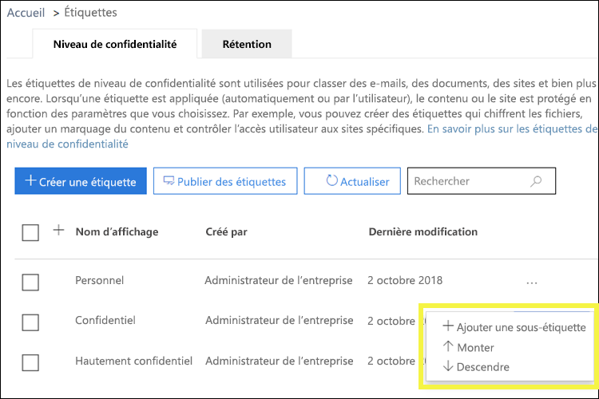

### Sous-étiquettes (regroupement d’étiquettes)

Avec les sous-étiquettes, vous pouvez regrouper une ou plusieurs étiquettes sous une étiquette parent que les utilisateurs pourront voir dans une application Office. Par exemple, sous Confidentiel, votre organisation peut utiliser plusieurs étiquettes différentes pour certains types de cette classification. Dans cet exemple, l’étiquette parent Confidentiel est tout simplement une étiquette de texte sans aucun paramètre de protection. Comme elle comporte des sous-étiquettes, elle ne peut pas être appliquée au contenu. Les utilisateurs doivent d’abord choisir Confidentiel pour afficher les sous-étiquettes, puis choisir une sous-étiquette à appliquer au contenu.

Les sous-étiquettes sont simplement un moyen de présenter des étiquettes à des utilisateurs dans des groupes logiques. Les sous-étiquettes n’héritent pas des paramètres de leur étiquette parent. Les sous-étiquettes peuvent être appliquées au contenu, pas les étiquettes parents.

(De même, ne choisissez pas une étiquette parent comme étiquette par défaut [voir la section suivante], ne configurez pas non plus une étiquette parent pour l’appliquer automatiquement ou la recommander, car elle ne sera pas appliquée au contenu des applications Office qui utilisent le client d’étiquetage unifié Azure Information Protection.)

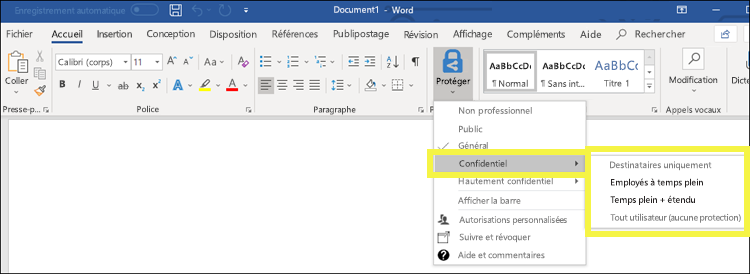

### Modification ou suppression d’une étiquette de niveau de confidentialité

Si vous supprimez une étiquette de sensibilité, celle-ci n’est pas supprimée du contenu et les paramètres de protection restent appliqués au contenu.

Si vous modifiez une étiquette de sensibilité, la version de celle-ci qui était appliquée au contenu reste appliquée.

## Fonction des stratégies d’étiquette

Après avoir créé des étiquettes de niveau de confidentialité, vous devez les publier afin de les rendre disponibles auprès des membres de votre organisation, qui peuvent ensuite les appliquer au contenu. Contrairement aux étiquettes de rétention, qui sont publiées à des emplacements comme des boîtes aux lettres Exchange, les étiquettes de niveau de confidentialité sont publiées pour des utilisateurs ou des groupes. Les étiquettes de niveau de confidentialité apparaissent ensuite dans les applications Office pour ces utilisateurs et groupes.

Avec une stratégie d’étiquette, vous pouvez effectuer les actions suivantes :

- **Sélectionner les utilisateurs et les groupes qui voient les étiquettes.** Les étiquettes peuvent être publiées dans n’importe quel groupe de sécurité à extension messagerie, groupe de distribution, groupe Office 365 ou groupe de distribution dynamique.

- **Appliquer une étiquette par défaut** à tous les nouveaux documents et e-mails créés par les utilisateurs et les groupes inclus dans la stratégie d’étiquette. Cette étiquette par défaut définit un niveau de base des paramètres de protection à appliquer à l’ensemble de votre contenu.

- **Demander une justification en cas de modification d’une étiquette.** Si le contenu est marqué comme Confidentiel et si un utilisateur souhaite supprimer cette étiquette ou la remplacer par une classification de niveau inférieur, comme Public, vous pouvez exiger que l’utilisateur fournisse une justification lors de l’exécution de cette action. Ces justifications seront disponibles pour révision de l’administrateur. Nous travaillons actuellement sur un rapport où les administrateurs peuvent consulter les justifications des utilisateurs.

    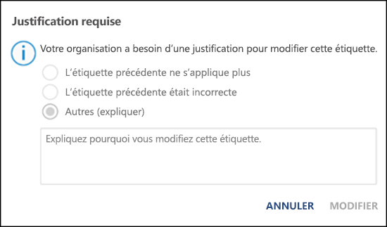

- **Exiger que les utilisateurs d’appliquer une étiquette à leur messagerie et leurs documents. ** Si vous souhaitez tout contenu d’un utilisateur reste étiqueté, vous pouvez exiger qu’une étiquette soit appliquée à tous leurs documents enregistrés et envoyer des messages électroniques. L’étiquette peut être affectée manuellement par l’utilisateur, automatiquement suite à une condition ou affectée par défaut (l’option étiquette par défaut décrite ci-dessus). Voici l’invite qui apparaît dans Outlook, lorsqu’un utilisateur est requis pour attribuer une étiquette.

    > [!NOTE]
    > La capacité à appliquer automatiquement des étiquettes nécessite un abonnement Azure Information Protection. Pour utiliser cette fonctionnalité, vous devez télécharger et installer le [client Azure Information Protection](https://www.microsoft.com/en-us/download/details.aspx?id=53018)ou la version ultérieure[client étiquetage unifié Azure Information Protection](https://docs.microsoft.com/fr-FR/azure/information-protection/rms-client/install-unifiedlabelingclient-app). Nous travaillons à la prise en charge native pour cette fonctionnalité dans les applications Office, afin qu’elle n’exige pas que le client Azure Information Protection unifie la création d’étiquettes. Par ailleurs, le client de création d’étiquettes unifié ne s’exécute que sur Windows, afin que cette fonctionnalité ne soit pas encore prise en charge sur Mac, iOS et Android.

    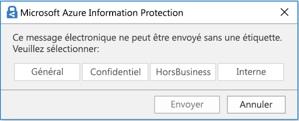

- **Fournir un lien d’aide vers une page d’aide personnalisée.** Si vos utilisateurs ne sont pas sûrs de savoir ce que signifient vos étiquettes de niveau de confidentialité ou comment elles doivent être utilisées, vous pouvez fournir une URL de type En savoir plus, qui apparaît en bas du menu d’étiquette de niveau de confidentialité dans les applications Office.

    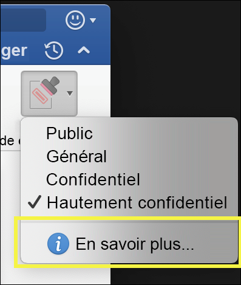

Après avoir créé une stratégie d’étiquette et affecté des étiquettes de niveau de confidentialité aux utilisateurs et aux groupes, ces personnes peuvent voir ces étiquettes disponibles dans les applications Office au bout d’une heure, voire moins.

## Prise en main

La prise en main des étiquettes de niveau de confidentialité est un processus rapide :

1. **Définir les étiquettes.** Tout d’abord, établissez la taxonomie définissant les différents niveaux de contenu sensible. Vous devez utiliser des noms ou des termes communs qui apportent du sens. Par exemple, vous pouvez commencer par des étiquettes comme Personnel, Public, Général, Confidentiel et Hautement confidentiel. Vous pouvez utiliser des sous-étiquettes afin de regrouper les étiquettes similaires par catégorie. Par ailleurs, lorsque vous créez une étiquette, une info-bulle est requise et apparaît dans les applications Office lorsqu’un utilisateur pointe sur une option d’étiquette sur le ruban.

1. **Définir la fonction de chaque étiquette.** Ensuite, configurez les paramètres de protection à associer à chaque étiquette. Par exemple, le contenu ayant un niveau de confidentialité inférieur (étiquette « Général ») peut porter simplement un en-tête ou un pied de page, tandis que le contenu d’un niveau de confidentialité supérieur (étiquette « Confidentiel ») peut contenir un filigrane, un chiffrement ou la protection des informations Windows, pour s’assurer que seuls les utilisateurs disposant des privilèges requis peuvent y accéder.
 
1. **Définir qui peut accéder aux étiquettes.** Une fois que vous avez défini les étiquettes de votre organisation, publiez-les dans une stratégie d’étiquette contrôlant quels utilisateurs et quels groupes voient ces étiquettes. Une même étiquette est réutilisable : vous la définissez une seule fois, puis vous pouvez l’inclure dans plusieurs stratégies d’étiquette affectées à différents utilisateurs. Toutefois, pour affecter une étiquette au contenu, vous devez d’abord la publier afin qu’elle soit disponible dans les applications Office et dans d’autres services. Si vous commencez tout juste à les utiliser, vous pouvez tester vos étiquettes de niveau de confidentialité pilotes en les affectant seulement à quelques personnes.

Voici le flux de base des actions de l’administrateur, de l’utilisateur et de l’application Office lié au fonctionnement des étiquettes de niveau de confidentialité.

## Où apparaissent les étiquettes de niveau de confidentialité

Les étiquettes de niveau de confidentialité apparaissent dans l’interface utilisateur des applications Office. Pour afficher la disponibilité actuelle pour des applications et plateformes spécifiques, reportez-vous à la section **[Où cette fonctionnalité est-elle disponible aujourd’hui ?](https://support.office.com/fr-FR/article/apply-sensitivity-labels-to-your-documents-and-email-within-office-2f96e7cd-d5a4-403b-8bd7-4cc636bae0f9?ad=US&ui=en-US&rs=en-US#bkmk_whereavailable)**

### Applications Office sur Windows

Dans les applications Office sur les appareils exécutant Windows, les étiquettes de niveau de confidentialité apparaissent sur le bouton **Niveau de confidentialité** dans l’onglet **Accueil** du ruban. L’étiquette appliquée apparaît également dans la barre d’état en bas de la fenêtre.

La prise en charge native des étiquettes de niveau de confidentialité sera bientôt disponible dans les applications Office sur Windows.

Si vous êtes un client Azure Information Protection existant, vous pouvez déployer le client d’étiquetage unifié Azure Information Protection, qui prend en charge les étiquettes de niveau de confidentialité. Pour plus d’informations sur le téléchargement du client, reportez-vous à [Client d’étiquetage unifié Azure Information Protection : historique des versions](https://docs.microsoft.com/fr-FR/azure/information-protection/rms-client/unifiedlabelingclient-version-release-history). Nous travaillons actuellement sur la prise en charge native des étiquettes de niveau de confidentialité dans les applications Office sur Windows, afin que le client d’étiquetage unifié Azure Information Protection ne soit plus nécessaire.

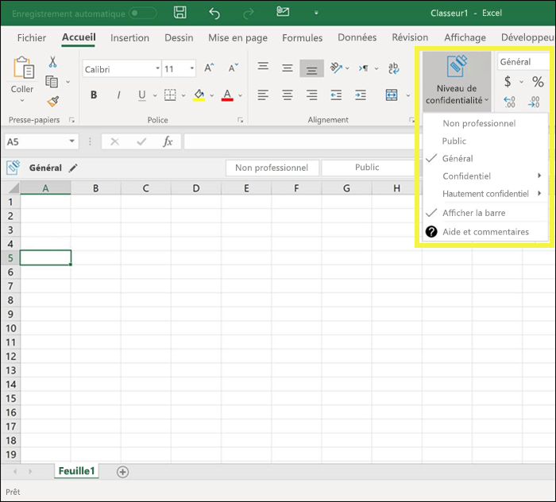

### Applications Office sur Mac

Dans les applications Office sur les appareils Mac, les étiquettes de niveau de confidentialité apparaissent sur le bouton **Niveau de confidentialité** dans l’onglet **Accueil** du ruban. L’étiquette appliquée apparaît également dans la barre d’état en bas de la fenêtre.

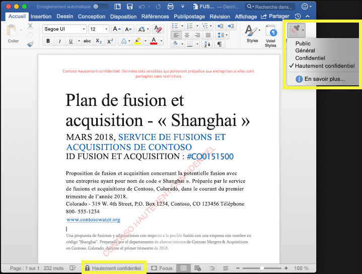

### Applications Office sur iOS

Dans les applications Office sur les appareils iOS, les étiquettes de niveau de confidentialité apparaissent sur le bouton **Niveau de confidentialité** dans l’onglet **Accueil** du ruban. L’étiquette appliquée apparaît également dans la barre d’état en bas de la fenêtre.

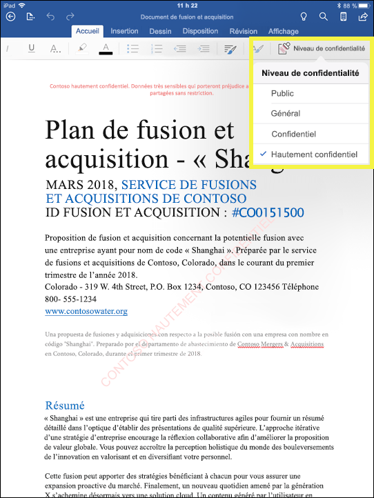

### Applications Office sur Android

Dans les applications Office sur les appareils Android, les étiquettes de niveau de confidentialité apparaissent sur le bouton **Niveau de confidentialité** dans l’onglet **Accueil** du ruban. L’étiquette appliquée apparaît également dans la barre d’état en bas de la fenêtre.

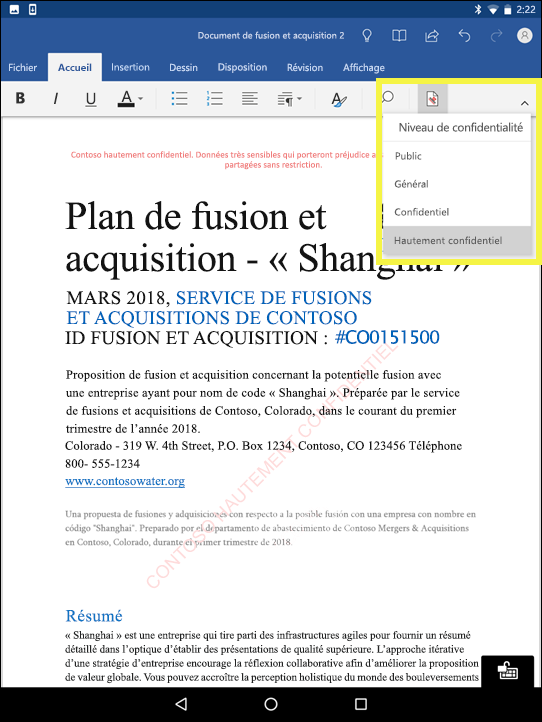

### Plus d’informations sur les étiquettes de niveau de confidentialité dans les applications Office

- 
  [Appliquer des étiquettes de niveau de confidentialité à vos documents et vos e-mails dans Office](https://support.office.com/fr-FR/article/apply-sensitivity-labels-to-your-documents-and-email-within-office-2f96e7cd-d5a4-403b-8bd7-4cc636bae0f9)
- 
  [Problèmes connus lorsque vous appliquez des étiquettes de niveau de confidentialité à vos fichiers Office](https://support.office.com/fr-FR/article/known-issues-when-you-apply-sensitivity-labels-to-your-office-files-b169d687-2bbd-4e21-a440-7da1b2743edc)

## Fonctionnement des étiquettes de niveau de confidentialité avec les étiquettes Azure Information Protection existantes

Les utilisateurs Azure Information Protection peuvent actuellement classer et étiqueter le contenu sur Windows à l’aide du client d’étiquetage unifié Azure Information Protection. Les étiquettes Azure Information Protection existantes fonctionnent parfaitement avec les nouvelles étiquettes de niveau de confidentialité. Cela signifie que vous pouvez procéder comme suit : 

- Conserver vos étiquettes Azure Information Protection existantes sur les documents et les e-mails.
- Conserver la configuration d’étiquettes Azure Information Protection existante.

Si vous utilisez des étiquettes Azure Information Protection, nous vous recommandons d’éviter de créer de nouvelles étiquettes par l’intermédiaire d’autres centres d’administration avant d’avoir terminé votre migration. La [rubrique Migration d’Azure Information Protection](https://docs.microsoft.com/fr-FR/azure/information-protection/configure-policy-migrate-labels) contient des informations importantes et des mises en garde spécifiques. Si vous n’êtes pas encore prêt à migrer vos locataires de production vers des étiquettes de sensibilité, il n’y a pas lieu de s’inquiéter : pour le moment, vos utilisateurs peuvent continuer à utiliser le client Azure Information Protection tandis que les administrateurs peuvent continuer à utiliser le portail Azure pour la gestion.

## Protéger le contenu sur les appareils Windows à l’aide de la protection de point de terminaison dans Microsoft Intune

Lorsque vous créez une étiquette de niveau de confidentialité, vous pouvez indiquer à Windows que les fichiers portant cette étiquette sont sensibles et qu’ils doivent être protégés contre la fuite de données lorsqu’ils sont stockés sur des appareils Windows. Cette option vous assure que le contenu avec cette étiquette peut être partagé ou copié uniquement dans des emplacements approuvés, même lorsqu’il est stocké sur un point de terminaison. En réalité, l’activation de cette option pour une étiquette de niveau de confidentialité indique à Windows qu’il s’agit de données particulièrement critiques qui nécessitent des contraintes d’utilisation supplémentaires.

Lorsque vous activez cette option, Windows peut lire, comprendre et agir sur les étiquettes de niveau de confidentialité dans les documents, et appliquer automatiquement la protection des informations Windows sur le contenu, quelle que soit la manière dont il atteint un appareil Windows géré. Cela permet de protéger les fichiers étiquetés contre les fuites de données accidentelles, avec ou sans chiffrement.

Par exemple, Windows peut comprendre qu’un document Word qui se trouve sur l’ordinateur d’un utilisateur possède une étiquette Confidentiel, et que la protection des informations Windows peut appliquer une stratégie de protection des applications pour empêcher la copie ou le partage des données dans tout emplacement hors travail à partir de cet appareil (par exemple, un compte OneDrive personnel, des comptes de messagerie personnelle, des réseaux sociaux ou des lecteurs USB).

Si un utilisateur tente de charger du contenu étiqueté vers un compte Gmail personnel, il voit le message suivant.

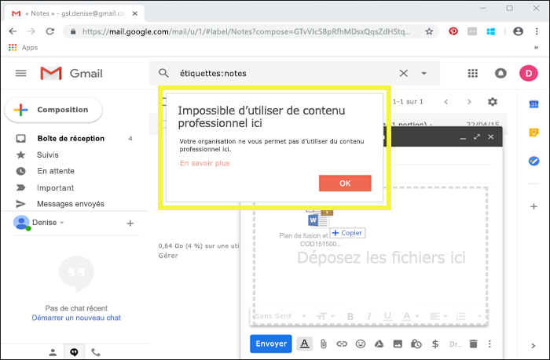

Si un utilisateur tente d’enregistrer du contenu étiqueté sur un lecteur USB, il voit le message suivant.

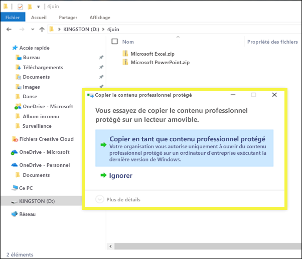

### Conditions préalables importantes

Avant que les étiquettes de niveau de confidentialité puissent utiliser la protection des informations Windows, vous devez d’abord remplir les conditions préalables décrites ici : [La protection des informations Windows protège les fichiers avec une étiquette de niveau de confidentialité](https://docs.microsoft.com/fr-FR/windows/security/information-protection/windows-information-protection/how-wip-works-with-labels?branch=vsts17546553). Cette rubrique décrit les conditions préalables suivantes :

- Vérifiez que vous exécutez Windows 10, version 1809 ou version ultérieure.
- 
  [Configurez le module Protection avancée contre les menaces (ATP) Windows Defender](https://docs.microsoft.com/fr-FR/windows/security/threat-protection/windows-defender-atp/get-started), qui analyse le contenu pour une étiquette et applique la protection des informations Windows correspondante. ATP effectue certaines actions indépendamment de la protection des informations Windows, par exemple, la création de rapports sur les anomalies.
- Créez une stratégie de Protection des informations Windows (WIP) qui s’applique aux appareils de point de terminaison. Vous pouvez effectuer cette opération à partir de l’un des emplacements suivants :
    - 
  [Créer une stratégie de Protection des informations Windows (WIP) avec GPM à l’aide du portail Azure pour Microsoft Intune](https://docs.microsoft.com/fr-FR/windows/security/information-protection/windows-information-protection/create-wip-policy-using-intune-azure)
    - 
  [Créer et déployer une stratégie de Protection des informations Windows (WIP) à l’aide de System Center Configuration Manager](https://docs.microsoft.com/fr-FR/windows/security/information-protection/windows-information-protection/create-wip-policy-using-sccm)

## Protéger le contenu dans les services tiers et les applications tierces à l’aide de Microsoft Cloud App Security

Protéger le contenu dans les services tiers et les applications tierces à l’aide de Cloud App Security (CAS). Avec CAS, vous pouvez détecter, classer, étiqueter et protéger le contenu dans des services tiers et applications tierces, telles que SalesForce, Box ou Dropbox. Par exemple, Dropbox peut-être ne pas comprendre une étiquette de critère de diffusion, mais CAS peut adresser et protéger le contenu étiqueté dans cet emplacement.

Pour plus d’informations, reportez-vous à l’article [Appliquer automatiquement des étiquettes de classification Azure Information Protection](https://docs.microsoft.com/fr-FR/cloud-app-security/use-case-information-protection).

### Conditions préalables importantes

Avant que vos étiquettes de niveau de confidentialité puissent utiliser CAS, vous devez d’abord remplir les conditions préalables décrites ici : [Appliquer automatiquement des étiquettes de classification Azure Information Protection](https://docs.microsoft.com/fr-FR/cloud-app-security/use-case-information-protection). Cette rubrique décrit les conditions préalables suivantes :

- 
  [Activez Cloud App Security et Azure Information Protection](https://docs.microsoft.com/fr-FR/cloud-app-security/azip-integration) pour votre client.
- 
  [Connectez l’application](https://docs.microsoft.com/fr-FR/cloud-app-security/enable-instant-visibility-protection-and-governance-actions-for-your-apps) à Cloud App Security.

## Étendre les étiquettes de niveau de confidentialité à des services tiers et applications tierces à l’aide du SDK Microsoft Information Protection

Étant donné qu’une étiquette de niveau de confidentialité est conservée sous forme de texte en clair dans les métadonnées d’un document, les services tiers et applications tierces peuvent choisir de prendre en charge l’identification et la protection du contenu comprenant une étiquette de ce type. La prise en charge dans les autres applications et services est toujours en développement.

Avec le [kit de développement logiciel (SDK) Microsoft Information Protection](https://docs.microsoft.com/fr-FR/information-protection/develop/), les applications et services tiers peuvent lire et appliquer des étiquettes de niveau de confidentialité ou une certaine protection sur les documents. Le SDK prend en charge les applications sur Windows, Mac et Linux. La prise en charge pour les applications sur iOS et Android sera bientôt disponible.

À l’aide du SDK, vous pouvez étiqueter et protéger le contenu d’une manière qui fonctionne avec les autres services et applications Microsoft Information Protection, comme les applications Office, les services Office 365, le scanneur Azure Information Protection, Microsoft Cloud App Security et plusieurs autres solutions de partenaire. Par exemple, informez-vous sur la [prise en charge des étiquettes de niveau de confidentialité dans Adobe Acrobat](https://techcommunity.microsoft.com/t5/Azure-Information-Protection/Starting-October-use-Adobe-Acrobat-Reader-for-PDFs-protected-by/ba-p/262738).

Pour en savoir plus sur le SDK Microsoft Information Protection, consultez l’[annonce sur le blog Tech Community](https://techcommunity.microsoft.com/t5/Microsoft-Information-Protection/Microsoft-Information-Protection-SDK-Now-Generally-Available/ba-p/263144). Vous pouvez également en savoir plus sur les [solutions de partenaires intégrées avec Microsoft Information Protection](https://techcommunity.microsoft.com/t5/Azure-Information-Protection/Microsoft-Information-Protection-showcases-integrated-partner/ba-p/262657).

## Autorisations

Les membres de votre équipe de conformité appelés à créer des étiquettes de niveau de confidentialité nécessitent des autorisations relatives au Centre de sécurité et conformité. Par défaut, votre administrateur client a accès à cet emplacement et peut accorder l’accès aux responsables de la mise en conformité et à d’autres personnes au Centre de sécurité et conformité, sans leur donner toutes les autorisations d’un administrateur client. Pour ce faire, nous vous recommandons d’accéder à la page **Autorisations** du Centre de sécurité et conformité, de modifier le groupe de rôles **Administrateur de conformité** et d’ajouter des membres à ce groupe de rôles.

Pour plus d’informations, voir [Autoriser des utilisateurs à accéder au Centre de sécurité et conformité Office 365](grant-access-to-the-security-and-compliance-center.md).

Ces autorisations sont requises uniquement pour créer et appliquer des étiquettes et une stratégie d’étiquette. L’application d’une stratégie ne nécessite pas d’accès au contenu.
