# Vue d’ensemble des étiquettes de niveau de confidentialitéOverview of sensitivity labels

Pour mener à bien leur travail, les membres de votre organisation doivent collaborer avec d’autres personnes au sein de l’organisation et en dehors de celle-ci. Cela signifie que le contenu n’est plus protégé par un pare-feu : il est en itinérance partout, sur les appareils, applications et services. Dans ce cas, vous devez sécuriser et protéger l’itinérance, tout en respectant les stratégies métier et de conformité de votre organisation.To get their work done, people in your organization need to collaborate with others both inside and outside the organization. This means that content no longer stays behind a firewall – it roams everywhere, across devices, apps, and services. And when it roams, you want it to do so in a secure, protected way that meets your organization’s business and compliance policies.

Avec les étiquettes de sensibilité, vous pouvez classer et protéger le contenu sensible, tout en vous assurant que la productivité et la possibilité de collaboration des membres de votre organisation ne sont pas altérées.With sensitivity labels, you can classify and help protect your sensitive content, while making sure that your people’s productivity and ability to collaborate isn’t hindered.

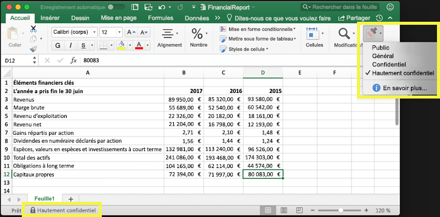

Vous pouvez utiliser les étiquettes de niveau de confidentialité aux fins suivantes :You can use sensitivity labels to:
  
- **Appliquer des paramètres de protection tels que le chiffrement ou des filigranes sur le contenu étiqueté.** Par exemple, vos utilisateurs peuvent appliquer une étiquette Confidentiel à un document ou un message électronique, et cette étiquette peut chiffrer le contenu et appliquer un filigrane Confidentiel.**Enforce protection settings such as encryption or watermarks on labeled content.** For example, your users can apply a Confidential label to a document or email, and that label can encrypt the content and apply a Confidential watermark.    

- **Protéger le contenu dans les applications Office sur vos différents appareils et plateformes.** Les étiquettes de niveau de confidentialité fonctionnent dans les applications Office sur Windows, Mac, iOS et Android. La prise en charge pour les applications web Office sera bientôt disponible.**Protect content in Office apps across different platforms and devices.** Sensitivity labels work in Office apps on Windows, Mac, iOS, and Android. Support for Office web apps is coming soon.
    
- **Empêcher le contenu sensible de sortir de votre organisation sur des appareils exécutant Windows**, à l’aide de la protection de point de terminaison (Endpoint Protection) dans Microsoft Intune. Après l’application d’une étiquette de niveau de confidentialité à du contenu qui se trouve sur un appareil Windows, Endpoint Protection peut empêcher de copier le contenu vers une application tierce, comme Twitter ou Gmail, ou de le copier sur un périphérique de stockage amovible, comme un lecteur USB.**Prevent sensitive content from leaving your organization on devices running Windows**, by using endpoint protection in Microsoft Intune. After a sensitivity label has been applied to content that resides on a Windows device, endpoint protection can prevent that content from being copied to a third-party app, such as Twitter or Gmail, or being copied to removable storage, such as a USB drive.

- **Protéger le contenu dans les services tiers et les applications tierces** à l’aide de Microsoft Cloud App Security.**Protect content in third-party apps and services**, by using Microsoft Cloud App Security. Avec Cloud App Security (CAS), vous pouvez détecter, classer, étiqueter et protéger le contenu dans les services tiers et applications tierces, comme SalesForce, Box ou Dropbox, même si l’application tierce ou le service tiers ne lit pas ou ne prend pas en charge les étiquettes de niveau de confidentialité.With Cloud App Security, you can detect, classify, label, and protect content in third-party apps and services, such as SalesForce, Box, or DropBox, even if the third-party app or service does not read or support sensitivity labels.

- **Étendre les étiquettes de niveau de confidentialité à des applications et services tiers.** Avec le kit de développement logiciel (SDK) Microsoft Information Protection, les applications tierces sur Windows, Mac et Linux peuvent lire les étiquettes de niveau de confidentialité et appliquer les paramètres de protection. La prise en charge pour les applications sur iOS et Android sera bientôt disponible.**Extend sensitivity labels to third-party apps and services.** With the Microsoft Information Protection SDK, third-party apps on Windows, Mac, and Linux can read sensitivity labels and apply protection settings. Support for apps on iOS and Android is coming soon.

- **Classer le contenu sans utiliser les paramètres de protection.** Vous pouvez également affecter une classification au contenu (par exemple, un autocollant) qui continue de s’afficher en itinérance au fur et à mesure qu’il est utilisé et partagé. Vous pouvez utiliser cette classification pour générer des rapports d’utilisation et consulter les données d’activité liées au contenu sensible. En fonction de ces informations, vous pouvez toujours choisir ultérieurement d’appliquer les paramètres de protection.**Classify content without using any protection settings.** You can also simply assign a classification to content (like a sticker) that persists and roams with the content as it's used and shared. You can use this classification to generate usage reports and see activity data for your sensitive content. Based on this information, you can always choose at a later time to apply protection settings.
    
Dans tous ces cas, les étiquettes de niveau de confidentialité dans Office 365 vous aident à entreprendre les bonnes actions sur le contenu approprié. Grâce aux étiquettes de niveau de confidentialité, vous pouvez classer les données au sein de votre organisation et appliquer des paramètres de protection en fonction de cette classification.In all of these cases, sensitivity labels in Office 365 can help you take the right actions on the right content. With sensitivity labels, you can classify data across your organization and enforce protection settings based on that classification.
  
Pour créer des étiquettes de sensibilité, vous devez accéder au Centre de conformité Microsoft 365, au Centre de sécurité Microsoft 365 ou au Centre de sécurité et conformité Office 365. Ces étiquettes peuvent être utilisées par Azure Information Protection, les applications Office et les services Office 365.You create sensitivity labels in the Microsoft 365 compliance center, Microsoft 365 security center, or Office 365 Security & Compliance Center. These sensitivity labels can be used by Azure Information Protection, Office apps, and Office 365 services.

Si vous êtes client d’Azure Information Protection, vous pouvez utiliser vos étiquettes Azure Information Protection dans les autres centres d’administration. Celles-ci seront synchronisées avec le portail Azure si vous choisissez d’effectuer une configuration supplémentaire ou avancée.For Azure Information Protection customers, you can use your Azure Information Protection labels in the other admin centers, and your labels will be synced with the Azure portal in case you choose to perform additional or advanced configuration. **Les étiquettes Azure Information Protection et les étiquettes de sensibilité Office 365 sont entièrement compatibles entre elles.****Azure Information Protection labels and Office 365 sensitivity labels are fully compatible with each other.** Cela signifie, par exemple, que si vous avez du contenu étiqueté par Azure Information Protection, vous n’avez pas besoin de reclassifier ou de ré-étiqueter votre contenu.This means, for example, if you have content labeled by Azure Information Protection, you won’t need to reclassify or relabel your content.

## Qu’est-ce qu’une étiquette de niveau de confidentialité ?What a sensitivity label is

Lorsque vous affectez une étiquette de niveau de confidentialité à un document ou à un message électronique, elle agit tout simplement comme une balise ayant les caractéristiques suivantes :When you assign a sensitivity label to a document or email, it’s simply like a tag that is:

- **Personnalisable.** Vous pouvez créer des catégories pour les différents niveaux de sensibilité du contenu dans votre organisation, comme Personnel, Public, Général, Confidentiel ou Hautement confidentiel.**Customizable.** You can create categories for different levels of sensitive content in your organization, such as Personal, Public, General, Confidential, and Highly Confidential.

- **Texte en clair.** L’étiquette apparaissant sous la forme de texte en clair, elle est disponible pour les services tiers et les applications tierces afin d’appliquer des actions de protection au contenu étiqueté.**Clear text.** Because the label is in clear text, it’s available for third-party apps and services to apply protective actions to labeled content.

- **Permanente.** Une fois qu’une étiquette de niveau de confidentialité a été appliquée à du contenu, elle continue de s’afficher dans les métadonnées de cet e-mail ou de ce document. Cela signifie que l’étiquette se déplace en itinérance avec le contenu, y compris les paramètres de protection, et devient la base de l’application des stratégies.**Persistent.** After a sensitivity label is applied to content, it persists in the metadata of that email or document. This means the label roams with the content, including the protection settings, and becomes the basis for applying and enforcing policies.

Dans les applications Office, une étiquette de niveau de confidentialité apparaît simplement sous la forme d’une balise sur un message électronique ou un document.In the Office apps, a sensitivity label simply appears as a tag on an email or document.

Une seule étiquette de niveau de confidentialité peut être affectée à chaque élément de contenu. Toutefois, un élément peut disposer d’une étiquette de niveau de confidentialité et d’une [étiquette de rétention](labels.md).Each item of content can have a single sensitivity label applied to it. But note that an item can have both a single sensitivity label and a single [retention label](labels.md) applied to it.

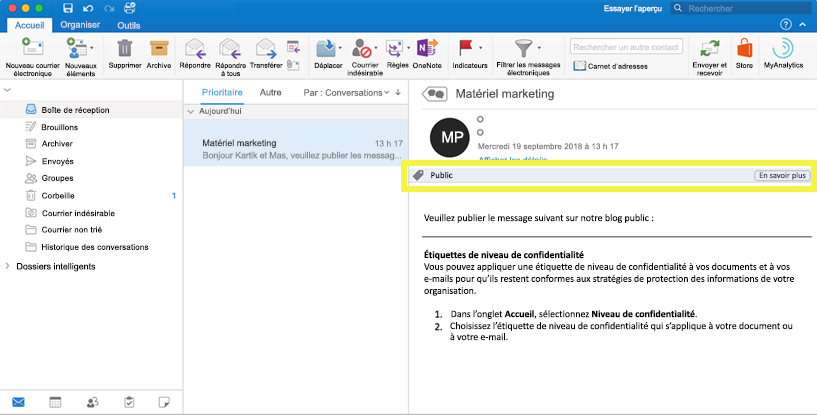

## Fonction des étiquettes de niveau de confidentialitéWhat sensitivity labels can do

Une fois qu’une étiquette de niveau de confidentialité est appliquée à un e-mail ou un document, les paramètres de protection relatifs à cette étiquette sont appliqués au contenu. Avec une étiquette de niveau de confidentialité, vous pouvez effectuer les actions suivantes :After a sensitivity label is applied to an email or document, the protection settings for that label are enforced on the content. With a sensitivity label, you can:

- **Chiffrer** des e-mails uniquement, ou des e-mails et des documents. Vous pouvez déterminer quels utilisateurs ou groupes sont autorisés à effectuer telle ou telle action, et pendant combien de temps. Par exemple, vous pouvez choisir d’autoriser les utilisateurs dans un domaine spécifique en dehors de votre organisation à passer en revue le contenu pendant 7 jours uniquement une fois que le contenu est étiqueté. Pour plus d’informations, reportez-vous à l’article [Restriction de l’accès au contenu à l’aide du chiffrement dans les étiquettes de sensibilité](encryption-sensitivity-labels.md).**Encrypt** email only or both email and documents. You can choose which users or group have permissions to perform which actions and for how long. For example, you can choose to allow users in a specific domain outside your organization to have permissions to review the content for only 7 days after the content is labeled. For more information, see [Restrict access to content by using encryption in sensitivity labels](encryption-sensitivity-labels.md).

- **Marquer le contenu** en ajoutant des en-têtes, des pieds de page ou des filigranes personnalisés à des e-mails ou à des documents auxquels l’étiquette a été appliquée. Notez que les filigranes sont appliqués uniquement aux documents, et non aux e-mails, et qu’ils sont limités à 255 caractères. Quant aux en-têtes et aux pieds de page, ils sont limités à 1 024 caractères (sauf dans Excel, où ils sont limités à 255 caractères, en fonction de la présence d’autres en-têtes ou pieds de page dans le document ainsi que d’autres facteurs).**Mark the content** by adding custom watermarks, headers, or footers to email or documents that have the label applied. Note that watermarks are applied only to documents, not email, and they're limited to 255 characters. Also, headers and footers are limited to 1024 characters (except in Excel, where they're limited to 255 characters or fewer, depending on whether the document contains other headers or footers and other factors.)

    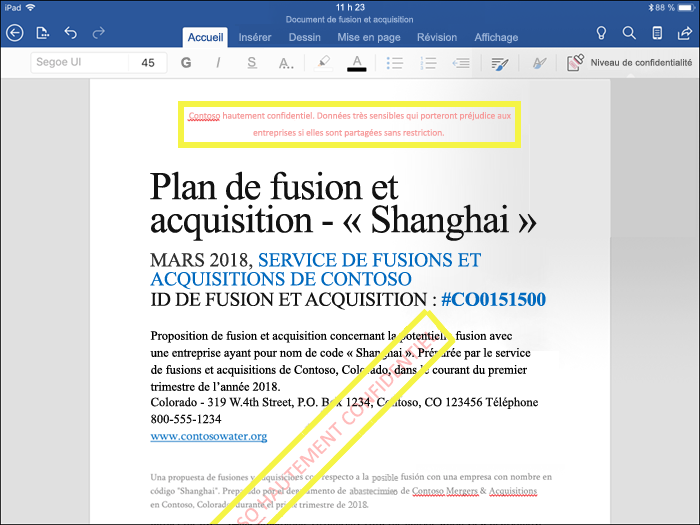

- **Éviter la perte de données** en activant la protection de point de terminaison dans Intune. Si du contenu sensible est téléchargé, vous pouvez empêcher la perte de données sur les appareils Windows. Par exemple, vous ne pouvez pas copier de contenu étiqueté dans Dropbox, Gmail ou un lecteur USB. Avant que les étiquettes de niveau de confidentialité puissent utiliser la protection des informations Windows, vous devez d’abord créer une stratégie de protection des applications dans le portail Azure. Pour plus d’informations, reportez-vous à l’article relatif à la manière dont [la protection des informations Windows protège les fichiers avec une étiquette de niveau de confidentialité](https://docs.microsoft.com/windows/security/information-protection/windows-information-protection/how-wip-works-with-labels?branch=vsts17546553).**Prevent data loss** by turning on endpoint protection in Intune. If sensitive content gets downloaded, you can help prevent the loss of data from Windows devices. For example, you can’t copy labeled content into Dropbox, Gmail, or USB drive. Before your sensitivity labels can use Windows Information Protection (WIP), you first need to create an app protection policy in the Azure portal. For more information, see [How Windows Information Protection protects files with a sensitivity label](https://docs.microsoft.com/windows/security/information-protection/windows-information-protection/how-wip-works-with-labels?branch=vsts17546553).

- **Appliquer automatiquement l’étiquette au contenu qui contient des informations sensibles.** Vous pouvez choisir quels types d’informations sensibles vous souhaitez étiqueter et pouvez appliquer l’étiquette automatiquement, ou vous pouvez inviter les utilisateurs à appliquer l’étiquette que vous recommandez. si vous  recommandez une étiquette, l’invitation affiche le texte souhaité. Pour plus d’informations, voir[Appliquer automatiquement une étiquette sensibilité au contenu](apply-sensitivity-label-automatically.md).**Apply the label automatically to content that contains sensitive information.** You can choose what types of sensitive information that you want labeled, and the label can either be applied automatically, or you can prompt users to apply the label that you recommend. If you recommend a label, the prompt displays whatever text you choose. For more information, see [Apply a sensitivity label to content automatically](apply-sensitivity-label-automatically.md).

    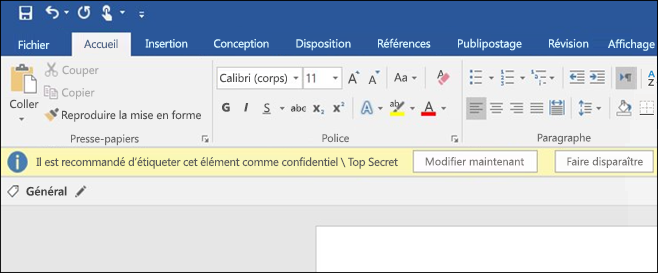

Toutes ces options sont disponibles lorsque vous créez une étiquette de sensibilité.All of these options are available when you create a sensitivity label.

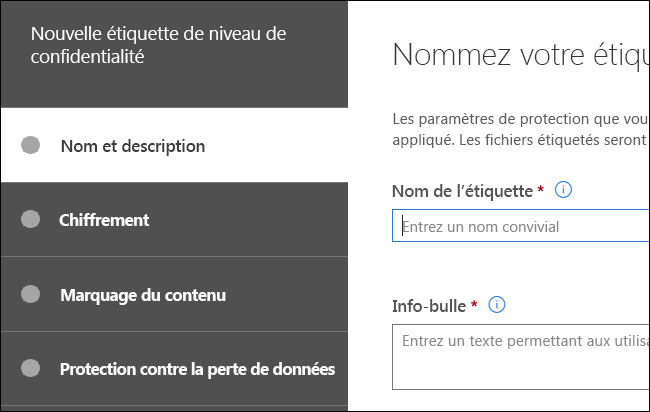

### Priorité des étiquettes (l’ordre est important)Label priority (order matters)

Lorsque vous créez vos étiquettes de sensibilité, elles apparaissent dans une liste située sous l’onglet **Sensibilité** de la page **Étiquettes**.When you create your sensitivity labels, they appear in a list on the **Sensitivity** tab on the **Labels** page. Dans cette liste, l’ordre des étiquettes est important car il reflète leur priorité.In this list, the order of the labels is important because it reflects their priority. Vous souhaitez que votre étiquette de sensibilité la plus restrictive, comme l’étiquette Hautement confidentiel, apparaisse en **bas** de la liste, et que la moins restrictive, telle que l’étiquette Public, apparaisse en **haut**.You want your most restrictive sensitivity label, such as Highly Confidential, to appear at the **bottom** of the list, and your least restrictive sensitivity label, such as Public, to appear at the **top**.

Une seule étiquette de niveau de confidentialité peut être appliquée à un document ou un e-mail. Si vos utilisateurs doivent fournir une justification pour modifier le niveau de classification d’une étiquette, l’ordre de cette liste détermine quelle est la classification de niveau inférieur.A document or email can have only a single sensitivity label applied to it. If you require your users to provide a justification for changing the label to a lower classification, the order of this list determines what's a lower classification.

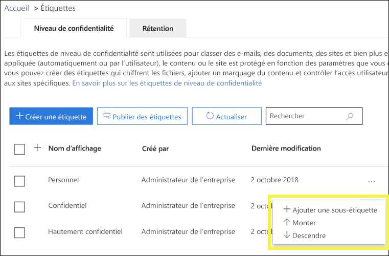

Notez qu’en plus de la priorité des étiquettes, l’ordre des stratégies d’étiquette est également important – consultez [Stratégie de priorité des étiquettes (l’ordre est important)](#label-policy-priority-order-matters).Note that in addition to label priority, the order of the label policies also matters - see [Label policy priority (order matters)](#label-policy-priority-order-matters).

### Sous-étiquettes (regroupement d’étiquettes)Sublabels (grouping labels)

Avec les sous-étiquettes, vous pouvez regrouper une ou plusieurs étiquettes sous une étiquette parent que les utilisateurs pourront voir dans une application Office.With sublabels, you can group one or more labels below a parent label that a user sees in an Office app. Par exemple, sous Confidentiel, votre organisation peut utiliser plusieurs étiquettes différentes pour certains types de cette classification.For example, under Confidential, your organization might use several different labels for specific types of that classification. Dans cet exemple, l’étiquette parent Confidentiel est tout simplement une étiquette de texte sans aucun paramètre de protection. Comme elle comporte des sous-étiquettes, elle ne peut pas être appliquée au contenu.In this example, the parent label Confidential is simply a text label with no protection settings, and because it has sublabels, it can’t be applied to content. Les utilisateurs doivent d’abord choisir Confidentiel pour afficher les sous-étiquettes, puis choisir une sous-étiquette à appliquer au contenu.Instead, users must choose Confidential to view the sublabels, and then they can choose a sublabel to apply to content.

Les sous-étiquettes sont simplement un moyen de présenter des étiquettes à des utilisateurs dans des groupes logiques.Sublabels are simply a way to present labels to users in logical groups. Les sous-étiquettes n’héritent pas des paramètres de leur étiquette parent.Sublabels don’t inherit any settings from their parent label. Les sous-étiquettes peuvent être appliquées au contenu, pas les étiquettes parents.Sublabels can be applied to content; parent labels cannot.

(De même, ne choisissez pas une étiquette parent comme étiquette par défaut [voir la section suivante], ne configurez pas non plus une étiquette parent pour l’appliquer automatiquement ou la recommander, car elle ne sera pas appliquée au contenu des applications Office qui utilisent le client d’étiquetage unifié Azure Information Protection.)(Also, you should not choose a parent label as the default label (see next section), or configure a parent label to be auto-applied or recommended, because the parent label won't be applied to content in Office apps that use the Azure Information Protection unified labeling client.)

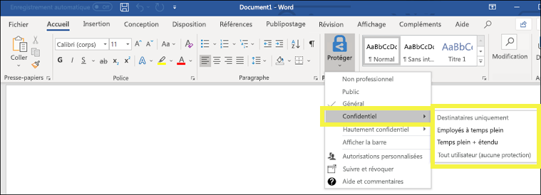

### Modification ou suppression d’une étiquette de niveau de confidentialitéEditing or deleting a sensitivity label

Si vous supprimez une étiquette de sensibilité, celle-ci n’est pas supprimée du contenu et les paramètres de protection restent appliqués au contenu.If you delete a sensitivity label, note that the label is not removed from content, and any protection settings continue to be enforced on the content.

Si vous modifiez une étiquette de sensibilité, la version de celle-ci qui était appliquée au contenu reste appliquée.If you edit a sensitivity label, the version of the label that was applied to content is what’s enforced on that content.

## Fonction des stratégies d’étiquetteWhat label policies can do

Après avoir créé des étiquettes de niveau de confidentialité, vous devez les publier afin de les rendre disponibles auprès des membres de votre organisation, qui peuvent ensuite les appliquer au contenu. Contrairement aux étiquettes de rétention, qui sont publiées à des emplacements comme des boîtes aux lettres Exchange, les étiquettes de niveau de confidentialité sont publiées pour des utilisateurs ou des groupes. Les étiquettes de niveau de confidentialité apparaissent ensuite dans les applications Office pour ces utilisateurs et groupes.After you create your sensitivity labels, you need to publish them, to make them available to people in your organization, who can then apply the labels to content. Unlike retention labels, which are published to locations, such as all Exchange mailboxes, sensitivity labels are published to users or groups. Sensitivity labels then appear in Office apps for those users and groups.

Avec une stratégie d’étiquette, vous pouvez effectuer les actions suivantes :With a label policy, you can:

- **Sélectionner les utilisateurs et les groupes qui voient les étiquettes.** Les étiquettes peuvent être publiées dans n’importe quel groupe de sécurité à extension messagerie, groupe de distribution, groupe Office 365 ou groupe de distribution dynamique.**Choose which users and groups see the labels.** Labels can be published to any email-enabled security group, distribution group, Office 365 group, or dynamic distribution group.

- **Appliquer une étiquette par défaut** à tous les nouveaux documents et e-mails créés par les utilisateurs et les groupes inclus dans la stratégie d’étiquette. Cette étiquette par défaut définit un niveau de base des paramètres de protection à appliquer à l’ensemble de votre contenu.**Apply a default label** to all new documents and email created by the users and groups included in the label policy. This default label can set a base level of protection settings that you want applied to all your content.

- **Demander une justification en cas de modification d’une étiquette.** Si le contenu est marqué comme Confidentiel et si un utilisateur souhaite supprimer cette étiquette ou la remplacer par une classification de niveau inférieur, comme Public, vous pouvez exiger que l’utilisateur fournisse une justification lors de l’exécution de cette action. Ces justifications seront disponibles pour révision de l’administrateur. Nous travaillons actuellement sur un rapport où les administrateurs peuvent consulter les justifications des utilisateurs.**Require a justification for changing a label.** If content is marked Confidential and a user wants to remove that label or replace it with a lower classification, such as a label named Public, you can require that the user provide a justification when performing this action. These justifications will be available for the admin to review. We’re currently working on a report where admins can view the user justifications.

    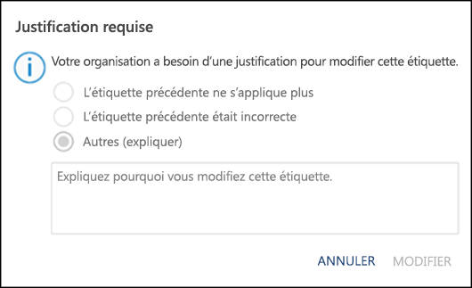

- \*\*Exiger que les utilisateurs d’appliquer une étiquette à leur messagerie et leurs documents. \*\* Si vous souhaitez tout contenu d’un utilisateur reste étiqueté, vous pouvez exiger qu’une étiquette soit appliquée à tous leurs documents enregistrés et envoyer des messages électroniques. L’étiquette peut être affectée manuellement par l’utilisateur, automatiquement suite à une condition ou affectée par défaut (l’option étiquette par défaut décrite ci-dessus). Voici l’invite qui apparaît dans Outlook, lorsqu’un utilisateur est requis pour attribuer une étiquette.**Require users to apply a label to their email and documents.** If you want all of a user's content to be labeled, you can require that a label must be applied to all of their saved documents and sent emails. The label can be assigned manually by the user, automatically as a result of a condition, or be assigned by default (the default label option described above). Here's the prompt shown in Outlook when a user is required to assign a label.

    > [!NOTE]
    > La capacité à appliquer automatiquement des étiquettes nécessite un abonnement Azure Information Protection. Pour utiliser cette fonctionnalité, vous devez télécharger et installer le [client Azure Information Protection](https://www.microsoft.com/download/details.aspx?id=53018)ou la version ultérieure[client étiquetage unifié Azure Information Protection](https://docs.microsoft.com/azure/information-protection/rms-client/install-unifiedlabelingclient-app). Nous travaillons à la prise en charge native pour cette fonctionnalité dans les applications Office, afin qu’elle n’exige pas que le client Azure Information Protection unifie la création d’étiquettes. Par ailleurs, le client de création d’étiquettes unifié ne s’exécute que sur Windows, afin que cette fonctionnalité ne soit pas encore prise en charge sur Mac, iOS et Android.Mandatory labeling requires an Azure Information Protection subscription. To use this feature, you must download and install either the [Azure Information Protection client](https://www.microsoft.com/download/details.aspx?id=53018) or the later [Azure Information Protection unified labeling client](https://docs.microsoft.com/azure/information-protection/rms-client/install-unifiedlabelingclient-app). We're working on native support for this feature in Office apps, so that it won't require the Azure Information Protection client. Also, the client runs only on Windows, so this feature is not yet supported on Mac, iOS, and Android.

    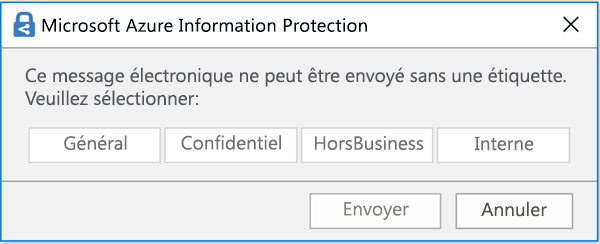

- **Fournir un lien d’aide vers une page d’aide personnalisée.** Si vos utilisateurs ne sont pas sûrs de savoir ce que signifient vos étiquettes de niveau de confidentialité ou comment elles doivent être utilisées, vous pouvez fournir une URL de type En savoir plus, qui apparaît en bas du menu d’étiquette de niveau de confidentialité dans les applications Office.**Provide help link to a custom help page.** If your users aren’t sure what your sensitivity labels mean or how they should be used, you can provide a Learn More URL that appears at the bottom of the Sensitivity label menu in the Office apps.

    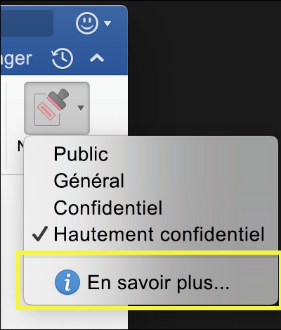

Après avoir créé une stratégie d’étiquette et affecté des étiquettes de niveau de confidentialité aux utilisateurs et aux groupes, ces personnes peuvent voir ces étiquettes disponibles dans les applications Office au bout d’une heure, voire moins.After you create a label policy and assign sensitivity labels to users and groups, those people will see those labels available in the Office apps in an hour or less.

### Stratégie de priorité des étiquettes (l’ordre est important)Label priority (order matters)

Pour rendre vos étiquettes de confidentialité accessibles aux utilisateurs, vous devez les publier dans une stratégie de confidentialité d’étiquette qui apparaît dans une liste sous l’onglet **Stratégies de confidentialité** sur la page **Stratégies d’étiquettes**.You make your sensitivity labels available to users by publishing them in a sensitivity label policy, which appears in a list on the **Sensitivity policies** tab on the **Label policies** page. À l’instar des étiquettes de confidentialité (voir la section ci-dessus[Priorité des étiquettes (l’ordre est important)](#label-priority-order-matters)), l’ordre des stratégies d’étiquette de confidentialité est important, car il reflète leur priorité.Just like sensitivity labels (see the above section [Label priority (order matters)](#label-priority-order-matters)), the order of the sensitivity label policies is important because it reflects their priority. La stratégie d’étiquette dont la priorité est la plus faible est affichée **en haut**, et celle dont la priorité est la plus haute est affichée **en bas**.The label policy with lowest priority is shown at the **top**, and label policy with the highest priority is shown at the **bottom**.

Une stratégie d’étiquette comprend les éléments suivants :A label policy consists of:

- Un groupe d’étiquettes.A set of modules.
- L’étendue de la stratégie d’étiquette, c’est-à-dire les utilisateurs et les groupes inclus dans la stratégie.The scope of the label policy, meaning the users and groups included in the policy.
- Les paramètres de la stratégie d’étiquette décrite ci-dessus (étiquette par défaut, justification, étiquette obligatoire et lien d’aide).The settings of the label policy described above (default label, justification, mandatory label, and help link).

Vous pouvez inclure un utilisateur dans plusieurs stratégies d’étiquette, et l’utilisateur verra toutes les étiquettes de confidentialité de ces stratégies.You can include a user in multiple label policies, and the user will see all of the sensitivity labels from those policies. Toutefois, un utilisateur ne verra les paramètres de stratégie que de la stratégie d’étiquette dont la priorité est la plus élevée.However, a user will see the policy settings from only the label policy with the highest priority.

Si un utilisateur ou un groupe de votre organisation ne voit pas une option dans la stratégie d’étiquette que vous avez prévue (par exemple, une étiquette par défaut ou une étiquette obligatoire), vérifiez l’ordre des stratégies d’étiquette de confidentialité.If a user or group in your organization is not seeing an option in the label policy that you intended, such as a default or mandatory label, check the order of the sensitivity label policies. Pour réorganiser les stratégies d’étiquette, sélectionnez une stratégie d’étiquette de confidentialité > sélectionnez les points de suspension sur la droite > **Descendre** ou **Monter**.To re-order the label policies, select a sensitivity label policy > choose the ellipsis on the right > **Move down** or **Move up**.

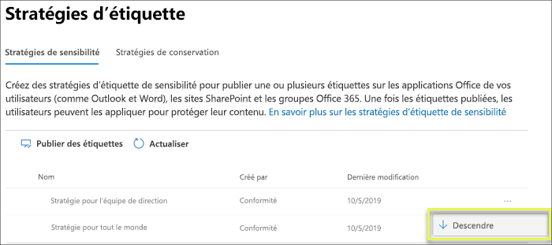

Notez que, bien que la priorité importe pour les stratégies d’étiquette de confidentialité, elle n’importe **pas** pour les stratégies d’étiquette de rétention.Note that while priority matters for sensitivity label policies, it does **not** matter for retention label policies. Comme expliqué dans [Les principes de rétention, ou qui a priorité ?](labels.md#the-principles-of-retention-or-what-takes-precedence), le contenu peut être soumis à plusieurs stratégies de rétention.As explained in [The principles of retention, or what takes precedence?](labels.md#the-principles-of-retention-or-what-takes-precedence), content can be subject to multiple retention policies.

## Prise en mainHow to get started

La prise en main des étiquettes de niveau de confidentialité est un processus rapide :Getting started with sensitivity labels is a quick process:

1. **Définir les étiquettes.** Tout d’abord, établissez la taxonomie définissant les différents niveaux de contenu sensible. Vous devez utiliser des noms ou des termes communs qui apportent du sens. Par exemple, vous pouvez commencer par des étiquettes comme Personnel, Public, Général, Confidentiel et Hautement confidentiel. Vous pouvez utiliser des sous-étiquettes afin de regrouper les étiquettes similaires par catégorie. Par ailleurs, lorsque vous créez une étiquette, une info-bulle est requise et apparaît dans les applications Office lorsqu’un utilisateur pointe sur une option d’étiquette sur le ruban.**Define the labels.** First, you want to establish your taxonomy for defining different levels of sensitive content. You should use common names or terms that make sense to your users. For example, you can start with labels such as Personal, Public, General, Confidential, and Highly Confidential. You can use sublabels to group similar labels by category. Also, when you create a label, a tool tip is required, which appears in the Office apps when a user hovers over a label option on the Ribbon.

1. **Définir la fonction de chaque étiquette.** Ensuite, configurez les paramètres de protection à associer à chaque étiquette. Par exemple, le contenu ayant un niveau de confidentialité inférieur (étiquette « Général ») peut porter simplement un en-tête ou un pied de page, tandis que le contenu d’un niveau de confidentialité supérieur (étiquette « Confidentiel ») peut contenir un filigrane, un chiffrement ou la protection des informations Windows, pour s’assurer que seuls les utilisateurs disposant des privilèges requis peuvent y accéder.**Define what each label can do.** Then, configure the protection settings you want associated with each label. For example, lower sensitivity content (a “General” label) might simply have a header or footer applied to it, while higher sensitivity content (a “Confidential” label) may have a watermark, encryption, and WIP applied to it, to help ensure that only privileged users can access it.
 
1. **Définir qui peut accéder aux étiquettes.** Une fois que vous avez défini les étiquettes de votre organisation, publiez-les dans une stratégie d’étiquette contrôlant quels utilisateurs et quels groupes voient ces étiquettes. Une même étiquette est réutilisable : vous la définissez une seule fois, puis vous pouvez l’inclure dans plusieurs stratégies d’étiquette affectées à différents utilisateurs. Toutefois, pour affecter une étiquette au contenu, vous devez d’abord la publier afin qu’elle soit disponible dans les applications Office et dans d’autres services. Si vous commencez tout juste à les utiliser, vous pouvez tester vos étiquettes de niveau de confidentialité pilotes en les affectant seulement à quelques personnes.**Define who gets the labels.** After you define your organization’s labels, you publish them in a label policy that controls which users and groups see those labels. A single label is reusable – you define it once, and then you can include it in several label policies assigned to different users. But in order for a label to be assigned to content, you must first publish that label so that it’s available in Office apps and other services. When just starting out, you can pilot your sensitivity labels by assigning them to just a few people.

Voici le flux de base des actions de l’administrateur, de l’utilisateur et de l’application Office lié au fonctionnement des étiquettes de niveau de confidentialité.Here’s the basic flow of what the admin, user, and Office app do to make sensitivity labels work.

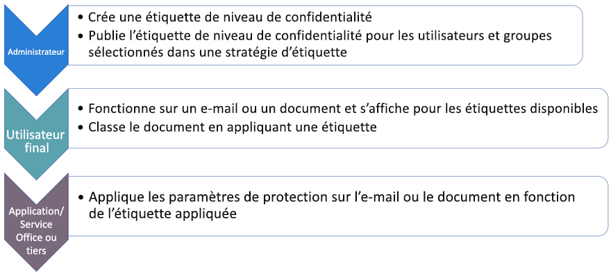

## Où apparaissent les étiquettes de niveau de confidentialitéWhere sensitivity labels can appear

Les étiquettes de niveau de confidentialité apparaissent dans l’interface utilisateur des applications Office. Pour afficher la disponibilité actuelle pour des applications et plateformes spécifiques, reportez-vous à la section **[Où cette fonctionnalité est-elle disponible aujourd’hui ?](https://support.office.com/article/apply-sensitivity-labels-to-your-documents-and-email-within-office-2f96e7cd-d5a4-403b-8bd7-4cc636bae0f9?ad=US&ui=en-US&rs=en-US#bkmk_whereavailable)**Sensitivity labels appear in the UI of Office apps. To view the current availability for specific apps and platforms, see **[Where is the feature available today?](https://support.office.com/article/apply-sensitivity-labels-to-your-documents-and-email-within-office-2f96e7cd-d5a4-403b-8bd7-4cc636bae0f9?ad=US&ui=en-US&rs=en-US#bkmk_whereavailable)**

### Applications Office sur WindowsOffice apps on Windows

Dans les applications Office sur les appareils exécutant Windows, les étiquettes de niveau de confidentialité apparaissent sur le bouton **Niveau de confidentialité** dans l’onglet **Accueil** du ruban. L’étiquette appliquée apparaît également dans la barre d’état en bas de la fenêtre.In Office apps on devices running Windows, sensitivity labels appear on the **Sensitivity** button, on the **Home** tab on the Ribbon. The label applied also appears in the Status bar at the bottom of the window.

La prise en charge native des étiquettes de niveau de confidentialité sera bientôt disponible dans les applications Office sur Windows.Coming soon is native support for sensitivity labels in Office apps on Windows.

Si vous êtes un client Azure Information Protection existant, vous pouvez déployer le client d’étiquetage unifié Azure Information Protection, qui prend en charge les étiquettes de niveau de confidentialité. Pour plus d’informations sur le téléchargement du client, reportez-vous à [Client d’étiquetage unifié Azure Information Protection : historique des versions](https://docs.microsoft.com/azure/information-protection/rms-client/unifiedlabelingclient-version-release-history). Nous travaillons actuellement sur la prise en charge native des étiquettes de niveau de confidentialité dans les applications Office sur Windows, afin que le client d’étiquetage unifié Azure Information Protection ne soit plus nécessaire.If you're an existing Azure Information Protection customer, you can deploy the Azure Information Protection unified labeling client, which supports sensitivity labels. For more information about downloading the client, see [Azure Information Protection unified labeling client: Version release information](https://docs.microsoft.com/azure/information-protection/rms-client/unifiedlabelingclient-version-release-history). We’re currently working on native support for sensitivity labels in Office apps on Windows, so that the Azure Information Protection unified labeling client will no longer be required.

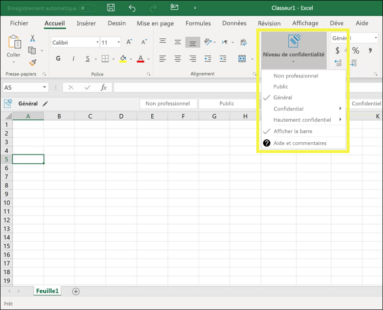

### Applications Office sur MacOffice apps on Mac

Dans les applications Office sur les appareils Mac, les étiquettes de niveau de confidentialité apparaissent sur le bouton **Niveau de confidentialité** dans l’onglet **Accueil** du ruban. L’étiquette appliquée apparaît également dans la barre d’état en bas de la fenêtre.In Office apps on Mac devices, sensitivity labels appear on the **Sensitivity** button, on the **Home** tab on the Ribbon. The label applied also appears in the Status bar at the bottom of the window.

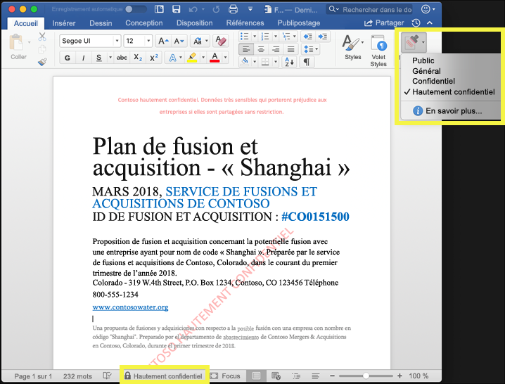

### Applications Office sur iOSOffice apps on iOS

Dans les applications Office sur les appareils iOS, les étiquettes de niveau de confidentialité apparaissent sur le bouton **Niveau de confidentialité** dans l’onglet **Accueil** du ruban. L’étiquette appliquée apparaît également dans la barre d’état en bas de la fenêtre.In Office apps on iOS devices, sensitivity labels appear on the **Sensitivity** button, on the **Home** tab on the Ribbon. The label applied also appears in the Status bar at the bottom of the window.

### Applications Office sur AndroidOffice apps on Android

Dans les applications Office sur les appareils Android, les étiquettes de niveau de confidentialité apparaissent sur le bouton **Niveau de confidentialité** dans l’onglet **Accueil** du ruban. L’étiquette appliquée apparaît également dans la barre d’état en bas de la fenêtre.In Office apps on Android devices, sensitivity labels appear on the **Sensitivity** button, on the **Home** tab on the Ribbon. The label applied also appears in the Status bar at the bottom of the window.

### Plus d’informations sur les étiquettes de niveau de confidentialité dans les applications OfficeMore information on sensitivity labels in Office apps

- [Appliquer des étiquettes de niveau de confidentialité à vos documents et vos e-mails dans OfficeApply sensitivity labels to your documents and email within Office](https://support.office.com/article/apply-sensitivity-labels-to-your-documents-and-email-within-office-2f96e7cd-d5a4-403b-8bd7-4cc636bae0f9)
- [Problèmes connus lorsque vous appliquez des étiquettes de niveau de confidentialité à vos fichiers OfficeKnown issues when you apply sensitivity labels to your Office files](https://support.office.com/article/known-issues-when-you-apply-sensitivity-labels-to-your-office-files-b169d687-2bbd-4e21-a440-7da1b2743edc)

## Fonctionnement des étiquettes de niveau de confidentialité avec les étiquettes Azure Information Protection existantesHow sensitivity labels work with existing Azure Information Protection labels

Les utilisateurs Azure Information Protection peuvent actuellement classer et étiqueter le contenu sur Windows à l’aide du client d’étiquetage unifié Azure Information Protection. Les étiquettes Azure Information Protection existantes fonctionnent parfaitement avec les nouvelles étiquettes de niveau de confidentialité. Cela signifie que vous pouvez procéder comme suit : Azure Information Protection users are currently able to classify and label content on Windows by using the Azure Information Protection unified labeling client. Existing Azure Information Protection labels work seamlessly with new sensitivity labels. This means you can:

- Conserver vos étiquettes Azure Information Protection existantes sur les documents et les e-mails.Keep your existing Azure Information Protection labels on documents and email.
- Conserver la configuration d’étiquettes Azure Information Protection existante.Keep your existing Azure Information Protection label configuration.

Si vous utilisez des étiquettes Azure Information Protection, nous vous recommandons d’éviter de créer de nouvelles étiquettes par l’intermédiaire d’autres centres d’administration avant d’avoir terminé votre migration.If you are using Azure Information Protection labels, for now we recommend that you avoid creating new labels in other admin centers until after you’ve completed your migration. La [rubrique Migration d’Azure Information Protection](https://docs.microsoft.com/azure/information-protection/configure-policy-migrate-labels) contient des informations importantes et des mises en garde spécifiques.The [Azure Information Protection migration topic](https://docs.microsoft.com/azure/information-protection/configure-policy-migrate-labels) has important information and some specific caveats. Si vous n’êtes pas encore prêt à migrer vos locataires de production vers des étiquettes de sensibilité, il n’y a pas lieu de s’inquiéter : pour le moment, vos utilisateurs peuvent continuer à utiliser le client Azure Information Protection tandis que les administrateurs peuvent continuer à utiliser le portail Azure pour la gestion.If you are not yet ready to migrate your production tenants to sensitivity labels, there is no cause for concern: for the moment, your users can continue using the Azure Information Protection client, and admins can continue using the Azure portal for management.

## Protéger le contenu sur les appareils Windows à l’aide de la protection de point de terminaison dans Microsoft IntuneProtect content on Windows devices by using endpoint protection in Microsoft Intune

Lorsque vous créez une étiquette de niveau de confidentialité, vous pouvez indiquer à Windows que les fichiers portant cette étiquette sont sensibles et qu’ils doivent être protégés contre la fuite de données lorsqu’ils sont stockés sur des appareils Windows. Cette option vous assure que le contenu avec cette étiquette peut être partagé ou copié uniquement dans des emplacements approuvés, même lorsqu’il est stocké sur un point de terminaison. En réalité, l’activation de cette option pour une étiquette de niveau de confidentialité indique à Windows qu’il s’agit de données particulièrement critiques qui nécessitent des contraintes d’utilisation supplémentaires.When you create a sensitivity label, you have the option to tell Windows that files with this label are sensitive and need to be protected against data leakage when stored on Windows devices. This option can help ensure that content with this label can be shared or copied only to sanctioned locations, even when it’s stored on an endpoint. In essence, turning on this option for a sensitivity label tells Windows that this is extra critical data that warrants additional usage constraints.

Lorsque vous activez cette option, Windows peut lire, comprendre et agir sur les étiquettes de niveau de confidentialité dans les documents, et appliquer automatiquement la protection des informations Windows sur le contenu, quelle que soit la manière dont il atteint un appareil Windows géré. Cela permet de protéger les fichiers étiquetés contre les fuites de données accidentelles, avec ou sans chiffrement.When you turn on this option, Windows can read, understand, and act on sensitivity labels in documents and automatically apply Windows Information Protection (WIP) on content, no matter how it reaches a managed Windows device. This helps protect labeled files from accidental leakage, with or without applying encryption.

Par exemple, Windows peut comprendre qu’un document Word qui se trouve sur l’ordinateur d’un utilisateur possède une étiquette Confidentiel, et que la protection des informations Windows peut appliquer une stratégie de protection des applications pour empêcher la copie ou le partage des données dans tout emplacement hors travail à partir de cet appareil (par exemple, un compte OneDrive personnel, des comptes de messagerie personnelle, des réseaux sociaux ou des lecteurs USB).For example, Windows can understand that a Word document residing on a user’s machine has a Confidential label applied to it, and WIP can apply an app protection policy to prevent the copying or sharing of the data to any non-work location from that device (such as a personal OneDrive, personal email accounts, social media, or USB drives).

Si un utilisateur tente de charger du contenu étiqueté vers un compte Gmail personnel, il voit le message suivant.If a user attempts to upload labeled content to a personal Gmail account, they see this message.

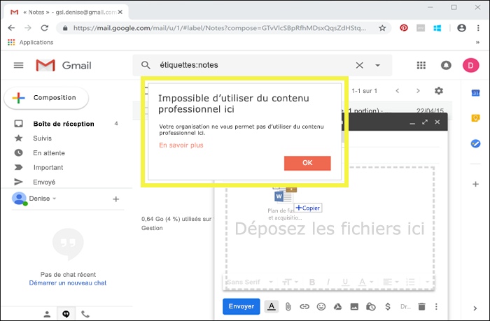

Si un utilisateur tente d’enregistrer du contenu étiqueté sur un lecteur USB, il voit le message suivant.And if a user attempts to save labeled content to a USB drive, they see this message.

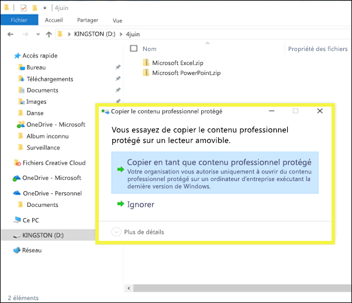

### Conditions préalables importantesImportant prerequisites

Avant que les étiquettes de niveau de confidentialité puissent utiliser la protection des informations Windows, vous devez d’abord remplir les conditions préalables décrites ici : [La protection des informations Windows protège les fichiers avec une étiquette de niveau de confidentialité](https://docs.microsoft.com/windows/security/information-protection/windows-information-protection/how-wip-works-with-labels?branch=vsts17546553). Cette rubrique décrit les conditions préalables suivantes :Before your sensitivity labels can use WIP, you first need to do the prerequisites described here: [How Windows Information Protection protects files with a sensitivity label](https://docs.microsoft.com/windows/security/information-protection/windows-information-protection/how-wip-works-with-labels?branch=vsts17546553). This topic describes the following prerequisites:

- Vérifiez que vous exécutez Windows 10, version 1809 ou version ultérieure.Make sure you're running Windows 10, version 1809 or later.
- [Configurez Microsoft Defender – Protection avancée contre les menaces (Microsoft Defender ATP)](https://docs.microsoft.com/windows/security/threat-protection/) qui analyse le contenu pour rechercher une étiquette et applique la protection des travaux des informations Windows correspondante.[Set up Windows Defender Advanced Threat Protection (WDATP)](https://docs.microsoft.com/windows/security/threat-protection/), which scans content for a label and applies the corresponding WIP protection. ATP performs some actions independently from WIP, such as reporting anomalies. ATP effectue certaines opérations indépendamment de Protection des informations Windows (WIP), comme signaler des anomalies.ATP performs some actions independently from WIP, such as reporting anomalies.
- Créez une stratégie de Protection des informations Windows (WIP) qui s’applique aux appareils de point de terminaison. Vous pouvez effectuer cette opération à partir de l’un des emplacements suivants :Create a Windows Information Protection (WIP) policy that applies to endpoint devices. You can do this in either of these locations:
    - [Créer une stratégie de Protection des informations Windows (WIP) avec GPM à l’aide du portail Azure pour Microsoft IntuneCreate a Windows Information Protection (WIP) policy with MDM using the Azure portal for Microsoft Intune](https://docs.microsoft.com/windows/security/information-protection/windows-information-protection/create-wip-policy-using-intune-azure)
    - [Créer et déployer une stratégie de Protection des informations Windows (WIP) à l’aide de System Center Configuration ManagerCreate and deploy a Windows Information Protection (WIP) policy using System Center Configuration Manager](https://docs.microsoft.com/windows/security/information-protection/windows-information-protection/create-wip-policy-using-sccm)

## Protéger le contenu dans les services tiers et les applications tierces à l’aide de Microsoft Cloud App SecurityProtect content in third-party apps and services by using Microsoft Cloud App Security

Protéger le contenu dans les services tiers et les applications tierces à l’aide de Cloud App Security (CAS).Protect content in third-party apps and services by using Cloud App Security (CAS). Avec CAS, vous pouvez détecter, classer, étiqueter et protéger le contenu dans des services tiers et applications tierces, telles que SalesForce, Box ou Dropbox.With CAS, you can detect, classify, label, and protect content in third-party services and apps, such as SalesForce, Box, or Dropbox. Par exemple, Dropbox peut-être ne pas comprendre une étiquette de critère de diffusion, mais CAS peut adresser et protéger le contenu étiqueté dans cet emplacement.For example, Dropbox might not understand a sensitivity label, but CAS can reach out and protect labeled content in that location.

Pour plus d’informations, reportez-vous à l’article [Appliquer automatiquement des étiquettes de classification Azure Information Protection](https://docs.microsoft.com/cloud-app-security/use-case-information-protection).For more information, see [Automatically apply Azure Information Protection classification labels](https://docs.microsoft.com/cloud-app-security/use-case-information-protection).

### Conditions préalables importantesImportant prerequisites

Avant que vos étiquettes de niveau de confidentialité puissent utiliser CAS, vous devez d’abord remplir les conditions préalables décrites ici : [Appliquer automatiquement des étiquettes de classification Azure Information Protection](https://docs.microsoft.com/cloud-app-security/use-case-information-protection).Before your sensitivity labels can use CAS, you first need to do the prerequisites described here: [Automatically apply Azure Information Protection classification labels](https://docs.microsoft.com/cloud-app-security/use-case-information-protection). Cette rubrique décrit les conditions préalables suivantes :This topic describes the following prerequisites:

- [Activez Cloud App Security et Azure Information Protection](https://docs.microsoft.com/cloud-app-security/azip-integration) pour votre client.[Enable Cloud App Security and Azure Information Protection](https://docs.microsoft.com/cloud-app-security/azip-integration) for your tenant.
- [Connectez l’application](https://docs.microsoft.com/cloud-app-security/enable-instant-visibility-protection-and-governance-actions-for-your-apps) à Cloud App Security.[Connect the app](https://docs.microsoft.com/cloud-app-security/enable-instant-visibility-protection-and-governance-actions-for-your-apps) to Cloud App Security.

## Étendre les étiquettes de niveau de confidentialité à des services tiers et applications tierces à l’aide du SDK Microsoft Information ProtectionExtend sensitivity labels to third-party apps and services by using the Microsoft Information Protection SDK

Étant donné qu’une étiquette de niveau de confidentialité est conservée sous forme de texte en clair dans les métadonnées d’un document, les services tiers et applications tierces peuvent choisir de prendre en charge l’identification et la protection du contenu comprenant une étiquette de ce type. La prise en charge dans les autres applications et services est toujours en développement.Because a sensitivity label is persisted as clear text in the metadata of a document, third-party apps and services can choose to support identifying and protecting content that contains such a label. Support in other apps and services is always expanding.

Avec le [kit de développement logiciel (SDK) Microsoft Information Protection](https://docs.microsoft.com/information-protection/develop/), les applications et services tiers peuvent lire et appliquer des étiquettes de niveau de confidentialité ou une certaine protection sur les documents. Le SDK prend en charge les applications sur Windows, Mac et Linux. La prise en charge pour les applications sur iOS et Android sera bientôt disponible.With the [Microsoft Information Protection SDK](https://docs.microsoft.com/information-protection/develop/), third-party apps and services can read and apply sensitivity labels and protection to documents. The SDK supports apps on Windows, Mac, and Linux. Coming soon is support for apps on iOS and Android.

À l’aide du SDK, vous pouvez étiqueter et protéger le contenu d’une manière qui fonctionne avec les autres services et applications Microsoft Information Protection, comme les applications Office, les services Office 365, le scanneur Azure Information Protection, Microsoft Cloud App Security et plusieurs autres solutions de partenaire. Par exemple, informez-vous sur la [prise en charge des étiquettes de niveau de confidentialité dans Adobe Acrobat](https://techcommunity.microsoft.com/t5/Azure-Information-Protection/Starting-October-use-Adobe-Acrobat-Reader-for-PDFs-protected-by/ba-p/262738).Using the SDK, you can label and protect content in a way that works with other Microsoft Information Protection apps and services, such as Office apps, Office 365 services, the Azure Information Protection scanner, Microsoft Cloud App Security, and several other partner solutions. For example, learn more about [support for sensitivity labels in Adobe Acrobat](https://techcommunity.microsoft.com/t5/Azure-Information-Protection/Starting-October-use-Adobe-Acrobat-Reader-for-PDFs-protected-by/ba-p/262738).

Pour en savoir plus sur le SDK Microsoft Information Protection, consultez l’[annonce sur le blog Tech Community](https://techcommunity.microsoft.com/t5/Microsoft-Information-Protection/Microsoft-Information-Protection-SDK-Now-Generally-Available/ba-p/263144). Vous pouvez également en savoir plus sur les [solutions de partenaires intégrées avec Microsoft Information Protection](https://techcommunity.microsoft.com/t5/Azure-Information-Protection/Microsoft-Information-Protection-showcases-integrated-partner/ba-p/262657).To learn more about the Microsoft Information Protection SDK, see the [announcement on the Tech Community blog](https://techcommunity.microsoft.com/t5/Microsoft-Information-Protection/Microsoft-Information-Protection-SDK-Now-Generally-Available/ba-p/263144). You can also learn about [partner solutions that are integrated with Microsoft Information Protection](https://techcommunity.microsoft.com/t5/Azure-Information-Protection/Microsoft-Information-Protection-showcases-integrated-partner/ba-p/262657).

## AutorisationsPermissions

Les membres de votre équipe de conformité qui créeront des étiquettes de confidentialité ont besoin d’autorisations dans le Centre de conformité Microsoft 365, le Centre de sécurité Microsoft 365 ou le Centre de sécurité et conformité Office 365.Members of your compliance team who will create sensitivity labels need permissions to the Microsoft 365 compliance center, Microsoft 365 security center, or Office 365 Security & Compliance Center. Par défaut, votre administrateur de clients aura accès à ces centres d’administration et pourra accorder l’accès aux responsables de la mise en conformité et à d’autres personnes sans leur octroyer toutes les autorisations d’un administrateur de clients. Pour ce faire, nous vous recommandons d’accéder à la page **Autorisations** de l’un de ces centres d’administration, puis d’ajouter des membres au groupe de rôles **Administrateur de conformité** ou **Administrateur de la sécurité**.Members of your compliance team who will create retention labels need permissions to the Security  Compliance Center. By default, your tenant admin will have access to this location and can give compliance officers and other people access to the Security  Compliance Center, without giving them all of the permissions of a tenant admin. To do this, we recommend that you go to the Permissions page of the Security  Compliance Center, edit the Compliance Administrator role group, and add members to that role group.

Pour plus d’informations, voir [Octroi de l’accès au Centre de sécurité et conformité Office 365 aux utilisateurs](grant-access-to-the-security-and-compliance-center.md).For more information, see [Give users access to the Office 365 Security & Compliance Center](grant-access-to-the-security-and-compliance-center.md).

Ces autorisations sont requises uniquement pour créer et appliquer des étiquettes et une stratégie d’étiquette. L’application d’une stratégie ne nécessite pas d’accès au contenu.These permissions are required only to create and apply labels and a label policy. Policy enforcement does not require access to the content.
