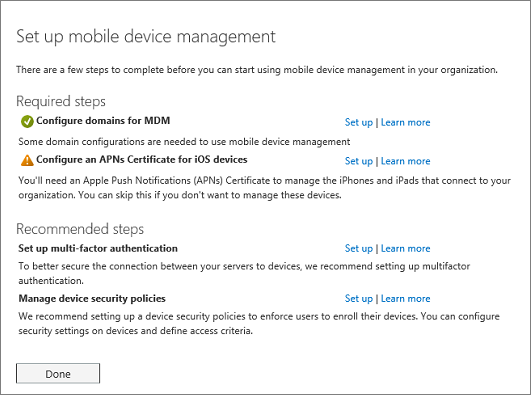

# Définir des Mobile Device Management (MDM) dans Office 365Set up Mobile Device Management (MDM) in Office 365

L’intégrés Mobile Device Management (MDM) pour Office 365 vous aident à sécuriser et gérer des appareils mobiles de vos utilisateurs comme iPhone, des tablettes, Androïd, et les téléphones Windows. Vous pouvez créer et gérer les stratégies de sécurité d’appareil, à distance réinitialiser un appareil et afficher les rapports détaillées des périphériques.The built-in Mobile Device Management (MDM) for Office 365 helps you secure and manage your users' mobile devices like iPhones, iPads, Androids, and Windows phones. You can create and manage device security policies, remotely wipe a device, and view detailed device reports.
  
Des questions ? Nous avons créé [un forum aux questions pour aider à répondre aux questions des courants](frequently-asked-questions-about-mdm.md). Gardez à l’esprit que vous ne pouvez pas utiliser un [partenaires : offre l’administration déléguée](https://support.office.com/article/26530dc0-ebba-415b-86b1-b55bc06b073e) pour gérer la gestion des périphériques mobiles pour Office 365.Have questions? We've put together [a FAQ to help address common questions](frequently-asked-questions-about-mdm.md). Be aware that you cannot use a [Partners: Offer delegated administration](https://support.office.com/article/26530dc0-ebba-415b-86b1-b55bc06b073e) to manage Mobile Device Management for Office 365. 
  
Gestion des périphériques fait partie de la sécurité &amp; centre de conformité, il vous faudra donc à l’ouvrir pour lancer le programme d’installation de Mobile Device Manager.Device management is part of the Security &amp; Compliance Center so you'll need to go there to kick off MDM setup.
  
Pour définir la gestion de l’appareil Mobile pour Office 365 vous devez :To set up Mobile Device Management for Office 365 you'll need to:
  
1. [Activer le service de gestion des périphériques mobilesActivate the Mobile Device Management service](#activate-the-mobile-device-management-service)  
2. [Configurer la gestion des périphériques mobilesSet up Mobile Device Management](#set-up-mobile-device-management)
3. [Assurez-vous que les utilisateurs s’inscrire leurs périphériquesMake sure users enroll their devices](#step-4-recommended-manage-device-security-policies)
  
## Activer le service de gestion des périphériques mobilesActivate the Mobile Device Management service

1. Connectez-vous à Office 365 avec votre compte professionnel ou scolaire.Sign in to Office 365 with your work or school account. 
    
2. Accédez à [sécurité &amp; centre de conformité](https://protection.office.com).Go to [Security &amp; Compliance Center](https://protection.office.com).
    
3. Accédez à la **protection contre la perte de données** \> **Gestion des périphériques** et cliquez sur **quelques** pour lancer le processus d’activation.Navigate to **Data loss prevention** \> **Device management** and click **Let's get started** to kick off the activation process. 
    
    
  
4. Nous avons créé une stratégie de sécurité par défaut vous permet de vous aider à démarrer. Mettre à jour le nom de la stratégie de sécurité sur cette page, puis cliquez sur **Démarrer le programme d’installation**.We created a default security policy for you to help you get started. Update the name of the security policy on this page, and then click **Start setup**.
    
    
  
5. Vous verrez l’écran du programme d’installation qui affiche la progression sur la configuration du service.You'll see the setup screen that shows progress on setting up the service.
    
    
  
> [!TIP]
> Vous pouvez également rechercher **Le programme d’installation de Mobile Device Manager** par le biais de recherche. Dans le centre d’administration Office 365 \> page **d’accueil** , gestion des appareils mobiles de type dans la zone de **recherche** . > You can also locate **MDM Setup** through Search. In the Office 365 admin center \> **Home** page, type mobile device management in the **Search** box. > 
  
Elle peut prendre un certain temps pour activer la gestion des périphériques mobiles pour Office 365, mais lorsqu’il a terminé, vous recevrez un message électronique qui explique les étapes à suivre.It can take some time to activate Mobile Device Management for Office 365, but when it finishes, you'll receive an email that explains the next steps to take.
  
## Configurer la gestion des périphériques mobilesSet up Mobile Device Management

Lorsque le service est prêt, effectuez les quatre étapes suivantes pour terminer l’installation. Vous devrez peut-être cliquer sur [Gérer les paramètres](https://portal.office.com/EAdmin/Device/IntuneInventory.aspx) dans la page **Gestion des périphériques** dans la sécurité &amp; centre de conformité pour voir les paramètres suivants.When the service is ready, complete the following four steps to finish setup. You may need to click [Manage settings](https://portal.office.com/EAdmin/Device/IntuneInventory.aspx) on the **Device management** page in the Security &amp; Compliance Center to see the following settings. 
  

  
### Étape 1 : Domaines de configuration (obligatoire) pour Mobile Device ManagerStep 1: (Required) Configure domains for MDM

Si vous n’avez pas un domaine personnalisé associé à Office 365, ou si vous n'êtes pas la gestion des périphériques Windows, vous pouvez ignorer cette section. Dans le cas contraire, vous devez ajouter des enregistrements DNS pour le domaine à votre hôte DNS. Si vous avez ajouté les enregistrements déjà, dans le cadre de la configuration de votre domaine à Office 365, vous êtes prêt. Après avoir ajouté les enregistrements, les utilisateurs Office 365 dans votre organisation qui se connectent à leur appareil Windows avec une adresse de messagerie qui utilise votre domaine personnalisé sont redirigés pour vous inscrire dans Mobile Device Manager pour Office 365.If you don't have a custom domain associated with Office 365 or if you're not managing Windows devices, you can skip this section. Otherwise, you'll need to add DNS records for the domain at your DNS host. If you've added the records already, as part of setting up your domain with Office 365, you're all set. After you add the records, Office 365 users in your organization who sign in on their Windows device with an email address that uses your custom domain are redirected to enroll in MDM for Office 365.
  
Besoin d’aide pour configurer les enregistrements ? Recherchez votre enregistrement de domaines dans la liste fournie dans [créer des enregistrements DNS pour Office 365 lorsque vous gérez vos enregistrements DNS](https://support.office.com/article/b0f3fdca-8a80-4e8e-9ef3-61e8a2a9ab23) et sélectionnez le nom du serveur d’inscriptions pour accéder à une aide détaillée pour la création d’enregistrements DNS. Utilisez ces instructions pour ajouter les deux enregistrements suivants :Need help setting up the records? Find your domain registrar in the list provided in [Create DNS records for Office 365 when you manage your DNS records](https://support.office.com/article/b0f3fdca-8a80-4e8e-9ef3-61e8a2a9ab23) and select the registrar name to go to step-by-step help for creating DNS records. Use those instructions to add the following two records: 
  
|**Nom d’hôte****Host name**|**Type d’enregistrement****Record type**|**Adresse****Address**|**TTL****TTL**|
|:-----|:-----|:-----|:-----|
|EnterpriseEnrollmentEnterpriseEnrollment    |CNAMECNAME    |EnterpriseEnrollment.manage.microsoft.comEnterpriseEnrollment.manage.microsoft.com    |36003600    |
|EnterpriseRegistrationEnterpriseRegistration    |CNAMECNAME    |EnterpriseRegistration.windows.netEnterpriseRegistration.windows.net    |36003600    |
   
Après avoir ajouté les deux enregistrements, retournez à la sécurité &amp; centre de conformité et accédez à **gestion de périphériques** \> **Gérer les paramètres** pour effectuer l’étape suivante.After you add the two records, go back to the Security &amp; Compliance Center and navigate to **Device management** \> **Manage settings** to complete the next step. 
  
### Étape 2 : (Obligatoire) configurer un certificat APNs pour les appareils iOSStep 2: (Required) Configure an APNs Certificate for iOS devices

Pour gérer les périphériques iOS comme iPad et l’iPhone, vous devez créer un certificat APNs.To manage iOS devices like iPad and iPhones, you need to create an APNs certificate.
  
Pour ce faire, suivez les étapes dans les liens **configurer** sur la **configuration de page de gestion des appareils mobiles**.To do this, follow the steps from the **Set up** links on the **Setup mobile device management page**.
  
1. En regard de **configurer un certificat APNs pour les appareils iOS**, sélectionnez **configurer**.Next to **Configure a APNs Certificate for iOS devices**, select **Set up**.
    
2. Sélectionnez **télécharger votre fichier CSR** et enregistrez la demande de signature de certificat vers un quelque part sur votre ordinateur que vous allez vous souvenir.Select **Download your CSR file** and save the Certificate signing request to a somewhere on your computer that you'll remember. 
    
    
  
3. Cliquez sur **suivant**.Select **Next**.
    
4. Créer un certificat de point.Create an APN certificate.
    
  - Sélectionnez **Apple APNS portail** pour ouvrir le portail de certificats Push Apple.Select **Apple APNS Portal** to open the Apple Push Certificates Portal. 
    
    
  
  - Connectez-vous à l’aide d’un ID d’Apple.Sign in with an Apple ID.
    
    > [!IMPORTANT]
    > Utilisez une société Qu'apple ID associé à un compte de messagerie qui restera avec votre organisation, même si l’utilisateur qui gère le compte. Enregistrez ce code, car vous devez utiliser le même ID lorsqu’il est temps de renouveler le certificat.Use a company Apple ID associated with an email account that will remain with your organization even if the user who manages the account leaves. Save this ID because you'll need to use the same ID when it's time to renew the certificate. 
  
  - Sélectionnez **créer un certificat** et accepter les **Conditions d’utilisation**.Select **Create a Certificate** and accept the **Terms of Use**.
    
  - **Accédez** à la demande de signature de certificat vous avez téléchargé sur votre ordinateur à partir d’Office 365 et sélectionnez **Télécharger**.**Browse** to the Certificate signing request you downloaded to your computer from Office 365 and select **Upload**.
    
  - **Télécharger** le certificat point créé par le portail de certificat Push Apple à votre ordinateur.**Download** the APN certificate created by the Apple Push Certificate Portal to your computer. 
    
    > [!TIP]
    > Si vous rencontrez des difficultés à télécharger le certificat, actualisez votre navigateur.If you're having trouble downloading the certificate, refresh your browser. 
  
5. Revenir à Office 365, puis cliquez sur **suivant** pour accéder à la page **APNS télécharger le certificat** .Go back to Office 365 and select **Next** to get to the **Upload APNS certificate** page. 
    
6. Recherchez le certificat point que vous avez téléchargé à partir du portail de certificats Push Apple.Browse to the APN certificate you downloaded from the Apple Push Certificates Portal.
    
    
  
7. Sélectionnez **Terminer**.Select **Finish**.
    
Après avoir ajouté le certificat point, retournez à la sécurité &amp; centre de conformité et accédez à **gestion de périphériques** \> **Gérer les paramètres** pour effectuer l’étape suivante.After you add APN Certificate, go back to the Security &amp; Compliance Center and navigate to **Device management** \> **Manage settings** to complete the next step. 
  
### Étape 3 : (Recommandé) configurer l’authentification multifacteurStep 3: (Recommended) Set up multi-factor authentication

Si vous ne voyez pas l’authentification multifacteur (MFA) sous les **étapes recommandées**, vous pouvez ignorer cette section. Si cette option n’est répertoriée, il est recommandé de qu'activer MFA dans le portail Azure AD pour renforcer la sécurité de la gestion des périphériques mobiles pour le processus d’inscription d’Office 365. Il est désactivé par défaut.If you don't see multi-factor authentication (MFA) under **Recommended steps**, you can skip this section. If this option is listed, we recommend you turn on MFA in the Azure AD portal to increase the security of the Mobile Device Management for Office 365 enrollment process. It is turned off by default.
  
MFA permet de sécuriser la connexion à Office 365 pour l’inscription de l’appareil mobile en exigeant un deuxième formulaire d’authentification. Les utilisateurs sont nécessaires pour confirmer un appel téléphonique, un message textuel ou une notification d’application sur leur appareil mobile après avoir entré correctement leur mot de passe du compte professionnel. Ils peuvent uniquement s’inscrire leur appareil après que ce deuxième formulaire d’authentification est terminé. Une fois que les périphériques des utilisateurs sont inscrits dans la gestion des périphériques mobiles pour Office 365, les utilisateurs peuvent accéder aux ressources de Office 365 avec seulement le compte de leur travail.MFA helps secure the sign in to Office 365 for mobile device enrollment by requiring a second form of authentication. Users are required to acknowledge a phone call, text message, or app notification on their mobile device after correctly entering their work account password. They can only enroll their device after this second form of authentication is completed. After users' devices are enrolled in Mobile Device Management for Office 365, users can access Office 365 resources with just their work account.
  
En regard de **configurer l’authentification multifacteur**, sélectionnez **configurer**. Pour savoir comment activer MFA dans le portail Azure AD, voir [configurer l’authentification multifacteur](https://go.microsoft.com/fwlink/p/?LinkId=519255).Next to **Set up multi-factor authentication**, select **Set up**. To learn how to turn on MFA in the Azure AD portal, see [Set up multi-factor authentication](https://go.microsoft.com/fwlink/p/?LinkId=519255).
  
Après avoir configuré MFA, retournez à la sécurité &amp; centre de conformité et accédez à **gestion de périphériques** \> **Gérer les paramètres** pour effectuer l’étape suivante.After you set up MFA, go back to the Security &amp; Compliance Center and navigate to **Device management** \> **Manage settings** to complete the next step. 
  
### Étape 4 : Stratégies de sécurité d’appareil gérer (recommandé)Step 4: (Recommended) Manage device security policies

L’étape suivante consiste à créer et déployer des stratégies de sécurité de périphérique pour protéger les données de votre organisation Office 365. Par exemple, vous pouvez aider à éviter toute perte de données si un utilisateur perd leur appareil en créant une stratégie sur les périphériques de verrouillage après cinq minutes d’inactivité et périphériques effacée après 3 échecs de connexion.The next step is to create and deploy device security policies to help protect your Office 365 organization's data. For example, you can help prevent data loss if a user loses their device by creating a policy to lock devices after 5 minutes of inactivity and have devices wiped after 3 sign-in failures.
  
Dans la **sécurité &amp; centre de conformité**, accédez aux **stratégies de sécurité** \> **stratégies de sécurité des périphériques** pour créer des stratégies de sécurité de périphérique et les règles d’accès.In the **Security &amp; Compliance Center**, go to **Security policies** \> **Device security policies** to create device security policies and access rules. 
  

  
Pour obtenir des instructions étape par étape comment créer une nouvelle stratégie, voir [créer et déployer des stratégies de sécurité des périphériques](create-device-security-policies.md).For step by step instructions on how to create a new policy, see [Create and deploy device security policies](create-device-security-policies.md).
  
> [!TIP]
>  Lorsque vous créez une nouvelle stratégie, vous pouvez souhaiter définir la stratégie pour autoriser violation de stratégie d’accès et le rapport où périphérique d’un utilisateur n’est pas conforme à la stratégie. Cela vous permet de voir combien d’appareils mobiles est affecté par la stratégie sans blocage de l’accès à Office 365. > Avant de déployer une nouvelle stratégie pour tout le monde dans votre organisation, nous vous recommandons de que tester sur les appareils utilisés par un petit nombre d’utilisateurs. > En outre, avant de déployer des stratégies, permettent à votre organisation connaître l’impact potentiel d’inscrire un périphérique Mobile Device Manager pour Office 365. Selon la façon dont vous configurez les stratégies, les périphériques qui ne sont pas conformes à leur (périphériques non compatibles) peuvent être bloqués d’accéder à Office 365. Périphériques non conforme peut-être également les applications installées, des photos et autres informations personnelles, sur un appareil inscrit, risquent d’être supprimées si le périphérique est effacé. Informations supplémentaires : [Réinitialiser un appareil mobile dans Office 365](wipe-a-mobile-device.md).When you create a new policy, you might want to set the policy to allow access and report policy violation where a user's device isn't compliant with the policy. This lets you see how many mobile devices would be impacted by the policy without blocking access to Office 365. >  Before you deploy a new policy to everyone in your organization, we recommend you test it on the devices used by a small number of users. >  Also, before you deploy policies, let your organization know the potential impacts of enrolling a device in MDM for Office 365. Depending on how you set up the policies, devices that don't comply with them (non-compliant devices) could be blocked from accessing Office 365. Non-compliant devices might also have apps installed, photos, and other personal information which, on an enrolled device, could be deleted if the device is wiped. More info: [Wipe a mobile device in Office 365](wipe-a-mobile-device.md). 
  
## Assurez-vous que les utilisateurs s’inscrire leurs périphériquesMake sure users enroll their devices

Une fois que vous avez créé et déployé une stratégie de gestion des appareils mobiles, chaque utilisateur Office 365 sous licence dans votre organisation la stratégie de périphérique s’applique à recevoir un message d’inscription la prochaine fois qu’ils se connectent à Office 365 à partir de leur appareil mobile. Il doit exécuter les étapes de l’inscription et l’activation pouvoir accéder aux documents et au courrier électronique Office 365. Voir [inscrire votre appareil mobile pour le travail ou une école](enroll-your-mobile-device.md).After you've created and deployed a mobile device management policy, each licensed Office 365 user in your organization that the device policy applies to will receive an enrollment message the next time they sign into Office 365 from their mobile device. They must complete the enrollment and activation steps before they can access Office 365 email and documents. See [Enroll your mobile device for work or school](enroll-your-mobile-device.md).
  
> [!IMPORTANT]
> Si la langue par défaut d’un utilisateur n’est pas pris en charge par le processus d’inscription, les utilisateurs peuvent recevoir des notifications d’inscription et étapes sur leurs appareils mobiles dans une autre langue. Pas toutes les langues prises en charge dans Office 365 sont actuellement pris en charge pour le processus d’inscription sur les appareils mobiles.If a user's preferred language isn't supported by the enrollment process, users may receive enrollment notification and steps on their mobile devices in another language. Not all languages supported in Office 365 are currently supported for the enrollment process on mobile devices. 
  
Les utilisateurs avec des périphériques Android ou iOS sont nécessaires pour installer l’application de portail d’entreprise dans le cadre du processus d’inscription.Users with Android or iOS devices are required to install the Company Portal app as part of the enrollment process.
  
## Voir aussiRelated Topics

[Fonctionnalités de gestion des appareils mobilesCapabilities of Mobile Device Management](capabilities-of-mobile-device-management.md)
  
[Créer et déployer des stratégies de sécurité des appareilsCreate and deploy device security policies](create-device-security-policies.md)
  

