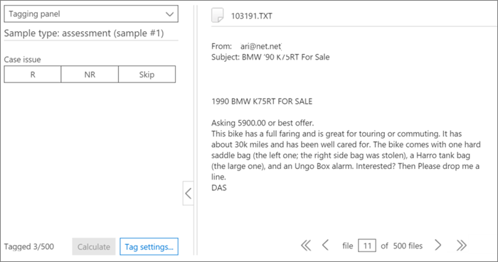

# Balisage et évaluation dans Office 365 Advanced eDiscoveryTagging and Assessment in Office 365 Advanced eDiscovery

> [!NOTE]
> Pour utiliser Advanced eDiscovery, votre organisation doit souscrire un abonnement Office 365 E3 avec le module complémentaire Conformité avancée ou un abonnement E5. Si vous ne disposez pas d’un abonnement et que vous souhaitez essayer Advanced eDiscovery, vous pouvez vous [inscrire pour utiliser une version d’évaluation d’Office 365 Entreprise E5](https://go.microsoft.com/fwlink/p/?LinkID=698279).Advanced eDiscovery requires an Office 365 E3 with the Advanced Compliance add-on or an E5 subscription for your organization. If you don't have that plan and want to try Advanced eDiscovery, you can [sign up for a trial of Office 365 Enterprise E5](https://go.microsoft.com/fwlink/p/?LinkID=698279). 
  
Cette section décrit la procédure pour le module d’évaluation de la pertinence eDiscovery avancée.This section describes the procedure for the Advanced eDiscovery Relevance Assessment module. 
  
## Exécution de la formation et de l’analyse de l’évaluationPerforming Assessment training and analysis

1. Sous l' **onglet \> suivi de pertinence** , cliquez sur **évaluation** pour démarrer l’évaluation de cas.In the **Relevance \> Track** tab, click **Assessment** to start case assessment. 
    
    Dans le cadre de cette procédure, un exemple d’ensemble d’évaluation de 500 fichiers est créé \*\*\*\* et l’onglet balise s’affiche, qui contient le panneau balisage, le contenu du fichier et d’autres options de marquage.For example purposes in this procedure, a sample assessment set of 500 files is created and the **Tag** tab is displayed, which contains the Tagging panel, displayed file content and other tagging options. 
    
    
  
2. Examinez chaque fichier dans l’exemple, déterminez la pertinence du fichier pour chaque problème de cas, et marquez le fichier à l’aide des boutons pertinence (R), non pertinent (NR) et ignorer dans le volet de **marquage** .Review each file in the sample, determine the file's relevance for each case issue, and tag the file using the Relevance (R), Not relevant (NR) and Skip buttons in the **Tagging panel** pane. 
    
    > [!NOTE]
    >  L’évaluation requiert 500 fichiers balisés.Assessment requires 500 tagged files. Si les fichiers sont «ignorés», vous recevrez plus de fichiers à balise.If files are "skipped", you will receive more files to tag. 
  
3. Après avoir balisé tous les fichiers de l’exemple, cliquez sur **calculer**.After tagging all files in the sample, click **Calculate**. 
    
    La marge d’erreur et la richesse de l’évaluation actuelle sont calculées et affichées sous l’onglet de **suivi de pertinence** , avec des détails détaillés par problème, comme illustré ci-dessous.The Assessment current error margin and richness are calculated and displayed in the **Relevance Track** tab, with expanded details per issue, as shown below. Plus de détails sur cette boîte de dialogue sont décrits dans la section «examen des résultats des évaluations» plus loin.More details about this dialog are described in the later section "Reviewing Assessments results". 
    
    
  
    > [!TIP]
    > Par défaut, nous vous recommandons de passer à l’étape suivante par défaut lorsque l’indicateur de progression de l’évaluation du problème est terminé, indiquant que l’exemple d’évaluation a été révisé et que des fichiers appropriés ont été marqués.By default, we recommend that you proceed to the default Next step when the Assessment progress indicator for the issue has completed, indicating that the assessment sample was reviewed and sufficient relevant files were tagged. > sinon, si vous souhaitez afficher les résultats de l’onglet de **suivi** et contrôler la marge d’erreur et l’étape suivante, cliquez sur **modifier** en regard de l' **étape suivante**, sélectionnez **continuer l’évaluation**, puis cliquez sur **OK**.> Otherwise, if you want to view the **Track** tab results and control the margin of error and the next step, click **Modify** adjacent to **Next Step**, select **Continue assessment**, and then click **OK**. 
  
1. Cliquez sur **modifier** à droite de la case à cocher **évaluation** pour afficher et spécifier les paramètres d’évaluation par problème.Click **Modify** to the right of the **Assessment** check box to view and specify assessment parameters per issue. Une boîte de dialogue de **niveau d’évaluation** s’affiche pour chaque problème, comme illustré dans l’exemple suivant:An **Assessment level** dialog for each issue is displayed, as shown in the following example: 
    
    
  
    Les paramètres suivants du problème sont calculés et affichés dans la boîte de dialogue **niveau d’évaluation** :The following parameters for the issue are calculated and displayed in the **Assessment level** dialog: 
    
    **Marge d’erreur cible pour les estimations de rappel**: en fonction de cette valeur, le nombre estimé de fichiers supplémentaires nécessaires à la révision est calculé.**Target error margin for recall estimates**: Based on this value, the estimated number of additional files necessary to review is calculated. La marge utilisée pour le rappel est supérieure à 75% et avec un niveau de confiance de 95%.The margin used for recall is greater than 75% and with a 95% confidence level. 
    
    **Fichiers d’évaluation supplémentaires requis**: indique le nombre de fichiers nécessaires si les exigences actuelles de marge d’erreur n’ont pas été respectées.**Additional assessment files required**: Indicates how many more files are necessary if the current error margin's requirements have not been met. 
    
2. Pour ajuster la marge d’erreur actuelle et observer l’effet de différentes marges d’erreur (par problème):To adjust the current error margin and see the effect of different error margins (per issue):
    
1. Dans la liste **Sélectionner un problème** , sélectionnez un problème.In the **Select issue** list, select an issue. 
    
2. Dans **marge d’erreur cible pour les estimations de rappel**, entrez une nouvelle valeur.In **Target error margin for recall estimates**, enter a new value.
    
3. Cliquez sur **mettre à jour les valeurs** pour voir l’impact des ajustements.Click **Update values** to see the impact of the adjustments. 
    
3. Cliquez sur **avancé** dans la boîte de dialogue **niveau d’évaluation** pour voir les paramètres et détails supplémentaires suivants:Click **Advanced** in the **Assessment level** dialog to see the following additional parameters and details: 
    
    
  
    **Richesse estimée**: richesse estimée en fonction des résultats de l’évaluation actuelle**Estimated richness**: Estimated richness according to the current assessment results
    
    **Pour le rappel présumé**: par défaut, la marge d’erreur cible s’applique au rappel supérieur à 75%.**For assumed recall**: By default, the target error margin applies to recall above 75%. Cliquez sur **modifier** si vous souhaitez modifier ce paramètre et contrôler la marge d’erreur sur une plage de valeurs de rappel différente.Click **Edit** if you want to change this parameter and control the margin of error on a different range of recall values. 
    
    **Niveau de confiance**: par défaut, la marge d’erreur recommandée pour la confiance est de 95%.**Confidence level**: By default, the recommended error margin for confidence is 95%. Cliquez sur **modifier** si vous souhaitez modifier ce paramètre.Click **Edit** if you want to change this parameter. 
    
    **Marge d’erreur de richesse attendue**: en fonction des valeurs mises à jour, il s’agit de la marge d’erreur attendue de la richesse, après examen de tous les fichiers d’évaluation supplémentaires.**Expected richness error margin**: Given the updated values, this is the expected margin of error of the richness, after all additional assessment files are reviewed.
    
    **Fichiers d’évaluation supplémentaires requis**: étant donné les valeurs mises à jour, le nombre de fichiers d’évaluation supplémentaires qui doivent être vérifiés pour atteindre la cible.**Additional assessment files required**: Given the updated values, the number of additional assessment files that need to be reviewed to reach the target.
    
    **Nombre total de fichiers d’évaluation requis**: étant donné les valeurs mises à jour, le nombre total de fichiers d’évaluation requis pour la révision.**Total assessment files required**: Given the updated values, total assessment files required for review.
    
    **Nombre prévu de fichiers pertinents lors de l’évaluation**: étant donné les valeurs mises à jour, le nombre prévu de fichiers pertinents dans l’intégralité de l’évaluation une fois que tous les fichiers d’évaluation supplémentaires sont examinés.**Expected number of relevant files in assessment**: Given the updated values, the expected number of relevant files in the entire assessment after all additional assessment files are reviewed.
    
4. Cliquez sur recalculer les **valeurs**si les paramètres sont modifiés.Click **Recalculate values**, if parameters are changed. Lorsque vous avez terminé, cliquez sur **OK** pour enregistrer les modifications (ou **suivant** lorsqu’il y a plusieurs problèmes à consulter ou modifier, puis **Terminer**).When you are done, if there is one issue, click **OK** to save the changes (or **Next** when there are multiple issues to review or modify and then **Finish**). 
    
    Lorsqu’il existe plusieurs problèmes, une fois que tous les problèmes ont été vérifiés ou ajustés, un **niveau d’évaluation: Résumé** s’affiche, comme illustré dans l’exemple suivant.When there are multiple issues, after all issues have been reviewed or adjusted, an **Assessment level: summary** dialog is displayed, as shown in the following example. 
    
    
  
    Une fois l’évaluation terminée, passez à l’étape suivante de la formation pertinente.Upon successful completion of assessment, proceed to the next stage in Relevance training.
    
## Examen des résultats de l’évaluationReviewing assessment results

Une fois qu’un exemple d’évaluation est balisé, les résultats de l’évaluation sont calculés et affichés sous l’onglet suivi de pertinence.After an Assessment sample is tagged, the assessment results are calculated and displayed in the Relevance Track tab.
  
Les résultats suivants s’affichent dans l’affichage de suivi étendu:The following results are displayed in the expanded Track display: 
  
- Évaluation de la marge d’erreur actuelle pour les estimations de rappelAssessment current error margin for recall estimates
    
- Richesse estiméeEstimated richness
    
- Fichiers d’évaluation supplémentaires requis (pour révision)Additional assessment files required (for review)
    
L’évaluation de la marge d’erreur actuelle est la marge d’erreur recommandée par Advanced eDiscovery.The Assessment current error margin is the error margin recommended by Advanced eDiscovery. Le numéro affiché pour le «fichiers d’évaluation supplémentaires requis» correspond à cette recommandation.The number displayed for the "Additional assessment files required" corresponds to that recommendation.
  
L’indicateur de progression de l’évaluation indique le niveau d’exécution de l’évaluation, en fonction de la marge d’erreur actuelle.The Assessment progress indicator shows the level of completion of the assessment, given the current error margin. Lorsque l’évaluation est en cours, l’utilisateur balise un autre exemple d’évaluation.When assessment is underway, the user will tag another assessment sample.
  
Lorsque l’indicateur de progression de l’évaluation indique l’évaluation terminée, cela signifie que la révision de l’exemple d’évaluation a été effectuée et que des fichiers appropriés ont été marqués.When the assessment progress indicator shows assessment as complete, that means the assessment sample review was completed and sufficient relevant files were tagged. 
  
L’affichage de suivi étendu présente l’étape suivante recommandée, les statistiques d’évaluation et l’accès aux résultats détaillés.The expanded Track display shows the recommended next step, the assessment statistics, and access to detailed results.
  
Lorsque la richesse est très faible, le nombre de fichiers d’évaluation supplémentaires nécessaires pour atteindre un nombre minimal de fichiers pertinents pour produire des statistiques utiles est très élevé.When richness is very low, the number of additional assessment files needed to reach a minimal number of relevant files to produce useful statistics is very high. Advanced eDiscovery vous recommande de passer à la formation.Advanced eDiscovery will then recommend moving on to training. L’indicateur de progression de l’évaluation est ombré et aucune statistique n’est disponible.The assessment progress indicator will be shaded, and no statistics will be available. 
  
En l’absence de stabilisation statistiquement basée statistiquement, les résultats seront moins élevés.In the absence of statistically based stabilization, there will be results with a lower level of accuracy and confidence level. Toutefois, ces résultats peuvent être utilisés pour rechercher des fichiers pertinents lorsque vous n’avez pas besoin de connaître le pourcentage de fichiers pertinents trouvés.However, these results can be used to find relevant files when you do not need to know the percentage of relevant files found. De même, cet État peut être utilisé pour former des problèmes avec une faible richesse, où les scores de pertinence peuvent accélérer l’accès aux fichiers pertinents à un problème spécifique.Similarly, this status can be used to train issues with low richness, where Relevance scores can accelerate access to files relevant to a specific issue.
  
> [!TIP]
> Dans l' **onglet \> suivi de pertinence** , affichage des problèmes étendus, les options d’affichage suivantes sont disponibles: > l’étape suivante recommandée, telle que l' **étape suivante: le marquage** peut être contourné (par problème) en cliquant sur le bouton **modifier** à sa droite. , puis en sélectionnant une autre étape dans l' **étape suivante**.In the **Relevance \> Track** tab, expanded issue display, the following viewing options are available: > The recommended next step, such as **Next step: Tagging** can be bypassed (per issue) by clicking the **Modify** button to its right, and then selecting an different step in the **Next step**. Lorsque l’indicateur de progression de l’évaluation n’est pas terminé, l’option évaluation est recommandée suivant, pour baliser les fichiers d’évaluation et augmenter la précision des statistiques.When the assessment progress indicator has not completed, assessment will be the next recommended option, to tag more assessment files and increase statistics accuracy. > vous pouvez modifier la marge d’erreur et évaluer son impact, en cliquant sur **modifier**, puis dans la **boîte de dialogue niveau d’évaluation**, en modifiant la **marge d’erreur cible pour les estimations de rappel**, puis en cliquant sur **mettre à jour les valeurs**.> You can change the error margin and assess its impact, by clicking **Modify**, and in the **Assessment level dialog**, changing the **Target error margin for recall estimates**, and clicking **Update values**. De plus, dans cette boîte de dialogue, vous pouvez afficher les options avancées en cliquant sur **avancé**.Also, in this dialog, you can view advanced options, by clicking **Advanced**. > vous pouvez afficher des statistiques supplémentaires sur le niveau d’évaluation et leur impact en cliquant sur **affichage**.> You can view additional assessment level statistics and their impact by clicking **View**. Dans la boîte de dialogue résultats détaillés affichés, les statistiques sont disponibles par problème, lorsqu’il y a au moins 500 fichiers d’évaluation marqués et que 18 fichiers sont balisés comme pertinents pour le problème.In the displayed Detail results dialog, statistics are available per issue, when there are at least 500 tagged assessment files and at least 18 files are tagged as Relevant for the issue. 
  
## Voir aussiSee also

[Office 365 Advanced eDiscoveryOffice 365 Advanced eDiscovery](office-365-advanced-ediscovery.md)
  
[Présentation de l’évaluation en matière de pertinenceUnderstanding Assessment in Relevance](assessment-in-relevance-in-advanced-ediscovery.md)
  
[Étiquetage et formation à la pertinenceTagging and Relevance training](tagging-and-relevance-training-in-advanced-ediscovery.md)
  
[Analyse de la pertinenceTracking Relevance analysis](track-relevance-analysis-in-advanced-ediscovery.md)
  
[Choix en fonction des résultatsDeciding based on the results](decision-based-on-the-results-in-advanced-ediscovery.md)
  
[Évaluation de l’analyse de pertinenceTesting Relevance analysis](test-relevance-analysis-in-advanced-ediscovery.md)

