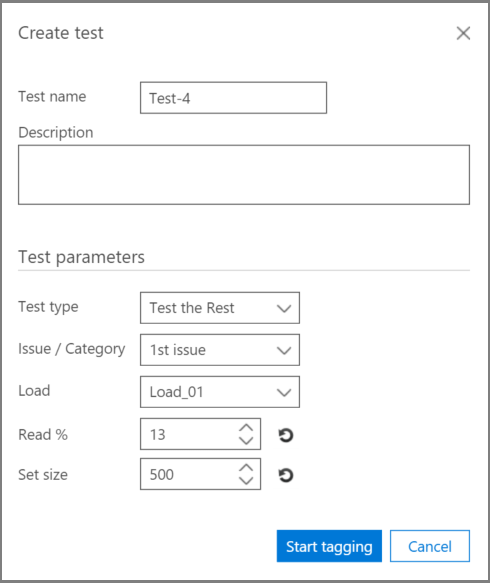

# Tester l’analyse de pertinence dans Office 365 Advanced eDiscoveryTest Relevance analysis in Office 365 Advanced eDiscovery

> [!NOTE]
> Pour utiliser Advanced eDiscovery, votre organisation doit souscrire un abonnement Office 365 E3 avec le module complémentaire Conformité avancée ou un abonnement E5. Si vous ne disposez pas d’un abonnement et que vous souhaitez essayer Advanced eDiscovery, vous pouvez vous [inscrire pour utiliser une version d’évaluation d’Office 365 Entreprise E5](https://go.microsoft.com/fwlink/p/?LinkID=698279).Advanced eDiscovery requires an Office 365 E3 with the Advanced Compliance add-on or an E5 subscription for your organization. If you don't have that plan and want to try Advanced eDiscovery, you can [sign up for a trial of Office 365 Enterprise E5](https://go.microsoft.com/fwlink/p/?LinkID=698279). 
  
L’onglet test dans Advanced eDiscovery vous permet de tester, de comparer et de valider la qualité globale du traitement.The Test tab in Advanced eDiscovery enables you to test, compare, and validate the overall quality of processing. Ces tests sont effectués après le calcul par lots.These tests are performed after Batch calculation. En marquant les fichiers dans la collection, un expert détermine si chaque fichier balisé est pertinent pour le cas.By tagging the files in the collection, an expert makes the final judgment about whether each tagged file is actually relevant to the case. 
  
Dans les scénarios à un ou plusieurs problèmes, les tests sont généralement effectués par problème.In single and multiple-issue scenarios, tests are typically performed per issue. Les résultats peuvent être affichés après chaque test, et les résultats des tests peuvent être retravaillés avec les exemples de fichiers de test spécifiés.Results can be viewed after each test, and test results can be reworked with specified sample test files.
  
## Test du resteTesting the rest

Le test «tester le reste» permet de valider les décisions de Culling, par exemple, pour examiner uniquement les fichiers situés au-dessus d’un score de pertinence spécifique basé sur les résultats avancés avancés de découverte électronique.The "Test the Rest" test is used to validate culling decisions, for example, to review only files above a specific Relevance cutoff score based on the final Advanced eDiscovery results. L’expert examine un échantillon de fichiers sous un score de démarcation sélectionné pour évaluer le nombre de fichiers appropriés dans cet ensemble.The expert reviews a sample of files under a selected cutoff score to evaluate the number of relevant files within that set.
  
Ce test fournit des statistiques et une comparaison entre l’ensemble de révision et le test la population Rest.This test provides statistics and a comparison between the Review set and the Test the Rest population. Les résultats du jeu de révision sont ceux calculés par pertinence lors de la formation.The results of the review set are those calculated by Relevance during Training. Les résultats incluent des calculs en fonction des paramètres et des paramètres d’entrée, tels que:The results include calculations , based on settings and input parameters, such as:
  
- Tester des statistiques sur le nombre de fichiers dans un exemple et identifier les fichiers appropriés.Test sample statistics of the number of files in a sample and identified relevant files. 
    
- Comparaison tabulaire des paramètres de population du jeu de révision et des autres, par exemple, le nombre de fichiers, le nombre estimé de fichiers pertinents, la richesse estimée et le coût moyen de la recherche d’un fichier supplémentaire pertinent.Tabular comparison of the Population parameters of the Review set and the Rest, for example, the number of files, estimated number of relevant files, estimated richness, and the average cost of finding an additional relevant file. Les paramètres de coût des paramètres peuvent être définis par l’administrateur.Cost parameter settings can be set by the administrator.
    
1. Ouvrez l' **onglet \> test de pertinence** .Open the **Relevance \> Test** tab. 
    
2. Dans l’onglet **test** , cliquez sur **nouveau test**.In the **Test** tab, click **New test**. La boîte de dialogue **créer un test** s’affiche, comme illustré dans l’exemple suivant.The **Create test** dialog is displayed, as shown in the following example. 
    
    
  
3. Dans **nom du test**et **Description**, tapez le nom et la description.In **Test name**, and **Description**, type the name and description.
    
4. Dans la liste **type de test** , sélectionnez **tester le reste**In the **Test type** list, select **Test the Rest**
    
5. Dans la liste **problème/catégorie** , sélectionnez le nom du problème.In the **Issue / Category** list, select the issue name. 
    
6. Dans la liste **charge** , sélectionnez la charge.In the **Load** list, select the load. 
    
7. En **lecture%**, acceptez la valeur par défaut ou sélectionnez une valeur pour le score de pertinence de la limite.In **Read %**, accept the default value or select a value for the cutoff Relevance score. 
    
8. Dans **définir la taille**, ou acceptez la valeur par défaut.In **Set size**, or accept the default value. Notez que les icônes de restauration restaureront les valeurs par défaut.Note that the restore icons will restore the default values.
    
9. Cliquez sur **Démarrer**le balisage.Click **Start tagging**. Un échantillon de test est généré.A test sample is generated.
    
10. Examinez et marquez chacun des fichiers dans l’onglet de la balise de \*\*pertinence \> \*\* et, lorsque vous avez fini, cliquez sur **calculer**.Review and tag each of the files in the **Relevance \> Tag** tab and when done, click **Calculate**.
    
11. Sous l’onglet test, vous pouvez cliquer sur **afficher les résultats** pour afficher les résultats des tests.In the Test tab, you can click **View results** to see the test results. Un exemple est illustré dans la figure suivante.An example is shown in the following figure. 
    
    
  
Dans la figure ci-dessus, la section **exemple de paramètres** du tableau contient des détails sur le nombre de fichiers dans l’exemple marqué par l’expert, ainsi que le nombre de fichiers pertinents trouvés dans cet exemple.In the figure above, the **Sample parameters** section of the table contains details about the number of files in the sample tagged by the expert, and the number of relevant files found in that sample. 
  
La section **paramètres de remplissage** du tableau contient les résultats des tests, y compris le remplissage de l’ensemble des fichiers dont le score est inférieur à la limite sélectionnée et la population de fichiers Rest dont le score est supérieur à la limite sélectionnée.The **Population parameters** section of the table contains the test results, including the Review set population of files with a score below the selected cutoff and "The Rest" population of files with a score above the selected cutoff. Pour chaque population, les résultats suivants s’affichent:For each population, the following results are displayed: 
  
- Inclut des fichiers dont la limite de lecture est% indiquéeIncludes files with read % - Stated cutoff
    
- Nombre total de fichiersThe total number of files 
    
- Estimation du nombre de fichiers pertinentsThe estimated number of relevant files 
    
- La richesse estiméeThe estimated richness 
    
- Coût moyen de la recherche d’un autre fichier pertinentThe average review cost of finding another relevant file
    
## Test du secteurTesting the slice

Le test «test the Slice» effectue un test semblable au test «test the Rest», mais à un segment de l’ensemble de fichiers, tel que spécifié par la pertinence% de lecture.The "Test the Slice" test performs testing similar to the "Test the Rest" test, but to a segment of the file set as specified by Relevance Read %.
  
1. Ouvrez l' **onglet \> test de pertinence** .Open the **Relevance \> Test** tab. 
    
2. Dans l’onglet **test** , cliquez sur **nouveau test**.In the **Test** tab, click **New test**. La boîte de dialogue **créer un test** s’affiche.The **Create test** dialog is displayed. 
    
3. Dans **nom** et **Description**du test, entrez les informations.In **Test name** and **Description**, type the information.
    
4. Dans la liste **type de test** , sélectionnez **tester la section**.In the **Test type** list, select **Test the Slice**.
    
5. Dans la liste **problème** , sélectionnez le nom du problème.In the **Issue** list, select the issue name. 
    
6. Dans la liste **charge** , sélectionnez la charge.In the **Load** list, select the load. 
    
7. En **lecture% entre**, acceptez les valeurs par défaut de plage basse et haute ou sélectionnez des valeurs pour les scores de pertinence de la limite.In **Read % between**, accept the default low and high range values or select values for the cutoff Relevance scores. 
    
8. Dans **définir la taille**, sélectionnez une valeur ou acceptez la valeur par défaut.In **Set size**, select a value or accept the default value.
    
    Les icônes de restauration restaureront la valeur par défaut.The restore icons will restore the default value.
    
9. Cliquez sur **Démarrer**le balisage.Click **Start tagging**. Un échantillon de test est généré.A test sample is generated.
    
10. Examinez et marquez chacun des fichiers dans l’onglet de la balise de \*\*pertinence \> \*\* et, lorsque vous avez fini, cliquez sur **calculer**.Review and tag each of the files in the **Relevance \> Tag** tab and when done, click **Calculate**. 
    
11. Sous l’onglet test, vous pouvez cliquer sur **afficher les résultats** pour afficher les résultats des tests.In the Test tab, you can click **View results** to see the test results. 
    
## Voir aussiSee also

[Office 365 Advanced eDiscoveryOffice 365 Advanced eDiscovery](office-365-advanced-ediscovery.md)
  
[Présentation de l’évaluation en matière de pertinenceUnderstanding Assessment in Relevance](assessment-in-relevance-in-advanced-ediscovery.md)
  
[Balisage et évaluationTagging and Assessment](tagging-and-assessment-in-advanced-ediscovery.md)
  
[Étiquetage et formation à la pertinenceTagging and Relevance training](tagging-and-relevance-training-in-advanced-ediscovery.md)
  
[Analyse de la pertinenceTracking Relevance analysis](track-relevance-analysis-in-advanced-ediscovery.md)
  
[Choix en fonction des résultatsDeciding based on the results](decision-based-on-the-results-in-advanced-ediscovery.md)

