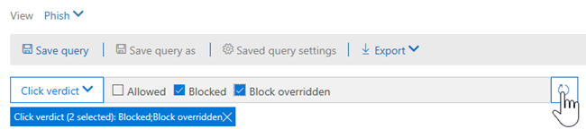
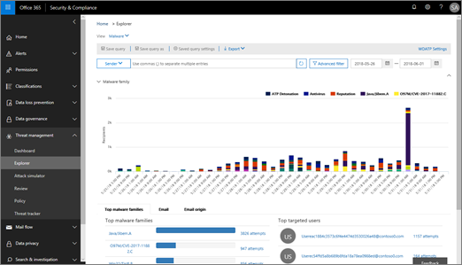

# Affichages dans l’Explorateur de menaces et détections en temps réel

[Explorateur de menaces](use-explorer-in-security-and-compliance.md) (et le rapport de détections en temps réel) est un outil puissant, en temps réel, destiné à aider les équipes des opérations de sécurité à examiner et &amp; à répondre aux menaces dans le centre de sécurité conformité. Explorer (et le rapport de détections en temps réel) affiche des informations sur les programmes malveillants et les messages hameçons suspects dans des e-mails et des fichiers dans Office 365, ainsi que d’autres menaces et risques de sécurité pour votre organisation. 

- Si vous disposez d' [Office 365 Advanced Threat Protection](office-365-atp.md) (ATP) plan 2, vous disposez de l’Explorateur.
- Si vous disposez d’Office 365 DAV plan 1, vous disposez de détections en temps réel.

Lorsque vous ouvrez l’Explorateur (ou le rapport de détection en temps réel) pour la première fois, la vue par défaut affiche les détections de programmes malveillants de messagerie pour les 7 derniers jours. Ce rapport peut également afficher des détections ATP, telles que les URL malveillantes détectées par les [liens fiables](atp-safe-links.md)et les fichiers malveillants détectés par des [pièces jointes fiables](atp-safe-attachments.md). Ce rapport peut être modifié pour afficher les données des 30 derniers jours (sauf si vous utilisez un abonnement à la version d’évaluation). Les abonnements à la version d’évaluation incluent des données pour les sept derniers jours.

Utilisez le menu **affichage** pour modifier les informations affichées. Les info-bulles vous aident à déterminer l’affichage à utiliser.
  

Une fois que vous avez sélectionné un affichage, vous pouvez appliquer des filtres et configurer des requêtes pour effectuer une analyse plus poussée. Les sections suivantes fournissent un bref aperçu des différentes vues disponibles dans l’Explorateur (ou les détections en temps réel).  

## Courrier électronique > programme malveillant

Pour afficher ce rapport, dans l’Explorateur (ou les détections en temps réel), sélectionnez **Afficher** > les**programmes malveillants**de**messagerie** > . Cette vue affiche des informations sur les messages électroniques identifiés comme contenant des programmes malveillants.  

 

Cliquez sur **expéditeur** pour ouvrir votre liste d’options d’affichage. Utilisez cette liste pour afficher les données par expéditeur, destinataires, domaine de l’expéditeur, objet, technologie de détection, état de protection, etc. 

Par exemple, pour voir les actions qui ont été effectuées sur les messages électroniques détectés, choisissez **État de protection** dans la liste. Sélectionnez une option, puis cliquez sur le bouton Actualiser pour appliquer ce filtre à votre rapport.

Sous le graphique, affichez plus de détails sur des messages spécifiques. Lorsque vous sélectionnez un élément dans la liste, un volet de survol s’ouvre, dans lequel vous pouvez en savoir plus sur l’élément que vous avez sélectionné. 

## E-mail > hameçonnage

Pour afficher ce rapport, dans l’Explorateur (ou les détections en temps réel), sélectionnez **Afficher** > le**hameçonnage****par courrier électronique** > . Cet affichage montre les messages électroniques identifiés comme des tentatives de hameçonnage.  

 

Cliquez sur **expéditeur** pour ouvrir votre liste d’options d’affichage. Utilisez cette liste pour afficher les données par expéditeur, destinataires, domaine de l’expéditeur, adresse IP de l’expéditeur, domaine de l’URL, cliquez sur verdict, etc. 

Par exemple, pour voir les actions qui ont été effectuées lorsque des utilisateurs cliquaient sur des URL identifiées comme tentatives de hameçonnage, choisissez **cliquer sur verdict** dans la liste, sélectionnez une ou plusieurs options, puis cliquez sur le bouton Actualiser.

Sous le graphique, affichez plus de détails sur des messages spécifiques, des clics d’URL, des URL et de l’origine du courrier électronique. 

Lorsque vous sélectionnez un élément dans la liste, tel qu’une URL qui a été détectée, un volet de survol s’ouvre, dans lequel vous pouvez en savoir plus sur l’élément que vous avez sélectionné. 

## Courrier électronique > signalé par l’utilisateur

Pour afficher ce rapport, dans l’Explorateur (ou les détections en temps réel), sélectionnez **Afficher** > **le courrier électronique** > **signalé**par l’utilisateur. Cet affichage montre le courrier électronique que les utilisateurs ont signalés comme courrier indésirable, non légitime ou courrier électronique de hameçonnage. 

 

Cliquez sur **expéditeur** pour ouvrir votre liste d’options d’affichage. Cette liste permet d’afficher des informations par expéditeur, destinataires, type de rapport (l’utilisateur a déterminé que le courrier électronique a été légitime, non légitime ou hameçon), et bien plus encore. 

Par exemple, pour afficher les informations sur les messages électroniques qui ont été signalés en tant que tentatives de hameçonnage, cliquez sur**type de rapport**de l' **expéditeur** > , sélectionnez **hameçonnage**, puis cliquez sur le bouton Actualiser.

Sous le graphique, affichez plus de détails sur des messages électroniques spécifiques, tels que la ligne d’objet, l’adresse IP de l’expéditeur, l’utilisateur qui a signalé le message comme courrier indésirable, légitime, ou hameçon, et bien plus encore. 

Sélectionnez un élément dans la liste pour afficher des détails supplémentaires.

## Courrier électronique > tous les messages électroniques

Pour afficher ce rapport, dans l’Explorateur, sélectionnez **Afficher** > le courrier**électronique** > de**tous les messages**. Cette vue affiche une vue d’ensemble de l’activité de messagerie, y compris le courrier électronique identifié comme malveillant en raison d’un hameçonnage ou d’un programme malveillant, ainsi que tous les messages non malveillants (e-mail normal, courrier indésirable et courrier en nombre). 

> [!NOTE]
> Si vous obtenez une erreur indiquant un **trop grand nombre de données à afficher**, ajoutez un filtre et, si nécessaire, Affinez la plage de dates que vous visualisez. 

Pour appliquer un filtre, choisissez **expéditeur**, sélectionnez un élément dans la liste, puis cliquez sur le bouton Actualiser. Dans notre exemple, nous avons utilisé la **technologie de détection** en tant que filtre (plusieurs options sont disponibles). Afficher les informations de l’expéditeur, du domaine de l’expéditeur, des destinataires, de l’objet, du nom de fichier de la pièce jointe, de la famille de programmes malveillants, du statut de protection (actions effectuées par vos stratégies et fonctionnalités de protection contre les menaces dans Office 365), de la technologie de détection (comment le programme malveillant a été détecté) et plus d'. 

 

Sous le graphique, affichez plus de détails sur des messages électroniques spécifiques, tels que la ligne d’objet, le destinataire, l’expéditeur, l’État, etc. 

## Programme malveillant de contenu >

Pour afficher ce rapport, dans l’Explorateur (ou les détections en temps réel), sélectionnez **Afficher** > **le contenu** > **malveillant**. Cet affichage montre les fichiers identifiés comme étant malveillants par [Office 365 protection avancée contre les menaces dans SharePoint Online, OneDrive entreprise et Microsoft teams](atp-for-spo-odb-and-teams.md).

Afficher des informations par famille de programmes malveillants, technologie de détection (comment le programme malveillant a été détecté) et charge de travail (OneDrive, SharePoint ou Teams). 

  

Sous le graphique, affichez plus de détails sur des fichiers spécifiques, tels que le nom de fichier de la pièce jointe, la charge de travail, la taille du fichier, la dernière personne qui a modifié le fichier, etc. 
  
## Fonctionnalités de cliquer-filtrer

Avec l’Explorateur (et les détections en temps réel), vous pouvez appliquer un filtre dans un clic. Cliquez sur un élément dans la légende, et cet élément devient un filtre pour le rapport. Par exemple, supposons que nous examinons l’affichage programmes malveillants dans l’Explorateur:
  

  
Si **** vous cliquez sur détonation de la protection avancée contre les menaces dans ce graphique, les résultats sont les suivants: 
  

  
Dans cet affichage, nous examinons à présent les données des fichiers qui ont été détonants par [les pièces jointes approuvées par Office 365 ATP](atp-safe-attachments.md). Sous le graphique, nous pouvons voir des détails sur des messages électroniques spécifiques qui avaient des pièces jointes détectées par des pièces jointes sûres ATP.
  

  
La sélection d’un ou de plusieurs éléments active le menu **actions** , qui offre plusieurs choix parmi lesquels choisir pour les éléments sélectionnés. 
  

  
La possibilité de filtrer un clic et d’accéder à des détails spécifiques peut vous faire gagner du temps lors de l’enquête sur les menaces.

## Requêtes et filtres

L’Explorateur (et le rapport de détections en temps réel) dispose de plusieurs filtres et fonctionnalités d’interrogation puissants qui vous permettent d’explorer les détails, tels que les principaux utilisateurs ciblés, les principales familles de programmes malveillants, la technologie de détection, et bien plus encore. Chaque type de rapport offre plusieurs façons d’afficher et d’explorer les données.

> [!IMPORTANT]
> N’utilisez pas de caractères génériques, tels qu’un astérisque (*) ou un point d’interrogation (?), dans la barre de requête pour l’Explorateur (ou les détections en temps réel). Lorsque vous effectuez une recherche dans le champ Subject pour les messages électroniques, l’Explorateur (ou les détections en temps réel) effectue une correspondance partielle et génère des résultats similaires à une recherche par caractères génériques.
