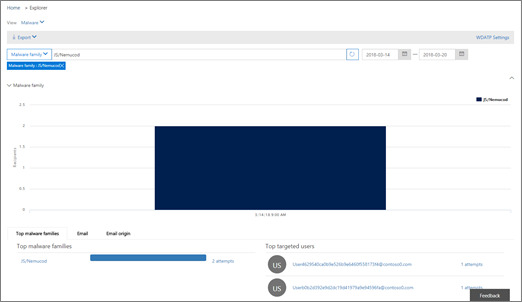
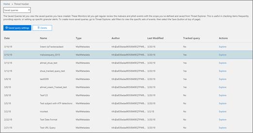

# Menaces suivis - nouvelles et utiles

[Office 365 menaces](office-365-ti.md) permet à l’équipe de sécurité de votre organisation à découvrir et à effectuer une action contre les menaces de sécurité. **Que commençant dans fin mars 2018 et sur les semaines à venir, Office 365 menaces inclura nouvelles fonctionnalités de suivi de menace**, y compris des dispositifs dignes d’intérêt. Lisez cet article pour obtenir une vue d’ensemble de ces nouvelles fonctionnalités et les étapes suivantes. 
  
## Quelles sont les menaces suivis ?

Menaces suivis sont widgets informatifs et vues qui fournissent que vous aide à la décision sur la sécurité différents problèmes qui pourraient affecter votre société. Par exemple, vous pouvez afficher plus d’informations sur l’analyse des tendances de campagnes de programmes malveillants à l’aide de dispositifs de menace.
  

  
La plupart des pages tracker inclure les numéros de tendances qui sont périodiquement mises à jour, widgets pour vous aider à comprendre les problèmes qui sont le plus élevé ou sont le plus et créer un lien dans la colonne **Actions** qui permet d’accéder à l’Explorateur de solutions, dans laquelle vous pouvez afficher plu rapidement plus d’informations. 
  

  
Les dispositifs de suivi sont quelques-unes des nombreuses fonctionnalités que vous obtenez avec [Office 365 menaces](office-365-ti.md). Lorsqu’elle est disponible, votre nouveau suivis menace inclura [suivis dignes d’intérêt](threat-trackers.md#notey), [suivis Trending](threat-trackers.md#trending), [requêtes de suivi](threat-trackers.md#trackedq)et [enregistré](threat-trackers.md#savedq).
  
Pour afficher et utiliser votre suivis menace lorsqu’ils sont disponibles pour votre organisation, accédez à la sécurité &amp; centre de conformité ([https://protection.office.com](https://protection.office.com)) et cliquez sur **Gestion des menaces** \> **suivi de menace**.
  
> [!NOTE]
> Pour utiliser les dispositifs de menace, vous devez être un administrateur global d’Office 365, un administrateur de sécurité ou un lecteur de sécurité. Voir [les autorisations de sécurité Office 365 &amp; centre de conformité](permissions-in-the-security-and-compliance-center.md). 
  
### Dispositifs dignes d’intérêt

Dispositifs dignes d’intérêt sont où vous trouverez grand et plus petits contre les menaces et les risques qui nous pensons que vous devez connaître. Dispositifs dignes d’intérêt vous aider à rechercher si ces problèmes existent dans votre environnement Office 365 et lien vers des articles (telles que celle-ci) qui vous donnent plus de détails sur ce qui se passe et leur impact utilisation de votre organisation d’Office 365. Si c’est une nouvelle menace big (par exemple, Wannacry, Petya) ou une menace existante qui peut créer certains défis (comme notre autre première dignes d’intérêt élément - Nemucod), il est où vous trouverez importantes nouveaux éléments que vous et votre équipe de sécurité doit consulter et examiner régulièrement.
  
En règle générale notables suivis seront validés pour quelques semaines lorsque nous identifier les nouvelles menaces et que vous pensez que vous devrez peut-être la visibilité supplémentaire qui fournit cette fonctionnalité. Une fois que le risque plus élevé pour une menace a réussi, nous allons supprimer que cet élément dignes d’intérêt. Ainsi, nous pouvons conserver la liste des frais et au courant des autres nouveaux éléments pertinents.
  
### Suivi des tendances

Suivi des tendances (anciennement appelé campagnes) mettre en surbrillance les nouvelles menaces qui n’ont pas été considérées dans le message électronique de votre organisation de la semaine.
  

  
Suivi des tendances vous donner une idée de nouvelles menaces, que vous devez consulter pour vérifier que votre environnement d’entreprise plus large est préparée contre les attaques.
  
### Requêtes de suivi

Requêtes marques tirer parti de vos requêtes enregistrées pour évaluer périodiquement activité Office 365 dans votre organisation. Cela vous donne un événement tendances, avec d’autres suivront dans les mois à venir. Suivi des requêtes s’exécute automatiquement, vous donnant des informations mises à jour sans avoir à mémoriser réexécuter vos requêtes.
  

  
### Requêtes enregistrées

Requêtes enregistrées sont également présents dans la section des dispositifs de suivi. Vous pouvez utiliser des requêtes enregistrées pour stocker les recherches Explorer courantes que vous souhaitez reprendre au plus rapide et à plusieurs reprises, sans avoir à recréer la recherche chaque fois.
  

  
Vous pouvez toujours enregistrer une requête tracker dignes d’intérêt ou l’un de vos propres requêtes de l’Explorateur de solutions à l’aide du bouton **Enregistrer la requête** en haut de la page de l’Explorateur de solutions. Rien enregistré il apparaîtra dans la liste des **requêtes enregistrées** dans la page de suivi. 
  
## Les dispositifs de suivi et de l’Explorateur

Si vous êtes consultant courrier électronique, du contenu ou des activités de Office (bientôt disponible), Explorer et suivis fonctionnent ensemble pour vous aider à étudier et effectuer le suivi des risques de sécurité et les menaces. Ensemble, les dispositifs de suivi fournissent des informations pour protéger vos utilisateurs Office 365 en mettant en évidence les problèmes nouveaux, notables et fréquemment recherchés - protégeant votre entreprise mieux lorsqu’il se déplace vers le nuage.
  
Quand menace suivis sont disponibles pour vous, essayez les - et n’oubliez pas que vous pouvez toujours fournir nous part de vos commentaires sur ce ou d’autres fonctionnalités de sécurité d’Office 365 en cliquant sur le bouton de **commentaires** dans le coin inférieur droit de la vue d’ensemble d’Office 365 [ Sécurité &amp; centre de conformité](https://support.office.com/article/a5f2fd18-b029-4257-b5a8-ae83e7768c85).
  

  
## Dispositifs de suivi et de Protection de Microsoft Office 365 menace avancées

Avec notre première menace dignes d’intérêt, nous mise en évidence avancées logiciels malveillants détectés par [Office 365 DAV approuvés en pièce jointe](atp-safe-attachments.md). Si vous êtes un client Office 365 entreprise E5 et que vous n’utilisez pas [Contre les menaces avancées Office 365](office-365-atp.md) (DAV), vous devez avoir : il est inclus dans votre abonnement. DAV fournit la valeur même si vous avez d’autres outils de sécurité le filtrage de flux de messagerie avec vos services Office 365. Toutefois, anti-spam et les fonctionnalités [d’Office 365 DAV fiables liens](atp-safe-links.md) fonctionnent mieux lorsque votre solution de sécurité de messagerie principale est via Office 365. 
  

  
Truffé de menace aujourd'hui, en cours d’exécution uniquement traditionnel anti-programme malveillant analyse signifie que vous ne sont pas protégés suffisamment contre les attaques. Attaques plus sophistiquées d’aujourd'hui permet de créer de nouveaux outils courants, obscurcis ou retardés contre les attaques ne sera pas reconnues par les moteurs traditionnelle basée sur les signatures contre les programmes malveillants. La fonctionnalité pièces jointes sûres DAV prend les pièces jointes et les font exploser dans un environnement virtuel pour déterminer si elles sont approuvés ou malveillant. Ce processus détonation s’ouvre chaque fichier dans un environnement d’ordinateur virtuel, puis surveille que se passe-t-il après l’ouverture du fichier. Qu’il s’agisse d’un fichier PDF et fichier compressé ou un document Office, du code malveillant peut être masqué dans un fichier, activation d’une seule fois la victime s’ouvre sur son ordinateur. Cordeaux et l’analyse du fichier dans le flux de messagerie, les fonctionnalités d’Office 365 DAV recherche ces menaces basées sur les comportements de réputation de fichier et un nombre de règles heuristiques.
  
Le nouveau filtre de menace dignes d’intérêt met en évidence les éléments qui ont été récemment détectés par le biais de pièces jointes sûres DAV. Ces détections représentent des éléments qui sont nouveaux fichiers malveillants, n’a pas été trouvées par Office 365 dans votre flux de messagerie ou courrier électronique d’autres clients. Une attention aux éléments dans le moniteur menaces dignes d’intérêt, voir qui a été prévu par les et examiner les détails de détonation indiqués sous l’onglet Analyse avancée (disponibles en cliquant sur l’objet du courrier électronique dans l’Explorateur de solutions). Remarque Vous trouverez uniquement cet onglet sur e-mails détectés par la fonctionnalité pièces jointes sûres DAV : ce suivi dignes d’intérêt inclut ce filtre, mais vous pouvez également utiliser ce filtre pour d’autres critères de recherche dans l’Explorateur de solutions.
  
## Étapes suivantes

- Si votre organisation ne possède pas d’informations sur les menaces Office 365, voir [comment obtenir Office 365 menaces ?](get-started-with-ti.md).
    
- Assurez-vous que votre équipe de sécurité a les rôles appropriés et les autorisations affectées. Vous devez être un administrateur global d’Office 365, ou avoir le rôle d’administrateur de sécurité ou de recherche et de Purge affecté de la sécurité &amp; centre de conformité. Voir [les autorisations de sécurité Office 365 &amp; centre de conformité](permissions-in-the-security-and-compliance-center.md).
    
- Surveiller les suivis nouveau s’affiche dans votre environnement Office 365. Lorsqu’elle est disponible, vous trouverez votre suivis [ici](https://protection.office.com/). Accédez à **gestion de menace** \> **suivis de menace**.
    
- Si vous n’avez pas déjà fait, en savoir plus sur et configurer [Office 365 avancée protection contre les menaces](office-365-atp.md) pour votre organisation, y compris les [liens sans échec Office 365 DAV](atp-safe-links.md) et [Office 365 DAV approuvés en pièce jointe](atp-safe-attachments.md).
  

