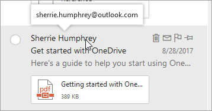

# Expéditeur non vérifiéUnverified Sender

Pour empêcher les messages de hameçonnage d’atteindre votre boîte aux lettres, Outlook.com et Outlook sur le Web Vérifiez que l’expéditeur est bien ce qu’il dit, et marquez les messages suspects comme courrier indésirable.To prevent phishing messages from reaching your mailbox, Outlook.com and Outlook on the web verify that the sender is who they say they are and mark suspicious messages as junk email.

> [!IMPORTANT]
> Lorsqu’un message est marqué comme frauduleux de hameçonnage, Outlook.com et Outlook sur le Web affichent un avertissement en haut de la page, mais vous pouvez toujours ouvrir les liens figurant dans le message.When a message is marked as a phishing scam, Outlook.com and Outlook on the web display a warning at the top of the page, but any links in the message can still be opened.

## Comment puis-je identifier un message suspect dans ma boîte de réception?How can I identify a suspicious message in my inbox?

Outlook.com et Outlook sur le Web affichent des indicateurs lorsque l’expéditeur d’un message ne peut pas être identifié ou que son identité est différente de ce que vous voyez dans l’adresse de l’expéditeur.Outlook.com and Outlook on the web show indicators when the sender of a message either can't be identified or their identity is different from what you see in the From address.

## Comment gérer les messages qui reçoivent le traitement de l’expéditeur non vérifiéHow to manage which messages receive the unverified sender treatment 

Si vous êtes un client Office 365, vous pouvez gérer cette fonctionnalité via le centre de sécurité & Compliance Center.If you are an Office 365 customer you can manage this feature through the Security & Compliance Center. 

- Dans le centre de sécurité & de la sécurité d’Office 365, les administrateurs du client peuvent activer ou désactiver la fonctionnalité de protection contre l’usurpation d’identité dans le cadre de la stratégie anti-hameçonnage.In the Office 365 Security & Compliance Center, tenant admins can turn the feature on, or off, through the Anti-spoofing protection under the Anti-Phish policy. En outre, elle peut être gérée via la cmdlet «Set-Antiphishpolicy permet».Additionally, it can be managed through the ‘Set-AntiPhishPolicy’ cmdlet. Pour plus d’informations, consultez la rubrique anti-phishing protection in Office 365 et Set-Antiphishpolicy permet.For more details, see Anti-phishing protection in Office 365 and Set-AntiPhishPolicy.

    

- Si un administrateur a identifié un faux positif et qu’un expéditeur ne doit pas recevoir le traitement de l’expéditeur non vérifié, il peut effectuer l’une des actions suivantes pour ajouter l’expéditeur à la liste des usurpations d’identité usurpée:If an admin has identified a false positive, and a sender should not be receiving the unverified sender treatment they can take one of the following actions to add the sender to the Spoof Intelligence spoof allow list:
        
    - Ajoutez la paire de domaines par le biais de la vue d’aide à la décision.Add the domain pair through the Spoof Intelligence Insight. Pour plus d’informations, voir procédure pas à pas: usurpation d’informationFor more details, see Walkthrough: spoof intelligence insight
                
    - Ajoutez la paire de domaines via l’applet de commande PhishFilterPolicy.Add the domain pair through the PhishFilterPolicy cmdlet. Pour plus d’informations, voir Set-PhishFilterPolicy et protection contre la falsification dans Office 365For more details, see Set-PhishFilterPolicy and Anti-spoofing protection in Office 365

En outre, nous n’appliquons pas le traitement de l’expéditeur non vérifié s’il a été remis à la boîte de réception via une liste verte d’administration, y compris les règles de transport de messagerie (ETR), la liste des domaines approuvés (stratégie anti-spam), la liste des expéditeurs approuvés ou un utilisateur a défini cet utilisateur comme «expéditeur approuvé» dans son utilitaire.Additionally, we do not apply the unverified sender treatment if it was delivered to the inbox via an admin allow list, including Email Transport Rules (ETRs), Safe Domain List (Anti-Spam Policy), Safe Sender List or a user has set this user as a “Safe Sender” in their inbox.

### Un «?» apparaît dans l’image de l’expéditeurYou see a '?' in the sender image

Lorsque Outlook.com et Outlook sur le Web ne peuvent pas vérifier l’identité de l’expéditeur à l’aide des techniques d’authentification de messagerie, ils affichent un «?» dans la photo de l’expéditeur.When Outlook.com and Outlook on the web can't verify the identity of the sender using email authentication techniques, they display a '?' in the sender photo. 

Les messages qui ne parvient pas à s’authentifier ne sont pas tous malveillants.Not every message that fails to authenticate is malicious. Toutefois, vous devez être prudent quant à l’interaction avec les messages qui ne sont pas authentifiés si vous ne reconnaissez pas l’expéditeur.However, you should be careful about interacting with messages that don't authenticate if you don't recognize the sender. Ou, si vous reconnaissez un expéditeur qui ne possède pas de «?» normalement dans l’image de l’expéditeur, mais que vous le voyez soudainement, cela peut être un signe que l’expéditeur est usurpé.Or, if you recognize a sender that normally doesn't have a '?' in the sender image, but you suddenly start seeing it, that could be a sign the sender is being spoofed.

### L’adresse de l’expéditeur est différente de celle qui apparaît dans l’adresse de l’expéditeurThe sender's address is different than what appears in the From address

Bien souvent, l’adresse de messagerie que vous voyez dans un message est différente de celle que vous voyez dans l’adresse de l’adresse.Frequently, the email address you see in a message is different than what you see in the From address. Parfois, les auteurs de phishing essaient de vous tromper en pensant que l’expéditeur est une personne qui n’est pas vraiment.Sometimes phishers try to trick you into thinking that the sender is someone other than who they really are.

Lorsque Outlook.com et Outlook sur le Web détectent une différence entre l’adresse réelle de l’expéditeur et l’adresse de l’adresse de, ils affichent l’expéditeur réel à l’aide de la balise via, qui est soulignée.When Outlook.com and Outlook on the web detect a difference between the sender's actual address and the address on the From address, they show the actual sender using the via tag, which will be underlined.

Dans cet exemple, le domaine `suspicious.com` d’envoi est authentifié, mais celui-ci est `unknown@contoso.com` placé dans l’adresse de l’expéditeur.In this example, the sending domain `suspicious.com` is authenticated, but the sender put `unknown@contoso.com` in the From address.

Tous les messages avec une balise via ne sont pas suspects.Not every message with a via tag is suspicious. Toutefois, si vous ne reconnaissez pas un message avec une balise via, soyez prudent lors de l’interaction avec celui-ci.However, if you don't recognize a message with a via tag, you should be cautious about interacting with it.

Dans Outlook.com et le nouveau Outlook sur le Web, vous pouvez placer le curseur sur le nom ou l’adresse de l’expéditeur dans la liste des messages pour voir son adresse de messagerie, sans avoir à ouvrir le message.In Outlook.com and the new Outlook on the web, you can hover your cursor over a sender's name or address in the message list to see their email address, without needing to open the message.

Comment savoir si vous utilisez le nouveau Outlook sur le Web?How do you know if you're using the new Outlook on the web? Consultez les exemples suivants:See the following examples:

## Questions fréquemment poséesFrequently asked questions

### Quels critères les Outlook.com et Outlook sur le Web utilisent-ils pour ajouter les propriétés «?» et «via»?What criteria does Outlook.com and Outlook on the web use to add the '?' and the 'via' properties?

Pour le «?» de l’image de l’expéditeur: Outlook.com requiert que le message passe l’authentification SPF ou DKIM.For the '?' in the sender image:  Outlook.com requires that the message pass either SPF or DKIM authentication. Pour plus d’informations, reportez-vous à la rubrique [set up SPF in Office 365 pour éviter l’usurpation](set-up-spf-in-office-365-to-help-prevent-spoofing.md) et l' [utilisation de DKIM pour valider les messages sortants envoyés à partir de votre domaine personnalisé dans Office 365](use-dkim-to-validate-outbound-email.md).For more details, see [Set up SPF in Office 365 to help prevent spoofing](set-up-spf-in-office-365-to-help-prevent-spoofing.md) and [Use DKIM to validate outbound email sent from your custom domain in Office 365](use-dkim-to-validate-outbound-email.md).

Pour la balise via: si le domaine de l’adresse de l’expéditeur est différent du domaine dans la signature DKIM ou SMTP MAIL FROM, Outlook.com affiche le domaine dans l’un de ces deux champs (en préférant la signature DKIM).For the via tag: If the domain in the From address is different from the domain in the DKIM signature or the SMTP MAIL FROM, Outlook.com displays the domain in one of those two fields (preferring the DKIM signature).

### Puis-je remplacer ces propriétés par le biais de l’IP autorisé, la règle de transport Exchange autorise ou les expéditeurs approuvés?Can I override these properties with IP Allows, Exchange Transport Rule Allows, or safe senders?

Vous ne pouvez pas remplacer ces propriétés.You can't override these properties.

### Comment puis-je supprimer ces propriétés?How do I remove these properties?

Pour le «?» de l’image de l’expéditeur: en tant qu’expéditeur, vous devez authentifier votre message avec SPF ou DKIM.For the '?' in the sender image: As a sender, you should authenticate your message with either SPF or DKIM.

Pour la balise via: en tant qu’expéditeur, vous devez vous assurer que le domaine dans la signature DKIM ou SMTP MAIL FROM est le même que le domaine de l’adresse de provenance ou qu’il s’agit d’un sous-domaine de celui-ci.For the via tag: As a sender, you should ensure that either the domain in the DKIM signature or the SMTP MAIL FROM is the same as, or is a subdomain of, the domain in the From address.

### Est-ce que Outlook.com et Outlook sur le Web s’affichent pour chaque message qui ne passe pas l’authentification?Does Outlook.com and Outlook on the web show this for every message that doesn’t pass authentication?

Pas nécessairement.Not necessarily. Outlook.com et Outlook sur le Web peuvent avoir d’autres propriétés dans le message pour authentifier l’expéditeur.Outlook.com and Outlook on the web may have other properties within the message to authenticate the sender.

## Sujets associésRelated topics

[Protéger votre compte de messagerie Outlook.comHelp protect your Outlook.com email account](https://support.office.com/article/a4f20fc5-4307-4ece-8231-6d4d4bd8a9ba)

[Gérer les abus, le hameçonnage ou l’usurpation d’identité dans Outlook.comDeal with abuse, phishing, or spoofing in Outlook.com](https://support.office.com/article/0d882ea5-eedc-4bed-aebc-079ffa1105a3)

[Filtrage du courrier indésirable et du courrier indésirable dans Outlook sur le WebFilter junk email and spam in Outlook on the web](https://support.office.com/article/db786e79-54e2-40cc-904f-d89d57b7f41d)
