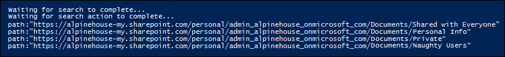

# <a name="use-content-search-in-office-365-for-targeted-collections"></a>Utiliser la recherche de contenu dans Office 365 pour les collections ciblées

La fonctionnalité de recherche de contenu dans le centre &amp; de sécurité conformité Office 365 ne fournit pas une méthode directe dans l'interface utilisateur pour rechercher des dossiers spécifiques dans des boîtes aux lettres Exchange ou des sites SharePoint et OneDrive entreprise. Toutefois, il est possible de rechercher des dossiers spécifiques (appelés une *collection ciblée*) en spécifiant l'ID ou le chemin d'accès du dossier dans la syntaxe de requête de recherche réelle. L'utilisation de la recherche de contenu pour effectuer une collection ciblée est utile lorsque vous êtes certain que les éléments réactifs à un cas ou des éléments privilégiés se trouvent dans une boîte aux lettres ou un dossier de site spécifique. Vous pouvez utiliser le script de cet article pour obtenir l'ID de dossier pour les dossiers de boîte aux lettres ou le chemin d'accès aux dossiers sur un site SharePoint et OneDrive entreprise. Vous pouvez ensuite utiliser le chemin d'accès ou l'ID du dossier dans une requête de recherche pour renvoyer les éléments se trouvant dans le dossier.
  
## <a name="before-you-begin"></a>Avant de commencer

- Vous devez être membre du groupe de rôles gestionnaire eDiscovery dans le centre de sécurité &amp; conformité pour exécuter le script à l'étape 1. Pour plus d'informations, consultez [la rubrique attribution d'autorisations eDiscovery dans &amp; le centre de sécurité conformité Office 365](assign-ediscovery-permissions.md).
    
    De plus, vous devez disposer du rôle destinataires de messagerie dans votre organisation Exchange Online. Cette opération est nécessaire pour exécuter la cmdlet **Get-MailboxFolderStatistics** , qui est incluse dans le script à l'étape 1. Par défaut, le rôle destinataires de messagerie est affecté aux groupes de rôles gestion de l'organisation et gestion des destinataires dans Exchange Online. Pour plus d'informations sur l'attribution d'autorisations dans Exchange Online, consultez la rubrique [Manage Role Group members](https://go.microsoft.com/fwlink/p/?linkid=692102). Vous pouvez également créer un groupe de rôles personnalisé, lui attribuer le rôle destinataires de messagerie, puis ajouter les membres qui doivent exécuter le script à l'étape 1. Pour plus d'informations, consultez la rubrique [Gérer des groupes de rôles](https://go.microsoft.com/fwlink/p/?linkid=730688).
    
- Chaque fois que vous exécutez le script à l'étape 1, une nouvelle session PowerShell distante est créée. Vous pouvez donc utiliser toutes les sessions PowerShell distantes disponibles. Pour éviter ce problème, vous pouvez exécuter la commande suivante pour déconnecter vos sessions PowerShell à distance actives.
    
  ```
  Get-PSSession | Remove-PSSession
  ```

    Pour plus d'informations, reportez-vous à [Connexion à Exchange Online](https://go.microsoft.com/fwlink/p/?linkid=396554).
    
- Le script inclut une gestion des erreurs minimale. Le principal objectif du script est d'afficher rapidement une liste des ID de dossier ou des chemins d'accès de site qui peuvent être utilisés dans la syntaxe de requête de recherche d'une recherche de contenu pour effectuer une collection ciblée.
    
- L'exemple de script fourni dans cette rubrique n'est pas pris en charge dans le cadre d'un service ou d'un programme de support standard Microsoft. L'exemple de script est fourni en l'État sans aucune garantie. Microsoft exclut toute garantie implicite, y compris, sans limitation, les garanties implicites de qualité marchande ou d'adéquation à un usage particulier. L'ensemble des risques liés à l'utilisation ou aux performances de l'exemple de script et de la documentation reste avec vous. En aucun cas, Microsoft, ses auteurs ou toute personne impliquée dans la création, la production ou la livraison des scripts ne sont responsables de dommages quelconques (y compris, sans limitation, pertes de bénéfices, interruption d'activité, perte d'informations commerciales ou toute autre perte pécuniaire) découlant de l'utilisation ou de l'impossibilité d'utiliser les exemples de scripts ou la documentation, même si Microsoft a été informé de la possibilité de tels dommages.
  
## <a name="step-1-run-the-script-to-get-a-list-of-folders-for-a-mailbox-or-site"></a>Étape 1: exécuter le script pour obtenir la liste des dossiers d'une boîte aux lettres ou d'un site

Le script que vous exécutez dans cette première étape renverra une liste de dossiers de boîte aux lettres ou de dossiers SharePoint ou OneDrive entreprise, ainsi que le chemin d'accès ou l'ID de dossier correspondant pour chaque dossier. Lorsque vous exécutez ce script, il vous invite à fournir les informations suivantes.
  
- **Adresse de messagerie ou URL de site** Tapez une adresse de messagerie du dépositaire pour renvoyer la liste des dossiers de boîte aux lettres Exchange et les ID de dossier. Ou tapez l'URL d'un site SharePoint ou d'un site OneDrive entreprise pour renvoyer une liste de chemins d'accès pour le site spécifié. Voici quelques exemples : 
    
  - **Exchange** -stacig@contoso.onmicrosoft.com 
    
  - **SharePoint** - https://contoso.sharepoint.com/sites/marketing 
    
  - **OneDrive entreprise** - https://contoso-my.sharepoint.com/personal/stacig_contoso_onmicrosoft_com 
    
- **Vos informations d'identification utilisateur** : le script utilisera vos informations d'identification pour se connecter à Exchange Online &amp; et au centre de sécurité conformité avec PowerShell à distance. Comme expliqué précédemment, vous devez disposer des autorisations appropriées pour exécuter ce script.
    
Pour afficher la liste des dossiers de boîte aux lettres ou documentlink de site (chemin d'accès), procédez comme suit:
  
1. Enregistrez le texte suivant dans un fichier de script Windows PowerShell à l'aide d'un suffixe de nom de fichier. ps1; par exemple, `GetFolderSearchParameters.ps1`.
    
  ```
  #########################################################################################################
  # This PowerShell script will prompt you for:                             #
  #    * Admin credentials for a user who can run the Get-MailboxFolderStatistics cmdlet in Exchange    #
  #      Online and who is an eDiscovery Manager in the Security &amp; Compliance Center.           #
  # The script will then:                                           #
  #    * If an email address is supplied: list the folders for the target mailbox.          #
  #    * If a SharePoint or OneDrive for Business site is supplied: list the documentlinks (folder paths) #
  #    * for the site.                                                                                  #
  #    * In both cases, the script supplies the correct search properties (folderid: or documentlink:)  #
  #      appended to the folder ID or documentlink to use in a Content Search.              #
  # Notes:                                              #
  #    * For SharePoint and OneDrive for Business, the paths are searched recursively; this means the   #
  #      the current folder and all sub-folders are searched.                       #
  #    * For Exchange, only the specified folder will be searched; this means sub-folders in the folder #
  #      will not be searched.  To search sub-folders, you need to use the specify the folder ID for    #
  #      each sub-folder that you want to search.                               #
  #    * For Exchange, only folders in the user's primary mailbox will be returned by the script.       #
  #########################################################################################################
  # Collect the target email address or SharePoint Url
  $addressOrSite = Read-Host "Enter an email address or a URL for a SharePoint or OneDrive for Business site"
  # Authenticate with Exchange Online and the Security &amp; Compliance Center (Exchange Online Protection - EOP)
  if (!$credentials)
  {
      $credentials = Get-Credential
  }
  if ($addressOrSite.IndexOf("@") -ige 0)
  {
      # List the folder Ids for the target mailbox
      $emailAddress = $addressOrSite
      # Authenticate with Exchange Online
      if (!$ExoSession)
      {
          $ExoSession = New-PSSession -ConfigurationName Microsoft.Exchange -ConnectionUri https://ps.outlook.com/powershell-liveid/ -Credential $credentials -Authentication Basic -AllowRedirection
          Import-PSSession $ExoSession -AllowClobber -DisableNameChecking
      }
      $folderQueries = @()
      $folderStatistics = Get-MailboxFolderStatistics $emailAddress
      foreach ($folderStatistic in $folderStatistics)
      {
          $folderId = $folderStatistic.FolderId;
          $folderPath = $folderStatistic.FolderPath;
          $encoding= [System.Text.Encoding]::GetEncoding("us-ascii")
          $nibbler= $encoding.GetBytes("0123456789ABCDEF");
          $folderIdBytes = [Convert]::FromBase64String($folderId);
          $indexIdBytes = New-Object byte[] 48;
          $indexIdIdx=0;
          $folderIdBytes | select -skip 23 -First 24 | %{$indexIdBytes[$indexIdIdx++]=$nibbler[$_ -shr 4];$indexIdBytes[$indexIdIdx++]=$nibbler[$_ -band 0xF]}
          $folderQuery = "folderid:$($encoding.GetString($indexIdBytes))";
          $folderStat = New-Object PSObject
          Add-Member -InputObject $folderStat -MemberType NoteProperty -Name FolderPath -Value $folderPath
          Add-Member -InputObject $folderStat -MemberType NoteProperty -Name FolderQuery -Value $folderQuery
          $folderQueries += $folderStat
      }
      Write-Host "-----Exchange Folders-----"
      $folderQueries |ft
  }
  elseif ($addressOrSite.IndexOf("http") -ige 0)
  {
      $searchName = "SPFoldersSearch"
      $searchActionName = "SPFoldersSearch_Preview"
      # List the folders for the SharePoint or OneDrive for Business Site
      $siteUrl = $addressOrSite
      # Authenticate with the Security &amp; Compliance Center
      if (!$SccSession)
      {
          $SccSession = New-PSSession -ConfigurationName Microsoft.Exchange -ConnectionUri https://ps.compliance.protection.outlook.com/powershell-liveid -Credential $credentials -Authentication Basic -AllowRedirection
          Import-PSSession $SccSession -AllowClobber -DisableNameChecking
      }
      # Clean-up, if the script was aborted, the search we created might not have been deleted.  Try to do so now.
      Remove-ComplianceSearch $searchName -Confirm:$false -ErrorAction 'SilentlyContinue'
      # Create a Content Search against the SharePoint Site or OneDrive for Business site and only search for folders; wait for the search to complete
      $complianceSearch = New-ComplianceSearch -Name $searchName -ContentMatchQuery "contenttype:folder" -SharePointLocation $siteUrl
      Start-ComplianceSearch $searchName
      do{
          Write-host "Waiting for search to complete..."
          Start-Sleep -s 5
          $complianceSearch = Get-ComplianceSearch $searchName
      }while ($complianceSearch.Status -ne 'Completed')
      if ($complianceSearch.Items -gt 0)
      {
          # Create a Compliance Search Action and wait for it to complete. The folders will be listed in the .Results parameter
          $complianceSearchAction = New-ComplianceSearchAction -SearchName $searchName -Preview
          do
          {
              Write-host "Waiting for search action to complete..."
              Start-Sleep -s 5
              $complianceSearchAction = Get-ComplianceSearchAction $searchActionName
          }while ($complianceSearchAction.Status -ne 'Completed')
          # Get the results and print out the folders
          $results = $complianceSearchAction.Results
          $matches = Select-String "Data Link:.+[,}]" -Input $results -AllMatches
          foreach ($match in $matches.Matches)
          {
              $rawUrl = $match.Value
              $rawUrl = $rawUrl -replace "Data Link: " -replace "," -replace "}"
              Write-Host "DocumentLink:""$rawUrl"""
          }
      }
      else
      {
          Write-Host "No folders were found for $siteUrl"
      }
      Remove-ComplianceSearch $searchName -Confirm:$false -ErrorAction 'SilentlyContinue'
  }
  else
  {
      Write-Error "Couldn't recognize $addressOrSite as an email address or a site URL"
  }
  ```

2. Sur votre ordinateur local, ouvrez Windows PowerShell et accédez au dossier où vous avez enregistré le script.
    
3. Exécutez le script; par exemple:
    
      ```
      .\GetFolderSearchParameters.ps1
      ```

4. Entrez les informations que le script vous demande.
    
    Le script affiche une liste de dossiers de boîte aux lettres ou de dossier de site pour l'utilisateur spécifié. Laissez cette fenêtre ouverte afin de pouvoir copier un ID de dossier ou un nom de chemin d'accès et collez-le dans une requête de recherche à l'étape 2.
    
    > [!TIP]
    > Au lieu d'afficher une liste de dossiers sur l'écran de l'ordinateur, vous pouvez rediriger la sortie du script vers un fichier texte. Ce fichier sera enregistré dans le dossier où se trouve le script. Par exemple, pour rediriger la sortie du script vers un fichier texte, exécutez la commande suivante à l'étape `.\GetFolderSearchParameters.ps1 > StacigFolderIds.txt` 3: vous pouvez ensuite copier un ID ou un chemin d'accès de dossier à utiliser dans une requête de recherche.
  
### <a name="script-output-for-mailbox-folders"></a>Sortie du script pour les dossiers de boîte aux lettres

Si vous obtenez des ID de dossier de boîte aux lettres, le script se connecte à Exchange Online à l'aide de PowerShell à distance, exécute la cmdlet **Get-MailboxFolderStatisics** , puis affiche la liste des dossiers de la boîte aux lettres spécifiée. Pour chaque dossier de la boîte aux lettres, le script affiche le nom du dossier dans la colonne **folderPath** et l'ID de dossier dans la colonne **FolderQuery** . En outre, le script ajoute le préfixe **FolderId** (qui est le nom de la propriété Mailbox) à l'ID du dossier. Étant donné que la propriété **FolderId** est une propriété pouvant faire l'objet `folderid:<folderid>` d'une recherche, vous utiliserez dans une requête de recherche à l'étape 2 pour rechercher ce dossier. 

> [!IMPORTANT]
> Le script de cet article inclut une logique de codage qui convertit les valeurs d'ID de dossier de 64 caractères renvoyées par **Get-MailboxFolderStatistics** au même format de 48 caractères que celui indexé pour la recherche. Si vous exécutez simplement la cmdlet **Get-MailboxFolderStatistics** dans PowerShell pour obtenir un ID de dossier (au lieu d'exécuter le script de cet article), une requête de recherche qui utilise cette valeur d'ID de dossier échouera. Vous devez exécuter le script pour obtenir les ID de dossier correctement mis en forme qui peuvent être utilisés dans une recherche de contenu.
  
Voici un exemple de la sortie renvoyée par le script pour les dossiers de boîte aux lettres.
  

  
L'exemple de l'étape 2 montre la requête utilisée pour rechercher le sous-dossier purges dans le dossier éléments récupérables de l'utilisateur.
  
### <a name="script-output-for-site-folders"></a>Sortie du script pour les dossiers de site

Si vous obtenez documentlinks à partir de sites SharePoint ou OneDrive entreprise, le script se connecte au &amp; Centre de sécurité conformité à l'aide de PowerShell à distance, crée une recherche de contenu qui recherche les dossiers sur le site, puis affiche la liste des dossiers situés dans le site spécifié. Le script affiche le nom de chaque dossier et ajoute le préfixe du **chemin d'accès** (qui est le nom de la propriété de site) à l'URL du dossier. Étant donné que la propriété **path** est une propriété pouvant faire l'objet `path:<path>` d'une recherche, vous utiliserez dans une requête de recherche à l'étape 2 pour rechercher ce dossier. 
  
Voici un exemple de la sortie renvoyée par le script pour les dossiers de site.
  

  
## <a name="step-2-use-a-folder-id-or-documentlink-to-perform-a-targeted-collection"></a>Étape 2: utiliser un ID de dossier ou documentlink pour effectuer une collection ciblée

Une fois que vous avez exécuté le script pour collecter une liste d'ID de dossiers ou de documentlinks pour un utilisateur spécifique, l'étape suivante consiste &amp; à accéder au centre de sécurité conformité et à créer une recherche de contenu pour rechercher un dossier spécifique. Vous utiliserez la `folderid:<folderid>` propriété `documentlink:<path>` ou dans la requête de recherche que vous configurez dans la zone de mot clé de recherche de contenu (ou en tant que valeur du paramètre *ContentMatchQuery* si vous utilisez la cmdlet **New-ComplianceSearch** ). Vous pouvez combiner la `folderid` propriété `documentlink` ou avec d'autres paramètres de recherche ou conditions de recherche. Si vous incluez uniquement `folderid` la `documentlink` propriété ou dans la requête, la recherche renverra tous les éléments situés dans le dossier spécifié. 
  
1. Accédez à [https://protection.office.com](https://protection.office.com).
    
2. Connectez-vous à Office 365 à l'aide du compte et des informations d'identification que vous avez utilisés pour exécuter le script à l'étape 1.
    
3. Dans le volet gauche du centre de &amp; sécurité conformité, cliquez sur **recherche de contenu**d'enquête \> de **recherche &amp; ** , puis cliquez](media/O365-MDM-CreatePolicy-AddIcon.gif)sur **nouvelle** ![icône Ajouter.
    
4. Sur la page **Nouvelle recherche**, entrez un nom pour la recherche de contenu. Ce nom doit être unique dans votre organisation. 
    
5. Sous **où souhaitez-vous Rechercher**, effectuez l'une des opérations suivantes, selon que vous recherchez un dossier de boîte aux lettres ou un dossier de site:
    
    - Cliquez sur **choisir des boîtes aux lettres spécifiques à rechercher** , puis ajoutez la même boîte aux lettres que celle que vous avez spécifiée lors de l'exécution du script à l'étape 1. 
    
      Ou
    
    - Cliquez sur **choisir des sites spécifiques à** Rechercher, puis ajoutez l'URL de site que vous avez spécifiée lors de l'exécution du script à l'étape 1. 
    
6. Cliquez sur **Suivant**.
    
7. Dans la zone mot clé de la page **que souhaitez-vous Rechercher** , collez la `folderid:<folderid>` valeur ou `documentlink:<path>` qui a été renvoyée par le script à l'étape 1. 
    
    Par exemple, la requête de la capture d'écran suivante recherche tout élément dans le sous-dossier purges du dossier éléments récupérables de l'utilisateur (la valeur `folderid` de la propriété pour le sous-dossier purges est illustrée dans la capture d'écran de l'étape 1):
    
    
  
8. Cliquez sur **Rechercher** pour lancer la recherche cible de la collection. 
  
### <a name="examples-of-search-queries-for-targeted-collections"></a>Exemples de requêtes de recherche pour des collections ciblées

Voici quelques exemples d'utilisation des propriétés `folderid` et `documentlink` dans une requête de recherche pour effectuer une collection ciblée. Notez que les espaces réservés sont utilisés `folderid:<folderid>` pour `documentlink:<path>` économiser de l'espace. 
  
- Cet exemple montre comment rechercher trois dossiers de boîte aux lettres différents. Vous pouvez utiliser une syntaxe de requête similaire pour effectuer une recherche dans les dossiers cachés dans le dossier éléments récupérables d'un utilisateur.
    
  ```
  folderid:<folderid> OR folderid:<folderid> OR folderid:<folderid>
  ```

- Cet exemple montre comment rechercher dans un dossier de boîte aux lettres des éléments qui contiennent une expression exacte.
    
  ```
  folderid:<folderid> AND "Contoso financial results"
  ```

- Cet exemple montre comment rechercher dans un dossier de site (et tous les sous-dossiers) les documents qui contiennent les lettres «NDA» dans le titre.
    
  ```
  documentlink:<path> AND filename:nda
  ```

- Cet exemple recherche dans un dossier de site (et dans un sous-dossier) les documents qui ont été modifiés au cours d'une plage de dates.
    
  ```
  documentlink:<path> AND (lastmodifiedtime>=01/01/2017 AND lastmodifiedtime<=01/21/2017)
  ```
  
## <a name="more-information"></a>Plus d’informations

Lors de l'utilisation du script de cet article, vous devez tenir compte des points suivants pour effectuer des collections ciblées.
  
- Le script ne supprime aucun dossier des résultats. Par conséquent, il se peut que certains dossiers figurant dans les résultats ne puissent pas faire l'objet d'une recherche (ou ne renvoient aucun élément), car ils contiennent du contenu généré par le système.
    
- Ce script renvoie uniquement les informations de dossier de la boîte aux lettres principale de l'utilisateur. Il ne retourne pas d'informations sur les dossiers dans la boîte aux lettres d'archivage de l'utilisateur.
    
- Lors de la recherche de dossiers de boîte aux lettres, seul le `folderid` dossier spécifié (identifié par sa propriété) est recherché. Les sous-dossiers ne feront pas l'objet d'une recherche. Pour rechercher des sous-dossiers, vous devez utiliser l'ID de dossier pour le sous-dossier dans lequel vous souhaitez effectuer la recherche. 
    
- Lors de la recherche de dossiers de site, le dossier `documentlink` (identifié par sa propriété) et tous les sous-dossiers feront l'objet d'une recherche. 
    
- Lorsque vous exportez les résultats d'une recherche dans laquelle vous `folderid` avez spécifié la propriété uniquement dans la requête de recherche, vous pouvez choisir la première option d'exportation, «tous les éléments, sauf ceux dont le format n'est pas reconnu, sont chiffrés ou n'ont pas été indexés pour d'autres raisons». Tous les éléments du dossier sont toujours exportés, quel que soit leur état d'indexation, car l'ID de dossier est toujours indexé.
